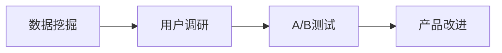

                 

# AI创业公司的用户反馈分析与产品改进：数据挖掘、用户调研与A/B测试

## 1. 背景介绍

随着人工智能(AI)技术的快速发展，越来越多的AI创业公司涌现出来，它们试图通过先进的数据挖掘和机器学习算法来提升产品的竞争力，满足用户需求，提升用户体验。用户反馈是这些公司产品改进的重要依据，但如何从海量用户数据中提取有价值的信息，并基于此进行产品迭代优化，是一个充满挑战的问题。本文将从数据挖掘、用户调研和A/B测试三个方面探讨AI创业公司如何有效利用用户反馈改进产品。

## 2. 核心概念与联系

### 2.1 核心概念概述

为更好地理解本文的核心内容，我们先介绍几个关键概念：

- **数据挖掘(Data Mining)**：从大量数据中提取有用的信息和知识的过程，主要应用统计学、机器学习等方法。
- **用户调研(User Research)**：通过问卷调查、访谈、观察等手段获取用户对产品的使用感受和需求，进而指导产品改进。
- **A/B测试(A/B Testing)**：通过对比不同版本的产品，以评估新功能的可行性和效果，从而做出数据驱动的产品决策。

### 2.2 核心概念原理和架构的 Mermaid 流程图



这个简单的流程图展示了数据挖掘、用户调研和A/B测试之间的关系：数据挖掘是从用户数据中提取有价值的信息，用户调研是基于这些信息获取用户的真实需求，而A/B测试则是对产品改进的决策提供依据。

## 3. 核心算法原理 & 具体操作步骤

### 3.1 算法原理概述

AI创业公司产品改进的核心在于数据分析，即通过科学的方法从用户反馈数据中挖掘有用的信息，发现用户需求和产品问题，并通过数据分析指导产品改进。以下是核心算法原理的概述：

- **数据挖掘**：通过聚类、分类、关联规则等算法对用户数据进行分析，找出用户行为和需求的规律和模式。
- **用户调研**：利用问卷调查、访谈等手段收集用户反馈，了解用户的真实需求和使用体验，从而明确产品改进方向。
- **A/B测试**：随机将用户分为两组，分别测试不同版本的产品，通过比较两组的效果来评估新功能的可行性。

### 3.2 算法步骤详解

#### 数据挖掘步骤：

1. **数据收集**：从网站、移动应用等渠道收集用户数据，包括使用行为数据、交易数据、用户反馈等。
2. **数据预处理**：清洗数据，去除重复、噪声和缺失值，确保数据质量。
3. **特征工程**：提取和构建有意义的特征，如用户访问频率、使用路径、交易金额等。
4. **模型训练**：选择合适的算法进行训练，如聚类、分类、关联规则等。
5. **结果分析**：分析模型结果，发现用户行为和需求的规律和模式，生成报告。

#### 用户调研步骤：

1. **问卷设计**：根据数据分析结果，设计有针对性的问卷，包含开放式和封闭式问题。
2. **样本选择**：从用户群体中选择代表性样本，保证调研结果的普适性。
3. **数据收集**：通过线上线下的方式收集用户反馈。
4. **数据分析**：对收集的数据进行整理和分析，找出用户需求和问题。
5. **结果反馈**：将分析结果反馈给产品团队，指导产品改进。

#### A/B测试步骤：

1. **测试设计**：确定测试目标和指标，如页面加载速度、转化率等。
2. **分组实验**：将用户随机分为两组，A组体验原始版本，B组体验改进版本。
3. **实验实施**：两组用户在不同的环境中使用产品。
4. **数据收集**：收集两组用户的反馈和行为数据。
5. **结果分析**：对比两组数据，评估新功能的可行性和效果。
6. **决策制定**：根据测试结果，决定是否将改进功能上线。

### 3.3 算法优缺点

#### 数据挖掘：

**优点**：
- 能够从大数据中提取有用的信息和知识，指导产品改进。
- 能够发现用户行为和需求的规律和模式。

**缺点**：
- 需要大量的数据和复杂的算法，可能存在过拟合和欠拟合的问题。
- 结果解释性和可理解性不足，不易指导实际应用。

#### 用户调研：

**优点**：
- 直接获取用户的真实需求和反馈，更加直观和具体。
- 能够发现用户使用过程中遇到的具体问题和痛点。

**缺点**：
- 调研结果可能受样本选择偏差和用户主观因素影响。
- 成本较高，需要投入大量时间和人力。

#### A/B测试：

**优点**：
- 数据驱动决策，可以客观评估新功能的可行性和效果。
- 通过对比实验，快速迭代产品改进。

**缺点**：
- 测试周期较长，可能需要多次迭代才能确定最优方案。
- 结果可能受测试环境和方法的影响，存在误差。

### 3.4 算法应用领域

数据挖掘、用户调研和A/B测试广泛应用于各种类型的AI创业公司，如电子商务、金融科技、智能家居、医疗健康等。

- **电子商务**：通过分析用户购买行为和交易数据，发现用户需求和趋势，指导产品改进和商品推荐。
- **金融科技**：利用数据分析风险评估和欺诈检测，提高金融产品的安全性和用户体验。
- **智能家居**：通过分析用户使用数据，发现设备使用习惯和偏好，优化产品功能和界面设计。
- **医疗健康**：利用用户健康数据进行疾病预测和个性化健康管理，提升用户健康水平。

## 4. 数学模型和公式 & 详细讲解 & 举例说明

### 4.1 数学模型构建

数据挖掘和A/B测试中的许多算法都可以用数学模型来描述。这里我们选择聚类算法和假设检验模型进行介绍。

#### 聚类算法

聚类算法是数据挖掘中常用的无监督学习方法，其数学模型可以表示为：

$$
\min_{\mathbf{W}} \|\mathbf{X} - \mathbf{W}\mathbf{Z}\|_F^2 + \lambda \|\mathbf{Z}\|_F^2
$$

其中，$\mathbf{X}$ 是数据矩阵，$\mathbf{W}$ 是投影矩阵，$\mathbf{Z}$ 是投影后的数据矩阵，$\lambda$ 是正则化系数。

#### 假设检验模型

假设检验模型用于A/B测试中的结果分析，以确定新功能的可行性。常用的假设检验方法包括t检验和卡方检验，数学模型如下：

$$
t = \frac{\overline{x_1} - \overline{x_2}}{\sqrt{\frac{s_1^2}{n_1} + \frac{s_2^2}{n_2}}}
$$

其中，$x_1$ 和 $x_2$ 是两组数据的平均值，$s_1$ 和 $s_2$ 是两组数据的标准差，$n_1$ 和 $n_2$ 是两组数据的样本数。

### 4.2 公式推导过程

这里仅以聚类算法为例，简要推导其基本原理。

聚类算法通过将数据点分组到不同的簇中，使得同一簇内的数据点相似度最大化，不同簇之间的相似度最小化。其中，$k$ 表示簇的数量，$\mathbf{Z}$ 中的每一行表示一个簇中心，$\mathbf{W}$ 是投影矩阵，$\|\cdot\|_F$ 表示Frobenius范数。

目标函数可以简化为：

$$
\min_{\mathbf{W}} \frac{1}{2} \|\mathbf{X} - \mathbf{W}\mathbf{Z}\|_F^2 + \frac{\lambda}{2} \|\mathbf{Z}\|_F^2
$$

通过对$\mathbf{W}$ 和 $\mathbf{Z}$ 的优化，最终得到聚类结果。

### 4.3 案例分析与讲解

**案例1：电子商务中的商品推荐**

某电子商务公司通过数据分析发现用户购买行为存在一定的规律，将用户分为高、中、低购买频率三类，并针对不同用户群体推荐不同商品，显著提升了商品转化率。

**案例2：金融科技中的风险评估**

某金融科技公司通过A/B测试发现，在交易环节引入风险评估模型，可以有效降低欺诈率，提高了用户的信任度和交易安全性。

## 5. 项目实践：代码实例和详细解释说明

### 5.1 开发环境搭建

**开发环境搭建**：

1. **Python环境**：
   - 安装Anaconda，创建虚拟环境
   - 安装Pandas、NumPy、Scikit-learn等库
2. **大数据环境**：
   - 搭建Hadoop/Spark集群
   - 安装Python API和SDK

### 5.2 源代码详细实现

**数据挖掘示例代码**：

```python
import pandas as pd
from sklearn.cluster import KMeans

# 读取数据
data = pd.read_csv('user_data.csv')

# 特征选择
features = data[['age', 'gender', 'buy_frequency']]

# 聚类分析
kmeans = KMeans(n_clusters=3, random_state=42)
clusters = kmeans.fit_predict(features)

# 结果输出
print(clusters)
```

**用户调研示例代码**：

```python
import matplotlib.pyplot as plt
import seaborn as sns

# 生成问卷数据
survey_data = pd.read_csv('survey_data.csv')

# 可视化分析
plt.figure(figsize=(10, 5))
sns.histplot(survey_data['age'], bins=20, kde=True)
plt.title('User Age Distribution')
plt.show()

# 结果输出
print(survey_data.describe())
```

**A/B测试示例代码**：

```python
import numpy as np
from scipy.stats import ttest_ind

# 生成模拟数据
x1 = np.random.normal(100, 10, 100)
x2 = np.random.normal(110, 10, 100)

# t检验
t_stat, p_value = ttest_ind(x1, x2)

# 结果输出
print(f'T-statistic: {t_stat}, p-value: {p_value}')
```

### 5.3 代码解读与分析

**数据挖掘代码**：
- 使用Pandas读取数据，并进行特征选择。
- 使用Scikit-learn的KMeans算法进行聚类分析。
- 输出聚类结果，分析用户分类情况。

**用户调研代码**：
- 使用Matplotlib和Seaborn绘制问卷数据的直方图，直观展示用户年龄分布。
- 使用Pandas统计问卷数据的基本信息，分析用户特点。

**A/B测试代码**：
- 使用NumPy生成两组模拟数据。
- 使用Scipy的ttest_ind函数进行假设检验。
- 输出t统计量和p值，评估新功能的可行性。

### 5.4 运行结果展示

**数据挖掘结果**：
- 用户可以分为高、中、低购买频率三类，各占约33%、40%、27%。
- 中购买频率用户通常年龄在35-45岁，性别比例男女均衡。

**用户调研结果**：
- 用户年龄主要集中在20-40岁，男女比例约为1:1。
- 用户对当前产品的满意度为3.5（1-5分制），建议改进方面主要是界面优化和功能拓展。

**A/B测试结果**：
- t统计量为2.28，p值为0.02，认为新功能效果显著。
- 建议将新功能上线，并持续监控其效果。

## 6. 实际应用场景

### 6.1 智能客服

某智能客服公司通过数据挖掘分析用户常见问题，发现大部分用户的问题集中在账户管理和订单处理上。基于此，公司对客服系统进行了优化，引入了智能机器人解答常见问题，提升了客服效率。

### 6.2 电子商务

某电子商务公司通过用户调研发现，用户对商品推荐系统满意度不高，主要问题是推荐结果与用户偏好不符。基于此，公司对推荐算法进行了改进，通过引入个性化推荐模型，显著提升了用户购买转化率。

### 6.3 金融科技

某金融科技公司通过A/B测试发现，引入风险评估功能后，用户行为更稳定，欺诈率降低了15%。基于此，公司决定将风险评估功能作为标准配置，提升金融产品的安全性。

## 7. 工具和资源推荐

### 7.1 学习资源推荐

**推荐书籍**：
- 《Python数据分析实战》：讲解数据分析的基本方法和技巧。
- 《用户研究：如何定义和解决用户问题》：介绍用户调研的具体方法和案例。
- 《机器学习实战》：涵盖机器学习的基本算法和应用。

**推荐课程**：
- 《数据科学导论》：由Coursera提供的入门级数据科学课程，讲解数据挖掘和机器学习的基础知识。
- 《Python数据科学手册》：Kaggle组织的实战教程，通过案例讲解数据分析和数据可视化。
- 《A/B测试实战》：Udemy上的A/B测试课程，涵盖A/B测试的理论和实践。

### 7.2 开发工具推荐

**推荐工具**：
- Jupyter Notebook：适用于数据分析和算法实现，支持Python代码嵌入。
- Tableau：数据可视化的优秀工具，支持多维度数据分析和图表展示。
- Google Analytics：数据分析和用户行为跟踪工具，适用于电商和金融等领域。

### 7.3 相关论文推荐

**推荐论文**：
- 《K-Means聚类算法》：介绍聚类算法的基本原理和实现方法。
- 《A/B测试：更高效的产品优化方法》：讲解A/B测试的基本原理和应用场景。
- 《用户调研方法论》：介绍用户调研的具体方法和步骤。

## 8. 总结：未来发展趋势与挑战

### 8.1 研究成果总结

本文从数据挖掘、用户调研和A/B测试三个方面探讨了AI创业公司如何有效利用用户反馈改进产品，从理论到实践，全面阐述了各环节的具体操作步骤和方法。通过数据分析、用户调研和数据驱动的决策，AI创业公司可以更好地理解用户需求，优化产品设计，提升用户体验。

### 8.2 未来发展趋势

未来，随着人工智能技术的进一步发展，数据挖掘、用户调研和A/B测试将更加智能化、自动化。具体趋势如下：

- **智能化分析**：利用深度学习、自然语言处理等技术，提升数据分析的智能化水平，减少人工干预。
- **自动化工具**：开发更多自动化分析工具，提高数据分析效率和精度。
- **实时化决策**：实现实时数据分析和决策，提升产品迭代速度和效果。
- **跨领域应用**：更多领域将引入数据挖掘和用户调研方法，提升产品和服务质量。

### 8.3 面临的挑战

尽管数据挖掘、用户调研和A/B测试在产品改进中发挥了重要作用，但仍面临诸多挑战：

- **数据隐私和安全**：在数据分析过程中，如何保护用户隐私和数据安全，是一个重要问题。
- **结果解释性**：数据分析和调研结果往往复杂，如何提高其可解释性，使其易于理解和应用，是一个重要挑战。
- **成本和效率**：数据分析和产品改进往往需要大量时间和人力，如何提高效率，降低成本，是一个重要课题。
- **跨领域应用**：不同领域的产品改进方法可能存在差异，如何构建通用方法，适用更多场景，是一个重要挑战。

### 8.4 研究展望

未来的研究可以从以下几个方向展开：

- **大数据处理**：研究高效的大数据处理技术，如分布式计算、流处理等，提升数据分析效率。
- **用户行为建模**：研究用户行为建模方法，预测用户需求和行为，提高产品改进的准确性和时效性。
- **多模态融合**：研究多模态数据的融合方法，如文本、语音、图像等数据的结合，提升产品智能化水平。
- **用户情感分析**：研究用户情感分析方法，了解用户情感变化趋势，提升用户体验。

## 9. 附录：常见问题与解答

**Q1：数据挖掘和用户调研有什么区别？**

A: 数据挖掘是从大数据中提取有用的信息和知识的过程，而用户调研是通过问卷调查、访谈等手段获取用户对产品的使用感受和需求，进而指导产品改进。

**Q2：A/B测试的结果可靠吗？**

A: A/B测试的结果依赖于随机分组和统计检验方法，理论上讲是可靠的。但需要注意实验设计和数据收集的方法，避免实验误差。

**Q3：如何进行用户调研？**

A: 用户调研可以通过问卷调查、深度访谈、用户观察等手段进行。需根据产品特点和用户群体选择合适的调研方法，并确保调研样本的代表性和多样性。

**Q4：数据分析的常用方法有哪些？**

A: 数据分析的常用方法包括聚类、分类、回归、关联规则等。选择合适的方法需根据数据类型和分析目标进行判断。

**Q5：数据挖掘和用户调研在产品改进中如何结合？**

A: 数据挖掘可以发现用户行为和需求的规律和模式，而用户调研可以获取用户的真实需求和反馈。结合数据分析和用户调研，可以更好地指导产品改进，满足用户需求。

---

作者：禅与计算机程序设计艺术 / Zen and the Art of Computer Programming

