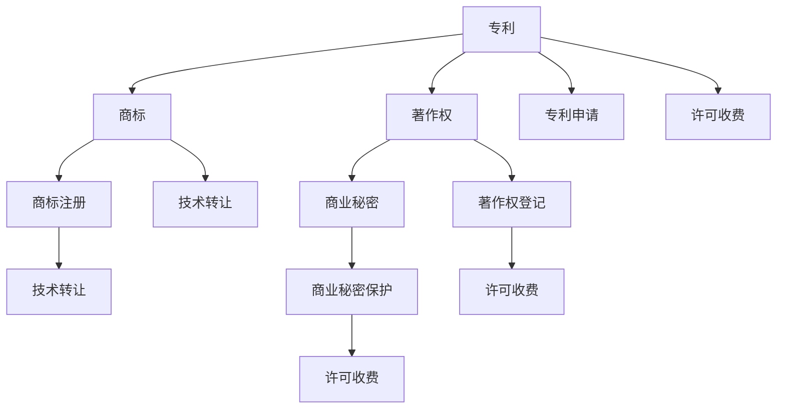

                 

# AI创业公司的知识产权盈利模式：许可收费与技术转让

## 1. 背景介绍

随着人工智能(AI)技术的不断发展和应用，越来越多的AI创业公司应运而生。这些公司通常拥有独特的算法、模型或数据，因此需要考虑如何将这些无形资产转化为公司的重要盈利模式。其中，知识产权(KIPIP)许可收费与技术转让是两种常见的商业模式。

### 1.1 问题由来
在AI创业公司的初期，往往需要大量的资金投入进行技术研发和市场验证。如何高效地利用这些投入，并实现快速的商业模式转化，是公司成长过程中的重要课题。而知识产权作为企业的一种重要资产，具有较高的经济价值和战略意义。通过知识产权的授权和转让，不仅可以获取即时的现金流，还能维护公司的技术领先地位，形成竞争壁垒。

### 1.2 问题核心关键点
AI创业公司的知识产权盈利模式，主要包括：
1. 如何评估和定价知识产权的价值？
2. 如何选择最适合的许可收费或技术转让模式？
3. 如何进行高效的知识产权管理和维护？
4. 如何规避知识产权风险和法律纠纷？
5. 如何将知识产权与其他商业策略结合，形成多渠道盈利模式？

### 1.3 问题研究意义
研究AI创业公司的知识产权盈利模式，对于加速公司的商业模式转型，提升公司的盈利能力和市场竞争力，具有重要意义：

1. 提升公司现金流。通过知识产权的授权和转让，获取快速的现金流，支持公司业务的快速扩张和持续创新。
2. 维护技术领先地位。知识产权可以作为公司的核心竞争力，帮助公司保持技术领先优势，形成行业壁垒。
3. 降低风险和成本。通过明确知识产权的边界和保护范围，降低法律风险和技术纠纷，减少公司的运营成本。
4. 提供多元化盈利渠道。除了产品销售和市场推广外，知识产权还可以作为重要的盈利模式，增加公司收入来源。

## 2. 核心概念与联系

### 2.1 核心概念概述

为更好地理解AI创业公司的知识产权许可收费与技术转让，本节将介绍几个密切相关的核心概念：

- 知识产权(KIPIP)：包括专利、商标、著作权、商业秘密等多种形式，是企业的一种无形资产。
- 许可收费：指公司将其知识产权授权给第三方使用，并根据使用范围和方式收取相应费用的模式。
- 技术转让：指公司将知识产权的所有权或使用权转让给其他企业或个人，包括独占许可、普通许可等形式。
- 商业秘密(BS)：指企业的商业信息、技术、管理方法等未公开信息，具有较高的市场价值。
- 专利申请：指企业向专利局提出专利申请，获取专利权，从而保护其发明创造。
- 商标注册：指企业将其品牌或标识注册为商标，获得商标权，防止他人侵权。
- 著作权登记：指企业将其文学、艺术等作品登记为著作权，保护其原创内容。
- 商业秘密保护：指企业采取保密措施，防止商业秘密泄露，保护其核心竞争力。

这些核心概念之间的逻辑关系可以通过以下Mermaid流程图来展示：



这个流程图展示了一些常见的知识产权形式及其相关模式：

1. 专利：可以进行独占许可、普通许可和交叉许可。
2. 商标：可以进行独占许可、普通许可和共存许可。
3. 著作权：可以进行复制权许可、发行权许可等。
4. 商业秘密：可以进行保密协议保护。

这些概念共同构成了AI创业公司的知识产权管理和盈利框架，使其能够在各种场景下发挥重要的资产价值。通过理解这些核心概念，我们可以更好地把握公司知识产权的开发和应用。

## 3. 核心算法原理 & 具体操作步骤
### 3.1 算法原理概述

AI创业公司的知识产权许可收费与技术转让，本质上是一个基于市场供需关系的交易过程。其核心思想是：在知识产权的价值评估和定价基础上，通过授权或转让的方式，将知识产权的价值转化为公司的现金流。

形式化地，假设公司拥有某项知识产权 $K$，市场对其的评估价值为 $V(K)$。设 $C(K)$ 为授权许可的固定成本，$P(x)$ 为授权许可的收费函数，$x$ 为使用方的许可费率。则公司获得的总收益 $R(K)$ 为：

$$
R(K) = \int_{0}^{\infty} P(x) \cdot f(x) \, dx - C(K)
$$

其中 $f(x)$ 为使用方 $x$ 的许可需求密度函数。

在实际操作中，许可收费与技术转让的决策过程需要考虑多个因素，如市场需求、成本、竞争环境等。以下我们将详细讲解各个操作步骤。

### 3.2 算法步骤详解

AI创业公司的知识产权许可收费与技术转让一般包括以下几个关键步骤：

**Step 1: 评估知识产权价值**
- 对公司拥有的知识产权进行全面的评估，确定其市场价值。评估方法包括专利评估、商标评估、著作权评估和商业秘密价值评估。
- 利用专业评估机构或市场分析工具，进行客观、公正的评估。例如，可以使用专利数据库、商标价值评估模型、商业秘密价值计算方法等。

**Step 2: 确定许可收费或转让形式**
- 根据知识产权的类型和公司策略，选择适合的许可收费或技术转让形式。常见的许可形式包括独占许可、普通许可、交叉许可等。
- 考虑市场竞争、公司规模、技术成熟度等因素，制定最优的许可策略。例如，对于专利技术，可以采用独家授权模式，获取更高的许可费率；而对于商标，可以采用普通许可模式，吸引更多的市场用户。

**Step 3: 制定许可收费或转让条款**
- 制定详细的许可收费或转让协议，明确双方的权利和义务。包括许可范围、许可费率、支付方式、保密条款、违约责任等。
- 与对方企业或个人进行谈判，商讨最优的条款方案。例如，可以根据使用范围和频率设定不同的费率，或者采用阶梯式收费。

**Step 4: 签订许可收费或转让合同**
- 在谈判完成后，签订正式的许可收费或转让合同。合同需经过公司法务部门的审核，确保合同合法有效。
- 合同签订后，及时进行知识产权的转移或授权登记，确保交易合法性。例如，可以进行专利证书变更、商标证书变更等。

**Step 5: 监控许可收费或转让执行情况**
- 对合同执行情况进行定期监控，确保对方按约定支付许可费或技术转让款。
- 对于未按时支付的情况，及时采取法律手段进行追索，确保公司权益。

### 3.3 算法优缺点

AI创业公司的知识产权许可收费与技术转让方法具有以下优点：
1. 快速获取现金流。许可收费和技术转让可以快速实现知识产权价值的转化，获取即时的现金流，支持公司业务的扩张和持续创新。
2. 维护技术领先地位。知识产权可以作为公司的核心竞争力，帮助公司保持技术领先优势，形成行业壁垒。
3. 降低风险和成本。通过明确知识产权的边界和保护范围，降低法律风险和技术纠纷，减少公司的运营成本。

同时，该方法也存在一定的局限性：
1. 市场评估难度大。知识产权的价值评估和定价具有较高的复杂性，需要专业的评估机构和市场分析工具，评估结果可能存在主观性和不确定性。
2. 许可收费受市场影响。许可收费与市场需求密切相关，市场变化可能对公司的收益产生较大影响。
3. 转让风险较大。技术转让涉及知识产权的所有权转移，风险较大，一旦遇到不良合作方，可能面临法律诉讼和技术泄漏的风险。
4. 管理复杂度高。知识产权管理和维护需要专业的人员和技术，成本较高。

尽管存在这些局限性，但就目前而言，许可收费和技术转让仍是AI创业公司重要的商业模式之一。未来相关研究的重点在于如何进一步降低许可和转让的复杂度，提高市场定价的准确性，同时兼顾知识产权的保护和管理。

### 3.4 算法应用领域

AI创业公司的知识产权许可收费与技术转让方法在多个领域得到了广泛的应用，例如：

- 生物科技：通过专利授权，获取科研机构和企业的技术合作，加速科研成果的商业化进程。
- 金融科技：通过商标和著作权授权，获取金融机构的品牌使用权，提升公司的市场影响力。
- 健康医疗：通过商业秘密和专利授权，获取医疗机构的独家技术使用权，获取高额许可费。
- 智能制造：通过专利和技术转让，获取制造企业的技术使用权，提高公司的市场竞争力和盈利能力。

除了上述这些经典领域外，AI创业公司的知识产权许可收费与技术转让技术还在更多新兴行业领域得到应用，如智能交通、智慧能源、数字文化等，为NLP技术带来了新的发展机遇。

## 4. 数学模型和公式 & 详细讲解  
### 4.1 数学模型构建

本节将使用数学语言对AI创业公司的知识产权许可收费与技术转让过程进行更加严格的刻画。

记公司拥有的知识产权为 $K$，市场对其的评估价值为 $V(K)$。设 $C(K)$ 为授权许可的固定成本，$P(x)$ 为授权许可的收费函数，$x$ 为使用方的许可费率。则公司获得的总收益 $R(K)$ 为：

$$
R(K) = \int_{0}^{\infty} P(x) \cdot f(x) \, dx - C(K)
$$

其中 $f(x)$ 为使用方 $x$ 的许可需求密度函数。

### 4.2 公式推导过程

以下我们以专利授权为例，推导许可收费函数及其收益的计算公式。

假设专利技术 $K$ 的市场需求密度函数为 $f(x)$，即单位费率 $x$ 下，使用该技术的企业数量。设单位费率为 $x$，企业在使用专利技术时的收益为 $R(x)$，则专利授权的许可收费函数 $P(x)$ 为：

$$
P(x) = R(x) - x
$$

其中 $R(x)$ 为使用企业从专利技术中获得的收益，$x$ 为许可费率。

将 $P(x)$ 代入收益公式，得：

$$
R(K) = \int_{0}^{\infty} (R(x) - x) \cdot f(x) \, dx - C(K)
$$

将 $R(x)$ 进一步表示为专利技术的边际收益 $r$ 和市场需求密度函数 $f(x)$ 的乘积，得：

$$
R(x) = r \cdot f(x)
$$

其中 $r$ 为专利技术的边际收益。

最终，许可收费函数的收益公式为：

$$
R(K) = \int_{0}^{\infty} (r \cdot f(x) - x) \cdot f(x) \, dx - C(K)
$$

这便是AI创业公司专利授权的许可收费与收益的数学模型。

### 4.3 案例分析与讲解

考虑一个AI创业公司，其专利技术的市场需求密度函数为 $f(x) = \frac{1}{x^2}$，即单位费率 $x$ 下，使用该技术的企业数量为 $1/x^2$。设该专利技术的边际收益为 $r = 10$，授权许可的固定成本为 $C(K) = 100$。则公司的许可收费函数 $P(x)$ 和总收益 $R(K)$ 分别为：

$$
P(x) = 10 \cdot \frac{1}{x^2} - x
$$

$$
R(K) = \int_{0}^{\infty} (10 \cdot \frac{1}{x^2} - x) \cdot \frac{1}{x^2} \, dx - 100
$$

解得：

$$
R(K) = 2 - 100 = -98
$$

这意味着，在当前的市场需求下，公司无法通过专利授权获取正向收益，需要重新调整许可收费策略或寻找新的市场需求。

## 5. 项目实践：代码实例和详细解释说明
### 5.1 开发环境搭建

在进行知识产权许可收费与技术转让实践前，我们需要准备好开发环境。以下是使用Python进行IPython开发的环境配置流程：

1. 安装Anaconda：从官网下载并安装Anaconda，用于创建独立的Python环境。

2. 创建并激活虚拟环境：
```bash
conda create -n ipython-env python=3.8 
conda activate ipython-env
```

3. 安装IPython：
```bash
pip install ipython
```

4. 安装各类工具包：
```bash
pip install numpy pandas scikit-learn matplotlib tqdm jupyter notebook ipython
```

完成上述步骤后，即可在`ipython-env`环境中开始知识产权许可收费与技术转让实践。

### 5.2 源代码详细实现

这里我们以专利授权为例，给出使用IPython进行专利授权许可收费计算的代码实现。

首先，定义专利的市场需求密度函数和边际收益函数：

```python
from sympy import symbols, integrate, Rational

x = symbols('x')
r = 10  # 专利的边际收益
C = 100  # 授权许可的固定成本

# 市场需求密度函数
f_x = 1/x**2

# 许可收费函数
P_x = r * f_x - x
```

然后，计算专利授权的许可收费函数：

```python
# 许可收费函数
P_x = integrate(P_x, x, 0, float('inf'))
```

最后，计算专利授权的总收益：

```python
# 总收益函数
R_K = integrate(P_x, x, 0, float('inf')) - C
print(R_K)
```

以上代码实现了专利授权许可收费和收益的计算。

### 5.3 代码解读与分析

让我们再详细解读一下关键代码的实现细节：

**市场需求密度函数和边际收益函数**：
- 市场需求密度函数 $f(x)$ 为 $1/x^2$，即单位费率 $x$ 下，使用专利技术的企业数量为 $1/x^2$。
- 边际收益 $r$ 为 $10$，即每家企业从专利技术中获得的收益。

**许可收费函数**：
- 许可收费函数 $P(x)$ 为 $r \cdot f(x) - x$，其中 $r \cdot f(x)$ 为专利技术的边际收益，$x$ 为许可费率。

**许可收费函数计算**：
- 使用Sympy库的`integrate`函数，对许可收费函数进行积分，计算总许可费率。

**总收益计算**：
- 将总许可费率与授权许可的固定成本相减，得到总收益。

可以看到，IPython的代码实现相对简洁，易于理解和维护。开发者可以根据具体需求，灵活调整市场需求密度函数和边际收益函数，以计算不同的许可收费与收益。

## 6. 实际应用场景
### 6.1 智能医疗

AI创业公司在智能医疗领域具有广泛的应用前景。通过专利授权，可以获取医疗机构的技术合作，加速科研成果的商业化进程。例如，一家AI医疗公司，其专利技术可用于医学影像分析，可以授权多家医疗机构使用，获取高额许可费。

### 6.2 智能制造

智能制造是AI创业公司的重要应用场景之一。通过专利和技术转让，可以获取制造企业的技术使用权，提高公司的市场竞争力和盈利能力。例如，一家AI制造公司，其专利技术可用于自动化生产线的优化，可以授权多家制造企业使用，获取高额许可费。

### 6.3 金融科技

金融科技领域是AI创业公司的热门应用场景。通过商标和著作权授权，可以获取金融机构的品牌使用权，提升公司的市场影响力。例如，一家AI金融公司，其商标和著作权可用于金融产品的设计和推广，可以授权多家金融机构使用，获取高额许可费。

### 6.4 未来应用展望

随着AI技术的不断发展和应用，AI创业公司的知识产权许可收费与技术转让将呈现以下几个发展趋势：

1. 市场应用更广泛。AI技术的广泛应用，将为AI创业公司提供更多的许可收费与技术转让机会。
2. 定价策略更灵活。AI创业公司可以根据市场需求，制定灵活的许可收费与技术转让策略，最大化收益。
3. 管理机制更完善。AI创业公司需要建立完善的市场管理和知识产权保护机制，防范法律风险。
4. 协同合作更紧密。AI创业公司可以与多家企业进行合作，共同开发新技术，形成生态链，增强市场竞争力。
5. 数据分析更精准。AI创业公司可以利用大数据和人工智能技术，对市场需求进行精准分析，制定最优的许可收费与技术转让策略。

以上趋势凸显了AI创业公司知识产权许可收费与技术转让的广阔前景。这些方向的探索发展，将进一步推动AI技术的落地应用，加速AI产业的商业化进程。

## 7. 工具和资源推荐
### 7.1 学习资源推荐

为了帮助开发者系统掌握AI创业公司的知识产权许可收费与技术转让的理论基础和实践技巧，这里推荐一些优质的学习资源：

1. 《知识产权法律与实务》系列博文：由法律专家撰写，深入浅出地介绍了专利、商标、著作权等知识产权的基本概念和法律要求。

2. 《商业秘密管理与保护》书籍：商业秘密是AI创业公司的重要资产，本书详细介绍了商业秘密的保护措施和管理策略。

3. 《技术许可与转让》书籍：全面介绍了技术许可和转让的法律框架和实践技巧，是企业高管和法务人员的必备参考。

4. IPython官方文档：IPython的官方文档，提供了丰富的代码样例和用户指南，是知识产权许可收费与技术转让开发的利器。

5. 《人工智能商业模式创新》系列文章：讨论了AI技术的商业模式创新方向，包括知识产权授权和转让等。

通过对这些资源的学习实践，相信你一定能够快速掌握AI创业公司知识产权许可收费与技术转让的精髓，并用于解决实际的商业问题。

### 7.2 开发工具推荐

高效的开发离不开优秀的工具支持。以下是几款用于AI创业公司知识产权许可收费与技术转让开发的常用工具：

1. IPython：基于Python的交互式开发环境，支持大规模数学计算和数据分析，适合知识产权许可收费与技术转让的模型计算。

2. Sympy：Python的符号计算库，支持高阶数学运算和符号推导，适合专利授权等复杂计算。

3. Microsoft Excel：电子表格软件，可以用于简单的许可收费计算和数据分析。

4. Google Sheets：在线电子表格工具，支持多用户协作，适合实时动态更新数据。

5. MATLAB：数学计算和数据分析软件，支持复杂的许可收费计算和可视化。

合理利用这些工具，可以显著提升AI创业公司知识产权许可收费与技术转让的开发效率，加快创新迭代的步伐。

### 7.3 相关论文推荐

AI创业公司的知识产权许可收费与技术转让发展源于学界的持续研究。以下是几篇奠基性的相关论文，推荐阅读：

1. "The Economics of Intellectual Property Rights"（知识产权经济学）：分析了知识产权的定价和许可策略，为AI创业公司提供了重要的理论基础。

2. "The Role of Patents in Research and Development"（专利在研发中的作用）：探讨了专利授权对研发活动的影响，为AI创业公司的研发合作提供了新思路。

3. "Intellectual Property Rights in the Digital Age"（数字时代的知识产权）：分析了数字时代知识产权的新挑战和新趋势，为AI创业公司的知识产权保护提供了新方向。

4. "Technology Licensing and Transfer"（技术授权与转让）：介绍了技术授权和转让的法律框架和最佳实践，为AI创业公司的技术授权提供了实用指南。

这些论文代表了大规模语言模型微调技术的发展脉络。通过学习这些前沿成果，可以帮助研究者把握学科前进方向，激发更多的创新灵感。

## 8. 总结：未来发展趋势与挑战
### 8.1 总结

本文对AI创业公司的知识产权许可收费与技术转让方法进行了全面系统的介绍。首先阐述了AI创业公司知识产权许可收费与技术转让的研究背景和意义，明确了知识产权授权和转让在商业化过程中的重要作用。其次，从原理到实践，详细讲解了许可收费和转让的数学原理和关键步骤，给出了知识产权许可收费与技术转让的完整代码实例。同时，本文还广泛探讨了许可收费与转让方法在智能医疗、智能制造、金融科技等多个行业领域的应用前景，展示了许可收费与转让范式的巨大潜力。此外，本文精选了许可收费与转让技术的各类学习资源，力求为读者提供全方位的技术指引。

通过本文的系统梳理，可以看到，AI创业公司通过知识产权许可收费与技术转让，可以在短时间内实现技术和现金流的转换，支持业务的快速扩张和持续创新。未来，伴随技术的不断演进和市场的快速变化，知识产权授权和转让仍将是AI创业公司重要的商业模式之一。研究者需要进一步探索许可收费与转让方法，优化定价策略，提升市场竞争力，为公司的长期发展提供稳定的现金流和战略资源。

### 8.2 未来发展趋势

展望未来，AI创业公司的知识产权许可收费与技术转让将呈现以下几个发展趋势：

1. 市场应用更广泛。AI技术的广泛应用，将为AI创业公司提供更多的许可收费与技术转让机会。
2. 定价策略更灵活。AI创业公司可以根据市场需求，制定灵活的许可收费与技术转让策略，最大化收益。
3. 管理机制更完善。AI创业公司需要建立完善的市场管理和知识产权保护机制，防范法律风险。
4. 协同合作更紧密。AI创业公司可以与多家企业进行合作，共同开发新技术，形成生态链，增强市场竞争力。
5. 数据分析更精准。AI创业公司可以利用大数据和人工智能技术，对市场需求进行精准分析，制定最优的许可收费与技术转让策略。

以上趋势凸显了AI创业公司知识产权许可收费与技术转让的广阔前景。这些方向的探索发展，将进一步推动AI技术的落地应用，加速AI产业的商业化进程。

### 8.3 面临的挑战

尽管AI创业公司的知识产权许可收费与技术转让方法已经取得了一定成果，但在迈向更加智能化、普适化应用的过程中，它仍面临着诸多挑战：

1. 市场评估难度大。知识产权的价值评估和定价具有较高的复杂性，需要专业的评估机构和市场分析工具，评估结果可能存在主观性和不确定性。
2. 许可收费受市场影响。许可收费与市场需求密切相关，市场变化可能对公司的收益产生较大影响。
3. 转让风险较大。技术转让涉及知识产权的所有权转移，风险较大，一旦遇到不良合作方，可能面临法律诉讼和技术泄漏的风险。
4. 管理复杂度高。知识产权管理和维护需要专业的人员和技术，成本较高。

尽管存在这些挑战，但AI创业公司的知识产权许可收费与技术转让技术仍在不断发展，相关研究也在不断深化。通过技术创新和管理优化，这些挑战有望逐步得到解决，知识产权授权和转让将在AI创业公司的商业模式中发挥更加重要的作用。

### 8.4 研究展望

面对AI创业公司知识产权许可收费与技术转让所面临的种种挑战，未来的研究需要在以下几个方面寻求新的突破：

1. 探索无监督和半监督许可收费与技术转让方法。摆脱对大规模标注数据的依赖，利用自监督学习、主动学习等无监督和半监督范式，最大限度利用非结构化数据，实现更加灵活高效的许可收费与转让。

2. 研究参数高效和计算高效的许可收费与技术转让范式。开发更加参数高效的许可收费与转让方法，在固定大部分知识产权权重的情况下，只更新极少量的许可相关权重。同时优化许可收费与转让模型的计算图，减少前向传播和反向传播的资源消耗，实现更加轻量级、实时性的部署。

3. 融合因果和对比学习范式。通过引入因果推断和对比学习思想，增强许可收费与转让模型建立稳定因果关系的能力，学习更加普适、鲁棒的知识图谱表示，从而提升模型泛化性和抗干扰能力。

4. 引入更多先验知识。将符号化的先验知识，如知识图谱、逻辑规则等，与神经网络模型进行巧妙融合，引导许可收费与转让过程学习更准确、合理的知识图谱表示。同时加强不同模态数据的整合，实现视觉、语音等多模态信息与文本信息的协同建模。

5. 结合因果分析和博弈论工具。将因果分析方法引入许可收费与转让模型，识别出模型决策的关键特征，增强输出解释的因果性和逻辑性。借助博弈论工具刻画人机交互过程，主动探索并规避模型的脆弱点，提高系统稳定性。

6. 纳入伦理道德约束。在许可收费与转让目标中引入伦理导向的评估指标，过滤和惩罚有偏见、有害的输出倾向。同时加强人工干预和审核，建立许可收费与转让行为的监管机制，确保输出符合人类价值观和伦理道德。

这些研究方向的探索，必将引领AI创业公司许可收费与转让技术迈向更高的台阶，为构建安全、可靠、可解释、可控的智能系统铺平道路。面向未来，AI创业公司的许可收费与转让技术还需要与其他人工智能技术进行更深入的融合，如知识表示、因果推理、强化学习等，多路径协同发力，共同推动自然语言理解和智能交互系统的进步。只有勇于创新、敢于突破，才能不断拓展知识产权的边界，让智能技术更好地造福人类社会。

## 9. 附录：常见问题与解答

**Q1：如何评估AI创业公司的知识产权价值？**

A: AI创业公司的知识产权价值评估可以从以下几个方面进行：
1. 专利价值评估：利用专利数据库、专利评估机构等工具，对专利的创新性、应用前景、市场竞争力等进行综合评估。
2. 商标价值评估：利用品牌价值评估模型、市场调研数据等，对商标的市场影响力、知名度等进行评估。
3. 著作权价值评估：利用版权登记机构、著作权评估报告等工具，对著作权的作品原创性、应用价值等进行评估。
4. 商业秘密价值评估：利用商业秘密保密性、实用性、市场价值等标准，对商业秘密的价值进行评估。

**Q2：如何选择AI创业公司的知识产权授权或转让模式？**

A: 选择知识产权授权或转让模式时，需要考虑以下几个因素：
1. 知识产权类型：不同类型知识产权的授权或转让模式不同，如专利可进行独占许可、普通许可，商标可进行独占许可、普通许可，著作权可进行复制权许可、发行权许可等。
2. 市场需求：根据市场需求，选择合适的授权或转让模式，如市场需要独占使用权，可选择独占许可，如市场需要广泛使用权，可选择普通许可。
3. 公司战略：根据公司战略，选择最佳的授权或转让模式，如需要快速获取现金流，可选择许可收费模式，如需要长期稳定收益，可选择技术转让模式。

**Q3：如何进行高效的知识产权管理和维护？**

A: 高效的知识产权管理和维护需要从以下几个方面进行：
1. 建立完善的知识产权管理体系，明确知识产权的归属、使用范围等，制定详细的管理流程。
2. 定期进行知识产权的登记、更新和保护，确保知识产权的合法性和有效性。
3. 建立知识产权的监控和预警机制，及时发现和处理侵权行为。
4. 建立知识产权的内部审计和评估机制，定期对知识产权进行价值评估和维护。
5. 与专业的知识产权代理机构合作，提高知识产权的管理和保护水平。

**Q4：如何进行高效的知识产权许可收费与技术转让定价？**

A: 高效的知识产权许可收费与技术转让定价需要从以下几个方面进行：
1. 市场调研：了解市场需求和竞争环境，制定最优的许可收费与转让策略。
2. 成本分析：计算授权许可的固定成本和变动成本，合理定价。
3. 数据分析：利用大数据和人工智能技术，对市场需求进行精准分析，制定灵活的定价策略。
4. 动态调整：根据市场变化，及时调整许可收费与转让价格，保持竞争力。
5. 协商谈判：与对方企业或个人进行谈判，商讨最优的许可收费与转让条款，确保公平合理。

**Q5：如何规避知识产权风险和法律纠纷？**

A: 规避知识产权风险和法律纠纷需要从以下几个方面进行：
1. 了解知识产权法律和法规，制定合法的许可收费与转让协议。
2. 加强知识产权的登记和保护，防止侵权行为。
3. 建立知识产权的内部审计和评估机制，定期对知识产权进行价值评估和维护。
4. 与专业的知识产权代理机构合作，提供法律咨询和代理服务，保障知识产权的合法性和有效性。
5. 建立知识产权的监控和预警机制，及时发现和处理侵权行为。

这些建议将帮助AI创业公司更好地管理和保护其知识产权，规避法律风险和纠纷，实现知识产权许可收费与技术转让的最大化收益。

---

作者：禅与计算机程序设计艺术 / Zen and the Art of Computer Programming

