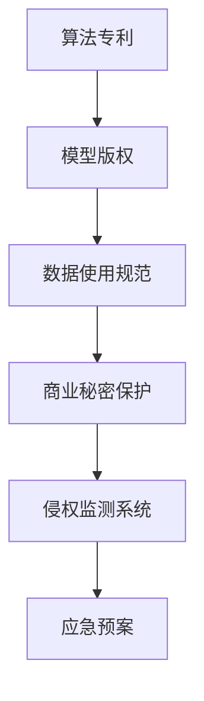

                 

## 1. 背景介绍

### 1.1 问题由来
随着人工智能(AI)技术的不断进步，越来越多的创业公司开始将AI应用融入其核心业务，以提升竞争力。然而，与此同时，AI领域的知识产权问题也逐渐凸显。由于AI算法的复杂性，侵权行为往往难以直接辨别，且一旦发生，可能给公司带来巨大的法律和经济风险。因此，对于AI创业公司而言，知识产权风险管理（IPRM）成为了一项重要的日常工作。

### 1.2 问题核心关键点
AI创业公司面临的知识产权风险主要包括以下几个方面：

1. **算法专利**：AI算法是否具有专利保护。
2. **模型版权**：是否存在模型版权问题，即模型是否受版权保护。
3. **数据使用**：使用公开或第三方数据时是否违反了相关法律法规。
4. **商业秘密**：在研发过程中是否存在商业秘密泄露的风险。
5. **侵权监测**：如何实时监测潜在的侵权行为。
6. **应急预案**：一旦发现侵权行为，如何快速响应和解决。

### 1.3 问题研究意义
有效管理知识产权风险，对于保障AI创业公司的商业利益，防范法律风险，构建公平的市场竞争环境具有重要意义：

1. **保护知识产权**：防止他人未经许可使用公司的AI算法和模型。
2. **降低法律风险**：避免因侵权行为导致的巨额赔偿和名誉损失。
3. **提升竞争力**：通过合法的知识产权保护，赢得市场信任，提升企业声誉。
4. **规避市场壁垒**：避免因知识产权纠纷引发的市场准入问题。
5. **加速创新**：鼓励研发团队大胆创新，无后顾之忧。

## 2. 核心概念与联系

### 2.1 核心概念概述

为更好地理解AI创业公司的知识产权风险管理，本节将介绍几个密切相关的核心概念：

- **算法专利**：对AI算法是否具备专利申请资格，以及专利申请和维权流程的理解。
- **模型版权**：模型是否属于公司商业秘密，是否受版权保护，以及版权登记和保护方法。
- **数据使用规范**：在使用公开或第三方数据时，是否遵守了相关的法律法规，如数据隐私、版权等。
- **商业秘密保护**：如何识别、管理和保护公司的商业秘密，防止泄露和滥用。
- **侵权监测系统**：用于实时监测AI模型被未经授权使用的技术系统。
- **应急预案**：一旦发现侵权行为，公司应如何快速响应，包括法律咨询、证据收集、通知侵权方、启动法律程序等。

这些核心概念之间的逻辑关系可以通过以下Mermaid流程图来展示：



这个流程图展示了一系列的知识产权风险管理流程：

1. 确定算法专利的申请资格，保护模型版权。
2. 使用公开或第三方数据时遵守相关法律法规。
3. 识别和管理商业秘密，防止泄露。
4. 实时监测模型被未授权使用的情况。
5. 一旦发现侵权行为，快速响应和解决。

这些概念共同构成了AI创业公司知识产权风险管理的基础框架，确保公司在AI技术研发和应用中，既能够充分利用现有资源，又能够有效规避潜在的知识产权风险。

## 3. 核心算法原理 & 具体操作步骤
### 3.1 算法原理概述

AI创业公司的知识产权风险管理，本质上是一个基于数据驱动的风险评估和响应机制。其核心思想是：通过收集和分析各类风险数据，构建风险模型，实时监测和评估知识产权风险，并在发现风险时，启动应急预案，采取有效措施进行风险控制和风险化解。

形式化地，假设风险数据集为 $D=\{(x_i,y_i)\}_{i=1}^N, x_i \in X, y_i \in Y$，其中 $X$ 为风险因素集合，$Y$ 为风险等级集合，即1表示高风险，0表示低风险。风险模型的目标是最小化经验风险，即：

$$
\min_{\theta} \mathcal{L}(\theta) = \frac{1}{N} \sum_{i=1}^N L(y_i, \hat{y_i}(f_{\theta}(x_i)))
$$

其中 $L$ 为损失函数，$f_{\theta}$ 为风险评估模型，$\hat{y_i}$ 为模型的预测结果。

### 3.2 算法步骤详解

AI创业公司的知识产权风险管理一般包括以下几个关键步骤：

**Step 1: 收集风险数据**
- 收集与知识产权相关的各类数据，包括算法专利信息、模型版权登记情况、数据使用合规性记录、商业秘密保护情况等。
- 定期更新数据集，确保数据的时效性和全面性。

**Step 2: 构建风险模型**
- 使用机器学习算法（如决策树、随机森林、神经网络等）训练风险评估模型。
- 根据历史数据和特征工程，选择并训练模型。
- 在模型训练过程中，加入正则化技术和交叉验证，防止过拟合。

**Step 3: 风险监测与评估**
- 实时收集新的风险数据，输入风险评估模型进行预测。
- 根据模型的输出，评估当前知识产权风险等级。
- 设定风险阈值，当评估结果超过该阈值时，触发风险预警。

**Step 4: 启动应急预案**
- 一旦发现高风险情况，立即启动应急预案，包括但不限于：
  - 法律咨询：联系专业律师，评估可能的侵权风险。
  - 证据收集：搜集相关证据，如专利申请记录、模型源代码、使用协议等。
  - 通知侵权方：向侵权方发出正式通知，要求其停止侵权行为。
  - 启动法律程序：必要时，通过诉讼或仲裁解决侵权争议。

**Step 5: 风险化解与反馈**
- 采取措施后，定期评估效果，确保风险得到有效控制。
- 对风险评估模型进行反馈和优化，持续改进风险管理能力。

以上是AI创业公司知识产权风险管理的常见流程。在实际操作中，还需要根据具体场景和数据特点，进一步优化和细化各步骤。

### 3.3 算法优缺点

AI创业公司的知识产权风险管理方法具有以下优点：

1. **数据驱动**：通过分析大量数据，量化风险，提供客观的风险评估依据。
2. **实时监测**：实时监测风险动态，提前预警，降低风险发生概率。
3. **系统化管理**：构建系统化的风险管理流程，确保风险管理工作的系统性和持续性。
4. **法律支持**：法律咨询和专业律师的介入，确保风险处理过程的合法性和有效性。

同时，该方法也存在一定的局限性：

1. **数据质量**：风险数据的质量直接影响风险评估结果的准确性，数据收集和维护成本较高。
2. **模型复杂性**：构建和维护复杂的风险评估模型需要较高技术水平和资源投入。
3. **应急响应**：在发现侵权行为时，应急预案的启动和执行需要协调多方资源，可能耗时较长。
4. **法律环境**：不同国家和地区的知识产权法律环境不同，风险管理需适应不同法律环境。

尽管存在这些局限性，但就目前而言，基于数据驱动的风险管理方法仍是AI创业公司应对知识产权风险的重要手段。未来相关研究将进一步降低数据获取和模型维护成本，提高应急响应的效率，同时提升跨地域法律支持的灵活性。

### 3.4 算法应用领域

基于数据驱动的风险管理方法，已经在AI创业公司的各个领域得到了广泛应用，包括但不限于：

- **研发阶段**：在算法开发和模型训练过程中，识别和评估潜在的知识产权风险。
- **产品发布**：在产品发布前，进行全面的知识产权风险评估，确保合规性。
- **市场运营**：在市场推广和客户服务过程中，实时监测和应对可能的侵权行为。
- **知识产权管理**：系统化管理专利申请、版权登记、数据使用协议等知识产权相关事项。
- **合规审查**：定期进行合规审查，评估和改进风险管理流程。

这些应用场景展示了风险管理方法在AI创业公司中的广泛适用性和重要性，帮助公司构建更加稳健的知识产权风险管理体系。

## 4. 数学模型和公式 & 详细讲解 & 举例说明

### 4.1 数学模型构建

本节将使用数学语言对AI创业公司的知识产权风险管理进行更加严格的刻画。

假设风险数据集为 $D=\{(x_i,y_i)\}_{i=1}^N, x_i \in X, y_i \in Y$，其中 $X$ 为风险因素集合，$Y$ 为风险等级集合，即1表示高风险，0表示低风险。

定义风险评估模型为 $f_{\theta}(x): X \rightarrow Y$，其中 $\theta$ 为模型参数。则风险模型的经验风险为：

$$
\mathcal{L}(\theta) = \frac{1}{N} \sum_{i=1}^N L(y_i, \hat{y_i}(f_{\theta}(x_i)))
$$

其中 $L$ 为损失函数，$f_{\theta}(x)$ 为风险评估模型的预测结果。

### 4.2 公式推导过程

以下我们以二分类问题为例，推导风险评估模型的损失函数及其梯度计算公式。

假设模型 $f_{\theta}(x)$ 在输入 $x$ 上的输出为 $\hat{y}=f_{\theta}(x) \in [0,1]$，表示风险等级预测。真实标签 $y \in \{0,1\}$。则二分类交叉熵损失函数定义为：

$$
L(f_{\theta}(x),y) = -[y\log \hat{y} + (1-y)\log (1-\hat{y})]
$$

将其代入经验风险公式，得：

$$
\mathcal{L}(\theta) = -\frac{1}{N}\sum_{i=1}^N [y_i\log \hat{y_i}+(1-y_i)\log(1-\hat{y_i})]
$$

根据链式法则，损失函数对参数 $\theta_k$ 的梯度为：

$$
\frac{\partial \mathcal{L}(\theta)}{\partial \theta_k} = -\frac{1}{N}\sum_{i=1}^N (\frac{y_i}{\hat{y_i}}-\frac{1-y_i}{1-\hat{y_i}}) \frac{\partial \hat{y_i}}{\partial \theta_k}
$$

其中 $\frac{\partial \hat{y_i}}{\partial \theta_k}$ 可进一步递归展开，利用自动微分技术完成计算。

在得到损失函数的梯度后，即可带入优化算法进行参数更新，完成模型的迭代优化。重复上述过程直至收敛，最终得到适应风险管理的最佳模型参数 $\theta^*$。

## 5. 项目实践：代码实例和详细解释说明
### 5.1 开发环境搭建

在进行风险管理实践前，我们需要准备好开发环境。以下是使用Python进行PyTorch开发的环境配置流程：

1. 安装Anaconda：从官网下载并安装Anaconda，用于创建独立的Python环境。

2. 创建并激活虚拟环境：
```bash
conda create -n rmp-env python=3.8 
conda activate rmp-env
```

3. 安装PyTorch：根据CUDA版本，从官网获取对应的安装命令。例如：
```bash
conda install pytorch torchvision torchaudio cudatoolkit=11.1 -c pytorch -c conda-forge
```

4. 安装各类工具包：
```bash
pip install numpy pandas scikit-learn matplotlib tqdm jupyter notebook ipython
```

完成上述步骤后，即可在`rmp-env`环境中开始风险管理实践。

### 5.2 源代码详细实现

下面我以构建基于神经网络的知识产权风险评估模型为例，给出使用PyTorch进行模型训练和测试的代码实现。

首先，定义风险数据处理函数：

```python
from torch.utils.data import Dataset, DataLoader
import torch
from sklearn.model_selection import train_test_split

class RiskDataset(Dataset):
    def __init__(self, X, y, random_state=None):
        self.X = X
        self.y = y
        self.random_state = random_state
        
    def __len__(self):
        return len(self.X)
    
    def __getitem__(self, idx):
        if self.random_state is not None:
            idx = self.random_state.randint(0, len(self.X))
        return self.X[idx], self.y[idx]
```

然后，定义模型和优化器：

```python
import torch.nn as nn
import torch.optim as optim

class RiskModel(nn.Module):
    def __init__(self, input_size, hidden_size, output_size):
        super(RiskModel, self).__init__()
        self.fc1 = nn.Linear(input_size, hidden_size)
        self.fc2 = nn.Linear(hidden_size, output_size)
        self.softmax = nn.Softmax(dim=1)
        
    def forward(self, x):
        x = self.fc1(x)
        x = self.fc2(x)
        return self.softmax(x)

# 使用交叉熵损失
criterion = nn.CrossEntropyLoss()

# 使用AdamW优化器
optimizer = optim.AdamW(model.parameters(), lr=0.001)

# 使用随机种子
torch.manual_seed(42)
```

接着，定义训练和评估函数：

```python
from sklearn.metrics import confusion_matrix, accuracy_score

def train_model(model, train_data, test_data, num_epochs=10, batch_size=32):
    train_loader = DataLoader(train_data, batch_size=batch_size, shuffle=True)
    test_loader = DataLoader(test_data, batch_size=batch_size, shuffle=False)
    
    for epoch in range(num_epochs):
        model.train()
        running_loss = 0.0
        for data, target in train_loader:
            data, target = data.to(device), target.to(device)
            optimizer.zero_grad()
            output = model(data)
            loss = criterion(output, target)
            running_loss += loss.item() * data.size(0)
            loss.backward()
            optimizer.step()
            
        epoch_loss = running_loss / len(train_data)
        print(f'Epoch {epoch+1}, Loss: {epoch_loss:.4f}')
        
        model.eval()
        running_loss = 0.0
        for data, target in test_loader:
            data, target = data.to(device), target.to(device)
            output = model(data)
            loss = criterion(output, target)
            running_loss += loss.item() * data.size(0)
        
        epoch_loss = running_loss / len(test_data)
        print(f'Epoch {epoch+1}, Test Loss: {epoch_loss:.4f}')
        
        print(f'Epoch {epoch+1}, Accuracy: {accuracy_score(y_test, torch.argmax(output, dim=1)):.4f}')
        
    return model

# 加载数据
X_train, X_test, y_train, y_test = train_test_split(X, y, test_size=0.2, random_state=42)

# 定义模型
device = torch.device('cuda' if torch.cuda.is_available() else 'cpu')
model = RiskModel(input_size=X_train.shape[1], hidden_size=64, output_size=2).to(device)

# 训练模型
model = train_model(model, RiskDataset(X_train, y_train, random_state=42), RiskDataset(X_test, y_test, random_state=42))
```

以上就是使用PyTorch构建和训练神经网络风险评估模型的完整代码实现。可以看到，得益于PyTorch的高效和灵活性，风险评估模型的训练和测试变得简洁高效。

### 5.3 代码解读与分析

让我们再详细解读一下关键代码的实现细节：

**RiskDataset类**：
- `__init__`方法：初始化训练和测试数据集，以及随机种子。
- `__len__`方法：返回数据集的样本数量。
- `__getitem__`方法：随机选择数据集中的一个样本，并返回输入和标签。

**RiskModel类**：
- `__init__`方法：定义神经网络模型结构，包括两个全连接层和Softmax激活函数。
- `forward`方法：前向传播计算模型的输出。

**训练函数**：
- 定义训练数据和测试数据的数据加载器，按批次进行训练和测试。
- 在每个epoch内，使用模型训练集进行前向传播和反向传播，更新模型参数。
- 在测试集上评估模型的损失和准确率。

**加载数据**：
- 使用sklearn的`train_test_split`方法将数据集划分为训练集和测试集。
- 定义模型，并使用GPU进行加速。

**训练模型**：
- 在训练集上进行训练，并定期在测试集上评估模型性能。
- 返回训练好的模型。

可以看到，PyTorch的组件化设计使得风险评估模型的构建和训练变得相对容易。开发者可以快速迭代实验，优化模型架构和训练参数，最终得到效果良好的风险评估模型。

当然，工业级的系统实现还需考虑更多因素，如模型的保存和部署、超参数的自动搜索、更灵活的模型架构等。但核心的风险管理流程基本与此类似。

## 6. 实际应用场景
### 6.1 智能合约平台

在智能合约平台中，知识产权风险管理尤为重要。平台上的智能合约代码和算法必须保证原创性和合规性，以避免潜在的知识产权纠纷。

通过实时监测平台上的智能合约部署情况，构建基于风险评估模型的监控系统，可以及时发现可能侵犯他人专利权或版权的智能合约，发出预警。同时，平台可以引入智能合约的审查机制，对高风险合约进行严格审查和限制，确保平台的合规性。

### 6.2 开源社区

开源社区中，知识产权风险管理也是一大挑战。社区中的开源算法和代码可能面临侵权风险，如盗用他人创意或未得到授权的代码片段。

利用机器学习模型对社区内的代码和算法进行风险评估，及时发现潜在的侵权行为，采取警告、下架等措施，可以有效保护社区内成员的知识产权，维护社区秩序。

### 6.3 科技公司

科技公司在研发新产品和服务时，面临的风险管理任务尤为复杂。公司需要在研发阶段就识别和评估潜在的知识产权风险，避免因侵权行为导致的商业损失。

通过建立基于数据驱动的风险管理平台，定期监测和评估公司内部的研发活动，识别高风险领域和项目，及时采取措施，可以有效降低公司的知识产权风险。

### 6.4 未来应用展望

随着AI技术的进一步发展，知识产权风险管理将渗透到更多的领域。未来，AI创业公司可以通过更加灵活和高效的风险管理手段，构建更加稳健的知识产权防护体系，从而在激烈的市场竞争中占据优势。

在智慧医疗、智能制造、金融科技等垂直行业中，知识产权风险管理也将发挥重要作用，保障各行业的健康发展和可持续发展。

## 7. 工具和资源推荐
### 7.1 学习资源推荐

为了帮助开发者系统掌握AI创业公司知识产权风险管理的技术基础和实践技巧，这里推荐一些优质的学习资源：

1. **Deep Learning with PyTorch**：书籍《PyTorch深度学习实践》，全面介绍了PyTorch框架的使用方法和实例应用。
2. **Python for Data Analysis**：书籍《Python数据科学手册》，介绍了如何使用Python进行数据处理和分析。
3. **Machine Learning Mastery**：博客网站，提供了大量的机器学习实践指南和案例分析。
4. **Coursera**：在线课程平台，提供包括深度学习、机器学习在内的各类AI相关课程。
5. **Kaggle**：数据科学竞赛平台，提供丰富的数据集和挑战任务，有助于实战练习。

通过学习这些资源，相信你一定能够快速掌握AI创业公司知识产权风险管理的精髓，并用于解决实际的知识产权问题。
###  7.2 开发工具推荐

高效的开发离不开优秀的工具支持。以下是几款用于AI创业公司知识产权风险管理的常用工具：

1. **PyTorch**：基于Python的开源深度学习框架，灵活动态的计算图，适合快速迭代研究。大部分深度学习模型都有PyTorch版本的实现。
2. **TensorFlow**：由Google主导开发的开源深度学习框架，生产部署方便，适合大规模工程应用。同样有丰富的深度学习模型资源。
3. **Jupyter Notebook**：基于Python的交互式编程环境，支持代码编写和数据可视化的无缝集成。
4. **Git**：版本控制系统，支持多人协作开发，确保代码的完整性和可追溯性。
5. **GitHub**：代码托管平台，提供代码仓库管理、版本控制、协作开发等功能。

合理利用这些工具，可以显著提升AI创业公司知识产权风险管理的开发效率，加快创新迭代的步伐。

### 7.3 相关论文推荐

AI创业公司知识产权风险管理的研究始于学界的持续探索。以下是几篇奠基性的相关论文，推荐阅读：

1. **"Deep Learning for Privacy-Preserving Speech Recognition"**：论文研究如何利用深度学习技术保护语音数据的隐私。
2. **"Fairness in Machine Learning"**：论文探讨机器学习中公平性和偏见的问题，并提出相应的解决策略。
3. **"Privacy-Preserving Genomic Data Sharing"**：论文研究如何保护基因组数据在共享时的隐私。
4. **"Data Privacy in Blockchain"**：论文研究区块链技术在数据隐私保护中的应用。
5. **"Machine Learning Model Fairness"**：论文探讨机器学习模型在公平性方面的挑战和解决方案。

这些论文代表了大规模数据和隐私保护的研究进展，对于理解AI创业公司知识产权风险管理的重要性和解决策略具有重要参考价值。

## 8. 总结：未来发展趋势与挑战
### 8.1 研究成果总结

本文对AI创业公司的知识产权风险管理进行了全面系统的介绍。首先阐述了AI创业公司面临的知识产权风险及其重要性，明确了风险管理的意义和目标。其次，从原理到实践，详细讲解了基于数据驱动的风险评估和应急预案流程，给出了完整的模型训练代码实例。同时，本文还广泛探讨了风险管理方法在各个行业领域的应用场景，展示了其广泛适用性。

通过本文的系统梳理，可以看到，AI创业公司知识产权风险管理是一项复杂而重要的任务，需要在数据收集、模型构建、风险评估和应急响应等多个环节进行全面优化，方能构建稳健的风险管理机制。

### 8.2 未来发展趋势

展望未来，AI创业公司的知识产权风险管理将呈现以下几个发展趋势：

1. **数据驱动的智能化**：随着大数据技术的进步，风险评估模型将更加智能化和自适应，能够自动学习和适应新的风险类型。
2. **跨领域应用**：知识产权风险管理将渗透到更多领域，如医疗、金融、制造等，帮助各行业规避风险，提升合规性。
3. **自动化和集成化**：将风险管理自动化工具集成到公司现有流程中，实现风险管理的自动化和持续化。
4. **伦理和社会责任**：将伦理和社会责任纳入风险管理框架，确保知识产权保护措施的公正性和可持续性。
5. **全球化和合规性**：不同国家和地区的知识产权法律环境不同，需要构建全球化的风险管理框架，确保合规性。

以上趋势凸显了AI创业公司知识产权风险管理的发展方向，为构建更加智能、全面、合规的风险管理体系提供了新的思路和工具。

### 8.3 面临的挑战

尽管AI创业公司的知识产权风险管理已经取得了一定进展，但在实际应用中仍面临诸多挑战：

1. **数据隐私保护**：在收集和处理风险数据时，需要严格保护数据隐私，防止数据泄露。
2. **模型透明性和可解释性**：如何设计透明的、可解释的风险评估模型，以确保其决策过程的可信度和公平性。
3. **跨学科合作**：知识产权风险管理涉及法律、技术、伦理等多个学科，需要跨学科合作，共同探索解决方案。
4. **法律环境复杂性**：不同国家和地区的知识产权法律环境不同，需要灵活适应和应对。
5. **实时监测和响应**：如何构建实时监测系统，及时响应和化解潜在的侵权风险。

这些挑战需要学术界和工业界共同努力，进一步探索和突破。

### 8.4 研究展望

面对AI创业公司知识产权风险管理所面临的种种挑战，未来的研究需要在以下几个方面寻求新的突破：

1. **隐私保护技术**：研究更加高效的数据隐私保护技术，确保风险数据的安全性和合法性。
2. **透明和可解释的模型**：开发透明的、可解释的风险评估模型，提升模型的可信度和公平性。
3. **跨学科研究**：引入法律、伦理、社会学等多个学科的知识，构建跨学科的研究框架。
4. **法律和合规框架**：研究全球化的法律和合规框架，确保风险管理措施的全球适用性。
5. **实时监测技术**：研究实时监测技术，提高风险预警和响应效率。

这些研究方向将推动AI创业公司知识产权风险管理技术的进一步发展，为构建更加稳健、智能的风险管理机制奠定基础。总之，随着技术的不断进步，AI创业公司知识产权风险管理将迎来更加智能化、全面化和合规化的未来。

## 9. 附录：常见问题与解答
**Q1：AI创业公司如何进行专利申请和维权？**

A: AI创业公司进行专利申请和维权时，需要遵循相关法律法规。具体步骤如下：

1. **专利申请**：
   - 确定专利类型：如发明专利、实用新型专利或外观设计专利。
   - 撰写专利申请文件：包括专利说明书、权利要求书、摘要等。
   - 提交专利申请：向国家知识产权局提交专利申请，并支付相关费用。
   - 等待审查：专利局会对申请进行形式审查和实质审查，期间可能需要补正或修改。
   - 授权发放：若申请符合要求，将获得专利授权。

2. **专利维权**：
   - 确定侵权行为：收集侵权证据，确认侵权方。
   - 发出警告函：向侵权方发出警告函，要求其停止侵权行为。
   - 提起诉讼：若警告无效，可向法院提起诉讼，寻求法律救济。
   - 仲裁或调解：也可选择通过仲裁或调解解决争议。

通过上述步骤，AI创业公司可以有效地进行专利申请和维权，保护自身的知识产权。

**Q2：如何保护AI模型的版权？**

A: AI模型的版权保护可以通过以下方式实现：

1. **代码和文档版权**：将AI模型的代码和文档进行版权登记，确保其知识产权受法律保护。
2. **专利申请**：对于具有创新性的AI模型，可以申请专利保护，避免他人未经允许使用。
3. **开源协议**：对于开源的AI模型，可以制定明确的开源协议，如Apache License、MIT License等，规定版权和使用的条件。
4. **数字水印**：在AI模型中添加数字水印，使其在侵权时易于追溯和证明。
5. **商业秘密保护**：对于商业内部的AI模型，可以采取严格的商业秘密保护措施，防止泄露。

通过以上措施，AI创业公司可以有效地保护其AI模型的版权，确保其商业利益不受侵犯。

**Q3：如何识别和评估AI模型的商业秘密？**

A: 识别和评估AI模型的商业秘密，需要以下步骤：

1. **识别敏感信息**：识别包含关键算法、数据、模型等敏感信息的文档和代码片段。
2. **评估保密性**：评估这些敏感信息的保密性，包括技术难度、市场价值、泄露风险等。
3. **制定保密措施**：制定严格的保密措施，如访问控制、加密、物理隔离等。
4. **签署保密协议**：与员工、合作伙伴签署保密协议，确保其遵守保密规定。
5. **定期审查**：定期审查保密措施的有效性，及时调整和改进。

通过以上措施，AI创业公司可以有效地识别和保护其AI模型的商业秘密，防止泄露和滥用。

**Q4：如何应对AI模型的侵权风险？**

A: 应对AI模型的侵权风险，需要以下步骤：

1. **收集证据**：收集侵权证据，包括侵权行为的时间、地点、证据等。
2. **发出警告函**：向侵权方发出警告函，要求其停止侵权行为。
3. **提起诉讼**：若警告无效，可向法院提起诉讼，寻求法律救济。
4. **仲裁或调解**：也可选择通过仲裁或调解解决争议。
5. **备份数据**：备份相关数据和代码，防止数据丢失。
6. **加强保护**：加强对AI模型的保护措施，防止再次侵权。

通过以上措施，AI创业公司可以有效地应对AI模型的侵权风险，维护其知识产权权益。

**Q5：如何确保AI模型符合数据使用规范？**

A: 确保AI模型符合数据使用规范，需要以下步骤：

1. **数据来源合法**：确保数据来源合法，避免侵犯他人权益。
2. **数据隐私保护**：在数据使用过程中，严格遵守数据隐私保护法律法规。
3. **数据去标识化**：对数据进行去标识化处理，防止数据泄露和滥用。
4. **数据使用协议**：制定明确的数据使用协议，规定数据使用的条件和范围。
5. **数据监控**：定期监控数据使用情况，防止违规使用。

通过以上措施，AI创业公司可以确保其AI模型符合数据使用规范，避免数据违规使用带来的法律风险。

---

作者：禅与计算机程序设计艺术 / Zen and the Art of Computer Programming

