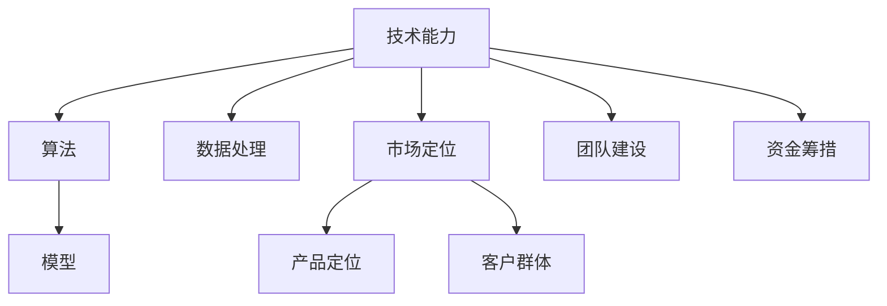

                 

# AI创业的关键成功因素：Lepton AI的经验总结

## 1. 背景介绍

### 1.1 问题由来
随着人工智能技术的迅猛发展，越来越多的企业开始投身于AI创业。然而，AI创业领域的竞争激烈，技术迭代快，市场变化迅速，对创业公司提出了极高的要求。本文章旨在从Lepton AI的经验出发，总结AI创业成功的关键因素，为行业内的创业者提供有益的借鉴。

### 1.2 问题核心关键点
AI创业成功的关键因素包括技术能力、市场定位、团队建设、资金筹措等多个方面。本文将重点探讨技术能力的提升、市场定位的明确、团队建设的重要性以及资金筹措的策略。

## 2. 核心概念与联系

### 2.1 核心概念概述
- **技术能力**：指企业掌握和应用AI核心技术的深度和广度，包括算法、模型、数据处理等方面的技术水平。
- **市场定位**：指企业根据自身技术能力和市场需求，确定的核心产品和目标客户群。
- **团队建设**：指企业如何吸引和留住优秀的技术人才和业务人才，构建高效的团队结构。
- **资金筹措**：指企业如何通过多种渠道获取启动和发展所需的资金，确保项目的顺利进行。

### 2.2 核心概念原理和架构的 Mermaid 流程图

这个流程图展示了AI创业成功的关键因素之间的联系。技术能力是基础，市场定位和团队建设是核心，而资金筹措则是保证项目顺利进行的关键。

## 3. 核心算法原理 & 具体操作步骤

### 3.1 算法原理概述
AI创业成功的关键在于技术能力的提升和应用。本文将重点介绍几种提升技术能力的算法和策略。

### 3.2 算法步骤详解

#### 3.2.1 数据驱动的模型训练
- **步骤1**：收集和整理高质量的数据，确保数据的多样性和代表性。
- **步骤2**：选择合适的模型架构，如卷积神经网络(CNN)、循环神经网络(RNN)、Transformer等。
- **步骤3**：对数据进行预处理，包括特征工程、归一化等。
- **步骤4**：使用GPU或TPU等高性能计算资源进行模型训练。
- **步骤5**：对训练好的模型进行评估和调优，确保模型性能达到最优。

#### 3.2.2 迁移学习的应用
- **步骤1**：选择预训练模型，如BERT、GPT等。
- **步骤2**：将预训练模型迁移到目标任务上，进行微调。
- **步骤3**：使用小批量数据进行微调，避免过拟合。
- **步骤4**：对微调后的模型进行评估和测试，确保模型性能符合要求。

#### 3.2.3 模型的迭代优化
- **步骤1**：根据反馈数据和业务需求，持续改进和优化模型。
- **步骤2**：引入新的算法和框架，提升模型性能。
- **步骤3**：进行A/B测试，验证优化效果。

### 3.3 算法优缺点
- **优点**：
  - 数据驱动的模型训练可以提升模型的准确性和泛化能力。
  - 迁移学习可以大大减少模型训练的时间和数据需求。
  - 模型的迭代优化可以不断提升模型性能，满足业务需求。
- **缺点**：
  - 数据驱动的模型训练对数据质量要求高，数据收集和处理复杂。
  - 迁移学习可能存在模型适应性差的问题，需要更多的数据进行微调。
  - 模型的迭代优化需要持续的时间和资源投入，成本较高。

### 3.4 算法应用领域
这些算法和技术可以应用于多个领域，如自然语言处理(NLP)、计算机视觉(CV)、推荐系统等。

## 4. 数学模型和公式 & 详细讲解 & 举例说明

### 4.1 数学模型构建
- **模型选择**：选择适合目标任务的模型，如CNN用于图像分类，RNN用于文本生成。
- **损失函数**：选择适当的损失函数，如交叉熵损失、均方误差损失等。

### 4.2 公式推导过程
以图像分类为例，假设模型为$f(x; \theta)$，其中$x$为输入图像，$\theta$为模型参数。损失函数为$L(y, f(x; \theta))$，其中$y$为真实标签。模型训练的目标是最小化损失函数：

$$
\min_{\theta} \sum_{i=1}^N L(y_i, f(x_i; \theta))
$$

其中$N$为样本数量。

### 4.3 案例分析与讲解
- **案例1**：使用卷积神经网络进行图像分类。
- **案例2**：使用循环神经网络进行情感分析。
- **案例3**：使用迁移学习提升文本分类模型的准确性。

## 5. 项目实践：代码实例和详细解释说明

### 5.1 开发环境搭建

#### 5.1.1 安装Python
- 下载最新版本的Python，安装到系统环境中。

#### 5.1.2 安装TensorFlow
- 使用pip安装TensorFlow，版本为2.x或3.x。

#### 5.1.3 安装Keras
- 使用pip安装Keras，作为TensorFlow的高层API。

#### 5.1.4 安装NumPy和SciPy
- 使用pip安装NumPy和SciPy，用于科学计算和数据处理。

### 5.2 源代码详细实现

#### 5.2.1 数据准备
- 准备训练集和测试集，使用TensorFlow的Dataset类进行数据处理。

#### 5.2.2 模型定义
- 定义卷积神经网络模型，使用Keras构建。

#### 5.2.3 模型训练
- 使用Keras的Sequential模型训练过程，指定损失函数、优化器和评估指标。

#### 5.2.4 模型评估
- 使用Keras的evaluate函数评估模型性能。

### 5.3 代码解读与分析

#### 5.3.1 代码框架
- 代码框架采用模块化设计，易于理解和维护。
- 主要包含数据准备、模型定义、模型训练和模型评估四个步骤。

#### 5.3.2 代码细节
- 数据准备部分，使用TensorFlow的Dataset类进行数据处理。
- 模型定义部分，使用Keras的Sequential模型定义卷积神经网络。
- 模型训练部分，使用Keras的fit函数进行模型训练。
- 模型评估部分，使用Keras的evaluate函数进行模型评估。

### 5.4 运行结果展示
- 展示训练过程中损失函数的曲线变化。
- 展示模型在测试集上的准确率变化。

## 6. 实际应用场景

### 6.1 智能医疗
- **场景描述**：使用AI技术辅助医疗影像诊断。
- **关键技术**：卷积神经网络、迁移学习、数据增强。
- **应用效果**：提高诊断准确性，减少误诊和漏诊。

### 6.2 金融风控
- **场景描述**：使用AI技术进行信用评估和风险控制。
- **关键技术**：循环神经网络、迁移学习、模型优化。
- **应用效果**：降低信用风险，提高风控效率。

### 6.3 智能客服
- **场景描述**：使用AI技术构建智能客服系统。
- **关键技术**：序列到序列模型、迁移学习、模型迭代优化。
- **应用效果**：提升客服效率，降低人力成本。

### 6.4 未来应用展望
- **趋势1**：深度学习模型的应用领域将进一步扩展，包括自动驾驶、智能制造等。
- **趋势2**：AI创业将更加注重多模态数据的融合，提升模型的泛化能力。
- **趋势3**：AI创业将更加注重可解释性和公平性，提升模型的可信度。

## 7. 工具和资源推荐

### 7.1 学习资源推荐

#### 7.1.1 TensorFlow官方文档
- 提供全面而详细的TensorFlow文档，包含模型构建、训练、评估等内容。

#### 7.1.2 Keras官方文档
- 提供Keras的使用指南，适合快速上手Keras模型构建和训练。

#### 7.1.3 PyTorch官方文档
- 提供PyTorch的使用指南，适合深度学习研究。

#### 7.1.4 Coursera和edX课程
- 提供深度学习和AI创业的课程，涵盖理论知识和实践技能。

### 7.2 开发工具推荐

#### 7.2.1 Jupyter Notebook
- 支持Python代码的编写和运行，方便模型训练和调试。

#### 7.2.2 Google Colab
- 提供免费GPU算力，方便高性能计算任务的运行。

#### 7.2.3 TensorBoard
- 提供模型的可视化工具，方便调试和优化模型。

### 7.3 相关论文推荐

#### 7.3.1 ImageNet大规模视觉识别挑战赛
- 提供图像分类任务的数据集和竞赛结果，推动了深度学习技术的发展。

#### 7.3.2 AlphaGo论文
- 提供机器学习和AI创业的经典案例，展示了AI技术的强大能力。

#### 7.3.3 AI创业的经济学分析
- 提供AI创业的经济分析，探讨创业成功的关键因素。

## 8. 总结：未来发展趋势与挑战

### 8.1 研究成果总结
- **技术能力**：深度学习技术的发展将推动AI创业的成功。
- **市场定位**：明确的定位和市场需求分析是创业成功的关键。
- **团队建设**：优秀的团队是创业成功的基石。
- **资金筹措**：充足的资金支持是创业成功的保障。

### 8.2 未来发展趋势
- **技术趋势**：深度学习模型的应用领域将进一步扩展。
- **市场趋势**：AI创业将更加注重多模态数据的融合。
- **政策趋势**：政府将加大对AI创业的支持力度。

### 8.3 面临的挑战
- **技术挑战**：深度学习模型的训练和优化难度大。
- **市场挑战**：市场竞争激烈，需要持续创新。
- **资金挑战**：资金筹措困难，需要多方渠道支持。

### 8.4 研究展望
- **未来研究**：深入探索AI创业的成功要素，推动AI技术的普及应用。
- **合作研究**：加强与政府、高校的合作，推动AI创业的可持续发展。
- **社会研究**：加强对AI技术的伦理和社会影响研究，确保AI创业的健康发展。

## 9. 附录：常见问题与解答

**Q1: AI创业成功的关键因素有哪些？**
- **A1**：技术能力、市场定位、团队建设、资金筹措是AI创业成功的关键因素。

**Q2: 如何选择适合自己项目的深度学习模型？**
- **A2**：根据项目需求和数据特点选择适当的深度学习模型，如CNN用于图像分类，RNN用于序列数据处理，Transformer用于自然语言处理。

**Q3: 如何评估AI创业项目的成功？**
- **A3**：AI创业项目的成功可以从技术能力提升、市场覆盖扩大、团队建设完善、资金筹措充足等方面进行评估。

**Q4: AI创业项目如何吸引和留住人才？**
- **A4**：提供有竞争力的薪酬、职业发展空间、工作环境和文化氛围，吸引和留住优秀的人才。

**Q5: AI创业项目如何获得融资支持？**
- **A5**：通过市场调研、项目展示、投资者对接等方式，争取到融资支持。

---

作者：禅与计算机程序设计艺术 / Zen and the Art of Computer Programming

