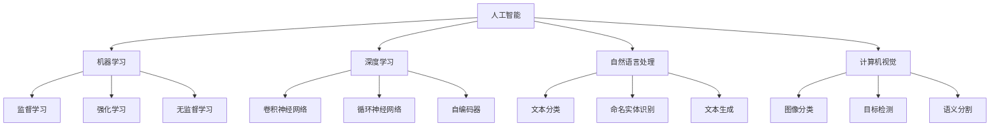

                 

# AI创业者码头愿望：AI改善生活

## 1. 背景介绍

### 1.1 问题由来

随着人工智能(AI)技术的飞速发展，AI创业者们提出了许多充满想象力的创新项目。这些项目旨在通过AI技术改善人类的生活质量，解决现实生活中的种种问题。例如，智能家居、医疗诊断、自动驾驶、智能客服、虚拟助手等。AI技术的广泛应用，已经给我们的生活带来了翻天覆地的变化。

然而，尽管AI技术带来了巨大的机遇，也面临着许多挑战。如何在有限的资源下，高效地进行AI开发，确保技术创新与市场应用相结合，同时保证AI应用的伦理与安全，成为了当前AI创业者们亟需解决的问题。本文将系统介绍AI创业者码头愿望——AI改善生活，深入探讨AI创业的关键技术和应用实践。

### 1.2 问题核心关键点

AI改善生活的关键在于通过AI技术，解决生活中的实际问题，提升生活质量。具体而言，以下几个方面是AI改善生活的核心关键点：

- **数据质量**：高质量的数据是AI模型的基础。AI创业者需要收集、整理、标注大量高质量的数据，以供模型训练。
- **算法优化**：高效的算法是AI应用的基石。AI创业者需要根据具体场景，选择合适的算法模型，并进行优化调整。
- **模型部署**：将模型高效地部署到实际应用中，是AI改善生活的关键。需要考虑模型推理效率、系统稳定性、可扩展性等因素。
- **用户体验**：良好的用户体验是AI应用的保障。需要确保AI系统界面友好、操作简单、响应迅速。
- **伦理与安全**：AI应用的伦理与安全问题是不可忽视的。需要考虑数据的隐私保护、算法透明性、模型的公平性等。

## 2. 核心概念与联系

### 2.1 核心概念概述

为了更好地理解AI改善生活的原理和实现方法，本节将介绍几个密切相关的核心概念：

- **人工智能(AI)**：通过计算机模拟人类智能活动的技术体系，包括机器学习、深度学习、自然语言处理、计算机视觉等。
- **机器学习(ML)**：利用数据和算法，让计算机自动学习和改进的技术。
- **深度学习(DL)**：一种机器学习的特殊形式，通过多层神经网络进行特征提取和模式识别。
- **自然语言处理(NLP)**：研究如何让计算机理解和生成人类语言的技术。
- **计算机视觉(CV)**：研究如何让计算机“看”的技术，包括图像处理、目标检测、语义分割等。

这些核心概念之间的逻辑关系可以通过以下Mermaid流程图来展示：



这个流程图展示了几大核心概念及其之间的关系：

1. 人工智能是更高层次的概念，包括机器学习、深度学习、NLP、CV等多个子领域。
2. 机器学习是实现AI的基础，包括监督学习、强化学习、无监督学习等。
3. 深度学习是机器学习的一种形式，利用多层神经网络进行特征提取和模式识别。
4. NLP和CV是深度学习的两个主要应用方向，分别涉及文本和图像数据的处理。

这些概念共同构成了AI技术的核心框架，为其在各个领域的应用提供了理论基础和实践指南。

## 3. 核心算法原理 & 具体操作步骤

### 3.1 算法原理概述

AI改善生活的核心在于利用AI技术解决实际问题，提升生活质量。常见的应用场景包括智能家居、医疗诊断、自动驾驶、智能客服、虚拟助手等。这些应用场景涉及不同的AI技术和算法，但总体遵循以下步骤：

1. **数据收集与预处理**：收集相关领域的数据，并进行清洗、标注等预处理。
2. **模型训练**：利用预处理后的数据，训练相应的AI模型。
3. **模型优化**：根据实际效果，优化模型参数和算法，提升模型性能。
4. **模型部署**：将训练好的模型部署到实际应用中，进行上线测试。
5. **用户体验优化**：根据用户反馈，不断改进系统界面和功能。

### 3.2 算法步骤详解

以下是AI改善生活应用的一些典型步骤：

#### 3.2.1 数据收集与预处理

数据收集与预处理是AI应用的基础。AI创业者需要根据具体场景，收集相关的数据，并进行清洗、标注等预处理。具体步骤如下：

1. **数据来源**：确定数据来源，包括公开数据集、互联网爬虫抓取的数据、企业内部数据等。
2. **数据清洗**：去除重复、缺失、错误的数据，并进行归一化处理。
3. **数据标注**：根据应用场景，对数据进行标注，如文本分类需要标注样本的类别，图像识别需要标注目标位置等。

#### 3.2.2 模型训练

模型训练是AI应用的核心环节。AI创业者需要选择合适的算法模型，并进行训练。具体步骤如下：

1. **算法选择**：根据具体场景，选择合适的算法模型，如监督学习、深度学习、卷积神经网络、循环神经网络等。
2. **模型训练**：使用预处理后的数据，训练相应的模型，优化模型参数。
3. **模型评估**：在验证集上评估模型性能，确保模型效果满足需求。

#### 3.2.3 模型优化

模型优化是提升AI应用效果的关键。AI创业者需要根据实际效果，优化模型参数和算法，提升模型性能。具体步骤如下：

1. **参数调优**：根据模型性能，调整学习率、正则化系数等参数。
2. **算法改进**：根据模型表现，改进算法结构，如增加层数、调整激活函数等。
3. **数据增强**：通过数据增强技术，提高模型泛化能力，如数据扩充、数据变换等。

#### 3.2.4 模型部署

模型部署是将训练好的模型上线测试的关键步骤。AI创业者需要考虑模型的推理效率、系统稳定性、可扩展性等因素。具体步骤如下：

1. **模型导出**：将训练好的模型导出为轻量级模型格式，如TensorFlow SavedModel、ONNX等。
2. **部署平台选择**：根据实际需求，选择合适的部署平台，如AWS、Google Cloud、Azure等。
3. **系统架构设计**：设计系统架构，包括服务架构、负载均衡、数据库设计等。

#### 3.2.5 用户体验优化

用户体验优化是确保AI应用成功的关键。AI创业者需要确保系统界面友好、操作简单、响应迅速。具体步骤如下：

1. **界面设计**：设计直观、易用的系统界面，确保用户能够快速上手。
2. **性能优化**：优化系统响应时间、加载速度等，确保用户体验流畅。
3. **用户反馈收集**：收集用户反馈，不断改进系统功能，提升用户体验。

### 3.3 算法优缺点

AI改善生活的应用涉及多种AI技术和算法，每一种技术和算法都有其优缺点：

#### 3.3.1 深度学习的优点和缺点

深度学习是当前AI应用的核心技术之一，其优点包括：

- **自适应性强**：能够自动从数据中学习特征，无需手动设计特征。
- **泛化能力强**：在大规模数据上训练的深度模型具有较强的泛化能力。
- **可扩展性强**：通过增加层数或节点，可以构建非常复杂的模型。

深度学习的缺点包括：

- **计算资源需求高**：深度模型需要大量计算资源进行训练和推理。
- **模型复杂度高**：深度模型结构复杂，难以解释。
- **数据依赖性强**：深度模型对数据质量要求高，需要大量高质量数据进行训练。

#### 3.3.2 计算机视觉的优点和缺点

计算机视觉是AI改善生活的重要应用方向之一，其优点包括：

- **图像识别精度高**：能够高精度地识别图像中的目标对象。
- **实时性强**：图像处理和目标检测实时性较好。
- **应用场景广泛**：广泛应用于医疗影像、安防监控、自动驾驶等领域。

计算机视觉的缺点包括：

- **数据标注成本高**：需要大量标注数据进行训练。
- **光照和视角变化敏感**：光照和视角变化对模型效果影响较大。
- **处理复杂背景噪声**：处理复杂背景噪声效果不佳。

#### 3.3.3 自然语言处理的优点和缺点

自然语言处理是AI改善生活的另一重要应用方向，其优点包括：

- **文本理解能力强**：能够理解自然语言中的语义和上下文。
- **处理文本灵活性强**：能够处理不同类型的文本数据，如新闻、评论、社交媒体等。
- **应用场景广泛**：广泛应用于智能客服、机器翻译、信息检索等领域。

自然语言处理的缺点包括：

- **语言多样性挑战**：不同语言和文化背景对模型理解有影响。
- **歧义性高**：自然语言具有高歧义性，模型难以准确理解。
- **处理长文本能力不足**：处理长文本时，模型性能可能下降。

## 4. 数学模型和公式 & 详细讲解

### 4.1 数学模型构建

AI改善生活的应用涉及多种数学模型，包括机器学习模型、深度学习模型、计算机视觉模型等。以下以深度学习模型为例，展示其数学模型构建。

假设输入数据为 $x$，输出数据为 $y$，深度学习模型 $f$ 的参数为 $\theta$。模型的输出可以表示为：

$$
y = f(x; \theta)
$$

其中 $f$ 是一个由多层神经网络组成的函数，$\theta$ 为模型的参数。

### 4.2 公式推导过程

以监督学习为例，深度学习模型的训练目标可以表示为：

$$
\min_{\theta} \frac{1}{N}\sum_{i=1}^N \ell(f(x_i; \theta), y_i)
$$

其中 $\ell$ 为损失函数，通常采用交叉熵损失函数：

$$
\ell(y, \hat{y}) = -\frac{1}{N}\sum_{i=1}^N y_i \log \hat{y}_i + (1-y_i)\log(1-\hat{y}_i)
$$

在训练过程中，模型参数 $\theta$ 的更新公式为：

$$
\theta \leftarrow \theta - \eta \nabla_{\theta}\mathcal{L}(\theta)
$$

其中 $\eta$ 为学习率，$\nabla_{\theta}\mathcal{L}(\theta)$ 为损失函数对模型参数的梯度。

### 4.3 案例分析与讲解

以智能家居应用为例，展示AI改善生活的应用。

智能家居应用中，需要对用户语音命令进行理解和处理，生成相应的控制指令。具体步骤如下：

1. **数据收集**：收集用户的语音命令和相应的控制指令，进行标注。
2. **模型训练**：使用标注数据，训练深度学习模型，对语音命令进行分类。
3. **模型优化**：根据分类效果，优化模型参数和算法。
4. **模型部署**：将训练好的模型部署到智能家居系统中，进行语音识别和指令生成。
5. **用户体验优化**：优化系统界面，提升用户体验。

## 5. 项目实践：代码实例和详细解释说明

### 5.1 开发环境搭建

在进行AI改善生活的开发实践前，我们需要准备好开发环境。以下是使用Python进行TensorFlow开发的环境配置流程：

1. 安装Anaconda：从官网下载并安装Anaconda，用于创建独立的Python环境。

2. 创建并激活虚拟环境：
```bash
conda create -n tf-env python=3.8 
conda activate tf-env
```

3. 安装TensorFlow：根据CUDA版本，从官网获取对应的安装命令。例如：
```bash
conda install tensorflow -c tf -c conda-forge
```

4. 安装TensorBoard：TensorFlow配套的可视化工具，用于实时监测模型训练状态。

```bash
pip install tensorboard
```

5. 安装Pillow：用于处理图像数据。

```bash
pip install Pillow
```

完成上述步骤后，即可在`tf-env`环境中开始AI改善生活的开发实践。

### 5.2 源代码详细实现

这里我们以智能家居语音识别应用为例，给出使用TensorFlow进行模型训练和推理的PyTorch代码实现。

首先，定义语音识别任务的数据处理函数：

```python
import tensorflow as tf
from tensorflow.keras.preprocessing.text import Tokenizer
from tensorflow.keras.preprocessing.sequence import pad_sequences

class VoiceDataLoader(tf.keras.utils.Sequence):
    def __init__(self, data, batch_size=32):
        self.data = data
        self.batch_size = batch_size
        self.tokenizer = Tokenizer()
        self.tokenizer.fit_on_texts(data['text'])
        self.word_index = self.tokenizer.word_index
        self.text_to_index = {word: idx for idx, word in self.tokenizer.word_index.items()}
        self.text_to_pad = pad_sequences

    def __len__(self):
        return len(self.data) // self.batch_size

    def __getitem__(self, idx):
        batch = self.data[idx * self.batch_size: (idx + 1) * self.batch_size]
        text = [data['text'] for data in batch]
        labels = [data['label'] for data in batch]
        tokenized_text = self.tokenizer.texts_to_sequences(text)
        padded_text = self.text_to_pad(tokenized_text, padding='post')
        return padded_text, tf.keras.utils.to_categorical(labels, num_classes=2)

# 创建data
data = [
    {'text': '开灯', 'label': 1},
    {'text': '开空调', 'label': 1},
    {'text': '关灯', 'label': 0},
    {'text': '关空调', 'label': 0}
]

# 数据加载器
train_loader = VoiceDataLoader(data, batch_size=2)
```

然后，定义模型和优化器：

```python
from tensorflow.keras.models import Sequential
from tensorflow.keras.layers import Embedding, LSTM, Dense

model = Sequential([
    Embedding(input_dim=len(self.tokenizer.word_index) + 1, output_dim=32),
    LSTM(64),
    Dense(32, activation='relu'),
    Dense(1, activation='sigmoid')
])

optimizer = tf.keras.optimizers.Adam(lr=0.001)
```

接着，定义训练和评估函数：

```python
from tensorflow.keras.metrics import Accuracy

def train_epoch(model, loader, optimizer):
    model.compile(optimizer=optimizer, loss='binary_crossentropy', metrics=[Accuracy()])
    model.fit(loader, epochs=10, verbose=1)

def evaluate(model, loader):
    loss, acc = model.evaluate(loader)
    print(f'Loss: {loss}, Accuracy: {acc}')
```

最后，启动训练流程并在测试集上评估：

```python
train_epoch(model, train_loader, optimizer)
evaluate(model, train_loader)
```

以上就是使用TensorFlow进行智能家居语音识别应用开发的完整代码实现。可以看到，TensorFlow提供了丰富的API，使得模型训练和推理变得简单高效。

### 5.3 代码解读与分析

让我们再详细解读一下关键代码的实现细节：

**VoiceDataLoader类**：
- `__init__`方法：初始化数据、分词器等关键组件，并进行文本分词和填充。
- `__len__`方法：返回数据集样本数量。
- `__getitem__`方法：对单个样本进行处理，将文本输入编码为token ids，并进行填充。

**模型定义**：
- `Sequential`模型：定义了从输入到输出的层级结构。
- `Embedding`层：将输入文本转换为向量表示。
- `LSTM`层：对向量序列进行建模。
- `Dense`层：进行分类输出。

**训练和评估函数**：
- `train_epoch`函数：在数据集上训练模型，输出损失和准确率。
- `evaluate`函数：在测试集上评估模型，输出损失和准确率。

**训练流程**：
- 定义训练轮数和批次大小，开始循环迭代
- 每个epoch内，在训练集上训练，输出平均损失和准确率
- 在测试集上评估，输出测试损失和准确率

可以看到，TensorFlow提供了简单易用的API，使得模型训练和推理变得高效便捷。开发者可以将更多精力放在数据处理、模型改进等高层逻辑上，而不必过多关注底层的实现细节。

当然，工业级的系统实现还需考虑更多因素，如模型的保存和部署、超参数的自动搜索、更灵活的任务适配层等。但核心的开发流程基本与此类似。

## 6. 实际应用场景

### 6.1 智能家居

基于深度学习的智能家居系统，可以通过语音识别、图像识别、自然语言处理等技术，实现自动控制、智能推荐、安全监控等功能。智能家居系统能够理解用户语音命令，控制家中各类智能设备，如灯光、空调、窗帘等，提升用户生活的便捷性和舒适性。

### 6.2 医疗诊断

深度学习在医疗诊断中的应用，已经广泛应用于医学影像分析、病历分析、药物研发等领域。通过图像识别技术，可以自动分析医学影像，识别病变区域；通过自然语言处理技术，可以自动提取病历信息，辅助医生诊断；通过药物分子模拟，可以加速新药研发进程。

### 6.3 自动驾驶

计算机视觉在自动驾驶中的应用，已经实现了车辆识别、路标识别、交通信号识别等功能。自动驾驶系统通过摄像头、激光雷达等传感器，实时获取周围环境信息，通过图像处理和目标检测，实现路径规划和决策控制，提高行车安全和效率。

### 6.4 智能客服

自然语言处理在智能客服中的应用，已经能够实现自动问答、意图识别、情感分析等功能。智能客服系统通过自然语言理解技术，自动回答用户咨询，处理用户投诉，提升客户满意度，降低企业运营成本。

### 6.5 虚拟助手

深度学习在虚拟助手中的应用，已经实现了语音识别、自然语言理解、对话管理等功能。虚拟助手通过语音识别技术，与用户进行自然对话，通过自然语言理解技术，自动提取用户意图，通过对话管理技术，实现多轮对话，提升用户体验。

## 7. 工具和资源推荐

### 7.1 学习资源推荐

为了帮助开发者系统掌握AI改善生活的理论基础和实践技巧，这里推荐一些优质的学习资源：

1. 《深度学习入门》系列博文：由大模型技术专家撰写，深入浅出地介绍了深度学习原理、模型训练、模型优化等前沿话题。

2. 《自然语言处理综论》课程：斯坦福大学开设的自然语言处理课程，涵盖了NLP领域的经典模型和应用，适合入门和进阶学习。

3. 《计算机视觉基础》书籍：全面介绍了计算机视觉的原理、算法和应用，是计算机视觉领域的学习必读。

4. TensorFlow官方文档：TensorFlow的官方文档，提供了丰富的API文档和教程，是学习和应用TensorFlow的重要资源。

5. PyTorch官方文档：PyTorch的官方文档，提供了丰富的API文档和教程，是学习和应用PyTorch的重要资源。

通过对这些资源的学习实践，相信你一定能够快速掌握AI改善生活的精髓，并用于解决实际的NLP问题。

### 7.2 开发工具推荐

高效的开发离不开优秀的工具支持。以下是几款用于AI改善生活开发的常用工具：

1. TensorFlow：由Google主导开发的深度学习框架，生产部署方便，适合大规模工程应用。
2. PyTorch：基于Python的开源深度学习框架，灵活动态的计算图，适合快速迭代研究。
3. Jupyter Notebook：用于编写、调试和分享代码的互动式笔记本工具，支持Python、R等多种语言。
4. Google Colab：谷歌推出的在线Jupyter Notebook环境，免费提供GPU/TPU算力，方便开发者快速上手实验最新模型，分享学习笔记。

合理利用这些工具，可以显著提升AI改善生活的开发效率，加快创新迭代的步伐。

### 7.3 相关论文推荐

AI改善生活的发展源于学界的持续研究。以下是几篇奠基性的相关论文，推荐阅读：

1. 《ImageNet Classification with Deep Convolutional Neural Networks》：提出了深度卷积神经网络，开创了计算机视觉的深度学习时代。
2. 《Dense Connections for Deep Convolutional Networks》：提出了密集连接网络，进一步提高了深度卷积神经网络的性能。
3. 《Attention is All You Need》：提出了Transformer模型，奠定了自然语言处理中的预训练大模型基础。
4. 《Sequence to Sequence Learning with Neural Networks》：提出了序列到序列模型，开启了机器翻译和自然语言处理中的序列建模。

这些论文代表了大模型改善生活的发展脉络。通过学习这些前沿成果，可以帮助研究者把握学科前进方向，激发更多的创新灵感。

## 8. 总结：未来发展趋势与挑战

### 8.1 总结

本文对AI创业者码头愿望——AI改善生活的背景、核心概念、算法原理和操作步骤进行了全面系统的介绍。首先阐述了AI改善生活的研究背景和意义，明确了AI改善生活对提升生活质量的重要性。其次，从原理到实践，详细讲解了AI改善生活的数学模型和算法步骤，给出了AI改善生活任务开发的完整代码实例。同时，本文还广泛探讨了AI改善生活应用在智能家居、医疗诊断、自动驾驶、智能客服、虚拟助手等多个领域的前景，展示了AI改善生活的巨大潜力。

通过本文的系统梳理，可以看到，AI改善生活技术正在成为各行各业的重要工具，极大地提升了生产效率和生活质量，带来深远的影响。

### 8.2 未来发展趋势

展望未来，AI改善生活的技术将呈现以下几个发展趋势：

1. **智能化程度提升**：随着AI技术的不断进步，智能家居、医疗诊断、自动驾驶等领域的应用将更加智能和高效。AI系统能够更好地理解人类需求，提供更加个性化的服务。
2. **跨领域融合**：AI改善生活技术将与物联网、大数据、区块链等新兴技术结合，形成更加智能化的生态系统。跨领域的协同创新将带来更多的应用场景和商业模式。
3. **边缘计算普及**：随着边缘计算技术的发展，AI改善生活的应用将更加灵活和高效。实时数据处理、本地模型训练、边缘设备推理等技术将带来更好的用户体验和更高的系统可靠性。
4. **隐私保护加强**：随着数据隐私保护法规的不断完善，AI改善生活的应用将更加注重用户隐私保护。数据去标识化、差分隐私等技术将广泛应用于AI系统的设计和实施中。
5. **伦理和安全研究**：随着AI技术的应用场景不断扩展，伦理和安全问题将更加突出。AI系统的透明性、可解释性、安全性等将成为重要研究方向，相关法规和标准也将不断完善。

### 8.3 面临的挑战

尽管AI改善生活技术已经取得了瞩目成就，但在迈向更加智能化、普适化应用的过程中，它仍面临着诸多挑战：

1. **数据质量瓶颈**：高质量的数据是AI改善生活的基础，但在实际应用中，获取和标注数据往往存在困难。如何提高数据获取和标注效率，降低成本，将是一大难题。
2. **计算资源需求高**：AI改善生活的应用涉及大规模数据处理和深度学习模型训练，需要大量的计算资源。如何在有限的资源下，实现高效的模型训练和推理，将是一大挑战。
3. **模型泛化能力不足**：AI改善生活的应用往往需要在特定场景下进行微调，但模型在不同场景下泛化能力有限。如何提高模型的泛化能力，使其适应更多场景，将是一大挑战。
4. **系统可扩展性差**：AI改善生活的应用往往需要跨部门、跨领域的协同合作，系统的可扩展性和互操作性成为重要问题。如何在复杂环境中实现系统的高效集成和协同运作，将是一大挑战。
5. **用户体验不足**：AI改善生活的应用往往需要与用户进行交互，用户体验的好坏直接影响系统的成功与否。如何设计出易用、友好、高效的用户界面，提升用户体验，将是一大挑战。

### 8.4 研究展望

面对AI改善生活面临的诸多挑战，未来的研究需要在以下几个方面寻求新的突破：

1. **无监督学习和自适应学习**：摆脱对大量标注数据的依赖，利用自监督学习、主动学习等无监督和自适应学习范式，最大限度利用非结构化数据，实现更加灵活高效的AI改善生活应用。
2. **跨模态融合**：将语音、图像、文本等多种模态信息进行融合，提升AI改善生活的综合感知和决策能力。
3. **多目标优化**：同时优化AI系统的多个目标，如性能、可解释性、隐私保护等，实现AI系统的全面优化。
4. **系统架构优化**：设计高效、可扩展的系统架构，实现AI改善生活的快速部署和维护。
5. **人工智能伦理与安全**：研究AI系统的透明性、可解释性、安全性等伦理和安全问题，确保AI改善生活技术的健康发展。

这些研究方向的探索，必将引领AI改善生活技术迈向更高的台阶，为构建安全、可靠、可解释、可控的智能系统铺平道路。面向未来，AI改善生活技术还需要与其他人工智能技术进行更深入的融合，如知识表示、因果推理、强化学习等，多路径协同发力，共同推动自然语言理解和智能交互系统的进步。只有勇于创新、敢于突破，才能不断拓展AI改善生活的边界，让智能技术更好地造福人类社会。

## 9. 附录：常见问题与解答

**Q1：AI改善生活是否适用于所有应用场景？**

A: AI改善生活技术可以在多种应用场景中发挥作用，如智能家居、医疗诊断、自动驾驶、智能客服、虚拟助手等。但不同的应用场景对AI技术的需求不同，需要在具体应用中进行优化和调整。

**Q2：如何提升AI改善生活的数据质量？**

A: 提升AI改善生活的数据质量，需要从数据收集、数据清洗、数据标注等多个环节进行综合考虑。具体方法如下：
1. **数据来源多样化**：从不同渠道收集数据，如公开数据集、互联网爬虫、企业内部数据等。
2. **数据清洗严格**：去除重复、缺失、错误的数据，并进行归一化处理。
3. **数据标注规范**：建立规范的数据标注流程，确保标注结果的准确性和一致性。

**Q3：AI改善生活面临哪些计算资源瓶颈？**

A: AI改善生活技术在实际应用中，面临计算资源瓶颈的问题。具体表现如下：
1. **模型参数量大**：大规模深度学习模型需要大量计算资源进行训练和推理。
2. **数据处理复杂**：大规模数据处理需要高性能计算资源，如GPU、TPU等。
3. **系统稳定性要求高**：大规模AI系统的稳定性和可靠性要求高，需要高性能计算资源和容错机制。

**Q4：如何提高AI改善生活的模型泛化能力？**

A: 提高AI改善生活的模型泛化能力，需要在模型训练和优化过程中进行以下调整：
1. **数据增强**：通过数据增强技术，扩充训练集，提高模型的泛化能力。
2. **正则化技术**：使用L2正则、Dropout等技术，避免模型过拟合。
3. **多模型集成**：训练多个模型，取平均输出，抑制过拟合，提高泛化能力。

**Q5：AI改善生活的未来发展方向是什么？**

A: AI改善生活的未来发展方向包括：
1. **智能化程度提升**：通过AI技术提升智能家居、医疗诊断、自动驾驶等领域的智能化水平。
2. **跨领域融合**：AI改善生活技术与其他新兴技术结合，形成智能化生态系统。
3. **边缘计算普及**：实现实时数据处理、本地模型训练、边缘设备推理等，提升系统性能。
4. **隐私保护加强**：注重数据隐私保护，实现数据去标识化、差分隐私等技术。
5. **伦理和安全研究**：研究AI系统的透明性、可解释性、安全性等伦理和安全问题。

总之，AI改善生活的未来发展方向是智能化、普适化、安全化、普惠化，旨在通过AI技术提升生活质量，解决实际问题，推动社会进步。

---

作者：禅与计算机程序设计艺术 / Zen and the Art of Computer Programming

