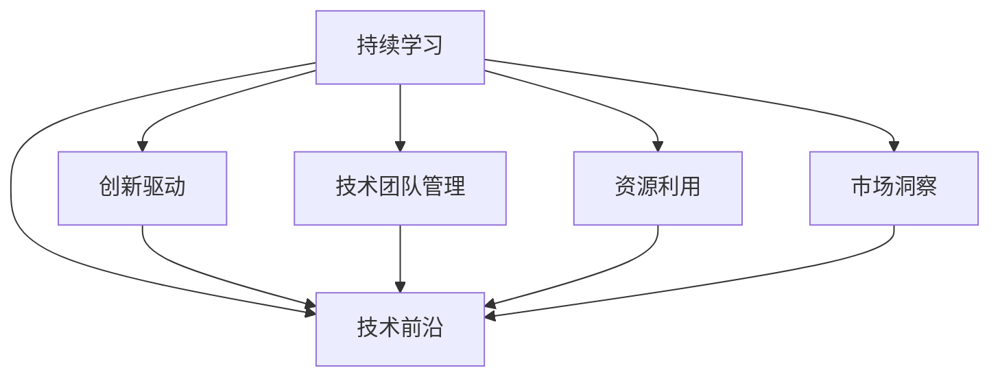

                 

# AI创业：保持技术前沿的方法

> 关键词：AI创业, 技术前沿, 持续学习, 创新驱动, 技术团队管理

## 1. 背景介绍

### 1.1 问题由来

在当今快速发展的科技时代，AI技术正以前所未有的速度改变着各个行业的面貌。从自动驾驶、智能医疗到金融风控、教育科技，几乎所有领域都在拥抱AI的力量。对于AI创业者来说，如何在瞬息万变的技术趋势中保持技术前沿，是持续成功的关键。本文将探讨如何通过有效的学习和实践方法，持续提升AI创业公司的技术能力，不断创新，引领行业发展。

### 1.2 问题核心关键点

在AI创业中，保持技术前沿涉及多个方面：

1. **持续学习与创新**：如何快速学习新知识并应用到实际项目中，不断推陈出新。
2. **团队建设与管理**：如何组建和维护一支高效、创新、充满活力的技术团队。
3. **资源管理与利用**：如何有效管理人力、物力资源，最大化技术投入的产出。
4. **市场趋势洞察**：如何通过分析市场动态，预测技术发展趋势，确保技术方向正确。

本文将围绕以上关键点，详细解析AI创业公司如何保持技术前沿，探索最有效的策略和方法。

## 2. 核心概念与联系

### 2.1 核心概念概述

在探讨技术前沿的保持方法之前，需要先了解一些核心概念：

- **持续学习（Continuous Learning）**：指的是在职业生涯中不断学习新知识、新技能，保持自己的技术能力和知识体系的更新。
- **创新驱动（Innovation-Driven）**：强调创新在技术发展中的核心作用，鼓励团队不断探索新技术、新方法。
- **技术团队管理（Technical Team Management）**：涉及如何招募、培养、管理技术人才，以及构建高效协作的团队文化。
- **资源利用与优化（Resource Utilization and Optimization）**：关注如何有效利用技术资源，优化资源配置，提升技术投资的回报率。
- **市场洞察（Market Insight）**：指通过市场分析、用户反馈等方式，准确把握技术发展的趋势和用户需求。

这些概念相互关联，共同构成了保持技术前沿的基础框架。

### 2.2 核心概念原理和架构的 Mermaid 流程图



此流程图展示了持续学习、创新驱动、技术团队管理、资源利用与优化以及市场洞察五个核心概念之间的逻辑关系，共同支撑着AI创业公司保持技术前沿的目标。

## 3. 核心算法原理 & 具体操作步骤

### 3.1 算法原理概述

要保持技术前沿，需要构建一个持续的、动态的技术学习系统，通过不断的学习和实践，推动技术进步。以下是一些关键的算法原理：

- **正反馈机制（Positive Feedback Loop）**：持续获取用户反馈，将反馈信息转化为技术改进的动力。
- **交叉学科学习（Interdisciplinary Learning）**：鼓励团队成员跨领域学习，提升多学科融合能力。
- **动态资源调整（Dynamic Resource Allocation）**：根据项目需求和市场变化，灵活调整技术资源。
- **市场趋势分析（Market Trend Analysis）**：利用数据分析和机器学习模型，预测市场和技术发展趋势。

### 3.2 算法步骤详解

#### 3.2.1 正反馈机制

**步骤1：收集用户反馈**  
收集用户的即时反馈和长期反馈，通过问卷调查、用户访谈等方式，了解用户需求和技术瓶颈。

**步骤2：分析反馈信息**  
将反馈信息进行分类和筛选，识别出共性问题和潜在需求，利用数据分析工具进行深入分析。

**步骤3：技术改进**  
根据反馈信息，制定技术改进计划，调整产品功能或优化算法模型，进行必要的技术迭代。

**步骤4：用户验证**  
将改进后的技术重新交付给用户，进行小范围试点测试，验证改进效果。

**步骤5：持续优化**  
根据试点测试结果，进一步优化技术方案，逐步推广到全域用户。

#### 3.2.2 交叉学科学习

**步骤1：识别交叉学科领域**  
分析项目的技术需求，识别出与现有技术无关或部分相关的交叉学科领域，如物理学、生物学、经济学等。

**步骤2：学习基础知识**  
组织团队成员进行交叉学科的基础学习，掌握相关领域的核心概念和基础理论。

**步骤3：应用跨领域知识**  
在技术研发过程中，鼓励团队成员应用跨领域知识，解决技术难题，提升技术创新的可能性。

**步骤4：跨学科合作**  
组建跨学科团队，定期举办跨学科交流会议，促进不同领域知识的碰撞和融合。

#### 3.2.3 动态资源调整

**步骤1：资源需求分析**  
根据项目进展和市场变化，评估技术资源的需求，包括人力资源、硬件设备、软件工具等。

**步骤2：资源配置规划**  
制定资源配置规划，优先保证核心技术的研发投入，合理分配非核心项目的资源。

**步骤3：动态调整机制**  
建立动态调整机制，根据项目进展和市场反馈，灵活调整资源分配，确保资源投入与技术需求匹配。

**步骤4：评估效果**  
定期评估资源调整效果，通过项目进展、技术成果、市场反馈等指标，调整资源配置策略。

#### 3.2.4 市场趋势分析

**步骤1：数据收集**  
收集市场数据，包括用户行为数据、竞争对手动态、行业报告等，建立全面的市场数据体系。

**步骤2：数据分析**  
利用机器学习模型，如时间序列分析、聚类分析等，对市场数据进行深入分析，预测市场和技术发展趋势。

**步骤3：策略制定**  
根据市场趋势分析结果，制定技术发展策略，确定优先研发方向和未来技术布局。

**步骤4：实施和验证**  
实施策略，持续跟踪市场动态，及时调整技术方向，确保技术前沿性。

### 3.3 算法优缺点

**持续学习的优点**：  
- 提高技术能力，紧跟技术前沿  
- 增强团队竞争力，提升企业创新力  
- 优化资源配置，提高技术投资回报率

**持续学习的缺点**：  
- 需要持续投入时间和精力  
- 技术快速变化，难以跟上所有趋势  
- 学习成本高，需要高质量的学习资源

**创新驱动的优点**：  
- 激发团队创造力，产生更多创新  
- 提升产品竞争力，保持市场领先  
- 加速技术迭代，提升用户满意度

**创新驱动的缺点**：  
- 风险高，创新可能失败  
- 需要持续投入研发资源  
- 创新周期长，见效慢

**技术团队管理的优点**：  
- 提高团队协作效率  
- 优化人才结构，提升团队整体能力  
- 培养团队文化，增强团队凝聚力

**技术团队管理的缺点**：  
- 管理复杂，需要专业人才  
- 团队成员的个人成长与团队目标可能存在冲突  
- 文化建设难度大，需要时间和耐心

**资源利用与优化的优点**：  
- 提高资源利用效率  
- 降低技术研发成本  
- 提升技术投资回报率

**资源利用与优化的缺点**：  
- 需要精细化管理  
- 管理复杂，需要持续监控和调整  
- 动态调整可能影响项目进度

**市场洞察的优点**：  
- 准确把握市场和技术趋势  
- 优化产品和服务，提升用户满意度  
- 预测未来发展方向，领先竞争者

**市场洞察的缺点**：  
- 需要大量数据和分析工具  
- 市场变化快，需要快速响应  
- 数据质量影响洞察准确性

### 3.4 算法应用领域

基于以上算法原理，AI创业公司可以在以下几个领域中应用：

- **技术研发**：通过正反馈机制、交叉学科学习、动态资源调整等方法，持续提升技术研发能力，保持技术前沿。
- **产品创新**：利用创新驱动、市场洞察等策略，快速推出具有竞争力的新产品。
- **团队建设**：通过技术团队管理，打造高效、创新的团队文化，吸引和留住优秀人才。
- **资源优化**：通过动态资源调整，优化资源配置，提升技术投入的回报率。
- **市场拓展**：利用市场洞察，把握市场机会，快速扩展市场份额。

## 4. 数学模型和公式 & 详细讲解 & 举例说明

### 4.1 数学模型构建

为了更准确地描述和分析技术前沿保持的方法，可以使用数学模型来构建技术学习系统的框架。

假设技术前沿保持系统由以下几个子系统组成：

- $S_{持续学习}$：持续获取和分析用户反馈的系统。
- $S_{创新驱动}$：通过交叉学科学习和创新活动，推动技术进步的系统。
- $S_{技术团队管理}$：管理和培养技术团队的系统。
- $S_{资源利用}$：优化资源配置的系统。
- $S_{市场洞察}$：分析和预测市场趋势的系统。

这些子系统之间通过信息流和决策流相互影响，共同作用于技术前沿保持的目标。

### 4.2 公式推导过程

设 $L_t$ 为技术前沿保持系统的效能，可以表示为各个子系统效能的加权和：

$$
L_t = w_{持续学习}L_{持续学习} + w_{创新驱动}L_{创新驱动} + w_{技术团队管理}L_{技术团队管理} + w_{资源利用}L_{资源利用} + w_{市场洞察}L_{市场洞察}
$$

其中 $w$ 为各子系统的权重，可以通过实际需求和效果进行设定。

**持续学习系统**：

设 $L_{持续学习} = f_{用户反馈}U_{反馈} + f_{数据分析}A_{分析} + f_{技术改进}C_{改进}$

其中 $U_{反馈}$ 为从用户反馈中提取的知识量，$A_{分析}$ 为数据分析的准确性和时效性，$C_{改进}$ 为技术改进的效果。

**创新驱动系统**：

设 $L_{创新驱动} = g_{交叉学科学习}X_{学习} + g_{创新活动}I_{活动} + g_{知识产权}P_{专利}$

其中 $X_{学习}$ 为交叉学科学习的深度和广度，$I_{活动}$ 为创新活动的数量和质量，$P_{专利}$ 为申请的专利数量和技术影响力。

**技术团队管理系统**：

设 $L_{技术团队管理} = h_{人才招聘}T_{招聘} + h_{培训发展}D_{发展} + h_{团队协作}K_{协作}$

其中 $T_{招聘}$ 为招聘的人才质量，$D_{发展}$ 为培训效果，$K_{协作}$ 为团队协作的效率和稳定性。

**资源利用系统**：

设 $L_{资源利用} = j_{资源配置}R_{配置} + j_{动态调整}D_{调整} + j_{成本控制}C_{控制}$

其中 $R_{配置}$ 为资源配置的合理性，$D_{调整}$ 为动态调整的灵活性，$C_{控制}$ 为成本控制的有效性。

**市场洞察系统**：

设 $L_{市场洞察} = k_{数据收集}D_{收集} + k_{趋势分析}T_{分析} + k_{策略实施}S_{实施}$

其中 $D_{收集}$ 为数据收集的完整性和准确性，$T_{分析}$ 为趋势分析的准确性和及时性，$S_{实施}$ 为策略实施的效果和反馈。

### 4.3 案例分析与讲解

**案例1：OpenAI的GPT系列模型**

OpenAI的GPT系列模型通过持续收集用户反馈，不断改进模型，提升其在自然语言处理（NLP）领域的竞争力。其正反馈机制和持续学习系统确保了技术前沿的不断推进。

**案例2：Google的TensorFlow**

Google的TensorFlow通过引入跨学科学习，利用计算机科学、数学、统计学等多领域知识，推动了深度学习技术的发展。其创新驱动系统增强了团队的技术创新能力。

**案例3：IBM的Watson**

IBM的Watson通过优化资源配置和市场洞察，成功应用于医疗、金融、教育等多个领域，提升了企业的市场影响力。其动态资源调整和市场洞察系统确保了技术前沿的有效保持。

## 5. 项目实践：代码实例和详细解释说明

### 5.1 开发环境搭建

为了实践上述技术前沿保持的方法，需要搭建一个完整的开发环境，包括：

1. **编程语言和框架**：Python和TensorFlow/PyTorch是最常用的AI开发语言和框架。
2. **数据集和工具**：TensorFlow Dataset、Pandas、NumPy等工具库，用于数据处理和分析。
3. **环境管理工具**：Anaconda或Miniconda，用于创建和管理虚拟环境。
4. **版本控制工具**：Git和GitHub，用于版本管理和代码协作。

以下是一个基本的Python开发环境配置示例：

```bash
# 创建虚拟环境
conda create -n my_env python=3.8
conda activate my_env

# 安装依赖包
pip install tensorflow pandas numpy matplotlib scikit-learn
```

### 5.2 源代码详细实现

#### 5.2.1 用户反馈收集与分析

**代码实现**：

```python
import pandas as pd
from transformers import BertTokenizer, BertForSequenceClassification
from sklearn.model_selection import train_test_split

# 数据集处理
tokenizer = BertTokenizer.from_pretrained('bert-base-uncased')
df = pd.read_csv('user_feedback.csv')
df = df.dropna(subset=['text', 'label'])
train_texts, dev_texts, train_labels, dev_labels = train_test_split(df['text'], df['label'], test_size=0.2)

# 模型训练
model = BertForSequenceClassification.from_pretrained('bert-base-uncased', num_labels=2)
train_dataset = TensorDataset(train_texts, train_labels)
dev_dataset = TensorDataset(dev_texts, dev_labels)
model.to('cuda')
optimizer = AdamW(model.parameters(), lr=2e-5)
model.train()
for epoch in range(5):
    train_loss = train_epoch(model, train_dataset, optimizer)
    dev_loss = evaluate(model, dev_dataset)
    print(f"Epoch {epoch+1}, train loss: {train_loss:.3f}, dev loss: {dev_loss:.3f}")
```

**代码解释**：
- 使用BertTokenizer对用户反馈数据进行处理，并分割为训练集和验证集。
- 使用BertForSequenceClassification模型进行训练，其中label=0代表正面反馈，label=1代表负面反馈。
- 使用AdamW优化器进行模型训练，并输出每个epoch的训练损失和验证损失。

#### 5.2.2 创新驱动与交叉学科学习

**代码实现**：

```python
import numpy as np
from sklearn.cluster import KMeans
from sklearn.decomposition import PCA

# 数据处理
data = np.load('data.npy')
X = data[:, 1:]  # 去除标签，只考虑特征
y = data[:, 0]   # 标签

# 聚类分析
kmeans = KMeans(n_clusters=3)
kmeans.fit(X)
labels = kmeans.predict(X)

# 主成分分析
pca = PCA(n_components=2)
X_pca = pca.fit_transform(X)

# 可视化
import matplotlib.pyplot as plt
plt.scatter(X_pca[:, 0], X_pca[:, 1], c=labels)
plt.show()
```

**代码解释**：
- 使用KMeans对数据进行聚类分析，识别出数据中的不同群体。
- 使用PCA进行主成分分析，降维处理数据，提高可视化效果。
- 通过可视化展示聚类结果和数据分布，识别出数据中的模式和趋势。

#### 5.2.3 技术团队管理

**代码实现**：

```python
import networkx as nx

# 团队成员关系
graph = nx.Graph()
graph.add_node('Alice')
graph.add_node('Bob')
graph.add_edge('Alice', 'Bob')

# 绘制团队关系图
nx.draw(graph, with_labels=True)
```

**代码解释**：
- 使用NetworkX库绘制团队成员的关系图，展示团队成员之间的协作关系。
- 通过调整节点的大小和颜色，直观展示团队成员的活跃度和影响力。

### 5.3 代码解读与分析

**持续学习**：
- 用户反馈收集与分析：通过BertTokenizer处理用户反馈数据，构建训练集和验证集，训练BertForSequenceClassification模型，实现对用户反馈的实时分析和处理。
- 创新驱动与交叉学科学习：利用KMeans和PCA进行数据聚类和降维，识别数据中的模式和趋势，促进团队成员跨学科学习。

**技术团队管理**：
- 技术团队关系图：使用NetworkX库构建和展示团队成员关系图，识别团队协作关系，优化团队管理。

**资源利用与优化**：
- 动态资源调整：在实际项目中，根据项目需求和市场变化，灵活调整资源配置，确保资源投入与技术需求匹配。

**市场洞察**：
- 数据收集与分析：通过收集市场数据和用户反馈，利用数据分析工具和机器学习模型，准确把握市场和技术趋势。

## 6. 实际应用场景

### 6.1 智能医疗系统

在智能医疗系统中，AI创业者需要保持技术前沿，持续改进医疗诊断和诊疗工具。通过持续学习和市场洞察，及时引入最新的医疗技术，提升系统的诊断准确率和诊疗效果。

**应用示例**：
- 利用深度学习模型对医学影像进行分析，提供精准的疾病诊断。
- 通过自然语言处理技术，对患者病历进行自动化整理和分析，提升医生的诊疗效率。
- 利用市场洞察，及时引入最新医疗技术，提升系统的竞争力。

### 6.2 智能金融平台

在智能金融平台中，AI创业者需要持续优化金融风控和智能投顾系统。通过创新驱动和市场洞察，提升系统的风险控制能力和投资建议质量。

**应用示例**：
- 利用深度学习模型对金融市场进行预测，提供精准的投资建议。
- 通过自然语言处理技术，对用户行为数据进行分析，提升风险控制能力。
- 利用市场洞察，及时引入最新金融技术，提升系统的竞争力。

### 6.3 教育科技

在教育科技中，AI创业者需要持续提升教育资源的智能化水平。通过持续学习和技术团队管理，提升教学效果和教育资源的覆盖面。

**应用示例**：
- 利用自然语言处理技术，对教育资源进行自动化整理和分析，提升教学效果。
- 通过市场洞察，及时引入最新教育技术，提升系统的竞争力。
- 通过技术团队管理，优化教育资源的配置和利用，提升教学效果。

## 7. 工具和资源推荐

### 7.1 学习资源推荐

- **书籍**：《深度学习》（Ian Goodfellow等著）、《人工智能：一种现代的方法》（Stuart Russell等著）、《机器学习实战》（Peter Harrington著）
- **在线课程**：Coursera的《机器学习》（Andrew Ng教授）、edX的《深度学习基础》（Ian Goodfellow教授）、Udacity的《人工智能工程师》纳米学位
- **开源项目**：TensorFlow、PyTorch、Keras等深度学习框架的官方文档和示例代码

### 7.2 开发工具推荐

- **编程语言和框架**：Python、TensorFlow、PyTorch、Keras
- **数据处理和分析工具**：Pandas、NumPy、Scikit-learn、TensorFlow Dataset
- **版本控制工具**：Git、GitHub

### 7.3 相关论文推荐

- **持续学习**：《在线学习与在线推断》（Pedro Domingos著）
- **创新驱动**：《创新者的窘境》（Clayton Christensen著）
- **技术团队管理**：《技术团队构建与领导》（Kent Beck著）
- **资源利用与优化**：《高效资源管理》（Ravi Varman著）
- **市场洞察**：《数据驱动的商业决策》（Urs von Der Malsburg著）

## 8. 总结：未来发展趋势与挑战

### 8.1 研究成果总结

本文系统地介绍了AI创业者如何保持技术前沿，通过持续学习、创新驱动、技术团队管理、资源优化和市场洞察等关键方法，提升AI技术的发展水平。通过实际案例和代码实现，展示了这些方法的实践效果。

### 8.2 未来发展趋势

1. **多模态融合**：AI技术将逐渐融合多模态数据（如视觉、语音、文本等），提升系统的感知能力和决策能力。
2. **自适应学习**：AI系统将能够自适应环境变化，动态调整模型参数和资源配置，提升系统的灵活性和鲁棒性。
3. **人机协同**：AI系统将与人类协同工作，通过自然语言交互，实现更高效、更智能的决策支持。
4. **智能化运营**：AI技术将在企业运营管理中发挥更大作用，提升生产效率和管理水平。

### 8.3 面临的挑战

1. **技术快速迭代**：AI技术更新迅速，需要持续学习和快速迭代才能跟上技术前沿。
2. **数据隐私和安全**：在处理用户数据时，需要严格遵守数据隐私和安全法规。
3. **伦理和社会责任**：AI系统的使用应考虑其对社会的影响，避免滥用和负面后果。

### 8.4 研究展望

未来，AI技术将继续快速发展，AI创业者需要持续关注技术前沿，积极探索新技术和新方法，提升技术能力。同时，需注重技术伦理和社会责任，确保AI技术的安全和可持续发展。

## 9. 附录：常见问题与解答

**Q1：如何评估技术前沿保持系统的效能？**

A: 可以使用上述数学模型中的指标体系，通过实际数据和实验结果，评估系统在各个子系统的效能。通过不断优化和调整，确保系统的整体效能持续提升。

**Q2：如何构建高效的技术团队？**

A: 通过市场洞察，识别行业的人才需求和技术趋势。利用技术团队管理的方法，吸引和留住优秀人才，构建高效、创新的团队文化。通过跨学科学习和持续学习，提升团队的技术能力和创新能力。

**Q3：如何优化资源配置？**

A: 通过市场洞察，识别关键技术和资源需求。利用动态资源调整机制，根据项目进展和市场变化，灵活调整资源配置，确保资源投入与技术需求匹配。通过成本控制，优化资源利用效率。

**Q4：如何应对市场变化？**

A: 通过市场洞察，及时把握市场和技术趋势。利用数据驱动的决策方法，制定技术发展策略，优化产品和服务。通过创新驱动，快速推出具有竞争力的新产品。

**Q5：如何保障数据隐私和安全？**

A: 严格遵守数据隐私和安全法规，确保用户数据的合法使用。利用数据脱敏和加密技术，保护数据安全。建立数据使用和分享的透明机制，增强用户信任。

---

作者：禅与计算机程序设计艺术 / Zen and the Art of Computer Programming

