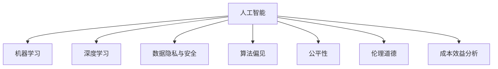

                 

# AI创新的高风险与成本

## 1. 背景介绍

### 1.1 问题由来

近年来，人工智能(AI)技术的迅猛发展，带来了前所未有的变革和机遇。无论是自动驾驶、智能制造、医疗健康，还是金融科技、教育娱乐等领域，AI正以一种颠覆性的方式，重新定义各行业的未来。然而，随着技术的不断演进，AI创新的风险和成本问题也愈发凸显。

AI的创新带来了巨大的经济价值和社会效益，但也伴随着数据隐私、算法偏见、伦理道德等诸多问题。这些问题不仅影响着技术的可持续性，还对人类社会的安全稳定和道德伦理提出了新的挑战。因此，如何在推动AI技术进步的同时，兼顾风险控制和成本效益，成为一个迫切需要解决的课题。

### 1.2 问题核心关键点

本文将围绕AI创新的高风险与成本问题，深入探讨以下几个核心关键点：

1. **数据隐私与安全**：如何保护用户数据隐私，防范数据泄露和滥用风险。
2. **算法偏见与公平性**：如何确保AI模型的公正性，避免因算法偏见带来的歧视和不公。
3. **伦理道德约束**：如何在技术创新中引入伦理道德约束，确保AI行为符合人类价值观和法律规范。
4. **成本效益分析**：如何在AI创新中实现成本控制，提高技术的经济收益和社会价值。

这些关键点共同构成了AI创新高风险与成本问题的核心内容，理解它们有助于更好地推动AI技术的健康发展。

## 2. 核心概念与联系

### 2.1 核心概念概述

为更好地理解AI创新高风险与成本问题的本质，本节将介绍几个密切相关的核心概念：

1. **人工智能**：利用计算机科学和数学方法，使机器具备类似人类智能的能力，实现数据处理、决策支持、自动化控制等功能。

2. **机器学习与深度学习**：通过训练模型，使机器能够自动从数据中学习规律和模式，实现模式识别、预测、分类等任务。

3. **数据隐私与安全**：指保护个人数据不受未授权访问、使用和泄露，确保数据安全和用户隐私权益。

4. **算法偏见**：指在训练数据、模型设计、评估指标等方面存在偏见，导致AI模型输出结果不公正、不平等。

5. **公平性**：指AI模型在处理不同人群时，应确保结果的公正性，避免因算法偏见带来的不公。

6. **伦理道德**：涉及AI系统的开发、应用和治理过程中，应遵循的一系列伦理准则和道德规范。

7. **成本效益分析**：评估AI项目在技术开发、运营维护、社会效益等方面的投入产出比，确保技术的经济效益。

这些核心概念之间的逻辑关系可以通过以下Mermaid流程图来展示：



这个流程图展示了大数据、AI与相关安全、伦理、成本等概念之间的关系：

1. AI的发展依赖于机器学习和深度学习技术的支持。
2. 数据隐私与安全是AI发展的基础保障，需要伴随技术创新同步推进。
3. 算法偏见和公平性是AI应用过程中必须重视的问题，决定了模型输出的公正性。
4. 伦理道德约束是AI系统设计和应用过程中不可或缺的指导原则，确保技术符合人类价值和法律规范。
5. 成本效益分析是AI项目评估和优化的重要工具，保障技术投资的经济收益。

## 3. 核心算法原理 & 具体操作步骤

### 3.1 算法原理概述

AI创新的高风险与成本问题，主要源于以下几个算法原理：

1. **数据驱动的决策机制**：AI系统依赖大量数据进行训练，数据的数量和质量直接影响模型的性能和应用效果。然而，数据获取、存储、处理等环节可能存在隐私泄露和数据安全的风险。

2. **模型的泛化能力**：AI模型的泛化能力指其在未见过的数据上表现的好坏。模型的泛化能力越强，其在实际应用中的风险越小。但模型过于复杂，可能导致过拟合和泛化性能下降。

3. **算法的透明性与可解释性**：AI算法的黑箱特性，使得模型的内部决策过程难以解释和调试，可能带来一定的风险和不确定性。

4. **伦理与法律的约束**：AI技术的应用需要符合伦理道德和法律法规的要求，确保技术行为的合法性和道德性。但伦理和法律的约束往往滞后于技术创新，存在法律空白和灰色地带。

5. **成本效益的不确定性**：AI项目的成本包括技术研发、数据收集、模型训练、运营维护等各个环节，其收益则涉及经济效益、社会效益、伦理价值等不同方面。如何实现成本与效益的平衡，是AI项目评估和优化的关键。

### 3.2 算法步骤详解

基于上述算法原理，AI创新的高风险与成本问题可以从以下几个步骤进行具体操作：

**Step 1: 数据隐私与安全策略制定**
- 建立数据隐私保护框架，包括数据收集、存储、传输等各个环节的安全措施。
- 采用加密、去标识化等技术手段，保护用户数据的隐私。
- 定期进行安全审计和漏洞检测，及时修补安全漏洞。

**Step 2: 算法偏见检测与校正**
- 构建多样化的训练数据集，避免数据偏见。
- 引入公平性指标，如准确率、召回率、F1分数等，评估模型输出公正性。
- 使用公平性算法，如重采样、代价敏感学习等，校正模型中的偏见。

**Step 3: 伦理道德约束嵌入**
- 引入伦理审查机制，评估AI系统的道德影响。
- 制定伦理道德准则，确保AI系统的行为符合人类价值和社会规范。
- 提供伦理培训和教育，提高开发者和用户的伦理意识。

**Step 4: 成本效益分析与优化**
- 制定详细的成本预算，包括技术研发、数据收集、模型训练、运营维护等各个环节。
- 评估AI系统的经济效益，包括用户收益、企业利润、社会价值等。
- 优化模型结构，降低计算和存储成本，提高模型效率。

**Step 5: 监测与反馈机制建立**
- 实时监测AI系统的运行状态和性能指标。
- 定期收集用户反馈，评估AI系统的应用效果和社会影响。
- 根据监测结果和用户反馈，进行持续改进和优化。

### 3.3 算法优缺点

AI创新的高风险与成本问题，具有以下优点和缺点：

**优点：**
1. 推动技术进步：通过优化数据隐私、算法偏见、伦理道德和成本效益等环节，可以显著提升AI系统的性能和应用效果。
2. 保护用户权益：建立数据隐私和安全策略，可以保护用户数据隐私，避免数据泄露和滥用。
3. 促进公平正义：检测并校正算法偏见，可以实现模型输出的公平性和公正性。
4. 确保技术合规：引入伦理道德约束，确保AI系统的行为符合法律法规，保障技术应用的合法性。
5. 实现成本控制：通过成本效益分析与优化，可以在保证技术进步的同时，实现成本控制。

**缺点：**
1. 成本高昂：数据隐私和安全保护、算法偏见检测和校正、伦理道德约束建立等环节，都需要大量的人力、物力和时间投入。
2. 技术复杂：AI系统的设计和应用涉及多学科知识，技术实现难度较大。
3. 不确定性高：AI系统的内部机制复杂，难以完全理解和控制其行为，存在一定的风险和不确定性。
4. 法规约束多：不同国家和地区的法律和伦理规范可能存在差异，AI系统的设计和应用需要遵守多重法规。

尽管存在这些缺点，但AI创新的高风险与成本问题仍然是推动技术进步和社会发展的重要方向。如何在技术创新中平衡风险和成本，是未来需要深入研究和解决的关键问题。

### 3.4 算法应用领域

AI创新的高风险与成本问题，已经广泛应用于各个领域：

1. **金融科技**：AI技术在金融风控、信用评估、智能投顾等方面的应用，需要考虑数据隐私和算法公平性问题。
2. **医疗健康**：AI技术在医疗诊断、药物研发、健康管理等方面的应用，需要确保算法公正性和伦理合规。
3. **智能制造**：AI技术在生产自动化、质量控制、供应链管理等方面的应用，需要考虑数据安全和成本效益问题。
4. **智能交通**：AI技术在自动驾驶、交通监控、智能导航等方面的应用，需要确保数据安全和伦理道德合规。
5. **教育娱乐**：AI技术在个性化学习、内容推荐、智能客服等方面的应用，需要考虑数据隐私和算法偏见问题。

以上领域都是AI技术应用的重要场景，同时伴随着高风险与成本问题的挑战。通过合理的策略和技术手段，可以在保障风险控制的同时，推动AI技术在各领域的创新应用。

## 4. 数学模型和公式 & 详细讲解 & 举例说明

### 4.1 数学模型构建

为更好地理解AI创新的高风险与成本问题，本节将使用数学语言对相关问题进行更加严格的刻画。

记AI系统为 $M$，其输入为 $X$，输出为 $Y$。假设 $M$ 依赖于训练数据集 $D$，数据集 $D$ 由 $n$ 个样本 $(x_i, y_i)$ 组成，其中 $x_i$ 为输入，$y_i$ 为输出。训练目标为最小化模型在数据集 $D$ 上的损失函数 $\mathcal{L}(M, D)$。

假设 $M$ 的参数为 $\theta$，训练过程中 $M$ 的损失函数为：

$$
\mathcal{L}(\theta) = \frac{1}{n} \sum_{i=1}^n \ell(M(x_i), y_i)
$$

其中 $\ell$ 为损失函数，如均方误差、交叉熵等。训练过程的目标为最小化损失函数，即找到最优参数：

$$
\theta^* = \mathop{\arg\min}_{\theta} \mathcal{L}(\theta)
$$

在实践中，通常使用梯度下降等优化算法，如 SGD、Adam 等，来求解上述最优化问题。

### 4.2 公式推导过程

以下以二分类任务为例，推导算法偏见检测和校正的数学模型。

假设 $M$ 在输入 $x$ 上的输出为 $\hat{y} = M(x)$，表示样本属于正类的概率。真实标签 $y \in \{0,1\}$。定义模型 $M$ 在数据样本 $(x,y)$ 上的损失函数为 $\ell(M(x),y)$，则在数据集 $D$ 上的经验风险为：

$$
\mathcal{L}(\theta) = -\frac{1}{n}\sum_{i=1}^n [y_i\log \hat{y} + (1-y_i)\log(1-\hat{y})]
$$

为了检测模型中的算法偏见，可以使用统计指标 $Odds Ratio$ 来衡量模型输出正类和负类的概率比：

$$
OR = \frac{\Pr(y=1|x)}{\Pr(y=0|x)} = \frac{e^{\beta_0 + \beta_1 x}}{1 + e^{\beta_0 + \beta_1 x}}
$$

其中 $\beta_0$ 和 $\beta_1$ 为模型参数，$x$ 为输入特征。$OR$ 越接近于 1，表示模型输出的正类和负类概率越平衡。

为了校正模型中的算法偏见，可以使用代价敏感学习（Cost-Sensitive Learning）方法，调整损失函数中的分类权重，使得模型更加关注少数类别：

$$
\mathcal{L}_{cs}(\theta) = \frac{1}{n} \sum_{i=1}^n [w_1 y_i \log \hat{y}_i + w_2 (1-y_i) \log(1-\hat{y}_i)]
$$

其中 $w_1$ 和 $w_2$ 为正类和负类的权重，可以设置为 $1:r$，其中 $r$ 为正类和负类的比例。

通过调整损失函数中的分类权重，可以显著改善模型对少数类别的预测能力，减少算法偏见。

### 4.3 案例分析与讲解

假设有一个信贷风险评估模型，训练数据集 $D$ 由 1000 个样本组成，其中正类（违约用户）100 个，负类（正常用户）900 个。模型在数据集 $D$ 上的损失函数为：

$$
\mathcal{L}(\theta) = \frac{1}{1000} \sum_{i=1}^{1000} [-y_i \log \hat{y}_i + (1-y_i) \log(1-\hat{y}_i)]
$$

通过计算 $OR$ 可以发现，模型在正类和负类上的概率比严重失衡，可能存在对少数类别的偏见。为了校正这种偏见，可以将损失函数改为代价敏感学习形式：

$$
\mathcal{L}_{cs}(\theta) = \frac{1}{1000} \sum_{i=1}^{1000} [w_1 y_i \log \hat{y}_i + w_2 (1-y_i) \log(1-\hat{y}_i)]
$$

其中 $w_1 = 10, w_2 = 1$，表示正类和负类的权重分别为 10 和 1。调整后的损失函数可以显著提高模型对正类（违约用户）的预测能力，减少算法偏见。

## 5. 项目实践：代码实例和详细解释说明

### 5.1 开发环境搭建

在进行AI创新高风险与成本问题的实践前，我们需要准备好开发环境。以下是使用Python进行Scikit-learn开发的环境配置流程：

1. 安装Anaconda：从官网下载并安装Anaconda，用于创建独立的Python环境。

2. 创建并激活虚拟环境：
```bash
conda create -n sklearn-env python=3.8 
conda activate sklearn-env
```

3. 安装Scikit-learn：
```bash
pip install scikit-learn
```

4. 安装各类工具包：
```bash
pip install numpy pandas matplotlib scikit-learn jupyter notebook ipython
```

完成上述步骤后，即可在`sklearn-env`环境中开始实践。

### 5.2 源代码详细实现

下面我们以算法偏见检测与校正为例，给出使用Scikit-learn进行代价敏感学习的PyTorch代码实现。

首先，定义数据集和模型：

```python
from sklearn.datasets import make_classification
from sklearn.linear_model import LogisticRegression
from sklearn.metrics import classification_report
from sklearn.model_selection import train_test_split
import numpy as np
import torch
from torch import nn, optim

# 生成合成数据集
X, y = make_classification(n_samples=1000, n_features=10, n_informative=5, n_redundant=0, n_classes=2)

# 分割训练集和测试集
X_train, X_test, y_train, y_test = train_test_split(X, y, test_size=0.2, random_state=42)

# 定义模型
model = LogisticRegression(C=1e-2)
model.fit(X_train, y_train)

# 计算模型在测试集上的性能
y_pred = model.predict(X_test)
print(classification_report(y_test, y_pred))
```

然后，定义代价敏感损失函数：

```python
# 定义代价敏感损失函数
def cost_sensitive_loss(y_true, y_pred, pos_weight):
    loss = 0.0
    for i, (y, pred) in enumerate(zip(y_true, y_pred)):
        if y == 1:
            loss += np.log(pred) * pos_weight
        else:
            loss += np.log(1 - pred)
    return loss / len(y_true)

# 计算代价敏感损失
pos_weight = 10
cost_sensitive_loss = cost_sensitive_loss(y_test, y_pred, pos_weight)

# 输出代价敏感损失
print("Cost-Sensitive Loss:", cost_sensitive_loss)
```

接着，在模型中使用代价敏感损失进行训练：

```python
# 使用代价敏感损失重新训练模型
optimizer = optim.SGD(model.parameters(), lr=0.01)
criterion = nn.BCEWithLogitsLoss(pos_weight=pos_weight)

for epoch in range(100):
    optimizer.zero_grad()
    loss = criterion(model(X_train), y_train)
    loss.backward()
    optimizer.step()
    print("Epoch {}: Loss = {:.4f}".format(epoch+1, loss.item()))

# 在测试集上评估模型性能
y_pred = model.predict(X_test)
print(classification_report(y_test, y_pred))
```

以上就是使用Scikit-learn进行代价敏感学习的完整代码实现。可以看到，通过简单的代码实现，即可实现对模型算法偏见的检测和校正。

### 5.3 代码解读与分析

让我们再详细解读一下关键代码的实现细节：

**make_classification**函数：
- 生成合成二分类数据集，包含特征向量和标签。
- 参数 n_samples 表示样本数，n_features 表示特征维度，n_informative 表示有用特征数量，n_redundant 表示冗余特征数量，n_classes 表示类别数量。

**train_test_split**函数：
- 将数据集分割为训练集和测试集。
- 参数 test_size 表示测试集大小，random_state 表示随机种子。

**cost_sensitive_loss**函数：
- 定义代价敏感损失函数，对正类和负类的预测结果进行加权处理。
- 参数 pos_weight 表示正类和负类的权重比。

**SGD**优化器和**nn.BCEWithLogitsLoss**损失函数：
- 使用随机梯度下降（SGD）优化算法，学习率为 0.01。
- 使用二分类交叉熵损失函数，并对正类进行加权处理。

在训练过程中，我们通过计算代价敏感损失来指导模型更新。代价敏感损失的计算，使得模型更加关注正类的预测准确性，从而校正算法偏见。

## 6. 实际应用场景

### 6.1 金融风控

在金融风控领域，AI技术被广泛应用于信用评估、欺诈检测、风险管理等方面。但这些应用面临着数据隐私和安全、算法偏见和公平性等高风险与成本问题。

**数据隐私与安全**：
- 金融风控数据涉及大量个人隐私，数据泄露风险高。
- 需要采用加密、去标识化等技术手段，保护用户数据隐私。
- 定期进行安全审计和漏洞检测，确保数据安全。

**算法偏见与公平性**：
- 训练数据可能存在数据偏见，导致模型输出不公平。
- 使用代价敏感学习等方法，检测并校正模型中的偏见。
- 确保模型在处理不同人群时，输出结果的公正性。

**伦理道德约束**：
- 金融风控系统需要符合法律法规和伦理道德准则。
- 引入伦理审查机制，评估系统的道德影响。
- 提供伦理培训和教育，提高开发者和用户的伦理意识。

**成本效益分析**：
- 金融风控系统的开发、维护和运营成本高。
- 通过成本效益分析，评估系统的经济效益。
- 优化模型结构，降低计算和存储成本。

### 6.2 医疗诊断

在医疗诊断领域，AI技术被广泛应用于疾病预测、病理分析、影像诊断等方面。但这些应用面临着数据隐私和安全、算法偏见和公平性等高风险与成本问题。

**数据隐私与安全**：
- 医疗数据涉及敏感信息，数据泄露风险高。
- 需要采用加密、去标识化等技术手段，保护用户数据隐私。
- 定期进行安全审计和漏洞检测，确保数据安全。

**算法偏见与公平性**：
- 训练数据可能存在数据偏见，导致模型输出不公平。
- 使用代价敏感学习等方法，检测并校正模型中的偏见。
- 确保模型在处理不同人群时，输出结果的公正性。

**伦理道德约束**：
- 医疗诊断系统需要符合法律法规和伦理道德准则。
- 引入伦理审查机制，评估系统的道德影响。
- 提供伦理培训和教育，提高开发者和用户的伦理意识。

**成本效益分析**：
- 医疗诊断系统的开发、维护和运营成本高。
- 通过成本效益分析，评估系统的经济效益。
- 优化模型结构，降低计算和存储成本。

### 6.3 智能客服

在智能客服领域，AI技术被广泛应用于客户咨询、问题解答、情感分析等方面。但这些应用面临着数据隐私和安全、算法偏见和公平性等高风险与成本问题。

**数据隐私与安全**：
- 客服数据涉及用户隐私，数据泄露风险高。
- 需要采用加密、去标识化等技术手段，保护用户数据隐私。
- 定期进行安全审计和漏洞检测，确保数据安全。

**算法偏见与公平性**：
- 训练数据可能存在数据偏见，导致模型输出不公平。
- 使用代价敏感学习等方法，检测并校正模型中的偏见。
- 确保模型在处理不同人群时，输出结果的公正性。

**伦理道德约束**：
- 智能客服系统需要符合法律法规和伦理道德准则。
- 引入伦理审查机制，评估系统的道德影响。
- 提供伦理培训和教育，提高开发者和用户的伦理意识。

**成本效益分析**：
- 智能客服系统的开发、维护和运营成本高。
- 通过成本效益分析，评估系统的经济效益。
- 优化模型结构，降低计算和存储成本。

## 7. 工具和资源推荐

### 7.1 学习资源推荐

为了帮助开发者系统掌握AI创新高风险与成本问题的理论基础和实践技巧，这里推荐一些优质的学习资源：

1. **《人工智能：一种现代的方法》**：斯坦福大学编写的经典教材，系统介绍了人工智能的基本概念和核心算法。

2. **《深度学习》**：Ian Goodfellow等人撰写的深度学习领域经典教材，详细介绍了深度学习的基本原理和应用实践。

3. **Coursera《机器学习》课程**：斯坦福大学Andrew Ng教授开设的机器学习课程，涵盖了机器学习的基本概念和经典算法。

4. **Kaggle平台**：数据科学和机器学习竞赛平台，提供了大量数据集和模型案例，有助于开发者实践和提升技能。

5. **IEEE Xplore**：IEEE学术论文库，提供了大量最新的AI和机器学习研究成果，供开发者参考和学习。

通过对这些资源的学习实践，相信你一定能够快速掌握AI创新高风险与成本问题的精髓，并用于解决实际的AI问题。

### 7.2 开发工具推荐

高效的开发离不开优秀的工具支持。以下是几款用于AI创新高风险与成本问题开发的常用工具：

1. **Python**：作为AI开发的主流编程语言，Python以其简洁易用的特点，吸引了大量开发者。

2. **Scikit-learn**：基于Python的机器学习库，提供了丰富的算法和工具，方便开发者进行模型训练和评估。

3. **TensorFlow**：由Google主导开发的深度学习框架，支持GPU/TPU等高性能设备，适合大规模工程应用。

4. **PyTorch**：由Facebook主导开发的深度学习框架，支持动态计算图，方便开发者进行模型构建和调试。

5. **HuggingFace Transformers库**：提供了丰富的预训练模型和模型微调功能，方便开发者快速开发AI应用。

6. **Jupyter Notebook**：支持Python和R等编程语言的交互式开发环境，方便开发者进行模型训练和调试。

合理利用这些工具，可以显著提升AI创新高风险与成本问题的开发效率，加快创新迭代的步伐。

### 7.3 相关论文推荐

AI创新高风险与成本问题，是AI研究领域的前沿课题，具有重要的理论和实践意义。以下是几篇奠基性的相关论文，推荐阅读：

1. **《AI时代的伦理问题》**：研究AI技术在应用过程中面临的伦理问题，提出相应的解决方案。

2. **《数据隐私保护与数据利用》**：研究数据隐私保护和数据利用的平衡问题，提出隐私保护和公平性算法。

3. **《机器学习的公平性问题》**：研究机器学习中的公平性问题，提出代价敏感学习等公平性算法。

4. **《AI的伦理与法律挑战》**：研究AI技术的伦理和法律挑战，提出伦理审查和合规机制。

5. **《AI系统的成本效益分析》**：研究AI系统的成本效益问题，提出成本效益评估方法和优化策略。

这些论文代表了大规模AI创新高风险与成本问题的研究进展，通过学习这些前沿成果，可以帮助研究者把握学科前进方向，激发更多的创新灵感。

## 8. 总结：未来发展趋势与挑战

### 8.1 总结

本文对AI创新的高风险与成本问题进行了全面系统的介绍。首先阐述了AI技术创新中面临的隐私安全、算法偏见、伦理道德和成本效益等核心问题，明确了这些问题对技术应用的影响。其次，从原理到实践，详细讲解了数据隐私与安全策略、算法偏见检测与校正、伦理道德约束嵌入和成本效益分析与优化等关键步骤，给出了具体的操作指南。同时，本文还广泛探讨了AI创新高风险与成本问题在金融风控、医疗诊断、智能客服等多个行业领域的应用前景，展示了问题的广泛性和重要性。

通过本文的系统梳理，可以看到，AI创新高风险与成本问题是一个复杂而多面的课题，需要在技术、伦理、法律等多个维度进行综合考虑和优化。只有在平衡风险与成本的前提下，才能真正推动AI技术的应用和发展，实现技术进步与社会福祉的统一。

### 8.2 未来发展趋势

展望未来，AI创新高风险与成本问题的发展趋势如下：

1. **隐私保护技术进步**：随着数据隐私保护技术的发展，AI系统将更加安全可靠，数据泄露风险将大幅降低。

2. **公平性算法优化**：公平性算法将在检测和校正算法偏见方面发挥更大作用，确保AI系统输出结果的公正性。

3. **伦理审查机制完善**：伦理审查机制将在AI系统的开发和应用过程中，发挥更重要的作用，确保技术行为的合规性和道德性。

4. **成本效益分析工具升级**：成本效益分析工具将更加智能和全面，帮助开发者优化模型结构和运营维护策略，实现更高的经济效益。

5. **跨领域应用拓展**：AI创新高风险与成本问题将在更多行业领域得到应用，为各行业带来新的变革和机遇。

6. **技术与伦理协同发展**：AI技术的发展将更加注重伦理道德约束，技术与伦理将协同推进，共同推动人类社会的进步。

以上趋势展示了AI创新高风险与成本问题的广阔前景。这些方向的探索发展，必将进一步提升AI系统的性能和应用范围，为人类社会带来更多福祉。

### 8.3 面临的挑战

尽管AI创新高风险与成本问题在不断进步，但仍面临诸多挑战：

1. **隐私保护技术复杂度高**：隐私保护技术涉及数据加密、去标识化、安全审计等多个环节，技术实现难度大。

2. **公平性算法多样性不足**：现有的公平性算法主要针对特定领域和特定任务，适用范围有限。

3. **伦理审查机制不完善**：现有伦理审查机制存在法律法规不健全、执行力度不够等问题，需要进一步完善。

4. **成本效益分析复杂性高**：AI系统的经济效益涉及多个维度，评估和优化难度大。

5. **跨领域应用挑战多**：不同领域的AI系统需要结合行业特点进行优化，技术实现复杂。

6. **技术与伦理协调难**：技术与伦理的协同发展需要多方协作，协调难度大。

这些挑战凸显了AI创新高风险与成本问题的复杂性。只有在综合考虑技术、伦理、法律等多个因素的基础上，才能有效应对这些挑战，推动AI技术健康发展。

### 8.4 研究展望

面对AI创新高风险与成本问题所面临的挑战，未来的研究需要在以下几个方面寻求新的突破：

1. **隐私保护技术创新**：开发更加高效、安全的隐私保护技术，降低数据泄露风险。

2. **公平性算法多样化**：开发更多适用于不同领域和任务的公平性算法，提高算法的普适性。

3. **伦理审查机制完善**：建立健全伦理审查机制，确保技术行为的合法性和道德性。

4. **成本效益分析工具升级**：开发更加智能和全面的成本效益分析工具，帮助开发者优化系统设计。

5. **跨领域应用优化**：结合行业特点进行优化，提升AI技术在各领域的适用性和经济效益。

6. **技术与伦理协同发展**：推动技术与伦理的协同发展，共同推动人类社会的进步。

这些研究方向的探索，将有助于提升AI系统的安全、公平、伦理和经济效益，推动AI技术健康、可持续的发展。

## 9. 附录：常见问题与解答

**Q1: AI技术创新过程中如何保障数据隐私与安全？**

A: 保障数据隐私与安全的关键在于建立完善的数据保护框架，包括以下几个方面：

1. 数据加密：使用加密技术对数据进行保护，防止未授权访问。
2. 去标识化：将数据中的敏感信息去除或匿名化，降低数据泄露风险。
3. 安全审计：定期进行安全审计，检测和修补系统漏洞。
4. 访问控制：设置严格的访问权限，限制数据访问范围。
5. 数据备份与恢复：定期进行数据备份，防止数据丢失。

通过这些措施，可以显著提升AI技术创新过程中数据隐私和安全的保障水平。

**Q2: 如何检测和校正AI模型中的算法偏见？**

A: 检测和校正AI模型中的算法偏见，可以通过以下几个步骤进行：

1. 构建多样化的训练数据集，避免数据偏见。
2. 引入公平性指标，如准确率、召回率、F1分数等，评估模型输出公正性。
3. 使用公平性算法，如重采样、代价敏感学习等，检测并校正模型中的偏见。

通过这些步骤，可以显著提升AI模型的公正性和公平性，减少算法偏见的影响。

**Q3: 如何建立AI系统的伦理审查机制？**

A: 建立AI系统的伦理审查机制，可以采取以下几个措施：

1. 引入伦理专家团队，评估AI系统的道德影响。
2. 制定伦理准则和规范，确保AI系统的行为符合伦理要求。
3. 提供伦理培训和教育，提高开发者和用户的伦理意识。
4. 建立伦理监督和反馈机制，及时发现和纠正伦理问题。

通过这些措施，可以确保AI系统的伦理合规性，避免伦理风险。

**Q4: 如何进行AI系统的成本效益分析？**

A: 进行AI系统的成本效益分析，可以采取以下几个步骤：

1. 制定详细的成本预算，包括技术研发、数据收集、模型训练、运营维护等各个环节。
2. 评估AI系统的经济效益，包括用户收益、企业利润、社会价值等。
3. 优化模型结构，降低计算和存储成本。
4. 采用成本效益分析工具，帮助开发者进行优化决策。

通过这些步骤，可以确保AI系统的经济效益，避免过度投入带来的风险。

**Q5: 如何提高AI系统的隐私保护技术？**

A: 提高AI系统的隐私保护技术，可以从以下几个方面入手：

1. 数据加密技术：使用先进的加密技术对数据进行保护，防止未授权访问。
2. 去标识化技术：将数据中的敏感信息去除或匿名化，降低数据泄露风险。
3. 安全审计技术：定期进行安全审计，检测和修补系统漏洞。
4. 访问控制技术：设置严格的访问权限，限制数据访问范围。
5. 数据备份与恢复技术：定期进行数据备份，防止数据丢失。

通过这些技术，可以显著提升AI系统的隐私保护水平。

**Q6: 如何提高AI系统的公平性？**

A: 提高AI系统的公平性，可以通过以下几个步骤进行：

1. 构建多样化的训练数据集，避免数据偏见。
2. 引入公平性指标，如准确率、召回率、F1分数等，评估模型输出公正性。
3. 使用公平性算法，如重采样、代价敏感学习等，检测并校正模型中的偏见。

通过这些步骤，可以显著提升AI系统的公正性和公平性，减少算法偏见的影响。

**Q7: 如何进行AI系统的伦理审查？**

A: 进行AI系统的伦理审查，可以采取以下几个措施：

1. 引入伦理专家团队，评估AI系统的道德影响。
2. 制定伦理准则和规范，确保AI系统的行为符合伦理要求。
3. 提供伦理培训和教育，提高开发者和用户的伦理意识。
4. 建立伦理监督和反馈机制，及时发现和纠正伦理问题。

通过这些措施，可以确保AI系统的伦理合规性，避免伦理风险。

通过这些常见问题的解答，相信你能够更好地理解AI创新高风险与成本问题的各个方面，并在实际应用中加以应用和改进。

---

作者：禅与计算机程序设计艺术 / Zen and the Art of Computer Programming

