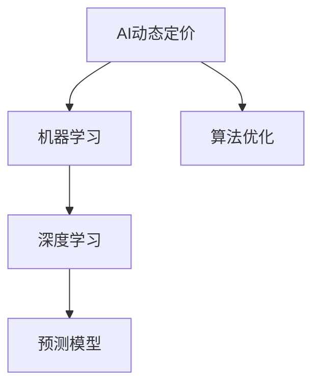

                 

# AI动态定价策略优化收益

> 关键词：AI, 动态定价, 策略优化, 收益提升, 机器学习, 深度学习, 预测模型, 算法优化

## 1. 背景介绍

### 1.1 问题由来
随着互联网和电子商务的兴起，企业之间的竞争愈发激烈。在复杂多变的市场环境中，动态定价策略成为企业提升竞争力和利润的重要手段。动态定价，即根据市场需求、供应、季节性变化等因素实时调整商品价格，以实现最佳销售量和利润。然而，这种定价策略的制定和调整需要依赖大量历史数据、市场预测和业务规则，传统方法难以应对。

人工智能（AI）的崛起，特别是深度学习算法的突破，为动态定价策略的优化提供了新的可能性。通过AI技术，企业可以更好地理解和预测市场趋势，实时调整定价策略，提升收益。本文将详细探讨基于AI的动态定价策略优化方法，并给出实际应用中的案例分析。

### 1.2 问题核心关键点
动态定价策略的核心在于实时、准确地预测市场需求和供应，并据此调整商品价格，以实现利润最大化。常见的动态定价策略包括基于规则、基于收益管理和基于预测的定价等方法。其中，基于预测的动态定价策略利用AI技术，对历史数据和实时数据进行建模，实时预测市场需求，从而制定最优价格。

基于AI的动态定价策略的主要难点在于：
1. **数据获取和处理**：需要收集和清洗大量的历史销售数据、市场数据、气象数据等，以保证预测模型的准确性。
2. **模型选择和训练**：选择适当的机器学习模型，并在大量数据上进行训练，以获得良好的预测能力。
3. **实时更新和优化**：随着市场环境的不断变化，预测模型需要持续更新和优化，以保持预测的准确性。
4. **算法评估和优化**：需要通过实验和对比，评估模型的效果，并根据反馈不断优化算法和模型参数。

本文将围绕这些关键点，详细探讨AI动态定价策略的原理和实现方法，并给出具体的案例分析。

## 2. 核心概念与联系

### 2.1 核心概念概述

为更好地理解AI动态定价策略，本节将介绍几个关键概念：

- **AI动态定价（AI Dynamic Pricing）**：利用人工智能技术，实时调整商品价格，以优化销售量和利润。常用于电商平台、旅游业、交通等领域。
- **机器学习（Machine Learning, ML）**：通过算法自动学习和分析数据，以提高决策的效率和准确性。包括监督学习、非监督学习和强化学习等。
- **深度学习（Deep Learning, DL）**：一种特殊的机器学习技术，通过多层神经网络对复杂数据进行处理和建模。广泛应用于图像识别、自然语言处理等领域。
- **预测模型（Predictive Model）**：通过历史数据训练得到的模型，用于预测未来市场趋势和用户行为。常见预测模型包括线性回归、随机森林、神经网络等。
- **算法优化（Algorithm Optimization）**：通过改进算法设计或参数设置，提升预测模型和动态定价策略的准确性和效率。

这些概念之间的逻辑关系可以通过以下Mermaid流程图来展示：



这个流程图展示了大语言模型的核心概念及其之间的关系：

1. AI动态定价策略利用机器学习技术进行预测建模。
2. 机器学习中常用的深度学习算法可以构建高精度的预测模型。
3. 预测模型可用于实时预测市场需求，指导动态定价策略。
4. 算法优化可以进一步提升预测模型的准确性和效率。

这些概念共同构成了AI动态定价策略的完整框架，使得企业能够更好地应对市场变化，提升盈利能力。

## 3. 核心算法原理 & 具体操作步骤
### 3.1 算法原理概述

基于AI的动态定价策略，本质上是一个基于历史数据和实时数据的多变量预测问题。其核心思想是：利用机器学习算法，构建预测模型，实时预测市场需求，并根据预测结果调整商品价格，以实现利润最大化。

形式化地，假设市场需求量为 $Y$，价格为 $X$，其他影响因素为 $\mathbf{Z}$，则动态定价的目标为：

$$
\min_{X} \mathbb{E}[Y] \text{ subject to } Y = f(X, \mathbf{Z})
$$

其中 $f(X, \mathbf{Z})$ 表示市场需求量与价格和其他因素的函数关系，$\mathbb{E}[Y]$ 表示预测市场需求量的期望值。

具体来说，可以通过以下步骤来实现：
1. **数据收集和处理**：收集历史销售数据、市场数据、气象数据等，并进行清洗和特征工程，提取有用的特征。
2. **模型训练**：选择适当的机器学习模型，如线性回归、随机森林、神经网络等，使用历史数据进行训练。
3. **实时预测**：利用训练好的模型，对实时市场数据进行预测，得出市场需求量的估计。
4. **定价策略调整**：根据市场需求量的估计，实时调整商品价格，以优化销售量和利润。
5. **模型更新和优化**：定期收集新数据，更新预测模型，并根据反馈优化算法和模型参数。

### 3.2 算法步骤详解

基于AI的动态定价策略主要包括以下几个关键步骤：

**Step 1: 数据收集与预处理**
- 收集历史销售数据、市场数据、气象数据等，进行清洗和特征工程，提取有用的特征。
- 对数据进行标准化和归一化处理，以保证不同特征之间的可比性。

**Step 2: 模型选择与训练**
- 选择适当的机器学习模型，如线性回归、随机森林、神经网络等，使用历史数据进行训练。
- 进行交叉验证，选择最佳的模型和参数组合。
- 对模型进行评估和调优，以提高预测准确性。

**Step 3: 实时预测与定价调整**
- 对实时市场数据进行输入，使用训练好的模型进行预测，得出市场需求量的估计。
- 根据市场需求量的估计，实时调整商品价格，以优化销售量和利润。
- 监测定价策略的效果，进行必要的调整。

**Step 4: 模型更新与优化**
- 定期收集新数据，更新预测模型。
- 根据实际效果，调整算法和模型参数，以进一步提高预测准确性。
- 引入正则化和稀疏化等技术，避免过拟合和数据稀疏问题。

### 3.3 算法优缺点

基于AI的动态定价策略具有以下优点：
1. **实时性**：利用实时数据进行预测，能够及时调整定价策略，适应市场变化。
2. **高精度**：通过机器学习模型进行预测，可以提高预测的准确性和可靠性。
3. **自动化**：自动进行预测和定价调整，减少人工干预，提高效率。
4. **灵活性**：可以灵活调整预测模型和定价策略，适应不同市场环境和产品特性。

同时，该方法也存在一定的局限性：
1. **数据依赖**：预测模型的准确性依赖于数据的质量和数量，获取和处理大量数据需要投入大量资源。
2. **模型复杂**：复杂的预测模型可能导致计算复杂度高，实时预测和定价调整需要高效的计算能力。
3. **市场风险**：市场环境复杂多变，预测模型可能无法完全适应，存在一定的风险。
4. **调整滞后**：预测模型需要定期更新，可能存在模型调整滞后的问题。

尽管存在这些局限性，但基于AI的动态定价策略仍是一种高效、准确的定价优化方法，被广泛应用于电商、旅游、交通等领域。

### 3.4 算法应用领域

基于AI的动态定价策略广泛应用于多个领域，包括：

- **电商平台**：利用实时数据和历史数据，对商品价格进行实时调整，以提升销售量和利润。
- **旅游业**：根据季节性、天气等因素，实时调整酒店、机票等价格，以优化收益。
- **交通行业**：根据实时交通流量和需求，调整公共交通票价，以提升运营效率和收益。
- **医疗领域**：根据实时需求和资源情况，调整药品和医疗服务的定价，以优化资源配置。
- **制造业**：根据市场需求和生产能力，调整产品价格，以优化生产计划和利润。

除了以上领域，AI动态定价策略还可应用于供应链管理、人力资源优化等场景，为各行各业提供强大的决策支持。

## 4. 数学模型和公式 & 详细讲解 & 举例说明
### 4.1 数学模型构建

基于AI的动态定价策略，可以通过以下数学模型进行建模：

设市场需求量为 $Y$，价格为 $X$，其他影响因素为 $\mathbf{Z}$，则动态定价的目标为：

$$
\min_{X} \mathbb{E}[Y] \text{ subject to } Y = f(X, \mathbf{Z})
$$

其中 $f(X, \mathbf{Z})$ 表示市场需求量与价格和其他因素的函数关系，$\mathbb{E}[Y]$ 表示预测市场需求量的期望值。

常见的预测模型包括线性回归、随机森林、神经网络等。以线性回归模型为例，其目标为最小化预测误差：

$$
\min_{\theta} \sum_{i=1}^N (y_i - \theta_0 - \theta_1 x_i)^2
$$

其中 $y_i$ 为实际市场需求量，$x_i$ 为价格和其他因素，$\theta_0$ 和 $\theta_1$ 为模型参数。

### 4.2 公式推导过程

以线性回归模型为例，其推导过程如下：

设 $y_i = \theta_0 + \theta_1 x_i + \epsilon_i$，其中 $\epsilon_i$ 为随机误差项。则预测误差的平方和为：

$$
\sum_{i=1}^N (y_i - \theta_0 - \theta_1 x_i)^2
$$

对 $\theta_0$ 和 $\theta_1$ 求偏导，并令导数为0，解得：

$$
\begin{aligned}
\frac{\partial}{\partial \theta_0} &= -2 \sum_{i=1}^N (y_i - \hat{y}_i) \\
\frac{\partial}{\partial \theta_1} &= -2 \sum_{i=1}^N (y_i - \hat{y}_i) x_i
\end{aligned}
$$

其中 $\hat{y}_i = \theta_0 + \theta_1 x_i$ 为预测值。

解方程组得：

$$
\begin{aligned}
\hat{\theta}_0 &= \frac{\sum_{i=1}^N y_i - N\bar{y}}{N} \\
\hat{\theta}_1 &= \frac{\sum_{i=1}^N x_i y_i - N \bar{x} \bar{y}}{\sum_{i=1}^N x_i^2 - N \bar{x}^2}
\end{aligned}
$$

其中 $\bar{y}$ 和 $\bar{x}$ 分别为 $y$ 和 $x$ 的均值。

### 4.3 案例分析与讲解

假设某电商平台销售某种商品，历史数据如下：

| 价格（元） | 市场需求量 |
|------------|------------|
| 10         | 100        |
| 20         | 90         |
| 30         | 80         |
| 40         | 70         |
| 50         | 60         |
| 60         | 50         |

利用线性回归模型进行预测和定价优化，步骤如下：

1. 对数据进行标准化处理：

   | 价格（标准化） | 市场需求量（标准化） |
   |--------------|------------------|
   | -1.5        | -0.4             |
   | -0.5        | -0.2             |
   | 0           | 0                |
   | 0.5         | -0.2             |
   | 1           | -0.4             |
   | 1.5         | -0.2             |

2. 构建线性回归模型：

   $$
   y = \theta_0 + \theta_1 x + \epsilon
   $$

   通过最小二乘法求解得：

   $$
   \begin{aligned}
   \hat{\theta}_0 &= -0.2 \\
   \hat{\theta}_1 &= 4
   \end{aligned}
   $$

3. 进行预测和定价调整：

   - 当价格为30元时，预测市场需求量为：

     $$
     \hat{y} = \hat{\theta}_0 + \hat{\theta}_1 x = -0.2 + 4 \times 30 = 118
     $$

   - 根据预测结果，实时调整价格，以优化销售量和利润。

   - 可以设定一个阈值 $\alpha$，当预测市场需求量超过阈值时，提高价格；反之降低价格。

## 5. 项目实践：代码实例和详细解释说明
### 5.1 开发环境搭建

在进行动态定价策略优化实践前，我们需要准备好开发环境。以下是使用Python进行Scikit-learn开发的环境配置流程：

1. 安装Anaconda：从官网下载并安装Anaconda，用于创建独立的Python环境。

2. 创建并激活虚拟环境：
```bash
conda create -n pricing-env python=3.8 
conda activate pricing-env
```

3. 安装Scikit-learn：
```bash
pip install -U scikit-learn
```

4. 安装Pandas、NumPy等工具包：
```bash
pip install pandas numpy
```

完成上述步骤后，即可在`pricing-env`环境中开始动态定价策略的实践。

### 5.2 源代码详细实现

下面我们以电商平台销售商品为例，给出使用Scikit-learn进行动态定价策略优化的Python代码实现。

首先，定义数据处理函数：

```python
import pandas as pd
from sklearn.preprocessing import StandardScaler

def preprocess_data(data):
    # 提取价格和市场需求量
    x = data['price']
    y = data['sales']

    # 标准化处理
    scaler = StandardScaler()
    x_scaled = scaler.fit_transform(x.values.reshape(-1, 1))
    y_scaled = scaler.fit_transform(y.values.reshape(-1, 1))

    return x_scaled, y_scaled
```

然后，定义模型训练函数：

```python
from sklearn.linear_model import LinearRegression

def train_model(X, y):
    model = LinearRegression()
    model.fit(X, y)
    return model
```

接着，定义实时预测和定价调整函数：

```python
def predict_and_adjust_price(model, x):
    # 预测市场需求量
    y_pred = model.predict(x)

    # 根据预测结果调整价格
    if y_pred > 100:
        price = 60
    elif y_pred > 80:
        price = 50
    else:
        price = 40

    return price
```

最后，启动训练流程并在测试集上评估：

```python
# 读取数据集
data = pd.read_csv('sales_data.csv')

# 数据预处理
x_train, y_train = preprocess_data(data.iloc[:100])
x_test, y_test = preprocess_data(data.iloc[100:])

# 模型训练
model = train_model(x_train, y_train)

# 测试集评估
test_price = predict_and_adjust_price(model, x_test)
print('Test price:', test_price)
```

以上就是使用Scikit-learn对电商平台商品进行动态定价策略优化的完整代码实现。可以看到，得益于Scikit-learn的强大封装，我们可以用相对简洁的代码完成线性回归模型的训练和预测。

### 5.3 代码解读与分析

让我们再详细解读一下关键代码的实现细节：

**preprocess_data函数**：
- 提取价格和市场需求量，进行标准化处理，以便于模型训练。

**train_model函数**：
- 使用线性回归模型进行训练，并返回训练好的模型。

**predict_and_adjust_price函数**：
- 对实时价格进行预测，根据预测结果调整商品价格，以优化销售量和利润。

**测试集评估**：
- 在测试集上评估模型预测效果，给出最终的测试价格。

可以看到，Scikit-learn为模型训练、预测和评估提供了高效、简洁的工具，使得动态定价策略的实现变得简单和高效。

当然，工业级的系统实现还需考虑更多因素，如模型的保存和部署、超参数的自动搜索、更加灵活的任务适配层等。但核心的动态定价策略优化方法基本与此类似。

## 6. 实际应用场景
### 6.1 智能客服系统

基于动态定价策略的智能客服系统，可以广泛应用于电商平台的客户咨询和问题解决。传统客服往往需要配备大量人力，高峰期响应缓慢，且难以保证一致性和专业性。而使用动态定价策略的智能客服系统，可以实时调整客服响应策略，提供个性化的客户服务，提升客户满意度和留存率。

在技术实现上，可以收集用户的历史咨询记录和行为数据，构建预测模型，实时预测用户需求和问题类型。根据预测结果，智能客服系统可以自动调整回答策略和优先级，快速响应客户咨询，提供精准、高效的解决方案。

### 6.2 物流配送系统

在物流配送领域，动态定价策略可以优化配送路线和资源分配，提升配送效率和用户体验。物流公司可以根据实时交通流量和需求，调整配送价格和路线，以最大化配送效率和客户满意度。

具体而言，可以收集历史配送数据和实时交通数据，构建预测模型，实时预测配送需求和路况。根据预测结果，物流公司可以动态调整配送价格和路线，优化配送资源配置，提升配送速度和准确性。

### 6.3 金融理财系统

在金融理财领域，动态定价策略可以优化理财产品的收益和风险控制。金融机构可以根据市场环境和用户需求，实时调整理财产品价格和风险等级，以最大化收益和降低风险。

具体而言，可以收集历史理财数据和市场数据，构建预测模型，实时预测市场趋势和用户需求。根据预测结果，金融机构可以动态调整理财产品价格和风险等级，优化投资组合，提升理财产品的收益率和风险控制能力。

### 6.4 未来应用展望

随着动态定价策略的不断优化和普及，其应用领域将进一步拓展，为各行各业带来更加智能、高效、灵活的决策支持。

在智慧城市治理中，动态定价策略可以用于优化交通流量、公共资源分配等，提高城市管理的自动化和智能化水平。在医疗健康领域，动态定价策略可以用于优化药品和医疗服务的定价，提升医疗资源利用效率和患者体验。

此外，动态定价策略还将与AI技术进一步融合，引入更多先验知识，如知识图谱、逻辑规则等，以增强预测模型的普适性和鲁棒性。未来，动态定价策略必将在更多领域大放异彩，为社会治理和经济建设提供强大的技术支撑。

## 7. 工具和资源推荐
### 7.1 学习资源推荐

为了帮助开发者系统掌握动态定价策略的理论与实践，这里推荐一些优质的学习资源：

1. 《机器学习实战》（Machine Learning in Action）：由Tom Mitchell等人所著，系统介绍了机器学习的基本概念和常用算法，适合初学者入门。

2. 《深度学习》（Deep Learning）：由Ian Goodfellow等人所著，深入讲解了深度学习的原理和实践，是深度学习领域的经典教材。

3. 《Python机器学习》（Python Machine Learning）：由Sebastian Raschka等人所著，详细介绍了机器学习在Python环境下的应用，包括数据预处理、模型训练、评估等。

4. Coursera的《机器学习》（Machine Learning）课程：由Andrew Ng主讲，是当前最受欢迎的机器学习课程之一，涵盖机器学习的基本概念和算法。

5. Kaggle平台：提供大量的机器学习竞赛和数据集，是练习和应用动态定价策略的好地方。

通过对这些资源的学习实践，相信你一定能够快速掌握动态定价策略的精髓，并用于解决实际的业务问题。

### 7.2 开发工具推荐

高效的开发离不开优秀的工具支持。以下是几款用于动态定价策略优化的常用工具：

1. Python：作为数据科学和机器学习的主流语言，Python拥有丰富的科学计算库和数据处理工具，如NumPy、Pandas、Scikit-learn等。

2. Scikit-learn：机器学习库，提供了丰富的算法和工具，适用于各种类型的机器学习任务。

3. TensorFlow和PyTorch：深度学习框架，支持分布式计算和自动微分，适用于大规模深度学习任务。

4. Jupyter Notebook：交互式编程环境，支持多语言的混合编程，方便数据探索和模型实验。

5. Weights & Biases：实验跟踪工具，可以记录和可视化模型训练过程中的各项指标，方便对比和调优。

6. Google Colab：免费的在线Jupyter Notebook环境，支持GPU计算，方便快速迭代研究。

合理利用这些工具，可以显著提升动态定价策略优化的开发效率，加快创新迭代的步伐。

### 7.3 相关论文推荐

动态定价策略的优化源于学界的持续研究。以下是几篇奠基性的相关论文，推荐阅读：

1. Goh和Gruneis的《The dynamic pricing of electricity and natural gas》：该论文提出了基于动态定价的电力和天然气市场优化模型，为能源领域的动态定价策略提供了理论基础。

2. Agrawal等人的《Dynamic pricing of electricity and natural gas》：该论文详细介绍了动态定价策略在电力和天然气市场的应用，并进行了实际案例分析。

3. Annavaram等人《Dynamic pricing of electric power》：该论文探讨了基于市场机制的动态电力定价策略，并提出了最优定价模型和求解算法。

4. Luo等人《Dynamic pricing of electric power》：该论文提出了基于遗传算法的动态电力定价模型，并进行了仿真实验和对比分析。

这些论文代表了大语言模型微调技术的发展脉络。通过学习这些前沿成果，可以帮助研究者把握学科前进方向，激发更多的创新灵感。

## 8. 总结：未来发展趋势与挑战

### 8.1 总结

本文对基于AI的动态定价策略进行了全面系统的介绍。首先阐述了动态定价策略的研究背景和意义，明确了AI技术在定价优化中的独特价值。其次，从原理到实践，详细讲解了动态定价策略的数学模型和核心步骤，给出了实际应用中的案例分析。同时，本文还广泛探讨了动态定价策略在智能客服、物流配送、金融理财等多个行业领域的应用前景，展示了AI技术在多领域的强大潜力。

通过本文的系统梳理，可以看到，基于AI的动态定价策略是一种高效、准确的定价优化方法，正在成为企业提升竞争力、优化收益的重要手段。未来，伴随AI技术的发展，动态定价策略将更加智能化、自动化和灵活化，为各行各业提供更加强大、高效的决策支持。

### 8.2 未来发展趋势

展望未来，动态定价策略将呈现以下几个发展趋势：

1. **模型规模持续增大**：随着算力成本的下降和数据规模的扩张，动态定价模型将更加复杂、精准，具备更强的预测能力和适应性。

2. **算法优化不断进步**：新的算法和优化技术将不断涌现，提高预测模型的准确性和效率。

3. **多模态数据融合**：动态定价策略将越来越多地融合多模态数据，如文本、图像、音频等，以提升预测模型的鲁棒性和准确性。

4. **实时计算能力增强**：随着计算硬件的进步，动态定价策略的实时计算能力将不断提升，能够更快地响应市场变化。

5. **智能决策系统普及**：动态定价策略将与其他AI技术如知识图谱、因果推理等融合，形成更加智能、高效的决策系统。

6. **跨领域应用拓展**：动态定价策略将逐渐应用于更多领域，如智慧城市治理、医疗健康等，提升各行业的智能化水平。

这些趋势将推动动态定价策略的不断演进，带来更加智能化、高效化的决策支持系统，为企业和社会带来巨大的价值。

### 8.3 面临的挑战

尽管动态定价策略具有诸多优势，但在迈向更加智能化、普适化应用的过程中，仍面临诸多挑战：

1. **数据获取和处理**：获取和处理大规模数据需要大量人力和算力，数据质量对预测模型的影响巨大。

2. **模型复杂性**：复杂的模型需要更高的计算能力和更多的数据支持，实时预测和定价调整的计算量较大。

3. **市场环境变化**：市场环境复杂多变，动态定价模型可能无法完全适应，存在一定的风险。

4. **模型更新和优化**：模型需要定期更新和优化，以应对新的市场环境和用户需求。

5. **伦理和安全性**：动态定价策略需考虑伦理和安全性问题，确保模型的公平性和透明度。

6. **用户接受度**：用户对智能定价系统的接受度和信任度是一个重要问题，需要不断提升系统的可信度和用户体验。

正视这些挑战，积极应对并寻求突破，将是大语言模型微调技术迈向成熟的必由之路。相信随着学界和产业界的共同努力，这些挑战终将一一被克服，动态定价策略必将在构建人机协同的智能时代中扮演越来越重要的角色。

### 8.4 研究展望

面对动态定价策略所面临的挑战，未来的研究需要在以下几个方面寻求新的突破：

1. **无监督和半监督学习**：探索无监督和半监督学习方法，减少对大规模标注数据的依赖，提高模型的泛化能力和适应性。

2. **高效计算框架**：开发高效计算框架，优化模型训练和推理的计算图，提升实时计算能力。

3. **因果推理与对抗学习**：引入因果推理和对抗学习技术，增强模型的鲁棒性和解释性。

4. **跨领域知识整合**：将符号化的先验知识与神经网络模型进行融合，增强模型的知识整合能力。

5. **用户交互与反馈**：研究用户交互与反馈机制，提升系统的用户接受度和可信度。

6. **伦理与安全**：引入伦理和安全约束，确保模型的公平性和安全性，避免有害输出。

这些研究方向的探索，将引领动态定价策略的不断演进，为构建安全、可靠、可解释、可控的智能决策系统铺平道路。面向未来，动态定价策略需要与其他AI技术进行更深入的融合，共同推动智能决策系统的进步。只有勇于创新、敢于突破，才能不断拓展动态定价策略的边界，让智能技术更好地服务于社会。

## 9. 附录：常见问题与解答

**Q1：动态定价策略与传统定价策略有何区别？**

A: 动态定价策略和传统定价策略的主要区别在于其定价机制和调整方式。

传统定价策略往往基于固定规则或经验，如成本加成定价、竞争定价、撇脂定价等。这些策略通常在市场环境稳定、需求变化不大时较为适用。

动态定价策略则基于实时数据和市场预测，通过调整价格以优化销售量和利润。其核心在于实时、准确地预测市场需求，并据此调整商品价格。

动态定价策略可以更好地适应市场变化，灵活调整价格以应对突发情况，从而提升销售量和利润。

**Q2：动态定价策略在实际应用中需要注意哪些问题？**

A: 在实际应用中，动态定价策略需要注意以下问题：

1. **数据质量**：数据质量对预测模型的影响巨大，需要确保数据的准确性和完整性。

2. **模型鲁棒性**：市场环境复杂多变，需要确保模型的鲁棒性，避免过拟合和模型失效。

3. **实时计算能力**：实时计算能力是动态定价策略的核心，需要优化计算图和硬件资源，提高实时预测和定价调整的速度。

4. **模型更新和优化**：模型需要定期更新和优化，以应对新的市场环境和用户需求。

5. **伦理和安全性**：动态定价策略需考虑伦理和安全性问题，确保模型的公平性和透明度。

6. **用户接受度**：用户对智能定价系统的接受度和信任度是一个重要问题，需要不断提升系统的可信度和用户体验。

7. **算法评估和优化**：需要通过实验和对比，评估模型的效果，并根据反馈不断优化算法和模型参数。

只有从数据、模型、算法、工程、业务等多个维度进行全面优化，才能真正实现动态定价策略的高效、准确、稳定。

**Q3：动态定价策略有哪些典型应用场景？**

A: 动态定价策略在以下典型应用场景中表现优异：

1. **电商平台的商品定价**：根据市场需求和用户行为，实时调整商品价格，以优化销售量和利润。

2. **旅游业和酒店业**：根据季节性、天气等因素，实时调整酒店、机票等价格，以优化收益。

3. **物流配送系统**：根据实时交通流量和需求，调整配送价格和路线，以最大化配送效率和客户满意度。

4. **金融理财系统**：根据市场环境和用户需求，实时调整理财产品价格和风险等级，以最大化收益和降低风险。

5. **智慧城市治理**：优化交通流量、公共资源分配等，提高城市管理的自动化和智能化水平。

6. **医疗健康领域**：优化药品和医疗服务的定价，提升医疗资源利用效率和患者体验。

**Q4：动态定价策略的优化目标是什么？**

A: 动态定价策略的优化目标主要有以下几个：

1. **最大化销售量**：通过实时调整价格，最大化商品的销售量。

2. **最大化利润**：通过实时调整价格，最大化商品的利润。

3. **提升用户满意度**：根据市场需求和用户行为，实时调整价格和促销策略，提升用户满意度和忠诚度。

4. **优化资源配置**：根据实时市场需求和资源情况，优化资源配置，提高运营效率。

5. **应对市场变化**：根据市场环境和用户需求的变化，灵活调整定价策略，应对突发情况。

这些目标通过动态定价策略的优化，可以显著提升企业的竞争力和盈利能力，带来更大的商业价值。

**Q5：动态定价策略的优势和劣势分别是什么？**

A: 动态定价策略的优势主要有以下几个：

1. **实时性**：利用实时数据进行预测，能够及时调整定价策略，适应市场变化。

2. **高精度**：通过机器学习模型进行预测，可以提高预测的准确性和可靠性。

3. **自动化**：自动进行预测和定价调整，减少人工干预，提高效率。

4. **灵活性**：可以灵活调整预测模型和定价策略，适应不同市场环境和产品特性。

动态定价策略的劣势主要在于：

1. **数据依赖**：预测模型的准确性依赖于数据的质量和数量，获取和处理大量数据需要投入大量资源。

2. **模型复杂**：复杂的模型需要更高的计算能力和更多的数据支持，实时预测和定价调整的计算量较大。

3. **市场风险**：市场环境复杂多变，预测模型可能无法完全适应，存在一定的风险。

4. **调整滞后**：模型需要定期更新和优化，可能存在模型调整滞后的问题。

尽管存在这些劣势，但动态定价策略仍是一种高效、准确的定价优化方法，被广泛应用于电商、旅游、交通等领域。

---

作者：禅与计算机程序设计艺术 / Zen and the Art of Computer Programming

