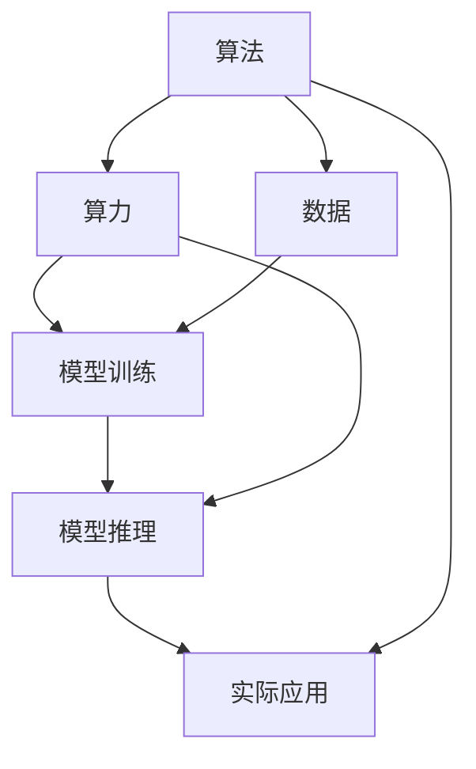

                 

# AI发展的三大动力源：算法、算力与数据

## 1. 背景介绍

人工智能（AI）的发展历程中，算法、算力和数据始终是其三大核心动力源。这三者相辅相成，共同驱动AI技术的持续进步和广泛应用。从简单的逻辑回归到复杂的深度学习，从单机算力到分布式计算，从标注数据集到自监督学习，AI的每次突破都离不开这三方面的协同进步。本文将从这三个维度详细探讨AI发展的驱动机制，分析它们之间的内在联系与作用，为读者提供一个全面、深入的视角。

## 2. 核心概念与联系

### 2.1 核心概念概述

- **算法（Algorithm）**：算法是解决特定问题的规则和步骤。在AI领域，算法是实现模型训练和推理的关键。它决定了模型如何处理输入数据，进行计算，最终输出结果。
- **算力（Computational Power）**：算力指的是硬件和软件在数据处理和模型训练中的计算能力。它直接影响算法在实际应用中的表现，包括计算速度、精度、能耗等。
- **数据（Data）**：数据是算法训练和验证的基础。高质量、大规模的数据集能够显著提升模型性能，使算法在实际场景中表现更优。

### 2.2 核心概念原理和架构的 Mermaid 流程图



该流程图清晰展示了算法、算力与数据之间的相互关系：算法通过算力在数据上进行训练和推理，而数据的质量和规模直接影响到算法的表现和应用效果。

## 3. 核心算法原理 & 具体操作步骤

### 3.1 算法原理概述

AI算法的发展经历了多个阶段，从早期的符号逻辑、决策树、支持向量机等传统机器学习算法，到深度学习、强化学习、生成对抗网络（GAN）等前沿算法。这些算法通过不同的机制和模型结构，实现了对复杂问题的处理和决策。

以深度学习为例，其核心原理是通过多层神经网络，对输入数据进行特征提取和转换，最终输出预测结果。在训练过程中，算法通过反向传播更新模型参数，以最小化损失函数，从而提升模型的准确性和泛化能力。

### 3.2 算法步骤详解

深度学习算法的训练过程一般包括以下几个步骤：

1. **数据预处理**：对原始数据进行清洗、标准化、分词等预处理，确保数据质量。
2. **构建模型**：选择合适的深度学习模型架构，如卷积神经网络（CNN）、递归神经网络（RNN）、Transformer等。
3. **模型训练**：将处理好的数据输入模型，通过前向传播计算预测结果，再通过反向传播更新模型参数。
4. **模型验证和调优**：在验证集上评估模型性能，根据评估结果调整超参数，如学习率、批大小等，以优化模型表现。
5. **模型评估和应用**：在测试集上评估模型性能，并将模型应用到实际场景中。

### 3.3 算法优缺点

深度学习算法在处理大规模数据和复杂问题时表现优异，但同时也存在以下缺点：

- **模型复杂度高**：深度学习模型通常包含大量参数，计算量巨大，对算力和资源消耗较高。
- **过拟合风险**：在训练过程中容易过拟合训练数据，影响泛化能力。
- **数据依赖性强**：模型的性能高度依赖于数据质量，数据量不足或分布不均会导致模型性能下降。

### 3.4 算法应用领域

深度学习算法在多个领域得到了广泛应用，包括但不限于：

- **计算机视觉**：图像分类、目标检测、人脸识别等。
- **自然语言处理**：机器翻译、文本生成、情感分析等。
- **语音识别**：语音转文本、情感识别、语音合成等。
- **游戏AI**：游戏策略制定、动作优化等。
- **医疗健康**：医学影像分析、疾病预测、个性化治疗等。

## 4. 数学模型和公式 & 详细讲解 & 举例说明

### 4.1 数学模型构建

以神经网络模型为例，其基本数学模型可以表示为：

$$
f(x; \theta) = \sigma(Wx + b)
$$

其中 $f$ 表示模型输出，$x$ 表示输入数据，$W$ 和 $b$ 表示模型参数，$\sigma$ 表示激活函数。

### 4.2 公式推导过程

以多层感知器（MLP）为例，其前向传播过程可以表示为：

$$
h^{[l]} = \sigma(\sum_{i=1}^n W^{[l]}_i x_i + b^{[l]})
$$

其中 $h^{[l]}$ 表示第 $l$ 层的隐藏层输出，$x_i$ 表示输入数据，$W^{[l]}_i$ 和 $b^{[l]}$ 表示第 $l$ 层的参数。

### 4.3 案例分析与讲解

在图像分类任务中，常用的深度学习算法是卷积神经网络（CNN）。CNN 通过卷积层、池化层、全连接层等组成的网络结构，对图像进行特征提取和分类。其核心思想是利用卷积核对图像进行卷积操作，提取局部特征，并通过池化操作减小特征维度，最后通过全连接层进行分类。

## 5. 项目实践：代码实例和详细解释说明

### 5.1 开发环境搭建

在进行项目实践前，需要搭建好开发环境。以下是一个基于 PyTorch 和 TensorFlow 的开发环境搭建流程：

1. **安装 Python**：从官网下载并安装 Python，确保版本为 3.8 或以上。
2. **安装 PyTorch**：使用 pip 命令安装 PyTorch 和相关依赖。
   ```bash
   pip install torch torchvision torchaudio
   ```
3. **安装 TensorFlow**：使用 pip 命令安装 TensorFlow 和相关依赖。
   ```bash
   pip install tensorflow
   ```
4. **安装相关库**：安装必要的库，如 NumPy、Pandas、Matplotlib 等。
   ```bash
   pip install numpy pandas matplotlib
   ```

### 5.2 源代码详细实现

以下是一个简单的神经网络模型的 Python 代码实现：

```python
import torch
import torch.nn as nn
import torch.optim as optim

class Net(nn.Module):
    def __init__(self):
        super(Net, self).__init__()
        self.fc1 = nn.Linear(784, 256)
        self.fc2 = nn.Linear(256, 128)
        self.fc3 = nn.Linear(128, 10)

    def forward(self, x):
        x = x.view(-1, 784)
        x = torch.relu(self.fc1(x))
        x = torch.relu(self.fc2(x))
        x = self.fc3(x)
        return x

# 加载数据集
train_loader = torch.utils.data.DataLoader(train_dataset, batch_size=64, shuffle=True)

# 定义模型、优化器和损失函数
model = Net()
optimizer = optim.Adam(model.parameters(), lr=0.001)
criterion = nn.CrossEntropyLoss()

# 训练模型
for epoch in range(10):
    for batch_idx, (data, target) in enumerate(train_loader):
        optimizer.zero_grad()
        output = model(data)
        loss = criterion(output, target)
        loss.backward()
        optimizer.step()
```

### 5.3 代码解读与分析

上述代码实现了一个简单的三层神经网络模型，用于手写数字识别任务。其核心逻辑包括数据预处理、模型定义、模型训练等步骤。通过调用 PyTorch 提供的 `nn` 和 `optim` 模块，可以方便地构建和训练神经网络模型。

## 6. 实际应用场景

### 6.1 智能客服系统

智能客服系统是深度学习算法在实际应用中的典型案例。通过深度学习模型，系统可以理解客户咨询内容，匹配最优答案，并提供个性化的服务。例如，在银行业务咨询场景中，系统可以通过分析客户提问，自动判断其需求，并给出相应的业务指导。

### 6.2 金融风控系统

金融风控系统需要对大量交易数据进行实时分析，以识别异常交易和潜在风险。深度学习算法可以在数据分析中发挥重要作用，通过挖掘数据中的复杂模式和异常特征，实时监控并预警风险。

### 6.3 智能推荐系统

智能推荐系统利用深度学习算法对用户行为进行建模，从而提供个性化的商品推荐。通过分析用户的历史浏览、购买等行为数据，系统可以生成精准的推荐结果，提升用户体验和转化率。

### 6.4 未来应用展望

未来，深度学习算法将在更多领域得到应用，推动AI技术的持续发展。例如：

- **医疗健康**：通过深度学习模型对医学影像进行分析，辅助医生进行疾病诊断和预测。
- **自动驾驶**：利用深度学习算法对传感器数据进行处理，实现自动驾驶功能。
- **工业制造**：利用深度学习算法对生产数据进行建模，优化生产流程，提升产品质量。

## 7. 工具和资源推荐

### 7.1 学习资源推荐

- **《深度学习》教材**：由 Ian Goodfellow 等人编写，全面介绍了深度学习的理论基础和实践方法。
- **Coursera 深度学习课程**：由深度学习领域的专家 Andrew Ng 主讲，适合初学者入门。
- **Google Deep Learning Book**：由 Google 团队编写，详细介绍了深度学习模型的构建和优化。

### 7.2 开发工具推荐

- **PyTorch**：由 Facebook 开发的深度学习框架，支持动态图和静态图，适合研究型开发。
- **TensorFlow**：由 Google 开发的深度学习框架，支持分布式计算，适合工程应用。
- **Jupyter Notebook**：用于数据科学和机器学习的交互式开发环境，支持多种语言和工具。

### 7.3 相关论文推荐

- **《ImageNet Classification with Deep Convolutional Neural Networks》**：Hinton 等人提出卷积神经网络在图像分类中的应用。
- **《Deep Residual Learning for Image Recognition》**：He 等人提出残差网络，提升深度学习模型的收敛性和性能。
- **《Attention is All You Need》**：Vaswani 等人提出 Transformer 结构，为深度学习模型提供新的突破。

## 8. 总结：未来发展趋势与挑战

### 8.1 研究成果总结

深度学习算法在过去十年中取得了显著进展，推动了AI技术的广泛应用。未来，深度学习算法将继续与算力和数据紧密结合，推动AI技术的进一步突破。

### 8.2 未来发展趋势

- **模型压缩与加速**：通过量化、剪枝、蒸馏等技术，压缩深度学习模型的参数和计算量，提升模型推理效率。
- **多模态学习**：将深度学习模型应用于多模态数据，实现视觉、语音、文本等多模态信息的协同建模。
- **自监督学习**：利用未标注数据进行自监督学习，降低对标注数据的依赖，提高模型的泛化能力。
- **联邦学习**：通过分布式计算和数据隐私保护技术，实现跨设备、跨平台的数据协同学习。

### 8.3 面临的挑战

尽管深度学习算法在实际应用中取得了巨大成功，但仍面临以下挑战：

- **数据隐私和安全**：深度学习模型在数据处理中存在隐私泄露和数据滥用的风险，需要加强数据保护和隐私管理。
- **模型解释性和透明性**：深度学习模型通常被视为“黑盒”，缺乏可解释性和透明性，需要开发更多可解释性算法。
- **公平性和偏见**：深度学习模型可能存在偏见和歧视，影响其在实际应用中的公平性和可靠性。
- **计算资源消耗**：深度学习模型需要大量计算资源，如何平衡模型性能和计算成本是一个重要问题。

### 8.4 研究展望

未来，深度学习算法需要在数据、模型、算法等各个方面进行进一步优化，推动AI技术的不断发展：

- **数据集的多样化和质量提升**：收集更多高质量、多样化的数据集，促进模型的泛化能力。
- **模型的轻量化与高效化**：开发轻量化、高效的深度学习模型，减少计算资源消耗。
- **算法的创新与应用**：探索新的算法和模型结构，提升深度学习算法的性能和应用效果。

## 9. 附录：常见问题与解答

### 9.1 常见问题与解答

**Q1: 深度学习算法是否适用于所有任务？**

A: 深度学习算法在处理大规模数据和复杂问题时表现优异，但对于一些简单的、结构化的问题，可能不如传统的机器学习算法。

**Q2: 深度学习算法的计算资源需求是否过高？**

A: 深度学习算法的计算资源需求确实较高，但随着硬件技术的发展，如GPU、TPU等加速设备的应用，计算资源的成本正在逐渐下降。

**Q3: 深度学习算法是否容易出现过拟合？**

A: 深度学习算法在训练过程中容易出现过拟合，可以通过数据增强、正则化、早停等技术进行缓解。

**Q4: 深度学习算法是否需要大量的标注数据？**

A: 深度学习算法通常需要大量标注数据进行训练，但随着自监督学习等技术的发展，部分任务可以借助无监督或半监督数据进行训练。

**Q5: 深度学习算法是否容易被攻击？**

A: 深度学习模型存在被攻击的风险，如对抗样本攻击、模型逆向工程等。需要通过模型鲁棒性提升和对抗训练等技术进行防御。

作者：禅与计算机程序设计艺术 / Zen and the Art of Computer Programming

