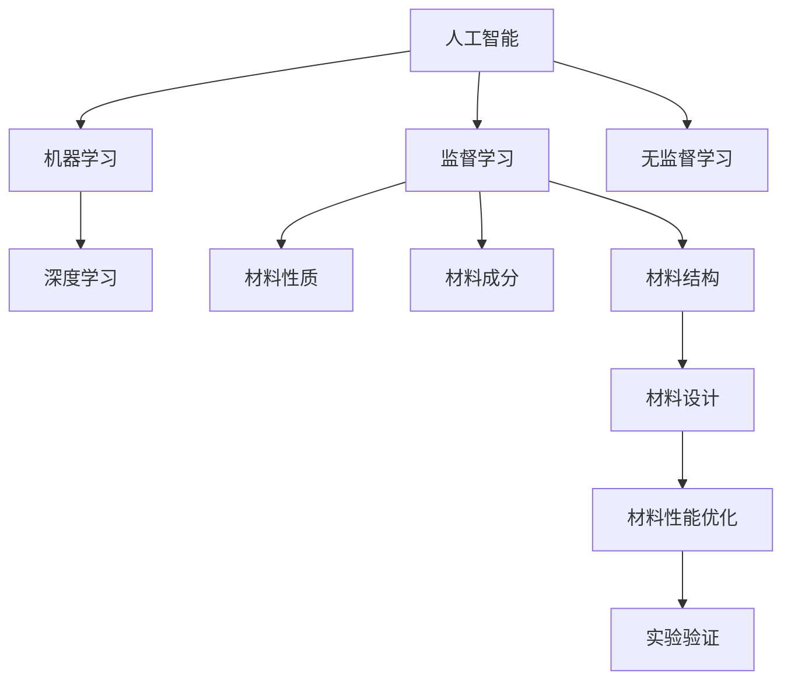

                 

## 1. 背景介绍

### 1.1 问题由来
随着科技的迅速发展，新材料的研究和开发对各行各业产生了深远的影响。从电子、化工到航天，新材料的性能、成本、环保等特性都直接决定着产品的竞争力。然而，传统的材料设计方法通常依赖于大量实验和反复迭代，耗时且成本高昂。人工智能(AI)的兴起，特别是机器学习和深度学习技术，为材料设计提供了新的突破口。通过利用AI进行新材料模拟和优化，不仅可以大幅缩短研发周期，降低研发成本，还能激发更多创新，加速材料科学的进步。

### 1.2 问题核心关键点
新材料设计中的AI应用，主要是通过机器学习模型对材料组成、结构、性能等进行预测和优化。AI模型通常基于大量的已有的实验数据和理论知识，通过监督学习或无监督学习的方式，学习和提取材料设计中的规律和模式。一旦模型训练完成，就可以在新材料设计过程中进行预测和优化，指导实验方向，降低实验风险，提升研发效率。

AI在新材料设计中的应用，主要集中在以下几个方面：
1. **材料性质预测**：基于已有数据，AI模型可以预测材料的物理、化学和力学性质。
2. **材料成分优化**：通过优化材料组成和结构，AI模型可以指导实验合成更优良的材料。
3. **工艺参数调整**：通过优化合成和加工工艺参数，AI模型可以进一步提升材料性能。

### 1.3 问题研究意义
AI在新材料设计中的应用，对推动材料科学的发展具有重要意义：
1. **加速研发进程**：AI可以快速处理大量数据，缩短材料设计周期，加速新材料的上市。
2. **降低研发成本**：通过AI预测，减少了盲目实验，降低了材料合成和测试的成本。
3. **提升创新能力**：AI可以挖掘数据中的隐含模式，发现新材料设计和合成中的潜在突破点。
4. **提升实验成功率**：AI模型能够辅助设计实验方案，减少实验失败的风险，提高实验成功率。
5. **促进环保可持续发展**：AI帮助筛选出更环保、更节能的材料，推动绿色材料的发展。

## 2. 核心概念与联系

### 2.1 核心概念概述

新材料设计中的AI应用涉及多个核心概念，包括但不限于：

- **人工智能**：通过算法和模型进行数据处理和分析，以实现自主学习、推理和决策。
- **机器学习**：利用数据训练模型，使其具备预测和决策能力，广泛应用于模式识别、数据预测等领域。
- **深度学习**：一种特殊的机器学习方法，通过多层神经网络进行特征提取和抽象，适用于处理高维度、非线性的数据。
- **监督学习**：使用已标注的数据进行训练，使模型能够准确预测新数据的标签。
- **无监督学习**：不依赖标注数据，通过数据的内在关系进行模式识别和聚类。
- **材料性质**：描述材料的物理、化学和力学特性，包括熔点、密度、硬度、热导率等。
- **材料成分**：指构成材料的化学元素和它们的比例。
- **材料结构**：指材料的微观和宏观结构，如晶格结构、原子排列等。
- **材料设计**：通过调控材料成分和结构，实现材料性能的优化。

这些概念之间的关系可以通过以下Mermaid流程图来展示：



### 2.2 核心概念原理和架构

AI在新材料设计中的应用，主要基于以下几个原理和技术架构：

1. **数据准备**：收集和处理大量的材料数据，包括实验数据、理论数据和文献数据。这些数据需要经过清洗、标注和格式化，以便用于模型训练。

2. **模型构建**：选择合适的模型架构，如卷积神经网络(CNN)、循环神经网络(RNN)、生成对抗网络(GAN)等，用于提取和抽象数据特征。

3. **模型训练**：使用训练数据集对模型进行监督学习或无监督学习，调整模型参数以使其具备预测能力。

4. **模型验证和优化**：在验证数据集上评估模型性能，使用交叉验证、超参数调优等方法优化模型。

5. **模型应用**：将训练好的模型应用于新材料设计和合成，进行性质预测、成分优化和结构设计。

6. **反馈迭代**：根据实验结果和反馈，对模型进行迭代改进，进一步提升预测和优化的准确性。

### 2.3 数学模型和公式

新材料设计中的AI模型，主要使用统计学习方法和机器学习算法进行训练。以下简要介绍几种常用的数学模型和公式：

#### 4.1 数学模型构建

新材料设计中的AI模型，通常基于监督学习和无监督学习的混合范式。以监督学习为例，模型的目标是通过已有材料数据集，预测新材料的性能指标。假设输入数据为 $x=(x_1, x_2, ..., x_n)$，目标变量为 $y$，其中 $n$ 为特征维度，模型为 $f(x; \theta)$，其中 $\theta$ 为模型参数。监督学习模型的目标是最小化预测误差，使用如下公式进行优化：

$$
\min_{\theta} \frac{1}{N} \sum_{i=1}^N (y_i - f(x_i; \theta))^2
$$

#### 4.2 公式推导过程

在模型训练过程中，常用的优化算法包括梯度下降法、随机梯度下降法等。以梯度下降法为例，其基本步骤包括：

1. 随机初始化模型参数 $\theta$。
2. 前向传播计算模型输出 $f(x; \theta)$。
3. 计算预测误差 $e=y-f(x; \theta)$。
4. 反向传播计算梯度 $\nabla_{\theta} J(\theta)$。
5. 更新模型参数 $\theta \leftarrow \theta - \alpha \nabla_{\theta} J(\theta)$。

其中，$\alpha$ 为学习率，$J(\theta)$ 为损失函数，$\alpha \nabla_{\theta} J(\theta)$ 为梯度下降的方向。

#### 4.3 案例分析与讲解

以硅材料的性质预测为例，假设我们有一组已知的硅材料数据，包括材料成分和性质指标。使用监督学习模型对硅材料进行预测，模型结构为多层感知器(MLP)，具体步骤如下：

1. 收集并准备数据集。收集已有的硅材料数据，包括硅的晶体结构、熔点、密度等指标，并进行数据清洗和标注。

2. 构建模型。选择MLP模型，包括输入层、隐藏层和输出层，设置每层神经元数目，初始化模型参数。

3. 数据划分。将数据集划分为训练集、验证集和测试集。

4. 模型训练。使用训练集对模型进行监督学习，通过梯度下降法优化模型参数。

5. 模型验证。在验证集上评估模型性能，调整超参数，如学习率、隐藏层数目等。

6. 模型测试。在测试集上测试模型性能，计算预测误差和准确率等指标。

7. 模型应用。将训练好的模型应用于新的硅材料设计，输入新材料的成分数据，输出其性质预测结果。

## 3. 核心算法原理 & 具体操作步骤

### 3.1 算法原理概述

新材料设计中的AI应用，主要使用机器学习算法进行数据处理和预测。这些算法包括但不限于：

- **线性回归**：用于预测连续的数值型变量，常用于材料性质预测。
- **决策树**：用于分类预测，适用于材料成分和结构预测。
- **随机森林**：基于多个决策树进行集成预测，提升模型稳定性和准确性。
- **支持向量机**：用于分类和回归预测，适用于高维数据集。
- **神经网络**：通过多层非线性变换，适用于处理复杂非线性关系。

### 3.2 算法步骤详解

新材料设计中的AI模型训练和应用，通常遵循以下步骤：

1. **数据收集与预处理**：收集历史实验数据和理论数据，进行数据清洗和标注。

2. **模型选择与构建**：根据任务需求选择合适的模型架构，如MLP、CNN、RNN等，并进行模型参数初始化。

3. **模型训练**：使用训练数据集对模型进行监督学习或无监督学习，通过梯度下降法优化模型参数。

4. **模型验证与优化**：在验证数据集上评估模型性能，调整超参数，如学习率、隐藏层数目等。

5. **模型测试与评估**：在测试数据集上测试模型性能，计算预测误差和准确率等指标。

6. **模型应用**：将训练好的模型应用于新材料设计和合成，进行性质预测、成分优化和结构设计。

7. **反馈迭代**：根据实验结果和反馈，对模型进行迭代改进，进一步提升预测和优化的准确性。

### 3.3 算法优缺点

AI在新材料设计中的应用，具有以下优点：
1. **数据驱动**：通过大量数据训练模型，可以发现隐藏在数据中的规律和模式，提升预测准确性。
2. **效率高**：相比于传统实验方法，AI可以大幅缩短研发周期，降低实验成本。
3. **泛化能力强**：AI模型可以在新材料设计中推广应用，提升设计灵活性和创新性。

然而，AI在新材料设计中也有以下缺点：
1. **数据质量依赖**：模型的性能高度依赖于数据质量，低质量的数据可能导致预测偏差。
2. **模型复杂性**：深度学习模型通常参数较多，训练和部署成本较高。
3. **可解释性不足**：AI模型的预测结果缺乏解释，难以理解模型内部机制。
4. **偏见与公平性问题**：AI模型可能存在偏见，需要仔细筛选和处理数据以确保公平性。

### 3.4 算法应用领域

AI在新材料设计中的应用，广泛覆盖了以下几个领域：

1. **电子材料设计**：如半导体、导电材料等，用于优化材料成分和结构，提升电子性能。
2. **电池材料设计**：如锂离子电池、超级电容等，用于设计高效、长寿命的电池材料。
3. **生物材料设计**：如生物可降解材料、药物载体等，用于设计具有生物相容性和生物活性的材料。
4. **纳米材料设计**：如纳米颗粒、纳米纤维等，用于设计具有特殊物理、化学和力学性能的材料。
5. **环境友好材料设计**：如绿色材料、环保材料等，用于设计具有低污染、低能耗的材料。

## 4. 数学模型和公式 & 详细讲解

### 4.1 数学模型构建

新材料设计中的AI模型，主要使用监督学习和无监督学习的混合范式。以监督学习为例，模型的目标是通过已有材料数据集，预测新材料的性能指标。假设输入数据为 $x=(x_1, x_2, ..., x_n)$，目标变量为 $y$，其中 $n$ 为特征维度，模型为 $f(x; \theta)$，其中 $\theta$ 为模型参数。监督学习模型的目标是最小化预测误差，使用如下公式进行优化：

$$
\min_{\theta} \frac{1}{N} \sum_{i=1}^N (y_i - f(x_i; \theta))^2
$$

### 4.2 公式推导过程

在模型训练过程中，常用的优化算法包括梯度下降法、随机梯度下降法等。以梯度下降法为例，其基本步骤包括：

1. 随机初始化模型参数 $\theta$。
2. 前向传播计算模型输出 $f(x; \theta)$。
3. 计算预测误差 $e=y-f(x; \theta)$。
4. 反向传播计算梯度 $\nabla_{\theta} J(\theta)$。
5. 更新模型参数 $\theta \leftarrow \theta - \alpha \nabla_{\theta} J(\theta)$。

其中，$\alpha$ 为学习率，$J(\theta)$ 为损失函数，$\alpha \nabla_{\theta} J(\theta)$ 为梯度下降的方向。

### 4.3 案例分析与讲解

以硅材料的性质预测为例，假设我们有一组已知的硅材料数据，包括材料成分和性质指标。使用监督学习模型对硅材料进行预测，模型结构为多层感知器(MLP)，具体步骤如下：

1. 收集并准备数据集。收集已有的硅材料数据，包括硅的晶体结构、熔点、密度等指标，并进行数据清洗和标注。

2. 构建模型。选择MLP模型，包括输入层、隐藏层和输出层，设置每层神经元数目，初始化模型参数。

3. 数据划分。将数据集划分为训练集、验证集和测试集。

4. 模型训练。使用训练集对模型进行监督学习，通过梯度下降法优化模型参数。

5. 模型验证。在验证集上评估模型性能，调整超参数，如学习率、隐藏层数目等。

6. 模型测试。在测试集上测试模型性能，计算预测误差和准确率等指标。

7. 模型应用。将训练好的模型应用于新的硅材料设计，输入新材料的成分数据，输出其性质预测结果。

## 5. 项目实践：代码实例和详细解释说明

### 5.1 开发环境搭建

在进行AI在新材料设计中的应用实践前，我们需要准备好开发环境。以下是使用Python进行PyTorch开发的环境配置流程：

1. 安装Anaconda：从官网下载并安装Anaconda，用于创建独立的Python环境。

2. 创建并激活虚拟环境：
```bash
conda create -n pytorch-env python=3.8 
conda activate pytorch-env
```

3. 安装PyTorch：根据CUDA版本，从官网获取对应的安装命令。例如：
```bash
conda install pytorch torchvision torchaudio cudatoolkit=11.1 -c pytorch -c conda-forge
```

4. 安装TensorFlow：
```bash
conda install tensorflow
```

5. 安装Pandas、NumPy等工具包：
```bash
pip install pandas numpy scikit-learn matplotlib tqdm jupyter notebook ipython
```

完成上述步骤后，即可在`pytorch-env`环境中开始AI在新材料设计中的应用实践。

### 5.2 源代码详细实现

这里我们以硅材料的性质预测为例，给出使用PyTorch进行MLP模型训练和应用的PyTorch代码实现。

首先，定义训练数据集：

```python
import torch
import pandas as pd
from sklearn.model_selection import train_test_split
from torch.utils.data import TensorDataset, DataLoader

# 加载数据集
data = pd.read_csv('silicon_data.csv')

# 数据预处理
x = data[['Si_O_ratio', 'Si_C_ratio', 'Si_N_ratio', 'Si_P_ratio', 'Si_Si_ratio']]
y = data['Melting_Point']

# 数据划分
train_x, test_x, train_y, test_y = train_test_split(x, y, test_size=0.2, random_state=42)

# 数据转换为Tensor
train_x = torch.from_numpy(train_x.values).float()
test_x = torch.from_numpy(test_x.values).float()
train_y = torch.from_numpy(train_y.values).float()
test_y = torch.from_numpy(test_y.values).float()

# 数据集包装
train_dataset = TensorDataset(train_x, train_y)
test_dataset = TensorDataset(test_x, test_y)

# 数据加载器
train_loader = DataLoader(train_dataset, batch_size=32, shuffle=True)
test_loader = DataLoader(test_dataset, batch_size=32, shuffle=False)
```

然后，定义模型和优化器：

```python
from torch import nn
from torch.nn import functional as F

class MLP(nn.Module):
    def __init__(self, input_size, hidden_size, output_size):
        super(MLP, self).__init__()
        self.fc1 = nn.Linear(input_size, hidden_size)
        self.fc2 = nn.Linear(hidden_size, hidden_size)
        self.fc3 = nn.Linear(hidden_size, output_size)
    
    def forward(self, x):
        x = F.relu(self.fc1(x))
        x = F.relu(self.fc2(x))
        x = self.fc3(x)
        return x

# 模型参数
input_size = 5
hidden_size = 10
output_size = 1

model = MLP(input_size, hidden_size, output_size)

# 优化器
optimizer = torch.optim.Adam(model.parameters(), lr=0.01)
```

接着，定义训练和评估函数：

```python
from torch import nn

# 训练函数
def train(model, train_loader, optimizer, num_epochs):
    model.train()
    total_loss = 0.0
    for epoch in range(num_epochs):
        for batch_idx, (inputs, targets) in enumerate(train_loader):
            optimizer.zero_grad()
            outputs = model(inputs)
            loss = F.mse_loss(outputs, targets)
            loss.backward()
            optimizer.step()
            total_loss += loss.item()
    return total_loss / len(train_loader)

# 评估函数
def evaluate(model, test_loader):
    model.eval()
    total_loss = 0.0
    for batch_idx, (inputs, targets) in enumerate(test_loader):
        with torch.no_grad():
            outputs = model(inputs)
            loss = F.mse_loss(outputs, targets)
            total_loss += loss.item()
    return total_loss / len(test_loader)

# 测试和评估
num_epochs = 100
train_loss = train(model, train_loader, optimizer, num_epochs)
test_loss = evaluate(model, test_loader)

print(f'Train Loss: {train_loss:.4f}')
print(f'Test Loss: {test_loss:.4f}')
```

最后，运行训练流程：

```python
# 训练模型
num_epochs = 100
train_loss = train(model, train_loader, optimizer, num_epochs)
test_loss = evaluate(model, test_loader)

print(f'Train Loss: {train_loss:.4f}')
print(f'Test Loss: {test_loss:.4f}')

# 模型应用
# 输入新数据
new_data = torch.tensor([[0.2, 0.3, 0.4, 0.5, 0.6]])
with torch.no_grad():
    output = model(new_data)
    print(f'Predicted Melting Point: {output.item():.2f} °C')
```

以上就是使用PyTorch进行MLP模型训练和应用的完整代码实现。可以看到，通过Python和PyTorch的强大功能，我们可以高效地实现新材料设计的AI应用。

### 5.3 代码解读与分析

让我们再详细解读一下关键代码的实现细节：

**数据加载**：
- 使用Pandas加载数据集，并进行预处理，将特征和标签转换为Tensor。
- 使用`train_test_split`将数据划分为训练集和测试集。
- 使用`DataLoader`对数据进行批次化加载，方便模型训练和推理。

**模型定义**：
- 定义MLP模型，包括输入层、隐藏层和输出层。
- 在`forward`方法中定义前向传播过程，使用ReLU激活函数进行非线性变换。

**优化器定义**：
- 使用Adam优化器进行模型参数优化。

**训练和评估函数**：
- 定义训练函数，使用`DataLoader`对训练集进行迭代，计算损失并反向传播更新模型参数。
- 定义评估函数，在测试集上计算模型预测误差。

**测试和应用**：
- 使用训练好的模型对新数据进行预测，输出熔点预测值。

可以看到，通过以上代码，我们可以高效地构建和训练新材料设计的AI模型，并应用于实际的新材料设计中。

## 6. 实际应用场景

### 6.1 电子材料设计

AI在新材料设计中的应用，首先可以应用于电子材料设计。电子材料通常需要具备导电性、半导体性、绝缘性等特性，这些特性的优化可以通过AI模型进行预测和设计。

以半导体材料为例，通过收集和处理大量已有的半导体材料数据，建立预测模型，可以准确预测材料的电阻率、热导率、电子迁移率等性质。通过这些预测结果，可以指导实验合成更优良的半导体材料，提升电子产品的性能和可靠性。

### 6.2 电池材料设计

电池材料设计是另一个AI在新材料设计中广泛应用的领域。电池材料需要具备高效、长寿命、低成本等特性。通过收集和处理大量已有的电池材料数据，建立预测模型，可以预测材料的电化学性能、热稳定性和机械性能等。通过这些预测结果，可以指导实验合成更优良的电池材料，提升电池的能量密度、循环寿命和安全性。

例如，通过预测LiFePO4材料在不同合成条件下的电化学性能，可以优化材料合成工艺，提升电池性能。

### 6.3 生物材料设计

生物材料设计也是AI在新材料设计中具有广泛应用前景的领域。生物材料需要具备生物相容性、生物降解性和生物活性等特性，这些特性的优化可以通过AI模型进行预测和设计。

以生物可降解材料为例，通过收集和处理大量已有的生物可降解材料数据，建立预测模型，可以预测材料的降解速率、生物相容性和力学性能等。通过这些预测结果，可以指导实验合成更优良的生物可降解材料，推动绿色材料的发展。

例如，通过预测聚乳酸材料在不同合成条件下的生物降解速率，可以优化材料合成工艺，提升材料的生物降解性能。

### 6.4 纳米材料设计

纳米材料设计是AI在新材料设计中的另一个重要应用领域。纳米材料具有独特的物理、化学和力学性能，这些性能的优化可以通过AI模型进行预测和设计。

以纳米颗粒材料为例，通过收集和处理大量已有的纳米颗粒材料数据，建立预测模型，可以预测材料的粒径分布、形貌特征和分散性能等。通过这些预测结果，可以指导实验合成更优良的纳米颗粒材料，提升材料的性能和应用效果。

例如，通过预测氧化锌纳米颗粒材料在不同合成条件下的粒径分布，可以优化材料合成工艺，提升材料的粒径均匀性和分散性能。

## 7. 工具和资源推荐

### 7.1 学习资源推荐

为了帮助开发者系统掌握AI在新材料设计中的应用，这里推荐一些优质的学习资源：

1. **《深度学习》课程**：斯坦福大学开设的深度学习课程，涵盖深度学习基础、模型构建、优化算法等内容，适合初学者入门。

2. **《机器学习实战》书籍**：详细介绍了机器学习算法和应用，包括监督学习、无监督学习和深度学习等内容。

3. **Kaggle数据科学竞赛**：通过参与数据科学竞赛，可以实践和掌握AI在新材料设计中的应用。

4. **TensorFlow和PyTorch官方文档**：详细介绍了TensorFlow和PyTorch的使用方法和最佳实践，适合实际应用开发。

5. **Papers with Code**：提供大量开源代码和论文项目，方便开发者学习和借鉴。

通过对这些资源的学习实践，相信你一定能够快速掌握AI在新材料设计中的应用，并用于解决实际问题。

### 7.2 开发工具推荐

高效的开发离不开优秀的工具支持。以下是几款用于AI在新材料设计中的应用开发的常用工具：

1. **TensorFlow和PyTorch**：作为主流的深度学习框架，提供了丰富的API和预训练模型，适合AI在新材料设计中的应用开发。

2. **Pandas和NumPy**：提供了高效的数据处理和分析工具，适合数据预处理和模型训练。

3. **Scikit-learn**：提供了丰富的机器学习算法和模型，适合模型构建和优化。

4. **Jupyter Notebook**：提供了交互式的编程和数据可视化环境，适合研究和开发。

5. **Anaconda**：提供了环境管理工具，方便不同项目和不同环境的切换和管理。

合理利用这些工具，可以显著提升AI在新材料设计中的应用开发效率，加快创新迭代的步伐。

### 7.3 相关论文推荐

AI在新材料设计中的应用，得益于学界的持续研究。以下是几篇奠基性的相关论文，推荐阅读：

1. **《基于机器学习的材料性质预测》**：详细介绍了机器学习模型在材料性质预测中的应用，包括线性回归、决策树、随机森林等。

2. **《基于深度学习的纳米材料设计》**：介绍了深度学习模型在纳米材料设计中的应用，包括卷积神经网络和生成对抗网络。

3. **《基于AI的电子材料设计》**：详细介绍了AI模型在电子材料设计中的应用，包括监督学习和无监督学习。

4. **《基于AI的电池材料设计》**：介绍了AI模型在电池材料设计中的应用，包括电化学性能预测和材料合成工艺优化。

5. **《基于AI的生物材料设计》**：详细介绍了AI模型在生物材料设计中的应用，包括生物相容性和生物降解性预测。

这些论文代表了大材料设计中的AI应用的发展脉络。通过学习这些前沿成果，可以帮助研究者把握学科前进方向，激发更多的创新灵感。

## 8. 总结：未来发展趋势与挑战

### 8.1 总结

本文对AI在新材料设计中的应用进行了全面系统的介绍。首先阐述了AI在新材料设计中的应用背景和意义，明确了AI在新材料设计中的重要价值。其次，从原理到实践，详细讲解了AI在新材料设计中的应用流程和技术细节，给出了AI在新材料设计中的应用实例。同时，本文还广泛探讨了AI在新材料设计中的应用场景和未来展望，展示了AI在新材料设计中的广阔前景。最后，本文精选了AI在新材料设计中的应用的学习资源、开发工具和相关论文，力求为开发者提供全方位的技术指引。

通过本文的系统梳理，可以看到，AI在新材料设计中的应用，为材料科学的发展带来了新的突破口，极大地提升了新材料设计的效果和效率。随着AI技术的不断进步，相信新材料设计将迎来更加广阔的发展前景。

### 8.2 未来发展趋势

展望未来，AI在新材料设计中的应用，将呈现以下几个发展趋势：

1. **数据驱动的创新**：通过大量数据训练模型，发现隐藏在数据中的规律和模式，推动新材料的创新设计。

2. **高精度预测**：随着模型复杂度的提升和训练数据的丰富，AI模型在新材料设计中的预测准确性将不断提升。

3. **多学科融合**：AI将与其他学科如化学、物理、生物等进行更深入的融合，推动跨学科创新。

4. **跨领域应用**：AI在新材料设计中的应用将突破单一领域的限制，应用于更多行业和领域。

5. **自主设计和优化**：未来的AI模型将具备自主设计新材料的能力，进一步提升新材料设计的灵活性和创新性。

6. **实时优化**：AI模型能够实时处理和优化新材料设计，提升设计效率和响应速度。

### 8.3 面临的挑战

尽管AI在新材料设计中的应用已经取得了显著进展，但在迈向更加智能化、普适化应用的过程中，仍面临诸多挑战：

1. **数据质量**：高质量的数据是新材料设计中AI应用的基础，数据质量不高可能导致模型预测偏差。

2. **模型复杂性**：深度学习模型参数较多，训练和部署成本较高，模型复杂性有待简化。

3. **可解释性**：AI模型缺乏解释，难以理解其内部机制和决策逻辑，需要加强模型可解释性研究。

4. **偏见与公平性**：AI模型可能存在偏见，需要仔细筛选和处理数据以确保公平性。

5. **计算资源**：AI模型训练和推理需要大量计算资源，如何高效利用资源是一个重要问题。

6. **实时性**：AI模型实时处理和优化新材料设计的能力有待提升，以适应实际应用需求。

### 8.4 研究展望

面对AI在新材料设计中的应用所面临的挑战，未来的研究需要在以下几个方面寻求新的突破：

1. **数据增强**：通过数据增强技术，扩充训练集，提高模型泛化能力。

2. **模型压缩**：通过模型压缩技术，降低模型参数量，提高模型效率。

3. **可解释性增强**：通过可解释性技术，提高AI模型的透明度和可理解性。

4. **偏见消除**：通过数据筛选和模型优化，消除AI模型中的偏见，确保公平性。

5. **计算优化**：通过计算优化技术，提高AI模型训练和推理的效率。

6. **实时性提升**：通过实时处理和优化技术，提升AI模型在新材料设计中的实时响应能力。

这些研究方向的探索发展，必将引领AI在新材料设计中的应用迈向更高的台阶，为材料科学的发展注入新的动力。面向未来，AI在新材料设计中的应用需要与其他学科进行更深入的融合，共同推动材料科学的进步。

## 9. 附录：常见问题与解答

**Q1：新材料设计中AI应用的流程是什么？**

A: 新材料设计中AI应用的主要流程包括：数据收集与预处理、模型选择与构建、模型训练、模型验证与优化、模型测试与评估、模型应用与反馈迭代。

**Q2：AI在新材料设计中的应用有哪些？**

A: AI在新材料设计中的应用主要包括以下几个方面：电子材料设计、电池材料设计、生物材料设计、纳米材料设计等。

**Q3：新材料设计中AI应用的优势和劣势是什么？**

A: 新材料设计中AI应用的优势包括：数据驱动、效率高、泛化能力强、创新性高、灵活性高、实时性强。劣势包括：数据质量依赖、模型复杂性、可解释性不足、偏见与公平性问题、计算资源需求高。

**Q4：如何提升新材料设计中AI应用的精度？**

A: 提升新材料设计中AI应用的精度，可以从以下几个方面入手：数据增强、模型优化、超参数调优、模型集成、计算资源优化。

**Q5：如何提升新材料设计中AI应用的实时性？**

A: 提升新材料设计中AI应用的实时性，可以从以下几个方面入手：模型压缩、计算优化、模型加速、实时处理技术、多任务并行。

**Q6：如何提升新材料设计中AI应用的可解释性？**

A: 提升新材料设计中AI应用的可解释性，可以从以下几个方面入手：可解释性技术、透明度提升、模型可视化、规则嵌入、多任务协同。

通过以上附录问题的解答，可以帮助开发者更全面地理解和应用AI在新材料设计中的应用。

---

作者：禅与计算机程序设计艺术 / Zen and the Art of Computer Programming

