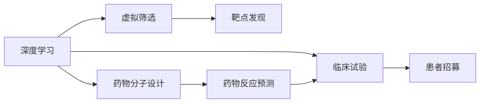

                 

# AI在新药研发中的应用：从靶点发现到临床试验

## 1. 背景介绍

### 1.1 问题由来

新药研发是医药行业的核心驱动力，对改善人类健康具有重大意义。然而，传统的新药研发流程复杂、耗时长、成本高，整个研发周期通常需要10-15年，甚至更长时间，成本高达数十亿美元。在这个过程中，约90%的药物在早期研发阶段未能通过动物试验或临床试验，进入市场的药物少之又少。

近年来，随着人工智能（AI）技术的兴起，AI在新药研发中的应用逐渐引起重视，成为医药行业的热点话题。AI技术通过自动化、数据驱动的决策，显著加速新药研发进程，降低研发成本，提高研发成功率。本文将从靶点发现、药物设计、虚拟筛选、临床试验等方面，系统梳理AI在新药研发中的应用。

### 1.2 问题核心关键点

- **靶点发现**：通过基因组学、蛋白质组学等技术手段，寻找与疾病相关的潜在靶点。
- **药物设计**：利用AI进行化合物生成、优化、筛选等，设计出具有特定活性和毒性的药物分子。
- **虚拟筛选**：通过计算机模拟，筛选出候选药物，减少实验成本和周期。
- **临床试验**：利用AI进行数据挖掘、患者招募、疗效预测等，加速临床试验的推进。

## 2. 核心概念与联系

### 2.1 核心概念概述

AI技术在新药研发中的应用，涉及多个核心概念：

- **深度学习**：利用神经网络进行数据特征提取和模式识别，在新药设计、虚拟筛选等任务中发挥重要作用。
- **机器学习**：通过监督、无监督、强化学习等方法，对药物分子、药物反应等数据进行建模和预测。
- **知识图谱**：构建药物分子、蛋白质、疾病等领域的知识图谱，辅助药物设计、靶点发现等。
- **自然语言处理**（NLP）：分析临床试验报告、文献、患者病历等文本数据，提取有价值的信息。
- **计算机视觉**（CV）：用于药物分子结构图像、细胞图像等数据分析。
- **计算化学**：结合分子建模、模拟等技术，进行药物分子设计和虚拟筛选。

这些概念之间存在紧密的联系，共同构成AI在新药研发中的应用框架。

### 2.2 核心概念原理和架构的 Mermaid 流程图



这个流程图展示了AI技术在新药研发中的核心应用场景：

1. **深度学习**为药物分子设计、虚拟筛选等任务提供模型支持。
2. **虚拟筛选**通过计算机模拟，筛选出具有潜在活性的化合物。
3. **靶点发现**利用深度学习等技术，识别与疾病相关的关键蛋白或基因。
4. **临床试验**通过NLP、机器学习等技术，加速患者招募、疗效预测等流程。

## 3. 核心算法原理 & 具体操作步骤

### 3.1 算法原理概述

AI在新药研发中的应用，主要基于以下算法原理：

- **深度学习**：通过构建卷积神经网络（CNN）、循环神经网络（RNN）、变分自编码器（VAE）等模型，对分子结构、基因序列等高维数据进行建模和预测。
- **机器学习**：利用监督、无监督、强化学习等方法，对药物分子、基因表达、药物反应等数据进行建模和预测。
- **知识图谱**：通过构建领域知识图谱，利用图嵌入算法（如TransE）进行分子-分子、分子-蛋白、蛋白-蛋白等关系推理。
- **自然语言处理**：通过文本挖掘、情感分析等技术，从大量临床试验报告、文献等文本中提取有价值的信息。
- **计算机视觉**：通过图像分割、特征提取等技术，分析药物分子结构图像、细胞图像等。
- **计算化学**：利用分子建模、分子动力学模拟等技术，进行药物分子设计和虚拟筛选。

### 3.2 算法步骤详解

以下是AI在新药研发中常用的算法步骤：

1. **靶点发现**：
   - **基因组学**：分析基因组数据，识别与疾病相关的基因突变。
   - **蛋白质组学**：通过质谱等技术，鉴定蛋白质及其修饰，构建蛋白质相互作用网络。
   - **深度学习**：利用卷积神经网络等模型，从蛋白质序列、结构数据中预测活性区域。

2. **药物设计**：
   - **分子生成**：利用生成对抗网络（GAN）、变分自编码器等模型，生成具有特定活性和毒性的药物分子。
   - **分子优化**：利用强化学习等技术，优化分子结构，提升活性和选择性。

3. **虚拟筛选**：
   - **分子相似性**：利用机器学习模型，预测分子与靶点蛋白的结合亲和力。
   - **分子反应**：通过计算化学模拟，预测药物分子的代谢途径和毒性。

4. **临床试验**：
   - **患者招募**：通过NLP技术，从临床试验数据库中筛选符合条件的患者。
   - **疗效预测**：利用机器学习模型，预测药物对患者疗效，优化临床试验设计。

### 3.3 算法优缺点

**深度学习**：

- **优点**：
  - 能够处理高维数据，具有强大的数据建模能力。
  - 可以通过迁移学习等技术，快速适应新任务。
- **缺点**：
  - 需要大量标注数据进行训练，成本高。
  - 模型复杂，难以解释，存在黑箱问题。

**机器学习**：

- **优点**：
  - 适用范围广，适用于多种数据类型和任务。
  - 可以通过特征工程等手段，提高模型性能。
- **缺点**：
  - 对数据质量和特征提取要求较高。
  - 需要大量计算资源，训练时间长。

**知识图谱**：

- **优点**：
  - 能够整合领域知识，提供丰富的背景信息。
  - 可以进行推理，发现潜在的关联和规律。
- **缺点**：
  - 构建复杂，需要大量专家知识。
  - 无法处理未知实体和关系。

**NLP**：

- **优点**：
  - 能够处理文本数据，提取有价值的信息。
  - 可以自动化信息提取和分类，提高效率。
- **缺点**：
  - 对文本质量和语境理解要求较高。
  - 模型复杂，难以解释。

**计算机视觉**：

- **优点**：
  - 能够处理图像数据，提取特征信息。
  - 可以自动化图像分析和标注，提高效率。
- **缺点**：
  - 对图像质量和标注要求较高。
  - 模型复杂，难以解释。

**计算化学**：

- **优点**：
  - 能够进行分子建模和模拟，提供丰富的物理信息。
  - 可以通过计算化合物的代谢途径，预测毒性。
- **缺点**：
  - 需要大量计算资源，模型复杂。
  - 对分子结构建模和模拟要求较高。

### 3.4 算法应用领域

AI在新药研发中的应用，涵盖了药物分子设计、靶点发现、虚拟筛选、临床试验等诸多领域：

- **药物分子设计**：用于设计新药分子，提高活性和选择性，降低毒性和副作用。
- **靶点发现**：用于识别与疾病相关的关键蛋白或基因，为新药研发提供靶点信息。
- **虚拟筛选**：用于快速筛选候选药物，减少实验成本和周期。
- **临床试验**：用于加速患者招募、疗效预测等，优化临床试验设计。

## 4. 数学模型和公式 & 详细讲解 & 举例说明

### 4.1 数学模型构建

AI在新药研发中，主要涉及以下数学模型：

- **深度学习模型**：包括卷积神经网络（CNN）、循环神经网络（RNN）、变分自编码器（VAE）等。
- **机器学习模型**：包括监督学习、无监督学习、强化学习等。
- **知识图谱模型**：包括TransE、GCN等。
- **NLP模型**：包括文本分类、情感分析等。
- **计算机视觉模型**：包括图像分割、特征提取等。
- **计算化学模型**：包括分子动力学模拟、分子建模等。

### 4.2 公式推导过程

以**深度学习**在药物分子设计中的应用为例，推导分子生成模型的公式。

假设分子结构为向量$\mathbf{x} = [x_1, x_2, \ldots, x_n]$，其中$x_i$表示分子的第$i$个原子或基团。分子生成模型的目标是最大化分子与靶点的结合亲和力$E(\mathbf{x})$，即：

$$
\mathop{\arg\max}_{\mathbf{x}} E(\mathbf{x})
$$

常用的分子生成模型包括变分自编码器（VAE）和生成对抗网络（GAN）。

对于VAE模型，其概率密度函数$p_{\mathbf{x}}$和隐变量$z$之间的关系为：

$$
p_{\mathbf{x}}(\mathbf{x}) = \mathcal{N}(\mathbf{x}; \mu, \Sigma)
$$

其中，$\mu$和$\Sigma$为隐变量$z$的均值和方差。分子生成模型训练的目标为最大化先验概率$p(z)$和似然概率$p_{\mathbf{x}}(\mathbf{x})$的乘积：

$$
\log p_{\mathbf{x}}(\mathbf{x}) = \log p(z) + \log p_{\mathbf{x}}(\mathbf{x}|\mathbf{z})
$$

对于GAN模型，生成器和判别器的损失函数分别为：

$$
\mathcal{L}_G = \mathbb{E}_{z \sim p(z)}[\log D(G(z))] + \mathbb{E}_{\mathbf{x}}[\log(1-D(G(\mathbf{x})))
$$

$$
\mathcal{L}_D = \mathbb{E}_{\mathbf{x}}[\log D(\mathbf{x})] + \mathbb{E}_{z \sim p(z)}[\log(1-D(G(z)))
$$

其中，$D$为判别器，$G$为生成器，$z$为随机噪声。

### 4.3 案例分析与讲解

以**靶点发现**为例，介绍机器学习在蛋白质-药物相互作用（PPI）预测中的应用。

假设已知蛋白质$P$和药物$D$的序列数据$P_{seq}$和$D_{seq}$，目标是为每对蛋白质-药物对预测其结合亲和力$E_{PPI}$。

常用的机器学习方法包括支持向量机（SVM）、随机森林（RF）、神经网络等。以神经网络为例，其结构如图：


输入层为蛋白质和药物的序列编码，隐藏层用于特征提取和映射，输出层为结合亲和力的预测值。通过最小化预测误差，训练神经网络模型，得到预测公式：

$$
E_{PPI} = f(P_{seq}, D_{seq})
$$

其中，$f$为神经网络模型。

## 5. 项目实践：代码实例和详细解释说明

### 5.1 开发环境搭建

在开发新药研发相关的AI应用时，需要以下开发环境：

- **Python**：作为主要编程语言，支持深度学习、机器学习、知识图谱等库。
- **深度学习框架**：如TensorFlow、PyTorch等，用于构建和训练深度学习模型。
- **机器学习库**：如scikit-learn、XGBoost等，用于构建和训练机器学习模型。
- **知识图谱库**：如Stanford OpenIE、ELKI等，用于构建和查询知识图谱。
- **NLP库**：如NLTK、spaCy等，用于处理文本数据。
- **计算机视觉库**：如OpenCV、Pillow等，用于处理图像数据。
- **计算化学库**：如rdkit、openbabel等，用于分子建模和模拟。

以下是一个Python环境搭建的示例：

```python
pip install tensorflow torch scikit-learn elki nlp openie
```

### 5.2 源代码详细实现

以**药物分子生成**为例，介绍使用GAN模型进行分子生成的方法。

首先，定义分子生成模型的代码：

```python
import tensorflow as tf
from tensorflow.keras import layers

class GAN(tf.keras.Model):
    def __init__(self):
        super(GAN, self).__init__()
        self.dense1 = layers.Dense(256, activation='relu')
        self.dense2 = layers.Dense(128, activation='relu')
        self.dense3 = layers.Dense(64, activation='relu')
        self.dense4 = layers.Dense(32, activation='relu')
        self.dense5 = layers.Dense(1)
    
    def call(self, x):
        x = self.dense1(x)
        x = self.dense2(x)
        x = self.dense3(x)
        x = self.dense4(x)
        x = self.dense5(x)
        return x
```

然后，定义训练GAN模型的代码：

```python
import numpy as np

def train_gan(batch_size, epochs):
    # 生成器和判别器的损失函数
    def loss_fn(x):
        with tf.GradientTape() as t:
            y_pred = gen(x)
            loss_gen = tf.reduce_mean(tf.nn.sigmoid_cross_entropy_with_logits(y_pred, y))
            loss_disc = tf.reduce_mean(tf.nn.sigmoid_cross_entropy_with_logits(disc(y_pred), y))
        return loss_gen, loss_disc
    
    # 生成器和判别器的优化器
    gen_opt = tf.keras.optimizers.Adam(learning_rate=0.001)
    disc_opt = tf.keras.optimizers.Adam(learning_rate=0.001)
    
    # 训练GAN模型
    for epoch in range(epochs):
        for i in range(num_batches):
            x = np.random.normal(0, 1, size=(batch_size, 256))
            with tf.GradientTape() as t:
                gen_loss, disc_loss = loss_fn(x)
            gen_opt.apply_gradients(zip(t.gradient(gen_loss, gen.trainable_variables), gen.trainable_variables))
            disc_opt.apply_gradients(zip(t.gradient(disc_loss, disc.trainable_variables), disc.trainable_variables))
```

最后，运行分子生成模型的代码：

```python
gen = GAN()
disc = GAN()
train_gan(64, 100)

# 生成分子结构
x = np.random.normal(0, 1, size=(1, 256))
y = gen(x)
print(y)
```

### 5.3 代码解读与分析

分子生成模型代码主要包含以下几个部分：

- **GAN模型定义**：定义生成器和判别器的结构，包括多个全连接层和激活函数。
- **训练函数**：定义生成器和判别器的损失函数和优化器，通过反向传播更新模型参数。
- **分子生成**：利用生成器模型生成新的分子结构，并输出其特征向量。

代码中使用了TensorFlow框架，利用Keras API实现了模型定义和训练。GAN模型的关键在于定义生成器和判别器，并通过对抗训练更新模型参数。在实际应用中，需要根据具体需求调整模型结构和训练策略，以获得更好的分子生成效果。

## 6. 实际应用场景

### 6.1 智能药物设计

智能药物设计是新药研发的重要环节，AI技术在其中扮演了关键角色。通过AI技术，可以快速生成和筛选具有特定活性和毒性的药物分子，优化药物设计流程，提升研发效率。

在实际应用中，AI可以用于以下环节：

- **药物分子生成**：利用GAN、VAE等模型，生成具有特定活性和毒性的药物分子。
- **分子筛选**：通过机器学习模型，预测分子的活性、选择性和毒性，筛选出候选药物。
- **分子优化**：利用强化学习等技术，优化分子结构，提高活性和选择性。

### 6.2 靶点发现

靶点发现是新药研发的关键步骤，AI技术可以大幅提高靶点发现的效率和准确性。

AI可以用于以下环节：

- **基因组学分析**：通过深度学习模型，分析基因组数据，识别与疾病相关的基因突变。
- **蛋白质组学分析**：通过深度学习模型，分析蛋白质序列和结构数据，预测与疾病相关的关键蛋白。
- **网络分析**：利用知识图谱模型，分析蛋白质相互作用网络，发现潜在的靶点蛋白。

### 6.3 虚拟筛选

虚拟筛选是药物研发中的重要环节，AI技术可以大幅减少实验成本和周期。

AI可以用于以下环节：

- **分子相似性预测**：通过机器学习模型，预测分子与靶点蛋白的结合亲和力。
- **分子反应预测**：通过计算化学模型，预测药物分子的代谢途径和毒性。
- **高通量筛选**：利用AI技术，快速筛选出候选药物，优化筛选过程。

### 6.4 临床试验

临床试验是新药研发的最后环节，AI技术可以大幅加速试验进程，提高试验效率。

AI可以用于以下环节：

- **患者招募**：通过NLP技术，从临床试验数据库中筛选符合条件的患者。
- **疗效预测**：利用机器学习模型，预测药物对患者的疗效，优化试验设计。
- **数据分析**：利用AI技术，分析试验数据，发现潜在的问题和优化策略。

## 7. 工具和资源推荐

### 7.1 学习资源推荐

为了帮助开发者系统掌握AI在新药研发中的应用，以下推荐一些优质的学习资源：

1. **《Deep Learning for Drug Discovery》**：该书系统介绍了AI在新药研发中的应用，包括药物分子设计、靶点发现、虚拟筛选等。
2. **《Machine Learning for Drug Design》**：该书介绍了机器学习在新药研发中的应用，包括药物分子筛选、疗效预测等。
3. **《Bioinformatics with Python》**：该书介绍了Python在生物信息学中的应用，包括基因组学、蛋白质组学等。
4. **Stanford OpenIE**：提供了蛋白质序列和结构的标注和推理工具，用于靶点发现和分子生成。
5. **OpenMolCasTools**：提供了分子建模和模拟工具，用于药物分子设计和虚拟筛选。

### 7.2 开发工具推荐

AI在新药研发中的应用，需要多个工具和库的支持。以下是一些常用的工具和库：

1. **TensorFlow**：提供了深度学习框架，支持神经网络、生成模型等。
2. **PyTorch**：提供了深度学习框架，支持动态图和静态图。
3. **Scikit-learn**：提供了机器学习库，支持分类、回归、聚类等。
4. **Pandas**：提供了数据处理库，支持数据清洗、分析等。
5. **NumPy**：提供了科学计算库，支持数组和矩阵运算。
6. **ELKI**：提供了知识图谱库，支持图嵌入、推理等。
7. **NLTK**：提供了NLP库，支持文本处理、情感分析等。
8. **OpenCV**：提供了计算机视觉库，支持图像处理、特征提取等。
9. **RdKit**：提供了计算化学库，支持分子建模、模拟等。

### 7.3 相关论文推荐

AI在新药研发中的应用，涉及多个前沿研究方向。以下是几篇代表性的论文，推荐阅读：

1. **"AlphaFold: A two-stage deep resonance protocol for protein structure prediction"**：该论文提出了AlphaFold模型，用于蛋白质结构预测，显著提高了准确性。
2. **"DeepMind AlphaFold Prototype Release"**：该论文介绍了AlphaFold模型的结构，并展示了其在蛋白质结构预测中的应用效果。
3. **"Deep Learning for Drug Discovery"**：该论文系统介绍了AI在药物分子设计、靶点发现、虚拟筛选等任务中的应用。
4. **"AI in Drug Discovery"**：该论文介绍了AI在药物分子生成、靶点发现、虚拟筛选等任务中的应用。

## 8. 总结：未来发展趋势与挑战

### 8.1 研究成果总结

AI在新药研发中的应用，已经在多个环节取得显著成效。AI技术通过自动化、数据驱动的决策，显著加速了新药研发的进程，降低了研发成本，提高了研发成功率。未来，随着AI技术的不断进步，其在新药研发中的应用将更加广泛和深入。

### 8.2 未来发展趋势

AI在新药研发中的应用，未来将呈现以下几个发展趋势：

1. **深度学习与计算化学结合**：深度学习模型和计算化学模型的结合，将进一步提高药物分子的设计和优化能力。
2. **知识图谱与靶点发现结合**：知识图谱技术与靶点发现技术的结合，将大幅提高靶点发现的速度和准确性。
3. **多模态数据融合**：将分子结构、基因序列、蛋白质结构等多种模态数据进行融合，提升新药设计的全面性和准确性。
4. **增强学习与优化结合**：利用增强学习技术，优化药物分子设计和临床试验设计，提高研发效率。
5. **多任务学习与协同优化**：通过多任务学习技术，协同优化多个目标，提升新药研发的综合效果。

### 8.3 面临的挑战

AI在新药研发中的应用，仍面临诸多挑战：

1. **数据质量和标注**：AI模型的性能高度依赖于高质量的数据和标注，但获取高标注数据的成本较高。
2. **模型复杂度**：深度学习模型和机器学习模型往往结构复杂，难以解释，存在黑箱问题。
3. **计算资源**：AI模型需要大量的计算资源进行训练和推理，如何降低计算成本是一个重要挑战。
4. **领域专知**：AI模型需要大量的领域知识进行预训练和优化，如何利用领域专知是一个重要研究方向。
5. **伦理和安全性**：AI模型在药物设计中的应用，需要考虑伦理和安全性问题，避免有害的药物设计。

### 8.4 研究展望

面对AI在新药研发中面临的挑战，未来的研究需要在以下几个方面寻求新的突破：

1. **无监督和半监督学习**：摆脱对大量标注数据的依赖，利用无监督和半监督学习技术，提升模型的泛化能力。
2. **知识增强学习**：利用知识图谱和领域专知，增强AI模型的知识获取和推理能力。
3. **模型可解释性**：通过可解释性技术，提升AI模型的透明性和可理解性，增强应用可信度。
4. **多模态数据融合**：将分子结构、基因序列、蛋白质结构等多种模态数据进行融合，提升新药设计的全面性和准确性。
5. **多任务学习**：通过多任务学习技术，协同优化多个目标，提升新药研发的综合效果。

总之，AI在新药研发中的应用具有广阔的发展前景，但仍然需要突破多个技术瓶颈，才能实现其在各个环节的全面应用。未来，AI技术将在新药研发中发挥更加重要的作用，为人类健康带来深远影响。

## 9. 附录：常见问题与解答

**Q1：AI在药物分子设计中的应用有哪些？**

A: AI在药物分子设计中的应用主要包括以下几个方面：
1. 分子生成：利用深度学习模型，生成具有特定活性和毒性的药物分子。
2. 分子筛选：通过机器学习模型，预测分子的活性、选择性和毒性，筛选出候选药物。
3. 分子优化：利用强化学习等技术，优化分子结构，提高活性和选择性。

**Q2：如何提高AI在药物分子设计中的准确性？**

A: 提高AI在药物分子设计中的准确性，主要从以下几个方面入手：
1. 高质量数据和标注：收集高分辨率的蛋白质结构数据和分子活性数据，进行高质量标注。
2. 复杂的深度学习模型：利用卷积神经网络（CNN）、生成对抗网络（GAN）等复杂模型，提高分子生成和筛选的准确性。
3. 多模态数据融合：将蛋白质结构、基因序列、分子结构等多种数据进行融合，提升分子的设计效果。
4. 增强学习技术：利用增强学习技术，优化分子设计和筛选过程，提高准确性。

**Q3：AI在药物分子设计中的数据来源有哪些？**

A: AI在药物分子设计中的数据来源主要包括：
1. 蛋白质数据库：如PDB、Uniprot等，提供蛋白质结构数据。
2. 药物数据库：如ChEMBL、DrugBank等，提供药物分子活性数据。
3. 基因数据库：如NCBI、Ensembl等，提供基因序列数据。
4. 临床试验数据：从公开的临床试验数据库中获取，用于药物分子筛选和疗效预测。

**Q4：AI在药物分子设计中的计算资源需求有哪些？**

A: AI在药物分子设计中的计算资源需求主要包括：
1. GPU/TPU等高性能计算设备：用于加速深度学习模型的训练和推理。
2. 大规模分布式计算环境：用于处理高维数据和复杂模型的计算任务。
3. 高性能存储设备：用于存储和读取大规模数据集。
4. 高效数据处理工具：如Pandas、Scikit-learn等，用于数据预处理和特征工程。

**Q5：AI在药物分子设计中的应用有哪些实际案例？**

A: AI在药物分子设计中的实际案例包括：
1. AlphaFold：DeepMind提出的蛋白质结构预测模型，广泛应用于药物设计和靶点发现。
2. ZINC：一个包含数百万个药物分子的数据库，用于分子筛选和设计。
3. Bioinformatics：一个生物信息学软件工具包，包含分子建模、序列比对等工具。

总之，AI在药物分子设计中的应用具有广阔的前景，但仍然需要解决多个技术瓶颈。通过不断的技术创新和优化，AI技术将在新药研发中发挥越来越重要的作用。

