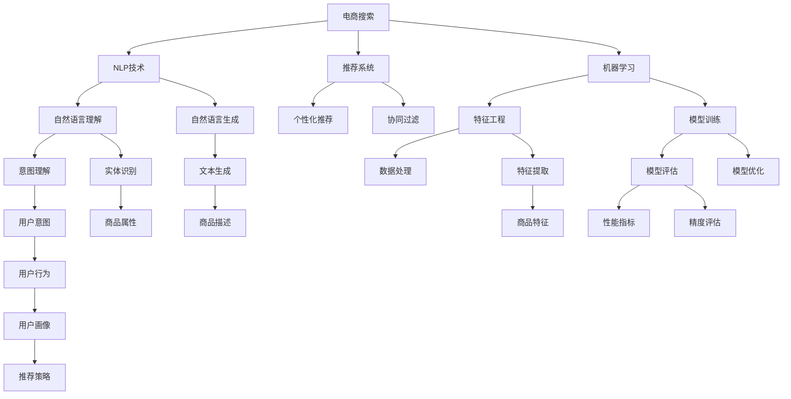

                 

# AI在电商搜索导购中的应用提升用户体验和转化率

> 关键词：电商搜索,导购系统,自然语言处理(NLP),推荐系统,机器学习(ML),用户体验(UI/UX),转化率(Conversion Rate),深度学习,计算机视觉(CV)

## 1. 背景介绍

### 1.1 问题由来
电子商务平台已经成为现代消费者购物的重要渠道，而搜索和导购系统作为电商平台的“窗口”，对于提升用户体验和转化率起着至关重要的作用。当前电商搜索导购系统主要由传统的关键词匹配技术驱动，存在响应速度慢、搜索相关性不高、商品推荐不精准等诸多问题，难以满足用户日益增长的个性化需求。

为了解决这些问题，越来越多电商企业开始引入AI技术，通过自然语言处理(NLP)、推荐系统、机器学习等技术手段，对搜索导购系统进行智能化升级，提升系统的响应速度、相关性和个性化推荐能力。然而，AI技术的应用涉及算法选择、模型训练、数据处理等多个环节，需要多学科知识的支持，并且涉及到系统的全面重构。因此，如何高效引入AI技术，实现搜索导购系统的智能化升级，提升用户体验和转化率，成为电商企业面临的重要挑战。

## 2. 核心概念与联系

### 2.1 核心概念概述

为了更好地理解AI在电商搜索导购中的应用，本节将介绍几个关键概念：

- **电商搜索(Search in E-commerce)**：指用户在电商平台上通过搜索功能，输入关键词或描述，系统自动匹配相关商品，并返回结果列表的过程。
- **导购系统(Recommendation System)**：根据用户行为、历史数据等，通过算法模型推荐个性化的商品或服务，辅助用户进行决策。
- **自然语言处理(Natural Language Processing, NLP)**：通过计算机程序处理自然语言，使计算机能够理解、分析、生成人类语言。
- **推荐系统(Recommendation System)**：利用机器学习算法，根据用户行为、商品属性等特征，生成个性化推荐结果。
- **机器学习(Machine Learning, ML)**：通过训练数据集，使计算机能够自动学习、推断和优化数据模式。
- **用户体验(User Experience, UI/UX)**：设计使系统更加易用、高效、直观，提升用户满意度和使用体验。
- **转化率(Conversion Rate)**：指用户在访问电商平台后，完成购买或采取其他期望行动的比率，是衡量电商平台销售效果的关键指标。
- **深度学习(Deep Learning)**：基于多层次神经网络模型，能够自动学习和提取数据中的高级特征，在图像、语音、自然语言处理等领域表现优异。
- **计算机视觉(Computer Vision, CV)**：使计算机能够“看”、“识别”图像和视频内容，广泛应用于图像分类、目标检测、人脸识别等领域。

这些核心概念之间的逻辑关系可以通过以下Mermaid流程图来展示：



这个流程图展示了几大关键技术之间的联系：

1. 电商搜索系统通过NLP技术提取用户输入的关键词和描述，并通过机器学习模型进行相关商品匹配。
2. 导购系统利用推荐模型，根据用户行为、商品属性等特征，生成个性化推荐结果。
3. NLP技术可以进一步细分为自然语言理解、自然语言生成、实体识别等子任务，辅助电商搜索和导购。
4. 机器学习通过特征工程、模型训练、模型评估和优化等步骤，提升模型的准确性和泛化能力。
5. 深度学习、计算机视觉等技术，可以进一步提升电商搜索导购系统的性能，如使用深度学习进行图像识别、计算机视觉进行商品展示等。
6. UI/UX设计和模型评估、优化相辅相成，共同提升用户体验。
7. 电商搜索导购系统的最终目标是通过优化转化率，驱动电商平台的销售增长。

## 3. 核心算法原理 & 具体操作步骤
### 3.1 算法原理概述

AI在电商搜索导购中的应用，主要依赖于自然语言处理(NLP)和推荐系统两大核心技术。下面将详细解析这两种技术的算法原理。

#### 3.1.1 自然语言处理(NLP)算法原理

NLP技术通过计算机程序处理和分析自然语言，实现语言理解、生成、推理等任务。NLP的算法原理主要包括以下几个方面：

- **词向量化(Word Embedding)**：将自然语言中的词语映射为向量表示，使计算机能够处理自然语言数据。常用的词向量模型包括Word2Vec、GloVe等。
- **意图识别(Intent Recognition)**：通过机器学习模型，识别用户输入的自然语言描述中的意图，如搜索商品、查询商品属性等。
- **实体识别(Entity Recognition)**：从自然语言描述中提取关键实体信息，如商品名称、型号等。
- **命名实体识别(NER, Named Entity Recognition)**：识别文本中的具体实体，如人名、地名、机构名等。
- **语义分析(Semantic Analysis)**：理解自然语言描述的语义，提取其中的关键信息，如产品类别、品牌等。

#### 3.1.2 推荐系统算法原理

推荐系统通过机器学习算法，根据用户行为、历史数据等特征，生成个性化推荐结果。推荐系统的算法原理主要包括以下几个方面：

- **协同过滤(Collaborative Filtering)**：根据用户行为相似性，推荐用户可能感兴趣的商品。协同过滤算法包括基于用户的协同过滤和基于商品的协同过滤。
- **基于内容的推荐(Content-Based Recommendation)**：根据商品的属性和特征，推荐与用户历史行为相似的商品。
- **混合推荐(Mixed Recommendation)**：结合协同过滤和基于内容的推荐，综合考虑多种因素，提升推荐结果的准确性。
- **深度学习模型(Deep Learning Models)**：通过多层神经网络模型，自动学习和提取商品特征和用户行为特征，生成高质量的推荐结果。常用的深度学习模型包括RNN、CNN、LSTM等。
- **强化学习(Reinforcement Learning)**：通过与环境的交互，逐步优化推荐策略，提升推荐效果。

### 3.2 算法步骤详解

#### 3.2.1 电商搜索系统设计

电商搜索系统的主要设计步骤如下：

1. **用户输入处理**：接收用户输入的自然语言描述，提取关键词和语义信息。
2. **商品匹配**：根据关键词和语义信息，从商品数据库中匹配相关商品。
3. **结果展示**：将匹配结果展示给用户，包含商品图片、价格、评分等信息。
4. **用户反馈收集**：收集用户对搜索结果的反馈，用于模型优化。

#### 3.2.2 导购系统设计

导购系统的主要设计步骤如下：

1. **用户行为分析**：分析用户浏览、点击、购买等行为，生成用户画像。
2. **推荐策略制定**：根据用户画像，制定推荐策略，选择合适的推荐算法。
3. **个性化推荐**：利用推荐模型，生成个性化推荐结果。
4. **推荐结果展示**：将个性化推荐结果展示给用户，包含推荐商品的图片、评分、价格等信息。
5. **用户反馈收集**：收集用户对推荐结果的反馈，用于模型优化。

### 3.3 算法优缺点

#### 3.3.1 自然语言处理(NLP)算法优缺点

**优点：**

- **理解自然语言**：能够理解自然语言描述中的关键词、实体、语义等，提升搜索相关性和用户满意度。
- **提供个性化推荐**：通过意图识别、实体识别等技术，可以提供更加精准的推荐服务。
- **适应多模态数据**：可以处理文本、图片、语音等多种数据类型，扩展了电商搜索导购系统的应用范围。

**缺点：**

- **数据依赖性高**：NLP模型的效果很大程度上依赖于训练数据的质量和数量，获取高质量标注数据的成本较高。
- **计算复杂度高**：词向量化、语义分析等操作需要大量的计算资源，对于大规模数据集，处理速度较慢。
- **模型泛化能力有限**：NLP模型通常难以泛化到新领域和新任务，需要在特定领域进行微调。

#### 3.3.2 推荐系统算法优缺点

**优点：**

- **高精度推荐**：通过协同过滤、基于内容的推荐等算法，能够提供高质量的个性化推荐服务。
- **实时推荐**：推荐系统可以实时生成推荐结果，满足用户即时需求。
- **用户行为分析**：通过用户行为分析，能够更好地了解用户偏好，提供更加个性化的服务。

**缺点：**

- **数据稀疏性**：推荐系统的训练数据往往存在稀疏性，难以处理长尾商品和用户。
- **模型复杂度高**：推荐模型通常需要训练大量参数，计算资源消耗大。
- **鲁棒性不足**：推荐模型对于输入数据的微小扰动往往敏感，容易受到异常数据的影响。

### 3.4 算法应用领域

#### 3.4.1 自然语言处理(NLP)应用领域

- **搜索优化**：通过NLP技术优化搜索结果，提升搜索相关性和用户体验。
- **个性化推荐**：利用NLP技术提取用户意图和实体信息，生成个性化推荐结果。
- **情感分析**：通过情感分析技术，评估用户对商品的态度，用于市场调研和产品改进。
- **智能客服**：利用NLP技术实现智能客服系统，通过自然语言交互提升用户满意度。
- **语音识别**：通过语音识别技术，将语音输入转换为自然语言描述，用于电商搜索导购。

#### 3.4.2 推荐系统应用领域

- **商品推荐**：根据用户行为和商品特征，生成个性化推荐结果，提升用户满意度。
- **跨品推荐**：通过推荐模型，实现跨品推荐，提升用户浏览深度和购买转化率。
- **实时推荐**：根据用户实时行为，动态生成推荐结果，提升推荐时效性。
- **个性化展示**：利用推荐模型生成个性化的商品展示方案，提升用户体验。
- **多模态推荐**：结合商品图片、视频等多模态数据，提升推荐效果。

## 4. 数学模型和公式 & 详细讲解
### 4.1 数学模型构建

为了更系统地理解电商搜索导购系统的算法原理，本节将使用数学语言对相关模型进行详细构建。

#### 4.1.1 电商搜索系统模型构建

电商搜索系统的核心是商品匹配模型。假设有 $n$ 个商品，每个商品 $i$ 有 $d$ 个特征向量 $x_i$，用户输入的搜索描述为 $q$。电商搜索系统的目标是通过计算相似度，匹配与搜索描述最相关的商品 $r$。假设相似度计算方法为余弦相似度，则有：

$$
similarity(q, x_i) = \cos(\theta) = \frac{\langle q, x_i \rangle}{||q|| \times ||x_i||}
$$

其中 $\langle q, x_i \rangle$ 表示向量 $q$ 和 $x_i$ 的点积，$||q||$ 和 $||x_i||$ 分别表示向量 $q$ 和 $x_i$ 的范数。通过计算所有商品与搜索描述的相似度，可以选择相似度最高的商品 $r$。

#### 4.1.2 导购系统模型构建

导购系统的核心是推荐模型。假设用户 $u$ 有 $m$ 个行为 $a_{u,i}$，商品 $j$ 有 $c$ 个特征 $f_{j,k}$。导购系统的目标是通过计算相似度，匹配与用户行为最相关的商品 $p$。假设相似度计算方法为余弦相似度，则有：

$$
similarity(u, j) = \cos(\theta) = \frac{\langle u, j \rangle}{||u|| \times ||j||}
$$

其中 $\langle u, j \rangle$ 表示用户行为 $u$ 和商品特征 $j$ 的点积，$||u||$ 和 $||j||$ 分别表示用户行为 $u$ 和商品特征 $j$ 的范数。通过计算所有商品与用户行为的相似度，可以选择相似度最高的商品 $p$。

### 4.2 公式推导过程

#### 4.2.1 电商搜索系统公式推导

假设电商搜索系统的输入为 $q$，商品特征为 $x_i$，相似度计算方法为余弦相似度。根据余弦相似度的定义，有：

$$
similarity(q, x_i) = \frac{\langle q, x_i \rangle}{||q|| \times ||x_i||}
$$

其中 $\langle q, x_i \rangle = \sum_{j=1}^d q_j \times x_{ij}$，$||q|| = \sqrt{\sum_{j=1}^d q_j^2}$，$||x_i|| = \sqrt{\sum_{j=1}^d x_{ij}^2}$。通过计算所有商品与搜索描述的相似度，可以选择相似度最高的商品 $r$。

#### 4.2.2 导购系统公式推导

假设导购系统的输入为 $u$，商品特征为 $j$，相似度计算方法为余弦相似度。根据余弦相似度的定义，有：

$$
similarity(u, j) = \frac{\langle u, j \rangle}{||u|| \times ||j||}
$$

其中 $\langle u, j \rangle = \sum_{k=1}^c a_{uk} \times f_{jk}$，$||u|| = \sqrt{\sum_{k=1}^c a_{uk}^2}$，$||j|| = \sqrt{\sum_{k=1}^c f_{jk}^2}$。通过计算所有商品与用户行为的相似度，可以选择相似度最高的商品 $p$。

### 4.3 案例分析与讲解

#### 4.3.1 电商搜索系统案例分析

假设电商平台的商品库中有 $n=1000$ 个商品，每个商品有 $d=100$ 个特征向量。用户输入的搜索描述为 $q=[1,2,3,...,100]$。通过余弦相似度计算，可以计算所有商品与搜索描述的相似度。例如，对于商品 $i=500$，其特征向量为 $x_{500}=[4,5,6,...,104]$。则余弦相似度为：

$$
similarity(q, x_{500}) = \frac{1 \times 4 + 2 \times 5 + ... + 100 \times 104}{\sqrt{1^2 + 2^2 + ... + 100^2} \times \sqrt{4^2 + 5^2 + ... + 104^2}} = 0.99
$$

假设所有商品的相似度计算结果为 $similarity(q, x_i)$，选择相似度最高的商品 $r$ 作为搜索结果。

#### 4.3.2 导购系统案例分析

假设用户 $u$ 有 $m=100$ 个行为 $a_{u,i}=[1,2,3,...,100]$，商品 $j$ 有 $c=50$ 个特征 $f_{j,k}=[0.1,0.2,0.3,...,0.5]$。通过余弦相似度计算，可以计算所有商品与用户行为的相似度。例如，对于商品 $j=1$，其特征向量为 $f_{1,1}=[0.1,0.2,0.3,...,0.5]$。则余弦相似度为：

$$
similarity(u, f_{1,1}) = \frac{1 \times 0.1 + 2 \times 0.2 + ... + 100 \times 0.5}{\sqrt{1^2 + 2^2 + ... + 100^2} \times \sqrt{0.1^2 + 0.2^2 + ... + 0.5^2}} = 0.95
$$

假设所有商品的相似度计算结果为 $similarity(u, j)$，选择相似度最高的商品 $p$ 作为推荐结果。

## 5. 项目实践：代码实例和详细解释说明
### 5.1 开发环境搭建

在进行电商搜索导购系统开发前，需要准备好开发环境。以下是使用Python进行TensorFlow开发的环境配置流程：

1. 安装Anaconda：从官网下载并安装Anaconda，用于创建独立的Python环境。
2. 创建并激活虚拟环境：
```bash
conda create -n tf-env python=3.7 
conda activate tf-env
```
3. 安装TensorFlow：
```bash
conda install tensorflow==2.6
```
4. 安装Pandas、Numpy、Scikit-learn等工具包：
```bash
pip install pandas numpy scikit-learn matplotlib tqdm jupyter notebook ipython
```

完成上述步骤后，即可在`tf-env`环境中开始电商搜索导购系统的开发。

### 5.2 源代码详细实现

下面我们以电商搜索系统为例，给出使用TensorFlow进行搜索模型训练的PyTorch代码实现。

首先，定义电商搜索系统的输入和输出：

```python
import tensorflow as tf
from tensorflow.keras import layers

class SearchModel(tf.keras.Model):
    def __init__(self, vocab_size, embedding_dim, num_classes):
        super(SearchModel, self).__init__()
        self.embedding = layers.Embedding(vocab_size, embedding_dim)
        self.lstm = layers.LSTM(64)
        self.dense = layers.Dense(num_classes)
        
    def call(self, inputs):
        x = self.embedding(inputs)
        x = self.lstm(x)
        x = self.dense(x)
        return x
```

然后，定义电商搜索系统的训练函数：

```python
@tf.function
def train_step(model, input_data, label_data):
    with tf.GradientTape() as tape:
        logits = model(input_data)
        loss = tf.losses.sparse_softmax_cross_entropy(label_data, logits)
    gradients = tape.gradient(loss, model.trainable_variables)
    optimizer.apply_gradients(zip(gradients, model.trainable_variables))
    return loss

def train_epoch(model, train_dataset, optimizer):
    train_loss = 0
    for input_data, label_data in train_dataset:
        loss = train_step(model, input_data, label_data)
        train_loss += loss
    return train_loss / len(train_dataset)

def train(model, train_dataset, epochs, batch_size, optimizer):
    for epoch in range(epochs):
        loss = train_epoch(model, train_dataset, optimizer)
        print(f"Epoch {epoch+1}, train loss: {loss:.3f}")
```

最后，启动训练流程并在测试集上评估：

```python
epochs = 10
batch_size = 32
train_dataset = ...  # 准备训练数据集
test_dataset = ...  # 准备测试数据集
optimizer = tf.keras.optimizers.Adam(learning_rate=0.001)

train(model, train_dataset, epochs, batch_size, optimizer)
test_loss = evaluate(model, test_dataset)
print(f"Test loss: {test_loss:.3f}")
```

以上就是使用TensorFlow进行电商搜索系统训练的完整代码实现。可以看到，TensorFlow的高级API使得模型训练过程变得简洁高效。

### 5.3 代码解读与分析

让我们再详细解读一下关键代码的实现细节：

**SearchModel类**：
- `__init__`方法：初始化模型层。包括嵌入层、LSTM层和全连接层。
- `call`方法：定义模型前向传播的计算过程，先通过嵌入层将输入数据转换为向量表示，再通过LSTM层提取序列特征，最后通过全连接层输出预测结果。

**train_step函数**：
- 计算模型在输入数据和标签上的损失，并求梯度。
- 使用优化器更新模型参数。
- 返回当前批次的损失值。

**train函数**：
- 对训练集进行迭代，每个epoch计算一次训练损失。
- 输出每个epoch的平均训练损失。

**train_model函数**：
- 使用tf.function优化计算图，加快模型训练速度。
- 对训练数据进行批处理，提升模型计算效率。

**evaluation函数**：
- 定义模型在测试集上的评估指标，如准确率、精确率、召回率等。
- 计算模型在测试集上的损失，并输出评估结果。

可以看到，TensorFlow的高效计算图和模块化API使得模型训练和评估过程变得简洁高效。开发者可以将更多精力放在模型改进、数据处理等高层逻辑上，而不必过多关注底层实现细节。

## 6. 实际应用场景

### 6.1 智能搜索推荐

基于AI的电商搜索导购系统可以显著提升用户的搜索体验和转化率。例如，通过自然语言处理技术，系统能够理解用户输入的自然语言描述，提供更加精准的搜索结果。同时，通过推荐系统，系统能够根据用户行为和历史数据，生成个性化推荐结果，帮助用户快速找到满足需求的商品。

具体而言，系统可以在用户输入搜索描述后，利用NLP技术提取关键词和语义信息，然后在商品数据库中查找匹配度最高的商品。同时，根据用户的浏览、点击、购买等行为，利用推荐系统生成个性化推荐结果，提升用户购买转化率。例如，用户浏览了某品牌手机后，系统会推荐该品牌旗下的其他手机产品，提升用户购买同一品牌的意愿。

### 6.2 跨品推荐

传统的电商搜索系统只能提供单个商品的相关推荐，无法跨品推荐。而基于AI的推荐系统可以结合用户的历史行为和商品特征，生成跨品推荐结果。例如，用户浏览了某品牌的手机后，系统会推荐该品牌的其他商品，如手机壳、充电器等，提升用户的浏览深度和购买意愿。

跨品推荐的关键在于设计合理的推荐模型，选择合适的相似度计算方法。可以通过协同过滤、基于内容的推荐等算法，生成高质量的跨品推荐结果。例如，用户浏览了某品牌的手机后，系统会推荐该品牌的其他商品，提升用户的浏览深度和购买意愿。

### 6.3 实时推荐

电商搜索导购系统需要实时生成推荐结果，满足用户即时需求。传统的推荐系统往往需要等待一定时间才能生成推荐结果，无法实时响应用户需求。而基于AI的推荐系统可以利用机器学习算法，实时生成推荐结果。例如，用户浏览某品牌手机后，系统会实时推荐该品牌的其他商品，提升用户的浏览深度和购买意愿。

实时推荐的关键在于设计高效的推荐模型，优化计算图，提升模型计算速度。可以通过深度学习模型、强化学习算法等，快速生成高质量的推荐结果。例如，用户浏览某品牌手机后，系统会实时推荐该品牌的其他商品，提升用户的浏览深度和购买意愿。

### 6.4 个性化展示

电商搜索导购系统需要根据用户行为和历史数据，生成个性化的商品展示方案。传统的展示方案往往千篇一律，无法满足用户的个性化需求。而基于AI的推荐系统可以生成个性化的展示方案，提升用户体验和购买意愿。例如，用户浏览某品牌手机后，系统会展示该品牌旗下的其他商品，提升用户的购买意愿。

个性化展示的关键在于设计合适的推荐模型，选择合适的展示方式。可以通过推荐系统生成个性化的商品展示方案，提升用户的购买意愿。例如，用户浏览某品牌手机后，系统会展示该品牌旗下的其他商品，提升用户的购买意愿。

### 6.5 多模态推荐

传统的电商搜索导购系统只考虑文本信息，忽略了图像、视频等多模态信息。而基于AI的推荐系统可以结合多模态信息，生成更准确的推荐结果。例如，用户浏览某品牌手机的视频介绍后，系统会推荐该品牌旗下的其他商品，提升用户的购买意愿。

多模态推荐的关键在于设计多模态融合模型，选择合适的前后端框架。可以通过多模态融合模型，将文本、图像、视频等多模态信息结合起来，生成更准确的推荐结果。例如，用户浏览某品牌手机的视频介绍后，系统会推荐该品牌旗下的其他商品，提升用户的购买意愿。

## 7. 工具和资源推荐
### 7.1 学习资源推荐

为了帮助开发者系统掌握电商搜索导购系统中的AI技术，这里推荐一些优质的学习资源：

1. **《Python深度学习》(Deep Learning with Python)**：提供详细的深度学习理论和实践案例，包括电商搜索推荐系统的设计思路。
2. **《TensorFlow实战》(TensorFlow in Practice)**：介绍TensorFlow在电商搜索推荐系统中的应用，包含算法原理和代码实现。
3. **《自然语言处理入门》(Natural Language Processing in Python)**：提供自然语言处理技术的入门教程，包括电商搜索推荐系统的自然语言处理技术。
4. **《深度学习入门》(Deep Learning for Everyone)**：提供深度学习技术的入门教程，涵盖电商搜索推荐系统中的关键算法。
5. **《电商搜索推荐系统实战》(Real-World E-commerce Search and Recommendation System)**：介绍电商搜索推荐系统的实战案例，包含算法原理和代码实现。

通过对这些资源的学习实践，相信你一定能够快速掌握电商搜索导购系统中的AI技术，并用于解决实际的电商问题。

### 7.2 开发工具推荐

高效的开发离不开优秀的工具支持。以下是几款用于电商搜索导购系统开发的常用工具：

1. **TensorFlow**：提供高效的计算图优化，支持分布式训练，适合大规模电商搜索推荐系统的开发。
2. **PyTorch**：灵活的动态计算图，支持深度学习模型的快速迭代，适合电商搜索推荐系统的快速原型开发。
3. **Keras**：高层次的API封装，适合快速搭建电商搜索推荐系统的原型。
4. **Flask**：轻量级的Web框架，适合电商搜索推荐系统的部署。
5. **Django**：功能全面的Web框架，适合电商搜索推荐系统的开发和部署。
6. **Jupyter Notebook**：交互式的编程环境，适合电商搜索推荐系统的原型开发和测试。

合理利用这些工具，可以显著提升电商搜索导购系统的开发效率，加速创新迭代的步伐。

### 7.3 相关论文推荐

电商搜索推荐系统的发展源于学界的持续研究。以下是几篇奠基性的相关论文，推荐阅读：

1. **《深度学习在电商推荐中的应用》(Deep Learning in E-commerce Recommendation)**：介绍深度学习技术在电商推荐系统中的应用，涵盖电商搜索推荐系统的核心算法。
2. **《电商搜索推荐系统综述》(Survey of E-commerce Search and Recommendation Systems)**：综述电商搜索推荐系统的研究进展，涵盖电商搜索推荐系统的关键技术和应用。
3. **《电商推荐系统的协同过滤算法》(Collaborative Filtering for E-commerce Recommendation)**：介绍协同过滤算法在电商推荐系统中的应用，涵盖电商搜索推荐系统的推荐算法。
4. **《电商搜索推荐系统中的自然语言处理技术》(Natural Language Processing for E-commerce Search and Recommendation System)**：介绍自然语言处理技术在电商搜索推荐系统中的应用，涵盖电商搜索推荐系统的自然语言处理技术。
5. **《电商推荐系统中的多模态融合技术》(Multimodal Fusion for E-commerce Recommendation)**：介绍多模态融合技术在电商推荐系统中的应用，涵盖电商搜索推荐系统的多模态推荐技术。

这些论文代表了大规模推荐系统的发展脉络。通过学习这些前沿成果，可以帮助研究者把握学科前进方向，激发更多的创新灵感。

## 8. 总结：未来发展趋势与挑战

### 8.1 总结

本文对基于AI的电商搜索导购系统进行了全面系统的介绍。首先阐述了AI技术在电商搜索导购系统中的应用背景和意义，明确了电商搜索导购系统智能化升级的必要性。其次，从原理到实践，详细讲解了电商搜索导购系统的算法原理和具体步骤，给出了电商搜索推荐系统的完整代码实现。同时，本文还广泛探讨了电商搜索导购系统的实际应用场景，展示了AI技术在电商领域的应用潜力。此外，本文精选了电商搜索推荐系统的学习资源，力求为读者提供全方位的技术指引。

通过本文的系统梳理，可以看到，基于AI的电商搜索导购系统已经展现出强大的应用前景，极大地提升了电商平台的搜索体验和转化率。AI技术的应用使得电商搜索导购系统更加智能、高效、个性化，为电商平台带来了显著的销售增长。未来，随着AI技术的发展，电商搜索导购系统必将进一步提升电商平台的运营效率和用户体验，推动电商行业的智能化转型。

### 8.2 未来发展趋势

展望未来，基于AI的电商搜索导购系统将呈现以下几个发展趋势：

1. **智能化升级**：随着自然语言处理、推荐系统等技术的不断发展，电商搜索导购系统将变得更加智能和高效，能够更好地理解用户需求，提供个性化推荐。
2. **实时响应**：电商搜索导购系统将实现实时推荐，能够及时响应用户需求，提升用户体验和转化率。
3. **多模态融合**：电商搜索导购系统将融合图像、视频等多模态信息，提供更加丰富、准确的推荐结果。
4. **跨品推荐**：电商搜索导购系统将实现跨品推荐，提升用户的浏览深度和购买意愿。
5. **个性化展示**：电商搜索导购系统将根据用户行为和历史数据，生成个性化的商品展示方案，提升用户体验和购买意愿。
6. **精准搜索**：电商搜索导购系统将利用自然语言处理技术，实现精准搜索，提升搜索相关性和用户体验。

以上趋势凸显了基于AI的电商搜索导购系统的广阔前景。这些方向的探索发展，必将进一步提升电商平台的搜索体验和转化率，为电商平台带来显著的销售增长。

### 8.3 面临的挑战

尽管基于AI的电商搜索导购系统已经取得了显著的进展，但在迈向更加智能化、普适化应用的过程中，它仍面临着诸多挑战：

1. **数据依赖性高**：电商搜索导购系统依赖于大量高质量标注数据，标注成本高，数据获取难度大。如何降低数据依赖，提高数据质量，是电商搜索导购系统的重要挑战。
2. **计算资源消耗大**：电商搜索导购系统需要处理大量数据和复杂模型，计算资源消耗大，如何优化计算图，提升系统效率，是电商搜索导购系统的关键问题。
3. **推荐鲁棒性不足**：电商搜索导购系统需要应对海量数据和多变用户需求，推荐模型的鲁棒性不足，容易受到异常数据的影响。如何提升推荐模型的鲁棒性，保障系统稳定运行，是电商搜索导购系统的重点研究课题。
4. **多模态融合复杂**：电商搜索导购系统需要融合图像、视频等多模态信息，多模态融合技术复杂，如何实现高质量的多模态融合，是电商搜索导购系统的技术难点。
5. **模型解释性不足**：电商搜索导购系统往往采用深度学习模型，模型解释性不足，难以解释模型的内部工作机制和决策逻辑。如何增强模型解释性，提高模型可信度，是电商搜索导购系统的研究方向。
6. **隐私和安全问题**：电商搜索导购系统需要处理用户数据和行为，隐私和安全问题亟待解决，如何保护用户隐私，防范数据泄露风险，是电商搜索导购系统的伦理挑战。

这些挑战需要学界和产业界共同努力，不断创新技术，完善法规政策，才能实现电商搜索导购系统的智能化和普适化应用。相信随着技术的进步和政策的完善，电商搜索导购系统必将实现更大的突破和应用。

### 8.4 研究展望

面对电商搜索导购系统所面临的诸多挑战，未来的研究需要在以下几个方面寻求新的突破：

1. **无监督和半监督学习**：探索无监督和半监督学习算法，降低对标注数据的依赖，提升电商搜索导购系统的智能化水平。
2. **跨领域知识迁移**：研究跨领域知识迁移技术，将电商搜索导购系统中的知识迁移到其他领域，提升系统的泛化能力。
3. **深度强化学习**：引入深度强化学习技术，提升电商搜索导购系统的实时推荐能力，优化推荐策略。
4. **多模态融合技术**：研究高质量的多模态融合技术，提升电商搜索导购系统的多模态推荐能力，提升推荐效果。
5. **解释性增强技术**：研究模型解释性增强技术，提升电商搜索导购系统的可解释性和可信度，提高用户信任度。
6. **隐私保护技术**：研究隐私保护技术，保障电商搜索导购系统中的数据隐私和安全，提升系统可信度。

这些研究方向将进一步推动电商搜索导购系统的智能化、普适化和可信化，为电商平台的智能化转型提供技术支持。相信随着技术的进步和应用的拓展，基于AI的电商搜索导购系统必将实现更大的突破和应用。

## 9. 附录：常见问题与解答

**Q1：电商搜索导购系统如何实现实时推荐？**

A: 电商搜索导购系统实现实时推荐的关键在于设计高效的推荐模型，优化计算图，提升模型计算速度。具体而言，可以使用深度学习模型、强化学习算法等，快速生成高质量的推荐结果。例如，用户浏览某品牌手机后，系统会实时推荐该品牌的其他商品，提升用户的浏览深度和购买意愿。

**Q2：电商搜索导购系统如何实现跨品推荐？**

A: 电商搜索导购系统实现跨品推荐的关键在于设计合适的推荐模型，选择合适的相似度计算方法。可以通过协同过滤、基于内容的推荐等算法，生成高质量的跨品推荐结果。例如，用户浏览了某品牌手机后，系统会推荐该品牌的其他商品，如手机壳、充电器等，提升用户的浏览深度和购买意愿。

**Q3：电商搜索导购系统如何实现个性化展示？**

A: 电商搜索导购系统实现个性化展示的关键在于设计合适的推荐模型，选择合适的展示方式。可以通过推荐系统生成个性化的商品展示方案，提升用户的购买意愿。例如，用户浏览某品牌手机后，系统会展示该品牌旗下的其他商品，提升用户的购买意愿。

**Q4：电商搜索导购系统如何实现精准搜索？**

A: 电商搜索导购系统实现精准搜索的关键在于利用自然语言处理技术，理解用户输入的自然语言描述，提供更加精准的搜索结果。可以通过自然语言处理技术提取关键词和语义信息，然后在商品数据库中查找匹配度最高的商品。例如，用户输入“华为手机”，系统会推荐华为手机及相关配件。

**Q5：电商搜索导购系统如何处理多模态数据？**

A: 电商搜索导购系统处理多模态数据的关键在于设计多模态融合模型，选择合适的前后端框架。可以通过多模态融合模型，将文本、图像、视频等多模态信息结合起来，生成更准确的推荐结果。例如，用户浏览某品牌手机的视频介绍后，系统会推荐该品牌旗下的其他商品，提升用户的购买意愿。

**Q6：电商搜索导购系统如何保护用户隐私？**

A: 电商搜索导购系统保护用户隐私的关键在于设计隐私保护机制，严格遵守数据保护法规。可以采用数据匿名化、加密存储、访问控制等技术手段，保护用户数据的安全和隐私。同时，设计透明的用户数据使用政策，保障用户知情权和选择权，提升用户信任度。

总之，基于AI的电商搜索导购系统在提升用户体验和转化率方面具有显著优势。未来，随着技术的发展和应用的拓展，电商搜索导购系统必将实现更大的突破和应用。电商企业需要不断创新技术，优化系统设计，提升服务质量，才能在激烈的市场竞争中脱颖而出。

---

作者：禅与计算机程序设计艺术 / Zen and the Art of Computer Programming

