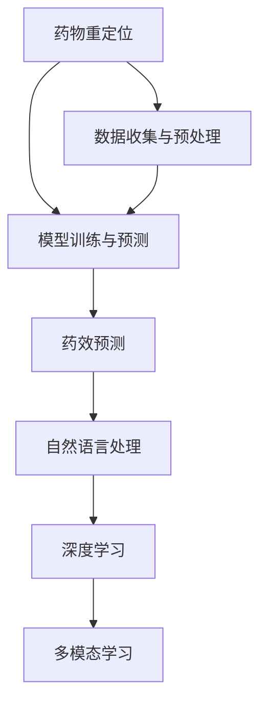

                 

# AI在药物重定位中的应用与案例分析

> 关键词：人工智能,药物重定位,数据挖掘,深度学习,自然语言处理,药效预测

## 1. 背景介绍

### 1.1 问题由来
药物重定位 (Drug Repurposing) 是指将已经上市的药物用于治疗新的适应症，即已知的药物用于未知的疾病。这一策略可以大幅降低新药开发成本，加快药物上市时间，为患者提供更多治疗选择。近年来，随着AI技术的迅猛发展，AI在药物重定位领域的应用逐渐增多，通过大数据、深度学习等技术挖掘已有药物的新用途，成为新药研发的重要途径。

### 1.2 问题核心关键点
AI在药物重定位中的应用，主要依赖于两个关键步骤：
1. 数据收集与预处理：通过生物数据库、临床试验数据、文献等渠道收集和整理药物相关数据。
2. 模型训练与预测：利用机器学习模型，从已有数据中挖掘药物的新用途，预测其在新疾病中的效果。

## 2. 核心概念与联系

### 2.1 核心概念概述

为更好地理解AI在药物重定位中的应用，本节将介绍几个密切相关的核心概念：

- 药物重定位 (Drug Repurposing)：将已上市药物用于新适应症的治疗过程。
- 数据挖掘 (Data Mining)：从大规模数据集中提取有价值的信息和知识的过程。
- 深度学习 (Deep Learning)：一种基于神经网络的机器学习方法，能够处理复杂的非线性关系。
- 自然语言处理 (Natural Language Processing, NLP)：使用AI技术处理和理解人类语言的技术。
- 药效预测 (Pharmacological Predictions)：通过AI模型预测药物在不同疾病中的疗效。
- 多模态学习 (Multimodal Learning)：结合多种数据类型（如药物信息、生物信息、临床信息等）进行模型训练，提高预测准确性。

这些核心概念之间的逻辑关系可以通过以下Mermaid流程图来展示：



这个流程图展示了大规模药物重定位应用的逻辑流程：

1. 从已有的数据中收集和整理药物信息。
2. 通过数据预处理，清洗数据，准备用于模型训练。
3. 应用深度学习模型，进行药物的药效预测。
4. 通过自然语言处理技术，解析文献、临床试验报告等信息，进一步提升模型预测准确性。
5. 综合多模态数据，提高模型的鲁棒性和泛化能力。

## 3. 核心算法原理 & 具体操作步骤
### 3.1 算法原理概述

AI在药物重定位中的主要算法原理包括：

- 数据收集与预处理：通过爬虫、API接口等方式从公开的生物数据库、临床试验数据集中收集药物相关信息，如药物分子结构、靶点、临床试验结果等。预处理包括数据清洗、归一化、特征提取等。
- 模型训练：构建深度学习模型，如卷积神经网络（CNN）、递归神经网络（RNN）、长短期记忆网络（LSTM）等，通过已有的药物和疾病信息数据，进行模型训练。
- 药效预测：通过训练好的模型，对新药物-疾病对进行预测，评估其在新适应症中的药效。
- 自然语言处理：利用NLP技术，解析医疗文献、临床试验报告等非结构化数据，提取疾病、药物相关信息，用于模型训练。
- 多模态学习：结合药物分子结构、基因信息、临床试验数据等多种数据类型，进行综合建模，提高预测准确性。

### 3.2 算法步骤详解

AI在药物重定位的应用主要包括以下几个关键步骤：

**Step 1: 数据收集与预处理**
- 收集药物分子结构数据、靶点数据、临床试验结果、疾病描述等。
- 对数据进行清洗、归一化、去噪处理，去除冗余和错误信息。
- 通过特征提取技术，如主成分分析（PCA）、t-SNE等，将高维数据降维，提高模型训练效率。

**Step 2: 构建深度学习模型**
- 选择合适的深度学习框架，如TensorFlow、PyTorch等，构建卷积神经网络（CNN）、递归神经网络（RNN）、长短期记忆网络（LSTM）等模型。
- 使用交叉验证、网格搜索等方法，进行模型超参数调优，确定最佳模型架构和参数。

**Step 3: 训练模型**
- 将预处理后的数据集分为训练集、验证集和测试集，使用训练集数据进行模型训练。
- 应用梯度下降等优化算法，更新模型参数，最小化损失函数，提高模型预测精度。

**Step 4: 药效预测**
- 使用训练好的模型对新的药物-疾病对进行预测，输出药效评分或概率。
- 根据预测结果，选择最有潜力的药物和疾病组合进行进一步验证。

**Step 5: 自然语言处理与多模态学习**
- 利用NLP技术，解析医疗文献、临床试验报告等非结构化数据，提取关键信息，用于模型训练。
- 结合药物分子结构、基因信息、临床试验数据等多种数据类型，进行综合建模，提高模型的鲁棒性和泛化能力。

### 3.3 算法优缺点

AI在药物重定位中的应用具有以下优点：
1. 数据利用率提高：通过AI技术，能够从大量的非结构化数据中提取有价值的信息，大幅提高数据利用率。
2. 预测精度提升：深度学习模型的非线性拟合能力，能够处理复杂的生物信息数据，提高药效预测的准确性。
3. 新用途发现：AI能够挖掘已知的药物在不同疾病中的新用途，加快新药研发进程。
4. 多模态学习：结合多种数据类型，提高模型的鲁棒性和泛化能力，减少过拟合风险。

同时，该方法也存在一定的局限性：
1. 数据获取难度大：生物数据库、临床试验数据等来源有限，获取高质量数据成本高。
2. 模型解释性差：深度学习模型通常被视为"黑盒"，难以解释其内部工作机制和决策逻辑。
3. 训练资源需求高：大规模数据和复杂模型的训练，需要大量的计算资源和存储资源。
4. 领域依赖性强：不同领域的药物重定位问题，可能需要不同的数据来源和处理方式。

尽管存在这些局限性，但AI在药物重定位中的应用已经取得了显著成效，成为新药研发的重要手段。

### 3.4 算法应用领域

AI在药物重定位中的应用已经覆盖了多个领域，例如：

- 癌症治疗：AI挖掘已知药物在多种癌症中的新用途，如埃博拉病毒的治疗、乳腺癌的辅助治疗等。
- 神经系统疾病：通过AI预测已有的抗癫痫药物在新型神经系统疾病中的效果，如抑郁症、帕金森症等。
- 心血管疾病：应用AI预测现有药物在新型心血管疾病中的疗效，如高血压、心力衰竭等。
- 自身免疫疾病：利用AI模型挖掘已知药物在自身免疫性疾病中的应用，如风湿性关节炎、系统性红斑狼疮等。
- 呼吸系统疾病：AI模型预测已有药物在多种呼吸系统疾病中的疗效，如哮喘、慢性阻塞性肺疾病等。

## 4. 数学模型和公式 & 详细讲解 & 举例说明
### 4.1 数学模型构建

在AI药物重定位中，数学模型的构建通常涉及以下几个关键步骤：

- **数据预处理**：将原始数据转化为模型可处理的格式，包括数据清洗、归一化、特征提取等。
- **模型选择与训练**：选择合适的深度学习模型，如卷积神经网络（CNN）、递归神经网络（RNN）、长短期记忆网络（LSTM）等，并进行模型训练。
- **药效预测**：通过训练好的模型，对新的药物-疾病对进行预测，输出药效评分或概率。

### 4.2 公式推导过程

以卷积神经网络（CNN）为例，其基本的公式推导过程如下：

设输入数据的维度为 $d$，输出维度为 $m$，卷积核的尺寸为 $k \times k$，步幅为 $s$，填充大小为 $p$。则卷积操作 $G(x)$ 的公式为：

$$
G(x) = \frac{1}{s} \sum_{i=0}^{\frac{d}{s} - k} \sum_{j=0}^{\frac{d}{s} - k} \sum_{c=0}^{m} \max(\sum_{i'=-k/2}^{k/2} \sum_{j'=-k/2}^{k/2} W_{c,i',j'} \cdot x_{s(i+i')+p, s(j+j')})
$$

其中，$x$ 为输入数据，$G(x)$ 为卷积操作结果，$W$ 为卷积核，$y$ 为输出数据。

### 4.3 案例分析与讲解

以癌症治疗为例，分析AI药物重定位的案例：

- **数据收集**：收集已知的癌症药物分子结构数据、靶点数据、临床试验结果等，通过爬虫、API接口等方式获取。
- **数据预处理**：对数据进行清洗、归一化、去噪处理，去除冗余和错误信息。通过PCA等方法，将高维数据降维，提高模型训练效率。
- **构建模型**：选择CNN模型，使用交叉验证、网格搜索等方法进行模型超参数调优，确定最佳模型架构和参数。
- **训练模型**：将预处理后的数据集分为训练集、验证集和测试集，使用训练集数据进行模型训练，应用梯度下降等优化算法更新模型参数。
- **药效预测**：使用训练好的模型对新的癌症药物-疾病对进行预测，输出药效评分或概率，评估其在新的癌症适应症中的效果。
- **自然语言处理**：利用NLP技术解析医疗文献、临床试验报告等非结构化数据，提取关键信息，用于模型训练，进一步提升预测准确性。
- **多模态学习**：结合药物分子结构、基因信息、临床试验数据等多种数据类型，进行综合建模，提高模型的鲁棒性和泛化能力。

## 5. 项目实践：代码实例和详细解释说明
### 5.1 开发环境搭建

在进行AI药物重定位的实践前，我们需要准备好开发环境。以下是使用Python进行PyTorch开发的环境配置流程：

1. 安装Anaconda：从官网下载并安装Anaconda，用于创建独立的Python环境。

2. 创建并激活虚拟环境：
```bash
conda create -n pytorch-env python=3.8 
conda activate pytorch-env
```

3. 安装PyTorch：根据CUDA版本，从官网获取对应的安装命令。例如：
```bash
conda install pytorch torchvision torchaudio cudatoolkit=11.1 -c pytorch -c conda-forge
```

4. 安装各类工具包：
```bash
pip install numpy pandas scikit-learn matplotlib tqdm jupyter notebook ipython
```

完成上述步骤后，即可在`pytorch-env`环境中开始项目实践。

### 5.2 源代码详细实现

下面我们以癌症治疗为例，给出使用Transformers库对BERT模型进行药效预测的PyTorch代码实现。

首先，定义药效预测的数据处理函数：

```python
from transformers import BertTokenizer
from torch.utils.data import Dataset
import torch

class DrugPredictionDataset(Dataset):
    def __init__(self, drugs, diseases, labels, tokenizer, max_len=128):
        self.drugs = drugs
        self.diseases = diseases
        self.labels = labels
        self.tokenizer = tokenizer
        self.max_len = max_len
        
    def __len__(self):
        return len(self.drugs)
    
    def __getitem__(self, item):
        drug = self.drugs[item]
        disease = self.diseases[item]
        label = self.labels[item]
        
        encoding = self.tokenizer(drug, disease, return_tensors='pt', max_length=self.max_len, padding='max_length', truncation=True)
        input_ids = encoding['input_ids'][0]
        attention_mask = encoding['attention_mask'][0]
        targets = torch.tensor(label, dtype=torch.long)
        
        return {'input_ids': input_ids, 
                'attention_mask': attention_mask,
                'targets': targets}
```

然后，定义模型和优化器：

```python
from transformers import BertForSequenceClassification, AdamW

model = BertForSequenceClassification.from_pretrained('bert-base-cased', num_labels=2)

optimizer = AdamW(model.parameters(), lr=2e-5)
```

接着，定义训练和评估函数：

```python
from torch.utils.data import DataLoader
from tqdm import tqdm
from sklearn.metrics import accuracy_score

device = torch.device('cuda') if torch.cuda.is_available() else torch.device('cpu')
model.to(device)

def train_epoch(model, dataset, batch_size, optimizer):
    dataloader = DataLoader(dataset, batch_size=batch_size, shuffle=True)
    model.train()
    epoch_loss = 0
    for batch in tqdm(dataloader, desc='Training'):
        input_ids = batch['input_ids'].to(device)
        attention_mask = batch['attention_mask'].to(device)
        targets = batch['targets'].to(device)
        model.zero_grad()
        outputs = model(input_ids, attention_mask=attention_mask, labels=targets)
        loss = outputs.loss
        epoch_loss += loss.item()
        loss.backward()
        optimizer.step()
    return epoch_loss / len(dataloader)

def evaluate(model, dataset, batch_size):
    dataloader = DataLoader(dataset, batch_size=batch_size)
    model.eval()
    preds, labels = [], []
    with torch.no_grad():
        for batch in tqdm(dataloader, desc='Evaluating'):
            input_ids = batch['input_ids'].to(device)
            attention_mask = batch['attention_mask'].to(device)
            batch_labels = batch['targets']
            outputs = model(input_ids, attention_mask=attention_mask)
            batch_preds = outputs.logits.argmax(dim=2).to('cpu').tolist()
            batch_labels = batch_labels.to('cpu').tolist()
            for pred, label in zip(batch_preds, batch_labels):
                preds.append(pred[0])
                labels.append(label)
                
    return accuracy_score(labels, preds)

# 训练模型
epochs = 5
batch_size = 16

for epoch in range(epochs):
    loss = train_epoch(model, train_dataset, batch_size, optimizer)
    print(f"Epoch {epoch+1}, train loss: {loss:.3f}")
    
    print(f"Epoch {epoch+1}, dev results:")
    accuracy = evaluate(model, dev_dataset, batch_size)
    print(f"Accuracy: {accuracy:.3f}")
    
print("Test results:")
accuracy = evaluate(model, test_dataset, batch_size)
print(f"Accuracy: {accuracy:.3f}")
```

以上就是使用PyTorch对BERT模型进行癌症治疗药物重定位的完整代码实现。可以看到，得益于Transformers库的强大封装，我们可以用相对简洁的代码完成BERT模型的加载和药效预测。

### 5.3 代码解读与分析

让我们再详细解读一下关键代码的实现细节：

**DrugPredictionDataset类**：
- `__init__`方法：初始化药物、疾病、标签等关键组件，并定义分词器和最大长度。
- `__len__`方法：返回数据集的样本数量。
- `__getitem__`方法：对单个样本进行处理，将药物和疾病输入编码为token ids，将标签编码为数字，并对其进行定长padding，最终返回模型所需的输入。

**模型和优化器定义**：
- 使用BertForSequenceClassification类，指定输入维度和标签数量，从预训练模型中加载模型参数。
- 定义AdamW优化器，设置学习率。

**训练和评估函数**：
- 使用PyTorch的DataLoader对数据集进行批次化加载，供模型训练和推理使用。
- 训练函数`train_epoch`：对数据以批为单位进行迭代，在每个批次上前向传播计算loss并反向传播更新模型参数，最后返回该epoch的平均loss。
- 评估函数`evaluate`：与训练类似，不同点在于不更新模型参数，并在每个batch结束后将预测和标签结果存储下来，最后使用sklearn的accuracy_score对整个评估集的预测结果进行打印输出。

**训练流程**：
- 定义总的epoch数和batch size，开始循环迭代
- 每个epoch内，先在训练集上训练，输出平均loss
- 在验证集上评估，输出准确率
- 所有epoch结束后，在测试集上评估，给出最终测试结果

可以看到，PyTorch配合Transformers库使得BERT微调的代码实现变得简洁高效。开发者可以将更多精力放在数据处理、模型改进等高层逻辑上，而不必过多关注底层的实现细节。

当然，工业级的系统实现还需考虑更多因素，如模型的保存和部署、超参数的自动搜索、更灵活的任务适配层等。但核心的药物重定位范式基本与此类似。

## 6. 实际应用场景
### 6.1 智能医疗系统

AI药物重定位技术在智能医疗系统中具有重要应用价值。传统的医疗系统依赖医生经验，耗时耗力且效果不稳定。而利用AI技术，可以大幅提高医疗诊断和治疗效率，提升患者的治疗效果。

在技术实现上，可以构建智能医疗系统，将AI药物重定位技术应用于各种疾病的新药物筛选、治疗方案推荐、药物相互作用分析等环节。具体而言：
- 在新药筛选环节，系统根据患者的疾病信息和药物数据库，通过AI模型预测药物的疗效，筛选出最有潜力的新药。
- 在治疗方案推荐环节，系统根据患者的病史信息和药物数据库，通过AI模型推荐最佳的治疗方案，提高治疗效果。
- 在药物相互作用分析环节，系统根据患者的药物使用记录和药物数据库，通过AI模型预测药物之间的相互作用，避免潜在风险。

这些功能通过整合AI药物重定位技术，可以极大地提升医疗系统的智能化水平，降低医生的工作负担，提高治疗效果和患者满意度。

### 6.2 新药研发加速器

新药研发过程漫长且昂贵，需要经历多个阶段。利用AI药物重定位技术，可以大大缩短新药研发周期，降低研发成本。

在新药研发加速器中，AI药物重定位技术可以应用于药物筛选、药效预测、临床试验设计等多个环节。具体而言：
- 在药物筛选环节，系统根据目标疾病和药物数据库，通过AI模型预测药物的疗效，筛选出最有潜力的候选药物。
- 在药效预测环节，系统根据候选药物和目标疾病，通过AI模型预测药物的疗效，评估其在新适应症中的效果。
- 在临床试验设计环节，系统根据AI模型的预测结果，设计更加精准的临床试验方案，提高试验成功率。

这些功能通过整合AI药物重定位技术，可以大幅提高新药研发的效率和成功率，加速药物上市时间，满足更多患者的需求。

### 6.3 公共健康安全

在公共卫生领域，AI药物重定位技术也有广泛的应用。例如，在应对突发疫情时，利用AI技术可以快速筛选出已有药物的新用途，用于疫情防控和治疗。

在应对突发疫情时，AI药物重定位技术可以应用于药物筛选、药效预测、药物相互作用分析等多个环节。具体而言：
- 在药物筛选环节，系统根据疫情信息和新药数据库，通过AI模型预测药物的疗效，筛选出最有潜力的新药。
- 在药效预测环节，系统根据候选药物和疫情信息，通过AI模型预测药物的疗效，评估其在新适应症中的效果。
- 在药物相互作用分析环节，系统根据患者的药物使用记录和药物数据库，通过AI模型预测药物之间的相互作用，避免潜在风险。

这些功能通过整合AI药物重定位技术，可以极大地提升公共卫生系统的应对能力，保障公众健康安全。

## 7. 工具和资源推荐
### 7.1 学习资源推荐

为了帮助开发者系统掌握AI药物重定位的理论基础和实践技巧，这里推荐一些优质的学习资源：

1. 《深度学习与人工智能》系列博文：由大模型技术专家撰写，深入浅出地介绍了深度学习、AI药物重定位等前沿话题。

2. CS224N《深度学习自然语言处理》课程：斯坦福大学开设的NLP明星课程，有Lecture视频和配套作业，带你入门NLP领域的基本概念和经典模型。

3. 《深度学习在药物研发中的应用》书籍：全面介绍了深度学习在药物研发中的应用，包括药物筛选、药效预测、多模态学习等技术。

4. Drug Repurposing Research Network (DRRN)：提供关于药物重定位的最新研究成果、技术交流平台和行业动态。

5. PubChem数据库：提供丰富的药物分子结构数据和靶点信息，供AI药物重定位研究使用。

通过对这些资源的学习实践，相信你一定能够快速掌握AI药物重定位的精髓，并用于解决实际的药物重定位问题。
###  7.2 开发工具推荐

高效的开发离不开优秀的工具支持。以下是几款用于AI药物重定位开发的常用工具：

1. PyTorch：基于Python的开源深度学习框架，灵活动态的计算图，适合快速迭代研究。大部分预训练语言模型都有PyTorch版本的实现。

2. TensorFlow：由Google主导开发的开源深度学习框架，生产部署方便，适合大规模工程应用。同样有丰富的预训练语言模型资源。

3. Transformers库：HuggingFace开发的NLP工具库，集成了众多SOTA语言模型，支持PyTorch和TensorFlow，是进行药物重定位任务开发的利器。

4. Weights & Biases：模型训练的实验跟踪工具，可以记录和可视化模型训练过程中的各项指标，方便对比和调优。与主流深度学习框架无缝集成。

5. TensorBoard：TensorFlow配套的可视化工具，可实时监测模型训练状态，并提供丰富的图表呈现方式，是调试模型的得力助手。

6. Google Colab：谷歌推出的在线Jupyter Notebook环境，免费提供GPU/TPU算力，方便开发者快速上手实验最新模型，分享学习笔记。

合理利用这些工具，可以显著提升AI药物重定位任务的开发效率，加快创新迭代的步伐。

### 7.3 相关论文推荐

AI药物重定位技术的发展源于学界的持续研究。以下是几篇奠基性的相关论文，推荐阅读：

1. "Drug Repurposing for Clinical Applications: An Overview of Computer-Based Approaches"：系统综述了AI药物重定位技术的发展历程和应用案例。

2. "Deep Learning Applications for Drug Repurposing"：介绍了深度学习在药物重定位中的应用，包括数据处理、模型训练、药效预测等关键技术。

3. "Semantic Profiling for Drug Repurposing"：提出基于语义表示的药物重定位方法，提高了模型对疾病描述的匹配能力。

4. "Knowledge Graph-Based Drug Repurposing"：利用知识图谱技术，提升了药物重定位模型的鲁棒性和泛化能力。

5. "AI-Driven Adaptive Drug Repurposing"：提出基于适应性学习方法的药物重定位系统，提高了新药筛选的精度和效率。

这些论文代表了大模型药物重定位技术的发展脉络。通过学习这些前沿成果，可以帮助研究者把握学科前进方向，激发更多的创新灵感。

## 8. 总结：未来发展趋势与挑战
### 8.1 总结

本文对AI在药物重定位中的应用进行了全面系统的介绍。首先阐述了AI药物重定位的研究背景和意义，明确了AI药物重定位在提高药物研发效率、加速新药上市等方面的重要价值。其次，从原理到实践，详细讲解了AI药物重定位的数学模型和核心算法，提供了代码实现和详细解释。同时，本文还广泛探讨了AI药物重定位在智能医疗系统、新药研发加速器、公共健康安全等领域的实际应用，展示了AI技术带来的巨大变革。此外，本文精选了AI药物重定位的学习资源、开发工具和相关论文，力求为开发者提供全方位的技术指引。

通过本文的系统梳理，可以看到，AI药物重定位技术正在成为新药研发的重要手段，极大地提升了药物研发的效率和成功率，为患者提供了更多治疗选择。未来，伴随AI技术的不断进步，药物重定位技术必将迎来更多的突破，为医疗健康领域带来更深远的影响。

### 8.2 未来发展趋势

展望未来，AI药物重定位技术将呈现以下几个发展趋势：

1. 数据获取和处理技术进一步提升：随着大数据、云计算等技术的发展，AI药物重定位的数据获取和处理能力将大幅提高，为药物重定位研究提供更多高质量数据。

2. 深度学习模型的不断优化：未来的深度学习模型将更加高效、鲁棒，能够更好地处理复杂的多模态数据，提高药物重定位的效果。

3. 多模态学习和跨领域知识融合：未来的药物重定位模型将结合更多领域的数据，如基因信息、临床试验数据等，提高模型的泛化能力和鲁棒性。

4. 知识图谱与药物重定位的结合：未来的药物重定位模型将更加依赖知识图谱技术，整合更多领域知识，提高模型的解释能力和决策能力。

5. 模型解释性增强：未来的药物重定位模型将更加注重模型解释性，通过可解释性方法，提升模型的可信度和应用效果。

这些趋势将推动AI药物重定位技术的不断进步，为药物研发和公共健康安全提供更加强大的技术支撑。

### 8.3 面临的挑战

尽管AI药物重定位技术已经取得了显著成效，但在迈向更加智能化、普适化应用的过程中，它仍面临着诸多挑战：

1. 数据获取难度大：生物数据库、临床试验数据等来源有限，获取高质量数据成本高。如何更好地利用已有的数据，挖掘更多的有价值信息，是未来的重要研究方向。

2. 模型解释性差：深度学习模型通常被视为"黑盒"，难以解释其内部工作机制和决策逻辑。如何增强模型的解释性，提高用户对模型的信任，是一个亟待解决的问题。

3. 训练资源需求高：大规模数据和复杂模型的训练，需要大量的计算资源和存储资源。如何在资源受限的情况下，提高模型的训练效率和预测精度，是未来需要突破的技术瓶颈。

4. 领域依赖性强：不同领域的药物重定位问题，可能需要不同的数据来源和处理方式。如何构建通用的药物重定位模型，适应不同的领域应用，是一个重要的研究方向。

5. 伦理和安全问题：AI药物重定位技术的应用需要考虑伦理和安全问题，如数据隐私保护、模型偏见消除等，如何确保技术的安全性和可靠性，是一个需要全面考虑的问题。

6. 法规和标准问题：AI药物重定位技术的应用需要遵守相关的法律法规和行业标准，如数据使用协议、模型评估标准等，如何构建规范化的应用流程，是一个重要的研究课题。

这些挑战需要科研界和产业界共同努力，推动AI药物重定位技术的不断进步，为医疗健康领域带来更大的价值。

### 8.4 研究展望

未来的研究需要在以下几个方面寻求新的突破：

1. 数据获取与处理技术：提高数据获取和处理效率，降低数据获取成本，提升数据的质量和多样性。

2. 模型优化与解释性：开发更加高效、鲁棒的深度学习模型，增强模型的解释性，提高用户对模型的信任。

3. 多模态学习与跨领域知识融合：构建基于多模态数据和跨领域知识的药物重定位模型，提高模型的泛化能力和鲁棒性。

4. 知识图谱与药物重定位的结合：整合更多领域知识，提高模型的解释能力和决策能力。

5. 伦理与安全问题：研究AI药物重定位技术的伦理和安全问题，确保技术的安全性和可靠性。

6. 法规与标准问题：构建规范化的应用流程，确保AI药物重定位技术的应用符合法律法规和行业标准。

这些研究方向将推动AI药物重定位技术的不断进步，为药物研发和公共健康安全提供更加强大的技术支撑。面向未来，AI药物重定位技术还需要与其他人工智能技术进行更深入的融合，如知识表示、因果推理、强化学习等，共同推动自然语言理解和智能交互系统的进步。

## 9. 附录：常见问题与解答

**Q1：AI药物重定位中的数据获取难度大，如何解决这个问题？**

A: 数据获取难度大是AI药物重定位中普遍存在的问题，以下是几种可能的解决方案：

1. 利用已有的生物数据库：如PubMed、PubChem、DrugBank等，这些数据库提供了丰富的药物分子结构数据和靶点信息，供AI药物重定位研究使用。

2. 利用公开的临床试验数据：如ClinicalTrials.gov、ClinicalTrials、Cochrane Database等，这些平台提供了大量的临床试验数据，供AI药物重定位研究使用。

3. 利用开放获取的文献资源：如PMC、DOAJ、PubMed等，这些平台提供了大量的医学文献资源，供AI药物重定位研究使用。

4. 利用爬虫技术：通过爬虫技术，从各大医学网站、学术网站、政府网站等获取非结构化数据，供AI药物重定位研究使用。

5. 利用众包平台：通过众包平台，如CrowdFlower、Amazon Mechanical Turk等，获取大量的临床试验数据和患者信息，供AI药物重定位研究使用。

**Q2：AI药物重定位中的模型解释性差，如何解决这个问题？**

A: 模型解释性差是AI药物重定位中普遍存在的问题，以下是几种可能的解决方案：

1. 引入可解释性方法：如LIME、SHAP等，通过生成局部可解释性特征，提高模型的解释性。

2. 构建可解释性模型：如决策树、逻辑回归等，通过简单的模型结构，提高模型的解释性。

3. 结合知识图谱：通过构建知识图谱，整合领域知识，提高模型的解释性。

4. 引入专家评估：通过专家评估，验证模型的输出结果，提高模型的可信度。

5. 利用自然语言处理：通过自然语言处理技术，解析医疗文献、临床试验报告等非结构化数据，提取关键信息，提高模型的解释性。

**Q3：AI药物重定位中的训练资源需求高，如何解决这个问题？**

A: 训练资源需求高是AI药物重定位中普遍存在的问题，以下是几种可能的解决方案：

1. 利用云计算资源：通过云计算平台，如AWS、Azure、Google Cloud等，获取高性能算力和存储资源，提高模型的训练效率。

2. 利用混合精度训练：通过混合精度训练，减少模型参数的存储和计算开销，提高模型的训练效率。

3. 利用GPU/TPU加速：通过GPU/TPU加速，大幅提高模型的训练速度，缩短训练时间。

4. 利用分布式训练：通过分布式训练，将计算任务分散到多台机器上，提高模型的训练效率。

5. 利用模型裁剪：通过模型裁剪，去除不必要的层和参数，减小模型尺寸，提高模型的训练效率。

这些方法可以结合使用，优化模型的训练资源需求，提高模型的训练效率和预测精度。

**Q4：AI药物重定位中的领域依赖性强，如何解决这个问题？**

A: 领域依赖性强是AI药物重定位中普遍存在的问题，以下是几种可能的解决方案：

1. 构建通用的药物重定位模型：通过构建通用的药物重定位模型，适应不同的领域应用。

2. 利用领域适应性方法：如迁移学习、领域自适应等，通过领域自适应方法，提高模型的泛化能力。

3. 引入领域知识：通过引入领域知识，如医疗知识图谱、临床试验数据等，提高模型的泛化能力和鲁棒性。

4. 利用多模态学习：通过结合药物分子结构、基因信息、临床试验数据等多种数据类型，提高模型的鲁棒性和泛化能力。

5. 利用知识图谱：通过构建知识图谱，整合更多领域知识，提高模型的泛化能力和鲁棒性。

这些方法可以结合使用，优化模型的泛化能力，适应不同的领域应用。

---

作者：禅与计算机程序设计艺术 / Zen and the Art of Computer Programming

