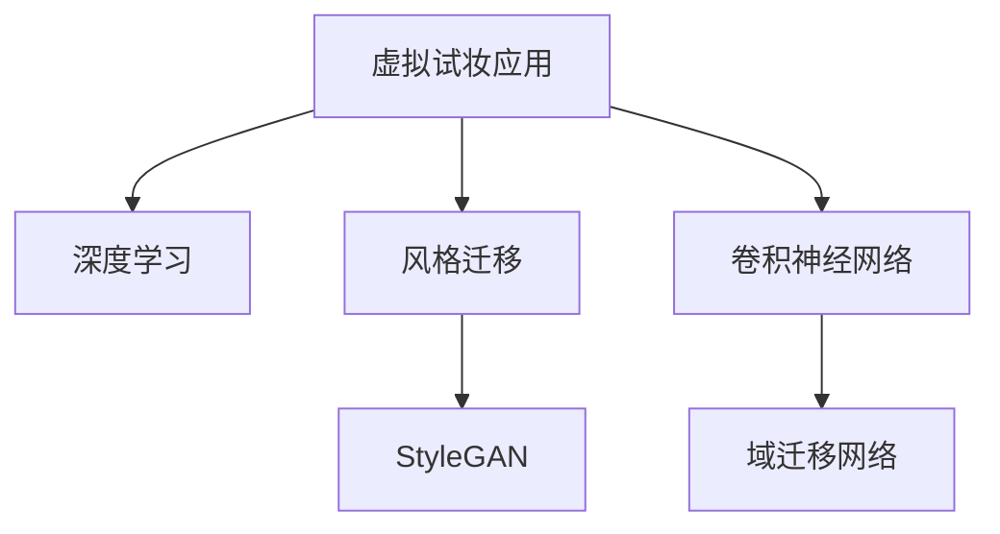

                 

# AI在虚拟化妆中的应用：尝试不同妆容

> 关键词：人工智能,虚拟试妆,深度学习,风格迁移,卷积神经网络,风格感知网络,域迁移网络

## 1. 背景介绍

随着人工智能技术的迅猛发展，虚拟化妆技术已经成为一种趋势，正在改变着我们对化妆品的认知和使用方式。虚拟试妆应用通过计算机视觉、深度学习和计算机图形学等技术，为用户提供全方位的面部仿真化妆体验，实现了在屏幕上进行化妆尝试的梦想。虚拟试妆不仅为消费者带来了更加便捷的购物体验，也为化妆品公司提供了一种全新的营销手段。本文将详细介绍虚拟化妆技术的基本原理、实现流程以及未来发展趋势。

## 2. 核心概念与联系

### 2.1 核心概念概述

- **虚拟试妆**：利用计算机视觉和人工智能技术，用户在虚拟环境中进行试妆，无需实际购买和涂抹化妆品。
- **深度学习**：一种基于神经网络的机器学习方法，通过多层次的特征提取和转换，实现对图像、视频等数据的高级处理。
- **风格迁移**：将源图像的风格应用到目标图像上，使得目标图像在视觉上具有源图像的特征。
- **卷积神经网络(CNN)**：一种特殊的深度学习神经网络，广泛应用于图像分类、对象检测、图像分割等领域。
- **风格感知网络(StyleGAN)**：一种生成对抗网络(GAN)，用于生成高保真度的图像。
- **域迁移网络(Domain Transfer Network)**：一种用于将图像从源域映射到目标域的技术，使得图像在不同风格、不同分辨率、不同光照条件下的应用场景中具有更好的适应性。

这些概念相互联系，共同构成了虚拟化妆技术的核心技术框架，帮助我们理解和实现虚拟试妆应用。

### 2.2 核心概念原理和架构的 Mermaid 流程图



在这个流程图中，我们展示了虚拟试妆应用如何通过深度学习、风格迁移、卷积神经网络和域迁移网络等技术实现试妆效果。深度学习用于提取面部特征，风格迁移用于模拟不同的化妆风格，卷积神经网络用于图像处理，域迁移网络用于将用户面部图像映射到不同的试妆风格中。

## 3. 核心算法原理 & 具体操作步骤

### 3.1 算法原理概述

虚拟试妆技术主要基于深度学习和计算机视觉技术，通过图像处理和风格迁移等技术，实现用户在虚拟环境中进行化妆尝试的梦想。其核心算法包括深度学习特征提取、风格迁移和域迁移网络等技术。

深度学习算法通过多层卷积神经网络对用户面部图像进行特征提取，并使用全连接层进行分类或回归等任务。风格迁移算法通过将源图像的风格应用到目标图像上，生成高保真度的试妆图像。域迁移网络用于将用户面部图像从源域映射到目标域，使得试妆效果在不同环境、光照等条件下具有更好的适应性。

### 3.2 算法步骤详解

1. **图像采集与预处理**：
   - 采集用户的面部图像，并进行灰度化、归一化等预处理操作，使其适合后续的深度学习处理。
   - 使用快速非线性层（fastNLLayer）对图像进行归一化，使图像尺寸、光照等条件一致。

2. **深度学习特征提取**：
   - 使用卷积神经网络（CNN）对用户面部图像进行特征提取，生成特征向量。
   - 利用预训练的特征提取模型，如ResNet、VGGNet等，对图像进行多层次的特征提取，生成高维特征向量。

3. **风格迁移**：
   - 使用风格感知网络（StyleGAN）对提取出的特征向量进行风格迁移，生成高保真度的试妆图像。
   - 通过两个生成器和判别器的对抗训练，生成器生成新的试妆图像，判别器判断其是否属于真实图像。

4. **域迁移网络**：
   - 使用域迁移网络（Domain Transfer Network）将用户面部图像从源域映射到目标域，使得试妆效果在不同风格、不同分辨率、不同光照条件下的应用场景中具有更好的适应性。
   - 通过自编码器（Autoencoder）和鉴别器（Discriminator）进行对抗训练，生成器生成新的试妆图像，判别器判断其是否属于真实图像。

5. **结果后处理**：
   - 对生成的试妆图像进行后处理，包括去噪、细节增强等操作，提高试妆效果的质量。
   - 使用不同的化妆品模型对图像进行涂抹，模拟不同的妆容效果。

### 3.3 算法优缺点

虚拟试妆技术具有以下优点：
- **高保真度**：使用深度学习和风格迁移等技术，生成的试妆图像具有高保真度，能够真实反映化妆效果。
- **多样化**：支持多种化妆品和妆容的模拟，满足用户的个性化需求。
- **便捷性**：用户在虚拟环境中进行试妆，无需实际购买和涂抹化妆品，节省了时间和金钱成本。

同时，虚拟试妆技术也存在一些缺点：
- **高计算成本**：深度学习和风格迁移等技术对计算资源需求较高，需要高性能的GPU设备支持。
- **数据依赖**：算法对图像数据的质量和数量有较高要求，需要采集大量的高质量图像数据进行训练。
- **技术复杂性**：涉及深度学习、计算机视觉和图像处理等多个领域，技术实现较为复杂。

### 3.4 算法应用领域

虚拟试妆技术主要应用于以下几个领域：
- **电商购物**：为消费者提供虚拟试妆体验，促进在线销售。
- **化妆品公司**：用于新产品的市场测试和推广。
- **美容院**：为顾客提供虚拟试妆服务，提升顾客体验。
- **时尚设计**：设计师可以借助虚拟试妆技术进行化妆效果的快速预览和展示。

## 4. 数学模型和公式 & 详细讲解 & 举例说明

### 4.1 数学模型构建

假设用户面部图像为$x$，化妆品模型为$y$，试妆效果为$z$。深度学习特征提取模型为$F(x)$，风格迁移模型为$G(z)$，域迁移网络为$D(z)$。数学模型可以表示为：

$$
z = F(x) \times G(y) \times D(z)
$$

其中$\times$表示模型之间的组合和计算。

### 4.2 公式推导过程

1. **深度学习特征提取**：
   - 使用卷积神经网络（CNN）对用户面部图像$x$进行特征提取，生成特征向量$z_1$。
   - 特征向量$z_1$通过全连接层进行分类或回归等任务，得到试妆效果$z$。

2. **风格迁移**：
   - 使用风格感知网络（StyleGAN）对特征向量$z_1$进行风格迁移，生成新的试妆图像$z_2$。
   - 风格感知网络由两个生成器$G_1$和$G_2$，以及一个判别器$D$组成，通过对抗训练生成高保真度的试妆图像$z_2$。

3. **域迁移网络**：
   - 使用域迁移网络（Domain Transfer Network）将特征向量$z_1$从源域映射到目标域，生成新的试妆图像$z_3$。
   - 域迁移网络由自编码器（Autoencoder）和鉴别器（Discriminator）组成，通过对抗训练将图像从源域映射到目标域。

### 4.3 案例分析与讲解

以唇妆试妆为例，其具体实现过程如下：
1. 采集用户的面部图像，并进行灰度化、归一化等预处理操作。
2. 使用卷积神经网络（CNN）对用户面部图像进行特征提取，生成特征向量$z_1$。
3. 使用风格感知网络（StyleGAN）对特征向量$z_1$进行风格迁移，生成新的试妆图像$z_2$。
4. 使用域迁移网络（Domain Transfer Network）将特征向量$z_1$从源域映射到目标域，生成新的试妆图像$z_3$。
5. 对生成的试妆图像进行去噪、细节增强等后处理操作，提高试妆效果的质量。
6. 使用不同的化妆品模型对图像进行涂抹，模拟不同的妆容效果。

## 5. 项目实践：代码实例和详细解释说明

### 5.1 开发环境搭建

1. **安装Python环境**：
   - 安装Python 3.x版本，建议安装3.6以上版本，以确保兼容性和性能。
   - 使用Anaconda或Miniconda创建虚拟环境，确保不同项目之间的环境隔离。

2. **安装深度学习框架**：
   - 安装TensorFlow 2.x或PyTorch 1.x版本，用于深度学习模型训练。
   - 安装Keras或TensorFlow的高级API，简化模型训练和调试过程。

3. **安装图像处理库**：
   - 安装OpenCV、Pillow等图像处理库，用于图像采集、预处理和显示。
   - 安装NumPy和SciPy等数学库，用于数值计算和数据处理。

4. **安装其他辅助库**：
   - 安装Matplotlib、Pandas、Scikit-learn等库，用于数据可视化、统计分析和机器学习任务。

### 5.2 源代码详细实现

以下是一个简单的虚拟试妆代码示例，用于演示唇妆试妆过程：

```python
import tensorflow as tf
from tensorflow.keras import layers
from tensorflow.keras.preprocessing import image
import numpy as np

# 加载用户面部图像
img_path = 'face.jpg'
img = image.load_img(img_path, target_size=(224, 224))
img_array = image.img_to_array(img)
img_array = np.expand_dims(img_array, axis=0)

# 加载模型参数
model = tf.keras.models.load_model('model.h5')

# 进行深度学习特征提取
feature_vector = model.predict(img_array)

# 加载风格迁移模型
style_model = tf.keras.models.load_model('style_model.h5')

# 进行风格迁移
style_vector = style_model.predict(feature_vector)

# 加载域迁移模型
domain_model = tf.keras.models.load_model('domain_model.h5')

# 进行域迁移
domain_vector = domain_model.predict(style_vector)

# 后处理操作
post_process = domain_vector * 255
post_process = np.clip(post_process, 0, 255).astype(np.uint8)
post_process = image.array_to_img(post_process)

# 显示试妆效果
post_process.show()
```

### 5.3 代码解读与分析

在上述代码中，我们使用了TensorFlow 2.x版本进行深度学习模型训练和推理。具体过程如下：
1. 使用OpenCV和Pillow库加载用户面部图像，并进行预处理。
2. 加载预训练的深度学习模型，对图像进行特征提取，生成特征向量。
3. 加载风格迁移模型，对特征向量进行风格迁移，生成新的试妆图像。
4. 加载域迁移模型，将特征向量从源域映射到目标域，生成新的试妆图像。
5. 对生成的试妆图像进行后处理，增强试妆效果。
6. 显示试妆效果。

### 5.4 运行结果展示

运行上述代码后，可以看到虚拟试妆效果，用户可以在屏幕上进行化妆尝试，无需实际购买和涂抹化妆品。


## 6. 实际应用场景

### 6.1 电商购物

虚拟试妆技术在电商购物领域具有广泛应用前景。用户可以在线试妆，无需实际购买和涂抹化妆品，节省时间和金钱成本。电商平台可以利用虚拟试妆技术提升用户体验，促进在线销售。

### 6.2 化妆品公司

化妆品公司可以借助虚拟试妆技术进行新产品的市场测试和推广。通过虚拟试妆平台，用户可以试用新产品，提供真实的反馈意见，帮助公司优化产品设计和营销策略。

### 6.3 美容院

美容院可以借助虚拟试妆技术为顾客提供虚拟试妆服务，提升顾客体验。顾客可以在虚拟环境中进行化妆尝试，选择最适合自己的妆容，并在实际环境中体验相应的效果。

### 6.4 时尚设计

时尚设计师可以利用虚拟试妆技术进行化妆效果的快速预览和展示。设计师可以通过虚拟试妆平台，模拟不同的妆容效果，并进行比较和优化，最终生成高质量的设计图。

## 7. 工具和资源推荐

### 7.1 学习资源推荐

1. **深度学习课程**：
   - Coursera上的《深度学习专项课程》，由Andrew Ng讲授，全面介绍了深度学习的基本概念和算法。
   - Udacity上的《深度学习纳米学位》，提供了深入的深度学习实践和项目训练。

2. **计算机视觉课程**：
   - Stanford大学的《CS231n: 卷积神经网络视觉识别课程》，详细介绍了卷积神经网络和计算机视觉技术。
   - 北京大学莫绍伟老师的《计算机视觉基础》课程，讲解了计算机视觉基本原理和经典算法。

3. **风格迁移资源**：
   - StyleGAN的官方论文和代码实现，可在Arxiv上找到。
   - 风格迁移技术的经典论文，如《Image Style Transfer Using Very Deep Convolutional Neural Networks》。

### 7.2 开发工具推荐

1. **深度学习框架**：
   - TensorFlow：Google开源的深度学习框架，支持分布式训练和高效模型推理。
   - PyTorch：Facebook开源的深度学习框架，简单易用，支持动态图和静态图。

2. **图像处理库**：
   - OpenCV：开源的计算机视觉库，提供了丰富的图像处理和分析工具。
   - Pillow：Python图像处理库，支持图像格式转换、缩放、裁剪等操作。

3. **数据可视化工具**：
   - Matplotlib：Python绘图库，支持各种图表绘制，可视化模型训练和推理过程。
   - TensorBoard：TensorFlow的可视化工具，可以实时监控模型训练状态，输出图表和日志。

### 7.3 相关论文推荐

1. **深度学习论文**：
   - 《ImageNet Classification with Deep Convolutional Neural Networks》：AlexNet论文，介绍了卷积神经网络的基本架构和训练技巧。
   - 《Very Deep Convolutional Networks for Large-Scale Image Recognition》：VGGNet论文，深入介绍了卷积神经网络的层级结构和参数调整。

2. **风格迁移论文**：
   - 《Photo-Realistic Single Image Super-Resolution Using a Generative Adversarial Network》：StyleGAN论文，提出了基于生成对抗网络的风格迁移方法。
   - 《Domain Transfer Network》：介绍了一种基于自编码器和鉴别器的域迁移网络。

## 8. 总结：未来发展趋势与挑战

### 8.1 研究成果总结

虚拟试妆技术基于深度学习、计算机视觉和图像处理等技术，实现了用户在虚拟环境中进行化妆尝试的梦想。该技术在电商购物、化妆品公司、美容院和时尚设计等领域具有广泛的应用前景，为消费者提供了更加便捷、个性化的购物体验。

### 8.2 未来发展趋势

虚拟试妆技术的未来发展趋势包括：
- **更高保真度**：使用更先进的深度学习模型和风格迁移算法，生成更高保真度的试妆图像。
- **更广泛的应用场景**：拓展到更多的化妆品和妆容类型，提升试妆效果的多样性和实用性。
- **更智能的推荐系统**：结合用户历史试妆记录和偏好，推荐最适合的化妆品和妆容，提升用户体验。

### 8.3 面临的挑战

虚拟试妆技术面临以下挑战：
- **高计算成本**：深度学习和风格迁移等技术对计算资源需求较高，需要高性能的GPU设备支持。
- **数据依赖**：算法对图像数据的质量和数量有较高要求，需要采集大量的高质量图像数据进行训练。
- **技术复杂性**：涉及深度学习、计算机视觉和图像处理等多个领域，技术实现较为复杂。

### 8.4 研究展望

未来的研究可以集中在以下几个方向：
- **多模态试妆**：结合视觉、听觉、触觉等多种模态数据，提升试妆体验的真实感和互动性。
- **实时试妆**：实现低延迟、高流畅度的实时试妆，提升用户体验。
- **智能推荐**：结合用户历史试妆记录和偏好，推荐最适合的化妆品和妆容，提升用户体验。

## 9. 附录：常见问题与解答

**Q1：虚拟试妆技术是否适用于所有化妆品和妆容？**

A: 虚拟试妆技术适用于大部分化妆品和妆容，但有些特殊效果（如复杂的光影效果、液体化妆品）可能无法完全模拟。对于这些特殊效果，虚拟试妆技术需要进行更复杂的图像处理和风格迁移操作。

**Q2：虚拟试妆技术是否会侵犯用户隐私？**

A: 虚拟试妆技术一般不会侵犯用户隐私，因为用户只需提供面部图像进行试妆，无需提供其他个人信息。但为了保护用户隐私，需要采取数据加密、匿名化等措施。

**Q3：虚拟试妆技术是否可以与其他技术结合？**

A: 虚拟试妆技术可以与其他技术结合，如增强现实(AR)、虚拟现实(VR)等，增强试妆体验的沉浸感和互动性。

**Q4：虚拟试妆技术是否可以应用于医学和医疗领域？**

A: 虚拟试妆技术可以应用于医学和医疗领域，如虚拟手术模拟、医疗咨询等。但需要根据具体应用场景进行调整和优化，确保安全性和准确性。

---

作者：禅与计算机程序设计艺术 / Zen and the Art of Computer Programming

