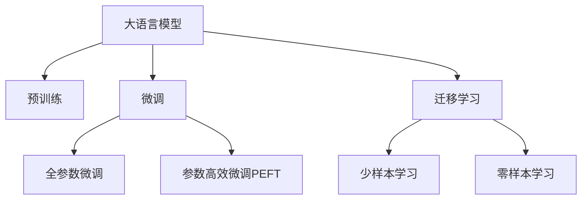

                 

# AI大模型创业：如何应对未来挑战？

## 1. 背景介绍

### 1.1 问题由来

随着人工智能技术的迅猛发展，尤其是大语言模型的崛起，越来越多的创业者开始关注AI大模型的应用潜力。AI大模型凭借其强大的语言理解和生成能力，在智能客服、医疗诊断、智能推荐、智能创作等领域展现了广泛的应用前景。然而，大模型的开发和应用并不是一帆风顺的，面临着诸多技术和市场挑战。

### 1.2 问题核心关键点

AI大模型创业的核心问题在于如何高效、经济地构建大模型，并解决其在应用中的瓶颈问题。具体来说，主要包括以下几个方面：

- **高效构建大模型**：如何在保证模型效果的同时，降低模型构建成本和复杂度。
- **数据获取与预处理**：如何获取高质量、规模大的标注数据，并对其进行高效预处理。
- **模型微调与优化**：如何在已有的大模型基础上，通过微调等方法提升模型在特定任务上的性能。
- **模型部署与维护**：如何将大模型高效部署到生产环境，并实现模型的持续优化和维护。
- **商业化与盈利模式**：如何构建有效的商业化策略，确保AI大模型的经济回报。

### 1.3 问题研究意义

研究如何高效构建和应用AI大模型，对于推动AI技术在各行业的应用，加速经济社会数字化转型具有重要意义。大模型能够显著降低业务开发成本，提升服务质量和效率，创造新的商业模式，推动产业升级。然而，大模型的开发和应用也带来了诸如数据隐私、算法公平性、模型可解释性等诸多挑战，亟需系统化的研究和实践指导。

## 2. 核心概念与联系

### 2.1 核心概念概述

为更好地理解AI大模型创业的核心问题，本节将介绍几个密切相关的核心概念：

- **大语言模型(Large Language Model, LLM)**：以自回归或自编码模型为代表的大规模预训练语言模型，如GPT、BERT等，具有强大的语言理解和生成能力。

- **预训练(Pre-training)**：指在大规模无标签文本数据上，通过自监督学习任务训练通用语言模型的过程，如语言模型、掩码语言模型等。

- **微调(Fine-tuning)**：指在预训练模型的基础上，使用下游任务的少量标注数据，通过有监督学习优化模型在特定任务上的性能。

- **迁移学习(Transfer Learning)**：指将一个领域学习到的知识，迁移应用到另一个不同但相关的领域的学习范式。

- **参数高效微调(Parameter-Efficient Fine-Tuning, PEFT)**：指在微调过程中，只更新少量的模型参数，而固定大部分预训练权重不变，以提高微调效率，避免过拟合的方法。

- **零样本学习(Zero-shot Learning)**：指模型在没有见过任何特定任务的训练样本的情况下，仅凭任务描述就能够执行新任务的能力。

- **少样本学习(Few-shot Learning)**：指在只有少量标注样本的情况下，模型能够快速适应新任务的学习方法。

这些核心概念之间的逻辑关系可以通过以下Mermaid流程图来展示：



### 2.2 核心概念原理和架构的 Mermaid 流程图

以下是核心概念的逻辑关系图：


### 2.3 核心概念的应用

大语言模型在实际应用中，通常需要经过预训练和微调两个阶段。预训练阶段通过无监督学习，学习语言的通用表示。微调阶段则通过有监督学习，优化模型在特定任务上的表现。参数高效微调则是在微调过程中，仅更新少量的模型参数，以提高微调效率，避免过拟合。迁移学习则是指将预训练模型应用于新的任务上，提升模型在不同领域的应用能力。零样本学习和少样本学习则是指模型在没有或只有少量标注数据的情况下，仍能进行有效的推理和生成。

## 3. 核心算法原理 & 具体操作步骤

### 3.1 算法原理概述

AI大模型的构建和应用主要涉及以下几个核心算法和操作步骤：

- **预训练**：通过大规模无标签数据训练，构建通用语言模型。
- **微调**：使用下游任务的少量标注数据，优化模型在特定任务上的性能。
- **参数高效微调**：在微调过程中，仅更新部分模型参数，以提高效率。
- **迁移学习**：将预训练模型应用于新任务，提升模型在不同领域的应用能力。
- **零样本学习**：模型在没有标注数据的情况下，仍能进行有效的推理和生成。

### 3.2 算法步骤详解

以下是AI大模型构建和应用的详细步骤：

1. **数据获取与预处理**：收集大量高质量的文本数据，并进行清洗、标注和预处理。

2. **模型构建与预训练**：选择合适的预训练模型（如GPT、BERT），在大规模无标签数据上进行预训练。

3. **微调**：选择适当的微调任务和数据集，使用有监督学习优化模型在特定任务上的性能。

4. **参数高效微调**：在微调过程中，仅更新部分模型参数，以提高效率。

5. **迁移学习**：将预训练模型应用于新任务，提升模型在不同领域的应用能力。

6. **零样本学习**：模型在没有标注数据的情况下，仍能进行有效的推理和生成。

### 3.3 算法优缺点

AI大模型在构建和应用中，既有显著的优点，也存在一些局限性：

- **优点**：
  - **通用性强**：大模型在多种任务上都能取得良好的性能。
  - **效率高**：通过微调和参数高效微调，可以快速构建和优化模型。
  - **可解释性好**：通过迁移学习和零样本学习，可以提高模型的可解释性。

- **缺点**：
  - **数据依赖**：微调需要大量高质量标注数据，获取成本高。
  - **过拟合风险**：全参数微调容易导致过拟合，需要谨慎设置学习率和正则化参数。
  - **隐私和安全**：大模型的训练和使用涉及大量敏感数据，需要确保数据隐私和安全。

### 3.4 算法应用领域

AI大模型在多个领域都有广泛的应用，例如：

- **智能客服**：用于智能问答和自然语言理解，提高客户服务体验。
- **医疗诊断**：用于医学文本分类、病理分析等，提高诊断效率和准确性。
- **智能推荐**：用于推荐系统，提升推荐效果和用户满意度。
- **智能创作**：用于文本生成、对话生成等，支持内容创作和内容审核。

## 4. 数学模型和公式 & 详细讲解 & 举例说明

### 4.1 数学模型构建

AI大模型的构建通常基于预训练语言模型，其数学模型可以表示为：

$$
M_{\theta}(x) = F_{\text{LM}}(x; \theta)
$$

其中，$M_{\theta}$表示模型参数，$x$表示输入的文本数据，$F_{\text{LM}}(x; \theta)$表示基于语言模型的文本表示函数。

### 4.2 公式推导过程

以BERT为例，其预训练任务为掩码语言模型和下一句预测任务。掩码语言模型的损失函数为：

$$
\ell_{\text{mask}} = -\frac{1}{N}\sum_{i=1}^N \sum_{j=1}^n (y_j \log p_j + (1-y_j)\log(1-p_j))
$$

其中，$N$表示样本数，$n$表示输入文本的长度，$y_j$表示第$j$个位置的掩码标记，$p_j$表示模型在当前位置的概率预测。

### 4.3 案例分析与讲解

以BERT为例，其预训练过程分为两个阶段：预训练和微调。预训练阶段在大量无标签数据上进行掩码语言模型和下一句预测任务。微调阶段则针对特定任务（如情感分类），使用少量标注数据进行有监督学习，优化模型在特定任务上的性能。

## 5. 项目实践：代码实例和详细解释说明

### 5.1 开发环境搭建

在AI大模型创业过程中，开发环境搭建是至关重要的。以下是基于Python和PyTorch搭建AI大模型开发环境的步骤：

1. **安装Python和PyTorch**：安装Python 3.7及以上版本，并安装PyTorch。

2. **安装相关库**：安装transformers、numpy、scikit-learn等库。

3. **配置GPU**：若需要使用GPU进行加速，需配置CUDA和cuDNN等。

4. **搭建开发环境**：搭建Jupyter Notebook或Python IDE，方便代码开发和调试。

### 5.2 源代码详细实现

以下是使用PyTorch构建BERT模型的示例代码：

```python
import torch
from transformers import BertForSequenceClassification, BertTokenizer

# 初始化BERT模型和分词器
model = BertForSequenceClassification.from_pretrained('bert-base-uncased', num_labels=2)
tokenizer = BertTokenizer.from_pretrained('bert-base-uncased')

# 构建数据集
inputs = tokenizer("Hello, my dog is cute", return_tensors="pt")
labels = torch.tensor([1]).unsqueeze(0)

# 训练模型
model.train()
outputs = model(**inputs, labels=labels)
loss = outputs.loss
loss.backward()
optimizer.step()

# 评估模型
model.eval()
inputs = tokenizer("Hello, my dog is cute", return_tensors="pt")
outputs = model(**inputs)
logits = outputs.logits
```

### 5.3 代码解读与分析

上述代码演示了如何构建和使用BERT模型进行情感分类任务。其中，`BertForSequenceClassification`表示序列分类模型，`BertTokenizer`表示BERT的分词器。通过`from_pretrained`方法，可以加载预训练的BERT模型和分词器，并进行训练和评估。

## 6. 实际应用场景

### 6.1 智能客服系统

智能客服系统是AI大模型创业中的典型应用场景。通过微调大语言模型，可以实现智能问答和自然语言理解，提升客户服务体验。例如，使用BERT模型进行情感分类，可以自动识别用户情绪，提供个性化服务。

### 6.2 医疗诊断系统

医疗诊断系统是AI大模型创业中的另一个重要应用场景。通过微调BERT模型，可以实现医学文本分类、病理分析等，提高诊断效率和准确性。例如，使用BERT模型进行疾病诊断，可以自动识别患者的病情和症状，提供精准的诊断建议。

### 6.3 智能推荐系统

智能推荐系统是AI大模型创业中的重要应用场景。通过微调BERT模型，可以实现推荐系统，提升推荐效果和用户满意度。例如，使用BERT模型进行商品推荐，可以自动识别用户的兴趣和需求，提供个性化的商品推荐。

### 6.4 未来应用展望

AI大模型在未来将有更广阔的应用前景，包括：

- **智能创作**：用于文本生成、对话生成等，支持内容创作和内容审核。
- **智能金融**：用于金融舆情监测、风险预测等，提升金融服务的智能化水平。
- **智能教育**：用于智能问答、个性化学习等，提升教育服务的智能化水平。

## 7. 工具和资源推荐

### 7.1 学习资源推荐

- **《深度学习基础》**：介绍深度学习的原理和应用，适合初学者入门。
- **《自然语言处理》**：介绍NLP技术的基本原理和常用模型，适合进一步学习。
- **《机器学习实战》**：介绍机器学习的实践技巧和案例，适合实践操作。

### 7.2 开发工具推荐

- **PyTorch**：开源深度学习框架，支持GPU加速和动态图计算。
- **TensorFlow**：开源深度学习框架，支持静态图计算和分布式训练。
- **Jupyter Notebook**：交互式开发环境，支持Python代码的交互式运行和版本控制。

### 7.3 相关论文推荐

- **《BERT: Pre-training of Deep Bidirectional Transformers for Language Understanding》**：介绍BERT模型的预训练方法和性能。
- **《GPT-3: Language Models are Unsupervised Multitask Learners》**：介绍GPT-3模型的预训练方法和性能。
- **《Adam: A Method for Stochastic Optimization》**：介绍Adam优化器的原理和实现。

## 8. 总结：未来发展趋势与挑战

### 8.1 研究成果总结

AI大模型在构建和应用中取得了显著进展，推动了NLP技术的发展和应用。未来，随着计算资源的增加和算法技术的进步，AI大模型将更加高效、智能和可解释，为各行业提供更强大的服务。

### 8.2 未来发展趋势

未来，AI大模型将呈现以下几个发展趋势：

- **模型规模增大**：随着计算资源的增加，AI大模型的参数规模将持续增大，提升模型的泛化能力和应用范围。
- **算法优化**：开发更加高效的算法，提升模型的训练和推理速度，降低计算资源消耗。
- **可解释性增强**：通过模型解释技术，提高模型的可解释性，增强用户的信任感。
- **多模态融合**：将视觉、语音等多模态数据与文本数据结合，提升模型的综合能力。

### 8.3 面临的挑战

AI大模型在构建和应用中也面临一些挑战：

- **数据隐私和安全**：大模型的训练和使用涉及大量敏感数据，需要确保数据隐私和安全。
- **算法公平性**：大模型的训练数据存在偏见，需要采取措施确保模型的公平性。
- **计算资源消耗**：大模型的训练和推理需要大量计算资源，需要优化资源消耗。

### 8.4 研究展望

未来，需要在以下几个方面进行研究：

- **数据隐私保护**：采用差分隐私等技术，保护数据隐私。
- **模型公平性**：采取公平性约束，确保模型的公平性。
- **高效计算**：开发高效的算法和硬件，降低计算资源消耗。

## 9. 附录：常见问题与解答

**Q1：AI大模型创业的难点有哪些？**

A: AI大模型创业的难点主要包括以下几个方面：

- **数据获取**：获取高质量、规模大的标注数据成本高。
- **模型训练**：大模型的训练需要大量计算资源，训练周期长。
- **模型优化**：需要优化模型结构，提升模型的泛化能力和性能。

**Q2：如何构建高效的数据标注体系？**

A: 构建高效的数据标注体系需要以下几个步骤：

- **数据收集**：收集高质量的标注数据，涵盖各个方面和场景。
- **标注标准**：制定统一的标注标准和规范，确保标注的一致性和准确性。
- **标注工具**：使用高效的数据标注工具，如Labelbox、Prodigy等，提高标注效率。

**Q3：如何评估AI大模型的性能？**

A: 评估AI大模型的性能需要以下几个步骤：

- **离线评估**：在验证集和测试集上评估模型的性能指标，如准确率、召回率、F1值等。
- **在线评估**：在实际应用中，实时监测模型的性能和效果，根据反馈进行优化。
- **多维度评估**：从模型准确性、稳定性、可解释性等多个维度综合评估模型的性能。

**Q4：AI大模型创业的盈利模式有哪些？**

A: AI大模型创业的盈利模式主要包括以下几个方面：

- **订阅服务**：向客户提供基于模型的API服务，按使用量收费。
- **增值服务**：提供定制化的模型开发和优化服务，满足客户个性化需求。
- **数据服务**：提供标注数据、预训练模型等数据服务，满足客户数据需求。

**Q5：AI大模型创业的团队构成有哪些关键岗位？**

A: AI大模型创业的团队构成需要以下几个关键岗位：

- **算法工程师**：负责模型设计、训练和优化，确保模型性能。
- **数据科学家**：负责数据收集、清洗和标注，确保数据质量。
- **产品经理**：负责产品规划、需求分析和用户体验优化，确保产品成功落地。
- **运营人员**：负责产品部署、维护和客户支持，确保产品稳定运行。

---

作者：禅与计算机程序设计艺术 / Zen and the Art of Computer Programming

