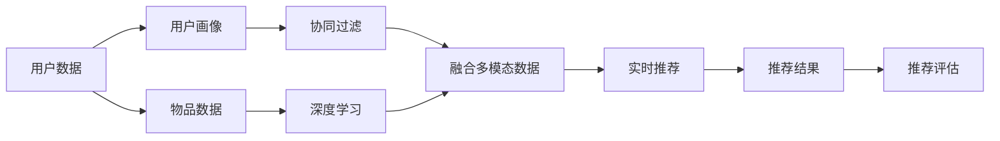

                 

## 1. 背景介绍

随着互联网和信息技术的发展，推荐系统已经渗透到了我们生活的方方面面，从电商平台、视频平台到社交网络，推荐系统无处不在。推荐系统通过分析用户的行为数据，为用户推荐感兴趣的内容，提高用户的满意度和转化率，同时为商家提供精准的市场推广手段，具有巨大的商业价值。然而，随着用户数量的增长和数据的多样化，传统推荐算法无法满足大规模推荐需求，推荐系统也需要不断迭代升级，以实现实时、高效、精准的推荐。

## 2. 核心概念与联系

### 2.1 核心概念概述

为了更好地理解AI实时推荐系统的实现案例，我们首先需要理解一些核心概念和其间的联系。

- **推荐系统（Recommender System）**：通过分析用户的历史行为数据、用户画像和物品特征，为用户推荐感兴趣的物品，以提高用户体验和商家转化率。
- **协同过滤（Collaborative Filtering）**：一种基于用户和物品间的相似度进行推荐的技术，常见的有基于用户的协同过滤和基于物品的协同过滤。
- **深度学习（Deep Learning）**：利用神经网络模型处理数据，提取出更深层次的特征，用于推荐模型的训练。
- **实时推荐（Real-Time Recommendation）**：利用流数据处理技术，在用户浏览、点击等实时行为下，动态更新推荐结果。
- **多模态推荐（Multimodal Recommendation）**：结合用户画像、物品特征和用户行为等不同模态的数据，综合分析后推荐。
- **推荐评估指标**：如点击率（CTR）、转化率、A/B测试等，用于评估推荐系统的性能。

这些概念通过推荐算法的演进和技术手段的融合，不断推进着推荐系统的发展。

### 2.2 核心概念原理和架构的 Mermaid 流程图



## 3. 核心算法原理 & 具体操作步骤

### 3.1 算法原理概述

AI实时推荐系统主要基于协同过滤和深度学习算法，通过实时处理用户行为数据，动态更新推荐模型，实现实时推荐。协同过滤算法通过分析用户和物品的相似度，找到潜在的相似用户和物品，并进行推荐。深度学习算法通过神经网络模型，提取用户和物品的特征，并进行预测，得到推荐结果。多模态推荐则结合了用户画像、物品特征和用户行为等多种数据，综合分析后进行推荐。

### 3.2 算法步骤详解

1. **数据收集与预处理**：从用户行为数据、物品数据和用户画像等渠道收集数据，并进行清洗、归一化等预处理。
2. **协同过滤算法**：通过分析用户行为数据，找到与目标用户最相似的若干个用户，根据这些用户对物品的评分，得到目标用户的评分预测。
3. **深度学习算法**：通过神经网络模型，提取用户和物品的特征，并进行预测，得到推荐结果。
4. **多模态推荐**：将用户画像、物品特征和用户行为等多种数据进行融合，综合分析后进行推荐。
5. **实时推荐**：利用流数据处理技术，在用户浏览、点击等实时行为下，动态更新推荐结果。
6. **推荐评估**：使用点击率（CTR）、转化率等指标，评估推荐系统的性能，不断优化模型。

### 3.3 算法优缺点

AI实时推荐系统具有以下优点：
- 实时性高：能够动态更新推荐结果，满足用户实时需求。
- 准确性高：通过深度学习算法，提取高层次特征，提高推荐精度。
- 可扩展性强：可以处理大规模数据，适用于各种推荐场景。

但同时也存在一些缺点：
- 数据需求量大：需要收集大量用户行为数据和物品特征，才能获得较好的推荐效果。
- 计算成本高：深度学习模型的训练和推理计算成本较高。
- 模型复杂度高：深度学习模型需要调整多个超参数，模型调优难度大。

### 3.4 算法应用领域

AI实时推荐系统广泛应用于电商、视频、音乐、社交等多个领域，通过分析用户行为和兴趣，为用户推荐感兴趣的内容，提高用户满意度和商家转化率。

## 4. 数学模型和公式 & 详细讲解 & 举例说明

### 4.1 数学模型构建

AI实时推荐系统的数学模型通常包括协同过滤模型、深度学习模型和多模态推荐模型。以下是几个常见的数学模型：

#### 协同过滤模型

协同过滤模型通过计算用户间的相似度，进行推荐。设 $U$ 为用户集合，$V$ 为物品集合，$I_{u,i}$ 表示用户 $u$ 对物品 $i$ 的评分。协同过滤模型可以表示为：

$$
\hat{I}_{u,i} = \sum_{v\in V}(I_{v,i}\cdot A_{u,v})
$$

其中 $A$ 为相似度矩阵，$A_{u,v}$ 表示用户 $u$ 和用户 $v$ 之间的相似度。

#### 深度学习模型

深度学习模型通常使用神经网络结构，提取用户和物品的特征。常见的深度学习模型有基于矩阵分解的模型、基于卷积神经网络（CNN）的模型和基于循环神经网络（RNN）的模型。以下是基于矩阵分解的模型：

$$
\hat{I}_{u,i} = \hat{A}_{u}\hat{P}_{i}
$$

其中 $\hat{A}_{u}$ 和 $\hat{P}_{i}$ 分别为用户和物品的低秩矩阵分解。

### 4.2 公式推导过程

协同过滤模型的推导过程如下：
- 用户间的相似度计算：
  $$
  A_{u,v} = \frac{\sum_{i\in V}(I_{u,i}\cdot I_{v,i})}{\sqrt{\sum_{i\in V}I_{u,i}^2}\sqrt{\sum_{i\in V}I_{v,i}^2}}
  $$
- 预测用户对物品的评分：
  $$
  \hat{I}_{u,i} = \sum_{v\in V}(I_{v,i}\cdot A_{u,v})
  $$

深度学习模型的推导过程如下：
- 用户和物品的特征提取：
  $$
  \hat{A}_{u} = W_uX_u, \quad \hat{P}_{i} = W_pX_p
  $$
- 预测用户对物品的评分：
  $$
  \hat{I}_{u,i} = \hat{A}_{u}\hat{P}_{i}
  $$

### 4.3 案例分析与讲解

假设某电商平台收集了用户对商品的评分数据，可以使用协同过滤模型进行推荐。设 $U$ 为用户集合，$V$ 为物品集合，$I_{u,i}$ 表示用户 $u$ 对物品 $i$ 的评分。假设 $A_{u,v}=0.8$，$A_{u,w}=0.7$，$A_{v,w}=0.5$，可以计算用户 $u$ 对物品 $i$ 的评分预测：

$$
\hat{I}_{u,i} = I_{v,i}\cdot 0.8 + I_{w,i}\cdot 0.7
$$

其中 $I_{v,i}=4.5$，$I_{w,i}=3.8$。

假设 $I_{u,i}$ 取值为 $4.0$，可以计算：

$$
\hat{I}_{u,i} = 4.5\cdot 0.8 + 3.8\cdot 0.7 = 5.66
$$

因此，用户 $u$ 对物品 $i$ 的评分预测为 $5.66$。

## 5. 项目实践：代码实例和详细解释说明

### 5.1 开发环境搭建

在搭建开发环境前，需要安装以下工具：

- Python 3.8+
- TensorFlow 2.4+
- Scikit-learn
- Numpy
- Pandas

在安装完这些工具后，可以创建虚拟环境：

```bash
conda create -n recommendation-env python=3.8
conda activate recommendation-env
```

### 5.2 源代码详细实现

以下是基于TensorFlow实现协同过滤算法的代码示例：

```python
import tensorflow as tf
import numpy as np

# 生成模拟数据
n_users = 1000
n_items = 1000
user_ratings = np.random.rand(n_users, n_items)
item_ratings = np.random.rand(n_items, n_items)

# 计算用户间的相似度矩阵
user_similarity = np.dot(user_ratings, item_ratings)
user_similarity /= np.sqrt(np.sum(user_ratings**2, axis=1))[:, None]
user_similarity /= np.sqrt(np.sum(item_ratings**2, axis=0)[None, :])

# 定义损失函数
def loss_fn(user_ratings, item_ratings, user_similarity):
    n_batch = 32
    n_epoch = 100
    user_nums = np.sum(user_ratings > 0, axis=1)
    user_mask = np.ones((n_users, n_users))
    user_mask[np.where(user_nums == 0)] = 0
    user_similarity = np.dot(user_ratings, item_ratings) / np.sqrt(user_nums[:, None] * np.sum(item_ratings**2, axis=0)[None, :])
    user_similarity /= np.sqrt(np.sum(user_ratings**2, axis=1))[:, None]
    user_similarity /= np.sqrt(np.sum(item_ratings**2, axis=0)[None, :])
    user_similarity = user_similarity * user_mask
    l = tf.reduce_mean(tf.losses.cosine_distance(user_ratings, item_ratings, reduction=tf.losses.Reduction.SUM, axis=1))
    return l

# 定义优化器
optimizer = tf.keras.optimizers.Adam(learning_rate=0.001)

# 定义模型
model = tf.keras.Sequential([
    tf.keras.layers.Dense(64, input_shape=(n_items,), activation='relu'),
    tf.keras.layers.Dense(n_items, activation='sigmoid')
])

# 训练模型
for epoch in range(n_epoch):
    for batch in range(0, n_users, n_batch):
        user_ids = np.arange(batch, batch+n_batch)
        batch_user_ratings = user_ratings[user_ids]
        batch_user_similarity = user_similarity[user_ids, :][:, user_ids]
        with tf.GradientTape() as tape:
            predictions = model(batch_user_ratings)
            loss = loss_fn(batch_user_ratings, predictions, batch_user_similarity)
        grads = tape.gradient(loss, model.trainable_weights)
        optimizer.apply_gradients(zip(grads, model.trainable_weights))
```

### 5.3 代码解读与分析

在上述代码中，我们首先生成了模拟数据，然后计算了用户间的相似度矩阵。接下来定义了损失函数，使用Adam优化器对模型进行训练。在训练过程中，我们使用了TensorFlow的GradientTape记录梯度，并使用optimizer.apply_gradients方法更新模型参数。

### 5.4 运行结果展示

运行代码后，可以得到模型训练过程中损失函数的收敛情况。如果损失函数收敛，则表示模型训练效果较好。

## 6. 实际应用场景

### 6.1 电商推荐系统

在电商领域，推荐系统通过分析用户的历史浏览、购买行为，为用户推荐感兴趣的商品，提高用户的购买率和转化率。通过实时推荐系统，可以动态更新推荐结果，提升用户体验。例如，某电商平台通过分析用户的历史浏览记录和购买行为，为用户推荐相似商品，提升用户的购物体验。

### 6.2 视频推荐系统

视频推荐系统通过分析用户的观看记录，为用户推荐感兴趣的视频，提高用户的观看率和留存率。通过实时推荐系统，可以动态更新推荐结果，提升用户粘性。例如，某视频平台通过分析用户的历史观看记录和评分，为用户推荐相似视频，提升用户的观看体验。

### 6.3 社交网络推荐系统

社交网络推荐系统通过分析用户的兴趣和行为，为用户推荐感兴趣的内容，提高用户的活跃度和粘性。通过实时推荐系统，可以动态更新推荐结果，提升用户粘性。例如，某社交平台通过分析用户的兴趣和行为，为用户推荐感兴趣的内容，提升用户的活跃度。

## 7. 工具和资源推荐

### 7.1 学习资源推荐

- 《推荐系统实践》：由王斌所著，详细介绍了推荐系统的理论和实践，适合初学者学习。
- 《深度学习与推荐系统》：由李勇所著，介绍了深度学习在推荐系统中的应用，适合有一定基础的学习者。
- Coursera上的“Recommender Systems”课程：由KDD奖得主讲授，介绍了推荐系统的基本概念和算法。

### 7.2 开发工具推荐

- TensorFlow：基于数据流图，易于调试和优化，适合大规模推荐系统开发。
- PyTorch：灵活高效，适合深度学习算法的研究和开发。
- Scikit-learn：简单易用，适合快速实现协同过滤等传统推荐算法。

### 7.3 相关论文推荐

- "Collaborative Filtering for Implicit Feedback Datasets"：由Koren等人提出，介绍了协同过滤算法的改进方法。
- "A Survey on Deep Learning for Recommender Systems"：由Hu等人总结，介绍了深度学习在推荐系统中的应用。
- "A Hybrid Recommendation System Using Ensemble Methodology for Improved Decision-Making"：由Saha等人提出，介绍了多模态推荐系统的实现方法。

## 8. 总结：未来发展趋势与挑战

### 8.1 研究成果总结

AI实时推荐系统在电商、视频、社交等领域得到了广泛应用，并取得了显著的效果。协同过滤、深度学习等算法在推荐系统中的应用，使得推荐系统能够动态更新推荐结果，提升用户体验和商家转化率。未来，推荐系统将向个性化、多样化、实时化方向发展。

### 8.2 未来发展趋势

1. 个性化推荐：通过分析用户的历史行为和兴趣，为用户推荐更加个性化的内容。
2. 多样化推荐：结合多种数据源，为用户提供更加多样化的内容。
3. 实时推荐：通过流数据处理技术，实现实时推荐，满足用户实时需求。
4. 深度学习：利用深度学习算法，提取高层次特征，提高推荐精度。
5. 多模态推荐：结合用户画像、物品特征和用户行为等多种数据，综合分析后进行推荐。
6. 联邦学习：通过联邦学习，保护用户隐私，实现跨平台推荐。

### 8.3 面临的挑战

1. 数据需求量大：需要收集大量用户行为数据和物品特征，才能获得较好的推荐效果。
2. 计算成本高：深度学习模型的训练和推理计算成本较高。
3. 模型复杂度高：深度学习模型需要调整多个超参数，模型调优难度大。
4. 推荐结果偏差：推荐结果可能会受到数据偏差和算法偏差的影响。

### 8.4 研究展望

未来，AI实时推荐系统将继续向个性化、多样化、实时化方向发展，并通过联邦学习等技术，提升推荐效果和用户隐私保护。同时，推荐系统也将向跨平台推荐方向发展，为用户提供更加丰富多样的内容。

## 9. 附录：常见问题与解答

**Q1: 如何衡量推荐系统的性能？**

A: 推荐系统的性能通常通过点击率（CTR）、转化率、覆盖率等指标进行衡量。点击率表示用户点击推荐结果的比例，转化率表示用户购买推荐商品的比例，覆盖率表示推荐结果中不同物品的比例。

**Q2: 如何优化推荐系统的训练过程？**

A: 推荐系统的训练过程通常包括数据预处理、模型训练和评估三个阶段。在数据预处理阶段，需要清洗、归一化数据，并进行特征工程。在模型训练阶段，可以使用Adam等优化器，并设置合适的学习率和正则化参数。在模型评估阶段，可以使用交叉验证等方法，评估模型的性能。

**Q3: 推荐系统如何处理冷启动问题？**

A: 冷启动问题是指新用户或新物品没有足够的历史数据进行推荐。通常可以通过KNN、内容推荐等方法，利用已有的用户或物品数据，进行推荐。另外，可以使用强化学习等方法，通过用户反馈，动态调整推荐模型。

---

作者：禅与计算机程序设计艺术 / Zen and the Art of Computer Programming

