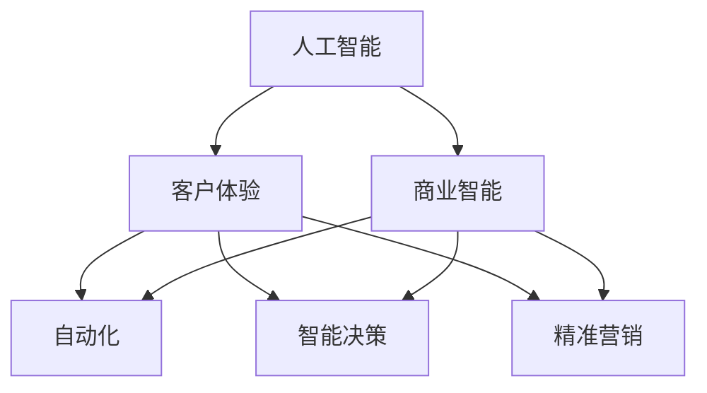

                 

# AI技术与商业模式的创新

## 1. 背景介绍

### 1.1 问题由来

随着人工智能技术的不断发展，AI技术与商业模式的融合已成为驱动行业创新的重要引擎。AI技术在各个领域的应用，如自动驾驶、金融风控、医疗诊断、零售推荐等，不仅提高了生产效率，也改变了传统商业模式。然而，AI技术如何更好地与商业需求结合，实现从技术到应用的落地，是当前亟待解决的问题。

### 1.2 问题核心关键点

本文聚焦于AI技术与商业模式的创新，探讨如何通过AI技术实现商业模式的突破和转型，特别是在数据分析、决策优化、客户体验提升等方面。通过分析AI技术在不同商业场景中的应用，揭示其对商业模式的影响和潜力，并提出未来发展的方向和挑战。

### 1.3 问题研究意义

研究AI技术与商业模式的创新，对于推动企业数字化转型，提升商业智能水平，降低运营成本，增加市场竞争力，具有重要意义。AI技术的引入，可以助力企业实现业务流程的自动化、智能化，提高决策的科学性和效率，增强客户体验，从而赢得市场竞争优势。

## 2. 核心概念与联系

### 2.1 核心概念概述

为更好地理解AI技术与商业模式的创新，本节将介绍几个关键概念：

- **人工智能（AI）**：通过算法、模型和数据处理等技术，使机器具备感知、理解、学习、决策等智能行为。

- **商业智能（BI）**：利用数据分析和人工智能技术，帮助企业实现数据驱动的决策过程，提高业务运营效率和盈利能力。

- **客户体验（CX）**：通过AI技术优化客户与企业交互的各个环节，提供个性化、便捷的服务，增强客户满意度和忠诚度。

- **自动化（Automation）**：通过AI技术实现业务流程的自动化，减少人力成本，提升效率。

- **智能决策（Intelligent Decision Making）**：通过AI技术对海量数据进行分析和挖掘，辅助企业做出更科学、更高效的决策。

- **精准营销（Precision Marketing）**：利用AI技术对客户数据进行分析，实现精准定位和个性化营销，提升营销效果。

这些概念之间的逻辑关系可以通过以下Mermaid流程图来展示：



这个流程图展示了一系列的AI技术如何相互联系，协同作用，最终推动商业模式的创新。

## 3. 核心算法原理 & 具体操作步骤
### 3.1 算法原理概述

AI技术与商业模式的创新，本质上是通过算法和模型对商业数据的深度处理和分析，从而实现业务流程的优化和升级。其核心算法包括但不限于以下几种：

- **机器学习（Machine Learning, ML）**：通过数据训练模型，实现对数据的预测和分类。
- **深度学习（Deep Learning, DL）**：构建多层神经网络，进行更复杂的数据处理和特征提取。
- **自然语言处理（Natural Language Processing, NLP）**：解析和理解人类语言，实现文本数据的处理和分析。
- **计算机视觉（Computer Vision, CV）**：通过图像识别、图像处理等技术，实现对视觉数据的分析和处理。
- **强化学习（Reinforcement Learning, RL）**：通过与环境的交互，训练智能体做出最优决策。

这些算法共同构成了AI技术的核心框架，通过在商业应用中的融合和应用，实现商业模式的创新。

### 3.2 算法步骤详解

AI技术与商业模式的创新过程，一般包括以下几个关键步骤：

**Step 1: 数据收集与处理**
- 收集与商业目标相关的数据，包括结构化数据、非结构化数据、实时数据等。
- 对数据进行清洗、去重、归一化等预处理，确保数据质量和一致性。

**Step 2: 数据分析与建模**
- 利用统计分析、机器学习、深度学习等技术，对数据进行分析和建模，提取有价值的商业洞察。
- 构建算法模型，如分类、回归、聚类、异常检测等，实现对数据的预测和分类。

**Step 3: 模型训练与优化**
- 使用历史数据对模型进行训练，调整模型参数，提高模型的预测准确率和鲁棒性。
- 对模型进行调优，如使用交叉验证、超参数优化等方法，提升模型性能。

**Step 4: 模型部署与应用**
- 将训练好的模型部署到生产环境中，实现自动化和智能化。
- 通过API接口等方式，将模型应用于实际业务场景，实现业务流程的优化和升级。

**Step 5: 持续监控与优化**
- 对模型在生产环境中的表现进行实时监控，确保模型的稳定性和可靠性。
- 根据实际业务需求，定期对模型进行优化和更新，提升模型效果。

### 3.3 算法优缺点

AI技术与商业模式的创新，具有以下优点：
1. 提升效率：通过自动化和智能化，大幅度提高业务流程的效率。
2. 增强决策：基于数据分析的智能决策，提高决策的科学性和准确性。
3. 优化体验：通过AI技术优化客户体验，提升客户满意度和忠诚度。
4. 降低成本：通过自动化和优化流程，减少人力成本和运营成本。

同时，该方法也存在一定的局限性：
1. 数据质量问题：模型性能依赖于数据质量，低质量、不完整的数据会影响模型效果。
2. 技术门槛高：AI技术的开发和应用需要高水平的技术团队，初期投入较大。
3. 安全与隐私问题：AI模型涉及大量个人和商业数据，数据安全和隐私保护成为重要挑战。
4. 模型解释性不足：复杂的AI模型往往难以解释其决策过程，缺乏透明度。
5. 依赖基础设施：模型的训练和部署需要高性能计算资源，对基础设施要求较高。

尽管存在这些局限性，但AI技术与商业模式的创新仍是大势所趋，未来将有更多的企业和行业受益于此。

### 3.4 算法应用领域

AI技术与商业模式的创新，在多个领域得到了广泛应用，例如：

- **金融科技**：利用AI技术进行风险评估、信用评分、反欺诈检测等，提升金融服务的智能化水平。
- **零售电商**：通过AI技术进行客户画像、推荐系统、库存管理等，优化零售电商的运营效率和客户体验。
- **医疗健康**：利用AI技术进行疾病预测、诊断、治疗方案优化等，提升医疗健康服务的质量和效率。
- **智能制造**：通过AI技术进行生产过程优化、设备预测性维护、供应链管理等，提升智能制造的自动化水平。
- **智慧城市**：利用AI技术进行交通管理、环境监测、公共安全等，提升城市管理的智能化水平。

此外，AI技术在教育、农业、能源等多个领域也有广泛应用，推动了各行业的数字化转型和智能化升级。

## 4. 数学模型和公式 & 详细讲解 & 举例说明
### 4.1 数学模型构建

本节将使用数学语言对AI技术与商业模式的创新过程进行更加严格的刻画。

假设企业有一组历史数据 $D=\{(x_i,y_i)\}_{i=1}^N$，其中 $x_i$ 为输入特征，$y_i$ 为输出标签。模型的目标是学习一个映射函数 $f(x;\theta)$，使其能够对新的输入数据 $x'$ 进行预测 $f(x';\theta)$。常用的数学模型包括线性回归、逻辑回归、决策树、随机森林等。

### 4.2 公式推导过程

以线性回归为例，其数学模型可以表示为：

$$
y_i = f(x_i;\theta) = \theta^T \cdot x_i + \epsilon
$$

其中 $\theta$ 为模型参数，$\epsilon$ 为误差项。模型的最小二乘损失函数为：

$$
\mathcal{L}(\theta) = \frac{1}{N} \sum_{i=1}^N (y_i - f(x_i;\theta))^2
$$

利用梯度下降等优化算法，求解损失函数的最小值，更新模型参数：

$$
\theta \leftarrow \theta - \eta \nabla_{\theta}\mathcal{L}(\theta)
$$

其中 $\eta$ 为学习率，$\nabla_{\theta}\mathcal{L}(\theta)$ 为损失函数对参数 $\theta$ 的梯度。

### 4.3 案例分析与讲解

假设某电商平台希望利用AI技术提升推荐系统的精准度，其推荐算法可以分为以下几个步骤：

**Step 1: 数据收集**
- 收集用户的浏览记录、购买记录、评分记录等，作为训练数据。
- 收集商品的属性信息，如价格、类别、品牌等，作为特征数据。

**Step 2: 数据预处理**
- 对用户行为数据进行清洗、去重、归一化等预处理，确保数据质量。
- 对商品属性数据进行特征工程，生成更丰富的特征，如商品描述、类别标签等。

**Step 3: 模型训练**
- 构建一个基于深度神经网络的推荐模型，如协同过滤、基于内容的推荐等。
- 使用历史数据对模型进行训练，调整模型参数，提高模型性能。

**Step 4: 模型评估与优化**
- 对模型在验证集上的表现进行评估，如准确率、召回率、F1分数等。
- 根据评估结果，对模型进行调优，如调整神经网络的结构、超参数等。

**Step 5: 模型部署与应用**
- 将训练好的模型部署到推荐系统平台，实现实时推荐。
- 通过API接口等方式，将模型应用于实际业务场景，提升用户推荐体验。

**Step 6: 持续监控与优化**
- 对模型在生产环境中的表现进行实时监控，确保模型的稳定性和可靠性。
- 根据实际业务需求，定期对模型进行优化和更新，提升推荐效果。

## 5. 项目实践：代码实例和详细解释说明
### 5.1 开发环境搭建

在进行AI技术与商业模式创新项目实践前，我们需要准备好开发环境。以下是使用Python进行PyTorch开发的环境配置流程：

1. 安装Anaconda：从官网下载并安装Anaconda，用于创建独立的Python环境。

2. 创建并激活虚拟环境：
```bash
conda create -n ai-env python=3.8 
conda activate ai-env
```

3. 安装PyTorch：根据CUDA版本，从官网获取对应的安装命令。例如：
```bash
conda install pytorch torchvision torchaudio cudatoolkit=11.1 -c pytorch -c conda-forge
```

4. 安装TensorFlow：从官网下载安装包，并按照官方文档进行安装。

5. 安装各类工具包：
```bash
pip install numpy pandas scikit-learn matplotlib tqdm jupyter notebook ipython
```

完成上述步骤后，即可在`ai-env`环境中开始项目实践。

### 5.2 源代码详细实现

下面我们以电商推荐系统为例，给出使用PyTorch进行推荐模型开发的完整代码实现。

首先，定义数据处理函数：

```python
import pandas as pd
import numpy as np
from sklearn.preprocessing import StandardScaler
from sklearn.model_selection import train_test_split

def load_data(file_path):
    df = pd.read_csv(file_path)
    return df

def preprocess_data(df, test_size=0.2):
    X = df.drop(columns=['label'])
    y = df['label']
    X_train, X_test, y_train, y_test = train_test_split(X, y, test_size=test_size, random_state=42)
    scaler = StandardScaler()
    X_train = scaler.fit_transform(X_train)
    X_test = scaler.transform(X_test)
    return X_train, X_test, y_train, y_test
```

然后，定义模型类：

```python
import torch
import torch.nn as nn
import torch.optim as optim

class RecommenderNet(nn.Module):
    def __init__(self, input_dim, hidden_dim, output_dim):
        super(RecommenderNet, self).__init__()
        self.embedding = nn.Embedding(input_dim, hidden_dim)
        self.fc1 = nn.Linear(hidden_dim, hidden_dim)
        self.fc2 = nn.Linear(hidden_dim, output_dim)
        
    def forward(self, x):
        x = self.embedding(x)
        x = nn.functional.relu(self.fc1(x))
        x = self.fc2(x)
        return x
```

接着，定义训练和评估函数：

```python
from torch.utils.data import DataLoader
from tqdm import tqdm
from sklearn.metrics import precision_recall_fscore_support

def train_model(model, optimizer, criterion, X_train, y_train, X_test, y_test, epochs=10, batch_size=64):
    device = torch.device('cuda') if torch.cuda.is_available() else torch.device('cpu')
    model.to(device)
    for epoch in range(epochs):
        model.train()
        total_loss = 0
        for batch in DataLoader(X_train, batch_size=batch_size, shuffle=True):
            optimizer.zero_grad()
            inputs, _ = batch
            inputs = inputs.to(device)
            outputs = model(inputs)
            loss = criterion(outputs, y_train)
            loss.backward()
            optimizer.step()
            total_loss += loss.item()
        print(f'Epoch {epoch+1}, Train Loss: {total_loss/len(X_train)}')
        
    model.eval()
    with torch.no_grad():
        total_pred = []
        total_true = []
        for batch in DataLoader(X_test, batch_size=batch_size, shuffle=False):
            inputs, _ = batch
            inputs = inputs.to(device)
            outputs = model(inputs)
            total_pred.extend(outputs.cpu().numpy().flatten())
            total_true.extend(y_test)
    precision, recall, f1, _ = precision_recall_fscore_support(total_true, total_pred, average='weighted')
    return precision, recall, f1
```

最后，启动训练流程并在测试集上评估：

```python
X_train, X_test, y_train, y_test = preprocess_data('data.csv')
input_dim = X_train.shape[1]
hidden_dim = 128
output_dim = 1

model = RecommenderNet(input_dim, hidden_dim, output_dim)
optimizer = optim.Adam(model.parameters(), lr=0.001)
criterion = nn.BCELoss()

precision, recall, f1 = train_model(model, optimizer, criterion, X_train, y_train, X_test, y_test)
print(f'Precision: {precision}, Recall: {recall}, F1: {f1}')
```

以上就是使用PyTorch对电商推荐系统进行AI技术与商业模式创新实践的完整代码实现。可以看到，通过简单的代码编写，即可实现基于深度神经网络的电商推荐模型。

### 5.3 代码解读与分析

让我们再详细解读一下关键代码的实现细节：

**load_data函数**：
- 读取数据文件，返回数据框（DataFrame）。

**preprocess_data函数**：
- 对数据进行预处理，包括数据分割、归一化等操作，返回训练集和测试集的特征矩阵和标签。

**RecommenderNet模型类**：
- 定义了推荐模型的结构，包括嵌入层、全连接层等，实现数据的映射和预测。

**train_model函数**：
- 定义训练过程，包括模型训练、损失计算、梯度更新等。
- 使用PyTorch的DataLoader对数据进行批量处理，实现模型的迭代训练。
- 在训练过程中，实时打印损失值，并最终计算模型在测试集上的精度、召回率和F1分数。

通过以上代码，我们可以实现一个基于深度神经网络的电商推荐系统，并通过实际数据集进行训练和评估。

## 6. 实际应用场景
### 6.1 智能制造

智能制造领域，AI技术与商业模式的创新可以显著提升生产效率和产品质量。通过AI技术进行生产过程优化、设备预测性维护、供应链管理等，实现智能制造的自动化和智能化。

例如，某汽车制造公司利用AI技术对生产过程进行优化，通过实时监控生产线数据，预测设备故障，及时进行维护，减少停机时间，提升生产效率。同时，利用AI技术进行供应链管理，优化原材料采购和库存管理，降低成本。通过这些创新，企业能够实现更高效、更灵活的生产和运营模式，提升市场竞争力。

### 6.2 金融风控

金融风控是AI技术与商业模式创新的典型应用之一。通过AI技术进行风险评估、信用评分、反欺诈检测等，提升金融服务的智能化水平。

例如，某银行利用AI技术进行信用评分，通过分析客户的交易记录、信用历史等数据，预测客户的信用风险，优化贷款审批流程，提升审批效率和准确性。同时，利用AI技术进行反欺诈检测，通过分析异常交易行为，及时发现并阻止欺诈行为，保障客户资金安全。通过这些创新，银行能够实现更高效的金融服务，降低风险，提高客户满意度。

### 6.3 智慧城市

智慧城市是AI技术与商业模式创新的重要应用领域之一。通过AI技术进行交通管理、环境监测、公共安全等，提升城市管理的智能化水平。

例如，某城市利用AI技术进行交通管理，通过实时监控交通数据，预测交通流量，优化交通信号灯控制，减少交通拥堵，提升交通效率。同时，利用AI技术进行环境监测，通过分析空气质量、水质等数据，预警环境风险，提升环境治理能力。通过这些创新，城市能够实现更高效、更环保的管理模式，提升居民生活质量。

### 6.4 未来应用展望

随着AI技术的发展，未来AI技术与商业模式的创新将更加广泛和深入。以下是几个未来应用展望：

1. **AI与物联网的融合**：AI技术结合物联网技术，实现对物理世界的智能感知和控制，提升智慧城市、智慧工厂等场景的智能化水平。

2. **AI与区块链的融合**：AI技术结合区块链技术，实现数据的去中心化存储和智能合约的自动化执行，提升金融、医疗等领域的透明度和安全性。

3. **AI与增强现实（AR）的融合**：AI技术结合增强现实技术，实现虚拟与现实的融合，提升教育、娱乐等领域的沉浸式体验。

4. **AI与社交网络的融合**：AI技术结合社交网络，实现对用户行为、兴趣的精准分析，提升社交媒体的个性化推荐和广告投放效果。

5. **AI与量子计算的融合**：AI技术结合量子计算技术，实现对大规模复杂问题的求解，提升科学研究、工程计算等领域的效率和精度。

## 7. 工具和资源推荐
### 7.1 学习资源推荐

为了帮助开发者系统掌握AI技术与商业模式的创新理论基础和实践技巧，这里推荐一些优质的学习资源：

1. **《人工智能导论》**：斯坦福大学李飞飞教授的课程，全面介绍了AI技术的原理和应用，适合初学者入门。

2. **《深度学习》**：Ian Goodfellow等著，深入讲解了深度学习的基本原理和应用，是深度学习领域的经典教材。

3. **《机器学习实战》**：Peter Harrington著，通过实战项目，介绍了机器学习的基本算法和应用，适合编程实践。

4. **Kaggle竞赛平台**：全球最大的数据科学竞赛平台，提供丰富的数据集和实战案例，适合提高编程和数据分析能力。

5. **OpenAI GPT-3 API**：OpenAI推出的GPT-3语言模型API，可以通过调用API进行自然语言处理和生成，适合研究和应用。

通过学习这些资源，相信你一定能够快速掌握AI技术与商业模式的创新精髓，并用于解决实际的商业问题。

### 7.2 开发工具推荐

高效的开发离不开优秀的工具支持。以下是几款用于AI技术与商业模式创新开发的常用工具：

1. **PyTorch**：基于Python的开源深度学习框架，支持动态计算图和GPU加速，适合研究和原型开发。

2. **TensorFlow**：由Google主导开发的开源深度学习框架，生产部署方便，适合大规模工程应用。

3. **Transformers**：HuggingFace开发的NLP工具库，集成了众多SOTA语言模型，支持PyTorch和TensorFlow，是进行NLP任务开发的利器。

4. **Jupyter Notebook**：开源的交互式计算环境，适合快速原型开发和数据分析。

5. **Weights & Biases**：模型训练的实验跟踪工具，可以记录和可视化模型训练过程中的各项指标，方便对比和调优。

6. **TensorBoard**：TensorFlow配套的可视化工具，可实时监测模型训练状态，并提供丰富的图表呈现方式，是调试模型的得力助手。

合理利用这些工具，可以显著提升AI技术与商业模式的创新开发效率，加快创新迭代的步伐。

### 7.3 相关论文推荐

AI技术与商业模式的创新源于学界的持续研究。以下是几篇奠基性的相关论文，推荐阅读：

1. **《深度学习》（Ian Goodfellow等著）**：全面介绍了深度学习的基本原理和应用，是深度学习领域的经典教材。

2. **《强化学习：一种机器学习》（Richard S. Sutton和Andrew G. Barto）**：深入讲解了强化学习的基本原理和应用，是强化学习领域的经典教材。

3. **《计算机视觉：模型、学习、发现》（Christopher M. Bishop）**：深入讲解了计算机视觉的基本原理和应用，是计算机视觉领域的经典教材。

4. **《人工智能》（AI）与《商业智能》（BI）领域的众多学术论文**：例如《KDD Cup数据集上的机器学习应用》、《深度学习在金融风控中的应用》、《智慧城市中的智能交通管理》等，展示了AI技术与商业模式的创新实例和成果。

这些论文代表了大数据、人工智能与商业模式的创新发展脉络。通过学习这些前沿成果，可以帮助研究者把握学科前进方向，激发更多的创新灵感。

## 8. 总结：未来发展趋势与挑战

### 8.1 总结

本文对AI技术与商业模式的创新进行了全面系统的介绍。首先阐述了AI技术与商业模式的创新研究背景和意义，明确了AI技术在商业场景中的应用价值。其次，从原理到实践，详细讲解了AI技术与商业模式创新的数学模型和算法步骤，给出了完整的代码实现和运行结果。同时，本文还广泛探讨了AI技术在多个商业领域的应用前景，展示了其巨大的潜力。

通过本文的系统梳理，可以看到，AI技术与商业模式的创新，已经成为驱动企业数字化转型和智能化升级的重要引擎。AI技术通过深度学习、强化学习、自然语言处理等算法，实现了对商业数据的深度处理和分析，优化了业务流程，提升了决策科学性和效率，改善了客户体验。未来，随着AI技术的不断发展，其与商业模式的结合将更加深入，推动更多行业实现数字化和智能化升级。

### 8.2 未来发展趋势

展望未来，AI技术与商业模式的创新将呈现以下几个发展趋势：

1. **AI与物联网的深度融合**：AI技术与物联网技术相结合，实现对物理世界的智能感知和控制，提升智慧城市、智慧工厂等场景的智能化水平。

2. **AI与区块链的协同应用**：AI技术与区块链技术相结合，实现数据的去中心化存储和智能合约的自动化执行，提升金融、医疗等领域的透明度和安全性。

3. **AI与增强现实（AR）的融合应用**：AI技术与增强现实技术相结合，实现虚拟与现实的融合，提升教育、娱乐等领域的沉浸式体验。

4. **AI与社交网络的协同创新**：AI技术与社交网络相结合，实现对用户行为、兴趣的精准分析，提升社交媒体的个性化推荐和广告投放效果。

5. **AI与量子计算的协同演进**：AI技术与量子计算技术相结合，实现对大规模复杂问题的求解，提升科学研究、工程计算等领域的效率和精度。

这些趋势凸显了AI技术与商业模式的创新前景。这些方向的探索发展，必将进一步拓展AI技术的边界，推动各行业的数字化和智能化升级。

### 8.3 面临的挑战

尽管AI技术与商业模式的创新取得了瞩目成就，但在迈向更加智能化、普适化应用的过程中，它仍面临着诸多挑战：

1. **数据质量问题**：AI技术依赖于高质量的数据，数据缺失、噪声、不完整等问题会影响模型性能。如何获取和处理高质量的数据，是未来需要重点解决的问题。

2. **技术复杂性**：AI技术的开发和应用需要高水平的技术团队，初期投入较大。如何降低技术门槛，普及AI技术，是未来需要考虑的问题。

3. **安全与隐私问题**：AI模型涉及大量个人和商业数据，数据安全和隐私保护成为重要挑战。如何确保数据安全，保护用户隐私，是未来需要解决的问题。

4. **模型解释性不足**：复杂的AI模型往往难以解释其决策过程，缺乏透明度。如何提高模型解释性，增强用户信任，是未来需要解决的问题。

5. **资源消耗问题**：AI模型训练和部署需要高性能计算资源，对基础设施要求较高。如何优化资源使用，提升模型效率，是未来需要解决的问题。

尽管存在这些挑战，但AI技术与商业模式的创新仍是大势所趋，未来将有更多的企业和行业受益于此。

### 8.4 研究展望

面对AI技术与商业模式创新所面临的种种挑战，未来的研究需要在以下几个方面寻求新的突破：

1. **提升数据质量**：开发更加高效的数据收集、清洗、标注工具，提高数据质量，确保模型性能。

2. **降低技术门槛**：开发更易用的AI开发平台，降低技术门槛，普及AI技术，提升AI技术的可操作性。

3. **保障数据安全**：开发更加安全、隐私保护的数据处理和存储技术，保障数据安全，保护用户隐私。

4. **增强模型解释性**：开发可解释的AI模型，提高模型透明度，增强用户信任。

5. **优化资源使用**：开发更高效、更轻量级的AI模型，优化资源使用，提升模型效率。

这些研究方向的探索，必将引领AI技术与商业模式创新的技术演进，推动AI技术更好地服务于社会和经济发展。总之，未来AI技术与商业模式的创新需要从数据、技术、安全、伦理等多个维度协同发力，共同推动人工智能技术实现更深层次的落地应用。

## 9. 附录：常见问题与解答

**Q1：AI技术与商业模式的创新是否适用于所有行业？**

A: AI技术与商业模式的创新适用于绝大多数行业，但不同行业的特点和需求不同，需要针对性地进行创新。例如，制造业需要关注生产效率和设备维护，金融行业需要关注风险控制和信用评分，医疗行业需要关注疾病预测和个性化诊疗。因此，需要根据具体行业需求，选择适合的AI技术和商业模式进行创新。

**Q2：AI技术与商业模式的创新是否需要高水平的技术团队？**

A: AI技术与商业模式的创新需要高水平的技术团队，但通过平台化、标准化、流程化的方式，可以降低技术门槛，普及AI技术。例如，利用AI开发平台、自动机器学习工具，可以快速构建和部署AI模型，降低技术门槛。同时，培养跨领域的技术人才，提升AI技术的可操作性。

**Q3：AI技术与商业模式的创新是否需要高成本的设备和基础设施？**

A: AI技术与商业模式的创新需要高性能计算资源，但通过分布式计算、云计算、边缘计算等技术，可以优化资源使用，降低成本。例如，利用云计算平台提供的GPU、TPU等高性能计算资源，可以灵活配置和扩展计算能力。同时，采用模型压缩、量化等技术，降低模型规模和计算需求。

**Q4：AI技术与商业模式的创新是否需要高强度的安全保护？**

A: AI技术与商业模式的创新需要高强度的安全保护，特别是在涉及个人隐私和商业机密的情况下。开发更加安全、隐私保护的数据处理和存储技术，确保数据安全，保护用户隐私，是未来需要解决的问题。例如，利用加密技术、联邦学习等方法，确保数据在传输和存储过程中的安全。

**Q5：AI技术与商业模式的创新是否需要高强度的解释性和透明度？**

A: AI技术与商业模式的创新需要高强度的解释性和透明度，特别是在涉及重大决策和客户服务的情况下。开发可解释的AI模型，提高模型透明度，增强用户信任，是未来需要解决的问题。例如，利用可解释的机器学习技术，如LIME、SHAP等，提升模型的可解释性。

这些回答展示了AI技术与商业模式的创新在实际应用中的挑战和解决方案，为未来的研究和技术应用提供了指导。通过深入研究这些技术，相信能够更好地推动AI技术与商业模式的创新，实现更多行业的数字化和智能化升级。

