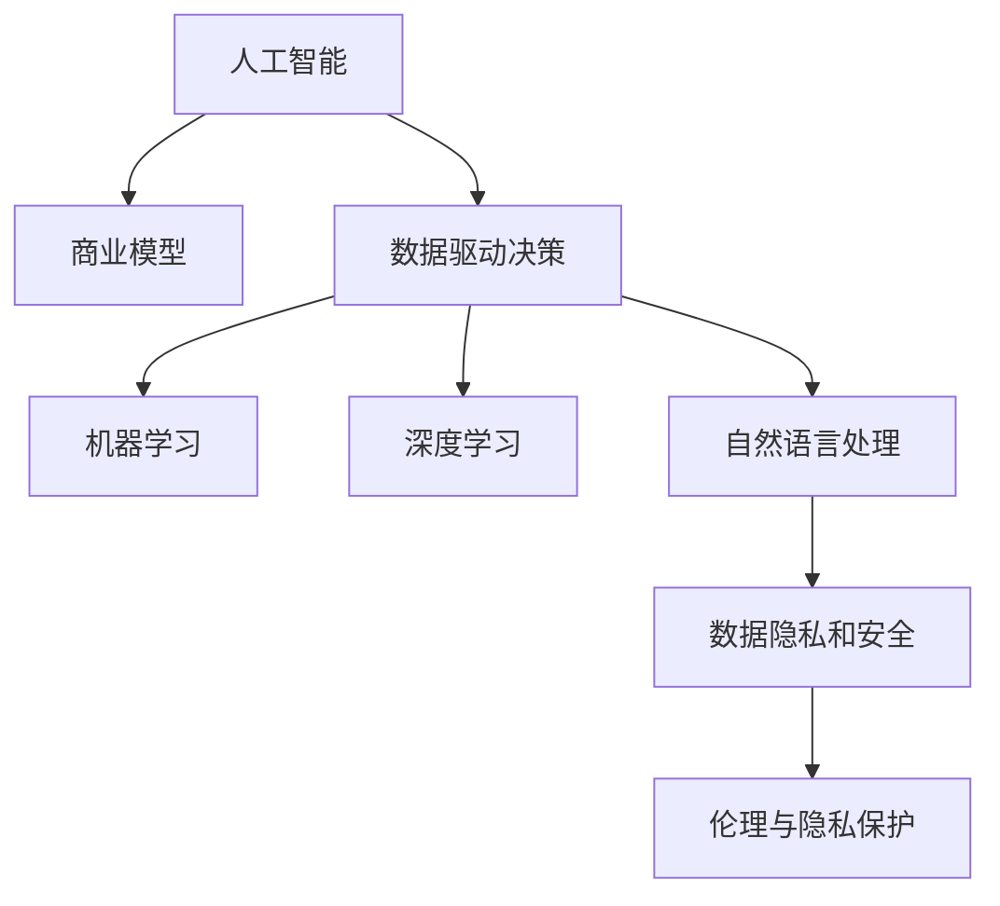

                 

## 1. 背景介绍

### 1.1 问题由来
人工智能（AI）技术自诞生以来，在科学研究和实际应用中取得了重大突破。然而，如何将AI技术应用于商业，使之与商业模式相结合，实现商业价值的最大化，成为了一个亟待解决的问题。特别是随着大数据和云计算技术的不断发展，AI技术在商业中的应用愈发广泛，但也面临着诸多挑战。

### 1.2 问题核心关键点
1. **AI技术的应用**：如何有效应用AI技术，解决商业问题，提升业务效率和效果。
2. **商业模式创新**：如何在商业模型中引入AI，实现商业模式的创新。
3. **数据驱动决策**：如何利用AI技术对海量数据进行分析和挖掘，指导商业决策。
4. **AI技术开发**：如何开发和部署高效的AI技术，支持商业应用。
5. **伦理与隐私保护**：如何在应用AI技术时，保证数据隐私和伦理规范。

### 1.3 问题研究意义
研究AI技术与商业模式的结合，对于推动企业数字化转型、提升产品和服务质量、优化资源配置、提高运营效率具有重要意义。具体来说：

- **提升竞争力**：AI技术可以助力企业更快响应市场需求，优化产品设计和生产流程，提升市场竞争力。
- **降低成本**：通过AI技术自动化处理重复性任务，减少人工错误，降低运营成本。
- **增强决策支持**：利用AI技术进行数据分析和预测，提供数据驱动的决策支持，帮助企业做出更科学的决策。
- **优化用户体验**：AI技术可以提供个性化推荐、智能客服等服务，提升用户体验。
- **促进创新**：AI技术为商业模式创新提供了新的手段和方法，推动产业升级。

## 2. 核心概念与联系

### 2.1 核心概念概述

1. **人工智能（AI）**：使用计算机技术和算法，使计算机系统具备某些类似人类的智能能力，如学习、推理、感知等。
2. **商业模型**：定义企业如何创造、交付和获取价值。主要包括产品和服务、客户、渠道、收入流等要素。
3. **数据驱动决策**：利用数据分析和挖掘技术，辅助企业进行决策，提高决策的科学性和准确性。
4. **机器学习（ML）**：一种AI技术，通过数据训练模型，使其能够自动学习和改进。
5. **深度学习（DL）**：一种机器学习技术，使用多层神经网络进行复杂模式识别和预测。
6. **自然语言处理（NLP）**：使计算机能够理解、处理和生成人类语言。
7. **数据隐私和安全**：保护数据不被未经授权的访问和使用，确保数据的安全性和隐私性。

这些概念之间的逻辑关系可以通过以下Mermaid流程图来展示：



这个流程图展示了这个主题的核心概念及其之间的关系：

1. 人工智能技术可以应用于商业模型，通过数据驱动决策提升业务效率。
2. 机器学习和深度学习是AI技术的重要分支，用于处理复杂的数据和模式。
3. 自然语言处理技术可以帮助企业处理和分析文本数据，提升商业智能。
4. 数据隐私和安全是AI技术应用中不可忽视的重要方面，必须加以保护。
5. 伦理与隐私保护是AI技术应用中的核心问题，需确保AI系统的透明性和可解释性。

## 3. 核心算法原理 & 具体操作步骤
### 3.1 算法原理概述

AI技术与商业模式的结合，本质上是将AI技术融入商业模型，利用AI技术优化业务流程、提升产品和服务质量、创造新的商业价值。这一过程涉及到数据采集、预处理、建模、训练、部署和优化等多个环节。

核心算法原理主要包括：

1. **数据驱动决策**：通过收集、清洗、分析和挖掘数据，辅助商业决策，提高决策的准确性和效率。
2. **机器学习和深度学习**：利用训练好的模型，对数据进行预测和分类，提升业务效率和效果。
3. **自然语言处理**：处理和分析文本数据，提升客户体验和市场营销效果。
4. **数据隐私和安全**：确保数据的安全性和隐私性，防止数据泄露和滥用。

### 3.2 算法步骤详解

AI技术与商业模式的结合一般包括以下几个关键步骤：

**Step 1: 数据采集与预处理**
- 收集与业务相关的数据，包括结构化和非结构化数据，如客户行为数据、销售记录、市场调研报告、社交媒体数据等。
- 对数据进行清洗、去重、格式转换等预处理，保证数据的完整性和一致性。

**Step 2: 数据建模**
- 根据业务需求，选择合适的算法和模型，如回归模型、分类模型、聚类模型等。
- 使用历史数据进行模型训练，调整模型参数，确保模型具有良好的泛化能力。

**Step 3: 模型部署与优化**
- 将训练好的模型部署到生产环境中，进行实际业务验证。
- 根据实际效果，调整模型参数，优化模型性能。

**Step 4: 数据分析与监控**
- 对生产环境中的数据进行实时监控，分析模型效果。
- 根据业务需求，定期调整模型，保持模型性能。

### 3.3 算法优缺点

AI技术与商业模式的结合具有以下优点：
1. 提升决策科学性：通过数据分析和建模，提高决策的准确性和效率。
2. 优化业务流程：利用AI技术自动化处理重复性任务，提升业务效率。
3. 提升客户体验：通过自然语言处理技术，提升客户服务质量和市场营销效果。
4. 促进商业模式创新：AI技术为商业模式创新提供了新的手段和方法。

同时，该方法也存在一定的局限性：
1. 数据质量要求高：模型效果依赖于数据质量，数据偏差或错误可能导致模型失效。
2. 模型复杂度高：深度学习等复杂模型对计算资源要求高，部署和优化难度大。
3. 隐私和安全风险：数据隐私和安全问题必须得到有效解决，防止数据泄露和滥用。
4. 技术门槛高：AI技术开发和部署需要专业知识和技能，一般企业难以独立完成。

尽管存在这些局限性，但就目前而言，AI技术与商业模式的结合仍是大势所趋，各大企业都在积极探索和应用AI技术，以提升竞争力和市场份额。

### 3.4 算法应用领域

AI技术与商业模式的结合在多个领域得到了广泛应用，以下是几个典型的应用场景：

1. **金融领域**：利用机器学习和深度学习进行风险评估、信用评分、欺诈检测等，提升金融服务质量和风险管理水平。
2. **零售行业**：利用自然语言处理进行情感分析、客户行为预测、推荐系统等，提升客户满意度和销售额。
3. **制造业**：利用机器学习和深度学习进行设备故障预测、质量控制、生产优化等，提升生产效率和产品质量。
4. **医疗健康**：利用机器学习和深度学习进行疾病预测、诊断、治疗方案优化等，提升医疗服务质量和效率。
5. **智能客服**：利用自然语言处理进行自动问答、情感分析、语音识别等，提升客户服务体验和效率。

这些应用场景展示了AI技术与商业模式的结合在多个行业中的广泛应用和巨大潜力。

## 4. 数学模型和公式 & 详细讲解 & 举例说明
### 4.1 数学模型构建

AI技术与商业模式的结合，在数学上可以通过各种模型来描述和优化。这里以回归模型为例，展示数据驱动决策的数学模型构建过程。

设回归问题为：已知历史数据集 $D=\{(x_i, y_i)\}_{i=1}^N$，其中 $x_i \in \mathbb{R}^d$ 为特征向量，$y_i \in \mathbb{R}$ 为标签值。目标为找到一个回归函数 $f(x; \theta)$，使得其预测值 $\hat{y} = f(x; \theta)$ 与真实标签值 $y_i$ 的误差最小化。

假设回归函数为线性函数，即：

$$
f(x; \theta) = \theta_0 + \sum_{i=1}^d \theta_i x_i
$$

则最小化误差 $\mathcal{L}(\theta)$ 可表示为：

$$
\mathcal{L}(\theta) = \frac{1}{N} \sum_{i=1}^N (y_i - f(x_i; \theta))^2
$$

通过梯度下降等优化算法，最小化损失函数 $\mathcal{L}(\theta)$，即可得到最优参数 $\theta^*$。

### 4.2 公式推导过程

以下是回归模型的推导过程：

1. **最小二乘法**：
   - 目标是最小化预测值与真实值之间的平方误差。
   - 对参数 $\theta$ 进行优化，使其满足：

$$
\theta^* = \mathop{\arg\min}_{\theta} \frac{1}{N} \sum_{i=1}^N (y_i - f(x_i; \theta))^2
$$

2. **梯度下降法**：
   - 使用梯度下降法求解目标函数的最小值。
   - 梯度向量为：

$$
\nabla_{\theta} \mathcal{L}(\theta) = \frac{1}{N} \sum_{i=1}^N 2(y_i - f(x_i; \theta)) x_i
$$

3. **求解最优参数**：
   - 通过迭代更新参数 $\theta$，求解目标函数的最小值：

$$
\theta = \theta - \eta \nabla_{\theta} \mathcal{L}(\theta)
$$

其中 $\eta$ 为学习率。

### 4.3 案例分析与讲解

以金融领域的信用评分为例，展示如何使用回归模型进行数据驱动决策：

1. **数据采集**：收集客户历史贷款数据、收入信息、信用记录等，构建数据集。
2. **数据预处理**：清洗数据，去除缺失值和异常值，进行特征工程。
3. **模型构建**：选择合适的回归模型，如线性回归、决策树回归等。
4. **模型训练**：使用历史数据进行模型训练，调整模型参数，确保模型具有良好的泛化能力。
5. **模型部署**：将训练好的模型部署到生产环境中，进行实际业务验证。
6. **模型优化**：根据实际效果，调整模型参数，优化模型性能。

通过以上步骤，金融机构可以实时评估客户的信用风险，提升贷款审批效率和质量。

## 5. 项目实践：代码实例和详细解释说明
### 5.1 开发环境搭建

在进行AI技术与商业模式结合的实践前，我们需要准备好开发环境。以下是使用Python进行Scikit-Learn开发的环境配置流程：

1. 安装Anaconda：从官网下载并安装Anaconda，用于创建独立的Python环境。

2. 创建并激活虚拟环境：
```bash
conda create -n my_env python=3.8 
conda activate my_env
```

3. 安装Scikit-Learn：
```bash
conda install scikit-learn
```

4. 安装其他相关库：
```bash
conda install pandas numpy matplotlib scikit-learn
```

完成上述步骤后，即可在`my_env`环境中开始实践。

### 5.2 源代码详细实现

这里我们以金融领域的信用评分为例，给出使用Scikit-Learn进行数据驱动决策的Python代码实现。

```python
from sklearn.linear_model import LinearRegression
from sklearn.metrics import mean_squared_error, r2_score
import pandas as pd
import numpy as np

# 加载数据集
data = pd.read_csv('credit_data.csv')

# 特征工程
X = data[['income', 'credit_score', 'loan_age', 'loan_amount']]
y = data['default']

# 划分训练集和测试集
X_train, X_test, y_train, y_test = train_test_split(X, y, test_size=0.2, random_state=42)

# 训练模型
model = LinearRegression()
model.fit(X_train, y_train)

# 预测
y_pred = model.predict(X_test)

# 评估模型
print('RMSE:', np.sqrt(mean_squared_error(y_test, y_pred)))
print('R^2:', r2_score(y_test, y_pred))
```

### 5.3 代码解读与分析

让我们再详细解读一下关键代码的实现细节：

**数据加载与预处理**：
- 使用Pandas库加载数据集，进行特征工程，如去除缺失值、特征标准化等。

**模型训练**：
- 使用Scikit-Learn库中的线性回归模型进行训练，调整模型参数，确保模型具有良好的泛化能力。

**模型评估**：
- 使用RMSE和R^2等评估指标，对模型效果进行评估。

**模型部署与优化**：
- 将训练好的模型部署到生产环境中，进行实际业务验证。
- 根据实际效果，调整模型参数，优化模型性能。

## 6. 实际应用场景
### 6.1 金融领域

在金融领域，AI技术与商业模式的结合可以应用于多个方面，如信用评分、欺诈检测、风险管理等。以信用评分为例，金融机构可以利用AI技术对客户的历史贷款数据进行分析，预测其还款能力，提高贷款审批效率和质量。

### 6.2 零售行业

在零售行业，AI技术与商业模式的结合可以应用于客户行为预测、商品推荐、营销策略优化等。通过分析客户购买历史和浏览记录，AI技术可以预测客户未来的购买行为，提供个性化的商品推荐，提升客户满意度和销售额。

### 6.3 制造业

在制造业，AI技术与商业模式的结合可以应用于设备故障预测、质量控制、生产优化等。通过分析设备的运行数据和历史维修记录，AI技术可以预测设备故障，提前进行维护，避免生产中断，提升生产效率和产品质量。

### 6.4 医疗健康

在医疗健康领域，AI技术与商业模式的结合可以应用于疾病预测、诊断、治疗方案优化等。通过分析患者的病历数据和基因信息，AI技术可以预测疾病风险，提供个性化的治疗方案，提升医疗服务质量和效率。

### 6.5 智能客服

在智能客服领域，AI技术与商业模式的结合可以应用于自动问答、情感分析、语音识别等。通过分析客户的历史咨询记录，AI技术可以自动回答常见问题，提升客户服务体验和效率。

### 6.6 未来应用展望

随着AI技术的不断进步，AI技术与商业模式的结合将进一步拓展其应用范围，带来更多的商业价值。未来，AI技术与商业模式结合将呈现以下几个发展趋势：

1. **智能化水平提升**：AI技术将进一步提升智能水平，通过更加复杂和高效的算法和模型，实现更精准的预测和决策。
2. **商业应用场景扩展**：AI技术将应用于更多商业领域，如智能制造、智慧医疗、智能交通等，推动各行各业的数字化转型。
3. **跨领域融合**：AI技术与更多前沿技术如区块链、物联网、量子计算等融合，带来更加创新和高效的商业解决方案。
4. **人机协同增强**：AI技术与人类专家进行更加紧密的协同，提升决策的科学性和可解释性。
5. **伦理与隐私保护**：AI技术的应用将更加注重伦理和隐私保护，确保数据安全和用户隐私。

## 7. 工具和资源推荐
### 7.1 学习资源推荐

为了帮助开发者系统掌握AI技术与商业模式的结合的理论基础和实践技巧，这里推荐一些优质的学习资源：

1. **《Python数据科学手册》**：详细介绍了Python在数据科学中的应用，包括机器学习、数据可视化等。
2. **《深度学习》课程**：由斯坦福大学开设的深度学习课程，有Lecture视频和配套作业，带你入门深度学习的基本概念和经典模型。
3. **Kaggle竞赛**：通过参与Kaggle数据科学竞赛，提升数据分析和模型构建能力，积累实战经验。
4. **TensorFlow官方文档**：TensorFlow库的官方文档，提供了海量的教程和样例，适合实战学习。
5. **Scikit-Learn官方文档**：Scikit-Learn库的官方文档，提供了丰富的机器学习模型和算法，适合理论学习。

通过对这些资源的学习实践，相信你一定能够快速掌握AI技术与商业模式的结合的精髓，并用于解决实际的商业问题。

### 7.2 开发工具推荐

高效的开发离不开优秀的工具支持。以下是几款用于AI技术与商业模式结合开发的常用工具：

1. **Jupyter Notebook**：交互式的编程环境，方便进行数据分析和模型构建。
2. **PyTorch**：基于Python的开源深度学习框架，支持动态计算图和GPU加速。
3. **TensorFlow**：由Google主导开发的开源深度学习框架，支持分布式训练和生产部署。
4. **Scikit-Learn**：Python中的机器学习库，提供了丰富的模型和算法，适合快速开发和部署。
5. **Matplotlib**：Python中的绘图库，用于绘制数据可视化图表，辅助决策分析。

合理利用这些工具，可以显著提升AI技术与商业模式结合的开发效率，加快创新迭代的步伐。

### 7.3 相关论文推荐

AI技术与商业模式的结合源于学界的持续研究。以下是几篇奠基性的相关论文，推荐阅读：

1. **《Google's AI Challenges》**：介绍谷歌在AI领域的挑战和进展，展示了AI技术在商业应用中的潜力。
2. **《Deep Learning for the NLP tasks》**：探讨深度学习在自然语言处理中的应用，推动AI技术在商业中的实际应用。
3. **《Machine Learning in Healthcare》**：讨论机器学习在医疗健康中的应用，提升医疗服务的智能化水平。
4. **《Data-Driven Business Models》**：探讨数据驱动商业模式的构建，提升企业决策的科学性和效率。
5. **《AI and Business Transformation》**：探讨AI技术在企业转型中的作用，推动商业模式的创新和升级。

这些论文代表了大规模AI技术与商业模式的结合的发展脉络。通过学习这些前沿成果，可以帮助研究者把握学科前进方向，激发更多的创新灵感。

## 8. 总结：未来发展趋势与挑战
### 8.1 总结

本文对AI技术与商业模式的结合进行了全面系统的介绍。首先阐述了AI技术在商业中的应用背景和意义，明确了AI技术与商业模式结合的重要性。其次，从原理到实践，详细讲解了数据驱动决策、机器学习、深度学习、自然语言处理等核心算法的原理和具体操作步骤，给出了AI技术与商业模式结合的完整代码实例。同时，本文还广泛探讨了AI技术与商业模式结合在金融、零售、制造业等多个行业领域的应用前景，展示了AI技术与商业模式结合的巨大潜力。此外，本文精选了AI技术与商业模式结合的学习资源，力求为读者提供全方位的技术指引。

通过本文的系统梳理，可以看到，AI技术与商业模式的结合正在成为企业数字化转型的重要手段，极大地提升企业决策的科学性和效率。未来，伴随AI技术的不断进步和商业模式的持续创新，相信AI技术与商业模式的结合必将在更多领域得到广泛应用，推动社会的数字化转型和智能化升级。

### 8.2 未来发展趋势

展望未来，AI技术与商业模式的结合将呈现以下几个发展趋势：

1. **智能化水平提升**：AI技术将进一步提升智能水平，通过更加复杂和高效的算法和模型，实现更精准的预测和决策。
2. **商业应用场景扩展**：AI技术将应用于更多商业领域，如智能制造、智慧医疗、智能交通等，推动各行各业的数字化转型。
3. **跨领域融合**：AI技术与更多前沿技术如区块链、物联网、量子计算等融合，带来更加创新和高效的商业解决方案。
4. **人机协同增强**：AI技术与人类专家进行更加紧密的协同，提升决策的科学性和可解释性。
5. **伦理与隐私保护**：AI技术的应用将更加注重伦理和隐私保护，确保数据安全和用户隐私。

以上趋势凸显了AI技术与商业模式的结合的广阔前景。这些方向的探索发展，必将进一步提升AI技术与商业模式的结合的效果，为构建智能化的商业系统提供更多可能。

### 8.3 面临的挑战

尽管AI技术与商业模式的结合已经取得了瞩目成就，但在迈向更加智能化、普适化应用的过程中，它仍面临着诸多挑战：

1. **数据质量要求高**：模型效果依赖于数据质量，数据偏差或错误可能导致模型失效。
2. **模型复杂度高**：深度学习等复杂模型对计算资源要求高，部署和优化难度大。
3. **隐私和安全风险**：数据隐私和安全问题必须得到有效解决，防止数据泄露和滥用。
4. **技术门槛高**：AI技术开发和部署需要专业知识和技能，一般企业难以独立完成。
5. **伦理与隐私保护**：AI技术的应用将更加注重伦理和隐私保护，确保数据安全和用户隐私。

尽管存在这些挑战，但就目前而言，AI技术与商业模式的结合仍是大势所趋，各大企业都在积极探索和应用AI技术，以提升竞争力和市场份额。

### 8.4 研究展望

面对AI技术与商业模式的结合所面临的种种挑战，未来的研究需要在以下几个方面寻求新的突破：

1. **探索无监督和半监督学习**：摆脱对大规模标注数据的依赖，利用自监督学习、主动学习等无监督和半监督范式，最大限度利用非结构化数据，实现更加灵活高效的AI技术应用。
2. **研究参数高效和计算高效的AI技术**：开发更加参数高效的AI技术，在固定大部分预训练参数的同时，只更新极少量的任务相关参数。同时优化AI技术的计算图，减少前向传播和反向传播的资源消耗，实现更加轻量级、实时性的部署。
3. **引入更多先验知识**：将符号化的先验知识，如知识图谱、逻辑规则等，与神经网络模型进行巧妙融合，引导AI技术学习更准确、合理的语言模型。同时加强不同模态数据的整合，实现视觉、语音等多模态信息与文本信息的协同建模。
4. **结合因果分析和博弈论工具**：将因果分析方法引入AI技术，识别出技术决策的关键特征，增强输出解释的因果性和逻辑性。借助博弈论工具刻画人机交互过程，主动探索并规避AI技术的脆弱点，提高系统稳定性。
5. **纳入伦理道德约束**：在AI技术开发和应用中，引入伦理导向的评估指标，过滤和惩罚有偏见、有害的输出倾向。同时加强人工干预和审核，建立技术行为的监管机制，确保AI技术应用的透明性和可解释性。

这些研究方向将引领AI技术与商业模式的结合向更高的台阶发展，为构建安全、可靠、可解释、可控的智能系统提供更多可能。面向未来，AI技术与商业模式的结合需要与其他人工智能技术进行更深入的融合，如知识表示、因果推理、强化学习等，多路径协同发力，共同推动AI技术与商业模式的结合的进步。只有勇于创新、敢于突破，才能不断拓展AI技术与商业模式的结合的边界，让智能技术更好地服务于商业和社会的各个方面。

## 9. 附录：常见问题与解答

**Q1：AI技术在商业中应用的主要挑战是什么？**

A: AI技术在商业中应用的主要挑战包括数据质量、模型复杂度、隐私安全、技术门槛、伦理与隐私保护等。数据质量问题可能导致模型失效，模型复杂度要求较高的计算资源，隐私安全问题需要有效解决，技术门槛较高，伦理与隐私保护也需要重视。

**Q2：AI技术如何帮助企业提升决策科学性？**

A: AI技术通过数据分析和建模，帮助企业从海量数据中提取有价值的信息，提供数据驱动的决策支持。通过机器学习和深度学习等算法，AI技术可以进行模式识别和预测，提升决策的准确性和效率。

**Q3：AI技术与商业模式的结合有哪些具体应用场景？**

A: AI技术与商业模式的结合在金融、零售、制造业、医疗健康、智能客服等领域都有广泛应用。如在金融领域，AI技术可以用于信用评分、欺诈检测等；在零售领域，AI技术可以用于客户行为预测、商品推荐等；在制造业，AI技术可以用于设备故障预测、质量控制等。

**Q4：如何确保AI技术的伦理与隐私保护？**

A: 在AI技术开发和应用中，需要引入伦理导向的评估指标，过滤和惩罚有偏见、有害的输出倾向。同时加强人工干预和审核，建立技术行为的监管机制，确保AI技术应用的透明性和可解释性。

**Q5：AI技术在企业中应用的效果如何？**

A: AI技术在企业中的应用效果显著，通过提升决策科学性、优化业务流程、提升客户体验等，帮助企业提高运营效率、降低成本、增强竞争力。例如，金融领域的企业通过AI技术实现信用评分，提升贷款审批效率和质量；零售领域的企业通过AI技术实现客户行为预测和个性化推荐，提升销售额和客户满意度。

总之，AI技术与商业模式的结合正在引领各行各业迈向智能化、数字化、个性化。通过合理应用AI技术，企业可以提升决策科学性、优化业务流程、提升客户体验，推动业务增长和市场竞争力的提升。面对未来，AI技术与商业模式的结合需要不断创新和突破，才能更好地服务于商业和社会的发展。

