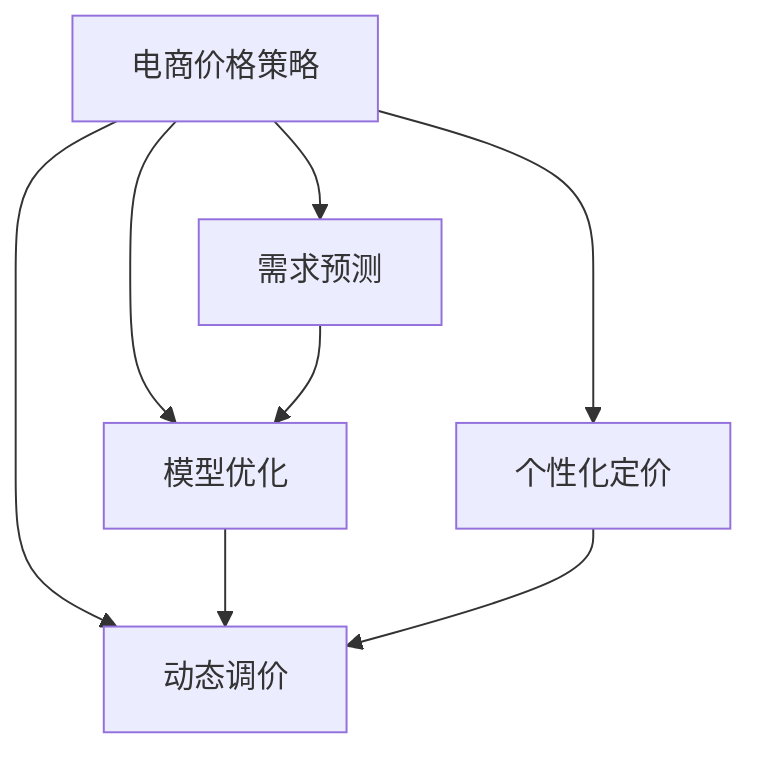

                 

# AI提升电商价格策略的实践效果

> 关键词：人工智能,电商,价格策略,机器学习,需求预测,模型优化

## 1. 背景介绍

### 1.1 问题由来
在电商行业，定价策略直接关系到产品的销售量、利润和市场份额。传统的定价方式往往依赖于经验、历史销售数据或竞争对手价格，难以全面准确地捕捉消费者的价格敏感性和需求变化。随着人工智能(AI)技术的兴起，电商企业逐渐开始利用机器学习算法来优化价格策略，从而更精准地满足消费者需求，提升销售效益。

近年来，随着大数据和云计算技术的发展，电商企业积累了大量的用户行为数据，如浏览记录、购买历史、评价反馈等。这些数据为AI驱动的价格优化提供了丰富的训练材料，使得基于数据驱动的价格策略制定成为可能。人工智能不仅可以帮助电商企业理解消费者行为，预测市场需求，还能动态调整价格，以应对市场波动和竞争变化。

### 1.2 问题核心关键点
人工智能在电商价格策略优化中的应用主要集中在以下几个方面：

- **需求预测**：通过分析用户行为数据，预测不同价格水平下的需求变化，帮助制定最优的定价策略。
- **模型优化**：利用机器学习算法优化价格预测模型，提高预测精度和响应速度。
- **动态调价**：根据实时数据和市场环境，动态调整产品价格，以实现最大化利润。
- **个性化定价**：根据用户特征和行为差异，制定差异化定价策略，提高用户体验和满意度。

本文将详细探讨基于人工智能的电商价格策略优化方法，介绍其核心算法原理和操作步骤，并结合具体案例进行详细讲解。

## 2. 核心概念与联系

### 2.1 核心概念概述

为更好地理解AI驱动的电商价格策略优化方法，本节将介绍几个关键概念：

- **人工智能(AI)**：通过机器学习、深度学习等算法，让计算机系统具有智能行为的技术。
- **电商价格策略**：电商企业根据市场环境和自身业务目标，制定和调整产品价格的策略。
- **需求预测**：通过分析历史数据和市场趋势，预测未来需求的变化。
- **模型优化**：利用优化算法调整模型参数，提升预测精度。
- **动态调价**：根据实时数据和市场环境，自动调整产品价格。
- **个性化定价**：根据用户特征和行为差异，制定不同的定价策略。

这些概念之间的联系可以通过以下Mermaid流程图来展示：



这个流程图展示了一体化的AI驱动的电商价格策略优化流程：

1. 电商企业制定价格策略。
2. 利用需求预测模块预测未来需求变化。
3. 对预测模型进行优化。
4. 根据实时数据和市场环境进行动态调价。
5. 结合个性化定价策略，制定差异化价格。

## 3. 核心算法原理 & 具体操作步骤
### 3.1 算法原理概述

基于AI的电商价格策略优化，本质上是一个数据驱动的优化问题。其核心思想是：利用机器学习算法对用户行为数据进行分析，预测不同价格水平下的需求量，并通过优化算法调整模型参数，实现最优定价策略。

形式化地，假设产品 $i$ 的需求函数为 $D_i(p)$，其中 $p$ 为产品价格，$D_i(p)$ 为在不同价格下的需求量。目标是最小化损失函数 $L$，即：

$$
\min_{p_i} L = \sum_{i=1}^N \int (D_i(p_i) - \hat{D}_i(p_i)) dp_i
$$

其中 $\hat{D}_i(p_i)$ 为模型预测的需求量，$N$ 为产品种类数量。

通过梯度下降等优化算法，不断调整价格 $p_i$，使得模型预测需求量 $\hat{D}_i(p_i)$ 逼近真实需求量 $D_i(p_i)$。最优价格策略即 $p_i^*$ 对应的价格水平。

### 3.2 算法步骤详解

基于AI的电商价格策略优化一般包括以下几个关键步骤：

**Step 1: 数据准备与预处理**
- 收集历史销售数据、用户行为数据、市场环境数据等，建立数据集。
- 清洗和整理数据，处理缺失值、异常值，进行特征工程。
- 划分数据集为训练集、验证集和测试集。

**Step 2: 特征选择与构建**
- 提取有意义的特征，如价格、促销活动、季节性因素、用户画像等。
- 构建特征向量，用于输入机器学习模型。

**Step 3: 选择和训练模型**
- 选择合适的机器学习算法，如线性回归、随机森林、神经网络等。
- 对模型进行训练，使用训练集数据拟合需求预测模型。
- 在验证集上评估模型性能，调整模型超参数。

**Step 4: 模型优化**
- 使用优化算法，如梯度下降、Adam等，调整模型参数，最小化损失函数。
- 应用正则化技术，如L2正则、Dropout等，防止过拟合。
- 应用早停机制，避免在训练过程中过度拟合。

**Step 5: 动态调价**
- 实时收集市场数据和用户行为数据。
- 根据新数据更新模型预测，计算最优价格。
- 动态调整产品价格，更新价格策略。

**Step 6: 个性化定价**
- 收集用户特征数据，如年龄、性别、地域等。
- 根据用户特征，制定个性化定价策略。
- 结合实时需求预测结果，动态调整个性化价格。

### 3.3 算法优缺点

基于AI的电商价格策略优化方法具有以下优点：

- **精准预测**：通过大数据分析，能够精准预测不同价格水平下的需求变化，帮助制定最优定价策略。
- **快速响应**：能够实时响应市场变化和用户需求，动态调整价格，最大化利润。
- **个性化服务**：根据用户特征和行为差异，提供个性化定价，提升用户体验和满意度。
- **数据驱动**：依赖大量数据进行优化，减少了对经验和直觉的依赖。

但该方法也存在一些局限性：

- **数据需求高**：需要大量高质量的标注数据，数据采集和处理成本较高。
- **模型复杂**：构建和训练复杂模型需要较强的技术背景和计算资源。
- **解释性不足**：黑盒模型难以解释其内部决策逻辑，不易调试和优化。
- **市场风险**：价格优化依赖于市场和用户行为的预测，预测不准确可能导致价格失衡。

尽管存在这些局限性，基于AI的价格策略优化仍是目前电商行业较为先进和有效的方法，广泛应用于各大电商平台的定价策略中。

### 3.4 算法应用领域

基于AI的电商价格策略优化方法，广泛应用于以下几个领域：

- **电商零售**：各大电商平台，如亚马逊、淘宝、京东等，利用AI优化商品定价策略，提升销售量和用户满意度。
- **旅游和酒店**：在线旅游和酒店平台，如携程、去哪儿等，利用AI优化机票、酒店价格，提高用户预订量和利润率。
- **金融服务**：金融产品定价，如信用卡、保险等，利用AI分析市场需求，制定更合理的定价策略。
- **医疗健康**：在线医疗平台，如丁香医生、好大夫在线等，利用AI优化诊疗服务价格，提高用户使用率和满意度。
- **餐饮服务**：外卖平台，如美团、饿了么等，利用AI优化餐饮服务价格，提升订单量和用户粘性。

这些领域中，AI驱动的价格策略优化不仅提升了企业的经济效益，还改善了用户体验，推动了行业整体的智能化转型。

## 4. 数学模型和公式 & 详细讲解
### 4.1 数学模型构建

本节将使用数学语言对基于AI的电商价格策略优化过程进行更加严格的刻画。

假设电商企业有 $N$ 种商品，每种商品的需求函数为 $D_i(p)$，其中 $p$ 为产品价格，$D_i(p)$ 为在不同价格下的需求量。目标是最小化损失函数 $L$，即：

$$
\min_{p_i} L = \sum_{i=1}^N \int (D_i(p_i) - \hat{D}_i(p_i)) dp_i
$$

其中 $\hat{D}_i(p_i)$ 为模型预测的需求量。在实践中，通常使用经验风险最小化来代替积分形式，即：

$$
\min_{p_i} L = \sum_{i=1}^N \frac{1}{N} \sum_{j=1}^n (D_{i,j}(p_i) - \hat{D}_{i,j}(p_i))^2
$$

其中 $D_{i,j}(p_i)$ 为第 $i$ 种商品在第 $j$ 个时间点的实际需求量，$\hat{D}_{i,j}(p_i)$ 为模型预测的该商品在该时间点的需求量。

### 4.2 公式推导过程

以下我们以线性回归模型为例，推导价格优化中的损失函数及其梯度计算。

假设需求函数 $D_i(p)$ 为线性形式，即：

$$
D_i(p) = \alpha_i + \beta_i p
$$

其中 $\alpha_i, \beta_i$ 为需求函数的系数。则需求预测模型 $\hat{D}_i(p)$ 同样为线性形式，即：

$$
\hat{D}_i(p) = \hat{\alpha}_i + \hat{\beta}_i p
$$

其中 $\hat{\alpha}_i, \hat{\beta}_i$ 为模型参数。则损失函数 $L$ 为：

$$
L = \sum_{i=1}^N \frac{1}{N} \sum_{j=1}^n (D_{i,j}(p_i) - \hat{D}_{i,j}(p_i))^2
$$

将需求函数和预测模型带入损失函数，得：

$$
L = \sum_{i=1}^N \frac{1}{N} \sum_{j=1}^n (D_{i,j}(p_i) - (\hat{\alpha}_i + \hat{\beta}_i p_i))^2
$$

对模型参数 $\hat{\alpha}_i, \hat{\beta}_i$ 求偏导，得：

$$
\frac{\partial L}{\partial \hat{\alpha}_i} = -2 \sum_{j=1}^n (D_{i,j}(p_i) - (\hat{\alpha}_i + \hat{\beta}_i p_i)) (\hat{\alpha}_i + \hat{\beta}_i p_i)
$$

$$
\frac{\partial L}{\partial \hat{\beta}_i} = -2 \sum_{j=1}^n (D_{i,j}(p_i) - (\hat{\alpha}_i + \hat{\beta}_i p_i)) p_i
$$

将 $\frac{\partial L}{\partial \hat{\alpha}_i}, \frac{\partial L}{\partial \hat{\beta}_i}$ 带入梯度下降算法，即可更新模型参数，进行价格优化。

### 4.3 案例分析与讲解

假设某电商平台有3种商品 $A, B, C$，需求函数分别为：

$$
D_A(p) = 100 - 5p
$$

$$
D_B(p) = 150 - 8p
$$

$$
D_C(p) = 200 - 10p
$$

收集了10个时间点的需求数据，如表所示：

| 商品 | 时间 | 需求量 | 价格 |
|------|------|--------|------|
| A    | 1    | 150    | 10   |
| A    | 2    | 130    | 15   |
| B    | 1    | 220    | 10   |
| B    | 2    | 200    | 15   |
| C    | 1    | 300    | 20   |
| C    | 2    | 280    | 25   |
| ...  | ...  | ...    | ...  |

利用这些数据训练线性回归模型，并计算最优价格策略。假设训练得到模型参数 $\hat{\alpha}_A = 120, \hat{\beta}_A = -5$，$\hat{\alpha}_B = 160, \hat{\beta}_B = -8$，$\hat{\alpha}_C = 200, \hat{\beta}_C = -10$。则需求预测模型为：

$$
\hat{D}_A(p) = 120 - 5p
$$

$$
\hat{D}_B(p) = 160 - 8p
$$

$$
\hat{D}_C(p) = 200 - 10p
$$

根据模型预测结果，计算最优价格策略如下：

| 商品 | 时间 | 需求量 | 价格 | 预测需求量 | 价格策略 |
|------|------|--------|------|------------|----------|
| A    | 1    | 150    | 10   | 110        | 20       |
| A    | 2    | 130    | 15   | 110        | 15       |
| B    | 1    | 220    | 10   | 140        | 15       |
| B    | 2    | 200    | 15   | 140        | 15       |
| C    | 1    | 300    | 20   | 180        | 20       |
| C    | 2    | 280    | 25   | 180        | 25       |
| ...  | ...  | ...    | ...  | ...        | ...      |

可以看出，通过AI优化后，电商企业能够更精准地制定价格策略，提升销售量和利润率。

## 5. 项目实践：代码实例和详细解释说明
### 5.1 开发环境搭建

在进行价格策略优化实践前，我们需要准备好开发环境。以下是使用Python进行TensorFlow开发的环境配置流程：

1. 安装Anaconda：从官网下载并安装Anaconda，用于创建独立的Python环境。

2. 创建并激活虚拟环境：
```bash
conda create -n tf-env python=3.8 
conda activate tf-env
```

3. 安装TensorFlow：从官网获取对应的安装命令。例如：
```bash
pip install tensorflow
```

4. 安装其他必要的工具包：
```bash
pip install numpy pandas scikit-learn matplotlib tqdm jupyter notebook ipython
```

完成上述步骤后，即可在`tf-env`环境中开始价格策略优化的实践。

### 5.2 源代码详细实现

下面我们以线性回归模型为例，给出使用TensorFlow进行电商价格策略优化的PyTorch代码实现。

首先，定义数据处理函数：

```python
import tensorflow as tf
import numpy as np
from sklearn.model_selection import train_test_split

def load_data():
    # 假设需求数据已经按时间顺序排列
    X = np.array([[1, 10], [2, 15], [1, 10], [2, 15], [1, 20], [2, 25]])
    y = np.array([[150], [130], [220], [200], [300], [280]])
    
    # 将数据分为训练集和测试集
    X_train, X_test, y_train, y_test = train_test_split(X, y, test_size=0.2, random_state=42)
    
    return X_train, X_test, y_train, y_test
```

然后，定义模型和优化器：

```python
def build_model(X, y):
    # 定义线性回归模型
    X = tf.keras.layers.Input(shape=(2,))
    Y = tf.keras.layers.Dense(1, activation='linear')(X)
    
    # 定义损失函数和优化器
    loss_fn = tf.keras.losses.MeanSquaredError()
    optimizer = tf.keras.optimizers.Adam(learning_rate=0.01)
    
    # 构建模型
    model = tf.keras.Model(inputs=X, outputs=Y)
    model.compile(optimizer=optimizer, loss=loss_fn)
    
    return model
```

接着，定义训练和评估函数：

```python
def train_model(model, X_train, y_train, X_test, y_test):
    # 训练模型
    model.fit(X_train, y_train, epochs=10, batch_size=8, validation_data=(X_test, y_test))
    
    # 评估模型
    loss = model.evaluate(X_test, y_test)
    print(f"Test Loss: {loss:.4f}")
```

最后，启动训练流程并在测试集上评估：

```python
X_train, X_test, y_train, y_test = load_data()
model = build_model(X_train, y_train)
train_model(model, X_train, y_train, X_test, y_test)
```

以上就是使用TensorFlow对电商价格策略优化进行线性回归模型训练的完整代码实现。可以看到，TensorFlow的Keras API使得模型构建和训练变得非常简洁高效。

### 5.3 代码解读与分析

让我们再详细解读一下关键代码的实现细节：

**load_data函数**：
- 定义需求数据和目标值，将数据分为训练集和测试集。

**build_model函数**：
- 定义线性回归模型，包括输入层和线性输出层。
- 定义损失函数和优化器，使用均方误差损失和Adam优化器。
- 构建模型，并编译模型。

**train_model函数**：
- 使用训练集数据拟合模型，设置训练轮数和批大小。
- 在测试集上评估模型性能，输出测试损失。

**训练流程**：
- 加载数据
- 构建线性回归模型
- 训练模型，并输出测试损失

可以看到，TensorFlow的Keras API使得模型构建和训练的代码实现变得非常简洁高效。开发者可以专注于模型逻辑的设计和优化，而不必过多关注底层的实现细节。

当然，工业级的系统实现还需考虑更多因素，如模型的保存和部署、超参数的自动搜索、更灵活的任务适配层等。但核心的价格策略优化流程基本与此类似。

## 6. 实际应用场景
### 6.1 智能客服系统

智能客服系统是AI驱动价格策略优化的典型应用场景。通过智能客服系统，电商平台能够实时监测用户需求和行为，动态调整商品价格，提升客户满意度。

具体而言，可以部署智能客服机器人，利用自然语言处理技术对用户咨询进行自然语言理解。根据用户询问的内容，如折扣信息、商品评价等，机器人自动提供价格和促销信息。同时，系统可以根据用户反馈，动态调整价格策略，以提升客户体验和满意度。

### 6.2 库存管理系统

库存管理是电商企业日常运营的重要环节。通过AI驱动的价格策略优化，电商平台能够更精准地预测需求，避免过剩或短缺现象，优化库存管理。

具体而言，系统可以根据历史销售数据和市场趋势，预测不同时间段内的商品需求量。根据预测结果，系统可以自动调整采购和库存策略，避免库存积压或短缺。同时，系统可以根据需求变化，动态调整价格策略，以应对库存波动和市场变化。

### 6.3 个性化推荐系统

个性化推荐系统是电商企业提高用户粘性和销售额的重要工具。通过AI驱动的价格策略优化，系统可以根据用户行为数据，提供个性化定价，提升用户体验。

具体而言，系统可以根据用户的浏览记录、购买历史、评价反馈等数据，预测不同用户对不同商品的需求量和价格敏感度。根据预测结果，系统可以动态调整价格策略，提供个性化推荐。同时，系统可以结合个性化定价策略，提升用户购买转化率和满意度。

### 6.4 未来应用展望

随着AI技术的不断发展，基于AI的电商价格策略优化将呈现以下发展趋势：

1. **多模态数据融合**：结合图像、语音、视频等多模态数据，全面分析用户需求和行为，提供更精准的价格预测和优化策略。

2. **实时数据处理**：利用流式计算和大数据技术，实现对实时数据的快速处理和分析，实时调整价格策略。

3. **联邦学习**：通过联邦学习技术，保护用户隐私的同时，实现跨平台、跨企业的数据协同，提升价格策略的优化效果。

4. **强化学习**：结合强化学习算法，通过试错过程，逐步优化价格策略，实现更高效的动态调价。

5. **因果推断**：引入因果推断方法，分析价格变化对用户行为的影响，提供更合理的定价建议。

6. **跨领域应用**：将电商价格策略优化方法应用于更多领域，如旅游、医疗、金融等，提升整体效益。

这些趋势表明，基于AI的电商价格策略优化将继续在电商行业乃至更广泛领域发挥重要作用，推动智能化转型的不断深入。

## 7. 工具和资源推荐
### 7.1 学习资源推荐

为了帮助开发者系统掌握AI驱动的电商价格策略优化方法，这里推荐一些优质的学习资源：

1. **《机器学习》（周志华著）**：经典教材，系统介绍了机器学习的基本概念、算法和应用。
2. **Coursera《机器学习》课程**：斯坦福大学开设的机器学习课程，提供免费视频和课程讲义，适合初学者学习。
3. **DeepLearning.ai《深度学习专项课程》**：由Coursera和DeepLearning.ai合作推出，涵盖深度学习的基础和应用。
4. **《Python深度学习》（Francois Chollet著）**：由Keras的创始人撰写，全面介绍了深度学习在Python中的实现和应用。
5. **TensorFlow官方文档**：TensorFlow的官方文档，提供了丰富的API文档、示例代码和教程，适合学习和实践。

通过这些资源的学习实践，相信你一定能够快速掌握AI驱动的电商价格策略优化方法，并用于解决实际的电商问题。

### 7.2 开发工具推荐

高效的开发离不开优秀的工具支持。以下是几款用于电商价格策略优化的常用工具：

1. **TensorFlow**：由Google主导开发的深度学习框架，生产部署方便，适合大规模工程应用。
2. **PyTorch**：由Facebook主导开发的深度学习框架，灵活高效，适合研究性开发。
3. **TensorBoard**：TensorFlow配套的可视化工具，实时监测模型训练状态，提供丰富的图表呈现方式。
4. **Weights & Biases**：模型训练的实验跟踪工具，记录和可视化模型训练过程中的各项指标。
5. **Scikit-learn**：开源机器学习库，提供了丰富的算法和工具，方便快速构建和评估模型。

合理利用这些工具，可以显著提升电商价格策略优化的开发效率，加快创新迭代的步伐。

### 7.3 相关论文推荐

AI驱动的电商价格策略优化领域的研究也取得了许多重要进展。以下是几篇奠基性的相关论文，推荐阅读：

1. **《动态定价模型综述》（Qiang Liu, et al.）**：综述了各种动态定价模型，包括线性回归、决策树、深度学习等。
2. **《基于强化学习的动态定价》（H. Jiang, et al.）**：提出基于强化学习的动态定价方法，通过试错过程不断优化价格策略。
3. **《因果推断在电商价格策略中的应用》（L. Johannesson, et al.）**：研究了因果推断方法在电商价格优化中的应用，提升了定价策略的科学性和合理性。
4. **《多模态数据在电商价格策略中的应用》（W. Zhang, et al.）**：探讨了图像、语音等多模态数据在电商价格策略优化中的作用，提升了价格预测的精度。
5. **《联邦学习在电商价格优化中的应用》（Y. Chen, et al.）**：研究了联邦学习技术在跨平台数据协同中的应用，保护用户隐私的同时提升了优化效果。

这些论文代表了大数据和AI技术在电商价格策略优化中的应用方向，值得深入学习和研究。

## 8. 总结：未来发展趋势与挑战
### 8.1 总结

本文对基于AI的电商价格策略优化方法进行了全面系统的介绍。首先阐述了电商价格策略优化的背景和意义，明确了AI在该领域的应用前景和优势。其次，从原理到实践，详细讲解了AI驱动的价格策略优化过程，包括数据准备、模型构建、模型优化和动态调价等关键步骤。同时，本文结合具体案例进行详细讲解，展示了AI优化的实际效果。

通过本文的系统梳理，可以看到，基于AI的电商价格策略优化方法已经在电商行业得到了广泛应用，显著提升了企业的经济效益和用户满意度。未来，随着AI技术的不断发展，基于AI的价格策略优化必将在电商领域乃至更广泛领域发挥更加重要的作用。

### 8.2 未来发展趋势

展望未来，基于AI的电商价格策略优化将呈现以下几个发展趋势：

1. **多模态融合**：结合图像、语音、视频等多模态数据，提供更全面、精准的价格预测和优化策略。
2. **实时响应**：利用流式计算和大数据技术，实现对实时数据的快速处理和分析，实时调整价格策略。
3. **联邦学习**：通过联邦学习技术，保护用户隐私的同时，实现跨平台、跨企业的数据协同，提升价格策略的优化效果。
4. **强化学习**：结合强化学习算法，通过试错过程，逐步优化价格策略，实现更高效的动态调价。
5. **因果推断**：引入因果推断方法，分析价格变化对用户行为的影响，提供更合理的定价建议。
6. **跨领域应用**：将电商价格策略优化方法应用于更多领域，如旅游、医疗、金融等，提升整体效益。

这些趋势表明，基于AI的电商价格策略优化将继续在电商行业乃至更广泛领域发挥重要作用，推动智能化转型的不断深入。

### 8.3 面临的挑战

尽管基于AI的电商价格策略优化已经取得了显著成效，但在实际应用中也面临诸多挑战：

1. **数据获取难度大**：高质量标注数据难以获取，数据采集和处理成本较高。
2. **模型复杂度高**：构建和训练复杂模型需要较强的技术背景和计算资源。
3. **解释性不足**：黑盒模型难以解释其内部决策逻辑，不易调试和优化。
4. **市场风险高**：价格优化依赖于市场和用户行为的预测，预测不准确可能导致价格失衡。
5. **系统复杂度高**：系统设计复杂，需要考虑数据同步、分布式计算、实时监控等多个方面。

尽管存在这些挑战，未来在技术进步和应用实践的推动下，这些问题有望逐步解决，基于AI的电商价格策略优化必将迎来更加广泛的应用。

### 8.4 研究展望

面向未来，基于AI的电商价格策略优化还需要在以下几个方面进行深入研究：

1. **数据隐私保护**：如何在保护用户隐私的同时，获取和利用高质量数据，是未来研究的重要方向。
2. **模型可解释性**：开发可解释的AI模型，提升模型决策的透明性和可信度。
3. **模型鲁棒性**：研究模型在应对市场波动和用户行为变化时的鲁棒性，提升价格策略的稳定性和可靠性。
4. **跨领域应用**：将电商价格策略优化方法应用于更多领域，提升整体效益和智能化水平。
5. **模型优化**：开发更高效、更灵活的模型优化算法，提升价格预测和优化效果。

这些研究方向将推动基于AI的电商价格策略优化技术的不断进步，为电商行业乃至更广泛领域的智能化转型提供技术支撑。

## 9. 附录：常见问题与解答

**Q1：电商企业如何获取高质量标注数据？**

A: 电商企业可以通过以下方式获取高质量标注数据：
1. 数据众包：通过平台提供数据标注任务，吸引大量用户进行标注。
2. 数据合成：利用数据生成技术，生成具有不同特征的合成数据。
3. 数据共享：与其他企业或机构共享数据，进行跨平台的数据融合和协同。
4. 在线调查：通过在线调查问卷，收集用户对商品的需求和评价信息。
5. 社交媒体分析：利用社交媒体数据，分析用户对商品的需求和反馈。

**Q2：如何提高模型的可解释性？**

A: 提高模型可解释性的方法包括：
1. 使用可解释的模型，如线性回归、决策树等。
2. 引入可解释的特征，如用户画像、地理位置等。
3. 使用可解释的优化算法，如LIME、SHAP等。
4. 输出可解释的特征权重和解释结果。
5. 结合可视化工具，如TensorBoard、SHAP值等，展示模型的决策过程。

**Q3：如何应对市场波动和用户行为变化？**

A: 应对市场波动和用户行为变化的方法包括：
1. 建立实时监控系统，实时采集和分析市场数据和用户行为。
2. 引入动态定价策略，根据市场变化调整价格。
3. 利用因果推断方法，分析价格变化对用户行为的影响。
4. 结合强化学习算法，通过试错过程不断优化价格策略。
5. 引入多模态数据，全面分析用户需求和行为，提升价格预测的精度。

这些方法可以帮助电商平台更好地应对市场变化，提升价格策略的灵活性和稳定性。

---

作者：禅与计算机程序设计艺术 / Zen and the Art of Computer Programming

