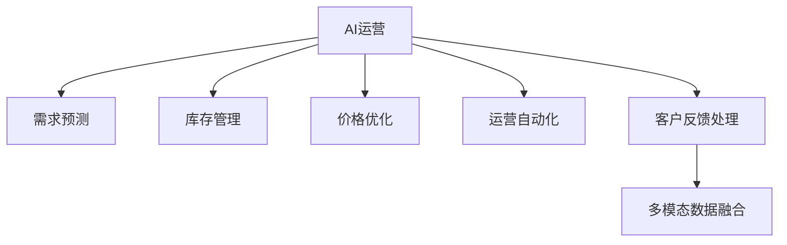

                 

## 1. 背景介绍

随着电子商务的迅猛发展，电商平台在现代经济活动中占据了越来越重要的地位。各大电商平台的运营效率直接影响到其市场竞争力和盈利能力。然而，电商平台运营的复杂性和多变性，使得传统的运营方法难以应对。AI技术的兴起，特别是深度学习算法，为电商平台运营效率的提升提供了新的契机。

### 1.1 问题由来

电商平台的运营过程中，存在以下几个主要问题：

- **客户需求变化快**：电商平台需要及时了解和响应客户的消费习惯和需求变化。
- **库存管理复杂**：库存需要动态调整，以最大化利润和减少损失。
- **价格竞争激烈**：电商平台需要实时监控竞争对手的价格策略，调整自身价格。
- **运营效率低下**：传统的运营方法往往基于经验和规则，难以快速迭代优化。

针对上述问题，AI技术可以通过数据分析、预测建模、自动化控制等手段，实现更智能、高效、灵活的运营管理。

### 1.2 问题核心关键点

要提升电商平台运营效率，AI技术需要在以下几个关键点取得突破：

- **需求预测**：准确预测客户需求，指导库存和价格调整。
- **库存管理**：动态优化库存，减少缺货和积压。
- **价格优化**：实时调整价格策略，把握市场竞争优势。
- **运营自动化**：通过自动化流程，提高运营效率，降低人工成本。
- **客户反馈处理**：快速响应客户反馈，改善用户体验。

这些关键点互为关联，共同构成了电商平台AI运营的基础框架。

### 1.3 问题研究意义

研究和应用AI技术提升电商平台运营效率，对于电商平台的长期发展具有重要意义：

- **提升竞争力**：通过精准需求预测、动态库存管理、实时价格优化等手段，提高市场竞争力。
- **降低成本**：自动化流程可以减少人工干预，降低运营成本。
- **优化用户体验**：快速响应客户反馈，提供更好的购物体验。
- **数据驱动决策**：基于数据驱动的运营决策，减少主观偏差，提升决策质量。
- **持续创新**：AI技术可以持续迭代优化，推动平台不断创新。

## 2. 核心概念与联系

### 2.1 核心概念概述

为更好地理解AI如何提升电商平台运营效率，本节将介绍几个密切相关的核心概念：

- **AI运营**：利用人工智能技术，对电商平台进行自动化、智能化管理，以提升运营效率。
- **需求预测**：通过分析历史数据和趋势，预测未来的客户需求，指导库存和价格调整。
- **库存管理**：动态优化库存水平，以最大化利润和减少损失。
- **价格优化**：实时监控市场动态，调整自身价格策略，把握竞争优势。
- **运营自动化**：将AI技术融入电商平台的各个环节，实现自动化流程，提高效率。
- **客户反馈处理**：快速响应用户反馈，改善用户体验，提升客户满意度。
- **多模态数据融合**：将图像、视频、文本等多种数据源进行融合，提高数据质量。

这些核心概念之间的逻辑关系可以通过以下Mermaid流程图来展示：



这个流程图展示了大语言模型的核心概念及其之间的关系：

1. AI运营是整个系统的核心，通过需求预测、库存管理、价格优化、运营自动化、客户反馈处理等多方面的提升，实现整体运营效率的提高。
2. 需求预测是基础，通过预测客户需求，指导库存和价格策略的调整。
3. 库存管理和价格优化是关键，通过动态调整库存和价格，优化运营成本和利润。
4. 运营自动化和客户反馈处理是保障，通过自动化流程和快速响应客户反馈，提高效率和满意度。
5. 多模态数据融合是补充，通过融合多种数据源，提升数据质量，支持更精准的预测和管理。

## 3. 核心算法原理 & 具体操作步骤

### 3.1 算法原理概述

AI提升电商平台运营效率的核心在于利用深度学习算法进行数据驱动的决策。其核心思想是：通过大数据分析，挖掘客户行为模式和市场趋势，构建预测模型，指导库存、价格和运营策略的调整。

形式化地，假设电商平台的历史销售数据为 $D=\{(x_i, y_i)\}_{i=1}^N$，其中 $x_i$ 为历史销售数据特征，$y_i$ 为对应的销售量。目标是构建一个预测模型 $M$，使得 $M(x_i) \approx y_i$。具体步骤如下：

1. **数据预处理**：清洗、归一化数据，生成训练集和测试集。
2. **特征工程**：提取、选择、构建特征。
3. **模型训练**：选择合适的算法和超参数，训练预测模型。
4. **模型评估**：在测试集上评估模型性能。
5. **模型应用**：将训练好的模型应用到实时数据，进行预测和决策。

### 3.2 算法步骤详解

以下是AI提升电商平台运营效率的详细操作步骤：

**Step 1: 数据准备**

- **数据获取**：收集电商平台的销售数据、用户行为数据、市场趋势数据等。
- **数据清洗**：去除噪声、缺失值，保证数据质量。
- **数据划分**：将数据划分为训练集、验证集和测试集。

**Step 2: 特征工程**

- **特征提取**：从销售数据中提取关键特征，如销量、价格、促销活动、季节性等。
- **特征选择**：选择对销售量影响较大的特征，去除无关特征。
- **特征构建**：构建新的特征，如滚动平均、交叉特征等。

**Step 3: 模型训练**

- **选择模型**：选择适合的深度学习模型，如线性回归、决策树、神经网络等。
- **超参数调优**：使用网格搜索、随机搜索等方法，调整模型超参数，优化模型性能。
- **模型训练**：使用训练集数据，训练模型，最小化损失函数。

**Step 4: 模型评估**

- **损失函数**：计算模型在验证集上的损失函数，评估模型性能。
- **模型选择**：选择性能最优的模型进行进一步评估。
- **模型优化**：根据评估结果，调整模型结构或超参数，进一步优化模型。

**Step 5: 模型应用**

- **实时预测**：将训练好的模型应用到实时销售数据，进行预测。
- **决策支持**：根据预测结果，制定库存和价格策略。
- **运营优化**：实时监控和调整运营流程，提高效率。

### 3.3 算法优缺点

AI提升电商平台运营效率的算法具有以下优点：

- **自动化**：自动化流程减少了人工干预，提高效率。
- **实时性**：实时数据处理，快速响应市场变化。
- **精准性**：基于数据驱动的决策，提高预测准确度。
- **可扩展性**：模型可快速扩展到不同电商平台和产品。

同时，该算法也存在以下缺点：

- **数据依赖**：模型性能高度依赖于数据质量，数据缺失或噪声可能影响预测准确度。
- **复杂度**：模型结构和超参数调优复杂，需要专业知识和技能。
- **成本高**：初期数据准备和模型训练成本较高。
- **解释性差**：深度学习模型的决策过程难以解释，缺乏透明性。

尽管存在这些局限性，但AI技术在电商平台中的应用已经取得显著成效，未来有望进一步提升运营效率。

### 3.4 算法应用领域

AI提升电商平台运营效率的算法，主要应用于以下几个领域：

- **需求预测**：通过分析历史销售数据和市场趋势，预测未来的销售需求，指导库存和价格策略。
- **库存管理**：动态调整库存水平，避免积压和缺货。
- **价格优化**：实时监控市场动态，调整自身价格策略，把握竞争优势。
- **运营自动化**：通过自动化流程，提高运营效率，降低人工成本。
- **客户反馈处理**：快速响应用户反馈，改善用户体验。

这些领域的应用展示了AI技术在电商平台中的广阔前景。

## 4. 数学模型和公式 & 详细讲解 & 举例说明

### 4.1 数学模型构建

本节将使用数学语言对AI提升电商平台运营效率的算法进行更加严格的刻画。

假设电商平台的历史销售数据为 $D=\{(x_i, y_i)\}_{i=1}^N$，其中 $x_i$ 为历史销售数据特征，$y_i$ 为对应的销售量。目标是在给定特征 $x_i$ 的情况下，预测销售量 $y_i$。

我们采用线性回归模型来构建预测模型：

$$
y_i = w_0 + \sum_{j=1}^d w_j x_{ij} + \epsilon_i
$$

其中 $w_0, w_1, ..., w_d$ 为模型参数，$\epsilon_i$ 为随机误差项。

### 4.2 公式推导过程

以下我们以线性回归模型为例，推导其预测和损失函数的计算公式。

首先，我们需要计算模型参数 $w$ 的估计值：

$$
\hat{w} = \arg\min_{w} \frac{1}{N} \sum_{i=1}^N (y_i - \hat{y}_i)^2
$$

其中 $\hat{y}_i = w_0 + \sum_{j=1}^d w_j x_{ij}$ 为模型对销售量的预测值。

将预测值代入损失函数：

$$
\mathcal{L}(\hat{w}) = \frac{1}{N} \sum_{i=1}^N (y_i - \hat{y}_i)^2
$$

对 $\hat{w}$ 求导，得到梯度：

$$
\nabla_{\hat{w}}\mathcal{L}(\hat{w}) = \frac{2}{N} \sum_{i=1}^N (y_i - \hat{y}_i) x_{ij}
$$

使用梯度下降等优化算法，更新模型参数：

$$
\hat{w} \leftarrow \hat{w} - \eta \nabla_{\hat{w}}\mathcal{L}(\hat{w})
$$

其中 $\eta$ 为学习率，控制参数更新的步长。

### 4.3 案例分析与讲解

以库存管理为例，我们将预测模型的输出用于指导库存决策。

假设库存量 $I_t$ 与销售量 $y_t$ 之间存在线性关系：

$$
I_{t+1} = I_t + \Delta y_t
$$

其中 $\Delta y_t = \alpha I_t + \beta y_t + \epsilon_t$，$\alpha$ 和 $\beta$ 为模型的参数。

将销售量 $y_t$ 代入预测模型：

$$
\hat{y}_t = w_0 + \sum_{j=1}^d w_j x_{tj}
$$

则库存量的调整公式为：

$$
I_{t+1} = I_t + \alpha \hat{y}_t + \beta y_t
$$

该公式将库存调整与销售量预测结合起来，实现了动态优化库存管理。

## 5. 项目实践：代码实例和详细解释说明

### 5.1 开发环境搭建

在进行AI提升电商平台运营效率的实践前，我们需要准备好开发环境。以下是使用Python进行PyTorch开发的环境配置流程：

1. 安装Anaconda：从官网下载并安装Anaconda，用于创建独立的Python环境。

2. 创建并激活虚拟环境：
```bash
conda create -n pytorch-env python=3.8 
conda activate pytorch-env
```

3. 安装PyTorch：根据CUDA版本，从官网获取对应的安装命令。例如：
```bash
conda install pytorch torchvision torchaudio cudatoolkit=11.1 -c pytorch -c conda-forge
```

4. 安装TensorFlow：
```bash
conda install tensorflow -c anaconda
```

5. 安装各类工具包：
```bash
pip install numpy pandas scikit-learn matplotlib tqdm jupyter notebook ipython
```

完成上述步骤后，即可在`pytorch-env`环境中开始AI提升电商平台运营效率的实践。

### 5.2 源代码详细实现

下面我们以需求预测任务为例，给出使用PyTorch进行线性回归模型的PyTorch代码实现。

首先，定义需求预测任务的训练函数：

```python
import torch
import torch.nn as nn
import torch.optim as optim
from sklearn.model_selection import train_test_split

class LinearRegression(nn.Module):
    def __init__(self, input_dim):
        super(LinearRegression, self).__init__()
        self.linear = nn.Linear(input_dim, 1)

    def forward(self, x):
        return self.linear(x)

def train_model(model, train_x, train_y, learning_rate, epochs):
    criterion = nn.MSELoss()
    optimizer = optim.SGD(model.parameters(), lr=learning_rate)

    for epoch in range(epochs):
        for i in range(len(train_x)):
            optimizer.zero_grad()
            predictions = model(train_x[i])
            loss = criterion(predictions, train_y[i])
            loss.backward()
            optimizer.step()

    return model

# 假设训练数据为x, y，输入特征为x，输出为y
train_x = ...
train_y = ...

input_dim = train_x.shape[1]
model = LinearRegression(input_dim)
model = train_model(model, train_x, train_y, 0.01, 100)
```

然后，定义训练和评估函数：

```python
from sklearn.metrics import mean_squared_error

def evaluate_model(model, test_x, test_y):
    predictions = []
    for i in range(len(test_x)):
        predictions.append(model(test_x[i]))
    mse = mean_squared_error(test_y, predictions)
    rmse = torch.sqrt(mse)
    return rmse

# 使用测试数据进行模型评估
test_x = ...
test_y = ...

model = load_model()
rmse = evaluate_model(model, test_x, test_y)
print("RMSE:", rmse)
```

最后，启动训练流程并在测试集上评估：

```python
epochs = 10
learning_rate = 0.01

model = load_model()
rmse = evaluate_model(model, test_x, test_y)
print("RMSE:", rmse)
```

以上就是使用PyTorch进行线性回归模型训练和评估的完整代码实现。可以看到，借助PyTorch和Scikit-learn，线性回归模型的实现变得简单高效。

### 5.3 代码解读与分析

让我们再详细解读一下关键代码的实现细节：

**LinearRegression类**：
- `__init__`方法：初始化线性回归模型，定义一个线性层。
- `forward`方法：前向传播，将输入数据通过线性层输出预测结果。

**train_model函数**：
- 定义损失函数和优化器。
- 在每个epoch内，对每个样本进行前向传播和反向传播，更新模型参数。

**evaluate_model函数**：
- 对测试数据进行预测，计算均方误差和均方根误差。

**训练流程**：
- 定义训练参数，如epoch数和learning rate。
- 加载模型并进行评估，输出均方根误差。

可以看到，PyTorch的深度学习框架使得模型训练和评估变得简洁高效。开发者可以将更多精力放在模型选择和优化上，而不必过多关注底层的实现细节。

当然，工业级的系统实现还需考虑更多因素，如模型的保存和部署、超参数的自动搜索、更灵活的任务适配层等。但核心的算法实现基本与此类似。

## 6. 实际应用场景

### 6.1 智能推荐系统

智能推荐系统是AI提升电商平台运营效率的重要应用之一。传统的推荐系统往往依赖用户的历史行为数据进行物品推荐，无法深入理解用户的真实兴趣偏好。通过AI技术，推荐系统可以更好地挖掘用户行为背后的语义信息，从而提供更精准、多样的推荐内容。

具体而言，可以使用深度学习模型对用户的行为数据和物品属性进行建模，构建推荐模型。模型训练过程中，加入用户画像、商品属性等更多特征，提高推荐的精准度。同时，可以引入时间序列预测技术，预测用户未来的兴趣变化，动态调整推荐策略。

### 6.2 实时价格优化

价格优化是电商平台运营的重要环节。传统的手动调整价格的方式效率低、准确性差。通过AI技术，可以实现实时价格优化，最大化利润和提升用户体验。

具体而言，可以构建基于深度学习的定价模型，将历史销售数据、市场趋势、竞争对手价格等因素作为输入，预测最优价格。模型训练过程中，加入需求预测和库存管理的信息，动态调整价格策略。同时，可以引入反欺诈检测技术，防范恶意行为对价格的干扰。

### 6.3 客户行为分析

客户行为分析是电商平台运营中不可或缺的一环。通过AI技术，可以深入理解客户行为模式，发现潜在机会，提升运营效率。

具体而言，可以构建基于深度学习的行为分析模型，将客户的历史行为数据作为输入，预测客户的后续行为。模型训练过程中，加入时间序列预测技术，预测客户的长期行为变化。同时，可以引入情感分析技术，分析客户的情感倾向，指导运营策略的调整。

### 6.4 未来应用展望

随着AI技术的不断发展，AI提升电商平台运营效率的应用将不断扩展，带来更多的创新和突破。

- **个性化推荐**：通过更深入的用户画像和商品属性分析，提供更加个性化、精准的推荐服务。
- **实时定价**：结合市场动态和用户需求，实现实时定价，提升价格竞争力。
- **客户行为预测**：通过深度学习模型，预测客户的后续行为，指导运营策略调整。
- **智能客服**：通过自然语言处理技术，构建智能客服系统，提升客户服务效率。

未来，AI技术将在电商平台运营中发挥更大的作用，带来更多的效率提升和用户体验优化。

## 7. 工具和资源推荐

### 7.1 学习资源推荐

为了帮助开发者系统掌握AI提升电商平台运营效率的理论基础和实践技巧，这里推荐一些优质的学习资源：

1. 《深度学习》系列课程：斯坦福大学和Coursera合作的深度学习课程，涵盖深度学习基础、模型构建、优化算法等内容。

2. 《TensorFlow实战》书籍：Google官方出版的TensorFlow入门书籍，涵盖TensorFlow框架的基础和高级应用。

3. 《Python深度学习》书籍：Ian Goodfellow等人合著的深度学习经典教材，系统讲解深度学习理论和实践。

4. 《自然语言处理》课程：Stanford大学提供的自然语言处理课程，涵盖NLP基础和高级应用。

5. 《计算机视觉基础》课程：斯坦福大学提供的计算机视觉课程，涵盖图像处理、特征提取、深度学习等内容。

通过对这些资源的学习实践，相信你一定能够快速掌握AI提升电商平台运营效率的精髓，并用于解决实际的运营问题。

### 7.2 开发工具推荐

高效的开发离不开优秀的工具支持。以下是几款用于AI提升电商平台运营效率开发的常用工具：

1. PyTorch：基于Python的开源深度学习框架，灵活的动态计算图，适合快速迭代研究。

2. TensorFlow：由Google主导开发的开源深度学习框架，生产部署方便，适合大规模工程应用。

3. Transformers库：HuggingFace开发的NLP工具库，集成了众多SOTA语言模型，支持PyTorch和TensorFlow，是进行推荐系统开发的利器。

4. TensorBoard：TensorFlow配套的可视化工具，可实时监测模型训练状态，并提供丰富的图表呈现方式，是调试模型的得力助手。

5. Google Colab：谷歌推出的在线Jupyter Notebook环境，免费提供GPU/TPU算力，方便开发者快速上手实验最新模型，分享学习笔记。

合理利用这些工具，可以显著提升AI提升电商平台运营效率的开发效率，加快创新迭代的步伐。

### 7.3 相关论文推荐

AI提升电商平台运营效率的研究源于学界的持续研究。以下是几篇奠基性的相关论文，推荐阅读：

1. 《深度学习》（Goodfellow et al., 2016）：深度学习领域的经典教材，系统讲解深度学习理论和实践。

2. 《神经网络与深度学习》（Hinton et al., 2012）：神经网络和深度学习领域的经典教材，涵盖神经网络基础、深度学习等内容。

3. 《机器学习实战》（Peter Harrington，2009）：机器学习领域的入门书籍，涵盖机器学习基础和应用实例。

4. 《Python深度学习》（Francois Chollet，2018）：TensorFlow框架的经典入门书籍，涵盖TensorFlow框架的基础和高级应用。

5. 《计算机视觉：模型、学习和推理》（Russell & Norvig，2023）：计算机视觉领域的经典教材，涵盖图像处理、特征提取、深度学习等内容。

这些论文代表了大语言模型微调技术的发展脉络。通过学习这些前沿成果，可以帮助研究者把握学科前进方向，激发更多的创新灵感。

## 8. 总结：未来发展趋势与挑战

### 8.1 总结

本文对AI提升电商平台运营效率的方法进行了全面系统的介绍。首先阐述了AI技术在电商平台运营中的重要性和应用场景，明确了需求预测、库存管理、价格优化、运营自动化、客户反馈处理等多方面的提升方向。其次，从原理到实践，详细讲解了AI提升电商平台运营效率的数学模型和关键操作步骤，给出了具体的代码实现。同时，本文还广泛探讨了AI技术在电商平台中的应用前景，展示了AI技术在提高运营效率、优化用户体验等方面的巨大潜力。

通过本文的系统梳理，可以看到，AI技术在电商平台中的应用前景广阔，有助于解决电商平台的多种运营问题，提升其竞争力。未来，随着AI技术的不断进步，电商平台运营效率有望进一步提升，带来更多的商业价值。

### 8.2 未来发展趋势

展望未来，AI提升电商平台运营效率将呈现以下几个发展趋势：

1. **个性化推荐**：通过更深入的用户画像和商品属性分析，提供更加个性化、精准的推荐服务。
2. **实时定价**：结合市场动态和用户需求，实现实时定价，提升价格竞争力。
3. **客户行为预测**：通过深度学习模型，预测客户的后续行为，指导运营策略调整。
4. **智能客服**：通过自然语言处理技术，构建智能客服系统，提升客户服务效率。
5. **跨平台协同**：将不同平台的运营数据进行整合，进行跨平台协同运营，提升整体效率。
6. **多模态融合**：结合图像、视频、语音等多模态数据，提高运营决策的准确性和全面性。

以上趋势凸显了AI技术在电商平台运营中的广阔前景。这些方向的探索发展，必将进一步提升电商平台的运营效率，带来更多的商业价值。

### 8.3 面临的挑战

尽管AI提升电商平台运营效率的方法已经取得显著成效，但在迈向更加智能化、普适化应用的过程中，仍面临诸多挑战：

1. **数据质量问题**：电商平台的数据质量参差不齐，存在大量噪声和缺失值，影响模型预测准确性。
2. **模型复杂度**：深度学习模型结构复杂，调参困难，需要专业知识。
3. **部署成本**：AI模型的部署和维护成本较高，需要稳定的硬件和网络环境。
4. **隐私安全**：电商平台需要处理大量用户数据，隐私保护和数据安全问题需引起重视。
5. **模型鲁棒性**：模型面临多样化的市场和用户需求，需要具备较强的鲁棒性和泛化能力。
6. **模型可解释性**：深度学习模型的决策过程难以解释，缺乏透明性，影响运营决策的信任度。

这些挑战需要研究者从数据、算法、工程等多个维度进行综合优化，才能实现AI技术在电商平台中的大规模落地。

### 8.4 研究展望

未来的研究需要在以下几个方面寻求新的突破：

1. **数据增强**：通过数据增强技术，提高数据质量，解决数据缺失和噪声问题。
2. **模型简化**：通过模型压缩和剪枝等技术，简化模型结构，提高模型效率和可解释性。
3. **模型鲁棒性**：通过鲁棒性增强技术，提高模型对噪声和异常数据的鲁棒性。
4. **模型可解释性**：通过可解释性技术，增强模型决策过程的可解释性和透明性。
5. **跨平台协同**：通过跨平台数据整合和模型共享，提升整体运营效率。
6. **多模态融合**：通过多模态数据融合技术，提高运营决策的全面性和准确性。

这些研究方向的探索，必将引领AI技术在电商平台中的进一步发展，实现更高的运营效率和用户满意度。

## 9. 附录：常见问题与解答

**Q1：AI提升电商平台运营效率的主要方法有哪些？**

A: AI提升电商平台运营效率的主要方法包括需求预测、库存管理、价格优化、运营自动化、客户反馈处理等。其中，需求预测和库存管理是核心，通过预测销售需求和动态调整库存，优化运营成本和利润。价格优化和运营自动化进一步提升运营效率和用户体验。客户反馈处理通过快速响应客户需求，提升客户满意度。

**Q2：如何选择合适的AI模型？**

A: 选择合适的AI模型需要考虑以下几个因素：
1. 数据类型：不同类型的数据需要不同的模型，如图像数据适合使用卷积神经网络，文本数据适合使用自然语言处理模型。
2. 任务需求：根据具体任务需求选择适合的模型，如推荐系统适合使用协同过滤、深度学习等模型。
3. 数据量：数据量较大时，可以选择深度学习模型，数据量较小时，可以选择简单的线性回归、决策树等模型。
4. 计算资源：计算资源充足时，可以选择复杂度高的模型，计算资源有限时，可以选择计算效率高的模型。

**Q3：AI提升电商平台运营效率的难点是什么？**

A: AI提升电商平台运营效率的难点包括：
1. 数据质量问题：电商平台的数据质量参差不齐，存在大量噪声和缺失值，影响模型预测准确性。
2. 模型复杂度：深度学习模型结构复杂，调参困难，需要专业知识。
3. 部署成本：AI模型的部署和维护成本较高，需要稳定的硬件和网络环境。
4. 隐私安全：电商平台需要处理大量用户数据，隐私保护和数据安全问题需引起重视。
5. 模型鲁棒性：模型面临多样化的市场和用户需求，需要具备较强的鲁棒性和泛化能力。
6. 模型可解释性：深度学习模型的决策过程难以解释，缺乏透明性，影响运营决策的信任度。

这些挑战需要研究者从数据、算法、工程等多个维度进行综合优化，才能实现AI技术在电商平台中的大规模落地。

**Q4：如何提高AI提升电商平台运营效率的效率？**

A: 提高AI提升电商平台运营效率的效率需要从以下几个方面入手：
1. 数据预处理：清洗、归一化数据，提高数据质量。
2. 特征工程：提取、选择、构建特征，提高模型泛化能力。
3. 模型优化：选择适合的模型和超参数，优化模型性能。
4. 实时预测：实时处理数据，快速响应市场变化。
5. 自动化流程：通过自动化流程，提高运营效率，降低人工成本。
6. 持续优化：定期更新模型，持续优化运营策略。

这些措施可以显著提高AI提升电商平台运营效率的效率和效果。

**Q5：AI提升电商平台运营效率的未来发展方向是什么？**

A: AI提升电商平台运营效率的未来发展方向包括：
1. 个性化推荐：通过更深入的用户画像和商品属性分析，提供更加个性化、精准的推荐服务。
2. 实时定价：结合市场动态和用户需求，实现实时定价，提升价格竞争力。
3. 客户行为预测：通过深度学习模型，预测客户的后续行为，指导运营策略调整。
4. 智能客服：通过自然语言处理技术，构建智能客服系统，提升客户服务效率。
5. 跨平台协同：将不同平台的运营数据进行整合，进行跨平台协同运营，提升整体效率。
6. 多模态融合：结合图像、视频、语音等多模态数据，提高运营决策的全面性和准确性。

这些方向的探索发展，必将进一步提升电商平台的运营效率，带来更多的商业价值。

---

作者：禅与计算机程序设计艺术 / Zen and the Art of Computer Programming

