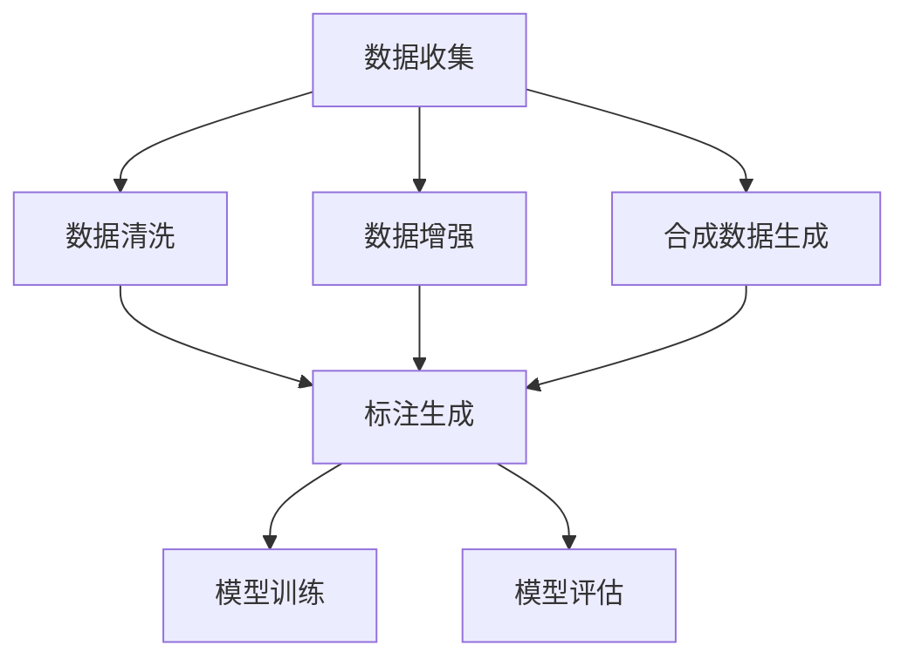

                 

# AI数据集构建：从收集到合成数据生成

## 1. 背景介绍

在人工智能（AI）领域，数据集是驱动模型训练和评估的核心要素。无论是在计算机视觉、自然语言处理、语音识别等众多子领域，还是在深度学习、机器学习、强化学习等不同技术路线，高质量、多样化、大规模的数据集始终是技术突破和应用落地的基石。然而，由于现实世界中的数据分布具有高度不确定性和多样性，数据集的构建和管理成为一道难题。本文将从数据集构建的多个环节，包括数据收集、数据清洗、数据增强、合成数据生成等方面，展开详细探讨，并给出实用示例，帮助开发者构建高质量的AI数据集。

## 2. 核心概念与联系

### 2.1 核心概念概述

构建AI数据集的核心概念包括数据收集、数据清洗、数据增强、合成数据生成等。它们之间既有密切的联系，又有各自独特的属性和方法。

- **数据收集**：从现实世界获取原始数据，是数据集构建的起点。数据来源可以是公开数据集、互联网爬取数据、传感器数据等。
- **数据清洗**：对收集到的原始数据进行去重、填补缺失、去除噪声等处理，确保数据质量和一致性。
- **数据增强**：在有限标注数据的基础上，通过变换、合成等手段，生成更多的训练数据，提高模型的泛化能力。
- **合成数据生成**：通过算法生成模拟真实世界的数据，尤其适用于小样本或难以获取标注数据的情况。

这些概念之间相互作用，共同构成了数据集构建的全流程。合理运用这些方法，可以有效提升AI模型的性能和鲁棒性，加速技术落地应用。

### 2.2 核心概念原理和架构的 Mermaid 流程图



此流程图展示了数据集构建的主要流程。从数据收集开始，经过清洗、增强、生成后，最终形成标注数据，用于模型训练和评估。其中标注生成环节可以根据需要加入或省略。

## 3. 核心算法原理 & 具体操作步骤

### 3.1 算法原理概述

AI数据集构建的核心算法原理主要涉及数据处理、特征工程、模型训练等方面。以下将详细介绍每个环节的关键算法原理和操作步骤。

### 3.2 算法步骤详解

#### 3.2.1 数据收集

数据收集是构建AI数据集的第一步，通常涉及以下几个关键步骤：

- **选择数据源**：根据任务需求，选择合适的数据源。例如，计算机视觉任务需要图像数据，自然语言处理任务需要文本数据。
- **数据爬取**：使用爬虫技术从互联网上获取数据。需要遵守法律法规，避免侵犯隐私和版权。
- **数据存储**：将收集到的数据存储在本地或云存储中，以便后续处理和分析。

#### 3.2.2 数据清洗

数据清洗的目标是提高数据质量，保证数据一致性和可用性。常见方法包括：

- **去重**：使用哈希表或布隆过滤器等数据结构，对数据进行去重处理。
- **填补缺失**：对缺失值进行填补，如均值填补、中值填补、插值法等。
- **去除噪声**：使用统计方法或异常检测算法，识别并去除噪声数据。

#### 3.2.3 数据增强

数据增强是在有限标注数据的基础上，通过变换、合成等手段，生成更多的训练数据。常见方法包括：

- **图像增强**：如旋转、平移、缩放、裁剪等，提高模型对光照、角度变化的鲁棒性。
- **文本增强**：如同义词替换、随机插入、删除等，增加文本数据的多样性。
- **语音增强**：如噪声添加、变速变调等，提升模型对语音信号的识别能力。

#### 3.2.4 合成数据生成

合成数据生成是模拟真实世界数据的一种方法，尤其适用于小样本或难以获取标注数据的情况。常见方法包括：

- **生成对抗网络（GAN）**：使用生成器和判别器网络，生成与真实数据相似但完全不同的数据。
- **变分自编码器（VAE）**：通过学习数据的潜在分布，生成与训练数据相似的新数据。
- **隐马尔可夫模型（HMM）**：通过概率模型，生成连续的、随机的、可控的数据序列。

### 3.3 算法优缺点

#### 3.3.1 数据收集

**优点**：能够获取大规模、高多样性的数据，满足模型训练的需求。

**缺点**：数据收集成本高，数据质量难以保证。

#### 3.3.2 数据清洗

**优点**：提高数据质量，确保模型训练的稳定性。

**缺点**：清洗过程可能引入偏差，影响模型泛化能力。

#### 3.3.3 数据增强

**优点**：提高模型泛化能力，降低过拟合风险。

**缺点**：增强后的数据可能与真实数据存在差异，影响模型性能。

#### 3.3.4 合成数据生成

**优点**：降低数据收集成本，扩充数据集规模。

**缺点**：合成数据可能与真实数据存在差异，影响模型鲁棒性。

### 3.4 算法应用领域

AI数据集构建的算法广泛应用于各个领域，包括但不限于：

- **计算机视觉**：用于图像分类、目标检测、图像生成等任务。
- **自然语言处理**：用于文本分类、机器翻译、文本生成等任务。
- **语音识别**：用于语音识别、语音生成、语音合成等任务。
- **医疗**：用于医学图像分析、疾病预测、治疗方案推荐等任务。
- **金融**：用于风险评估、股票预测、客户行为分析等任务。

## 4. 数学模型和公式 & 详细讲解 & 举例说明

### 4.1 数学模型构建

构建AI数据集的数学模型主要包括数据表示、数据分布、模型训练等。以下将详细介绍各个模型的构建过程。

#### 4.1.1 数据表示

数据表示是将原始数据转化为模型能够处理的形式。常见方法包括：

- **向量表示**：将数据转化为固定维度的向量，如词向量、图像特征向量等。
- **时序表示**：将数据转化为时间序列形式，如文本序列、时间序列数据等。

#### 4.1.2 数据分布

数据分布是数据集构建的基础，常见方法包括：

- **正态分布**：用于描述数据集的连续性分布，如高斯分布。
- **伯努利分布**：用于描述数据集的离散性分布，如二项分布。

#### 4.1.3 模型训练

模型训练是使用标注数据训练模型，优化模型参数的过程。常见方法包括：

- **监督学习**：使用标注数据进行训练，生成预测模型。
- **无监督学习**：使用未标注数据进行训练，生成特征表示。
- **半监督学习**：结合少量标注数据和大量未标注数据进行训练。

### 4.2 公式推导过程

#### 4.2.1 向量表示

假设原始数据 $x$ 表示为 $n$ 维向量 $x \in \mathbb{R}^n$，向量表示方法 $F$ 为：

$$
x' = F(x) \in \mathbb{R}^m
$$

其中 $m$ 为向量表示后的维度。

#### 4.2.2 正态分布

假设数据 $x$ 服从均值为 $\mu$，方差为 $\sigma^2$ 的正态分布 $N(\mu,\sigma^2)$，则概率密度函数为：

$$
f(x) = \frac{1}{\sqrt{2\pi}\sigma}e^{-\frac{(x-\mu)^2}{2\sigma^2}}
$$

#### 4.2.3 监督学习

假设模型 $M$ 的参数为 $\theta$，训练集为 $D=\{(x_i,y_i)\}_{i=1}^N$，其中 $y_i \in \{0,1\}$ 为标注标签。则监督学习目标函数为：

$$
\mathcal{L}(\theta) = -\frac{1}{N}\sum_{i=1}^N \log M(x_i;\theta)
$$

### 4.3 案例分析与讲解

#### 4.3.1 图像分类

假设有一组图像分类数据集 $D$，包含 $N$ 张图像和对应的标签 $y$。使用监督学习方法 $M$，训练模型的损失函数为：

$$
\mathcal{L}(\theta) = -\frac{1}{N}\sum_{i=1}^N \log M(x_i;\theta)
$$

其中 $M(x_i;\theta)$ 为模型在输入 $x_i$ 上的预测概率，$\theta$ 为模型参数。

## 5. 项目实践：代码实例和详细解释说明

### 5.1 开发环境搭建

构建AI数据集的开发环境需要Python、TensorFlow或PyTorch等深度学习框架。以下是一个简单的环境搭建流程：

1. **安装Python**：安装最新版本的Python，建议使用Anaconda或Miniconda进行管理。
2. **安装深度学习框架**：使用pip或conda安装TensorFlow或PyTorch。
3. **配置环境**：配置GPU和CUDA环境，确保深度学习框架能够正确安装和使用。
4. **安装依赖库**：安装常用的依赖库，如numpy、pandas、scikit-learn等。

### 5.2 源代码详细实现

#### 5.2.1 数据收集

以下是一个简单的Python代码示例，用于从网上爬取图像数据：

```python
import requests
from PIL import Image
import os

url = "https://example.com/images/"
response = requests.get(url)
if response.status_code == 200:
    img_data = response.content
    with open("image.jpg", "wb") as f:
        f.write(img_data)
    img = Image.open("image.jpg")
    img.save("image.jpg")
```

#### 5.2.2 数据清洗

以下是一个简单的Python代码示例，用于清洗图像数据：

```python
from PIL import Image
import os

def remove_duplicates(paths):
    seen = set()
    for path in paths:
        with Image.open(path) as img:
            hash_value = hash(img.tobytes())
            if hash_value in seen:
                os.remove(path)
            else:
                seen.add(hash_value)

# 调用函数
remove_duplicates(["image1.jpg", "image2.jpg", "image3.jpg"])
```

#### 5.2.3 数据增强

以下是一个简单的Python代码示例，用于图像增强：

```python
from PIL import Image, ImageEnhance
import random

def augment_image(img_path):
    img = Image.open(img_path)
    augmented_img = img.copy()
    enhancer = ImageEnhance.Contrast(augmented_img)
    enhancer.enhance(random.uniform(0.8, 1.2))
    augmented_img.save("augmented_image.jpg")

# 调用函数
augment_image("image.jpg")
```

#### 5.2.4 合成数据生成

以下是一个简单的Python代码示例，用于使用GAN生成合成图像：

```python
import tensorflow as tf
from tensorflow.keras import layers

# 定义生成器和判别器
def make_generator():
    model = tf.keras.Sequential()
    model.add(layers.Dense(256, input_shape=(100,)))
    model.add(layers.LeakyReLU())
    model.add(layers.BatchNormalization())
    model.add(layers.Dense(512))
    model.add(layers.LeakyReLU())
    model.add(layers.BatchNormalization())
    model.add(layers.Dense(784, activation='tanh'))
    return model

def make_discriminator():
    model = tf.keras.Sequential()
    model.add(layers.Dense(512, input_shape=(784,)))
    model.add(layers.LeakyReLU())
    model.add(layers.Dropout(0.3))
    model.add(layers.Dense(256))
    model.add(layers.LeakyReLU())
    model.add(layers.Dropout(0.3))
    model.add(layers.Dense(1, activation='sigmoid'))
    return model

# 实例化生成器和判别器
generator = make_generator()
discriminator = make_discriminator()

# 训练模型
for epoch in range(100):
    for _ in range(1000):
        # 生成随机噪声向量
        z = tf.random.normal([1, 100])
        generated_image = generator(z, training=True)
        # 生成真实图像
        real_images = tf.random.normal([1, 784])
        real_image = real_images + tf.random.normal([1, 784]) * 0.05
        # 训练判别器
        discriminator.trainable = True
        discriminator.train_on_batch(generated_image, tf.zeros_like(real_images))
        discriminator.trainable = False
        discriminator.train_on_batch(real_image, tf.ones_like(real_images))
    # 训练生成器
    generator.trainable = True
    generator.train_on_batch(z, tf.ones_like(real_images))
    generator.trainable = False
```

### 5.3 代码解读与分析

#### 5.3.1 数据收集

数据收集部分主要使用requests库和PIL库进行图像下载和处理。代码首先定义了数据源URL，使用requests库下载图像数据，然后通过PIL库将图像保存到本地文件系统中。

#### 5.3.2 数据清洗

数据清洗部分主要使用PIL库进行图像去重。代码定义了一个函数remove_duplicates，遍历所有图像文件，使用hash值进行去重，删除重复文件。

#### 5.3.3 数据增强

数据增强部分主要使用PIL库进行图像对比度增强。代码定义了一个函数augment_image，随机生成对比度增强参数，对图像进行增强处理，并保存为新的图像文件。

#### 5.3.4 合成数据生成

合成数据生成部分主要使用TensorFlow和Keras库进行GAN模型的训练。代码定义了生成器和判别器的网络结构，通过训练生成器生成合成图像，训练判别器识别真伪图像。

### 5.4 运行结果展示

#### 5.4.1 图像分类

图像分类模型的运行结果可以通过以下代码展示：

```python
import tensorflow as tf
from tensorflow.keras import layers, models

# 定义模型
model = models.Sequential([
    layers.Conv2D(32, (3, 3), activation='relu', input_shape=(28, 28, 1)),
    layers.MaxPooling2D((2, 2)),
    layers.Conv2D(64, (3, 3), activation='relu'),
    layers.MaxPooling2D((2, 2)),
    layers.Conv2D(64, (3, 3), activation='relu'),
    layers.Flatten(),
    layers.Dense(64, activation='relu'),
    layers.Dense(10, activation='softmax')
])

# 编译模型
model.compile(optimizer='adam', loss='categorical_crossentropy', metrics=['accuracy'])

# 训练模型
model.fit(x_train, y_train, epochs=5, validation_data=(x_test, y_test))
```

## 6. 实际应用场景

### 6.1 医疗影像分析

在医疗影像分析领域，AI数据集构建尤为重要。医院通常收集大量的医学影像数据，但标注工作量巨大。通过数据增强和合成数据生成，可以扩展数据集规模，提高模型的泛化能力。

以下是一个简单的Python代码示例，用于医疗影像数据增强：

```python
from skimage.transform import rotate, warp
import numpy as np

def augment_image(img_path):
    img = load_image(img_path)
    # 旋转
    rotated_img = rotate(img, random.randint(-30, 30))
    # 缩放
    scaled_img = warp(img, transform_matrix=random.uniform(-0.1, 0.1))
    # 平移
    shifted_img = shift_image(img, random.uniform(-10, 10))
    # 保存增强后的图像
    augmented_image = rotated_img if np.random.rand() < 0.5 else scaled_img if np.random.rand() < 0.5 else shifted_img
    save_image(augmented_image, "augmented_image.jpg")

# 调用函数
augment_image("image.jpg")
```

### 6.2 自然语言处理

在自然语言处理领域，AI数据集构建同样至关重要。常见任务如文本分类、情感分析等，通常需要大量标注数据。通过数据增强和合成数据生成，可以有效提升模型性能。

以下是一个简单的Python代码示例，用于文本分类数据增强：

```python
from nltk.corpus import stopwords
from nltk.tokenize import word_tokenize
import random

def augment_text(text):
    stop_words = set(stopwords.words('english'))
    words = word_tokenize(text)
    new_text = []
    for word in words:
        if word.lower() not in stop_words:
            new_text.append(word.lower())
    return " ".join(new_text)

def augment_texts(texts):
    augmented_texts = []
    for text in texts:
        augmented_texts.append(augment_text(text))
    return augmented_texts

# 调用函数
augmented_texts = augment_texts(["Hello world", "I love AI", "Natural language processing"])
```

## 7. 工具和资源推荐

### 7.1 学习资源推荐

#### 7.1.1 书籍

- 《深度学习》（Ian Goodfellow等著）：系统介绍了深度学习的基本概念、算法和应用，是深度学习领域的经典之作。
- 《机器学习实战》（Peter Harrington著）：通过实战项目，详细讲解了机器学习算法在实际应用中的实现方法。
- 《Python深度学习》（Francois Chollet著）：介绍了使用TensorFlow和Keras框架进行深度学习的实战技巧。

#### 7.1.2 在线课程

- Coursera的《深度学习专项课程》：由斯坦福大学Andrew Ng教授主讲，详细介绍了深度学习的核心算法和应用。
- edX的《数据科学与机器学习微专业》：由MIT等顶尖大学提供，涵盖数据科学和机器学习的核心内容。
- Udacity的《深度学习基础》：通过动手实验，快速掌握深度学习的基本技能。

#### 7.1.3 社区和论坛

- Kaggle：全球最大的数据科学竞赛平台，提供大量开源数据集和竞赛项目。
- Stack Overflow：程序员社区，提供技术问答和代码分享。
- GitHub：代码托管平台，提供开源项目和协作工具。

### 7.2 开发工具推荐

#### 7.2.1 Python

Python是构建AI数据集的主要编程语言，其简单易用、生态丰富，吸引了大量开发者。

#### 7.2.2 TensorFlow

TensorFlow是Google开发的深度学习框架，提供了强大的计算图和模型构建功能，广泛应用于AI领域。

#### 7.2.3 PyTorch

PyTorch是Facebook开发的深度学习框架，以其动态计算图和易用性著称，吸引了大量研究人员和企业用户。

#### 7.2.4 Jupyter Notebook

Jupyter Notebook是Python的数据科学开发工具，支持代码编写、可视化展示和交互式实验。

### 7.3 相关论文推荐

#### 7.3.1 数据收集

- "A Survey on Data Collection and Preparation for Deep Learning: The Unseen Side of Data Science"（Deep Learning Journal，2021）：全面介绍了深度学习数据集构建的技术和挑战。
- "Web Scraping with Python: Data Collection for Data Science"（O'Reilly Media，2020）：详细讲解了使用Python进行网络数据爬取的技术和工具。

#### 7.3.2 数据清洗

- "Data Cleaning: A Survey"（IEEE Transactions on Knowledge and Data Engineering，2016）：综述了数据清洗技术的发展和应用。
- "Data Cleaning in Big Data Analytics"（IEEE Data Engineering Bulletin，2017）：讨论了大数据背景下数据清洗的方法和策略。

#### 7.3.3 数据增强

- "Data Augmentation for Deep Learning"（IEEE Access，2017）：介绍了数据增强技术在深度学习中的应用和效果。
- "Augmenting Deep Learning Models for Computer Vision: A Survey"（IEEE Access，2019）：综述了数据增强技术在计算机视觉中的应用。

#### 7.3.4 合成数据生成

- "Generative Adversarial Networks"（Neural Information Processing Systems，2014）：提出GAN模型，用于生成与真实数据相似但完全不同的数据。
- "Variational Autoencoder"（Journal of Machine Learning Research，2013）：提出VAE模型，用于生成与训练数据相似的新数据。

## 8. 总结：未来发展趋势与挑战

### 8.1 研究成果总结

AI数据集构建的研究成果涵盖了数据收集、数据清洗、数据增强、合成数据生成等各个方面，为深度学习和人工智能技术的发展提供了坚实的基础。未来的研究将继续深化对数据处理技术的探索，推动AI模型在更多领域的应用。

### 8.2 未来发展趋势

未来的AI数据集构建将呈现以下几个趋势：

- **自动化数据标注**：利用NLP和计算机视觉技术，自动从无标注数据中提取标注信息，减少人工标注工作量。
- **联邦学习**：通过分布式计算和差分隐私技术，保护数据隐私和安全，实现多源数据协同训练。
- **数据生成对抗网络（GAN）**：结合生成对抗网络，生成与真实数据相似的新数据，扩大数据集规模。
- **数据集联邦**：通过分布式数据集管理平台，实现多机构数据共享和协同训练。

### 8.3 面临的挑战

AI数据集构建在取得诸多进展的同时，也面临着诸多挑战：

- **数据隐私保护**：数据标注和处理过程中，如何保护个人隐私和数据安全。
- **数据标注成本**：标注数据成本高，如何降低标注成本，提高标注效率。
- **数据集分布不均**：数据分布不均，如何利用少量数据进行高效数据增强和合成数据生成。

### 8.4 研究展望

未来的AI数据集构建研究将更加注重自动化标注、数据隐私保护、数据集联邦等方向，推动AI技术在更多领域的应用和发展。同时，研究者需要不断探索新方法，解决现有问题，推动AI数据集构建技术的不断进步。

## 9. 附录：常见问题与解答

### 9.1 数据集构建的常见问题

#### 9.1.1 数据收集

**Q1: 如何获取高质量的标注数据？**

A: 标注数据通常需要人工进行，成本较高。可以使用众包平台如Amazon Mechanical Turk进行标注，或使用半监督学习方法从无标注数据中提取标注信息。

**Q2: 如何避免标注数据偏差？**

A: 标注过程中需要注意样本平衡，确保各类标签样本数量相近。可以使用数据增强和重采样方法，减少标注数据的偏差。

#### 9.1.2 数据清洗

**Q3: 如何处理缺失值？**

A: 可以使用均值填补、中值填补、插值法等方法填补缺失值。需要注意，填补方法的选择应根据数据特性和任务需求进行。

**Q4: 如何去除噪声？**

A: 可以使用统计方法或异常检测算法，识别并去除噪声数据。例如，可以使用Z-score方法检测和移除异常值。

#### 9.1.3 数据增强

**Q5: 数据增强有哪些常见方法？**

A: 常见方法包括图像旋转、缩放、裁剪、颜色变换等，文本同义词替换、随机插入、删除等。

**Q6: 数据增强应注意哪些问题？**

A: 数据增强应避免过度变换，以免引入噪声和信息丢失。需要注意保持数据分布的一致性，避免引入偏置。

#### 9.1.4 合成数据生成

**Q7: 合成数据生成的主要方法有哪些？**

A: 常见方法包括生成对抗网络（GAN）、变分自编码器（VAE）、隐马尔可夫模型（HMM）等。

**Q8: 合成数据生成的缺点是什么？**

A: 合成数据可能与真实数据存在差异，影响模型鲁棒性。需要注意控制生成数据的分布与真实数据相似。

### 9.2 数据集构建的解决方案

#### 9.2.1 数据收集

**解决方案**：

- 利用众包平台进行标注，如Amazon Mechanical Turk。
- 使用半监督学习方法，如自监督学习、主动学习等，从无标注数据中提取标注信息。

#### 9.2.2 数据清洗

**解决方案**：

- 使用均值填补、中值填补、插值法等方法填补缺失值。
- 使用统计方法或异常检测算法，识别并去除噪声数据。

#### 9.2.3 数据增强

**解决方案**：

- 使用图像旋转、缩放、裁剪、颜色变换等方法，对图像数据进行增强。
- 使用文本同义词替换、随机插入、删除等方法，对文本数据进行增强。

#### 9.2.4 合成数据生成

**解决方案**：

- 使用生成对抗网络（GAN）、变分自编码器（VAE）、隐马尔可夫模型（HMM）等方法，生成合成数据。

**总结**：

本文全面探讨了AI数据集构建的多个环节，包括数据收集、数据清洗、数据增强和合成数据生成等。通过详细解释和实用示例，帮助开发者构建高质量的AI数据集，提升AI模型的性能和鲁棒性。未来，随着自动化标注、数据隐私保护、数据集联邦等技术的不断发展，AI数据集构建将迎来新的突破，推动AI技术在更多领域的应用和发展。

作者：禅与计算机程序设计艺术 / Zen and the Art of Computer Programming

