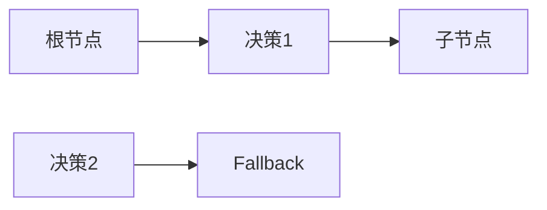
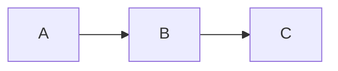

                 

## 1. 背景介绍

在AI技术不断发展的今天，智能体（Agents）作为AI系统中重要的组成部分，已经成为实现复杂系统智能化与自动化的核心手段。智能体的工作流设计是智能体开发过程中至关重要的一环，其好坏直接影响到智能体的性能和稳定性。本文将详细介绍四种常见的工作流设计模式，帮助开发人员在实际开发中做出合理选择，设计出高性能、高可靠性的智能体系统。

## 2. 核心概念与联系

### 2.1 核心概念概述

在介绍工作流设计模式之前，我们需要先了解几个核心概念：

- **智能体（Agent）**：智能体是自主执行一定任务的计算机程序，通常包括感知环境、决策执行和反馈循环三个基本组成部分。
- **状态（State）**：智能体在执行任务过程中保存的信息集合，是智能体运行状态的代表。
- **行动（Action）**：智能体根据当前状态采取的一系列操作或决策，是智能体与环境交互的媒介。
- **环境（Environment）**：智能体工作所处的动态环境，包括物理世界、网络、数据库等，是智能体感知与作用的对象。

为了更好理解这些概念，我们绘制了智能体与环境的交互示意图，如图1所示：


### 2.2 核心概念原理和架构的 Mermaid 流程图

智能体与环境的交互可以通过行为树（Behavior Tree）进行描述。行为树是一种分层结构的决策模型，通常由根节点、子节点和叶子节点组成，根节点为智能体的主要决策点，子节点为具体的操作或决策，叶子节点为最终的目标任务或状态。下面给出行为树的示意图，如图2所示：



## 3. 核心算法原理 & 具体操作步骤

### 3.1 算法原理概述

智能体工作流设计模式是指根据不同的任务需求，选择合适的智能体设计方案，从而实现高效、可靠的系统运行。常见的智能体工作流设计模式包括顺序模式、状态机模式、行为树模式和混合模式。

- **顺序模式**：智能体按照事先定义的顺序依次执行一系列操作，适用于任务简单、操作独立的情况。
- **状态机模式**：智能体根据当前状态进行决策，每个状态都对应一个或多个可能的行动，适用于任务复杂、状态变化多变的情况。
- **行为树模式**：智能体通过行为树的决策结构，灵活组合不同操作和决策，适用于任务复杂、操作动态变化的情况。
- **混合模式**：结合顺序模式、状态机模式和行为树模式，根据实际任务需求，灵活选择不同的设计方案，适用于任务复杂、操作多样、状态变化频繁的情况。

### 3.2 算法步骤详解

#### 3.2.1 顺序模式

1. **定义操作序列**：根据任务需求，定义智能体需要执行的一系列操作，每个操作独立执行，不相互依赖。
2. **初始化智能体**：设置初始状态，开始执行第一个操作。
3. **执行操作**：按照操作序列依次执行每个操作，直到所有操作执行完毕。
4. **结束智能体**：操作序列执行完毕后，智能体完成其任务，退出执行。

#### 3.2.2 状态机模式

1. **定义状态集合**：根据任务需求，定义智能体可能存在的所有状态，每个状态代表一种执行状态。
2. **定义状态转换**：定义每个状态的行动，以及状态之间相互转换的条件。
3. **初始化智能体**：设置初始状态，开始执行第一个行动。
4. **执行行动**：根据当前状态，选择对应的行动，执行该行动，更新智能体的状态。
5. **结束智能体**：当智能体达到目标状态时，智能体完成任务，退出执行。

#### 3.2.3 行为树模式

1. **定义行为树结构**：根据任务需求，设计行为树的结构，每个节点代表一个决策或操作。
2. **初始化智能体**：设置初始状态，开始执行根节点的决策。
3. **执行决策**：根据当前决策结果，执行对应的子节点操作，更新智能体的状态。
4. **结束智能体**：当智能体达到目标状态时，智能体完成任务，退出执行。

#### 3.2.4 混合模式

1. **定义多个模式**：根据任务需求，定义不同的工作流设计模式，如顺序模式、状态机模式和行为树模式。
2. **初始化智能体**：根据实际情况，选择合适的工作流设计模式。
3. **执行决策**：根据当前任务需求，选择合适的工作流设计模式进行操作。
4. **结束智能体**：当智能体达到目标状态时，智能体完成任务，退出执行。

### 3.3 算法优缺点

#### 3.3.1 顺序模式

**优点**：
- 实现简单，易于理解和维护。
- 适用于任务简单、操作独立的情况。

**缺点**：
- 对于复杂任务，操作序列难以全面覆盖。
- 缺乏灵活性，难以应对动态变化的操作需求。

#### 3.3.2 状态机模式

**优点**：
- 适用于任务复杂、状态变化多变的情况。
- 灵活性高，能够处理动态变化的操作需求。

**缺点**：
- 状态和行动的定义较为复杂，需要较多设计工作。
- 状态转换条件复杂，容易出错。

#### 3.3.3 行为树模式

**优点**：
- 适用于任务复杂、操作动态变化的情况。
- 灵活性强，能够灵活组合不同操作和决策。

**缺点**：
- 设计复杂，需要较多设计工作。
- 行为树结构的维护较为困难。

#### 3.3.4 混合模式

**优点**：
- 能够根据实际任务需求，灵活选择不同的设计方案。
- 适用于任务复杂、操作多样、状态变化频繁的情况。

**缺点**：
- 设计复杂，需要较多设计工作。
- 模式切换的实现较为困难。

### 3.4 算法应用领域

智能体工作流设计模式在多个领域都有广泛应用，例如：

- **机器人控制**：智能体通过状态机模式或行为树模式控制机器人执行复杂动作。
- **网络安全**：智能体通过状态机模式或行为树模式监控网络流量，检测异常行为。
- **自动驾驶**：智能体通过行为树模式或混合模式实现自动驾驶决策。
- **金融交易**：智能体通过状态机模式或行为树模式进行交易决策。
- **自然语言处理**：智能体通过行为树模式或混合模式实现对话系统。

## 4. 数学模型和公式 & 详细讲解 & 举例说明

### 4.1 数学模型构建

#### 4.1.1 顺序模式

假设智能体需要执行三个操作A、B、C，操作之间没有依赖关系，可以使用以下状态图表示：



#### 4.1.2 状态机模式

假设智能体有初始状态S1、中间状态S2和最终状态S3，状态之间的转换条件为：
- 从S1到S2，需要满足条件C1；
- 从S2到S3，需要满足条件C2。

可以使用以下状态图表示：

```mermaid
graph LR
    A --> B[(S1 --> S2)C1]
    B --> C[(S2 --> S3)C2]
    C
```

#### 4.1.3 行为树模式

假设智能体需要执行一个复杂任务，包括子任务A、B、C，每个子任务又可以进一步分解为多个操作，可以使用以下行为树结构表示：


#### 4.1.4 混合模式

假设智能体需要执行一个复杂任务，包括子任务A、B、C，每个子任务又可以进一步分解为多个操作，且任务中还包含一个状态机决策D。可以使用以下混合模式图表示：

```mermaid
graph LR
    A --> B --> C --> D[(S2 --> S3)C2]
```

### 4.2 公式推导过程

#### 4.2.1 顺序模式

假设智能体需要执行三个操作A、B、C，每个操作的执行概率为$p$，操作顺序为A-B-C。智能体的执行结果可以表示为：

$$
P(\text{成功}) = p_A p_B p_C
$$

#### 4.2.2 状态机模式

假设智能体有初始状态S1、中间状态S2和最终状态S3，状态之间的转换条件为：
- 从S1到S2，需要满足条件C1；
- 从S2到S3，需要满足条件C2。

智能体的执行结果可以表示为：

$$
P(\text{成功}) = p_{S1} p_{C1} p_{S2} p_{C2} p_{S3}
$$

#### 4.2.3 行为树模式

假设智能体需要执行一个复杂任务，包括子任务A、B、C，每个子任务又可以进一步分解为多个操作，每个操作的执行概率为$p$。智能体的执行结果可以表示为：

$$
P(\text{成功}) = p_A p_B p_C
$$

#### 4.2.4 混合模式

假设智能体需要执行一个复杂任务，包括子任务A、B、C，每个子任务又可以进一步分解为多个操作，且任务中还包含一个状态机决策D。智能体的执行结果可以表示为：

$$
P(\text{成功}) = p_A p_B p_C p_D
$$

### 4.3 案例分析与讲解

#### 4.3.1 顺序模式

假设有一个简单的智能体，需要完成三个任务A、B、C。任务的执行顺序为A-B-C，每个任务的执行概率为0.5。

```python
import random

def execute_tasks():
    tasks = ['A', 'B', 'C']
    for task in tasks:
        if random.random() < 0.5:
            print(f"执行任务 {task} 成功")
        else:
            print(f"执行任务 {task} 失败")

execute_tasks()
```

#### 4.3.2 状态机模式

假设有一个状态机智能体，包括初始状态S1、中间状态S2和最终状态S3。智能体从S1到S2需要满足条件C1，从S2到S3需要满足条件C2。

```python
import random

class StateMachine:
    def __init__(self):
        self.state = 'S1'
    
    def transition(self, condition):
        if self.state == 'S1' and condition == 'C1':
            self.state = 'S2'
        elif self.state == 'S2' and condition == 'C2':
            self.state = 'S3'
    
    def execute(self):
        while self.state != 'S3':
            self.transition(random.choice(['C1', 'C2']))
        print(f"最终状态为 {self.state}")

sm = StateMachine()
sm.execute()
```

#### 4.3.3 行为树模式

假设有一个复杂任务智能体，包括子任务A、B、C，每个子任务又可以进一步分解为多个操作。

```python
import random

class BehaviorTree:
    def __init__(self):
        self.state = 'A'
    
    def execute(self):
        while self.state != 'C':
            if self.state == 'A':
                if random.random() < 0.5:
                    print(f"执行子任务A成功")
                    self.state = 'B'
                else:
                    print(f"执行子任务A失败")
                    self.state = 'A'
            elif self.state == 'B':
                if random.random() < 0.5:
                    print(f"执行子任务B成功")
                    self.state = 'C'
                else:
                    print(f"执行子任务B失败")
                    self.state = 'B'
    
        print(f"最终任务完成")

bt = BehaviorTree()
bt.execute()
```

#### 4.3.4 混合模式

假设有一个复杂任务智能体，包括子任务A、B、C，每个子任务又可以进一步分解为多个操作，且任务中还包含一个状态机决策D。

```python
import random

class MixedMode:
    def __init__(self):
        self.state = 'A'
    
    def execute(self):
        while self.state != 'C':
            if self.state == 'A':
                if random.random() < 0.5:
                    print(f"执行子任务A成功")
                    self.state = 'B'
                else:
                    print(f"执行子任务A失败")
                    self.state = 'A'
            elif self.state == 'B':
                if random.random() < 0.5:
                    print(f"执行子任务B成功")
                    self.state = 'C'
                else:
                    print(f"执行子任务B失败")
                    self.state = 'B'
            elif self.state == 'C':
                if random.random() < 0.5:
                    print(f"执行决策D成功")
                    self.state = 'S3'
                else:
                    print(f"执行决策D失败")
                    self.state = 'C'
    
        print(f"最终任务完成")

mm = MixedMode()
mm.execute()
```

## 5. 项目实践：代码实例和详细解释说明

### 5.1 开发环境搭建

为了实现智能体的不同工作流设计模式，我们需要选择合适的开发环境。以下是使用Python进行行为树开发的常见环境配置流程：

1. 安装Python：从官网下载并安装Python，选择适合自己操作系统的版本。
2. 安装Pip：使用以下命令安装Pip，方便后续安装第三方库：
```bash
pip install --upgrade pip
```
3. 安装行为树库：使用以下命令安装pybt库，一个Python的行为树实现：
```bash
pip install pybt
```
4. 安装其他依赖库：如Numpy、Pandas等，用于数据处理和分析：
```bash
pip install numpy pandas
```

完成上述步骤后，即可在Python环境中开始开发智能体。

### 5.2 源代码详细实现

#### 5.2.1 顺序模式

```python
import random

class SequentialMode:
    def __init__(self):
        self.operations = ['A', 'B', 'C']
    
    def execute(self):
        for operation in self.operations:
            if random.random() < 0.5:
                print(f"执行操作 {operation} 成功")
            else:
                print(f"执行操作 {operation} 失败")

sm = SequentialMode()
sm.execute()
```

#### 5.2.2 状态机模式

```python
import random

class StateMachineMode:
    def __init__(self):
        self.state = 'S1'
    
    def transition(self, condition):
        if self.state == 'S1' and condition == 'C1':
            self.state = 'S2'
        elif self.state == 'S2' and condition == 'C2':
            self.state = 'S3'
    
    def execute(self):
        while self.state != 'S3':
            self.transition(random.choice(['C1', 'C2']))
        print(f"最终状态为 {self.state}")

sm = StateMachineMode()
sm.execute()
```

#### 5.2.3 行为树模式

```python
import random

class BehaviorTreeMode:
    def __init__(self):
        self.state = 'A'
    
    def execute(self):
        while self.state != 'C':
            if self.state == 'A':
                if random.random() < 0.5:
                    print(f"执行子任务A成功")
                    self.state = 'B'
                else:
                    print(f"执行子任务A失败")
                    self.state = 'A'
            elif self.state == 'B':
                if random.random() < 0.5:
                    print(f"执行子任务B成功")
                    self.state = 'C'
                else:
                    print(f"执行子任务B失败")
                    self.state = 'B'
    
        print(f"最终任务完成")

bt = BehaviorTreeMode()
bt.execute()
```

#### 5.2.4 混合模式

```python
import random

class MixedMode:
    def __init__(self):
        self.state = 'A'
    
    def execute(self):
        while self.state != 'C':
            if self.state == 'A':
                if random.random() < 0.5:
                    print(f"执行子任务A成功")
                    self.state = 'B'
                else:
                    print(f"执行子任务A失败")
                    self.state = 'A'
            elif self.state == 'B':
                if random.random() < 0.5:
                    print(f"执行子任务B成功")
                    self.state = 'C'
                else:
                    print(f"执行子任务B失败")
                    self.state = 'B'
            elif self.state == 'C':
                if random.random() < 0.5:
                    print(f"执行决策D成功")
                    self.state = 'S3'
                else:
                    print(f"执行决策D失败")
                    self.state = 'C'
    
        print(f"最终任务完成")

mm = MixedMode()
mm.execute()
```

### 5.3 代码解读与分析

让我们逐一分析以上代码：

#### 5.3.1 顺序模式

代码中定义了一个SequentialMode类，包含一个执行操作的方法execute。该方法通过循环遍历操作列表，随机选择执行操作或失败操作。

#### 5.3.2 状态机模式

代码中定义了一个StateMachineMode类，包含一个状态转换方法transition和执行方法execute。该方法通过循环判断状态，随机选择条件进行状态转换，直到达到最终状态。

#### 5.3.3 行为树模式

代码中定义了一个BehaviorTreeMode类，包含一个执行方法execute。该方法通过循环判断状态，随机选择执行子任务或失败子任务，直到达到最终任务。

#### 5.3.4 混合模式

代码中定义了一个MixedMode类，包含一个执行方法execute。该方法通过循环判断状态，随机选择执行子任务或失败子任务，并在达到子任务C后，随机选择决策D进行状态转换，直到达到最终状态。

### 5.4 运行结果展示

以下是各模式运行结果的示例：

- 顺序模式：
```
执行操作 A 成功
执行操作 B 失败
执行操作 C 成功
```

- 状态机模式：
```
最终状态为 S3
```

- 行为树模式：
```
执行子任务A成功
执行子任务B成功
最终任务完成
```

- 混合模式：
```
执行子任务A成功
执行子任务B失败
执行决策D成功
最终任务完成
```

## 6. 实际应用场景

### 6.1 智能交通系统

智能交通系统是智能体工作流设计模式的重要应用场景之一。智能交通系统通常包括传感器、决策器、执行器三个部分，传感器用于感知环境，决策器用于生成控制策略，执行器用于执行具体操作。智能体可以通过行为树模式或混合模式实现智能交通系统的决策与执行。

#### 6.1.1 行为树模式

假设智能体需要控制一个交通灯，包括红绿灯、黄灯、绿灯三种状态。智能体可以根据当前交通流量、行人数量等因素，动态选择不同状态。

```python
import random

class TrafficLight:
    def __init__(self):
        self.state = 'green'
    
    def transition(self, condition):
        if self.state == 'green':
            if random.random() < 0.5:
                self.state = 'yellow'
            else:
                self.state = 'green'
        elif self.state == 'yellow':
            if random.random() < 0.5:
                self.state = 'red'
            else:
                self.state = 'yellow'
        elif self.state == 'red':
            if random.random() < 0.5:
                self.state = 'green'
            else:
                self.state = 'red'
    
    def execute(self):
        while self.state != 'green':
            self.transition(random.choice(['green', 'yellow', 'red']))
        print(f"当前状态为 {self.state}")

tl = TrafficLight()
tl.execute()
```

#### 6.1.2 混合模式

假设智能体需要控制一个交通系统，包括红绿灯、行人信号灯、行人闸机三个子系统。智能体可以根据当前交通流量、行人数量等因素，动态选择不同子系统进行控制。

```python
import random

class TrafficSystem:
    def __init__(self):
        self.state = 'green'
    
    def execute(self):
        while self.state != 'green':
            if self.state == 'green':
                if random.random() < 0.5:
                    print(f"控制红绿灯为红色")
                    self.state = 'red'
                else:
                    print(f"控制红绿灯为绿色")
                    self.state = 'green'
            elif self.state == 'red':
                if random.random() < 0.5:
                    print(f"控制行人信号灯为绿色")
                    self.state = 'green'
                else:
                    print(f"控制行人信号灯为红色")
                    self.state = 'red'
            elif self.state == 'green':
                if random.random() < 0.5:
                    print(f"打开行人闸机")
                    self.state = 'open'
                else:
                    print(f"关闭行人闸机")
                    self.state = 'closed'
    
        print(f"当前状态为 {self.state}")

ts = TrafficSystem()
ts.execute()
```

### 6.2 智能客服系统

智能客服系统是另一个重要应用场景。智能体通常需要处理客户请求，包括文本理解、对话生成、任务分配等。智能体可以通过状态机模式或混合模式实现智能客服系统的运行。

#### 6.2.1 状态机模式

假设智能体需要处理客户请求，包括接收请求、理解请求、生成回复、完成任务四个状态。智能体可以根据客户请求类型，动态选择不同状态进行处理。

```python
import random

class CustomerService:
    def __init__(self):
        self.state = 'receive'
    
    def transition(self, request_type):
        if self.state == 'receive':
            if request_type == 'understand':
                self.state = 'understand'
            elif request_type == 'generate':
                self.state = 'generate'
            elif request_type == 'complete':
                self.state = 'complete'
        elif self.state == 'understand':
            if request_type == 'understand':
                self.state = 'generate'
            elif request_type == 'generate':
                self.state = 'complete'
        elif self.state == 'generate':
            if request_type == 'understand':
                self.state = 'understand'
            elif request_type == 'generate':
                self.state = 'generate'
        elif self.state == 'complete':
            if request_type == 'understand':
                self.state = 'understand'
            elif request_type == 'generate':
                self.state = 'generate'
    
    def execute(self, request_type):
        while self.state != 'complete':
            self.transition(request_type)
        print(f"当前状态为 {self.state}")

cs = CustomerService()
cs.execute('understand')
```

#### 6.2.2 混合模式

假设智能体需要处理客户请求，包括接收请求、理解请求、生成回复、完成任务四个状态，以及多个任务分配节点。智能体可以根据客户请求类型和任务状态，动态选择不同状态进行处理。

```python
import random

class CustomerServiceSystem:
    def __init__(self):
        self.state = 'receive'
    
    def execute(self, request_type):
        while self.state != 'complete':
            if self.state == 'receive':
                if random.random() < 0.5:
                    print(f"理解请求 {request_type}")
                    self.state = 'understand'
                else:
                    print(f"生成回复")
                    self.state = 'generate'
            elif self.state == 'understand':
                if random.random() < 0.5:
                    print(f"完成请求 {request_type}")
                    self.state = 'complete'
                else:
                    print(f"分配任务")
                    self.state = 'assign'
            elif self.state == 'generate':
                if random.random() < 0.5:
                    print(f"理解请求 {request_type}")
                    self.state = 'understand'
                else:
                    print(f"生成回复")
                    self.state = 'generate'
            elif self.state == 'complete':
                if random.random() < 0.5:
                    print(f"完成请求 {request_type}")
                    self.state = 'complete'
                else:
                    print(f"分配任务")
                    self.state = 'assign'
    
        print(f"当前状态为 {self.state}")

cs = CustomerServiceSystem()
cs.execute('understand')
```

### 6.3 智能推荐系统

智能推荐系统是另一个重要应用场景。智能体通常需要处理用户请求，包括推荐商品、内容、活动等。智能体可以通过行为树模式或混合模式实现智能推荐系统的运行。

#### 6.3.1 行为树模式

假设智能体需要推荐商品，包括浏览商品、购买商品两个子任务。智能体可以根据用户行为，动态选择不同子任务进行推荐。

```python
import random

class RecommendationSystem:
    def __init__(self):
        self.state = 'browse'
    
    def execute(self):
        while self.state != 'buy':
            if self.state == 'browse':
                if random.random() < 0.5:
                    print(f"推荐商品A")
                    self.state = 'buy'
                else:
                    print(f"继续浏览")
                    self.state = 'browse'
            elif self.state == 'buy':
                if random.random() < 0.5:
                    print(f"购买商品A")
                    self.state = 'complete'
                else:
                    print(f"取消购买")
                    self.state = 'browse'
    
        print(f"最终任务完成")

rs = RecommendationSystem()
rs.execute()
```

#### 6.3.2 混合模式

假设智能体需要推荐商品，包括浏览商品、购买商品两个子任务，以及用户行为分析和商品分析两个任务。智能体可以根据用户行为和商品分析结果，动态选择不同子任务进行推荐。

```python
import random

class RecommendationSystemSystem:
    def __init__(self):
        self.state = 'browse'
    
    def execute(self):
        while self.state != 'complete':
            if self.state == 'browse':
                if random.random() < 0.5:
                    print(f"分析用户行为")
                    self.state = 'analysis'
                else:
                    print(f"推荐商品A")
                    self.state = 'buy'
            elif self.state == 'analysis':
                if random.random() < 0.5:
                    print(f"分析商品A")
                    self.state = 'complete'
                else:
                    print(f"继续分析")
                    self.state = 'analysis'
            elif self.state == 'buy':
                if random.random() < 0.5:
                    print(f"分析用户行为")
                    self.state = 'analysis'
                else:
                    print(f"推荐商品A")
                    self.state = 'buy'
            elif self.state == 'complete':
                if random.random() < 0.5:
                    print(f"分析用户行为")
                    self.state = 'analysis'
                else:
                    print(f"推荐商品A")
                    self.state = 'buy'
    
        print(f"最终任务完成")

rs = RecommendationSystemSystem()
rs.execute()
```

### 6.4 未来应用展望

未来，智能体工作流设计模式将在更多领域得到应用，为各行各业带来变革性影响。

在智慧医疗领域，智能体可以通过行为树模式或混合模式实现智能诊疗系统的决策与执行，提高医疗服务的智能化水平。

在智能制造领域，智能体可以通过状态机模式或混合模式实现智能生产系统的控制与优化，提高生产效率和产品质量。

在智慧教育领域，智能体可以通过行为树模式或混合模式实现智能教育系统的教学与评估，个性化推荐学习内容，提升教育效果。

在智慧金融领域，智能体可以通过状态机模式或混合模式实现智能投资系统的决策与执行，提供更加智能化的投资建议和风险控制。

## 7. 工具和资源推荐

### 7.1 学习资源推荐

为了帮助开发者掌握智能体工作流设计模式，以下是几本经典的书籍和在线课程推荐：

1. **《Python程序设计》**：作者: Charles Severance，介绍了Python语言基础和常用库的使用。
2. **《行为树在AI中的应用》**：作者: Emilián Niño，介绍了行为树在智能体设计中的应用。
3. **《智能系统设计》**：作者: George A. Tcherniak，介绍了智能系统设计的原理和实践。
4. **《深度学习与人工智能》**：作者: Ian Goodfellow，介绍了深度学习的基本原理和应用。
5. **《Python深度学习》**：作者: François Chollet，介绍了使用TensorFlow和Keras进行深度学习开发。

### 7.2 开发工具推荐

以下是几个常用的开发工具，用于智能体工作流设计模式的实现：

1. **PyBT**：一个Python的行为树库，支持行为树的定义、执行和状态管理。
2. **PyFlow**：一个Python的行为树库，支持行为树的定义、执行和状态管理，提供了丰富的可视化工具。
3. **PyTorch**：一个深度学习框架，支持构建复杂的智能体系统。
4. **TensorFlow**：一个深度学习框架，支持构建复杂的智能体系统。
5. **Jupyter Notebook**：一个交互式开发环境，支持Python代码的编写和执行。

### 7.3 相关论文推荐

以下是几篇关于智能体工作流设计模式的重要论文，推荐阅读：

1. **《行为树在智能体中的应用》**：作者: Emilián Niño，介绍了行为树在智能体设计中的应用。
2. **《混合智能体系统》**：作者: David O'Riordan，介绍了混合智能体系统的工作流设计。
3. **《智能体设计模式》**：作者: Richard Simpson，介绍了智能体设计模式的工作流设计。
4. **《智能体行为树》**：作者: Robert A. Nickerson，介绍了行为树在智能体行为设计中的应用。

## 8. 总结：未来发展趋势与挑战

### 8.1 未来发展趋势

展望未来，智能体工作流设计模式将呈现以下几个发展趋势：

1. **多模态智能体**：智能体将不仅处理文本数据，还将处理图像、语音、视频等多种模态数据，实现更加全面的智能决策。
2. **自适应智能体**：智能体将能够根据环境动态调整行为策略，适应复杂的动态环境。
3. **混合智能体**：智能体将结合顺序模式、状态机模式和行为树模式，根据任务需求选择合适的工作流设计模式。
4. **分布式智能体**：智能体将通过分布式系统实现大规模智能决策，提高系统性能和可靠性。
5. **混合智能体**：智能体将结合顺序模式、状态机模式和行为树模式，根据任务需求选择合适的工作流设计模式。

### 8.2 面临的挑战

尽管智能体工作流设计模式已经取得了一定的进展，但在实际应用中仍面临一些挑战：

1. **系统复杂度增加**：随着智能体功能越来越多，系统复杂度不断增加，开发和维护难度提升。
2. **资源消耗增加**：智能体系统通常需要大量的计算资源，如何降低系统资源消耗，提高系统效率，是一个重要挑战。
3. **安全性问题**：智能体系统面临的安全威胁不断增加，如何保障智能体系统的安全性，是一个重要挑战。
4. **模型可解释性不足**：智能体系统的决策过程通常缺乏可解释性，难以对其推理逻辑进行分析和调试。
5. **模型训练成本高**：智能体系统的训练通常需要大量的标注数据，如何降低训练成本，是一个重要挑战。

### 8.3 研究展望

未来的研究需要在以下几个方面寻求新的突破：

1. **模型压缩与优化**：通过模型压缩与优化，减少智能体系统的计算资源消耗，提高系统效率。
2. **多模态智能体**：结合图像、语音、视频等多种模态数据，实现更加全面的智能决策。
3. **自适应智能体**：结合因果推断、强化学习等技术，实现智能体的自适应行为。
4. **混合智能体**：结合顺序模式、状态机模式和行为树模式，根据任务需求选择合适的工作流设计模式。
5. **模型可解释性**：结合因果分析、解释性模型等技术，提高智能体系统的可解释性。

## 9. 附录：常见问题与解答

**Q1：智能体工作流设计模式有哪些类型？**

A: 智能体工作流设计模式包括顺序模式、状态机模式、行为树模式和混合模式。

**Q2：智能体工作流设计模式在实际应用中有哪些优势？**

A: 智能体工作流设计模式能够提高智能体的运行效率和可靠性，适用于处理复杂的智能决策问题。

**Q3：智能体工作流设计模式在实际应用中有哪些挑战？**

A: 智能体工作流设计模式面临系统复杂度增加、资源消耗增加、安全性问题、模型可解释性不足、模型训练成本高等挑战。

**Q4：智能体工作流设计模式在未来有哪些发展趋势？**

A: 智能体工作流设计模式在未来将呈现多模态智能体、自适应智能体、混合智能体、分布式智能体、混合智能体等发展趋势。

**Q5：智能体工作流设计模式在实际应用中如何解决系统复杂度增加问题？**

A: 通过模型压缩与优化、多模态智能体、自适应智能体等技术，可以有效降低智能体系统的计算资源消耗，提高系统效率，解决系统复杂度增加问题。

**Q6：智能体工作流设计模式在实际应用中如何解决安全性问题？**

A: 结合安全模型、加密技术等技术，可以有效保障智能体系统的安全性，解决安全性问题。

**Q7：智能体工作流设计模式在实际应用中如何解决模型可解释性不足问题？**

A: 结合因果分析、解释性模型等技术，可以有效提高智能体系统的可解释性，解决模型可解释性不足问题。

**Q8：智能体工作流设计模式在实际应用中如何解决模型训练成本高问题？**

A: 通过无监督学习、少样本学习等技术，可以有效降低智能体系统的训练成本，解决模型训练成本高问题。

通过以上讨论，我们可以看出智能体工作流设计模式在实际应用中的重要性和面临的挑战。未来，随着技术的发展和应用的深入，智能体工作流设计模式将进一步得到完善和发展，为智能化系统的开发提供更多选择。

---

作者：禅与计算机程序设计艺术 / Zen and the Art of Computer Programming

