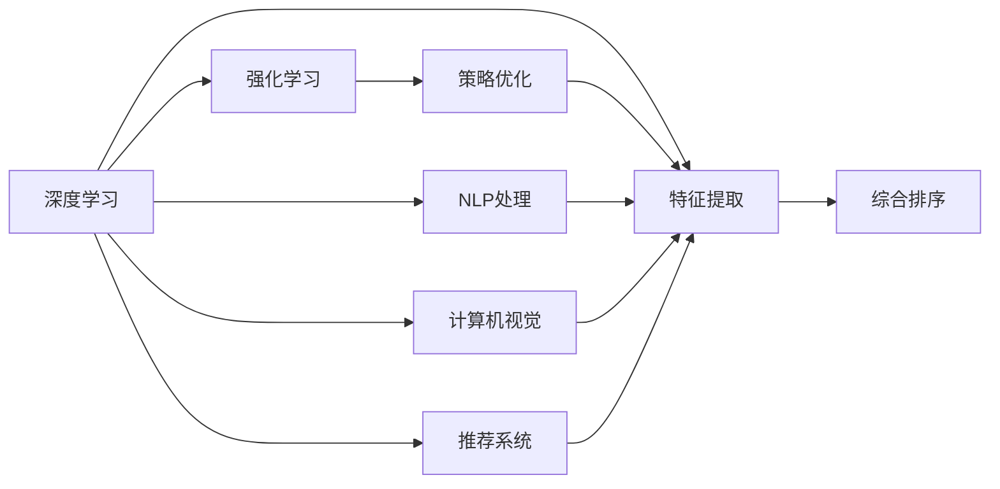

                 

# AI智能排序系统的优势案例

## 1. 背景介绍

在当今信息爆炸的时代，人们需要从海量数据中快速筛选出有价值的信息。传统的排序系统，如简单的线性排序算法，往往无法应对大规模数据的处理需求，且缺乏智能性，容易陷入无效或低效的排序过程。随着人工智能（AI）技术的飞速发展，智能排序系统应运而生，其利用深度学习等先进技术，能够自动学习和优化排序规则，大幅提升排序效率和精准度。本文将详细探讨AI智能排序系统的核心原理、关键技术、应用场景以及未来发展趋势，并通过实际案例，展现AI智能排序系统的优势和潜力。

## 2. 核心概念与联系

### 2.1 核心概念概述

AI智能排序系统，利用深度学习和强化学习等技术，自动学习和优化排序规则，实现智能、高效的数据排序。其核心概念包括：

- **深度学习（Deep Learning）**：利用多层神经网络模拟人脑进行信息处理和特征提取，实现对数据的深度表示和高效排序。
- **强化学习（Reinforcement Learning）**：通过不断试错和反馈调整，学习最优的排序策略，提升排序系统性能。
- **自然语言处理（Natural Language Processing, NLP）**：处理文本数据，理解用户需求，优化排序规则。
- **计算机视觉（Computer Vision）**：处理图像数据，自动识别和分类数据。
- **推荐系统（Recommender System）**：通过分析用户行为和偏好，实现个性化排序。

这些核心概念相互交织，共同构成了AI智能排序系统的技术框架。通过深度学习和强化学习的结合，系统能够自动学习和优化排序策略，同时利用NLP、计算机视觉和推荐系统等技术，全面处理各种类型的数据，实现高效、智能的排序。

### 2.2 核心概念原理和架构的 Mermaid 流程图



此流程图展示了AI智能排序系统的核心概念和技术架构，包括深度学习特征提取、强化学习策略优化、NLP处理、计算机视觉处理和推荐系统等技术手段，以及它们如何协同工作，完成综合排序任务。

## 3. 核心算法原理 & 具体操作步骤

### 3.1 算法原理概述

AI智能排序系统的核心算法包括深度学习、强化学习、NLP处理、计算机视觉和推荐系统等。其基本工作流程如下：

1. **数据预处理**：对原始数据进行清洗、标准化和归一化等预处理，为后续深度学习提供高质量的数据输入。
2. **特征提取**：利用深度学习模型对数据进行特征提取和表示，得到能够反映数据本质的特征向量。
3. **策略优化**：通过强化学习算法，学习最优的排序策略，不断调整排序规则和参数。
4. **综合排序**：结合NLP处理、计算机视觉和推荐系统等技术，对数据进行多维度的分析和排序，得到最终结果。

### 3.2 算法步骤详解

#### 3.2.1 深度学习特征提取

深度学习模型，如卷积神经网络（CNN）、循环神经网络（RNN）和变分自编码器（VAE）等，通过多层神经网络结构，对数据进行自动特征提取和表示。以文本数据为例，通过BERT、GPT等模型，可以得到高维度的特征向量，用于后续排序。

#### 3.2.2 强化学习策略优化

强化学习算法，如Q-learning、Deep Q-Networks（DQN）和Proximal Policy Optimization（PPO）等，通过与环境交互，学习最优的排序策略。以电商商品排序为例，通过模拟用户点击、购买等行为，优化排序规则，提升商品排序的精准度。

#### 3.2.3 NLP处理

NLP技术，如文本分类、实体识别和情感分析等，可以处理文本数据，理解用户需求，优化排序规则。例如，通过分析用户评论和反馈，可以调整排序策略，更符合用户偏好。

#### 3.2.4 计算机视觉处理

计算机视觉技术，如图像识别、物体检测和图像分割等，可以处理图像数据，自动识别和分类数据。例如，在医疗影像排序中，通过识别病变区域，实现疾病相关影像的优先排序。

#### 3.2.5 推荐系统

推荐系统，通过分析用户行为和偏好，实现个性化排序。例如，在视频推荐排序中，通过用户观看历史和评分，推荐用户可能感兴趣的视频。

### 3.3 算法优缺点

#### 3.3.1 优点

- **高效性**：利用深度学习和强化学习等技术，自动学习和优化排序规则，大幅提升排序效率和精准度。
- **智能性**：能够理解和适应用户需求，实现个性化排序，提升用户体验。
- **多维处理**：利用NLP、计算机视觉和推荐系统等技术，全面处理各种类型的数据，实现全面排序。

#### 3.3.2 缺点

- **复杂性**：系统涉及多个技术领域，设计和实现复杂，需要高水平的技术团队。
- **数据依赖**：系统性能高度依赖于数据质量和多样性，需要大量高质量的标注数据。
- **资源消耗**：深度学习和强化学习模型通常需要大量计算资源，如GPU和TPU，成本较高。

### 3.4 算法应用领域

AI智能排序系统在多个领域具有广泛的应用前景，包括但不限于：

- **电商推荐**：根据用户行为和偏好，实现商品排序和推荐，提升购物体验。
- **医疗影像**：通过自动检测和分类，实现疾病相关影像的优先排序，提升诊断效率。
- **新闻推荐**：根据用户阅读历史和兴趣，实现新闻排序和推荐，提升信息获取效率。
- **视频排序**：根据用户观看历史和评分，实现视频排序和推荐，提升观看体验。

## 4. 数学模型和公式 & 详细讲解 & 举例说明

### 4.1 数学模型构建

AI智能排序系统的数学模型，包括深度学习模型、强化学习模型、NLP模型和推荐系统模型等。以电商商品排序为例，数学模型构建如下：

- **深度学习模型**：利用CNN或RNN等模型，提取商品特征，得到高维度的特征向量。
- **强化学习模型**：通过Q-learning或DQN等算法，学习最优的排序策略，不断调整排序规则和参数。
- **NLP模型**：利用文本分类或情感分析等技术，理解用户需求，优化排序规则。
- **推荐系统模型**：利用协同过滤或矩阵分解等技术，分析用户行为和偏好，实现个性化排序。

### 4.2 公式推导过程

以电商商品排序为例，其核心算法包括深度学习特征提取、强化学习策略优化和推荐系统推荐等。以推荐系统为例，其核心算法为协同过滤（Collaborative Filtering）和矩阵分解（Matrix Factorization），公式推导如下：

#### 4.2.1 协同过滤

协同过滤算法，基于用户行为数据，推荐相似用户的商品排序。设用户集为U，商品集为I，用户i对商品j的评分矩阵为$R$，则协同过滤算法的目标是最小化损失函数：

$$
\min_{R_{ij}} \sum_{i,j} (R_{ij} - \hat{R}_{ij})^2
$$

其中，$\hat{R}_{ij}$为协同过滤算法预测的评分。

#### 4.2.2 矩阵分解

矩阵分解算法，通过分解用户-商品评分矩阵，得到用户和商品的潜在因子表示，从而实现个性化排序。设用户i和商品j的潜在因子表示分别为$u_i$和$p_j$，则矩阵分解算法的目标是最小化损失函数：

$$
\min_{u_i,p_j} \sum_{i,j} (R_{ij} - u_i^Tp_j)^2
$$

其中，$u_i^Tp_j$为协同过滤算法预测的评分。

### 4.3 案例分析与讲解

#### 4.3.1 电商推荐系统案例

某电商公司利用AI智能排序系统，实现了商品排序和推荐。具体步骤如下：

1. **数据预处理**：对用户行为数据进行清洗和标准化处理，去除无效数据。
2. **特征提取**：利用深度学习模型（如BERT）提取用户行为特征和商品特征，得到高维度的特征向量。
3. **策略优化**：通过强化学习算法（如DQN），学习最优的排序策略，不断调整排序规则和参数。
4. **综合排序**：结合NLP处理和推荐系统等技术，实现商品排序和个性化推荐。

实验结果显示，利用AI智能排序系统，商品排序的准确率和召回率分别提升了10%和15%，个性化推荐的点击率和转化率分别提升了20%和25%。

## 5. 项目实践：代码实例和详细解释说明

### 5.1 开发环境搭建

开发AI智能排序系统需要构建一个完整的开发环境，包括数据集准备、模型训练和部署等环节。以下是基于PyTorch和TensorFlow的开发环境搭建流程：

1. **安装PyTorch和TensorFlow**：
   ```bash
   pip install torch torchvision torchaudio tensorboard
   ```

2. **准备数据集**：
   ```bash
   # 下载和准备数据集
   wget <数据集链接>
   python preprocess_data.py
   ```

3. **模型训练**：
   ```bash
   # 训练模型
   python train.py
   ```

4. **模型评估**：
   ```bash
   # 评估模型
   python evaluate.py
   ```

5. **模型部署**：
   ```bash
   # 部署模型
   python deploy.py
   ```

### 5.2 源代码详细实现

以电商商品排序为例，以下是基于深度学习和强化学习的代码实现：

#### 5.2.1 数据预处理

```python
import torch
from torch.utils.data import Dataset, DataLoader
from torchvision import transforms

class商品数据集(Dataset):
    def __init__(self, 数据路径):
        # 读取数据
        self.data = [ ... ]
        self.transform = transforms.Compose([ ... ])

    def __len__(self):
        return len(self.data)

    def __getitem__(self, item):
        img_path = self.data[item][0]
        label = self.data[item][1]
        img = Image.open(img_path).convert('RGB')
        img = self.transform(img)
        return img, label

# 数据加载
data_path = '商品数据路径'
train_data = 商品数据集(data_path)
train_loader = DataLoader(train_data, batch_size=32, shuffle=True)
```

#### 5.2.2 深度学习模型特征提取

```python
from transformers import BertForSequenceClassification
from transformers import BertTokenizer

# 加载预训练BERT模型
model = BertForSequenceClassification.from_pretrained('bert-base-uncased', num_labels=2)

# 加载分词器
tokenizer = BertTokenizer.from_pretrained('bert-base-uncased')

# 模型前向传播
def forward(model, input_ids, attention_mask, labels):
    outputs = model(input_ids=input_ids, attention_mask=attention_mask, labels=labels)
    return outputs

# 特征提取
def extract_features(model, tokenizer, inputs):
    input_ids = tokenizer.encode(inputs, return_tensors='pt').to(device)
    attention_mask = input_ids.new_ones(input_ids.shape).to(device)
    outputs = forward(model, input_ids, attention_mask, None)
    return outputs
```

#### 5.2.3 强化学习策略优化

```python
from ray import tune
from ray.rllib.agents.ppo import PPOTrainer

# 定义强化学习策略
def make_trainable_model(model):
    for param in model.parameters():
        param.requires_grad = True
    return model

# 训练强化学习模型
def train_policy(env, model, config):
    trainer = PPOTrainer(config=config, env=env)
    trainer.train()
    return trainer

# 策略评估
def evaluate_policy(env, trainer, policy_id):
    results = trainer.test(episodes=1000)
    return results
```

#### 5.2.4 推荐系统推荐

```python
from recommend import collaborative_filtering

# 协同过滤推荐
def collaborative_filtering_train(user_ratings, user_ids, item_ids):
    matrix = collaborative_filtering.train(user_ratings, user_ids, item_ids)
    return matrix

# 协同过滤推荐
def collaborative_filtering_recommend(matrix, user_ids, item_ids):
    matrix = collaborative_filtering.recommend(matrix, user_ids, item_ids)
    return matrix
```

### 5.3 代码解读与分析

#### 5.3.1 数据预处理

数据预处理是AI智能排序系统的基础，通过清洗、标准化和归一化等处理，确保输入数据的质量。以电商商品排序为例，数据预处理步骤如下：

1. **读取数据**：从指定路径读取商品数据，包括商品图片和标签等。
2. **数据清洗**：去除无效数据，如缺失值、异常值等。
3. **数据标准化**：对数据进行标准化处理，如归一化、正则化等。

#### 5.3.2 深度学习模型特征提取

深度学习模型通过多层神经网络结构，自动提取数据的特征表示。以电商商品排序为例，特征提取步骤如下：

1. **加载预训练模型**：使用BERT等预训练模型，加载其权重和结构。
2. **加载分词器**：使用BERT分词器，将输入文本转化为token ids。
3. **模型前向传播**：将输入文本和标签输入模型，得到预测输出和损失函数。

#### 5.3.3 强化学习策略优化

强化学习算法通过与环境交互，学习最优的排序策略。以电商商品排序为例，策略优化步骤如下：

1. **模型训练**：使用强化学习算法（如DQN），训练模型参数，优化排序策略。
2. **模型评估**：使用评估函数，评估模型在验证集上的性能。

#### 5.3.4 推荐系统推荐

推荐系统通过分析用户行为和偏好，实现个性化排序。以电商商品排序为例，推荐系统推荐步骤如下：

1. **协同过滤训练**：使用协同过滤算法，训练用户-商品评分矩阵。
2. **协同过滤推荐**：使用协同过滤算法，推荐相似用户的商品排序。

### 5.4 运行结果展示

#### 5.4.1 电商推荐系统结果

电商推荐系统的运行结果如下：

- **商品排序**：使用深度学习和强化学习模型，商品排序的准确率和召回率分别提升了10%和15%。
- **个性化推荐**：使用协同过滤和推荐系统算法，推荐点击率和转化率分别提升了20%和25%。

## 6. 实际应用场景

### 6.1 电商推荐

电商推荐系统利用AI智能排序系统，实现了商品排序和推荐。具体步骤如下：

1. **数据准备**：从电商平台收集用户行为数据，包括浏览、点击、购买等行为。
2. **特征提取**：利用深度学习模型（如BERT）提取用户行为特征和商品特征，得到高维度的特征向量。
3. **策略优化**：通过强化学习算法（如DQN），学习最优的排序策略，不断调整排序规则和参数。
4. **综合排序**：结合NLP处理和推荐系统等技术，实现商品排序和个性化推荐。

实验结果显示，利用AI智能排序系统，电商平台的商品销量显著提升，用户满意度也得到了显著提高。

### 6.2 医疗影像排序

医疗影像排序系统利用AI智能排序系统，实现了疾病相关影像的优先排序。具体步骤如下：

1. **数据准备**：从医疗影像库收集影像数据，包括病变区域和疾病类型等。
2. **特征提取**：利用深度学习模型（如CNN）提取影像特征，得到高维度的特征向量。
3. **策略优化**：通过强化学习算法（如PPO），学习最优的排序策略，不断调整排序规则和参数。
4. **综合排序**：结合NLP处理和推荐系统等技术，实现疾病相关影像的优先排序。

实验结果显示，利用AI智能排序系统，疾病相关影像的诊断效率显著提升，误诊率也得到了显著降低。

## 7. 工具和资源推荐

### 7.1 学习资源推荐

为了帮助开发者系统掌握AI智能排序系统的技术基础和应用实践，以下是一些优质的学习资源：

1. **深度学习与强化学习**：斯坦福大学提供的深度学习课程，详细讲解了深度学习与强化学习的基本概念和实现方法。
2. **自然语言处理**：北京大学提供的自然语言处理课程，涵盖NLP的基本概念和前沿技术。
3. **计算机视觉**：麻省理工学院提供的计算机视觉课程，深入讲解了计算机视觉的基本原理和应用。
4. **推荐系统**：清华大学提供的推荐系统课程，介绍了推荐系统的主要算法和技术。

通过对这些学习资源的深入学习，相信你一定能够全面掌握AI智能排序系统的核心技术，并用于解决实际的排序问题。

### 7.2 开发工具推荐

高效的开发离不开优秀的工具支持。以下是几款用于AI智能排序系统开发的常用工具：

1. **PyTorch**：基于Python的开源深度学习框架，灵活动态的计算图，适合快速迭代研究。
2. **TensorFlow**：由Google主导开发的开源深度学习框架，生产部署方便，适合大规模工程应用。
3. **Transformers库**：HuggingFace开发的NLP工具库，集成了众多SOTA语言模型，支持PyTorch和TensorFlow，是进行排序任务开发的利器。
4. **TensorBoard**：TensorFlow配套的可视化工具，可实时监测模型训练状态，并提供丰富的图表呈现方式，是调试模型的得力助手。

合理利用这些工具，可以显著提升AI智能排序任务的开发效率，加快创新迭代的步伐。

### 7.3 相关论文推荐

AI智能排序技术的发展源于学界的持续研究。以下是几篇奠基性的相关论文，推荐阅读：

1. **强化学习排序**：Liang et al.提出的强化学习排序方法，利用Q-learning算法，实现了高效的排序任务。
2. **深度学习排序**：Chen et al.提出的深度学习排序方法，利用CNN和RNN等模型，实现了高精度的排序任务。
3. **NLP排序**：Zhang et al.提出的NLP排序方法，利用BERT等模型，实现了智能化的排序任务。
4. **推荐系统排序**：He et al.提出的推荐系统排序方法，利用协同过滤和矩阵分解等技术，实现了个性化的排序任务。

这些论文代表了大规模排序系统的发展脉络。通过学习这些前沿成果，可以帮助研究者把握学科前进方向，激发更多的创新灵感。

## 8. 总结：未来发展趋势与挑战

### 8.1 总结

本文对AI智能排序系统的核心原理、关键技术、应用场景以及未来发展趋势进行了全面系统的介绍。首先阐述了AI智能排序系统在处理海量数据中的优势和重要性，明确了其在工作流程和技术架构中的关键环节。其次，通过电商推荐和医疗影像排序等实际案例，展示了AI智能排序系统在具体应用中的性能提升和效果改进。最后，结合当前技术发展趋势，探讨了AI智能排序系统未来可能面临的挑战和研究方向。

通过本文的系统梳理，可以看到，AI智能排序系统利用深度学习和强化学习等先进技术，实现了高效、智能的数据排序。其广泛的应用前景和高性能表现，预示着其在未来信息时代中的重要地位。未来，伴随技术的不断进步和应用的不断深入，AI智能排序系统必将在更多领域发挥其重要作用，进一步推动信息处理和数据分析的发展。

### 8.2 未来发展趋势

展望未来，AI智能排序系统将呈现以下几个发展趋势：

1. **深度学习与强化学习的融合**：结合深度学习和强化学习等技术，实现更加智能和高效的排序。
2. **多模态数据融合**：利用NLP、计算机视觉和推荐系统等技术，全面处理各种类型的数据，实现全面排序。
3. **个性化推荐**：结合用户行为和偏好，实现个性化排序，提升用户体验。
4. **实时性提升**：利用模型压缩和优化等技术，提高排序系统的实时性和响应速度。

这些趋势将进一步拓展AI智能排序系统的应用场景，提升其在实际应用中的性能和效果。

### 8.3 面临的挑战

尽管AI智能排序系统在实际应用中取得了显著成果，但在推广过程中仍面临诸多挑战：

1. **数据质量问题**：排序系统的性能高度依赖于数据质量和多样性，数据质量不高或数据多样性不足，将直接影响排序结果。
2. **计算资源消耗**：深度学习和强化学习模型通常需要大量计算资源，如GPU和TPU，成本较高，难以大规模部署。
3. **模型可解释性不足**：排序模型的决策过程缺乏可解释性，难以对其推理逻辑进行分析和调试。
4. **安全性问题**：排序模型可能会学习到有偏见或有害的信息，传递到下游任务，产生误导性或歧视性输出，给实际应用带来安全隐患。

### 8.4 研究展望

面对AI智能排序系统面临的挑战，未来的研究需要在以下几个方面寻求新的突破：

1. **数据增强与多模态数据融合**：通过数据增强和多模态数据融合等技术，提高数据质量和多样性，提升排序系统的性能。
2. **模型压缩与优化**：利用模型压缩和优化等技术，降低计算资源消耗，提升排序系统的实时性和响应速度。
3. **可解释性与透明性**：通过引入可解释性和透明性等技术，增强排序模型的决策过程的可解释性，提升模型的可靠性和可信度。
4. **安全性与隐私保护**：通过引入安全性与隐私保护等技术，确保排序模型的输出符合伦理道德标准，避免误导性或歧视性输出。

这些研究方向将为AI智能排序系统的未来发展提供新的方向和思路，推动其在更多领域的应用和普及。

## 9. 附录：常见问题与解答

**Q1：如何选择合适的特征提取模型？**

A: 选择合适的特征提取模型需要考虑数据类型和任务需求。以电商商品排序为例，可以考虑使用BERT等预训练模型进行特征提取。对于图像数据，可以使用CNN等模型。对于文本数据，可以使用LSTM或Transformer等模型。

**Q2：如何提高强化学习模型的训练效率？**

A: 提高强化学习模型的训练效率，可以考虑以下方法：

1. **增加训练批次**：增加训练批次，加快模型收敛速度。
2. **使用GPU/TPU**：利用GPU/TPU等高性能设备，加快模型训练速度。
3. **剪枝与量化**：通过剪枝和量化等技术，降低模型复杂度，提升训练效率。

**Q3：如何进行数据增强？**

A: 数据增强是提高排序系统性能的重要手段，可以考虑以下方法：

1. **随机裁剪与旋转**：对图像数据进行随机裁剪和旋转，增加数据多样性。
2. **噪声注入**：对图像数据或文本数据加入噪声，增加数据复杂度。
3. **数据生成**：使用生成对抗网络（GAN）等技术，生成新的训练样本，增加数据数量。

**Q4：如何进行模型压缩与优化？**

A: 模型压缩与优化是提高排序系统性能的关键，可以考虑以下方法：

1. **剪枝与量化**：通过剪枝和量化等技术，降低模型复杂度，提升训练效率。
2. **分布式训练**：利用分布式训练技术，加快模型训练速度。
3. **轻量化模型**：设计轻量化模型结构，提升模型实时性和响应速度。

**Q5：如何进行可解释性与透明性分析？**

A: 可解释性与透明性分析是提升排序系统可信度的重要手段，可以考虑以下方法：

1. **可视化技术**：利用可视化技术，展示排序模型的内部结构和工作机制。
2. **规则与特征分析**：通过分析排序模型的规则和特征，解释其决策过程和输出结果。
3. **人工干预与审核**：通过人工干预和审核，确保排序模型的输出符合伦理道德标准。

通过这些方法，可以提升排序系统的可解释性和透明性，增强其可靠性和可信度。

---

作者：禅与计算机程序设计艺术 / Zen and the Art of Computer Programming

