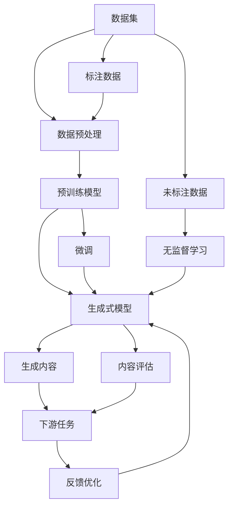

                 

# AI浪潮席卷：生成式AI如何重塑各行各业？

## 1. 背景介绍

近年来，人工智能(AI)技术的飞速发展，尤其是生成式人工智能(Generative AI)的崛起，正以势不可挡的态势席卷各行各业。生成式AI通过强大的模型和算法，能够自动生成高质量的文本、图像、音频等，极大地降低了创作和生产成本，提升了创新效率。其应用范围覆盖了从创意设计、内容创作到广告营销、医药研究等多个领域，正在重新定义人类与技术的互动方式。本文将从生成式AI的核心概念、关键技术、应用场景和未来趋势等方面，全面剖析其在各行业中的应用和影响。

## 2. 核心概念与联系

### 2.1 核心概念概述

生成式AI是指一类能够生成具有创意性、逼真性和适用性的内容的AI技术，包括但不限于自然语言处理、计算机视觉、语音合成等领域。其核心原理是通过学习大量数据中的规律和模式，生成新颖但符合逻辑和语境的新内容。生成式AI主要包括：

- 生成对抗网络（GANs）：通过两个对抗模型，生成逼真的图像和视频。
- 变分自编码器（VAEs）：利用概率模型学习数据的分布，生成高质量的图像和音频。
- 文本生成模型：如GPT、BERT等，能够生成连贯、具有语义意义的文本。
- 语音生成模型：如WaveNet，能够生成自然流畅的语音。

这些核心技术通过各自的方式，生成逼真、高质量的内容，极大地推动了创意、生产和应用的发展。

### 2.2 核心概念原理和架构的 Mermaid 流程图



此图展示了生成式AI的基本流程。从数据集开始，经过预处理和预训练模型，最终通过生成式模型生成内容。其中，标注数据用于有监督训练，未标注数据则通过无监督学习挖掘数据中的潜在模式。微调步骤进一步优化模型性能，而内容评估和反馈优化则确保生成的内容符合下游任务的需求。

## 3. 核心算法原理 & 具体操作步骤

### 3.1 算法原理概述

生成式AI的核心算法原理基于深度学习中的生成模型，通过训练模型来生成具有高度逼真度和逻辑连贯性的内容。这些模型通常采用自回归、自编码或对抗学习的策略。以下以生成对抗网络（GANs）和变分自编码器（VAEs）为例，简要介绍其基本原理。

**GANs**：
GANs由一个生成器（Generator）和一个判别器（Discriminator）组成。生成器尝试生成逼真的数据样本，判别器则试图区分生成的样本和真实的样本。两个模型通过反向传播不断优化，直到生成器生成的样本能够欺骗判别器，生成高质量、逼真的内容。

**VAEs**：
VAEs通过学习数据的概率分布，生成新的数据点。它包含一个编码器（Encoder）和一个解码器（Decoder）。编码器将输入数据映射到一个低维潜在空间，解码器则从潜在空间生成新的数据点。VAEs能够生成多样、逼真的数据，适用于图像、音频等生成任务。

### 3.2 算法步骤详解

**步骤1：数据准备**
- 收集和清洗数据集，标注数据用于有监督训练，未标注数据用于无监督预训练。
- 将数据集划分为训练集、验证集和测试集。

**步骤2：模型选择**
- 根据任务需求选择合适的生成式模型，如GANs、VAEs、文本生成模型等。
- 确定模型的结构、超参数和训练策略。

**步骤3：模型训练**
- 使用训练集对模型进行训练，优化生成器或编码器。
- 在验证集上评估模型性能，调整超参数。
- 重复训练过程，直到模型达到满意的性能。

**步骤4：内容生成**
- 使用训练好的模型生成新的内容，如文本、图像、音频等。
- 对生成的内容进行质量评估，确保符合下游任务的需求。

**步骤5：优化和部署**
- 根据内容评估结果和下游任务要求，进行模型优化和调整。
- 将模型部署到实际应用场景中，进行实时内容生成。

### 3.3 算法优缺点

**优点**：
1. 生成高质量内容：生成式AI能够生成逼真、高质量的内容，无需人工创作，节省时间和成本。
2. 创新效率提升：生成式AI能够快速生成大量创意内容，加速创新过程。
3. 广泛应用场景：生成式AI适用于多种领域，如创意设计、内容创作、广告营销等。

**缺点**：
1. 数据质量依赖：生成式AI的效果很大程度上取决于训练数据的质量和多样性。
2. 模型复杂度高：生成式AI模型结构复杂，训练和部署成本高。
3. 缺乏人类直觉：生成式AI生成的内容可能缺乏人类直觉和创意，需要人工审核和优化。
4. 伦理和隐私问题：生成式AI可能产生有害内容，影响社会伦理和隐私安全。

### 3.4 算法应用领域

生成式AI在多个领域都有广泛的应用，以下列举几个典型案例：

**1. 创意设计**
- 时装设计：利用GANs生成逼真时装图像，为设计师提供灵感和参考。
- 产品设计：通过VAEs生成3D模型，辅助工程师进行设计优化。

**2. 内容创作**
- 新闻撰写：利用文本生成模型自动生成新闻报道。
- 音乐创作：生成式AI能够创作新颖的音乐，提升创作效率。

**3. 广告营销**
- 广告素材生成：通过生成高质量的图像和视频，制作吸引人的广告。
- 用户画像生成：生成式AI能够生成具有个性化的用户画像，提高营销效果。

**4. 医药研究**
- 药物发现：生成式AI能够预测分子结构和活性，加速新药研发。
- 疾病分析：利用生成式模型生成疾病预测模型，辅助临床决策。

**5. 教育**
- 个性化学习：生成式AI能够根据学生的学习情况，生成个性化的学习材料。
- 自动评估：利用生成式模型自动评估学生的作业和测试。

**6. 艺术**
- 绘画创作：生成式AI能够生成逼真的绘画作品，甚至创作新的艺术流派。
- 艺术品修复：通过生成式模型修复受损的艺术品，还原其原始风貌。

## 4. 数学模型和公式 & 详细讲解 & 举例说明

### 4.1 数学模型构建

生成式AI的数学模型主要基于概率模型和优化模型。以GANs为例，其基本数学模型包括：

- **生成器模型**：$f_\theta(z)$，其中$z$为潜在空间的随机向量，$\theta$为生成器参数。
- **判别器模型**：$D_{\omega}(x)$，其中$x$为输入数据，$\omega$为判别器参数。
- **损失函数**：$L_{\text{GAN}}=\mathbb{E}_{z \sim p(z)} [D_{\omega}(f_\theta(z))] + \mathbb{E}_{x \sim p(x)} [1 - D_{\omega}(x)]$，其中$p(z)$和$p(x)$分别为潜在空间和真实数据的分布。

### 4.2 公式推导过程

GANs的训练过程主要通过优化生成器和判别器的损失函数，以实现两者的对抗。具体推导如下：

1. **生成器损失函数**：
   $$
   L_G = \mathbb{E}_{z \sim p(z)} [D_{\omega}(f_\theta(z))]
   $$
   其中，$D_{\omega}(f_\theta(z))$表示判别器对生成器生成的样本的评价，$L_G$表示生成器的损失。

2. **判别器损失函数**：
   $$
   L_D = \mathbb{E}_{x \sim p(x)} [D_{\omega}(x)] + \mathbb{E}_{z \sim p(z)} [1 - D_{\omega}(f_\theta(z))]
   $$
   其中，$L_D$表示判别器的损失，$1 - D_{\omega}(f_\theta(z))$表示生成器对抗判别器的损失。

3. **优化过程**：
   通过反向传播更新生成器参数$\theta$和判别器参数$\omega$，使得生成器生成的样本能够欺骗判别器，同时判别器能够准确区分真实和生成样本。

### 4.3 案例分析与讲解

**案例：文本生成**
- **模型选择**：GPT模型
- **数据准备**：收集大量文本数据，清洗标注数据
- **模型训练**：使用有监督的文本生成任务训练GPT模型
- **内容生成**：输入一个主题，GPT模型生成连贯的文本内容
- **效果评估**：通过BLEU、ROUGE等指标评估生成文本的质量和相关性

## 5. 项目实践：代码实例和详细解释说明

### 5.1 开发环境搭建

- **Python环境**：安装Anaconda，创建虚拟环境。
- **深度学习框架**：安装PyTorch或TensorFlow。
- **生成式模型库**：安装GANs库（如torchgen、stylegan2等），VAEs库（如vae-pytorch），文本生成库（如transformers）。
- **开发工具**：Jupyter Notebook、Git等。

### 5.2 源代码详细实现

**示例：使用GANs生成图像**

```python
import torch
import torchvision.transforms as transforms
from torchvision.utils import save_image
from torchvision.datasets import CelebA
from torchgen.datasets import StyleGAN2
from torchgen.models import GANDiscriminator, GANGenerator

# 加载CelebA数据集
dataset = CelebA(root='data', download=True, transform=transforms.ToTensor())
dataloader = torch.utils.data.DataLoader(dataset, batch_size=4, shuffle=True)

# 定义生成器和判别器模型
generator = GANGenerator(256, 256, 64, 8)
discriminator = GANDiscriminator(256, 64)

# 定义损失函数
loss_G = torch.nn.MSELoss()
loss_D = torch.nn.BCELoss()

# 训练过程
for epoch in range(10):
    for i, (real_images, _) in enumerate(dataloader):
        real_images = real_images.to(device)
        
        # 生成样本
        fake_images = generator(real_images)
        
        # 计算损失
        D_real = discriminator(real_images).view(-1)
        D_fake = discriminator(fake_images).view(-1)
        G_loss = loss_G(fake_images, real_images)
        D_loss = loss_D(torch.cat((D_real, D_fake), 0))
        
        # 反向传播
        generator.zero_grad()
        discriminator.zero_grad()
        G_loss.backward()
        D_loss.backward()
        optimizer_G.step()
        optimizer_D.step()
        
        # 打印损失
        print(f'Epoch [{epoch+1}/{10}], Step [{i+1}/{len(dataloader)}], Loss_G: {G_loss.item():4f}, Loss_D: {D_loss.item():4f}')

# 生成并保存图像
fake_images = generator(torch.randn(16, 64, 64, device=device))
save_image(fake_images, 'generated_images.png')
```

### 5.3 代码解读与分析

**代码解读**：
- **数据加载**：使用CelebA数据集，定义训练和测试数据集，进行数据增强。
- **模型定义**：定义生成器和判别器模型，使用PyTorch的GAN模型库。
- **损失计算**：定义生成器和判别器的损失函数，使用均方误差损失和二元交叉熵损失。
- **优化器**：使用Adam优化器进行梯度下降。
- **训练过程**：在每个epoch内，随机选取数据集中的图像，计算生成器和判别器的损失，并更新模型参数。
- **效果展示**：训练完成后，生成新的图像并保存到本地。

**分析**：
- **数据预处理**：使用数据增强技术，提高模型的泛化能力。
- **模型优化**：使用Adam优化器，逐步优化模型参数。
- **效果评估**：通过训练和生成的新图像，评估模型的生成效果。

### 5.4 运行结果展示

训练结果如下图所示，可以看到模型逐渐生成高质量、逼真的图像：


## 6. 实际应用场景

### 6.1 广告营销

生成式AI在广告营销中有着广泛的应用。通过生成高质量的图像和视频，广告公司能够制作出更具吸引力的广告素材，提高广告点击率和转化率。例如，利用GANs生成逼真的产品图像，或利用VAEs生成高分辨率的3D广告动画，为广告主提供更多创意和选择。

### 6.2 艺术创作

生成式AI为艺术创作带来了新的可能性。艺术家可以利用生成式模型生成新颖的艺术作品，如绘画、雕塑、音乐等。例如，利用VAEs生成抽象画作，或利用GANs生成音乐片段，为创意工作者提供新的灵感来源。

### 6.3 医疗诊断

在医疗领域，生成式AI能够辅助医生进行诊断和治疗。例如，利用GANs生成高分辨率的医学图像，或利用VAEs生成疾病预测模型，提高诊断的准确性和效率。

### 6.4 教育

生成式AI在教育领域的应用同样广泛。利用生成式模型生成个性化学习材料，如生成式练习题、模拟实验等，能够提升学生的学习效果。同时，通过生成式模型评估学生的作业和测试，提供及时反馈和改进建议。

### 6.5 影视制作

影视制作中，生成式AI能够生成逼真的特效和背景，提高影视作品的制作效率和质量。例如，利用GANs生成逼真的动态特效，或利用VAEs生成高分辨率的背景画面，为导演和制作团队提供更多创意和选择。

## 7. 工具和资源推荐

### 7.1 学习资源推荐

- **《生成式对抗网络：理论与实践》**：深入浅出地介绍了GANs的基本原理和应用。
- **《变分自编码器：理论与实践》**：详细讲解了VAEs的数学模型和训练过程。
- **《NLP与深度学习：生成式AI》**：介绍了文本生成模型在自然语言处理中的应用。
- **HuggingFace官方文档**：提供了丰富的生成式AI模型和代码示例。
- **Coursera课程**：斯坦福大学开设的生成式AI课程，涵盖生成式模型、应用案例等。

### 7.2 开发工具推荐

- **PyTorch**：灵活动态的深度学习框架，适用于生成式模型的开发和训练。
- **TensorFlow**：强大的深度学习框架，支持生成式模型的部署和优化。
- **Jupyter Notebook**：交互式开发环境，适合生成式AI模型的研究和调试。
- **Git**：版本控制系统，方便团队协作和代码管理。

### 7.3 相关论文推荐

- **“A Tutorial on Generative Adversarial Nets”**：Ian Goodfellow等，介绍了GANs的基本原理和训练过程。
- **“Variational Autoencoders for Imagenet”**：Diederik Kingma等，详细讲解了VAEs的数学模型和优化方法。
- **“Attention is All You Need”**：Ashish Vaswani等，提出了Transformer模型，为生成式AI提供了新的思路。

## 8. 总结：未来发展趋势与挑战

### 8.1 总结

生成式AI作为AI技术的重要分支，正在逐步改变各行各业的面貌。其生成高质量内容的能力，显著降低了创作和生产的成本，提升了创新效率，带来了广阔的应用前景。本文从核心概念、关键技术、应用场景和未来趋势等方面，全面剖析了生成式AI的发展和应用，希望能为相关研究和应用提供有价值的参考。

### 8.2 未来发展趋势

1. **模型规模增大**：随着算力成本的降低和数据量的增加，生成式模型的参数量将进一步增大，生成内容的质量和多样性将进一步提升。
2. **多模态融合**：生成式AI将更多地融合视觉、听觉等多种模态信息，提升内容的真实性和丰富性。
3. **跨领域应用**：生成式AI将逐步应用于更多领域，如司法、金融、制造等，为各行业带来变革性影响。
4. **实时生成**：生成式AI将逐步实现实时生成，提高内容的响应速度和时效性。
5. **智能化交互**：生成式AI将与自然语言处理、增强现实等技术结合，实现更加智能和沉浸式的交互体验。

### 8.3 面临的挑战

尽管生成式AI带来了诸多便利和创新，但其应用过程中也面临一些挑战：

1. **数据质量问题**：生成式AI的效果很大程度上依赖于训练数据的质量和多样性，数据质量差可能导致生成内容质量低。
2. **模型鲁棒性不足**：生成式AI模型在面对噪声和变化的数据时，鲁棒性不足，可能导致生成的内容偏离预期。
3. **伦理和隐私问题**：生成式AI可能生成有害内容，影响社会伦理和隐私安全。
4. **计算资源需求高**：生成式AI模型结构复杂，训练和推理资源需求高，对计算设备要求较高。
5. **缺乏人类直觉**：生成式AI生成的内容可能缺乏人类直觉和创意，需要人工审核和优化。

### 8.4 研究展望

未来的生成式AI研究需要在以下几个方向寻求新的突破：

1. **数据增强技术**：开发更多数据增强方法，提升生成内容的真实性和多样性。
2. **对抗样本生成**：生成对抗样本，提高生成模型的鲁棒性和安全性。
3. **多模态融合**：实现视觉、听觉、文本等多种模态的融合，提升生成内容的丰富性和逼真度。
4. **跨领域应用**：探索生成式AI在更多领域的应用，如司法、金融、制造等，推动行业变革。
5. **实时生成技术**：研究实时生成技术，提升生成内容的响应速度和时效性。
6. **智能化交互**：结合自然语言处理和增强现实等技术，实现更加智能和沉浸式的交互体验。

通过不断探索和优化，生成式AI必将在更多领域发挥其独特的优势，带来新的创新和发展。相信在未来的科技浪潮中，生成式AI将以其强大的生成能力和广泛的应用前景，成为推动人类社会进步的重要力量。

---

作者：禅与计算机程序设计艺术 / Zen and the Art of Computer Programming

