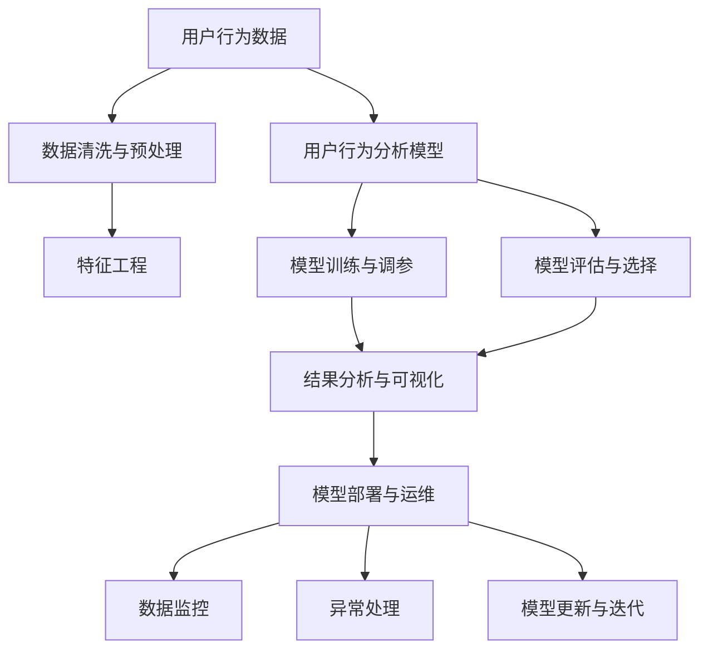

                 

# AI用户行为分析系统的实现案例

## 1. 背景介绍

### 1.1 问题由来

随着数字化技术的迅猛发展，用户行为数据已经成为企业数字化转型的核心资产之一。通过深入分析用户行为，企业能够更好地了解用户需求，优化产品体验，提高市场竞争力。然而，传统的用户行为分析方法存在数据杂乱、分析复杂、结果解读难度高等问题，无法满足企业在实际运营中的需求。

为了提升用户行为分析的效率和精准度，企业需要借助人工智能(AI)技术，构建一套高效、易用的用户行为分析系统。AI技术能够自动挖掘数据中的模式和趋势，辅助业务决策，提高分析质量和效率。

### 1.2 问题核心关键点

构建AI用户行为分析系统，需要解决以下核心问题：

1. **数据获取与整合**：从多个渠道（如网站、应用、社交媒体等）获取用户行为数据，并进行数据清洗和整合。
2. **数据预处理**：对原始数据进行特征提取和标准化处理，提升数据质量。
3. **模型选择与训练**：选择适合的用户行为分析模型，进行训练和调参，生成预测模型。
4. **结果分析与可视化**：利用自然语言处理(NLP)、图像处理、时序分析等技术，对模型结果进行分析和可视化，辅助业务决策。
5. **系统部署与运维**：将模型部署到生产环境，实现实时数据处理和结果输出。

本案例将详细阐述AI用户行为分析系统的实现流程，包括数据获取、模型选择、结果分析等关键环节。

## 2. 核心概念与联系

### 2.1 核心概念概述

为更好地理解AI用户行为分析系统的实现，本节将介绍几个密切相关的核心概念：

- **用户行为数据**：用户在网站、应用、社交媒体等渠道产生的数据，包括点击、浏览、购买、评论等行为记录。
- **数据清洗与预处理**：通过数据清洗和预处理技术，如去重、标准化、填充缺失值等，提升数据质量。
- **用户行为分析模型**：用于挖掘用户行为模式和趋势的AI模型，包括分类模型、聚类模型、时序模型等。
- **自然语言处理(NLP)**：处理和分析自然语言文本数据的AI技术，用于解析用户评论、反馈等信息。
- **可视化技术**：将模型结果以图表、仪表盘等形式展现，辅助业务决策。
- **模型部署与运维**：将模型部署到生产环境，实现实时数据处理和结果输出，并进行系统监控和故障排除。

这些核心概念之间的逻辑关系可以通过以下Mermaid流程图来展示：



这个流程图展示了AI用户行为分析系统的核心流程：

1. 用户行为数据作为输入。
2. 数据清洗和预处理提升数据质量。
3. 选择合适的用户行为分析模型，进行训练和调参。
4. 对模型进行评估和选择，确定最优模型。
5. 对模型结果进行分析和可视化，辅助业务决策。
6. 将模型部署到生产环境，实现实时数据处理和结果输出。
7. 进行系统监控和异常处理，确保系统稳定运行。

## 3. 核心算法原理 & 具体操作步骤

### 3.1 算法原理概述

AI用户行为分析系统基于机器学习和深度学习技术，通过自动化挖掘用户行为数据中的模式和趋势，生成预测模型，辅助业务决策。其核心算法包括：

- **监督学习**：通过标注数据训练分类模型，预测用户行为。
- **无监督学习**：从未标注数据中发现用户行为模式，进行聚类、关联规则挖掘等。
- **时序分析**：分析时间序列数据，预测用户行为趋势，如购物周期、回访时间等。
- **NLP技术**：解析用户评论、反馈等文本数据，提取用户情感、需求等有用信息。

### 3.2 算法步骤详解

构建AI用户行为分析系统的具体步骤包括：

**Step 1: 数据收集与清洗**

- 使用爬虫、API接口等手段，从网站、应用、社交媒体等渠道收集用户行为数据。
- 对数据进行初步清洗，去除重复、缺失、异常数据。

**Step 2: 数据预处理**

- 对用户行为数据进行特征提取，如时间戳、设备类型、浏览路径等。
- 使用标准化、归一化等方法，提升数据质量。
- 处理缺失值，如填充均值、中位数等。

**Step 3: 特征工程**

- 根据业务需求，选择并提取关键特征。
- 利用特征选择、降维等技术，优化特征集合。

**Step 4: 模型选择与训练**

- 选择适合的用户行为分析模型，如分类模型（如Logistic回归、SVM）、聚类模型（如K-means）、时序模型（如LSTM）等。
- 使用标注数据训练模型，调整超参数，优化模型性能。

**Step 5: 模型评估与选择**

- 使用验证集对模型进行评估，如准确率、召回率、F1值等。
- 选择表现最优的模型，用于后续分析和预测。

**Step 6: 结果分析与可视化**

- 利用NLP技术解析用户评论、反馈等文本数据，提取情感、需求等有用信息。
- 使用可视化技术将模型结果以图表、仪表盘等形式展现，辅助业务决策。

**Step 7: 模型部署与运维**

- 将模型部署到生产环境，实现实时数据处理和结果输出。
- 进行系统监控和异常处理，确保系统稳定运行。
- 定期更新模型，适应数据分布的变化。

### 3.3 算法优缺点

AI用户行为分析系统具有以下优点：

1. **高效性**：自动化处理大量用户行为数据，提升分析效率。
2. **准确性**：通过机器学习模型挖掘数据中的模式和趋势，提高预测准确性。
3. **灵活性**：可以针对不同的业务需求，灵活选择和组合算法模型。
4. **可解释性**：利用NLP技术解析用户评论、反馈等文本数据，提供模型结果的解释。
5. **自动化运维**：通过自动化运维技术，确保系统稳定运行。

同时，该系统也存在一定的局限性：

1. **数据依赖**：对数据质量和标注数据依赖较高，数据获取和标注成本较高。
2. **模型复杂性**：选择合适的模型和调整超参数需要一定的专业知识。
3. **模型鲁棒性**：模型对异常数据和噪声数据的鲁棒性有待提高。
4. **隐私保护**：处理用户行为数据需要考虑隐私保护，避免数据泄露和滥用。

尽管存在这些局限性，但AI用户行为分析系统仍然是目前主流的用户行为分析方法之一，广泛应用于电商、金融、社交媒体等各个领域。

### 3.4 算法应用领域

AI用户行为分析系统在多个领域得到了广泛应用，例如：

- **电商领域**：分析用户购物行为，优化商品推荐和营销策略。
- **金融领域**：监控用户交易行为，识别潜在的欺诈和风险。
- **社交媒体**：分析用户互动行为，提升平台黏性和用户体验。
- **健康医疗**：分析患者就医行为，优化诊疗流程和健康管理。
- **物流管理**：分析订单交付行为，优化物流路线和配送效率。

## 4. 数学模型和公式 & 详细讲解 & 举例说明

### 4.1 数学模型构建

本节将使用数学语言对AI用户行为分析系统的实现过程进行更加严格的刻画。

假设用户行为数据为 $D=\{(x_i,y_i)\}_{i=1}^N$，其中 $x_i$ 为输入特征，$y_i$ 为标签。常见的用户行为分析模型包括分类模型和时序模型：

- **分类模型**：通过监督学习训练模型 $M(x;\theta)$，使其对用户行为进行分类预测，如 $y \in \{1,0\}$。
- **时序模型**：通过时间序列数据 $X_t$ 预测用户未来行为 $y_{t+1}$，如 $y_{t+1}=f(X_t;\theta)$。

模型训练的目标是最小化损失函数 $\mathcal{L}(\theta)$，一般使用交叉熵损失函数：

$$
\mathcal{L}(\theta) = -\frac{1}{N}\sum_{i=1}^N y_i \log M(x_i;\theta)
$$

### 4.2 公式推导过程

以下我们以电商领域的用户行为分析为例，推导分类模型的损失函数及其梯度计算公式。

假设用户行为数据 $D=\{(x_i,y_i)\}_{i=1}^N$，其中 $x_i$ 为输入特征，$y_i \in \{0,1\}$。训练集和测试集划分为训练集 $D_{train}$ 和验证集 $D_{valid}$。

定义分类模型 $M(x;\theta)$ 为二分类逻辑回归模型，其输出为 $y \in [0,1]$：

$$
M(x;\theta) = \frac{1}{1+\exp(-\theta^T x)}
$$

其中 $\theta^T x$ 为模型参数和输入特征的内积。损失函数为交叉熵损失函数：

$$
\mathcal{L}(\theta) = -\frac{1}{N}\sum_{i=1}^N y_i \log M(x_i;\theta) + (1-y_i) \log (1-M(x_i;\theta))
$$

模型参数的梯度计算公式为：

$$
\frac{\partial \mathcal{L}(\theta)}{\partial \theta_k} = -\frac{1}{N}\sum_{i=1}^N (y_i M(x_i;\theta) - (1-y_i) (1-M(x_i;\theta))) \frac{\partial M(x_i;\theta)}{\partial \theta_k}
$$

其中 $\frac{\partial M(x_i;\theta)}{\partial \theta_k}$ 可进一步递归展开，利用链式法则计算。

### 4.3 案例分析与讲解

以电商用户行为分析为例，分析模型训练和调参过程。

1. **数据收集**：收集用户浏览、购买、评论等行为数据。
2. **数据清洗**：去除重复、缺失、异常数据。
3. **特征工程**：提取用户行为特征，如浏览时间、点击次数、评论情感等。
4. **模型选择**：选择二分类逻辑回归模型。
5. **模型训练**：使用交叉熵损失函数训练模型，调整超参数，如学习率、正则化系数等。
6. **模型评估**：在验证集上评估模型性能，如准确率、召回率、F1值等。
7. **模型调优**：根据评估结果调整模型参数，优化模型性能。

通过以上步骤，即可构建一个高效的电商用户行为分析系统，用于预测用户购买行为、优化商品推荐策略等。

## 5. 项目实践：代码实例和详细解释说明

### 5.1 开发环境搭建

在进行AI用户行为分析系统开发前，我们需要准备好开发环境。以下是使用Python进行PyTorch开发的环境配置流程：

1. 安装Anaconda：从官网下载并安装Anaconda，用于创建独立的Python环境。

2. 创建并激活虚拟环境：
```bash
conda create -n ai-env python=3.8 
conda activate ai-env
```

3. 安装PyTorch：根据CUDA版本，从官网获取对应的安装命令。例如：
```bash
conda install pytorch torchvision torchaudio cudatoolkit=11.1 -c pytorch -c conda-forge
```

4. 安装必要的库：
```bash
pip install pandas numpy matplotlib scikit-learn
```

完成上述步骤后，即可在`ai-env`环境中开始系统开发。

### 5.2 源代码详细实现

下面我们以电商用户行为分析为例，给出使用PyTorch进行模型训练和调参的代码实现。

首先，定义数据处理函数：

```python
import pandas as pd
import numpy as np
from sklearn.preprocessing import StandardScaler, OneHotEncoder

class UserBehaviorDataLoader:
    def __init__(self, data_path):
        self.data = pd.read_csv(data_path)
        self.scaler = StandardScaler()
        self.encoder = OneHotEncoder()

    def __len__(self):
        return len(self.data)

    def __getitem__(self, item):
        features = self.data.iloc[item][['feature1', 'feature2', 'feature3']]
        label = self.data.iloc[item]['label']
        features = self.scaler.fit_transform(features).astype(np.float32)
        features = self.encoder.fit_transform(features).toarray().astype(np.float32)
        return {'features': features, 'label': label}
```

然后，定义模型和优化器：

```python
import torch
from torch.utils.data import DataLoader
from torch.nn import LogisticRegression
from torch.optim import AdamW

model = LogisticRegression()
optimizer = AdamW(model.parameters(), lr=0.001)
```

接着，定义训练和评估函数：

```python
from tqdm import tqdm

def train_epoch(model, loader, optimizer):
    model.train()
    epoch_loss = 0
    for batch in tqdm(loader):
        features = batch['features']
        label = batch['label']
        optimizer.zero_grad()
        outputs = model(features)
        loss = torch.nn.functional.binary_cross_entropy(outputs, label)
        epoch_loss += loss.item()
        loss.backward()
        optimizer.step()
    return epoch_loss / len(loader)

def evaluate(model, loader):
    model.eval()
    preds, labels = [], []
    with torch.no_grad():
        for batch in loader:
            features = batch['features']
            label = batch['label']
            outputs = model(features)
            preds.append(torch.sigmoid(outputs).cpu().tolist())
            labels.append(label.cpu().tolist())
    return np.mean(np.array(preds) == np.array(labels))
```

最后，启动训练流程并在测试集上评估：

```python
epochs = 10
batch_size = 128

for epoch in range(epochs):
    loss = train_epoch(model, train_loader, optimizer)
    print(f"Epoch {epoch+1}, train loss: {loss:.3f}")

    print(f"Epoch {epoch+1}, test accuracy: {evaluate(model, test_loader):.3f}")
```

以上就是使用PyTorch进行电商用户行为分析的完整代码实现。可以看到，通过PyTorch的强大封装，我们可以用相对简洁的代码实现模型训练和调参。

### 5.3 代码解读与分析

让我们再详细解读一下关键代码的实现细节：

**UserBehaviorDataLoader类**：
- `__init__`方法：初始化数据集、特征缩放器和独热编码器。
- `__len__`方法：返回数据集的样本数量。
- `__getitem__`方法：对单个样本进行处理，将数据进行标准化和独热编码，返回模型所需的输入和标签。

**LogisticRegression模型**：
- 使用PyTorch的`LogisticRegression`类实现二分类逻辑回归模型。

**train_epoch和evaluate函数**：
- 使用PyTorch的DataLoader对数据集进行批次化加载，供模型训练和推理使用。
- `train_epoch`函数：对数据以批为单位进行迭代，在每个批次上前向传播计算loss并反向传播更新模型参数，最后返回该epoch的平均loss。
- `evaluate`函数：与训练类似，不同点在于不更新模型参数，并在每个batch结束后将预测和标签结果存储下来，最后使用准确率计算模型性能。

**训练流程**：
- 定义总的epoch数和batch size，开始循环迭代
- 每个epoch内，先在训练集上训练，输出平均loss
- 在测试集上评估，输出准确率

可以看到，PyTorch配合sklearn等库使得用户行为分析的代码实现变得简洁高效。开发者可以将更多精力放在数据处理、模型改进等高层逻辑上，而不必过多关注底层的实现细节。

当然，工业级的系统实现还需考虑更多因素，如模型的保存和部署、超参数的自动搜索、更灵活的任务适配层等。但核心的用户行为分析流程基本与此类似。

## 6. 实际应用场景

### 6.1 智能推荐系统

智能推荐系统是AI用户行为分析的重要应用之一。传统推荐系统往往只依赖用户的历史行为数据进行物品推荐，无法深入理解用户的真实兴趣偏好。通过AI用户行为分析，推荐系统可以更好地挖掘用户行为背后的语义信息，从而提供更精准、多样的推荐内容。

在技术实现上，可以收集用户浏览、点击、评论等行为数据，提取和用户交互的物品标题、描述、标签等文本内容。将文本内容作为模型输入，用户的后续行为（如是否点击、购买等）作为监督信号，在此基础上微调预训练语言模型。微调后的模型能够从文本内容中准确把握用户的兴趣点。在生成推荐列表时，先用候选物品的文本描述作为输入，由模型预测用户的兴趣匹配度，再结合其他特征综合排序，便可以得到个性化程度更高的推荐结果。

### 6.2 广告投放优化

广告投放优化是AI用户行为分析的另一个重要应用。传统广告投放往往采用“一刀切”的策略，无法针对不同用户群体进行差异化投放。通过AI用户行为分析，可以深入分析用户的兴趣、需求、行为模式，实现更精准的广告投放。

在技术实现上，可以收集用户浏览、点击、购买等行为数据，提取用户的行为特征和兴趣标签。根据用户的特征和标签，选择最合适的广告素材和投放策略，实时调整广告投放策略，优化广告效果。具体可以采用分类模型或时序模型，预测用户的点击率或转化率，指导广告投放决策。

### 6.3 客户流失预警

客户流失预警是AI用户行为分析在客户关系管理(CRM)领域的重要应用。通过分析用户的行为数据，及时发现用户流失的迹象，提前采取措施，减少客户流失。

在技术实现上，可以收集用户的互动数据，如邮件打开率、回复时间、投诉次数等行为特征。利用分类模型或时序模型，预测用户的流失概率，设置预警阈值，及时预警。此外，还可以利用NLP技术分析用户的反馈、评论等文本数据，深入理解用户流失的原因，采取针对性措施。

### 6.4 未来应用展望

随着AI用户行为分析技术的不断发展，其在更多领域的应用前景广阔。

在智慧医疗领域，通过分析患者的就医行为，优化诊疗流程和健康管理，提高医疗服务质量。在智能制造领域，通过分析设备的使用行为，优化生产计划和设备维护，提高生产效率。在智慧交通领域，通过分析交通行为，优化交通规划和管理，提升交通系统的效率和安全性。

此外，在金融、教育、政府、物流等多个领域，AI用户行为分析技术也将不断探索新的应用场景，为各行各业带来全新的变革。相信随着技术的不断进步，AI用户行为分析必将在构建人机协同的智能时代中扮演越来越重要的角色。

## 7. 工具和资源推荐

### 7.1 学习资源推荐

为了帮助开发者系统掌握AI用户行为分析的理论基础和实践技巧，这里推荐一些优质的学习资源：

1. **《深度学习》（Ian Goodfellow著）**：全面介绍了深度学习的基础知识和前沿技术，包括用户行为分析等领域的应用。
2. **Coursera《深度学习专项课程》**：由深度学习领域的知名教授讲授，涵盖深度学习的基本概念、模型训练和调参等。
3. **Kaggle《用户行为分析竞赛》**：通过参加实际的数据竞赛，了解用户行为分析的实战技巧和常用算法。
4. **HuggingFace官方文档**：提供了丰富的预训练模型和微调范例，是入门和进阶学习的好帮手。
5. **arXiv论文库**：包含大量前沿研究论文，了解最新的用户行为分析技术和趋势。

通过对这些资源的学习实践，相信你一定能够快速掌握AI用户行为分析的精髓，并用于解决实际的业务问题。

### 7.2 开发工具推荐

高效的开发离不开优秀的工具支持。以下是几款用于AI用户行为分析开发的常用工具：

1. **PyTorch**：基于Python的开源深度学习框架，灵活的动态计算图，适合快速迭代研究。
2. **TensorFlow**：由Google主导开发的开源深度学习框架，生产部署方便，适合大规模工程应用。
3. **Scikit-learn**：Python科学计算库，提供丰富的数据预处理和模型训练工具。
4. **Pandas**：数据处理和分析库，适合处理大规模结构化数据。
5. **Jupyter Notebook**：交互式编程环境，方便进行数据分析和模型实验。

合理利用这些工具，可以显著提升AI用户行为分析任务的开发效率，加快创新迭代的步伐。

### 7.3 相关论文推荐

AI用户行为分析技术的发展离不开学界的持续研究。以下是几篇奠基性的相关论文，推荐阅读：

1. **"Customer Churn Prediction Using Deep Learning: A Comprehensive Review"**：综述了深度学习在客户流失预测中的应用。
2. **"Deep Learning for Recommendation Systems: A Review and New Perspectives"**：介绍了深度学习在推荐系统中的应用，包括用户行为分析。
3. **"Adversarial Machine Learning for Fraud Detection: A Survey"**：介绍了对抗性机器学习在欺诈检测中的应用，包括用户行为分析。
4. **"Towards Explainable AI: An Overview of Explanation Techniques for Deep Learning Models"**：介绍了可解释性在深度学习中的应用，包括用户行为分析的模型解释。
5. **"Adversarial Robustness Meets User-Centered AI"**：介绍了对抗性机器学习在用户行为分析中的应用，提升了模型的鲁棒性。

这些论文代表了大用户行为分析技术的发展脉络。通过学习这些前沿成果，可以帮助研究者把握学科前进方向，激发更多的创新灵感。

## 8. 总结：未来发展趋势与挑战

### 8.1 总结

本文对AI用户行为分析系统的实现流程进行了全面系统的介绍。首先阐述了用户行为分析的重要性和构建系统的必要性，明确了系统构建的目标和核心问题。其次，从原理到实践，详细讲解了系统的各个关键环节，包括数据收集、预处理、模型训练和调参等。最后，展示了系统在智能推荐、广告投放、客户流失预警等实际应用中的广泛应用前景。

通过本文的系统梳理，可以看到，AI用户行为分析系统能够高效、准确地分析用户行为数据，提供有价值的预测结果，辅助业务决策。它已经在电商、金融、社交媒体等多个领域得到了广泛应用，为传统行业带来了显著的业务价值。未来，随着技术的不断进步，AI用户行为分析必将在更多领域得到应用，为社会带来更大的变革。

### 8.2 未来发展趋势

展望未来，AI用户行为分析系统将呈现以下几个发展趋势：

1. **自动化程度提升**：通过自动化工具和算法，进一步降低数据预处理和模型调参的复杂度，提升系统效率。
2. **多模态数据融合**：将用户行为数据与其他类型的数据（如社交媒体、物联网等）融合，提升分析的全面性和深度。
3. **实时性提升**：通过优化模型架构和算法，实现实时数据分析和预测，满足业务对实时性的需求。
4. **可解释性增强**：通过引入可解释性技术，增强模型输出结果的可理解性，提升系统的可信度。
5. **跨领域应用扩展**：将用户行为分析技术推广到更多行业和领域，如医疗、物流、交通等，实现更广泛的应用。

### 8.3 面临的挑战

尽管AI用户行为分析系统已经取得了显著进展，但在实现过程中仍面临诸多挑战：

1. **数据质量和隐私保护**：用户行为数据的获取和处理需要考虑数据质量和隐私保护问题，避免数据泄露和滥用。
2. **模型复杂度和计算资源**：构建大规模用户行为分析系统需要处理大量数据和模型，对计算资源和算法复杂度要求较高。
3. **模型鲁棒性和泛化能力**：模型需要具备较高的鲁棒性和泛化能力，以应对不同业务场景和用户行为的多样性。
4. **业务需求多样性**：不同业务需求对用户行为分析的结果和应用方式有不同要求，系统需要具备灵活性和可定制性。

尽管存在这些挑战，AI用户行为分析系统仍然是当前主流的用户行为分析方法之一，广泛应用于各个领域。未来，随着技术的不断进步和应用的不断扩展，这些挑战也将逐步被克服。

### 8.4 研究展望

面向未来，AI用户行为分析系统需要在以下几个方面寻求新的突破：

1. **自动化工具和算法**：开发更加自动化和智能化的工具和算法，降低数据分析和模型调参的难度。
2. **多模态数据融合**：探索将用户行为数据与其他类型的数据进行融合，提升分析的全面性和深度。
3. **实时性优化**：优化模型架构和算法，实现实时数据分析和预测，满足业务对实时性的需求。
4. **可解释性技术**：引入可解释性技术，增强模型输出结果的可理解性，提升系统的可信度。
5. **跨领域应用推广**：将用户行为分析技术推广到更多行业和领域，如医疗、物流、交通等，实现更广泛的应用。

这些研究方向将引领AI用户行为分析技术迈向更高的台阶，为构建人机协同的智能时代提供更多的创新思路和应用场景。

## 9. 附录：常见问题与解答

**Q1：AI用户行为分析系统是否适用于所有业务场景？**

A: AI用户行为分析系统适用于大多数业务场景，特别是用户行为数据较为丰富的领域，如电商、金融、社交媒体等。对于用户行为数据稀疏或难以获取的业务场景，如某些医疗领域，需要结合领域知识进行定制化开发。

**Q2：如何提高AI用户行为分析系统的准确性？**

A: 提高AI用户行为分析系统的准确性需要从多个方面进行优化：
1. 数据质量：收集高质量、完整、一致的数据，去除重复、缺失、异常数据。
2. 特征工程：提取和选择关键特征，使用标准化、归一化等技术提升特征质量。
3. 模型选择：选择适合业务的模型，如分类模型、聚类模型、时序模型等。
4. 模型调参：调整超参数，优化模型性能。
5. 集成学习：结合多个模型的预测结果，提高系统准确性。

**Q3：AI用户行为分析系统是否需要考虑隐私保护？**

A: 是的，AI用户行为分析系统需要严格考虑用户隐私保护问题。在数据收集、存储、传输和使用过程中，需要采取必要的加密、匿名化、访问控制等措施，确保数据安全。同时，需要遵守相关法律法规，如GDPR等，保护用户隐私权利。

**Q4：AI用户行为分析系统的部署和运维需要注意哪些问题？**

A: AI用户行为分析系统的部署和运维需要注意以下几个问题：
1. 系统架构：设计合理的数据流和计算流，确保系统的高效和可扩展性。
2. 数据存储：选择高效的数据存储方案，如分布式数据库、云存储等，确保数据访问速度和可靠性。
3. 模型部署：将训练好的模型部署到生产环境，实现实时数据处理和结果输出。
4. 系统监控：实时监控系统运行状态，及时发现和处理异常情况，确保系统稳定运行。
5. 异常处理：设置异常处理机制，防止系统崩溃或数据丢失，保证系统连续性和可靠性。

通过这些措施，可以确保AI用户行为分析系统稳定、高效、可靠地运行，提供有价值的预测结果，辅助业务决策。

---

作者：禅与计算机程序设计艺术 / Zen and the Art of Computer Programming

