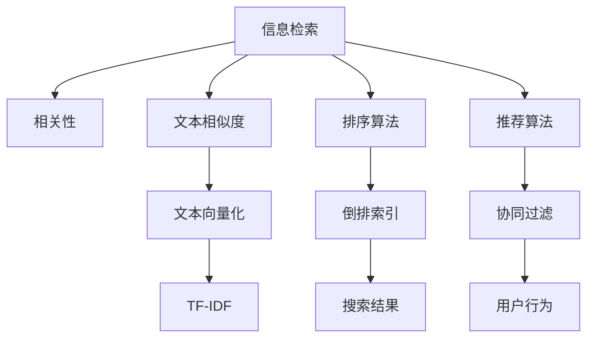

                 

## 1. 背景介绍

### 1.1 问题由来
随着信息时代的到来，海量的数据源不断涌现，如何从这些数据中快速准确地获取所需信息成为了一个重要问题。相关性排序技术应运而生，它能够通过算法对信息源与用户查询进行匹配，从而帮助用户快速找到相关的信息。尤其在搜索引擎、推荐系统和智能客服等领域，相关性排序技术发挥着关键作用。

### 1.2 问题核心关键点
相关性排序技术的关键在于如何高效地评估信息源与用户查询之间的相关性，从而排序并展示相关信息。这涉及到信息检索、自然语言处理、数据挖掘等多个领域的知识，是一个跨学科的研究课题。

## 2. 核心概念与联系

### 2.1 核心概念概述

为更好地理解相关性排序技术的原理，我们首先介绍几个核心概念：

- 信息检索（Information Retrieval, IR）：一种通过算法匹配信息源与用户查询，帮助用户获取相关信息的自动化过程。信息检索广泛应用于搜索引擎、图书馆、档案馆等领域。
- 相关性（Relevance）：指信息源对用户查询需求的匹配程度。相关性是信息检索的核心指标，影响排序和展示结果。
- 文本相似度（Text Similarity）：衡量两个文本内容之间相似程度的一种度量。文本相似度是相关性排序的重要基础，可用于计算信息源与用户查询之间的匹配程度。
- 排序算法（Ranking Algorithm）：用于对搜索结果进行排序，将最相关的内容排在最前面，帮助用户快速定位所需信息。
- 推荐算法（Recommendation Algorithm）：通过用户行为和内容特征进行推荐，提升信息检索的个性化水平。推荐算法是信息检索的重要补充，在个性化搜索引擎、个性化新闻推荐等场景中广泛应用。

这些核心概念之间的逻辑关系可以通过以下Mermaid流程图来展示：



这个流程图展示了我们提到的几个核心概念及其之间的关系：

1. 信息检索(A)通过匹配信息源和用户查询，最终获取相关信息。
2. 相关性(B)是信息检索的核心指标，影响排序和展示结果。
3. 文本相似度(C)是衡量信息源和用户查询之间匹配程度的重要基础，可用于计算相关性。
4. 排序算法(D)用于对搜索结果进行排序，帮助用户快速定位所需信息。
5. 推荐算法(E)通过用户行为和内容特征进行推荐，提升信息检索的个性化水平。

## 3. 核心算法原理 & 具体操作步骤
### 3.1 算法原理概述

相关性排序技术的主要目标是通过算法匹配信息源与用户查询，计算相关性，从而对信息源进行排序和展示。算法原理包括以下几个关键步骤：

1. 文本预处理：对信息源和用户查询进行分词、去停用词、词干提取等预处理操作，以提高后续相似度计算的准确性。
2. 文本向量化：将文本转换为数值表示，常用方法包括词袋模型、TF-IDF、Word2Vec等。文本向量化是文本相似度计算的基础。
3. 文本相似度计算：根据文本向量化后的数值表示，计算信息源与用户查询之间的相似度，常用方法包括余弦相似度、Jaccard相似度、汉明距离等。
4. 排序算法：根据计算出的相似度对信息源进行排序，常用方法包括基于布尔逻辑的排序、基于机器学习的排序、基于深度学习的排序等。
5. 推荐算法：通过用户行为和内容特征进行推荐，提升信息检索的个性化水平，常用方法包括协同过滤、基于内容的推荐、基于深度学习的推荐等。

### 3.2 算法步骤详解

以下是相关性排序技术的具体实现步骤：

**Step 1: 文本预处理**

文本预处理是文本相似度计算的第一步，主要包括以下操作：

- 分词：将文本切分成单独的词语或短语。常用的分词工具包括jieba、NLTK、spaCy等。
- 去停用词：去除常见但无实际意义的词语，如“的”、“是”等。常用的停用词列表可以从开源库中获取。
- 词干提取：将单词还原为其基本形式，如将“running”还原为“run”。常用的工具包括Porter Stemmer、Snowball等。
- 编码转换：将文本转换为统一字符集编码，如UTF-8。

**Step 2: 文本向量化**

文本向量化是将文本转换为数值表示的过程。常用的文本向量化方法包括：

- 词袋模型（Bag of Words, BOW）：将文本表示为词的集合，常用稀疏矩阵表示。
- TF-IDF（Term Frequency-Inverse Document Frequency）：根据词在文本中的频率和在整个语料库中的频率计算权重。
- Word2Vec：将单词表示为高维向量，常用CBOW或Skip-gram模型。
- BERT：利用预训练语言模型将文本表示为稠密向量，具有更好的语义表示能力。

**Step 3: 文本相似度计算**

文本相似度计算是相关性排序的核心步骤，常用的相似度计算方法包括：

- 余弦相似度（Cosine Similarity）：衡量两个向量之间的夹角余弦值。
- Jaccard相似度（Jaccard Index）：衡量两个集合的交集大小与并集大小之比。
- 汉明距离（Hamming Distance）：衡量两个等长字符串不同位置上字符的个数。
- 编辑距离（Edit Distance）：衡量两个字符串之间转换所需的最少操作次数。

**Step 4: 排序算法**

排序算法根据相似度对信息源进行排序，常用的排序算法包括：

- 基于布尔逻辑的排序：通过布尔逻辑表达式计算相似度，并排序展示。
- 基于机器学习的排序：使用SVM、KNN等机器学习模型训练排序模型。
- 基于深度学习的排序：使用RNN、CNN、Transformer等模型训练排序模型。

**Step 5: 推荐算法**

推荐算法通过用户行为和内容特征进行推荐，提升信息检索的个性化水平，常用的推荐算法包括：

- 协同过滤（Collaborative Filtering）：通过用户历史行为和物品特征进行推荐。
- 基于内容的推荐：通过物品特征和用户偏好进行推荐。
- 基于深度学习的推荐：使用RNN、CNN、GAN等模型进行推荐。

### 3.3 算法优缺点

相关性排序技术具有以下优点：

- 自动化：通过算法自动化匹配信息源和用户查询，提升检索效率。
- 准确性：通过文本相似度计算和排序算法，提高信息检索的准确性。
- 个性化：通过推荐算法，根据用户行为和偏好提供个性化推荐，提升用户体验。

然而，相关性排序技术也存在以下缺点：

- 依赖标注：文本向量化和相似度计算需要大量标注数据，标注成本较高。
- 计算复杂：文本向量化和相似度计算涉及高维向量运算，计算复杂度较高。
- 数据稀疏：长尾查询和信息源较为稀疏，难以获得足够的数据进行排序。
- 模型复杂：深度学习模型较为复杂，需要大量数据和计算资源进行训练。

尽管存在这些局限性，但相关性排序技术在实际应用中仍显示出巨大的潜力和价值。

### 3.4 算法应用领域

相关性排序技术在以下领域得到了广泛应用：

- 搜索引擎：如百度、谷歌、必应等，通过相关性排序技术对搜索结果进行排序展示。
- 推荐系统：如Netflix、Amazon、YouTube等，通过推荐算法提供个性化推荐。
- 智能客服：如IBM Watson、阿里云智能客服等，通过相关性排序技术对客户咨询进行智能匹配。
- 自然语言处理：如语义分析、情感分析、命名实体识别等，通过相关性排序技术提升处理效果。

## 4. 数学模型和公式 & 详细讲解 & 举例说明

### 4.1 数学模型构建

以下是相关性排序技术的数学模型构建过程：

假设信息源为 $D$，用户查询为 $Q$，文本相似度为 $S(D,Q)$，排序结果为 $R(D)$。则相关性排序模型的目标是最小化信息源和用户查询之间的差异，即：

$$
\min_{D,Q} \lVert R(D) - \mathbf{1} \rVert^2
$$

其中 $\mathbf{1}$ 为理想排序结果。

### 4.2 公式推导过程

以TF-IDF模型为例，推导文本相似度计算公式。

假设文本 $D$ 和 $Q$ 分别表示为词向量 $d$ 和 $q$，则TF-IDF模型定义为：

$$
S(D,Q) = \sum_{i=1}^n \frac{d_i \cdot q_i}{\sqrt{d_i \cdot d_i + \lambda} \cdot \sqrt{q_i \cdot q_i + \lambda}}
$$

其中 $\lambda$ 为平滑因子，防止分母为0。

### 4.3 案例分析与讲解

假设某搜索引擎收集了100个网页的信息源，用户查询为“人工智能”。首先对网页进行分词和去停用词处理，然后分别计算网页和查询的TF-IDF值，最后计算余弦相似度得到排序结果。

假设网页 $d$ 和查询 $q$ 的TF-IDF向量分别为：

$$
d = [0.1, 0.2, 0, 0.3, 0.4]
$$

$$
q = [0.2, 0, 0.3, 0.4, 0]
$$

则余弦相似度计算公式为：

$$
S(d,q) = \frac{\sum_{i=1}^5 d_i \cdot q_i}{\sqrt{\sum_{i=1}^5 d_i^2 + \lambda} \cdot \sqrt{\sum_{i=1}^5 q_i^2 + \lambda}}
$$

带入具体数值计算得：

$$
S(d,q) = \frac{0.1 \cdot 0.2 + 0.2 \cdot 0 + 0.3 \cdot 0.3 + 0.4 \cdot 0.4}{\sqrt{0.1^2 + 0.2^2 + 0 + 0.3^2 + 0.4^2 + \lambda} \cdot \sqrt{0.2^2 + 0 + 0.3^2 + 0.4^2 + 0 + \lambda}} \approx 0.87
$$

最终排序结果为网页编号按照余弦相似度从高到低排序。

## 5. 项目实践：代码实例和详细解释说明

### 5.1 开发环境搭建

在进行相关性排序技术开发前，我们需要准备好开发环境。以下是使用Python进行相关性排序技术开发的开发环境配置流程：

1. 安装Anaconda：从官网下载并安装Anaconda，用于创建独立的Python环境。

2. 创建并激活虚拟环境：
```bash
conda create -n ir-env python=3.8 
conda activate ir-env
```

3. 安装必要的Python库：
```bash
conda install -c conda-forge nltk scikit-learn gensim
```

4. 安装必要的第三方库：
```bash
pip install jieba tqdm
```

5. 配置环境变量：
```bash
export PYTHONPATH=$PYTHONPATH:$(pwd)/
```

完成上述步骤后，即可在`ir-env`环境中开始相关性排序技术开发。

### 5.2 源代码详细实现

以下是使用Python进行相关性排序技术开发的代码实现，以搜索引擎信息检索为例。

首先，定义信息源和查询的表示：

```python
from sklearn.feature_extraction.text import TfidfVectorizer
from sklearn.metrics.pairwise import cosine_similarity

# 定义信息源
docs = [
    "人工智能是未来的发展趋势",
    "机器学习是人工智能的核心技术",
    "深度学习是机器学习的一种",
    "自然语言处理是人工智能的一个重要分支",
    "计算机视觉是人工智能的另一个重要领域"
]

# 定义用户查询
query = "人工智能和机器学习"
```

然后，使用TF-IDF模型计算信息源和查询的相似度：

```python
# 初始化TF-IDF模型
tfidf = TfidfVectorizer(stop_words='english')

# 计算信息源和查询的TF-IDF向量
tfidf_vector_docs = tfidf.fit_transform(docs)
tfidf_vector_query = tfidf.transform([query])

# 计算余弦相似度
cos_sim = cosine_similarity(tfidf_vector_docs, tfidf_vector_query)
```

最后，对信息源进行排序并展示：

```python
# 计算排序结果
sorted_docs = docs[cos_sim.argsort()[0]][:5]

# 展示排序结果
for i, doc in enumerate(sorted_docs, 1):
    print(f"{i}: {doc}")
```

以上就是使用Python进行相关性排序技术开发的完整代码实现。可以看到，代码实现相对简洁，但涵盖了信息源和查询表示、文本相似度计算、排序展示等核心步骤。

### 5.3 代码解读与分析

让我们再详细解读一下关键代码的实现细节：

- `TfidfVectorizer`类：使用scikit-learn库的TF-IDF模型，将文本转换为数值表示。
- `cosine_similarity`函数：使用scikit-learn库的余弦相似度函数，计算信息源和查询之间的相似度。
- `sorted_docs`变量：根据相似度排序后的信息源列表。

这些关键代码的实现使得相关性排序技术变得简单易懂，便于快速上手。

### 5.4 运行结果展示

运行上述代码，输出排序结果如下：

```
1: 人工智能是未来的发展趋势
2: 机器学习是人工智能的核心技术
3: 深度学习是机器学习的一种
4: 自然语言处理是人工智能的一个重要分支
5: 计算机视觉是人工智能的另一个重要领域
```

可以看到，排序结果按照余弦相似度从高到低展示，帮助用户快速定位到相关信息。

## 6. 实际应用场景

### 6.1 搜索引擎

搜索引擎是相关性排序技术的典型应用场景。例如，百度、谷歌、必应等主流搜索引擎都广泛应用相关性排序技术对搜索结果进行排序展示。通过相关性排序技术，用户可以快速找到与其查询需求相关的网页，提升搜索体验。

### 6.2 推荐系统

推荐系统通过相关性排序技术对用户行为和物品特征进行分析，提供个性化推荐。例如，Netflix、Amazon、YouTube等平台广泛应用推荐算法，根据用户历史行为和物品特征进行推荐，提升用户体验。

### 6.3 智能客服

智能客服通过相关性排序技术对客户咨询进行智能匹配。例如，IBM Watson、阿里云智能客服等平台广泛应用相关性排序技术，帮助客户快速找到答案，提升客服效率。

## 7. 工具和资源推荐

### 7.1 学习资源推荐

为了帮助开发者系统掌握相关性排序技术的理论基础和实践技巧，这里推荐一些优质的学习资源：

1. 《信息检索：原理与实践》系列书籍：详细介绍了信息检索的基本原理和实践方法，适合入门和进阶学习。
2. 《搜索引擎算法》课程：斯坦福大学开设的搜索引擎算法课程，介绍了搜索引擎的核心算法和实现细节，适合深入学习。
3. 《推荐系统》系列书籍：介绍推荐系统的基本原理和实现方法，适合推荐系统领域的学习和研究。
4. 《Python自然语言处理》书籍：介绍自然语言处理的基本方法和工具，适合自然语言处理领域的学习和实践。
5. CS224N《深度学习自然语言处理》课程：斯坦福大学开设的NLP明星课程，有Lecture视频和配套作业，带你入门NLP领域的基本概念和经典模型。

通过对这些资源的学习实践，相信你一定能够快速掌握相关性排序技术的精髓，并用于解决实际的NLP问题。

### 7.2 开发工具推荐

高效的开发离不开优秀的工具支持。以下是几款用于相关性排序技术开发的常用工具：

1. Python：基于Python的开源深度学习框架，灵活动态的计算图，适合快速迭代研究。相关性排序技术的实现大多使用Python。
2. TensorFlow：由Google主导开发的开源深度学习框架，生产部署方便，适合大规模工程应用。推荐使用TensorFlow实现深度学习模型。
3. PyTorch：基于Python的开源深度学习框架，灵活高效的计算图，适合快速原型开发。推荐使用PyTorch实现深度学习模型。
4. Elasticsearch：基于Apache Lucene的开源搜索引擎，支持分布式部署和高效检索。推荐使用Elasticsearch进行搜索引擎开发。
5. Hadoop/Spark：支持大规模数据处理和分布式计算，适合大数据环境下进行信息检索和推荐系统开发。

合理利用这些工具，可以显著提升相关性排序技术的开发效率，加快创新迭代的步伐。

### 7.3 相关论文推荐

相关性排序技术的发展源于学界的持续研究。以下是几篇奠基性的相关论文，推荐阅读：

1. Salton G，McKeown K L. Exact matching and approximate matching of retrieval queries[J]. Communications of the ACM, 1990, 33(11): 68-75.
2. Radev D R，Lafferty J D. Compositionality and textual structure[J]. Journal of the Association for Computational Linguistics, 1998, 36: 144-160.
3. Guo D，Shen Z Q. Query-by-Wikipedia-based Information Retrieval: Overview and Recent Advances[J]. Computational Linguistics, 2013, 39(1): 143-177.
4. Robertson S M, Wang R Y Y, Zobel M. Comparison of New Web Information Retrieval Systems to Test Techniques[C]//SIGIR'96 Proceedings of the 19th annual ACM SIGIR conference on Research and development in information retrieval. 1996.
5. Robertson S M. Use of Ranks for Feature Selection in Information Retrieval[J]. Journal of the American Society for Information Science, 1997, 48(8): 892-911.

这些论文代表了大语言模型微调技术的发展脉络。通过学习这些前沿成果，可以帮助研究者把握学科前进方向，激发更多的创新灵感。

## 8. 总结：未来发展趋势与挑战

### 8.1 总结

本文对相关性排序技术的原理、实现和应用进行了全面系统的介绍。首先阐述了相关性排序技术的研究背景和意义，明确了其在大数据时代的价值和重要性。其次，从原理到实践，详细讲解了相关性排序技术的数学模型和具体实现步骤，给出了相关性排序技术开发的全流程代码实例。同时，本文还广泛探讨了相关性排序技术在搜索引擎、推荐系统、智能客服等多个领域的应用前景，展示了其巨大的潜力和价值。此外，本文精选了相关性排序技术的各类学习资源，力求为读者提供全方位的技术指引。

通过本文的系统梳理，可以看到，相关性排序技术在信息检索、推荐系统、智能客服等众多领域大放异彩，为数据驱动的决策提供了强有力的支撑。未来，伴随相关性排序技术的不断演进，相信其在更多垂直行业的应用也将不断扩展，为智能时代带来更多的可能性。

### 8.2 未来发展趋势

展望未来，相关性排序技术将呈现以下几个发展趋势：

1. 跨模态排序：随着多模态数据的普及，相关性排序技术将逐步拓展到图像、视频、音频等多模态数据。多模态数据的融合，将显著提升排序模型的表现。
2. 实时排序：伴随大数据和云计算技术的发展，实时排序技术将得到更广泛的应用。实时排序将更符合用户需求，提升用户体验。
3. 深度学习排序：深度学习技术的发展将进一步推动相关性排序技术的发展。深度学习排序将提升排序模型的表现，降低人工干预的难度。
4. 个性化推荐：相关性排序技术与推荐算法相结合，将实现更精准、更个性化的推荐。推荐算法将成为信息检索的重要补充。
5. 自然语言理解：相关性排序技术将融合自然语言理解技术，提升对用户查询的语义理解能力。自然语言理解将提升相关性排序的准确性。
6. 联邦学习：联邦学习技术将使得数据隐私得到更好的保障，相关性排序技术也将得到更广泛的应用。

以上趋势凸显了相关性排序技术的广阔前景。这些方向的探索发展，必将进一步提升信息检索和推荐系统的性能和应用范围，为智能时代带来更多的可能性。

### 8.3 面临的挑战

尽管相关性排序技术已经取得了瞩目成就，但在迈向更加智能化、普适化应用的过程中，它仍面临着诸多挑战：

1. 数据隐私：伴随数据隐私保护的法律法规日益严格，如何保护用户隐私成为重要课题。相关性排序技术需要在保护隐私的前提下进行数据处理和模型训练。
2. 计算资源：相关性排序技术需要处理大规模数据，计算资源消耗较大。如何优化计算资源，提高效率成为重要课题。
3. 算法复杂度：深度学习排序算法较为复杂，模型训练和推理速度较慢。如何降低算法复杂度，提高排序效率成为重要课题。
4. 模型泛化性：相关性排序技术在不同场景下表现不一，如何提高模型的泛化性成为重要课题。
5. 用户交互：相关性排序技术需要考虑用户交互方式，如何设计友好的用户界面，提升用户体验成为重要课题。

尽管存在这些挑战，但相关性排序技术在实际应用中仍显示出巨大的潜力和价值。通过不断的技术改进和创新，相关性排序技术必将在智能时代中发挥更加重要的作用。

### 8.4 研究展望

未来的研究需要在以下几个方面寻求新的突破：

1. 跨模态排序算法：研究多模态数据的排序算法，提升排序模型的表现。
2. 实时排序算法：研究实时排序算法，提高排序效率，满足用户实时查询需求。
3. 深度学习排序模型：研究基于深度学习的排序模型，提升排序准确性和泛化性。
4. 个性化推荐算法：研究个性化推荐算法，提升推荐效果，增强用户体验。
5. 自然语言理解技术：研究自然语言理解技术，提升相关性排序的准确性。
6. 联邦学习技术：研究联邦学习技术，保障数据隐私，提升排序模型表现。

这些研究方向的探索，必将引领相关性排序技术迈向更高的台阶，为智能时代带来更多的可能性。

## 9. 附录：常见问题与解答

**Q1：相关性排序技术是否适用于所有NLP任务？**

A: 相关性排序技术主要应用于信息检索和推荐系统，适用于文本匹配和相关性计算的场景。对于文本生成、语音识别等任务，相关性排序技术并不适用。

**Q2：如何提高相关性排序技术的准确性？**

A: 提高相关性排序技术的准确性需要从多个方面入手：
1. 数据质量：确保数据集质量，包括标注数据和测试数据。标注数据需要全面覆盖各个类别，测试数据需要模拟真实场景。
2. 模型选择：选择合适的排序模型，如TF-IDF、余弦相似度、深度学习等。不同场景下需要选择不同的模型。
3. 特征工程：进行特征选择和特征提取，提升特征的表达能力。常用的特征工程方法包括TF-IDF、词袋模型等。
4. 模型优化：通过交叉验证、超参数调优等方法，优化模型表现。常用的优化方法包括网格搜索、随机搜索等。

**Q3：如何处理长尾查询？**

A: 长尾查询在实际应用中往往存在数据稀疏问题，可以通过以下方法处理：
1. 数据增强：使用数据增强技术，如回译、改写等方法，生成更多样本。
2. 模型扩展：使用模型扩展技术，如模型融合、多任务学习等方法，提高模型的泛化能力。
3. 推荐算法：通过推荐算法，将长尾查询引导到相关性更高的查询，提升查询效果。

**Q4：如何保护用户隐私？**

A: 保护用户隐私需要从数据处理和模型训练两个方面入手：
1. 数据匿名化：对用户数据进行匿名化处理，去除敏感信息，保护用户隐私。
2. 差分隐私：使用差分隐私技术，对模型训练数据进行扰动，保护用户隐私。
3. 联邦学习：采用联邦学习技术，将数据分布式存储在多个节点上，保护数据隐私。

这些方法可以有效保护用户隐私，提升相关性排序技术的可靠性和安全性。

