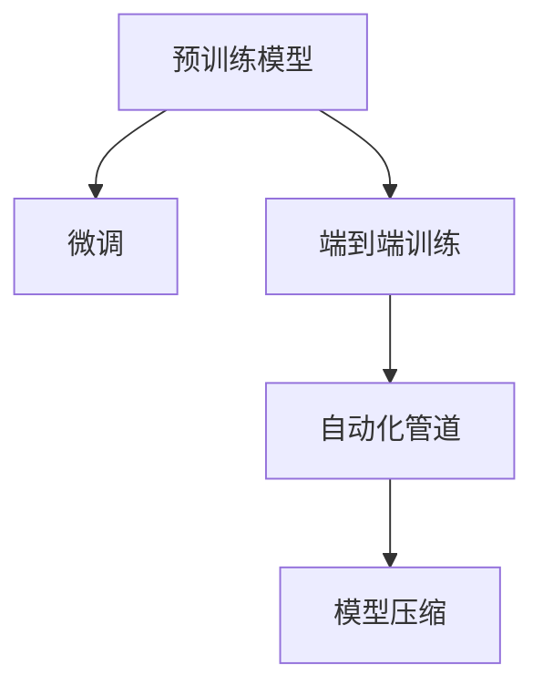

                 

# AI编程的新范式与挑战

## 1. 背景介绍

### 1.1 问题由来

随着人工智能技术的不断发展，AI编程范式也在不断演变。从传统的规则驱动、基于专家知识的编程，到现代的机器学习、深度学习，AI编程范式不断进步，推动了技术的突破。当前，基于大模型和大数据训练的AI编程范式，正引领新一轮的科技革命。然而，这一范式也面临着诸多挑战，如模型可解释性、数据隐私、伦理风险等。本文将深入探讨AI编程的新范式，以及其面临的主要挑战。

### 1.2 问题核心关键点

本文聚焦于AI编程的新范式，即基于深度学习和预训练模型的大规模数据训练方法。这种范式具有以下特点：

- 大规模数据训练：依赖大量的标注数据和计算资源，通过反向传播算法优化模型参数，使其在特定任务上表现优异。
- 预训练模型：通过在通用语料库上进行预训练，学习通用的语言知识，使得模型具有较强的泛化能力。
- 端到端训练：从数据预处理到模型训练和推理，全流程端到端自动化，减少了人工干预。

然而，这种范式也带来了新的挑战，如模型复杂性、可解释性、数据隐私和伦理问题。本文将从这些方面深入探讨，为AI编程的未来发展提供洞见。

### 1.3 问题研究意义

研究AI编程的新范式，对于推动人工智能技术的深入应用和产业化进程，具有重要意义：

1. 提升技术应用性能：通过大规模数据训练，模型能够在特定任务上表现更加优秀，提升技术应用的精度和效果。
2. 降低开发成本：自动化和端到端训练减少了人工干预，降低了开发和维护成本。
3. 推动技术创新：新的编程范式带来了新的算法和工具，促进了技术的快速迭代和创新。
4. 优化资源利用：基于预训练模型的范式可以更高效地利用数据和计算资源，提高资源利用效率。
5. 拓展应用场景：新的范式能够应用于更多复杂和多样化的任务，拓展了AI技术的应用范围。

## 2. 核心概念与联系

### 2.1 核心概念概述

为更好地理解AI编程的新范式，本节将介绍几个关键概念：

- **预训练模型(Pre-training Models)**：指在大规模无标签数据上进行训练的模型，如BERT、GPT等。预训练模型通过自监督学习任务，学习到通用的语言知识，用于下游任务的微调。
- **微调(Fine-tuning)**：指在预训练模型的基础上，使用下游任务的少量标注数据，通过有监督学习优化模型在该任务上的性能。
- **端到端训练(End-to-End Training)**：指从数据预处理、模型训练到推理的全流程自动化，减少了人工干预，提高了效率。
- **自动化管道(Automatic Pipeline)**：指从数据采集、预处理、训练到推理的自动化管道，使用工具和算法实现全流程自动化。
- **模型压缩(Model Compression)**：指通过量化、剪枝等技术，减小模型规模，提高推理速度和资源利用效率。

这些核心概念之间的逻辑关系可以通过以下Mermaid流程图来展示：



这个流程图展示了大语言模型的核心概念及其之间的关系：

1. 预训练模型通过大规模无标签数据预训练，学习到通用的语言知识。
2. 微调在预训练模型的基础上，使用下游任务的少量标注数据进行优化。
3. 端到端训练和自动化管道实现全流程自动化，提高了效率和质量。
4. 模型压缩通过减小模型规模，提高了推理速度和资源利用效率。

## 3. 核心算法原理 & 具体操作步骤

### 3.1 算法原理概述

基于深度学习和预训练模型的大规模数据训练方法，其核心思想是通过反向传播算法优化模型参数，使其在特定任务上表现优异。其算法流程如下：

1. 数据准备：收集大规模无标签数据，并进行预处理，如分词、标注等。
2. 预训练：在大规模无标签数据上进行自监督学习任务，如语言模型、掩码语言模型等，学习通用的语言知识。
3. 微调：使用下游任务的少量标注数据，通过有监督学习优化模型在该任务上的性能。
4. 推理：在推理阶段，使用训练好的模型对新数据进行预测和处理。

### 3.2 算法步骤详解

基于深度学习和预训练模型的大规模数据训练方法，其具体步骤包括：

1. **数据准备**：收集大规模无标签数据，并进行预处理，如分词、标注等。预处理过程中，需要选择合适的预处理工具和算法，如SpaCy、NLTK等。

2. **预训练模型选择**：选择合适的预训练模型，如BERT、GPT等，作为初始化参数。根据任务需求，选择合适的预训练模型及其变体，如Google BERT、OpenAI GPT等。

3. **模型初始化**：将预训练模型加载到计算平台，如GPU、TPU等，并初始化模型参数。

4. **数据预处理**：将数据集划分为训练集、验证集和测试集，并对数据进行预处理，如分词、编码、标准化等。

5. **模型训练**：在预训练模型的基础上，使用下游任务的少量标注数据进行微调。微调过程中，可以使用不同的优化算法，如Adam、SGD等，并设置合适的学习率、批大小、迭代轮数等。

6. **模型评估**：在验证集上评估模型性能，如准确率、召回率、F1值等，并根据评估结果调整模型参数。

7. **模型推理**：在推理阶段，使用训练好的模型对新数据进行预测和处理。推理过程中，需要使用推理引擎，如TensorFlow、PyTorch等。

### 3.3 算法优缺点

基于深度学习和预训练模型的大规模数据训练方法，具有以下优点：

1. **泛化能力强**：预训练模型通过在大规模无标签数据上进行训练，学习到通用的语言知识，使得模型具有较强的泛化能力。
2. **自动化程度高**：端到端训练和自动化管道实现全流程自动化，减少了人工干预，提高了效率。
3. **精度高**：通过反向传播算法优化模型参数，使得模型在特定任务上表现更加优秀，精度和效果显著提升。

同时，该方法也存在一些缺点：

1. **数据需求高**：大规模数据训练需要大量的标注数据和计算资源，数据采集和预处理成本较高。
2. **模型复杂**：预训练模型和微调模型结构复杂，训练和推理过程较为繁琐。
3. **可解释性差**：模型决策过程缺乏可解释性，难以对其推理逻辑进行分析和调试。
4. **计算资源消耗大**：大规模数据训练和推理需要大量的计算资源，对硬件要求较高。
5. **鲁棒性不足**：模型在特定任务上的性能依赖于数据质量，数据偏差可能导致模型鲁棒性不足。

### 3.4 算法应用领域

基于深度学习和预训练模型的大规模数据训练方法，已经在NLP、计算机视觉、语音识别等领域得到了广泛应用。例如：

- **自然语言处理(NLP)**：如问答系统、情感分析、文本生成等任务。
- **计算机视觉**：如图像分类、物体检测、图像生成等任务。
- **语音识别**：如语音转文字、语音生成等任务。

## 4. 数学模型和公式 & 详细讲解 & 举例说明

### 4.1 数学模型构建

假设预训练模型为 $M_{\theta}$，其中 $\theta$ 为模型参数。假设微调任务的训练集为 $D=\{(x_i,y_i)\}_{i=1}^N, x_i \in \mathcal{X}, y_i \in \mathcal{Y}$，其中 $x_i$ 表示输入数据，$y_i$ 表示标签。定义模型 $M_{\theta}$ 在数据样本 $(x,y)$ 上的损失函数为 $\ell(M_{\theta}(x),y)$，则在数据集 $D$ 上的经验风险为：

$$
\mathcal{L}(\theta) = \frac{1}{N} \sum_{i=1}^N \ell(M_{\theta}(x_i),y_i)
$$

微调的优化目标是最小化经验风险，即找到最优参数：

$$
\theta^* = \mathop{\arg\min}_{\theta} \mathcal{L}(\theta)
$$

在实践中，我们通常使用基于梯度的优化算法（如Adam、SGD等）来近似求解上述最优化问题。设 $\eta$ 为学习率，则参数的更新公式为：

$$
\theta \leftarrow \theta - \eta \nabla_{\theta}\mathcal{L}(\theta)
$$

其中 $\nabla_{\theta}\mathcal{L}(\theta)$ 为损失函数对参数 $\theta$ 的梯度，可通过反向传播算法高效计算。

### 4.2 公式推导过程

以下我们以二分类任务为例，推导交叉熵损失函数及其梯度的计算公式。

假设模型 $M_{\theta}$ 在输入 $x$ 上的输出为 $\hat{y}=M_{\theta}(x) \in [0,1]$，表示样本属于正类的概率。真实标签 $y \in \{0,1\}$。则二分类交叉熵损失函数定义为：

$$
\ell(M_{\theta}(x),y) = -[y\log \hat{y} + (1-y)\log (1-\hat{y})]
$$

将其代入经验风险公式，得：

$$
\mathcal{L}(\theta) = -\frac{1}{N}\sum_{i=1}^N [y_i\log M_{\theta}(x_i)+(1-y_i)\log(1-M_{\theta}(x_i))]
$$

根据链式法则，损失函数对参数 $\theta_k$ 的梯度为：

$$
\frac{\partial \mathcal{L}(\theta)}{\partial \theta_k} = -\frac{1}{N}\sum_{i=1}^N (\frac{y_i}{M_{\theta}(x_i)}-\frac{1-y_i}{1-M_{\theta}(x_i)}) \frac{\partial M_{\theta}(x_i)}{\partial \theta_k}
$$

其中 $\frac{\partial M_{\theta}(x_i)}{\partial \theta_k}$ 可进一步递归展开，利用自动微分技术完成计算。

在得到损失函数的梯度后，即可带入参数更新公式，完成模型的迭代优化。重复上述过程直至收敛，最终得到适应下游任务的最优模型参数 $\theta^*$。

## 5. 项目实践：代码实例和详细解释说明

### 5.1 开发环境搭建

在进行AI编程实践前，我们需要准备好开发环境。以下是使用Python进行TensorFlow开发的环境配置流程：

1. 安装Anaconda：从官网下载并安装Anaconda，用于创建独立的Python环境。

2. 创建并激活虚拟环境：
```bash
conda create -n tf-env python=3.8 
conda activate tf-env
```

3. 安装TensorFlow：根据CUDA版本，从官网获取对应的安装命令。例如：
```bash
pip install tensorflow==2.8
```

4. 安装TensorFlow Addons：
```bash
pip install tensorflow-addons==0.17
```

5. 安装各类工具包：
```bash
pip install numpy pandas scikit-learn matplotlib tqdm jupyter notebook ipython
```

完成上述步骤后，即可在`tf-env`环境中开始AI编程实践。

### 5.2 源代码详细实现

下面我们以图像分类任务为例，给出使用TensorFlow对ResNet模型进行微调的代码实现。

首先，定义图像分类任务的数据处理函数：

```python
from tensorflow.keras.preprocessing.image import ImageDataGenerator

train_datagen = ImageDataGenerator(
    rescale=1./255,
    shear_range=0.2,
    zoom_range=0.2,
    horizontal_flip=True)

test_datagen = ImageDataGenerator(rescale=1./255)

train_generator = train_datagen.flow_from_directory(
    train_dir, target_size=(224, 224), batch_size=32, class_mode='binary')

validation_generator = test_datagen.flow_from_directory(
    val_dir, target_size=(224, 224), batch_size=32, class_mode='binary')
```

然后，定义模型和优化器：

```python
from tensorflow.keras.applications.resnet50 import ResNet50

model = ResNet50(weights='imagenet', include_top=False)
model.compile(optimizer='adam', loss='binary_crossentropy', metrics=['accuracy'])

for layer in model.layers:
    layer.trainable = False
```

接着，定义训练和评估函数：

```python
from tensorflow.keras.callbacks import EarlyStopping

early_stopping = EarlyStopping(monitor='val_loss', patience=5)

model.fit(
    train_generator,
    validation_data=validation_generator,
    epochs=10,
    callbacks=[early_stopping])
```

最后，启动训练流程并在测试集上评估：

```python
test_loss, test_acc = model.evaluate(validation_generator)
print(f'Test accuracy: {test_acc:.2f}')
```

以上就是使用TensorFlow对ResNet模型进行图像分类任务微调的完整代码实现。可以看到，得益于TensorFlow的强大封装，我们可以用相对简洁的代码完成ResNet模型的加载和微调。

### 5.3 代码解读与分析

让我们再详细解读一下关键代码的实现细节：

**图像分类任务的数据处理函数**：
- `ImageDataGenerator`：用于数据增强和预处理，如缩放、翻转、旋转等。
- `flow_from_directory`：从目录中读取数据集，自动进行分批处理和标签生成。

**模型定义**：
- 使用`ResNet50`模型作为初始化参数，并指定预训练权重为`imagenet`。
- 在模型层中，通过`trainable`属性设置层是否可训练，这里只保留顶层分类器进行微调。

**训练和评估函数**：
- `EarlyStopping`：设置早停机制，当模型在验证集上连续5个epoch没有提升时，停止训练。
- `fit`方法：训练模型，并记录训练过程中的各项指标。
- `evaluate`方法：在测试集上评估模型的性能，并输出准确率。

**训练流程**：
- 设置总的epoch数，并定义EarlyStopping回调函数。
- 在训练集上训练模型，并在验证集上评估。
- 在测试集上评估微调后的模型，输出准确率。

可以看到，TensorFlow配合TensorFlow Addons使得图像分类任务的微调代码实现变得简洁高效。开发者可以将更多精力放在数据处理、模型改进等高层逻辑上，而不必过多关注底层的实现细节。

当然，工业级的系统实现还需考虑更多因素，如模型的保存和部署、超参数的自动搜索、更灵活的任务适配层等。但核心的微调范式基本与此类似。

## 6. 实际应用场景

### 6.1 智慧医疗

基于深度学习和预训练模型的大规模数据训练方法，可以广泛应用于智慧医疗领域。例如，通过微调技术，可以构建智能诊断系统，自动分析和诊断医疗影像、病历等信息。

在技术实现上，可以收集大量的医疗影像和病历数据，将其标注并用于预训练模型的微调。微调后的模型能够自动分析影像和病历，辅助医生进行诊断和治疗。例如，使用卷积神经网络(CNN)进行影像分类和分割，使用循环神经网络(RNN)进行病历分析，使用Transformer模型进行问答和推荐等。

### 6.2 智能制造

在智能制造领域，基于深度学习和预训练模型的大规模数据训练方法，可以实现设备预测性维护、质量检测、生产调度等任务。

例如，通过微调技术，可以构建预测性维护系统，自动监测设备的运行状态，预测可能出现的故障并进行预防性维护。通过微调图像识别模型，可以自动检测产品质量，识别缺陷并进行分类和标注。通过微调时间序列模型，可以实现生产调度和优化，提高生产效率和质量。

### 6.3 自动驾驶

在自动驾驶领域，基于深度学习和预训练模型的大规模数据训练方法，可以实现感知、决策和控制等任务。

例如，通过微调技术，可以构建感知系统，自动识别和分类道路上的各种物体和场景。通过微调决策模型，可以实现路径规划和行为预测，进行安全的避障和决策。通过微控制模型，可以实现自动驾驶车辆的动态控制和协调，提高驾驶的安全性和舒适性。

## 7. 工具和资源推荐

### 7.1 学习资源推荐

为了帮助开发者系统掌握深度学习和预训练模型的大规模数据训练方法，这里推荐一些优质的学习资源：

1. 《深度学习》（Goodfellow等人著）：经典深度学习教材，全面介绍了深度学习的理论基础和实践技巧。
2. 《TensorFlow官方文档》：TensorFlow官方文档，提供了完整的API和代码示例，是TensorFlow学习的必备资料。
3. 《PyTorch官方文档》：PyTorch官方文档，提供了完整的API和代码示例，是PyTorch学习的必备资料。
4. 《自然语言处理综论》（Michael Collins等人著）：全面介绍了自然语言处理的理论基础和实践技巧。
5. 《计算机视觉：模型、学习和推理》（Simon J. D. Prince著）：全面介绍了计算机视觉的理论基础和实践技巧。

通过对这些资源的学习实践，相信你一定能够快速掌握深度学习和预训练模型的大规模数据训练方法，并用于解决实际的AI编程问题。

### 7.2 开发工具推荐

高效的开发离不开优秀的工具支持。以下是几款用于深度学习和预训练模型的大规模数据训练的常用工具：

1. TensorFlow：由Google主导开发的深度学习框架，生产部署方便，适合大规模工程应用。
2. PyTorch：基于Python的开源深度学习框架，灵活动态的计算图，适合快速迭代研究。
3. JAX：由Google开发的Python库，支持自动微分和JIT编译，适用于高性能科学计算和深度学习。
4. Scikit-Learn：基于Python的机器学习库，提供多种常用的算法和工具，适合数据预处理和模型评估。
5. TensorBoard：TensorFlow配套的可视化工具，可实时监测模型训练状态，并提供丰富的图表呈现方式。

合理利用这些工具，可以显著提升深度学习和预训练模型的大规模数据训练任务的开发效率，加快创新迭代的步伐。

### 7.3 相关论文推荐

深度学习和预训练模型的大规模数据训练方法，源于学界的持续研究。以下是几篇奠基性的相关论文，推荐阅读：

1. Imagenet Classification with Deep Convolutional Neural Networks（AlexNet论文）：提出AlexNet模型，奠定了卷积神经网络在图像分类任务中的基础。
2. Deep Residual Learning for Image Recognition（ResNet论文）：提出ResNet模型，解决了深度网络训练中的梯度消失问题。
3. Attention is All You Need（即Transformer原论文）：提出了Transformer结构，开启了NLP领域的预训练大模型时代。
4. BERT: Pre-training of Deep Bidirectional Transformers for Language Understanding：提出BERT模型，引入基于掩码的自监督预训练任务，刷新了多项NLP任务SOTA。
5. Squeeze-and-Excitation Networks（SENet论文）：提出SENet模型，通过全局上下文建模，提升了模型的性能和泛化能力。

这些论文代表了大规模数据训练方法的进展脉络。通过学习这些前沿成果，可以帮助研究者把握学科前进方向，激发更多的创新灵感。

## 8. 总结：未来发展趋势与挑战

### 8.1 总结

本文对深度学习和预训练模型的大规模数据训练方法进行了全面系统的介绍。首先阐述了这种编程范式的背景和意义，明确了其在提升模型性能、降低开发成本、推动技术创新等方面的价值。其次，从原理到实践，详细讲解了微调和端到端训练的数学模型和关键步骤，给出了图像分类任务微调的代码实现。同时，本文还广泛探讨了这种范式在智慧医疗、智能制造、自动驾驶等多个领域的应用前景，展示了其广阔的应用空间。最后，本文精选了深度学习和预训练模型的学习资源、开发工具和相关论文，力求为读者提供全方位的技术指引。

通过本文的系统梳理，可以看到，基于深度学习和预训练模型的编程范式正在引领AI技术的新一轮变革。这一范式具有强大的数据利用能力和模型泛化能力，适用于更多复杂和多样化的任务，拓展了AI技术的应用范围。然而，这一范式也面临着诸多挑战，如模型复杂性、可解释性、数据隐私和伦理问题。只有从数据、算法、工程、伦理等多个维度协同发力，才能不断克服这些挑战，推动AI技术的持续进步。

### 8.2 未来发展趋势

展望未来，深度学习和预训练模型的大规模数据训练方法将呈现以下几个发展趋势：

1. **模型规模持续增大**：随着算力成本的下降和数据规模的扩张，预训练模型的参数量还将持续增长。超大模型蕴含的丰富语言知识，有望支撑更加复杂多变的下游任务微调。
2. **多模态融合**：未来将更多地结合视觉、语音、文本等多种模态数据进行联合训练，提高模型的综合表现。
3. **自动化和智能化**：自动化管道和自动化工具将进一步普及，提高模型训练和推理的智能化程度。
4. **知识整合**：未来的模型将更多地与知识图谱、逻辑规则等专家知识结合，提升模型的可解释性和可信度。
5. **跨领域迁移**：未来的模型将具备更强的跨领域迁移能力，可以在多个任务和领域中高效应用。

这些趋势凸显了深度学习和预训练模型的大规模数据训练方法的广阔前景。这些方向的探索发展，必将进一步提升AI系统的性能和应用范围，为人类认知智能的进化带来深远影响。

### 8.3 面临的挑战

尽管深度学习和预训练模型的大规模数据训练方法已经取得了瞩目成就，但在迈向更加智能化、普适化应用的过程中，它仍面临着诸多挑战：

1. **模型复杂性**：超大模型结构复杂，训练和推理过程繁琐，资源消耗大。
2. **可解释性差**：模型决策过程缺乏可解释性，难以对其推理逻辑进行分析和调试。
3. **数据隐私**：大规模数据训练需要收集和存储大量敏感数据，数据隐私和安全问题亟待解决。
4. **伦理风险**：模型可能会学习到偏见和有害信息，影响社会公平和安全。
5. **计算资源消耗大**：大规模数据训练和推理需要大量的计算资源，对硬件要求较高。

### 8.4 研究展望

面对深度学习和预训练模型的大规模数据训练方法所面临的种种挑战，未来的研究需要在以下几个方面寻求新的突破：

1. **模型压缩与优化**：开发更加参数高效和计算高效的微调方法，减小模型规模，提高推理速度和资源利用效率。
2. **可解释性和透明性**：引入因果分析和博弈论工具，增强模型的可解释性和透明度，提高系统的可靠性和可信度。
3. **数据隐私保护**：采用差分隐私、联邦学习等技术，保护数据隐私和安全，确保数据使用的合规性和可控性。
4. **伦理与公平性**：引入伦理导向的评估指标，过滤和惩罚有偏见、有害的输出倾向，确保模型的公平性和公正性。
5. **跨领域迁移**：开发跨领域迁移学习方法，提高模型的泛化能力和跨领域适应能力，增强模型的应用灵活性。

这些研究方向的探索，必将引领深度学习和预训练模型的大规模数据训练方法走向更高的台阶，为构建安全、可靠、可解释、可控的智能系统铺平道路。面向未来，深度学习和预训练模型的大规模数据训练方法还需要与其他人工智能技术进行更深入的融合，如知识表示、因果推理、强化学习等，多路径协同发力，共同推动自然语言理解和智能交互系统的进步。只有勇于创新、敢于突破，才能不断拓展语言模型的边界，让智能技术更好地造福人类社会。

## 9. 附录：常见问题与解答

**Q1：基于深度学习和预训练模型的大规模数据训练方法是否适用于所有NLP任务？**

A: 基于深度学习和预训练模型的大规模数据训练方法在大多数NLP任务上都能取得不错的效果，特别是对于数据量较小的任务。但对于一些特定领域的任务，如医学、法律等，仅仅依靠通用语料预训练的模型可能难以很好地适应。此时需要在特定领域语料上进一步预训练，再进行微调，才能获得理想效果。此外，对于一些需要时效性、个性化很强的任务，如对话、推荐等，微调方法也需要针对性的改进优化。

**Q2：深度学习和预训练模型的大规模数据训练方法是否能够有效应对数据偏差问题？**

A: 数据偏差是深度学习和预训练模型的大规模数据训练方法面临的重要挑战。为了应对数据偏差问题，可以采取以下措施：

1. **数据增强**：通过数据扩充、数据清洗等方式，增加数据多样性，减少数据偏差。
2. **正则化**：使用L2正则、Dropout、Early Stopping等正则化技术，避免模型过拟合数据偏差。
3. **迁移学习**：将预训练模型的知识迁移应用到下游任务，减少数据偏差的影响。
4. **对抗训练**：引入对抗样本，提高模型鲁棒性，增强对抗训练。
5. **多模态融合**：结合多种模态数据进行联合训练，提高模型的泛化能力和鲁棒性。

这些措施可以在不同程度上缓解数据偏差问题，提升模型的泛化能力和鲁棒性。

**Q3：深度学习和预训练模型的大规模数据训练方法是否能够处理多语言和跨语言任务？**

A: 深度学习和预训练模型的大规模数据训练方法在处理多语言和跨语言任务方面也表现优异。通过预训练模型和多语言数据集，可以构建多语言模型，支持多语言处理和翻译任务。例如，使用Transformer模型进行机器翻译，使用BERT模型进行多语言情感分析等。

**Q4：基于深度学习和预训练模型的大规模数据训练方法是否能够应对复杂场景的实际应用需求？**

A: 基于深度学习和预训练模型的大规模数据训练方法在应对复杂场景的实际应用需求方面也表现优异。通过微调技术和端到端训练，可以构建适用于复杂场景的智能系统。例如，在医疗领域，使用深度学习和预训练模型可以构建智能诊断系统，自动识别和分类医学影像和病历信息。在自动驾驶领域，使用深度学习和预训练模型可以构建智能感知和决策系统，自动识别和预测道路上的各种物体和场景，进行安全的避障和决策。

**Q5：深度学习和预训练模型的大规模数据训练方法是否能够保证模型的可解释性？**

A: 深度学习和预训练模型的大规模数据训练方法在保证模型可解释性方面也面临挑战。为了提高模型的可解释性，可以采取以下措施：

1. **模型可视化**：使用模型可视化工具，如图像热力图、注意力图等，展示模型的关键特征和决策过程。
2. **可解释性模型**：引入可解释性模型，如LIME、SHAP等，分析模型的决策过程，提供可解释的输出。
3. **因果推理**：引入因果推理工具，分析模型决策的关键特征，增强模型的可解释性和可信度。
4. **交互式学习**：通过交互式学习，让用户参与模型训练和评估，提高模型的透明度和可解释性。

这些措施可以在一定程度上提高深度学习和预训练模型的大规模数据训练方法的解释性和可信度，提升模型的可解释性。

**Q6：深度学习和预训练模型的大规模数据训练方法是否能够确保数据隐私和安全？**

A: 深度学习和预训练模型的大规模数据训练方法在确保数据隐私和安全方面也面临挑战。为了保护数据隐私和安全，可以采取以下措施：

1. **差分隐私**：使用差分隐私技术，对数据进行扰动处理，保护数据隐私。
2. **联邦学习**：采用联邦学习技术，在多个设备上分布式训练模型，保护数据隐私和安全。
3. **数据脱敏**：对敏感数据进行脱敏处理，保护数据隐私和安全。
4. **访问控制**：采用访问控制技术，限制对数据的访问权限，保护数据隐私和安全。
5. **安全计算**：采用安全计算技术，如同态加密、多方安全计算等，保护数据隐私和安全。

这些措施可以在一定程度上保护深度学习和预训练模型的大规模数据训练方法的数据隐私和安全。

---

作者：禅与计算机程序设计艺术 / Zen and the Art of Computer Programming

