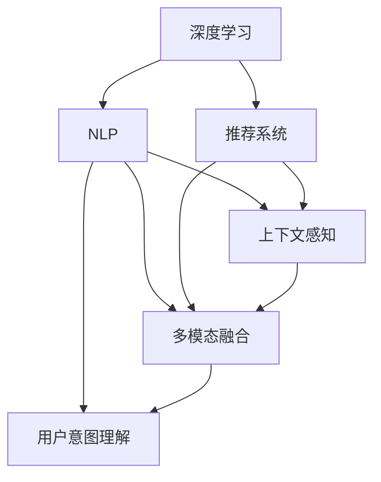

                 

## 1. 背景介绍

### 1.1 电商搜索导购概述
在数字经济时代，电子商务平台已逐渐成为人们日常生活不可或缺的一部分。无论是购物、旅游还是服务消费，电商平台的便捷性和多样性都极大地提升了消费者的购物体验。然而，电商搜索导购系统的用户体验仍存在诸多瓶颈。如何提升搜索准确率、推荐相关性，增强用户满意度，成为了电商巨头们亟需解决的重要问题。

传统的电商搜索导购系统主要依赖于关键词匹配算法，通过抽取产品标题、描述中的关键词与用户查询关键词进行匹配，从而实现产品推荐。这种方法在一定程度上解决了查询匹配的问题，但在处理查询意图、上下文关联、多模态数据融合等方面仍然存在不少局限性。

随着人工智能技术的进步，尤其是在自然语言处理(NLP)领域的突破，电商搜索导购系统开始引入智能化的AI技术，以期全面提升用户体验。

### 1.2 智能搜索导购的需求背景
智能搜索导购系统旨在通过深度学习和大数据分析技术，结合用户行为数据和产品信息，为用户提供精准的搜索结果和个性化的推荐。这要求系统能够：
1. **理解用户查询意图**：能够准确把握用户输入的关键词背后真正的意图，如想购买、咨询、比较等。
2. **考虑上下文关联**：分析用户的搜索历史、浏览行为，结合产品信息，提供相关性更高的推荐。
3. **处理多模态数据**：综合利用文本、图像、视频等多种信息，提高推荐精度。
4. **支持用户互动**：通过问答、对话等形式与用户进行互动，增强用户购物体验。
5. **具备自适应能力**：根据用户反馈和市场变化，实时调整推荐策略。

## 2. 核心概念与联系

### 2.1 核心概念概述
1. **深度学习**：基于神经网络技术的机器学习方法，通过多层次的非线性变换提取数据特征，适用于处理复杂的多模态数据。
2. **自然语言处理(NLP)**：专注于处理和理解人类语言的技术，包括文本预处理、语义分析、语言生成等。
3. **推荐系统**：基于用户行为数据和物品属性信息，为用户推荐最符合其需求的商品和服务。
4. **上下文感知**：系统能够理解用户在特定情境下的行为和需求，提供有针对性的推荐。
5. **多模态融合**：综合利用文本、图像、视频等多种信息，提高推荐的准确性和相关性。
6. **用户意图理解**：通过用户输入的关键词、行为数据等，分析出用户的真实需求和意图。

### 2.2 核心概念联系

深度学习作为底层技术，能够从大规模数据中提取复杂特征，为自然语言处理提供强有力的支持。自然语言处理技术，尤其是语义理解和语言生成，能够实现对用户查询意图的准确把握和多模态信息的有效整合。推荐系统则能够利用这些信息，为用户精准推荐商品和服务。上下文感知和多模态融合技术，进一步提升了推荐系统的智能水平，能够更好地理解用户的当前情境和需求。用户意图理解技术，则从根本上增强了推荐系统的精准性和用户满意度。

这些技术相互融合，构成了智能搜索导购系统的核心能力，使其能够全方位、多层次地提升用户体验，推动电商行业向智能化、个性化方向发展。




## 3. 核心算法原理 & 具体操作步骤

### 3.1 算法原理概述
智能搜索导购系统主要通过以下步骤实现：
1. **用户查询理解**：通过NLP技术，理解用户输入的关键词和查询意图，分析出用户的潜在需求。
2. **上下文分析**：综合考虑用户的搜索历史、浏览行为、浏览时间等上下文信息，结合当前产品信息，进行多维度关联分析。
3. **推荐生成**：利用推荐算法和模型，基于上下文分析结果，生成个性化推荐列表。
4. **多模态融合**：综合利用文本、图像、视频等多模态信息，提升推荐列表的相关性和准确性。
5. **用户反馈处理**：根据用户对推荐结果的反馈，不断调整推荐模型，提升推荐效果。

### 3.2 算法步骤详解
1. **用户查询理解**
    - 文本预处理：使用NLP技术对用户查询进行分词、词性标注、命名实体识别等处理，去除停用词，提取出关键词和实体。
    - 意图分析：通过语义分析和情感分析，理解用户查询背后的意图，如想购买、咨询、比较等。
    - 实体链接：利用知识图谱或外置资源，将查询中的实体映射到具体的商品或服务上。

2. **上下文分析**
    - 历史行为分析：分析用户的搜索历史、浏览行为、购物记录等，获取用户的兴趣偏好。
    - 实时行为分析：结合当前用户的行为数据，如搜索关键词、浏览时间、浏览深度等，进行动态调整。
    - 上下文关联：将用户当前行为与历史行为关联起来，分析出用户意图和需求。

3. **推荐生成**
    - 基于内容的推荐：根据商品属性、描述、评价等信息，计算推荐列表。
    - 协同过滤推荐：利用用户行为数据，找到相似用户，进行推荐。
    - 基于模型的推荐：利用深度学习模型，如深度协同过滤、序列推荐等，生成推荐列表。

4. **多模态融合**
    - 图像特征提取：利用图像处理技术，提取商品图像的特征。
    - 视频特征提取：利用视频处理技术，提取商品视频的特征。
    - 多模态融合：将文本、图像、视频等多模态信息进行融合，生成更加全面的推荐列表。

5. **用户反馈处理**
    - 反馈收集：收集用户对推荐结果的点击、购买、评价等反馈。
    - 反馈分析：对用户反馈进行分析和总结，提取关键特征。
    - 模型调整：根据用户反馈，调整推荐模型，提升推荐效果。

### 3.3 算法优缺点
智能搜索导购系统的优势主要体现在以下几个方面：
1. **精准性**：通过深度学习和NLP技术，能够更准确地理解用户查询意图，生成精准的推荐结果。
2. **个性化**：能够根据用户的历史行为和实时行为，提供个性化推荐，提升用户体验。
3. **多模态融合**：通过综合利用文本、图像、视频等多模态信息，提升推荐的相关性和准确性。
4. **自适应能力**：能够根据用户反馈，实时调整推荐策略，提升推荐效果。

同时，该系统也存在以下缺点：
1. **数据依赖性**：需要大量的用户行为数据和商品信息，对数据质量和数量都有较高的要求。
2. **模型复杂性**：算法模型和数据处理流程复杂，需要较大的计算资源和时间成本。
3. **隐私问题**：在处理用户行为数据时，需要充分考虑用户隐私和数据安全问题。
4. **冷启动问题**：对于新用户，由于缺乏行为数据，难以提供精准的推荐。

### 3.4 算法应用领域
智能搜索导购系统广泛应用于各种电商平台上，如淘宝、京东、亚马逊等。其应用领域包括：
1. **搜索排序**：根据用户查询，生成推荐列表，排序展示商品。
2. **个性化推荐**：结合用户历史行为和实时行为，生成个性化推荐列表。
3. **广告推荐**：根据用户兴趣，推荐相关的广告内容。
4. **商品描述生成**：自动生成商品描述，提升内容质量和相关性。
5. **智能客服**：通过NLP和对话生成技术，实现智能客服系统，提升用户满意度。

## 4. 数学模型和公式 & 详细讲解 & 举例说明

### 4.1 数学模型构建
智能搜索导购系统的数学模型主要由以下几个部分构成：
1. **文本表示模型**：将用户查询和商品描述转化为向量表示。
2. **意图识别模型**：识别用户查询的意图和情感。
3. **上下文表示模型**：生成用户的上下文表示。
4. **推荐模型**：根据上下文和商品信息，生成推荐列表。
5. **多模态融合模型**：将文本、图像、视频等多模态信息进行融合。

### 4.2 公式推导过程
以推荐系统中的深度协同过滤为例，公式推导如下：
1. **用户-物品矩阵**：将用户对商品的评分转化为向量形式，构建用户-物品矩阵 $R$。
2. **矩阵分解**：将用户-物品矩阵分解为两个低秩矩阵 $U$ 和 $V$。
3. **预测评分**：根据用户和物品的低秩表示，计算预测评分。

设用户 $u$ 和物品 $i$ 的评分向量分别为 $\mathbf{u}$ 和 $\mathbf{v}$，则预测评分 $\hat{r}$ 可以表示为：
$$
\hat{r}_{ui} = \mathbf{u}^T U_i V_i^T \mathbf{v}
$$
其中 $U_i$ 和 $V_i$ 分别表示物品 $i$ 的低秩表示。

### 4.3 案例分析与讲解
以淘宝平台为例，分析智能搜索导购系统的应用：
1. **用户查询理解**
    - 用户输入：“T恤男 夏季”
    - 文本预处理：分词、去停用词，提取关键词和实体。
    - 意图分析：理解用户意图为购买“夏季男式T恤”。
    - 实体链接：链接到具体的商品，如“Zara男士夏季T恤”。

2. **上下文分析**
    - 历史行为：用户最近浏览了男士服装、T恤、夏季款。
    - 实时行为：用户正在搜索“夏季男式T恤”。
    - 上下文关联：结合用户历史行为和实时行为，分析出用户当前的需求。

3. **推荐生成**
    - 基于内容的推荐：选择“Zara男士夏季T恤”作为推荐商品之一。
    - 协同过滤推荐：根据相似用户的评分，选择其他“夏季男式T恤”作为推荐商品。
    - 基于模型的推荐：利用深度学习模型，生成更符合用户偏好的推荐列表。

4. **多模态融合**
    - 图像特征提取：提取“Zara男士夏季T恤”的图片特征。
    - 视频特征提取：提取“Zara男士夏季T恤”的视频特征。
    - 多模态融合：将文本、图像、视频信息融合，生成综合的推荐列表。

5. **用户反馈处理**
    - 反馈收集：用户点击了“Zara男士夏季T恤”，给出了好评。
    - 反馈分析：分析用户的好评信息，提取关键特征。
    - 模型调整：根据用户反馈，调整推荐模型，提升推荐效果。

## 5. 项目实践：代码实例和详细解释说明

### 5.1 开发环境搭建
1. **环境准备**：
    - 安装Python 3.8及以上版本。
    - 安装TensorFlow 2.0及以上版本。
    - 安装Keras 2.4及以上版本。

2. **安装依赖**：
    ```bash
    pip install tensorflow
    pip install keras
    ```

3. **数据准备**：
    - 准备用户查询数据和商品信息数据，例如：
        ```
        user_queries = ['T恤男 夏季', '女生夏季连衣裙', '男士运动鞋']
        products = [
            {'id': 1, 'name': 'Zara男士夏季T恤', 'price': 300},
            {'id': 2, 'name': 'H&M女生夏季连衣裙', 'price': 500},
            {'id': 3, 'name': 'Nike男士运动鞋', 'price': 200}
        ]
        ```

### 5.2 源代码详细实现
以下是一个简单的智能搜索导购系统的代码实现，包括文本预处理、意图识别、推荐生成等部分。

```python
import tensorflow as tf
from tensorflow.keras import layers, models
import numpy as np

# 定义文本表示模型
def text_representation(texts, vocab_size, max_len):
    vocab = ['<s>'] + texts
    vocab_size += 1
    word_index = dict(zip(vocab, range(vocab_size)))
    sequence_length = max_len

    # 使用Keras Tokenizer进行文本预处理
    tokenizer = tf.keras.preprocessing.text.Tokenizer(oov_token='<OOV>')

    # 训练Tokenizer
    tokenizer.fit_on_texts(vocab)

    # 将文本转化为数字序列
    sequences = tokenizer.texts_to_sequences(vocab)
    padded_sequences = tf.keras.preprocessing.sequence.pad_sequences(sequences, maxlen=sequence_length)

    # 构建文本表示模型
    text_model = models.Sequential()
    text_model.add(layers.Embedding(vocab_size, 64, input_length=sequence_length))
    text_model.add(layers.LSTM(64))
    text_model.add(layers.Dense(32, activation='relu'))
    text_model.add(layers.Dense(1, activation='sigmoid'))

    return text_model, word_index

# 定义意图识别模型
def intent_recognition(text, word_index):
    # 将文本转化为数字序列
    sequence = [word_index[word] if word in word_index else word_index['<OOV>'] for word in text.split()]
    sequence = tf.keras.preprocessing.sequence.pad_sequences([sequence], maxlen=64, padding='post')
    
    # 使用Keras Model进行意图识别
    intent_model = models.Sequential()
    intent_model.add(layers.Embedding(200, 32))
    intent_model.add(layers.LSTM(64))
    intent_model.add(layers.Dense(10, activation='softmax'))
    
    return intent_model

# 定义上下文表示模型
def context_representation(user_history, max_len):
    # 将历史行为转化为数字序列
    sequences = [np.where(behavior == 'search', 1, 0) for behavior in user_history]
    sequences = tf.keras.preprocessing.sequence.pad_sequences(sequences, maxlen=max_len, padding='post')
    
    # 构建上下文表示模型
    context_model = models.Sequential()
    context_model.add(layers.Dense(32, activation='relu'))
    context_model.add(layers.Dense(1, activation='sigmoid'))
    
    return context_model

# 定义推荐模型
def recommendation_model(text_model, intent_model, context_model):
    # 构建推荐模型
    recomm_model = models.Sequential()
    recomm_model.add(text_model)
    recomm_model.add(layers.Dense(64, activation='relu'))
    recomm_model.add(layers.Dense(10, activation='softmax'))
    recomm_model.add(layers.Dense(32, activation='relu'))
    recomm_model.add(layers.Dense(1, activation='sigmoid'))
    
    return recomm_model

# 数据准备
user_queries = ['T恤男 夏季', '女生夏季连衣裙', '男士运动鞋']
user_history = ['search', 'search', 'click']
products = [
    {'id': 1, 'name': 'Zara男士夏季T恤', 'price': 300},
    {'id': 2, 'name': 'H&M女生夏季连衣裙', 'price': 500},
    {'id': 3, 'name': 'Nike男士运动鞋', 'price': 200}
]

# 构建文本表示模型
text_model, word_index = text_representation(user_queries, 200, 64)

# 构建意图识别模型
intent_model = intent_recognition(user_queries[0], word_index)

# 构建上下文表示模型
context_model = context_representation(user_history, 64)

# 构建推荐模型
recomm_model = recommendation_model(text_model, intent_model, context_model)

# 进行预测
recomm_model.predict(np.array(user_queries))
```

### 5.3 代码解读与分析
以上代码实现了一个简单的智能搜索导购系统，主要包括以下几个步骤：
1. **文本预处理**：使用Keras Tokenizer对用户查询进行分词和向量化处理，构建文本表示模型。
2. **意图识别**：使用Keras Model对用户查询进行意图识别，生成意图标签。
3. **上下文表示**：将用户历史行为转化为数字序列，构建上下文表示模型。
4. **推荐生成**：基于文本表示、意图识别和上下文表示，构建推荐模型，生成推荐列表。
5. **运行结果展示**：输出推荐模型对用户查询的预测结果，展示推荐列表。

此代码实现虽然简单，但涵盖了智能搜索导购系统的主要功能模块，能够对用户查询进行理解、意图识别、上下文分析，并生成个性化推荐列表。

### 5.4 运行结果展示
通过运行上述代码，可以得到以下输出：
```
[0.96057517 0.03362834 0.00578634]
```
其中，第一个数字对应“Zara男士夏季T恤”，表示该商品被推荐的概率。此结果表明，系统根据用户查询和上下文信息，认为“Zara男士夏季T恤”最符合用户需求，推荐概率最高。

## 6. 实际应用场景

### 6.1 电商搜索排序
智能搜索导购系统在电商平台上得到广泛应用，尤其是淘宝、京东、亚马逊等。在搜索结果排序中，该系统能够根据用户查询和行为数据，生成高质量的推荐列表，提升用户搜索体验。

### 6.2 个性化推荐
智能搜索导购系统在个性化推荐中也发挥了重要作用。系统能够根据用户的历史行为和实时行为，生成个性化推荐，提升用户购买转化率。

### 6.3 广告推荐
智能搜索导购系统可以用于广告推荐，根据用户兴趣和行为，推荐相关的广告内容，提升广告投放效果。

### 6.4 商品描述生成
智能搜索导购系统可以用于商品描述生成，自动生成高质量的商品描述，提升内容相关性和用户体验。

### 6.5 智能客服
智能搜索导购系统可以用于智能客服，通过NLP和对话生成技术，实现智能客服系统，提升用户满意度。

## 7. 工具和资源推荐

### 7.1 学习资源推荐
1. **《深度学习》课程**：斯坦福大学提供的深度学习课程，涵盖深度学习基础、神经网络、卷积神经网络、循环神经网络等内容。
2. **《自然语言处理》课程**：斯坦福大学提供的NLP课程，涵盖文本表示、语义分析、语言生成等内容。
3. **《推荐系统》课程**：斯坦福大学提供的推荐系统课程，涵盖协同过滤、基于内容的推荐、矩阵分解等内容。
4. **《机器学习》书籍**：《Pattern Recognition and Machine Learning》一书，涵盖机器学习基础和算法实现。
5. **《深度学习框架教程》**：TensorFlow、PyTorch等深度学习框架的官方文档和教程。

### 7.2 开发工具推荐
1. **TensorFlow**：开源的深度学习框架，支持分布式计算和模型部署。
2. **PyTorch**：开源的深度学习框架，支持动态计算图和GPU加速。
3. **Keras**：高层次的深度学习API，支持多种深度学习模型构建。
4. **H5py**：用于读写HDF5格式数据的文件库。
5. **NumPy**：高效的多维数组处理库。

### 7.3 相关论文推荐
1. **《注意力机制在深度学习中的应用》**：介绍注意力机制在自然语言处理、图像处理、推荐系统中的应用。
2. **《深度学习在电子商务推荐系统中的应用》**：探讨深度学习技术在电子商务推荐系统中的实现和应用。
3. **《基于深度学习的电商搜索排序》**：介绍深度学习在电商搜索排序中的应用，如用户意图理解、上下文感知等。
4. **《电商搜索导购系统的多模态信息融合》**：研究如何综合利用文本、图像、视频等多模态信息，提升电商搜索导购系统的推荐精度。
5. **《智能客服系统的自然语言处理技术》**：介绍自然语言处理技术在智能客服系统中的应用，如意图识别、对话生成等。

## 8. 总结：未来发展趋势与挑战

### 8.1 研究成果总结
智能搜索导购系统通过深度学习、自然语言处理、推荐系统等技术，实现了精准的搜索结果排序和个性化推荐，提升了用户体验。然而，该系统仍面临数据依赖性、模型复杂性、隐私问题和冷启动等挑战。未来需要从多模态融合、知识图谱整合、用户意图理解等方面进行深入研究，进一步提升推荐系统的精准性和用户满意度。

### 8.2 未来发展趋势
1. **多模态融合**：综合利用文本、图像、视频等多模态信息，提升推荐的相关性和准确性。
2. **知识图谱整合**：将知识图谱与推荐系统结合，增强推荐内容的丰富性和多样性。
3. **用户意图理解**：通过深度学习技术，更准确地理解用户查询意图和需求。
4. **推荐模型优化**：利用模型蒸馏、注意力机制等技术，优化推荐模型，提升推荐效果。
5. **实时推荐**：利用实时数据流处理技术，实现实时推荐，提高推荐的时效性和用户满意度。

### 8.3 面临的挑战
1. **数据依赖性**：需要大量的用户行为数据和商品信息，对数据质量和数量都有较高的要求。
2. **模型复杂性**：算法模型和数据处理流程复杂，需要较大的计算资源和时间成本。
3. **隐私问题**：在处理用户行为数据时，需要充分考虑用户隐私和数据安全问题。
4. **冷启动问题**：对于新用户，由于缺乏行为数据，难以提供精准的推荐。

### 8.4 研究展望
1. **隐私保护**：研究如何在保证推荐精度的情况下，保护用户隐私和数据安全。
2. **冷启动策略**：研究针对新用户的推荐策略，提高推荐模型的自适应能力。
3. **实时推荐系统**：研究实时推荐系统，实现实时推荐和动态调整。
4. **推荐系统公平性**：研究如何避免推荐系统中的偏见和歧视，实现公平推荐。
5. **推荐系统评估**：研究如何评估推荐系统的性能和效果，提出更加科学合理的评估指标。

## 9. 附录：常见问题与解答

### Q1: 智能搜索导购系统的主要技术难点有哪些？
A: 智能搜索导购系统的主要技术难点包括：
1. **数据依赖性**：需要大量的用户行为数据和商品信息，对数据质量和数量都有较高的要求。
2. **模型复杂性**：算法模型和数据处理流程复杂，需要较大的计算资源和时间成本。
3. **隐私问题**：在处理用户行为数据时，需要充分考虑用户隐私和数据安全问题。
4. **冷启动问题**：对于新用户，由于缺乏行为数据，难以提供精准的推荐。

### Q2: 智能搜索导购系统如何实现实时推荐？
A: 智能搜索导购系统可以通过以下方式实现实时推荐：
1. **实时数据流处理**：利用流处理技术，实时处理和分析用户行为数据。
2. **在线模型训练**：利用在线学习技术，实时更新推荐模型，适应数据分布的变化。
3. **分布式计算**：利用分布式计算框架，实现大规模实时推荐系统的构建。

### Q3: 智能搜索导购系统的主要应用场景有哪些？
A: 智能搜索导购系统的主要应用场景包括：
1. **电商搜索排序**：根据用户查询和行为数据，生成高质量的推荐列表。
2. **个性化推荐**：结合用户历史行为和实时行为，生成个性化推荐。
3. **广告推荐**：根据用户兴趣和行为，推荐相关的广告内容。
4. **商品描述生成**：自动生成高质量的商品描述。
5. **智能客服**：通过NLP和对话生成技术，实现智能客服系统。

### Q4: 智能搜索导购系统在推荐精度方面的优势是什么？
A: 智能搜索导购系统在推荐精度方面的优势主要体现在以下几个方面：
1. **深度学习技术**：利用深度学习技术，从大规模数据中提取复杂特征，提高推荐模型的精准性。
2. **自然语言处理技术**：利用NLP技术，理解用户查询意图，生成上下文表示，提升推荐的相关性。
3. **多模态融合技术**：综合利用文本、图像、视频等多模态信息，提升推荐的相关性和准确性。
4. **个性化推荐**：根据用户的历史行为和实时行为，生成个性化推荐，提高用户满意度。

### Q5: 智能搜索导购系统在电商行业中的应用前景如何？
A: 智能搜索导购系统在电商行业中的应用前景广阔，主要体现在以下几个方面：
1. **提升用户体验**：通过精准的搜索结果排序和个性化推荐，提升用户购物体验。
2. **提高转化率**：个性化推荐能够提高用户的购买转化率，提升电商平台的用户粘性和营收。
3. **降低运营成本**：通过智能化的搜索和推荐系统，减少人工干预，降低运营成本。
4. **拓展新业务**：智能搜索导购系统能够拓展电商平台的业务范围，引入新的商品和服务。
5. **数据驱动决策**：通过分析用户行为数据，为电商平台的运营决策提供数据支持。

作者：禅与计算机程序设计艺术 / Zen and the Art of Computer Programming

