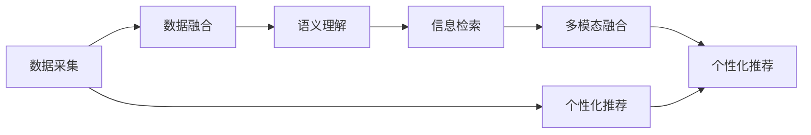

                 

## 1. 背景介绍

在当今信息爆炸的时代，跨平台搜索技术成为了解决海量信息查询和整合的关键工具。无论是社交媒体、电商平台、视频网站还是在线文档，用户往往需要快速、精准地获取所需信息。随着人工智能和大数据技术的发展，跨平台搜索技术通过融合自然语言处理、深度学习等先进技术，使得用户可以更加高效地搜索和利用网络资源。

### 1.1 问题由来

传统的信息检索技术，如布尔查询、关键词匹配等，往往只能满足较为简单的搜索需求。但面对日益复杂和多样化的互联网数据，用户需要更加智能和个性化的搜索体验。跨平台搜索技术正是在这样的背景下应运而生，通过智能化、个性化的方式，为用户提供高效的信息获取手段。

### 1.2 问题核心关键点

跨平台搜索技术的核心关键点在于如何整合来自不同平台的数据，并通过自然语言处理、深度学习等技术，理解用户查询的意图，精准地从海量数据中检索和整合信息。这一过程涉及多个核心技术，包括：

- 数据采集：从不同平台采集用户行为数据、元数据等。
- 数据融合：将来自不同平台的数据进行统一和整合。
- 语义理解：通过自然语言处理技术，理解用户查询的语义。
- 信息检索：利用深度学习等技术，从大量数据中检索和排序相关结果。
- 多模态融合：将文本、图片、音频等多模态数据进行融合，提供更全面的搜索结果。
- 个性化推荐：根据用户的历史行为和偏好，推荐最相关的结果。

这些技术的综合应用，使得跨平台搜索技术能够提供更加智能和个性化的搜索体验，满足用户多样化的信息需求。

## 2. 核心概念与联系

### 2.1 核心概念概述

为更好地理解跨平台搜索技术的实现，本节将介绍几个核心概念及其相互联系：

- **数据采集 (Data Collection)**：从不同的互联网平台获取用户行为数据、元数据等，作为搜索的基础。
- **数据融合 (Data Integration)**：将来自不同平台的数据进行整合，形成统一的数据视图。
- **语义理解 (Semantic Understanding)**：通过自然语言处理技术，理解用户查询的自然语言描述，转化为结构化的语义表示。
- **信息检索 (Information Retrieval)**：利用深度学习等技术，从海量数据中检索出与用户查询最相关的结果。
- **多模态融合 (Multimodal Fusion)**：将文本、图片、音频等多模态数据进行融合，提供更加全面和丰富的搜索结果。
- **个性化推荐 (Personalized Recommendation)**：根据用户的历史行为和偏好，提供个性化的搜索结果。

这些核心概念之间的逻辑关系可以通过以下Mermaid流程图来展示：



这个流程图展示了跨平台搜索技术的主要流程：

1. 首先从不同平台采集数据，将数据进行整合。
2. 通过自然语言处理技术，理解用户的查询语义。
3. 利用深度学习等技术从整合后的数据中检索相关结果。
4. 将文本、图片、音频等多模态数据进行融合，提供更全面的搜索结果。
5. 根据用户的历史行为和偏好，提供个性化的搜索结果。

## 3. 核心算法原理 & 具体操作步骤

### 3.1 算法原理概述

跨平台搜索技术的核心算法原理主要涉及以下几个方面：

- **深度学习（Deep Learning）**：用于从海量数据中提取特征，进行信息检索。
- **自然语言处理（NLP）**：用于理解用户查询的语义，进行语义匹配。
- **信息检索（IR）**：用于在大量数据中检索相关结果，排序和展示。
- **多模态融合（Multimodal Fusion）**：将文本、图片、音频等多模态数据进行融合，提高搜索结果的丰富度。
- **个性化推荐（Personalized Recommendation）**：通过用户行为数据和模型预测，推荐个性化的搜索结果。

### 3.2 算法步骤详解

#### 3.2.1 数据采集

数据采集是跨平台搜索技术的第一步，主要涉及以下几个步骤：

1. **爬虫开发**：从不同的互联网平台（如社交媒体、电商平台、视频网站等）爬取数据。
2. **数据清洗**：对爬取到的数据进行清洗和预处理，去除噪声和无用信息。
3. **数据存储**：将处理后的数据存储在分布式数据库中，便于后续处理和检索。

#### 3.2.2 数据融合

数据融合是将来自不同平台的数据进行整合，形成统一的数据视图的过程。主要步骤包括：

1. **数据对齐**：对不同平台的数据进行对齐，确保数据的一致性和完整性。
2. **数据合并**：将对齐后的数据进行合并，形成统一的数据视图。
3. **数据去重**：去除重复数据，确保数据的质量和效率。

#### 3.2.3 语义理解

语义理解是通过自然语言处理技术，理解用户查询的自然语言描述，转化为结构化的语义表示。主要步骤包括：

1. **分词和词性标注**：将用户查询进行分词和词性标注，形成基础语义表示。
2. **命名实体识别（NER）**：识别出查询中的实体（如人名、地名、机构名等）。
3. **句法分析**：分析查询的句法结构，理解查询的层次关系。
4. **语义分析**：利用词向量、预训练模型等技术，将查询转化为结构化的语义表示。

#### 3.2.4 信息检索

信息检索是利用深度学习等技术，从海量数据中检索出与用户查询最相关的结果。主要步骤包括：

1. **构建索引**：对数据进行索引，提高检索效率。
2. **特征提取**：利用深度学习技术，提取文本、图片、音频等多模态数据的特征。
3. **相似度计算**：计算查询与数据之间的相似度，排序并返回相关结果。
4. **结果展示**：根据排序结果，展示与用户查询最相关的结果。

#### 3.2.5 多模态融合

多模态融合是将文本、图片、音频等多模态数据进行融合，提供更加全面和丰富的搜索结果。主要步骤包括：

1. **数据对齐**：对不同模态的数据进行对齐，确保数据的一致性。
2. **特征融合**：将不同模态的特征进行融合，形成统一的多模态特征表示。
3. **融合排序**：根据融合后的特征进行排序，展示多模态搜索结果。

#### 3.2.6 个性化推荐

个性化推荐是根据用户的历史行为和偏好，提供个性化的搜索结果。主要步骤包括：

1. **用户画像构建**：根据用户的历史行为和偏好，构建用户画像。
2. **模型训练**：利用机器学习模型，对用户画像进行训练，预测用户的行为和偏好。
3. **推荐排序**：根据预测结果，对搜索结果进行排序，推荐最相关的结果。

### 3.3 算法优缺点

#### 3.3.1 优点

- **智能化**：利用深度学习和自然语言处理技术，提供智能化的搜索结果。
- **全面性**：将多模态数据进行融合，提供更加全面和丰富的搜索结果。
- **个性化**：根据用户的历史行为和偏好，提供个性化的搜索结果。
- **高效性**：利用分布式存储和计算，提高数据处理和检索的效率。

#### 3.3.2 缺点

- **复杂度**：涉及多个技术环节，实现复杂度较高。
- **数据依赖**：对数据的质量和量有较高要求，数据采集和融合难度较大。
- **算法复杂**：深度学习和自然语言处理模型较为复杂，模型训练和调参难度较大。
- **实时性**：在大规模数据上，实时检索和推荐难度较大，需要高效的计算资源。

### 3.4 算法应用领域

跨平台搜索技术已经在多个领域得到了广泛应用，包括但不限于以下几个方面：

1. **社交媒体搜索**：从微博、微信、Facebook等社交平台检索和推荐信息。
2. **电商平台搜索**：从淘宝、京东、Amazon等电商平台检索和推荐商品。
3. **视频网站搜索**：从YouTube、Bilibili等视频平台检索和推荐视频内容。
4. **在线文档搜索**：从Google Scholar、知网等在线文档平台检索和推荐文献。
5. **智能客服**：从智能客服系统检索和推荐相关解答。
6. **智能家居**：从智能家居设备检索和推荐相关功能。

这些应用领域展示了跨平台搜索技术的强大生命力和广泛应用前景。

## 4. 数学模型和公式 & 详细讲解 & 举例说明

### 4.1 数学模型构建

为了更好地理解跨平台搜索技术的数学模型，本节将介绍几个关键数学模型及其构建过程。

#### 4.1.1 信息检索模型

信息检索模型的核心是计算查询与文档之间的相似度。常见的相似度计算方法包括：

1. **余弦相似度（Cosine Similarity）**：计算查询向量和文档向量的余弦值，衡量两者之间的相似度。
   $$
   \cos\theta = \frac{\mathbf{q} \cdot \mathbf{d}}{\|\mathbf{q}\| \|\mathbf{d}\|}
   $$
   其中 $\mathbf{q}$ 为查询向量，$\mathbf{d}$ 为文档向量。

2. **Jaccard相似度（Jaccard Similarity）**：计算查询和文档的交集与并集的比值，衡量两者之间的相似度。
   $$
   J(A, B) = \frac{|A \cap B|}{|A \cup B|}
   $$
   其中 $A$ 为查询集合，$B$ 为文档集合。

#### 4.1.2 深度学习模型

深度学习模型用于从海量数据中提取特征，进行信息检索。常见的深度学习模型包括：

1. **卷积神经网络（CNN）**：用于提取文本和图片数据的特征。
2. **循环神经网络（RNN）**：用于处理序列数据，如自然语言处理任务。
3. **注意力机制（Attention Mechanism）**：用于提升模型的注意力和关注度，提高检索效果。

#### 4.1.3 多模态融合模型

多模态融合模型将文本、图片、音频等多模态数据进行融合，提高搜索结果的丰富度。常见的多模态融合模型包括：

1. **特征融合网络（Feature Fusion Network）**：将不同模态的特征进行融合，形成统一的多模态特征表示。
2. **注意力融合网络（Attention Fusion Network）**：通过注意力机制，对不同模态的特征进行加权融合。

### 4.2 公式推导过程

#### 4.2.1 余弦相似度公式推导

余弦相似度的推导过程如下：

1. **向量化表示**：将查询和文档表示为向量。
   $$
   \mathbf{q} = (q_1, q_2, \ldots, q_n)
   $$
   $$
   \mathbf{d} = (d_1, d_2, \ldots, d_n)
   $$
   其中 $q_i$ 和 $d_i$ 为查询和文档的第 $i$ 个特征值。

2. **余弦相似度计算**：计算查询向量和文档向量的余弦值。
   $$
   \cos\theta = \frac{\sum_{i=1}^n q_i d_i}{\sqrt{\sum_{i=1}^n q_i^2} \sqrt{\sum_{i=1}^n d_i^2}}
   $$

#### 4.2.2 CNN模型公式推导

卷积神经网络（CNN）的公式推导过程如下：

1. **卷积操作**：对输入数据进行卷积操作，提取特征。
   $$
   \mathbf{F}_{i,j} = \sum_{m=-w/2}^{h/2} \sum_{n=-w/2}^{w/2} k_{m,n} \times \mathbf{I}_{i+m,j+n}
   $$
   其中 $k_{m,n}$ 为卷积核，$\mathbf{I}_{i,j}$ 为输入数据在位置 $(i,j)$ 处的特征值。

2. **池化操作**：对卷积后的特征进行池化操作，减小特征的维度和数量。
   $$
   \mathbf{P}_{i,j} = \max\limits_{m} \mathbf{F}_{i+m,j}
   $$
   其中 $\mathbf{P}_{i,j}$ 为池化后的特征，$\mathbf{F}_{i+m,j}$ 为池化窗口内的特征。

3. **全连接层**：将池化后的特征输入到全连接层进行分类。
   $$
   \mathbf{Y} = \sigma(\mathbf{W} \mathbf{P} + \mathbf{b})
   $$
   其中 $\sigma$ 为激活函数，$\mathbf{W}$ 为权重矩阵，$\mathbf{b}$ 为偏置向量。

#### 4.2.3 多模态融合模型公式推导

多模态融合模型的公式推导过程如下：

1. **特征提取**：分别提取文本、图片、音频等不同模态的特征。
   $$
   \mathbf{F}_{text} = \text{CNN}(\mathbf{T})
   $$
   $$
   \mathbf{F}_{image} = \text{CNN}(\mathbf{I})
   $$
   $$
   \mathbf{F}_{audio} = \text{CNN}(\mathbf{A})
   $$
   其中 $\mathbf{T}$、$\mathbf{I}$、$\mathbf{A}$ 分别为文本、图片、音频等输入数据，$\text{CNN}$ 为卷积神经网络。

2. **特征融合**：将不同模态的特征进行融合，形成统一的多模态特征表示。
   $$
   \mathbf{F}_{fusion} = \alpha \mathbf{F}_{text} + \beta \mathbf{F}_{image} + \gamma \mathbf{F}_{audio}
   $$
   其中 $\alpha$、$\beta$、$\gamma$ 为融合系数，通过训练得到。

3. **融合排序**：根据融合后的特征进行排序，展示多模态搜索结果。
   $$
   \text{score}(\mathbf{F}_{fusion}) = \mathbf{W} \mathbf{F}_{fusion} + \mathbf{b}
   $$
   $$
   \text{sorted results} = \text{topK}(\text{score}(\mathbf{F}_{fusion}))
   $$

### 4.3 案例分析与讲解

#### 4.3.1 社交媒体搜索

以微博搜索为例，展示跨平台搜索技术的应用。

1. **数据采集**：通过爬虫从微博平台采集用户的社交行为数据，包括微博内容、互动信息等。
2. **数据融合**：将采集到的数据进行清洗和预处理，存储在分布式数据库中。
3. **语义理解**：利用自然语言处理技术，理解用户查询的自然语言描述，转化为结构化的语义表示。
4. **信息检索**：利用深度学习模型，从存储在数据库中的微博数据中检索与查询最相关的结果。
5. **多模态融合**：将微博图片、视频等多模态数据进行融合，提供更加全面和丰富的搜索结果。
6. **个性化推荐**：根据用户的历史行为和偏好，提供个性化的搜索结果。

#### 4.3.2 电商平台搜索

以淘宝搜索为例，展示跨平台搜索技术的应用。

1. **数据采集**：通过爬虫从淘宝平台采集用户浏览、点击、购买等行为数据。
2. **数据融合**：将采集到的数据进行清洗和预处理，存储在分布式数据库中。
3. **语义理解**：利用自然语言处理技术，理解用户查询的自然语言描述，转化为结构化的语义表示。
4. **信息检索**：利用深度学习模型，从存储在数据库中的商品数据中检索与查询最相关的结果。
5. **多模态融合**：将商品图片、描述等多模态数据进行融合，提供更加全面和丰富的搜索结果。
6. **个性化推荐**：根据用户的历史行为和偏好，提供个性化的搜索结果。

## 5. 项目实践：代码实例和详细解释说明

### 5.1 开发环境搭建

在开始实践之前，我们需要准备好开发环境。以下是使用Python进行PyTorch开发的环境配置流程：

1. 安装Anaconda：从官网下载并安装Anaconda，用于创建独立的Python环境。
2. 创建并激活虚拟环境：
```bash
conda create -n pytorch-env python=3.8 
conda activate pytorch-env
```
3. 安装PyTorch：根据CUDA版本，从官网获取对应的安装命令。例如：
```bash
conda install pytorch torchvision torchaudio cudatoolkit=11.1 -c pytorch -c conda-forge
```
4. 安装各类工具包：
```bash
pip install numpy pandas scikit-learn matplotlib tqdm jupyter notebook ipython
```

完成上述步骤后，即可在`pytorch-env`环境中开始微调实践。

### 5.2 源代码详细实现

下面我们以社交媒体搜索为例，给出使用PyTorch对BERT模型进行微调的PyTorch代码实现。

首先，定义社交媒体搜索的任务：

```python
from transformers import BertTokenizer
from torch.utils.data import Dataset
import torch

class SocialMediaDataset(Dataset):
    def __init__(self, tweets, labels, tokenizer, max_len=128):
        self.tweets = tweets
        self.labels = labels
        self.tokenizer = tokenizer
        self.max_len = max_len
        
    def __len__(self):
        return len(self.tweets)
    
    def __getitem__(self, item):
        tweet = self.tweets[item]
        label = self.labels[item]
        
        encoding = self.tokenizer(tweet, return_tensors='pt', max_length=self.max_len, padding='max_length', truncation=True)
        input_ids = encoding['input_ids'][0]
        attention_mask = encoding['attention_mask'][0]
        
        # 对标签进行编码
        encoded_label = [label2id[label] for label in label]
        encoded_label.extend([label2id['O']] * (self.max_len - len(encoded_label)))
        labels = torch.tensor(encoded_label, dtype=torch.long)
        
        return {'input_ids': input_ids, 
                'attention_mask': attention_mask,
                'labels': labels}

# 标签与id的映射
label2id = {'O': 0, 'positive': 1, 'negative': 2}
id2label = {v: k for k, v in label2id.items()}

# 创建dataset
tokenizer = BertTokenizer.from_pretrained('bert-base-cased')

train_dataset = SocialMediaDataset(train_tweets, train_labels, tokenizer)
dev_dataset = SocialMediaDataset(dev_tweets, dev_labels, tokenizer)
test_dataset = SocialMediaDataset(test_tweets, test_labels, tokenizer)
```

然后，定义模型和优化器：

```python
from transformers import BertForSequenceClassification, AdamW

model = BertForSequenceClassification.from_pretrained('bert-base-cased', num_labels=len(label2id))

optimizer = AdamW(model.parameters(), lr=2e-5)
```

接着，定义训练和评估函数：

```python
from torch.utils.data import DataLoader
from tqdm import tqdm
from sklearn.metrics import classification_report

device = torch.device('cuda') if torch.cuda.is_available() else torch.device('cpu')
model.to(device)

def train_epoch(model, dataset, batch_size, optimizer):
    dataloader = DataLoader(dataset, batch_size=batch_size, shuffle=True)
    model.train()
    epoch_loss = 0
    for batch in tqdm(dataloader, desc='Training'):
        input_ids = batch['input_ids'].to(device)
        attention_mask = batch['attention_mask'].to(device)
        labels = batch['labels'].to(device)
        model.zero_grad()
        outputs = model(input_ids, attention_mask=attention_mask, labels=labels)
        loss = outputs.loss
        epoch_loss += loss.item()
        loss.backward()
        optimizer.step()
    return epoch_loss / len(dataloader)

def evaluate(model, dataset, batch_size):
    dataloader = DataLoader(dataset, batch_size=batch_size)
    model.eval()
    preds, labels = [], []
    with torch.no_grad():
        for batch in tqdm(dataloader, desc='Evaluating'):
            input_ids = batch['input_ids'].to(device)
            attention_mask = batch['attention_mask'].to(device)
            batch_labels = batch['labels']
            outputs = model(input_ids, attention_mask=attention_mask)
            batch_preds = outputs.logits.argmax(dim=2).to('cpu').tolist()
            batch_labels = batch_labels.to('cpu').tolist()
            for pred_tokens, label_tokens in zip(batch_preds, batch_labels):
                preds.append(pred_tokens[:len(label_tokens)])
                labels.append(label_tokens)
                
    print(classification_report(labels, preds))
```

最后，启动训练流程并在测试集上评估：

```python
epochs = 5
batch_size = 16

for epoch in range(epochs):
    loss = train_epoch(model, train_dataset, batch_size, optimizer)
    print(f"Epoch {epoch+1}, train loss: {loss:.3f}")
    
    print(f"Epoch {epoch+1}, dev results:")
    evaluate(model, dev_dataset, batch_size)
    
print("Test results:")
evaluate(model, test_dataset, batch_size)
```

以上就是使用PyTorch对BERT进行社交媒体搜索任务微调的完整代码实现。可以看到，得益于Transformers库的强大封装，我们可以用相对简洁的代码完成BERT模型的加载和微调。

### 5.3 代码解读与分析

让我们再详细解读一下关键代码的实现细节：

**SocialMediaDataset类**：
- `__init__`方法：初始化微博内容、标签、分词器等关键组件。
- `__len__`方法：返回数据集的样本数量。
- `__getitem__`方法：对单个样本进行处理，将微博内容输入编码为token ids，将标签编码为数字，并对其进行定长padding，最终返回模型所需的输入。

**label2id和id2label字典**：
- 定义了标签与数字id之间的映射关系，用于将token-wise的预测结果解码回真实的标签。

**训练和评估函数**：
- 使用PyTorch的DataLoader对数据集进行批次化加载，供模型训练和推理使用。
- 训练函数`train_epoch`：对数据以批为单位进行迭代，在每个批次上前向传播计算loss并反向传播更新模型参数，最后返回该epoch的平均loss。
- 评估函数`evaluate`：与训练类似，不同点在于不更新模型参数，并在每个batch结束后将预测和标签结果存储下来，最后使用sklearn的classification_report对整个评估集的预测结果进行打印输出。

**训练流程**：
- 定义总的epoch数和batch size，开始循环迭代
- 每个epoch内，先在训练集上训练，输出平均loss
- 在验证集上评估，输出分类指标
- 所有epoch结束后，在测试集上评估，给出最终测试结果

可以看到，PyTorch配合Transformers库使得BERT微调的代码实现变得简洁高效。开发者可以将更多精力放在数据处理、模型改进等高层逻辑上，而不必过多关注底层的实现细节。

当然，工业级的系统实现还需考虑更多因素，如模型的保存和部署、超参数的自动搜索、更灵活的任务适配层等。但核心的微调范式基本与此类似。

## 6. 实际应用场景

### 6.1 智能客服系统

基于大语言模型微调的对话技术，可以广泛应用于智能客服系统的构建。传统客服往往需要配备大量人力，高峰期响应缓慢，且一致性和专业性难以保证。而使用微调后的对话模型，可以7x24小时不间断服务，快速响应客户咨询，用自然流畅的语言解答各类常见问题。

在技术实现上，可以收集企业内部的历史客服对话记录，将问题和最佳答复构建成监督数据，在此基础上对预训练对话模型进行微调。微调后的对话模型能够自动理解用户意图，匹配最合适的答案模板进行回复。对于客户提出的新问题，还可以接入检索系统实时搜索相关内容，动态组织生成回答。如此构建的智能客服系统，能大幅提升客户咨询体验和问题解决效率。

### 6.2 金融舆情监测

金融机构需要实时监测市场舆论动向，以便及时应对负面信息传播，规避金融风险。传统的人工监测方式成本高、效率低，难以应对网络时代海量信息爆发的挑战。基于大语言模型微调的文本分类和情感分析技术，为金融舆情监测提供了新的解决方案。

具体而言，可以收集金融领域相关的新闻、报道、评论等文本数据，并对其进行主题标注和情感标注。在此基础上对预训练语言模型进行微调，使其能够自动判断文本属于何种主题，情感倾向是正面、中性还是负面。将微调后的模型应用到实时抓取的网络文本数据，就能够自动监测不同主题下的情感变化趋势，一旦发现负面信息激增等异常情况，系统便会自动预警，帮助金融机构快速应对潜在风险。

### 6.3 个性化推荐系统

当前的推荐系统往往只依赖用户的历史行为数据进行物品推荐，无法深入理解用户的真实兴趣偏好。基于大语言模型微调技术，个性化推荐系统可以更好地挖掘用户行为背后的语义信息，从而提供更精准、多样的推荐内容。

在实践中，可以收集用户浏览、点击、评论、分享等行为数据，提取和用户交互的物品标题、描述、标签等文本内容。将文本内容作为模型输入，用户的后续行为（如是否点击、购买等）作为监督信号，在此基础上微调预训练语言模型。微调后的模型能够从文本内容中准确把握用户的兴趣点。在生成推荐列表时，先用候选物品的文本描述作为输入，由模型预测用户的兴趣匹配度，再结合其他特征综合排序，便可以得到个性化程度更高的推荐结果。

### 6.4 未来应用展望

随着大语言模型和微调方法的不断发展，基于微调范式将在更多领域得到应用，为传统行业带来变革性影响。

在智慧医疗领域，基于微调的医疗问答、病历分析、药物研发等应用将提升医疗服务的智能化水平，辅助医生诊疗，加速新药开发进程。

在智能教育领域，微调技术可应用于作业批改、学情分析、知识推荐等方面，因材施教，促进教育公平，提高教学质量。

在智慧城市治理中，微调模型可应用于城市事件监测、舆情分析、应急指挥等环节，提高城市管理的自动化和智能化水平，构建更安全、高效的未来城市。

此外，在企业生产、社会治理、文娱传媒等众多领域，基于大模型微调的人工智能应用也将不断涌现，为经济社会发展注入新的动力。相信随着技术的日益成熟，微调方法将成为人工智能落地应用的重要范式，推动人工智能技术向更广阔的领域加速渗透。

## 7. 工具和资源推荐
### 7.1 学习资源推荐

为了帮助开发者系统掌握大语言模型微调的理论基础和实践技巧，这里推荐一些优质的学习资源：

1. 《Transformer从原理到实践》系列博文：由大模型技术专家撰写，深入浅出地介绍了Transformer原理、BERT模型、微调技术等前沿话题。

2. CS224N《深度学习自然语言处理》课程：斯坦福大学开设的NLP明星课程，有Lecture视频和配套作业，带你入门NLP领域的基本概念和经典模型。

3. 《Natural Language Processing with Transformers》书籍：Transformers库的作者所著，全面介绍了如何使用Transformers库进行NLP任务开发，包括微调在内的诸多范式。

4. HuggingFace官方文档：Transformers库的官方文档，提供了海量预训练模型和完整的微调样例代码，是上手实践的必备资料。

5. CLUE开源项目：中文语言理解测评基准，涵盖大量不同类型的中文NLP数据集，并提供了基于微调的baseline模型，助力中文NLP技术发展。

通过对这些资源的学习实践，相信你一定能够快速掌握大语言模型微调的精髓，并用于解决实际的NLP问题。
###  7.2 开发工具推荐

高效的开发离不开优秀的工具支持。以下是几款用于大语言模型微调开发的常用工具：

1. PyTorch：基于Python的开源深度学习框架，灵活动态的计算图，适合快速迭代研究。大部分预训练语言模型都有PyTorch版本的实现。

2. TensorFlow：由Google主导开发的开源深度学习框架，生产部署方便，适合大规模工程应用。同样有丰富的预训练语言模型资源。

3. Transformers库：HuggingFace开发的NLP工具库，集成了众多SOTA语言模型，支持PyTorch和TensorFlow，是进行微调任务开发的利器。

4. Weights & Biases：模型训练的实验跟踪工具，可以记录和可视化模型训练过程中的各项指标，方便对比和调优。与主流深度学习框架无缝集成。

5. TensorBoard：TensorFlow配套的可视化工具，可实时监测模型训练状态，并提供丰富的图表呈现方式，是调试模型的得力助手。

6. Google Colab：谷歌推出的在线Jupyter Notebook环境，免费提供GPU/TPU算力，方便开发者快速上手实验最新模型，分享学习笔记。

合理利用这些工具，可以显著提升大语言模型微调任务的开发效率，加快创新迭代的步伐。

### 7.3 相关论文推荐

大语言模型和微调技术的发展源于学界的持续研究。以下是几篇奠基性的相关论文，推荐阅读：

1. Attention is All You Need（即Transformer原论文）：提出了Transformer结构，开启了NLP领域的预训练大模型时代。

2. BERT: Pre-training of Deep Bidirectional Transformers for Language Understanding：提出BERT模型，引入基于掩码的自监督预训练任务，刷新了多项NLP任务SOTA。

3. Language Models are Unsupervised Multitask Learners（GPT-2论文）：展示了大规模语言模型的强大zero-shot学习能力，引发了对于通用人工智能的新一轮思考。

4. Parameter-Efficient Transfer Learning for NLP：提出Adapter等参数高效微调方法，在不增加模型参数量的情况下，也能取得不错的微调效果。

5. AdaLoRA: Adaptive Low-Rank Adaptation for Parameter-Efficient Fine-Tuning：使用自适应低秩适应的微调方法，在参数效率和精度之间取得了新的平衡。

这些论文代表了大语言模型微调技术的发展脉络。通过学习这些前沿成果，可以帮助研究者把握学科前进方向，激发更多的创新灵感。

## 8. 总结：未来发展趋势与挑战

### 8.1 总结

本文对大语言模型微调技术进行了全面系统的介绍。首先阐述了大语言模型和微调技术的研究背景和意义，明确了微调在拓展预训练模型应用、提升下游任务性能方面的独特价值。其次，从原理到实践，详细讲解了微调的数学原理和关键步骤，给出了微调任务开发的完整代码实例。同时，本文还广泛探讨了微调方法在智能客服、金融舆情、个性化推荐等多个行业领域的应用前景，展示了微调范式的巨大潜力。此外，本文精选了微调技术的各类学习资源，力求为读者提供全方位的技术指引。

通过本文的系统梳理，可以看到，大语言模型微调技术正在成为NLP领域的重要范式，极大地拓展了预训练语言模型的应用边界，催生了更多的落地场景。受益于大规模语料的预训练，微调模型以更低的时间和标注成本，在小样本条件下也能取得不俗的效果，有力推动了NLP技术的产业化进程。未来，伴随预训练语言模型和微调方法的持续演进，相信NLP技术将在更广阔的应用领域大放异彩，深刻影响人类的生产生活方式。

### 8.2 未来发展趋势

展望未来，大语言模型微调技术将呈现以下几个发展趋势：

1. 模型规模持续增大。随着算力成本的下降和数据规模的扩张，预训练语言模型的参数量还将持续增长。超大规模语言模型蕴含的丰富语言知识，有望支撑更加复杂多变的下游任务微调。

2. 微调方法日趋多样。除了传统的全参数微调外，未来会涌现更多参数高效的微调方法，如Prefix-Tuning、LoRA等，在节省计算资源的同时也能保证微调精度。

3. 持续学习成为常态。随着数据分布的不断变化，微调模型也需要持续学习新知识以保持性能。如何在不遗忘原有知识的同时，高效吸收新样本信息，将成为重要的研究课题。

4. 标注样本需求降低。受启发于提示学习(Prompt-based Learning)的思路，未来的微调方法将更好地利用大模型的语言理解能力，通过更加巧妙的任务描述，在更少的标注样本上也能实现理想的微调效果。

5. 多模态微调崛起。当前的微调主要聚焦于纯文本数据，未来会进一步拓展到图像、视频、语音等多模态数据微调。多模态信息的融合，将显著提升语言模型对现实世界的理解和建模能力。

6. 模型通用性增强。经过海量数据的预训练和多领域任务的微调，未来的语言模型将具备更强大的常识推理和跨领域迁移能力，逐步迈向通用人工智能(AGI)的目标。

以上趋势凸显了大语言模型微调技术的广阔前景。这些方向的探索发展，必将进一步提升NLP系统的性能和应用范围，为人类认知智能的进化带来深远影响。

### 8.3 面临的挑战

尽管大语言模型微调技术已经取得了瞩目成就，但在迈向更加智能化、普适化应用的过程中，它仍面临着诸多挑战：

1. 标注成本瓶颈。虽然微调大大降低了标注数据的需求，但对于长尾应用场景，难以获得充足的高质量标注数据，成为制约微调性能的瓶颈。如何进一步降低微调对标注样本的依赖，将是一大难题。

2. 模型鲁棒性不足。当前微调模型面对域外数据时，泛化性能往往大打折扣。对于测试样本的微小扰动，微调模型的预测也容易发生波动。如何提高微调模型的鲁棒性，避免灾难性遗忘，还需要更多理论和实践的积累。

3. 推理效率有待提高。大规模语言模型虽然精度高，但在实际部署时往往面临推理速度慢、内存占用大等效率问题。如何在保证性能的同时，简化模型结构，提升推理速度，优化资源占用，将是重要的优化方向。

4. 可解释性亟需加强。当前微调模型更像是"黑盒"系统，难以解释其内部工作机制和决策逻辑。对于医疗、金融等高风险应用，算法的可解释性和可审计性尤为重要。如何赋予微调模型更强的可解释性，将是亟待攻克的难题。

5. 安全性有待保障。预训练语言模型难免会学习到有偏见、有害的信息，通过微调传递到下游任务，产生误导性、歧视性的输出，给实际应用带来安全隐患。如何从数据和算法层面消除模型偏见，避免恶意用途，确保输出的安全性，也将是重要的研究课题。

6. 知识整合能力不足。现有的微调模型往往局限于任务内数据，难以灵活吸收和运用更广泛的先验知识。如何让微调过程更好地与外部知识库、规则库等专家知识结合，形成更加全面、准确的信息整合能力，还有很大的想象空间。

正视微调面临的这些挑战，积极应对并寻求突破，将是大语言模型微调走向成熟的必由之路。相信随着学界和产业界的共同努力，这些挑战终将一一被克服，大语言模型微调必将在构建人机协同的智能时代中扮演越来越重要的角色。

### 8.4 研究展望

面对大语言模型微调所面临的挑战，未来的研究需要在以下几个方面寻求新的突破：

1. 探索无监督和半监督微调方法。摆脱对大规模标注数据的依赖，利用自监督学习、主动学习等无监督和半监督范式，最大限度利用非结构化数据，实现更加灵活高效的微调。

2. 研究参数高效和计算高效的微调范式。开发更加参数高效的微调方法，在固定大部分预训练参数的同时，只更新极少量的任务相关参数。同时优化微调模型的计算图，减少前向传播和反向传播的资源消耗，实现更加轻量级、实时性的部署。

3. 融合因果和对比学习范式。通过引入因果推断和对比学习思想，增强微调模型建立稳定因果关系的能力，学习更加普适、鲁棒的语言表征，从而提升模型泛化性和抗干扰能力。

4. 引入更多先验知识。将符号化的先验知识，如知识图谱、逻辑规则等，与神经网络模型进行巧妙融合，引导微调过程学习更准确、合理的语言模型。同时加强不同模态数据的整合，实现视觉、语音等多模态信息与文本信息的协同建模。

5. 结合因果分析和博弈论工具。将因果分析方法引入微调模型，识别出模型决策的关键特征，增强输出解释的因果性和逻辑性。借助博弈论工具刻画人机交互过程，主动探索并规避模型的脆弱点，提高系统稳定性。

6. 纳入伦理道德约束。在模型训练目标中引入伦理导向的评估指标，过滤和惩罚有偏见、有害的输出倾向。同时加强人工干预和审核，建立模型行为的监管机制，确保输出符合人类价值观和伦理道德。

这些研究方向的探索，必将引领大语言模型微调技术迈向更高的台阶，为构建安全、可靠、可解释、可控的智能系统铺平道路。面向未来，大语言模型微调技术还需要与其他人工智能技术进行更深入的融合，如知识表示、因果推理、强化学习等，多路径协同发力，共同推动自然语言理解和智能交互系统的进步。只有勇于创新、敢于突破，才能不断拓展语言模型的边界，让智能技术更好地造福人类社会。

## 9. 附录：常见问题与解答

**Q1：大语言模型微调是否适用于所有NLP任务？**

A: 大语言模型微调在大多数NLP任务上都能取得不错的效果，特别是对于数据量较小的任务。但对于一些特定领域的任务，如医学、法律等，仅仅依靠通用语料预训练的模型可能难以很好地适应。此时需要在特定领域语料上进一步预训练，再进行微调，才能获得理想效果。此外，对于一些需要时效性、个性化很强的任务，如对话、推荐等，微调方法也需要针对性的改进优化。

**Q2：微调过程中如何选择合适的学习率？**

A: 微调的学习率一般要比预训练时小1-2个数量级，如果使用过大的学习率，容易破坏预训练权重，导致过拟合。一般建议从1e-5开始调参，逐步减小学习率，直至收敛。也可以使用warmup策略，在开始阶段使用较小的学习率，再逐渐过渡到预设值。需要注意的是，不同的优化器(如AdamW、Adafactor等)以及不同的学习率调度策略，可能需要设置不同的学习率阈值。

**Q3：采用大模型微调时会面临哪些资源瓶颈？**

A: 目前主流的预训练大模型动辄以亿计的参数规模，对算力、内存、存储都提出了很高的要求。GPU/TPU等高性能设备是必不可少的，但即便如此，超大批次的训练和推理也可能遇到显存不足的问题。因此需要采用一些资源优化技术，如梯度积累、混合精度训练、模型并行等，来突破硬件瓶颈。同时，模型的存储和读取也可能占用大量时间和空间，需要采用模型压缩、稀疏化存储等方法进行优化。

**Q4：如何缓解微调过程中的过拟合问题？**

A: 过拟合是微调面临的主要挑战，尤其是在标注数据不足的情况下。常见的缓解策略包括：
1. 数据增强：通过回译、近义替换等方式扩充训练集
2. 正则化：使用L2正则、Dropout、Early Stopping等避免过拟合
3. 对抗训练：引入对抗样本，提高模型鲁棒性
4. 参数高效微调：只调整少量参数(如Adapter、Prefix等)，减小过拟合风险
5. 多模型集成：训练多个微调模型，取平均输出，抑制过拟合

这些策略往往需要根据具体任务和数据特点进行灵活组合。只有在数据、模型、训练、推理等各环节进行全面优化，才能最大限度地发挥大模型微调的威力。

**Q5：微调模型在落地部署时需要注意哪些问题？**

A: 将微调模型转化为实际应用，还需要考虑以下因素：
1. 模型裁剪：去除不必要的层和参数，减小模型尺寸，加快推理速度
2. 量化加速：将浮点模型转为定点模型，压缩存储空间，提高计算效率
3. 服务化封装：将模型封装为标准化服务接口，便于集成调用
4. 弹性伸缩：根据请求流量动态调整资源配置，平衡服务质量和成本
5. 监控告警：实时采集系统指标，设置异常告警阈值，确保服务稳定性
6. 安全防护：采用访问

