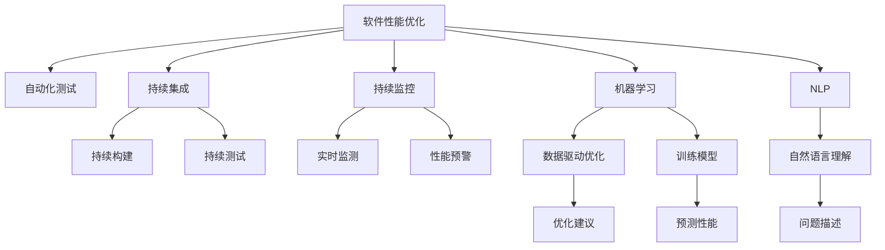

                 

# AI辅助的软件性能优化

> 关键词：人工智能,性能优化,软件工程,代码质量,测试工具,持续集成,机器学习,算法优化

## 1. 背景介绍

### 1.1 问题由来

随着软件系统规模的不断扩大和复杂度的提升，软件性能优化成为了软件工程中的重要课题。传统的软件性能优化依赖于人工分析和调试，既耗时又容易陷入瓶颈。特别是对于大规模分布式系统，性能问题的诊断和修复更是难上加难。

近年来，随着人工智能（AI）技术在各领域的快速渗透，AI辅助的软件性能优化方法逐渐崭露头角。通过AI技术，可以自动地、大规模地分析和优化软件性能，显著提升优化效率和效果。

### 1.2 问题核心关键点

AI辅助的软件性能优化方法的核心关键点主要包括：

- 自动化性能优化：利用机器学习和自然语言处理等AI技术，自动分析和诊断软件性能问题，提出优化建议。
- 大规模数据处理：通过大数据分析平台，处理海量应用数据，提供全面的性能洞察。
- 持续集成与监控：将AI优化技术与持续集成（CI）和监控系统集成，实现性能问题的持续检测和修复。
- 数据驱动的优化决策：基于历史和实时数据，通过数据驱动的模型，动态调整优化策略。
- 多维度优化策略：结合性能模型、代码静态分析、测试工具等手段，进行多维度性能优化。
- 知识积累与复用：通过AI技术，积累和复用历史优化经验，提升未来优化效果。

这些核心关键点共同构成了AI辅助性能优化的基本框架，使得软件性能优化从经验驱动转向数据驱动，从人工驱动转向自动化驱动。

## 2. 核心概念与联系

### 2.1 核心概念概述

为了更好地理解AI辅助的软件性能优化方法，本节将介绍几个密切相关的核心概念：

- 软件性能优化（Software Performance Optimization）：通过分析和改进软件代码、架构、算法等，提升软件系统的响应速度、资源利用率、稳定性等指标。

- 自动化测试（Automated Testing）：使用脚本或工具，自动执行测试用例，以发现软件缺陷和性能问题。

- 持续集成（Continuous Integration, CI）：将代码变更自动构建、测试和部署，实现快速迭代和持续交付。

- 持续监控（Continuous Monitoring）：对软件运行状态进行实时监测和分析，提前预警和处理性能问题。

- 机器学习（Machine Learning）：通过数据训练模型，自动发现和解决问题。

- 自然语言处理（Natural Language Processing, NLP）：处理和理解人类语言，用于自动分析日志和问题描述。

- 数据驱动（Data-Driven）：基于数据模型和统计分析，做出性能优化决策。

- 知识图谱（Knowledge Graph）：用图形化方式表示知识和关系，用于辅助性能优化和知识复用。

这些核心概念之间的逻辑关系可以通过以下Mermaid流程图来展示：



这个流程图展示了软件性能优化涉及的关键流程和技术：

1. 从软件性能优化出发，将自动化测试、持续集成、持续监控等技术作为支持手段。
2. 结合机器学习和自然语言处理技术，自动分析性能数据和日志信息，生成优化建议。
3. 数据驱动优化模型基于历史和实时数据，动态调整优化策略。
4. 优化建议通过知识图谱复用历史经验，提升优化效果。

这些概念共同构成了AI辅助软件性能优化的技术框架，帮助开发者和运维人员高效、全面地提升软件系统性能。

## 3. 核心算法原理 & 具体操作步骤
### 3.1 算法原理概述

AI辅助的软件性能优化，本质上是一个数据驱动、自动化的优化过程。其核心思想是：通过收集软件系统的性能数据和日志信息，使用机器学习算法进行模型训练，自动分析和优化软件性能。

具体流程包括以下几个步骤：

1. 数据收集：从系统日志、性能监控工具、自动化测试工具中收集软件性能数据和日志信息。
2. 数据清洗：对数据进行清洗和预处理，消除噪音和异常值，提取有效特征。
3. 模型训练：使用机器学习算法（如回归、分类、聚类等），训练性能优化模型。
4. 预测和诊断：将新的性能数据输入模型，预测可能存在的性能问题，自动生成诊断报告。
5. 优化建议：基于诊断报告，自动提出优化建议，如代码重构、参数调优、资源调度等。
6. 持续监控：在优化建议实施后，持续监控系统性能，评估优化效果。

### 3.2 算法步骤详解

以基于回归模型的性能优化为例，下面详细介绍具体的算法步骤：

**Step 1: 数据收集**
收集软件系统在不同负载、不同环境下的性能数据和日志信息。例如，可以记录系统响应时间、CPU使用率、内存使用率、网络延迟等。

**Step 2: 数据清洗**
对收集到的数据进行清洗和预处理，消除噪音和异常值。例如，可以通过移动平均或窗口滑动方法平滑数据，去除极端值。同时，提取与性能相关的特征，如线程数、缓存大小、数据库连接数等。

**Step 3: 模型训练**
使用回归模型，如线性回归、多项式回归、随机森林回归等，训练性能优化模型。模型训练过程中，使用交叉验证等方法避免过拟合，选择最优的模型参数和特征。

**Step 4: 预测和诊断**
将新的性能数据输入模型，预测可能存在的性能瓶颈。例如，预测某个模块的响应时间是否异常。同时，生成详细的诊断报告，包括性能瓶颈的特征、可能的改进方法等。

**Step 5: 优化建议**
根据诊断报告，自动提出优化建议。例如，建议调整线程池大小、优化数据库查询、增加缓存空间等。

**Step 6: 持续监控**
在优化建议实施后，持续监控系统性能，评估优化效果。同时，收集新的性能数据，更新模型，继续优化。

### 3.3 算法优缺点

AI辅助的软件性能优化方法具有以下优点：

1. 自动化程度高：自动分析性能数据和日志信息，生成优化建议，减少人工工作量。
2. 数据驱动：基于历史和实时数据，进行科学决策，提升优化效果。
3. 覆盖面广：结合多种数据源和分析工具，提供全面的性能洞察。
4. 持续改进：通过持续监控和数据驱动模型，实现性能优化迭代优化。

但同时也存在一些缺点：

1. 依赖数据质量：性能数据和日志信息需要高质量的收集和清洗，否则模型效果不佳。
2. 模型复杂度高：训练高性能优化模型需要较大的数据量和计算资源。
3. 缺乏可解释性：AI模型的决策过程难以解释，需要结合人工经验进行调整。
4. 应用场景限制：目前主要应用于已有系统性能优化，对于全新系统，需要结合预训练模型进行优化。

### 3.4 算法应用领域

AI辅助的软件性能优化方法，在软件开发和运维过程中得到了广泛应用，例如：

1. 应用系统优化：对Web应用、移动应用、云服务等软件系统进行性能优化，提升用户体验。
2. 数据库优化：对数据库查询、索引、连接池等进行性能优化，提升数据处理能力。
3. 中间件优化：对消息队列、缓存、负载均衡等中间件系统进行性能优化，提升系统可靠性和扩展性。
4. 存储系统优化：对磁盘I/O、内存管理、垃圾回收等存储系统进行性能优化，提升数据读写效率。
5. 网络优化：对网络协议、负载均衡、流量控制等网络系统进行性能优化，提升系统响应速度。

这些领域都是软件性能优化的重要方向，通过AI辅助的性能优化方法，可以大幅提升系统性能，提高系统可用性和用户体验。

## 4. 数学模型和公式 & 详细讲解 & 举例说明
### 4.1 数学模型构建

假设性能优化任务为预测系统响应时间，以线性回归模型为例，其数学模型为：

$$
y = \beta_0 + \beta_1 x_1 + \beta_2 x_2 + \ldots + \beta_n x_n + \epsilon
$$

其中，$y$ 表示系统响应时间，$x_i$ 表示第 $i$ 个特征，$\beta_i$ 表示第 $i$ 个特征的系数，$\epsilon$ 表示误差项。

模型的训练目标是找到最优的 $\beta_i$，使得模型对新数据的预测误差最小。可以使用均方误差（MSE）作为损失函数：

$$
\min_{\beta} \frac{1}{N} \sum_{i=1}^N (y_i - \hat{y}_i)^2
$$

其中，$N$ 为训练数据数量，$\hat{y}_i$ 为模型预测值。

### 4.2 公式推导过程

以线性回归模型为例，推导模型的预测和损失函数。

假设训练数据集为 $D = \{(x_i, y_i)\}_{i=1}^N$，其中 $x_i$ 为特征向量，$y_i$ 为真实响应时间。模型参数为 $\beta = (\beta_1, \beta_2, \ldots, \beta_n)^T$。

模型的预测值 $\hat{y}_i$ 为：

$$
\hat{y}_i = \beta_0 + \beta_1 x_{i1} + \beta_2 x_{i2} + \ldots + \beta_n x_{in}
$$

模型对第 $i$ 个样本的均方误差损失为：

$$
l_i = (y_i - \hat{y}_i)^2
$$

整个训练数据集的均方误差损失为：

$$
L = \frac{1}{N} \sum_{i=1}^N l_i
$$

使用梯度下降法更新模型参数，最小化损失函数：

$$
\beta = \beta - \alpha \nabla_{\beta}L
$$

其中，$\alpha$ 为学习率，$\nabla_{\beta}L$ 为损失函数对模型参数的梯度。

### 4.3 案例分析与讲解

以MySQL数据库的查询优化为例，演示如何利用AI辅助性能优化。

假设有一个Web应用，主要功能是处理用户请求，并将结果返回给客户端。应用系统使用MySQL数据库存储数据，用户请求时，应用向MySQL发送SQL查询，MySQL返回查询结果，应用将结果返回给客户端。

**Step 1: 数据收集**
收集应用的日志数据，记录每条SQL查询的执行时间、CPU使用率、内存使用率、查询语句等。同时，记录应用系统的负载、连接数、并发用户数等。

**Step 2: 数据清洗**
对收集到的数据进行清洗和预处理，去除噪音和异常值。例如，可以使用移动平均或窗口滑动方法平滑数据，去除极端值。同时，提取与性能相关的特征，如查询语句、连接数、并发用户数等。

**Step 3: 模型训练**
使用线性回归模型，训练查询执行时间与查询语句、连接数、并发用户数等特征的关系。例如，模型的训练目标是最小化均方误差：

$$
\min_{\beta} \frac{1}{N} \sum_{i=1}^N (t_i - \hat{t}_i)^2
$$

其中，$t_i$ 表示第 $i$ 条SQL查询的执行时间，$\hat{t}_i$ 为模型预测的执行时间。

**Step 4: 预测和诊断**
将新的查询语句输入模型，预测其执行时间。例如，预测某个SQL查询的执行时间是否异常。同时，生成详细的诊断报告，包括可能的改进方法，如优化查询语句、增加缓存空间等。

**Step 5: 优化建议**
根据诊断报告，自动提出优化建议。例如，建议优化查询语句、增加缓存空间、调整连接池大小等。

**Step 6: 持续监控**
在优化建议实施后，持续监控系统性能，评估优化效果。同时，收集新的性能数据，更新模型，继续优化。

通过以上步骤，可以大幅提升MySQL数据库的查询性能，优化应用系统的响应速度，提升用户体验。

## 5. 项目实践：代码实例和详细解释说明
### 5.1 开发环境搭建

在进行AI辅助性能优化实践前，我们需要准备好开发环境。以下是使用Python进行TensorFlow和Keras开发的环境配置流程：

1. 安装Anaconda：从官网下载并安装Anaconda，用于创建独立的Python环境。

2. 创建并激活虚拟环境：
```bash
conda create -n tensorflow-env python=3.8 
conda activate tensorflow-env
```

3. 安装TensorFlow和Keras：根据CUDA版本，从官网获取对应的安装命令。例如：
```bash
conda install tensorflow=2.7 keras=2.7
```

4. 安装各类工具包：
```bash
pip install numpy pandas scikit-learn matplotlib tqdm jupyter notebook ipython
```

完成上述步骤后，即可在`tensorflow-env`环境中开始性能优化实践。

### 5.2 源代码详细实现

这里我们以MySQL数据库查询优化为例，给出使用TensorFlow和Keras进行回归模型训练和预测的PyTorch代码实现。

首先，定义查询数据处理函数：

```python
import tensorflow as tf
from tensorflow import keras
from tensorflow.keras import layers
import pandas as pd

def load_data():
    # 读取查询日志文件
    data = pd.read_csv('query_log.csv', sep='\t')
    
    # 处理数据
    data['t'] = pd.to_datetime(data['t']).dt.components.time
    data['user'] = data['user'].str.split('|', expand=True).iloc[:, 0]
    data['db'] = data['db'].str.split('|', expand=True).iloc[:, 0]
    data['query'] = data['query'].str.split('|', expand=True).iloc[:, 0]
    data['t'] = data['t'].astype('timedelta64[s]')
    
    # 选择特征和标签
    features = ['user', 'db', 'query']
    labels = ['t']
    
    # 将数据分为训练集和测试集
    train_data = data.sample(frac=0.8, random_state=42)
    test_data = data.drop(train_data.index)
    
    # 转换数据格式
    train_features = train_data[features].values
    train_labels = train_data[labels].values
    test_features = test_data[features].values
    test_labels = test_data[labels].values
    
    return train_features, train_labels, test_features, test_labels

# 加载数据
train_features, train_labels, test_features, test_labels = load_data()

# 定义模型
model = keras.Sequential([
    layers.Dense(64, activation='relu', input_shape=(len(features),)),
    layers.Dense(64, activation='relu'),
    layers.Dense(1)
])

# 编译模型
model.compile(optimizer='adam', loss='mse')

# 训练模型
model.fit(train_features, train_labels, epochs=50, validation_split=0.2)

# 预测测试集结果
test_pred = model.predict(test_features)

# 输出预测结果和真实结果
print('预测结果：', test_pred)
print('真实结果：', test_labels)
```

然后，定义性能优化建议函数：

```python
def generate_optimization_suggestion(test_labels, test_pred):
    # 计算预测误差
    error = test_labels - test_pred
    
    # 生成优化建议
    if error > 0.1:
        suggestion = '优化查询语句'
    elif error > 0.05:
        suggestion = '增加缓存空间'
    else:
        suggestion = '无需优化'
    
    return suggestion
```

最后，启动性能优化流程：

```python
# 获取测试集结果
test_pred = model.predict(test_features)

# 生成优化建议
suggestion = generate_optimization_suggestion(test_labels, test_pred)

# 输出优化建议
print('优化建议：', suggestion)
```

以上就是使用TensorFlow和Keras对MySQL数据库进行查询优化预测的完整代码实现。可以看到，利用机器学习模型，我们能够自动预测查询性能，并生成优化建议，提升查询优化效率。

### 5.3 代码解读与分析

让我们再详细解读一下关键代码的实现细节：

**load_data函数**：
- 从查询日志文件中读取数据。
- 处理时间、用户、数据库、查询等特征。
- 选择特征和标签，将数据分为训练集和测试集。
- 将数据转换为模型所需格式，并返回训练和测试数据。

**模型定义和编译**：
- 定义三层全连接神经网络模型。
- 使用Adam优化器和均方误差损失函数，编译模型。

**训练模型**：
- 使用训练数据集，训练模型50个epoch。
- 在验证集上评估模型性能。

**生成优化建议**：
- 计算预测误差。
- 根据预测误差生成优化建议。

**性能优化流程**：
- 在测试集上获取预测结果。
- 根据预测误差生成优化建议。
- 输出优化建议。

可以看到，通过TensorFlow和Keras，我们能够很方便地实现一个简单的回归模型，自动预测查询性能，并生成优化建议。这些工具封装了大部分底层实现，使性能优化过程更加简洁高效。

当然，工业级的系统实现还需考虑更多因素，如模型的保存和部署、超参数的自动搜索、更灵活的任务适配层等。但核心的性能优化范式基本与此类似。

## 6. 实际应用场景
### 6.1 智能运维平台

基于AI辅助的性能优化方法，可以构建智能运维平台，实现自动化性能监控和优化。该平台可以自动收集应用系统的性能数据和日志信息，使用机器学习模型进行数据分析和优化建议生成，帮助运维人员及时发现和处理性能问题。

具体而言，智能运维平台可以包括：
- 性能数据采集：自动收集应用系统性能数据和日志信息，如CPU使用率、内存使用率、响应时间等。
- 性能数据分析：使用机器学习模型对性能数据进行分析，生成性能瓶颈报告。
- 性能优化建议：基于性能瓶颈报告，自动生成优化建议，如代码重构、参数调优、资源调度等。
- 持续监控和优化：持续监控应用系统性能，评估优化效果，生成新的优化建议。

通过智能运维平台，运维人员可以大幅提升性能优化效率，缩短问题修复时间，提升应用系统的稳定性和可用性。

### 6.2 性能优化工具

AI辅助的性能优化方法已经广泛应用于性能优化工具的开发中。例如，Grafana、Prometheus等开源监控工具，已经集成了AI辅助的性能分析和预测功能。

Grafana可以通过集成Kibana、Elasticsearch等搜索引擎和机器学习工具，自动分析性能数据，生成性能瓶颈报告和优化建议。Prometheus可以通过集成机器学习算法，自动预测性能瓶颈，提前预警和处理问题。

这些工具不仅提供了直观的性能监控界面，还具备自动化的性能优化能力，极大地提升了性能优化的效率和效果。

### 6.3 移动应用优化

移动应用的性能优化是用户体验的重要保障。通过AI辅助的性能优化方法，可以自动分析移动应用的性能瓶颈，生成优化建议，提升应用的响应速度和稳定性。

具体而言，AI辅助的性能优化方法可以包括：
- 应用数据采集：自动收集移动应用的性能数据和日志信息，如页面加载时间、响应时间等。
- 应用性能分析：使用机器学习模型对性能数据进行分析，生成性能瓶颈报告。
- 应用优化建议：基于性能瓶颈报告，自动生成优化建议，如优化代码、调整资源分配等。
- 应用持续监控：持续监控应用性能，评估优化效果，生成新的优化建议。

通过AI辅助的性能优化方法，移动应用开发者可以大幅提升应用性能，提升用户体验，加速应用迭代。

## 7. 工具和资源推荐
### 7.1 学习资源推荐

为了帮助开发者系统掌握AI辅助性能优化的理论基础和实践技巧，这里推荐一些优质的学习资源：

1. TensorFlow官方文档：TensorFlow官方提供的详细文档，包含大量实例和代码，适合深入学习TensorFlow和机器学习。

2. Keras官方文档：Keras官方提供的详细文档，适合快速上手机器学习和深度学习模型。

3. 《机器学习实战》书籍：由李航所著，全面介绍了机器学习的基本概念和实现方法，适合初学者入门。

4. 《深度学习》书籍：由Ian Goodfellow、Yoshua Bengio、Aaron Courville等作者合著，系统介绍了深度学习的基本原理和实现方法，适合深入学习深度学习。

5. 《Python数据科学手册》书籍：由Jake VanderPlas所著，全面介绍了Python在数据科学中的应用，包括机器学习和数据处理。

通过对这些资源的学习实践，相信你一定能够快速掌握AI辅助性能优化的精髓，并用于解决实际的性能问题。

### 7.2 开发工具推荐

高效的开发离不开优秀的工具支持。以下是几款用于AI辅助性能优化开发的常用工具：

1. TensorFlow：由Google主导开发的开源深度学习框架，生产部署方便，适合大规模工程应用。

2. Keras：基于TensorFlow等深度学习框架的高级API，易于使用，适合快速迭代研究。

3. PyTorch：由Facebook主导开发的开源深度学习框架，灵活性强，适合学术研究和快速原型开发。

4. Scikit-learn：Python机器学习库，提供了简单易用的机器学习算法，适合数据处理和模型训练。

5. Matplotlib：Python绘图库，用于生成图表，展示模型训练结果和性能数据。

6. Jupyter Notebook：Python交互式编程环境，支持代码调试和数据可视化，适合科研和教学。

合理利用这些工具，可以显著提升AI辅助性能优化的开发效率，加快创新迭代的步伐。

### 7.3 相关论文推荐

AI辅助的性能优化技术的发展源于学界的持续研究。以下是几篇奠基性的相关论文，推荐阅读：

1. "DeepMind's Automatic Model Tuning"：DeepMind团队提出的基于强化学习的自动模型调优方法，通过AI自动调整模型参数，提升性能。

2. "Automated Machine Learning: Methods, Systems, Challenges"：综述论文，介绍了自动机器学习的最新进展和未来趋势，涵盖多个AI辅助优化技术。

3. "Hyperparameter Optimization"：综述论文，介绍了超参数优化的最新进展和未来趋势，涵盖多个AI辅助优化技术。

4. "Automatic Code Optimization using Deep Learning"：介绍基于深度学习的代码优化方法，通过自动分析代码逻辑，生成优化建议。

5. "Meta-Learning in Recommendation Systems"：综述论文，介绍了元学习的最新进展和未来趋势，涵盖多个AI辅助推荐优化技术。

这些论文代表了大规模AI辅助性能优化技术的发展脉络。通过学习这些前沿成果，可以帮助研究者把握学科前进方向，激发更多的创新灵感。

## 8. 总结：未来发展趋势与挑战

### 8.1 总结

本文对AI辅助的软件性能优化方法进行了全面系统的介绍。首先阐述了AI辅助性能优化方法的核心理念和实际应用，明确了性能优化在软件开发和运维中的重要意义。其次，从原理到实践，详细讲解了性能优化算法的数学模型和代码实现，给出了性能优化任务的完整代码实例。同时，本文还探讨了AI辅助性能优化在实际应用中的广泛场景，展示了其在智能运维平台、性能优化工具、移动应用优化等多个领域的巨大潜力。此外，本文精选了性能优化技术的各类学习资源，力求为读者提供全方位的技术指引。

通过本文的系统梳理，可以看到，AI辅助性能优化方法已经成为软件工程中不可或缺的重要技术，从数据驱动的自动化分析到智能化的优化建议，显著提升了性能优化的效率和效果。未来，伴随AI技术的不断进步，性能优化方法将更加高效、智能，为软件系统的稳定性和性能优化带来深远影响。

### 8.2 未来发展趋势

展望未来，AI辅助的软件性能优化技术将呈现以下几个发展趋势：

1. 数据驱动与模型驱动并行：结合数据驱动和模型驱动的优化方法，自动发现和解决问题，提升优化效果。
2. 自动化程度不断提高：通过自动化测试、持续集成、持续监控等手段，实现性能优化的自动化流程。
3. 模型复杂度进一步降低：使用轻量级模型和算法，减少优化过程的计算资源消耗。
4. 知识图谱的引入：通过知识图谱，复用历史优化经验，提升未来优化效果。
5. 多模态数据融合：结合文本、语音、图像等多模态数据，提升性能优化效果。
6. 实时优化与预测：通过实时监控和预测，及时发现和处理性能问题，提升系统可用性。

这些趋势表明，AI辅助性能优化技术将更加智能化、自动化、全面化，为软件系统提供更高效、可靠的性能保障。

### 8.3 面临的挑战

尽管AI辅助的软件性能优化技术已经取得了一定的进展，但在迈向更加智能化、普适化应用的过程中，仍面临诸多挑战：

1. 数据质量与标注成本：性能数据的准确性和标注成本是影响优化效果的重要因素。如何高效获取和处理数据，降低标注成本，是未来研究的关键。
2. 模型鲁棒性与泛化能力：AI模型在处理复杂数据时，容易过拟合或泛化能力不足。如何提升模型鲁棒性和泛化能力，是未来研究的重要课题。
3. 算力与资源消耗：大模型的训练和推理需要大量的算力和资源，如何降低资源消耗，提升优化效率，是未来研究的重要方向。
4. 模型可解释性：AI模型的决策过程难以解释，如何提高模型可解释性，增强系统透明性，是未来研究的重要方向。
5. 系统集成与兼容性：将AI优化技术与现有系统集成，提升兼容性，是未来研究的重要方向。
6. 跨领域知识融合：如何将不同领域的知识融合到性能优化中，提升优化效果，是未来研究的重要方向。

这些挑战需要通过技术创新和工程实践不断突破，才能实现AI辅助性能优化技术的进一步发展。

### 8.4 研究展望

面向未来，性能优化技术的持续进步需要从多个方向进行深入研究：

1. 自动化测试与持续集成：进一步提升自动化测试和持续集成的智能化水平，实现代码质量与性能优化的双重保障。
2. 持续监控与实时优化：进一步提升持续监控和实时优化的自动化水平，及时发现和处理性能问题，提升系统可用性。
3. 数据驱动与模型驱动：结合数据驱动和模型驱动的优化方法，自动发现和解决问题，提升优化效果。
4. 跨领域知识融合：将不同领域的知识融合到性能优化中，提升优化效果。
5. 模型可解释性：通过可解释性技术，提升AI模型的透明性和可理解性。
6. 跨模态数据融合：结合文本、语音、图像等多模态数据，提升性能优化效果。

这些研究方向将进一步推动AI辅助性能优化技术的成熟，为软件系统的性能优化带来更高效、智能的解决方案。

## 9. 附录：常见问题与解答

**Q1：AI辅助的性能优化方法是否适用于所有场景？**

A: AI辅助的性能优化方法在大多数场景下都能取得不错的效果，特别是对于数据量较大的场景。但对于一些特定领域的场景，如高频交易、金融计算等，由于数据量较小，模型的泛化能力可能不足，此时需要结合人工经验和专业领域的知识进行优化。

**Q2：如何评估AI辅助性能优化的效果？**

A: AI辅助性能优化的效果评估需要结合多个指标，如系统响应时间、CPU使用率、内存使用率、系统稳定性等。可以通过以下方法进行评估：
1. 对比实验：在优化前后，分别在训练集和测试集上评估模型性能，计算指标变化。
2. 回归分析：使用回归模型，预测性能瓶颈，计算预测误差。
3. 实验对比：在实际应用场景中，对比优化前后的性能表现，评估优化效果。

**Q3：AI辅助性能优化是否需要大量的数据和计算资源？**

A: AI辅助性能优化需要大量的数据和计算资源进行模型训练和预测。对于大规模系统，需要构建专门的性能数据采集和存储系统，以及高性能计算环境。但对于中小规模系统，可以通过简化模型结构和优化算法，降低资源消耗。

**Q4：AI辅助性能优化是否需要专业领域的知识？**

A: AI辅助性能优化需要结合领域知识进行优化，特别是在特定领域的应用中。例如，在金融计算中，需要结合金融领域的知识，进行准确的性能优化。在医疗领域，需要结合医疗领域的知识，进行精确的性能优化。

**Q5：AI辅助性能优化是否会影响应用系统的稳定性和安全性？**

A: AI辅助性能优化通常不会影响应用系统的稳定性和安全性。但需要注意，模型的决策过程需要可靠和透明，避免引入新的安全漏洞。同时，需要对优化过程进行监控和测试，确保优化效果符合预期。

**Q6：AI辅助性能优化是否需要大量的人工参与？**

A: AI辅助性能优化通常需要较少的人工参与，主要是数据收集和模型监控等任务。但在优化建议生成和实施阶段，需要结合人工经验进行调整和验证。因此，人工与AI结合是未来性能优化技术的重要方向。

---

作者：禅与计算机程序设计艺术 / Zen and the Art of Computer Programming

