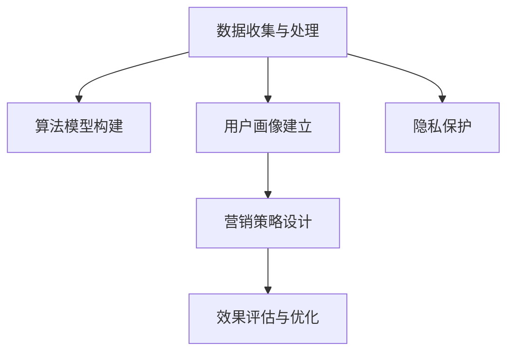

                 

# AI驱动的个性化营销：机遇与风险

## 1. 背景介绍

### 1.1 问题由来
在数字化转型和电商时代的浪潮中，个性化营销已经成为了商界竞争的核心。大数据、AI技术的结合，使商家能够在了解消费者行为、偏好和需求的基础上，定制化推荐产品和服务，提高转化率和用户满意度。然而，个性化营销亦带来了诸多挑战，如数据隐私、用户追踪、算法偏见等问题，如何在这之间取得平衡，成为当今商业界和技术界的热点话题。本文旨在深入探讨AI驱动的个性化营销的机遇与风险，为实践者提供参考。

### 1.2 问题核心关键点
AI驱动的个性化营销，利用机器学习和深度学习算法，对消费者数据进行分析处理，提供定制化的产品推荐和营销策略。其核心关键点包括：

- **数据收集与处理**：收集消费者行为数据、购买历史、浏览记录等，清洗和处理为算法可接受的格式。
- **算法模型构建**：选择合适的算法模型，如协同过滤、推荐系统、深度学习等，构建个性化推荐系统。
- **用户画像建立**：通过对消费者数据进行分析，建立精准的用户画像，了解其兴趣、偏好和需求。
- **营销策略设计**：基于用户画像，设计定制化的营销策略，如邮件营销、社交媒体推广等。
- **效果评估与优化**：通过A/B测试等手段，评估推荐系统的效果，并不断优化算法和策略。

## 2. 核心概念与联系

### 2.1 核心概念概述
为更好地理解AI驱动的个性化营销，本节将介绍几个密切相关的核心概念：

- **个性化推荐系统(Recommendation System)**：利用算法对用户行为数据进行分析，推荐个性化产品或服务，提升用户满意度。
- **协同过滤(Collaborative Filtering)**：一种基于用户历史行为和相似用户偏好的推荐算法，常用于电商和视频平台。
- **深度学习(Deep Learning)**：利用神经网络模型，从大量数据中学习出高层次的特征表示，提升推荐系统的效果。
- **用户画像(User Persona)**：通过数据分析，对用户行为、兴趣、需求等进行画像，形成多维度、多层次的用户特征。
- **效果评估(Metric)**：通过点击率、转化率、用户满意度等指标，评估推荐系统的效果，指导算法优化和策略改进。
- **隐私保护(Privacy)**：在数据收集和处理过程中，保护用户隐私，避免数据滥用。

这些概念之间的逻辑关系可以通过以下Mermaid流程图来展示：



这个流程图展示了个性化营销的核心概念及其之间的关系：

1. 数据收集与处理提供算法模型输入。
2. 算法模型构建分析用户行为，形成个性化推荐。
3. 用户画像建立深入了解用户，设计定制化营销。
4. 营销策略设计实施个性化推广。
5. 效果评估与优化不断提升推荐系统效果。
6. 隐私保护确保数据安全，保护用户隐私。

## 3. 核心算法原理 & 具体操作步骤
### 3.1 算法原理概述
AI驱动的个性化营销算法核心在于通过分析消费者数据，构建用户画像，然后根据画像特征进行产品推荐和策略设计。一般流程包括：

1. **数据收集与预处理**：收集用户行为数据，如浏览记录、购买历史、搜索关键词等，并清洗、处理为机器学习算法可用的格式。
2. **算法模型训练**：选择合适的机器学习算法，如协同过滤、深度学习等，对数据进行训练，构建推荐模型。
3. **用户画像建立**：利用训练好的模型，对用户行为数据进行分析，提取用户特征，形成多维度、多层次的用户画像。
4. **个性化推荐**：根据用户画像，设计个性化推荐算法，向用户推荐可能感兴趣的产品。
5. **效果评估与优化**：通过用户反馈和行为数据，评估推荐效果，不断调整优化推荐模型和策略。

### 3.2 算法步骤详解
以下是AI驱动个性化营销的详细操作步骤：

**Step 1: 数据收集与预处理**
- **用户行为数据**：从电商平台、社交媒体、移动应用等渠道收集用户行为数据，包括浏览记录、购买历史、搜索关键词、评价评论等。
- **数据清洗与处理**：去除无效、噪声数据，填补缺失值，进行数据标准化和归一化处理。
- **数据划分**：将数据分为训练集、验证集和测试集，分别用于模型训练、调参和评估。

**Step 2: 算法模型构建**
- **协同过滤**：通过分析用户行为数据和相似用户行为数据，计算用户之间的相似度，推荐相似用户喜欢的产品。
- **深度学习模型**：使用神经网络模型，如DNN、CNN、RNN等，学习用户特征，生成更精准的推荐。
- **模型选择与训练**：根据业务需求和数据特点，选择适合的算法模型，使用训练集进行模型训练。

**Step 3: 用户画像建立**
- **特征提取**：对用户行为数据进行分析，提取关键特征，如浏览偏好、购买行为、兴趣爱好等。
- **画像融合**：将用户画像与其他外部数据（如社交媒体数据、地理位置数据等）进行融合，形成更全面、更准确的画像。
- **画像更新**：定期更新用户画像，反映用户最新行为和偏好，保持画像的时效性。

**Step 4: 个性化推荐**
- **推荐算法设计**：根据用户画像，设计个性化的推荐算法，如基于内容的推荐、基于协同过滤的推荐等。
- **推荐引擎实现**：将推荐算法转化为推荐引擎，实现对用户实时推荐。
- **推荐结果展示**：将推荐结果展示给用户，如在电商平台展示个性化商品、在社交媒体推送个性化内容等。

**Step 5: 效果评估与优化**
- **评估指标**：使用点击率、转化率、用户满意度等指标，评估推荐系统的效果。
- **A/B测试**：通过对比测试，评估不同推荐策略的效果，选择最佳方案。
- **模型优化**：根据评估结果，不断调整优化算法模型和推荐策略，提升推荐系统效果。

### 3.3 算法优缺点
AI驱动的个性化营销算法具有以下优点：
1. **高精度推荐**：通过深度学习算法，能够从海量数据中学习出复杂的关系，提供更准确的个性化推荐。
2. **实时响应**：推荐系统可以实时根据用户行为和偏好进行更新，提供即时推荐。
3. **提升用户满意度**：个性化的推荐能够更好地满足用户需求，提高用户满意度和忠诚度。

然而，该算法也存在以下局限性：
1. **数据隐私问题**：收集和处理用户数据时，如何保护用户隐私，避免数据滥用，是一个重要问题。
2. **算法偏见**：算法模型可能继承训练数据的偏见，导致推荐结果的不公平性。
3. **过拟合风险**：个性化推荐系统在数据集上表现良好，但在新数据上可能出现过拟合现象。
4. **计算资源需求高**：构建深度学习推荐系统需要大量的计算资源和存储资源，对技术要求较高。
5. **效果评估困难**：个性化推荐效果难以直接量化，需要通过A/B测试等多种手段进行评估。

### 3.4 算法应用领域
AI驱动的个性化营销已经在电商、社交媒体、视频平台等多个领域得到广泛应用，并取得了显著效果：

- **电商推荐**：如淘宝、京东等电商平台，通过个性化推荐提升用户购买转化率，优化用户体验。
- **视频推荐**：如Netflix、YouTube等视频平台，通过个性化推荐提升用户留存率和观看时间，增加平台粘性。
- **社交媒体**：如Facebook、微信等社交平台，通过个性化推荐增加用户活跃度，提高广告效果。
- **个性化广告**：通过分析用户行为数据，推送个性化广告，提升广告点击率和转化率。

此外，个性化推荐还在旅游、金融、医疗等领域得到应用，为这些行业的数字化转型提供了新的思路和工具。

## 4. 数学模型和公式 & 详细讲解
### 4.1 数学模型构建

个性化营销算法涉及多个数学模型，包括协同过滤、深度学习模型等。以下是几个典型模型的数学模型构建：

**协同过滤算法**：
- **用户-物品评分矩阵**：设 $U \in \mathbb{R}^{N \times M}$ 为 $N$ 个用户和 $M$ 个物品的评分矩阵，$u_i$ 为第 $i$ 个用户的评分向量，$i \in [1, N]$。
- **相似度计算**：计算用户 $u_i$ 和 $u_j$ 的相似度 $s_{ij}$，常用的相似度计算方法有皮尔逊相关系数、余弦相似度等。
- **推荐计算**：计算用户 $u_i$ 对物品 $j$ 的推荐评分 $p_{ij}=\sum_{k=1}^M s_{ik}s_{kj}\hat{u}_j$，其中 $\hat{u}_j$ 为物品 $j$ 的潜在评分，可以通过DNN等深度学习模型进行预测。

**深度学习推荐模型**：
- **神经网络结构**：构建DNN或CNN等神经网络模型，输入为用户行为数据，输出为物品评分。
- **损失函数**：使用均方误差损失函数，计算预测评分与实际评分之间的差异。
- **反向传播**：通过反向传播算法，计算损失函数对模型参数的梯度，更新模型权重。

### 4.2 公式推导过程

以协同过滤算法为例，以下是用户 $u_i$ 对物品 $j$ 的推荐评分的公式推导：

设 $U \in \mathbb{R}^{N \times M}$ 为 $N$ 个用户和 $M$ 个物品的评分矩阵，$u_i$ 为第 $i$ 个用户的评分向量，$i \in [1, N]$。设物品 $j$ 的评分向量为 $v_j$，则用户 $u_i$ 对物品 $j$ 的推荐评分 $p_{ij}$ 计算如下：

$$
p_{ij} = \sum_{k=1}^M s_{ik}s_{kj}\hat{u}_j
$$

其中 $s_{ij}$ 为用户 $u_i$ 和用户 $u_j$ 的相似度，常用的相似度计算方法有皮尔逊相关系数和余弦相似度。$\hat{u}_j$ 为物品 $j$ 的潜在评分，可以通过DNN等深度学习模型进行预测。

### 4.3 案例分析与讲解

以下是一个简单的协同过滤算法案例，用于分析推荐系统的推荐效果。

**案例背景**：
某电商平台的推荐系统使用协同过滤算法，已收集到用户的浏览记录和购买历史，每条记录包括物品ID、评分等字段。现在需要构建推荐系统，给用户推荐可能感兴趣的新物品。

**数据准备**：
- **用户-物品评分矩阵**：收集用户对物品的评分数据，构建评分矩阵 $U$。
- **物品评分向量**：根据用户-物品评分矩阵，计算每个物品的评分向量 $v_j$。

**相似度计算**：
- **余弦相似度**：计算用户 $u_i$ 和用户 $u_j$ 的余弦相似度 $s_{ij}=\frac{\mathbf{u}_i\cdot\mathbf{u}_j}{\|\mathbf{u}_i\|\|\mathbf{u}_j\|}$，其中 $\mathbf{u}_i$ 为第 $i$ 个用户的评分向量，$\|\mathbf{u}_i\|$ 为其欧几里得范数。

**推荐评分计算**：
- **物品评分预测**：使用DNN模型预测物品 $j$ 的潜在评分 $\hat{u}_j$。
- **推荐评分计算**：根据用户 $u_i$ 和物品 $j$ 的相似度 $s_{ij}$，计算推荐评分 $p_{ij}$，并根据评分排序，推荐评分最高的物品给用户 $u_i$。

**结果展示**：
- **推荐结果展示**：将推荐物品展示给用户 $u_i$，评估用户点击率和购买转化率，分析推荐效果。

## 5. 项目实践：代码实例和详细解释说明
### 5.1 开发环境搭建

在进行个性化推荐系统开发前，我们需要准备好开发环境。以下是使用Python进行TensorFlow开发的环境配置流程：

1. 安装Anaconda：从官网下载并安装Anaconda，用于创建独立的Python环境。

2. 创建并激活虚拟环境：
```bash
conda create -n tf-env python=3.8 
conda activate tf-env
```

3. 安装TensorFlow：根据CUDA版本，从官网获取对应的安装命令。例如：
```bash
conda install tensorflow -c tf -c conda-forge
```

4. 安装各类工具包：
```bash
pip install numpy pandas scikit-learn matplotlib tqdm jupyter notebook ipython
```

完成上述步骤后，即可在`tf-env`环境中开始开发。

### 5.2 源代码详细实现

以下是使用TensorFlow构建基于协同过滤的个性化推荐系统的代码实现。

```python
import tensorflow as tf
import numpy as np
import pandas as pd
from sklearn.metrics import mean_squared_error

class CollaborativeFiltering:
    def __init__(self, N, M, learning_rate=0.1, epochs=100):
        self.N = N
        self.M = M
        self.learning_rate = learning_rate
        self.epochs = epochs
        
        # 构建用户-物品评分矩阵
        self.U = np.random.randn(N, M)
        self.V = np.random.randn(M)
        
        # 初始化模型参数
        self.W = tf.Variable(tf.zeros((N, M)))
        self.b = tf.Variable(tf.zeros((N, 1)))
        
    def fit(self, X, y):
        # 构建数据集
        self.X = tf.convert_to_tensor(X)
        self.y = tf.convert_to_tensor(y)
        
        # 构建损失函数和优化器
        loss_fn = tf.losses.mean_squared_error(self.y, self.predict(X))
        optimizer = tf.optimizers.SGD(learning_rate=self.learning_rate)
        
        # 训练模型
        for epoch in range(self.epochs):
            optimizer.minimize(loss_fn, var_list=[self.W, self.b])
            print(f'Epoch {epoch+1}/{self.epochs}, loss: {loss_fn.numpy()}')
            
        # 评估模型
        y_pred = self.predict(X)
        rmse = mean_squared_error(y.numpy(), y_pred)
        print(f'RMSE: {rmse:.3f}')
        
    def predict(self, X):
        U_X = tf.matmul(self.U, X)
        W_X = tf.matmul(tf.transpose(self.W), tf.matmul(X, self.V))
        W_X = tf.transpose(W_X)
        U_X = tf.matmul(U_X, W_X)
        return tf.transpose(U_X + self.b)
```

### 5.3 代码解读与分析

让我们再详细解读一下关键代码的实现细节：

**CollaborativeFiltering类**：
- `__init__`方法：初始化协同过滤模型，包括用户-物品评分矩阵、模型参数等。
- `fit`方法：训练模型，使用随机梯度下降优化器更新模型参数，同时计算损失函数。
- `predict`方法：预测用户对物品的评分，通过用户-物品评分矩阵和模型参数计算得到。

**TensorFlow使用**：
- `tf.convert_to_tensor`：将Python数据转换为TensorFlow张量，方便在TensorFlow中进行计算。
- `tf.losses.mean_squared_error`：计算预测评分与实际评分之间的均方误差。
- `tf.optimizers.SGD`：使用随机梯度下降优化器进行模型训练。
- `tf.matmul`：矩阵乘法，用于计算模型预测结果。

**代码执行与分析**：
- 在`fit`方法中，通过循环迭代训练模型，每次更新模型参数，计算损失函数。
- 在`predict`方法中，通过矩阵乘法计算用户对物品的评分预测，使用均方误差评估模型效果。
- 在`fit`和`predict`方法中，分别输出训练损失和模型评估结果，用于监控模型训练过程和效果。

## 6. 实际应用场景
### 6.1 电商推荐系统

电商推荐系统通过个性化推荐，提升用户购买转化率和平台收益。具体应用如下：

**案例背景**：
某电商平台的推荐系统使用协同过滤算法，已收集到用户的浏览记录和购买历史，每条记录包括物品ID、评分等字段。现在需要构建推荐系统，给用户推荐可能感兴趣的新物品。

**数据准备**：
- **用户-物品评分矩阵**：收集用户对物品的评分数据，构建评分矩阵 $U$。
- **物品评分向量**：根据用户-物品评分矩阵，计算每个物品的评分向量 $v_j$。

**算法模型训练**：
- **协同过滤算法**：使用协同过滤算法，计算用户和物品的相似度，预测用户对新物品的评分。
- **深度学习推荐模型**：使用DNN模型，学习物品的潜在评分，提高推荐精度。

**推荐结果展示**：
- **推荐结果展示**：将推荐物品展示给用户，评估用户点击率和购买转化率，分析推荐效果。

**效果评估**：
- **点击率和转化率**：统计推荐系统中用户对推荐物品的点击率和购买转化率，评估推荐系统效果。
- **A/B测试**：通过A/B测试，对比不同推荐策略的效果，选择最佳方案。
- **用户满意度调查**：收集用户反馈，评估推荐系统的用户满意度。

## 7. 工具和资源推荐
### 7.1 学习资源推荐

为了帮助开发者系统掌握个性化推荐系统的理论基础和实践技巧，这里推荐一些优质的学习资源：

1. 《推荐系统：构建个性化推荐引擎》书籍：介绍推荐系统基础理论、常见算法和应用实践，适合初学者入门。
2. Coursera《推荐系统》课程：由斯坦福大学开设的推荐系统课程，涵盖推荐系统理论、算法和实践，适合深入学习。
3. Kaggle推荐系统竞赛：参加Kaggle举办的推荐系统竞赛，实战练习推荐算法，提升技能水平。
4. Arxiv推荐系统论文：阅读最新推荐系统研究成果，掌握前沿技术和趋势。
5. GitHub推荐系统代码库：学习和分享推荐系统代码，了解算法实现细节。

通过对这些资源的学习实践，相信你一定能够快速掌握个性化推荐系统的精髓，并用于解决实际的推荐问题。

### 7.2 开发工具推荐

高效的开发离不开优秀的工具支持。以下是几款用于个性化推荐系统开发的常用工具：

1. TensorFlow：基于Python的开源深度学习框架，生产部署方便，适合大规模工程应用。
2. PyTorch：灵活的深度学习框架，适合快速迭代研究。
3. Jupyter Notebook：开源交互式笔记本，方便进行数据处理、模型训练和结果展示。
4. Apache Spark：分布式计算框架，适合处理大规模数据集，提升推荐系统性能。
5. Hadoop：大数据处理框架，适合处理海量数据，提升推荐系统扩展性。

合理利用这些工具，可以显著提升个性化推荐系统的开发效率，加快创新迭代的步伐。

### 7.3 相关论文推荐

个性化推荐系统的发展源于学界的持续研究。以下是几篇奠基性的相关论文，推荐阅读：

1. "Collaborative Filtering for Implicit Feedback Datasets"：介绍协同过滤算法的基础理论和技术细节。
2. "Deep Collaborative Filtering"：提出深度学习协同过滤方法，提高推荐系统精度。
3. "Factorization Machines"：介绍因子化机算法，用于提升推荐系统效果。
4. "Neural Factorization Machines"：提出神经网络因子化机算法，进一步提升推荐系统精度。
5. "Attention is All You Need"：提出Transformer模型，拓展推荐系统应用场景。

这些论文代表了个性化推荐系统的发展脉络。通过学习这些前沿成果，可以帮助研究者把握学科前进方向，激发更多的创新灵感。

## 8. 总结：未来发展趋势与挑战
### 8.1 总结

本文对AI驱动的个性化营销方法进行了全面系统的介绍。首先阐述了个性化推荐系统在电商、视频、社交媒体等领域的应用价值，明确了其高精度推荐、实时响应等独特优势。其次，从原理到实践，详细讲解了协同过滤、深度学习等核心算法，给出了个性化推荐系统的完整代码实现。同时，本文还探讨了个性化推荐系统面临的数据隐私、算法偏见等风险，提出了一些解决方案，以期为实践者提供参考。

通过本文的系统梳理，可以看到，AI驱动的个性化营销已经成为商界和技术界的重要趋势，带来了显著的商业价值。未来，随着数据采集、处理和算法的不断进步，个性化推荐系统必将进一步优化，为更多行业带来数字化转型的新机遇。

### 8.2 未来发展趋势

展望未来，个性化推荐系统将呈现以下几个发展趋势：

1. **深度学习与协同过滤结合**：深度学习算法和协同过滤算法将进一步融合，提升推荐系统效果和速度。
2. **实时推荐系统**：通过实时数据流处理技术，实现即时推荐，提高用户体验。
3. **跨领域推荐**：个性化推荐系统将拓展到更多领域，如金融、医疗、旅游等，提升跨领域推荐效果。
4. **多模态推荐**：结合视觉、语音等多模态数据，提升推荐系统效果。
5. **主动推荐**：通过主动学习技术，智能发现用户需求，提供主动推荐服务。
6. **可解释性增强**：提升推荐系统的可解释性，让用户理解推荐逻辑，增强信任感。

这些趋势凸显了个性化推荐系统的广阔前景。这些方向的探索发展，必将进一步提升推荐系统的效果和应用范围，为人类生活带来更多便利和价值。

### 8.3 面临的挑战

尽管个性化推荐系统已经取得了显著进展，但在推广应用的过程中，仍面临诸多挑战：

1. **数据隐私问题**：如何保护用户隐私，避免数据滥用，是一个重要问题。
2. **算法偏见**：算法模型可能继承训练数据的偏见，导致推荐结果的不公平性。
3. **过拟合风险**：个性化推荐系统在数据集上表现良好，但在新数据上可能出现过拟合现象。
4. **计算资源需求高**：构建深度学习推荐系统需要大量的计算资源和存储资源，对技术要求较高。
5. **效果评估困难**：个性化推荐效果难以直接量化，需要通过A/B测试等多种手段进行评估。

### 8.4 研究展望

面对个性化推荐系统面临的挑战，未来的研究需要在以下几个方面寻求新的突破：

1. **数据隐私保护**：开发新的隐私保护算法，如差分隐私、联邦学习等，保护用户隐私。
2. **算法公平性**：引入公平性约束，避免推荐结果的偏见，提升系统公平性。
3. **模型鲁棒性**：研究鲁棒推荐算法，提升系统在面对新数据时的泛化能力。
4. **实时推荐系统**：研究实时数据处理和流计算技术，实现即时推荐。
5. **跨领域推荐**：探索跨领域推荐方法，提升跨领域推荐效果。
6. **多模态推荐**：结合多模态数据，提升推荐系统效果。
7. **主动推荐**：开发主动推荐算法，提升系统智能性。
8. **可解释性**：提升推荐系统的可解释性，增强用户信任感。

这些研究方向的探索，必将引领个性化推荐系统技术迈向新的高度，为数字化转型和智能化服务提供有力支持。面向未来，个性化推荐系统还需要与其他人工智能技术进行更深入的融合，如知识表示、因果推理、强化学习等，多路径协同发力，共同推动推荐系统的发展。只有勇于创新、敢于突破，才能不断拓展推荐系统的边界，让智能技术更好地服务于人类社会。

## 9. 附录：常见问题与解答

**Q1：个性化推荐系统的数据隐私问题如何解决？**

A: 个性化推荐系统的数据隐私问题可以通过以下几种方式解决：
1. **数据匿名化**：将用户数据进行匿名化处理，去除个人信息标识符，保护用户隐私。
2. **差分隐私**：使用差分隐私技术，在保证推荐效果的前提下，最小化数据泄露风险。
3. **联邦学习**：采用联邦学习技术，在本地设备上进行数据训练，不将原始数据上传至服务器。
4. **用户选择权**：允许用户选择是否参与个性化推荐，提升用户信任度。

**Q2：个性化推荐系统如何避免算法偏见？**

A: 个性化推荐系统可以通过以下几种方式避免算法偏见：
1. **数据清洗**：清洗训练数据，去除含有偏见的数据，避免引入系统性偏见。
2. **模型公平性约束**：在模型训练中加入公平性约束，避免推荐结果的偏见。
3. **多样化数据**：使用多样化的训练数据，避免算法偏向特定群体。
4. **定期监控**：定期监控推荐系统，发现并纠正偏见。

**Q3：个性化推荐系统的推荐效果如何评估？**

A: 个性化推荐系统的推荐效果可以通过以下几种方式进行评估：
1. **点击率**：统计用户对推荐物品的点击次数，评估用户对推荐结果的兴趣。
2. **转化率**：统计用户对推荐物品的购买次数，评估推荐系统对用户购买行为的影响。
3. **A/B测试**：通过A/B测试，对比不同推荐策略的效果，选择最佳方案。
4. **用户满意度调查**：收集用户反馈，评估推荐系统的用户满意度。

**Q4：个性化推荐系统如何提高实时响应能力？**

A: 个性化推荐系统可以通过以下几种方式提高实时响应能力：
1. **流数据处理**：使用流数据处理技术，实时更新用户行为数据，提升推荐系统的响应速度。
2. **分布式计算**：使用分布式计算框架，提高推荐系统的大规模数据处理能力。
3. **缓存技术**：使用缓存技术，减少重复计算，提高推荐系统的响应速度。
4. **异步算法**：使用异步算法，提高推荐系统的并发处理能力。

**Q5：个性化推荐系统的开发环境如何选择？**

A: 个性化推荐系统的开发环境可以根据项目需求和技术人员技能选择：
1. **Python环境**：使用Python语言进行开发，方便快速迭代研究，适合初学者。
2. **Java环境**：使用Java语言进行开发，适合大型工程应用，具有良好的跨平台支持。
3. **R语言环境**：使用R语言进行开发，适合统计分析任务，易于数据处理。
4. **Spark环境**：使用Apache Spark进行开发，适合大规模数据处理，提升推荐系统性能。
5. **Hadoop环境**：使用Hadoop进行开发，适合大数据处理，提升推荐系统扩展性。

合理选择开发环境，能够显著提升个性化推荐系统的开发效率，加快创新迭代的步伐。

