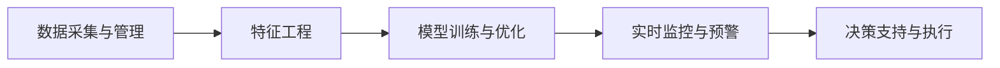

                 

# AI驱动的企业风险评估模型

> 关键词：AI驱动, 企业风险评估, 机器学习, 数据挖掘, 金融风控, 企业决策支持

## 1. 背景介绍

### 1.1 问题由来

在当今快速变化的市场环境中，企业面临的风险也越来越多样化和复杂化。从金融风险、运营风险到市场风险、政策风险，每一个风险都可能对企业的盈利能力和生存产生重大影响。如何全面、准确地评估和预测这些风险，成为企业决策过程中至关重要的环节。传统的风险评估依赖人工经验、定性分析，缺乏量化依据，难以适应快速变化的市场需求。

为此，企业开始引入AI技术，借助大数据分析和机器学习算法，构建AI驱动的风险评估模型，以期提升风险识别的准确性和决策支持的及时性。这些模型利用先进的数据挖掘技术，从海量历史数据中提取有价值的信息，建立风险评估指标，并不断更新模型以适应用户需求。

### 1.2 问题核心关键点

AI驱动的企业风险评估模型主要关注以下几个核心关键点：

1. **数据采集与管理**：收集和整合企业的内部和外部数据，包括财务报表、市场数据、政策法规、社交媒体等，确保数据质量、完整性和实时性。
2. **特征工程**：从采集的数据中提取、构建和筛选特征，构建能够描述企业风险状态和行为模式的指标。
3. **模型训练与优化**：利用机器学习算法训练风险评估模型，优化模型参数以提升预测准确性和泛化能力。
4. **实时监控与预警**：建立实时的监控系统，对企业运营数据进行持续监测，一旦风险指标触发阈值，自动发出预警。
5. **决策支持与执行**：将风险评估结果转化为决策建议，辅助企业进行风险管理，执行风险缓解措施。

### 1.3 问题研究意义

AI驱动的企业风险评估模型对于提升企业风险管理水平具有重要意义：

1. **提升风险识别能力**：借助大数据和机器学习技术，能够快速识别潜在风险，提高风险管理的时效性和准确性。
2. **优化决策支持过程**：模型能够提供基于数据的决策建议，辅助企业管理层制定更为科学的风险管理策略。
3. **降低风险成本**：通过预测和防范风险，减少因风险事件导致的经济损失和声誉损失。
4. **增强企业竞争力**：风险管理能力的提升，有助于企业更好地应对市场变化，保持竞争力。
5. **促进企业智能化转型**：引入AI技术，推动企业从传统业务流程向智能化转型，提升整体运营效率。

## 2. 核心概念与联系

### 2.1 核心概念概述

为了更深入地理解AI驱动的企业风险评估模型，我们需要梳理一些关键的概念和其间的联系：

- **AI驱动（AI-Driven）**：指通过人工智能技术，特别是机器学习和深度学习算法，来驱动企业决策过程，提高决策的准确性和效率。
- **企业风险评估（Enterprise Risk Assessment）**：指通过对企业的内部和外部数据进行分析，评估企业面临的各种风险，制定风险管理策略的过程。
- **机器学习（Machine Learning）**：利用数据训练算法模型，使模型能够从数据中自动学习和改进，用于预测和决策支持。
- **数据挖掘（Data Mining）**：从海量数据中提取有价值的信息和知识，用于支持决策制定和业务优化。
- **金融风控（Financial Risk Control）**：针对金融市场和企业财务数据的风险评估，用于预测金融风险、防范金融欺诈。
- **企业决策支持（Enterprise Decision Support）**：通过数据分析和算法模型，提供辅助决策的信息和建议，提升企业决策的科学性和合理性。

这些概念通过数据流和算法流紧密相连，构成了一个完整的企业风险评估系统。数据采集、清洗、特征工程，以及机器学习模型的训练和应用，共同支撑了企业风险评估的自动化和智能化。

### 2.2 核心概念原理和架构的 Mermaid 流程图



## 3. 核心算法原理 & 具体操作步骤

### 3.1 算法原理概述

AI驱动的企业风险评估模型主要利用机器学习和数据挖掘技术，通过以下步骤实现风险评估：

1. **数据采集与管理**：收集和整合企业的内部和外部数据，包括财务报表、市场数据、政策法规、社交媒体等，确保数据质量、完整性和实时性。
2. **特征工程**：从采集的数据中提取、构建和筛选特征，构建能够描述企业风险状态和行为模式的指标。
3. **模型训练与优化**：利用机器学习算法训练风险评估模型，优化模型参数以提升预测准确性和泛化能力。
4. **实时监控与预警**：建立实时的监控系统，对企业运营数据进行持续监测，一旦风险指标触发阈值，自动发出预警。
5. **决策支持与执行**：将风险评估结果转化为决策建议，辅助企业进行风险管理，执行风险缓解措施。

### 3.2 算法步骤详解

#### 3.2.1 数据采集与管理

数据采集与管理是企业风险评估的基础，需要确保数据的全面性、准确性和实时性。以下是具体步骤：

1. **数据源选择**：根据评估目的，选择适合的内部和外部数据源，包括财务报表、市场数据、政策法规、社交媒体等。
2. **数据采集**：使用ETL工具（如Apache Nifi、Airflow等）自动采集数据，确保数据的及时更新。
3. **数据清洗**：对采集到的数据进行去重、缺失值填充、异常值处理等操作，保证数据的质量。
4. **数据存储**：将清洗后的数据存储到数据库或数据仓库中，便于后续分析和使用。

#### 3.2.2 特征工程

特征工程是构建AI模型的关键步骤，通过数据挖掘和预处理，提取有意义的特征，以供模型训练。以下是具体步骤：

1. **特征提取**：从原始数据中提取有用的特征，如财务指标、市场趋势、政策影响等。
2. **特征构建**：构建新的特征，如风险指数、趋势线等，用于描述企业风险状态和行为模式。
3. **特征选择**：通过统计和算法方法选择最优的特征子集，减少冗余和噪声。
4. **特征编码**：将特征转换为模型所需的数值型或类别型数据格式，如one-hot编码、独热编码等。

#### 3.2.3 模型训练与优化

模型训练与优化是AI驱动的风险评估模型的核心，通过机器学习算法训练和优化模型，提升预测准确性和泛化能力。以下是具体步骤：

1. **模型选择**：选择合适的机器学习算法，如随机森林、XGBoost、支持向量机等，根据数据特点和评估目标选择。
2. **模型训练**：利用历史数据对模型进行训练，调整模型参数以优化性能。
3. **模型评估**：使用验证集或测试集对模型进行评估，选择合适的评价指标，如准确率、召回率、F1-score等。
4. **模型优化**：通过交叉验证、超参数调优等方法提升模型性能，避免过拟合和欠拟合。

#### 3.2.4 实时监控与预警

实时监控与预警系统是风险评估模型的重要应用，通过持续监测企业运营数据，自动发出预警。以下是具体步骤：

1. **监控指标定义**：根据风险评估目标，定义关键的监控指标，如财务指标、市场波动、政策变化等。
2. **数据流处理**：使用流处理框架（如Apache Kafka、Apache Flink等）实时处理企业运营数据。
3. **预警触发**：根据预设的预警阈值，一旦监控指标超出阈值，自动触发预警机制。
4. **预警输出**：将预警信息通过邮件、短信等方式发送给相关人员，确保及时处理风险事件。

#### 3.2.5 决策支持与执行

决策支持与执行是将风险评估结果转化为决策建议的过程，辅助企业进行风险管理。以下是具体步骤：

1. **风险评估**：通过模型对企业运营数据进行实时分析，评估当前风险状态。
2. **风险分类**：将评估结果分类为低、中、高风险，并标明具体的风险类型。
3. **决策建议**：根据风险分类结果，提供相应的决策建议，如风险规避、风险转移、风险控制等。
4. **执行措施**：将决策建议转化为具体的风险管理措施，执行相应的操作。

### 3.3 算法优缺点

AI驱动的企业风险评估模型具有以下优点：

1. **自动化和高效性**：通过自动化数据采集、处理和模型训练，大大提升了风险评估的效率和准确性。
2. **全面性和多维度**：利用大数据和多种算法，从多维度分析企业风险，提供全面的风险评估。
3. **动态更新和自适应**：模型能够根据数据的变化进行动态更新，适应企业运营的实时变化。
4. **决策支持**：提供基于数据的决策建议，辅助企业管理层制定科学的风险管理策略。

同时，模型也存在以下缺点：

1. **数据依赖性**：模型的性能高度依赖于数据的质量和完整性，数据偏差可能导致模型输出偏差。
2. **算法复杂性**：机器学习和数据挖掘算法较为复杂，需要专业的知识和技能支持。
3. **模型解释性**：部分机器学习模型（如深度学习）的决策过程较难解释，影响模型的可信度和应用范围。
4. **成本高**：数据采集、存储和处理需要大量资源，模型训练和部署也需要较高的计算资源。
5. **安全性和隐私**：企业运营数据可能包含敏感信息，数据泄露和隐私保护问题需要特别注意。

### 3.4 算法应用领域

AI驱动的企业风险评估模型在多个领域具有广泛应用，例如：

1. **金融风控**：利用金融市场和财务数据，预测和防范金融风险，如信用风险、市场风险、操作风险等。
2. **企业运营管理**：通过运营数据监控，识别运营风险，提供优化建议，提升企业运营效率。
3. **市场分析**：分析市场趋势和政策变化，预测市场风险，辅助企业制定市场策略。
4. **供应链管理**：监测供应链风险，预测供应链中断，提供应对策略，保障供应链稳定。
5. **法律合规**：监测政策法规变化，评估法律风险，提供合规建议，保障企业法律安全。

以上领域只是冰山一角，随着企业智能化转型的深入，AI驱动的风险评估模型将在更多领域发挥重要作用。

## 4. 数学模型和公式 & 详细讲解 & 举例说明

### 4.1 数学模型构建

AI驱动的企业风险评估模型可以建模为一个监督学习问题，其中输入为企业的运营数据特征，输出为风险评估结果。以下是具体的数学模型构建：

设企业运营数据特征为 $X=\{x_1,x_2,...,x_n\}$，风险评估结果为 $Y=\{y_1,y_2,...,y_m\}$。其中 $x_i$ 为第 $i$ 个特征，$y_j$ 为第 $j$ 个风险评估结果。

模型的目标是最小化预测误差，即：

$$
\min_{\theta} \sum_{i=1}^n \sum_{j=1}^m L(y_j, \hat{y}_j)
$$

其中 $L(y_j, \hat{y}_j)$ 为损失函数，$\hat{y}_j$ 为模型对第 $j$ 个风险评估结果的预测。

常见的损失函数包括均方误差损失（Mean Squared Error, MSE）和交叉熵损失（Cross-Entropy Loss）。对于分类问题，使用交叉熵损失：

$$
L(y_j, \hat{y}_j) = -y_j \log \hat{y}_j - (1-y_j) \log (1-\hat{y}_j)
$$

### 4.2 公式推导过程

以交叉熵损失为例，对模型进行推导：

设模型输出为 $\hat{y}_j = P(y_j|x_i; \theta)$，其中 $P(y_j|x_i; \theta)$ 为模型在特征 $x_i$ 下预测 $y_j$ 的概率。

根据交叉熵损失定义，有：

$$
L(y_j, \hat{y}_j) = -y_j \log \hat{y}_j - (1-y_j) \log (1-\hat{y}_j)
$$

对 $L(y_j, \hat{y}_j)$ 求导，得到梯度：

$$
\frac{\partial L(y_j, \hat{y}_j)}{\partial \theta} = -(y_j - \hat{y}_j)
$$

将梯度代入优化算法（如梯度下降），更新模型参数：

$$
\theta \leftarrow \theta - \eta \frac{\partial L(y_j, \hat{y}_j)}{\partial \theta}
$$

其中 $\eta$ 为学习率。

### 4.3 案例分析与讲解

以下以金融风控为例，分析AI驱动的风险评估模型的应用：

假设企业需要评估信用风险，已有的数据集包括客户的历史信用记录、收入水平、职业、负债情况等。通过特征工程，提取关键特征，如收入、负债比例、信用记录等。使用随机森林算法训练模型，得到风险评估结果。

模型训练过程中，选择合适的损失函数和优化算法，如交叉熵损失和随机梯度下降，不断调整模型参数以优化性能。训练完成后，使用验证集对模型进行评估，确保模型的泛化能力。

一旦新客户提交申请，系统通过实时数据流处理，输入客户信息到模型中，得到风险评估结果。根据风险分类，采取相应的措施，如拒绝申请、增加抵押、调整利率等。

## 5. 项目实践：代码实例和详细解释说明

### 5.1 开发环境搭建

在进行AI驱动的企业风险评估模型开发前，需要先搭建好开发环境。以下是Python开发环境的具体配置流程：

1. **安装Python和pip**：从官网下载Python 3.x版本，安装pip包管理工具。
2. **安装必要的Python包**：使用pip安装numpy、pandas、scikit-learn、matplotlib等常用库。
3. **配置虚拟环境**：使用venv命令创建虚拟环境，并在虚拟环境中安装所需的库。
4. **数据预处理**：使用pandas和numpy进行数据清洗、处理和预处理，构建特征集合。
5. **模型训练**：使用scikit-learn进行模型训练和优化，确保模型性能。
6. **实时监控与预警**：使用Apache Kafka和Apache Flink进行数据流处理，实时监控企业运营数据。
7. **决策支持与执行**：将模型部署到生产环境中，使用Flask或FastAPI搭建API服务，提供决策支持。

完成以上步骤后，即可在虚拟环境中进行模型开发和测试。

### 5.2 源代码详细实现

以下以Python为例，给出AI驱动的企业风险评估模型的源代码实现：

```python
import numpy as np
from sklearn.ensemble import RandomForestClassifier
from sklearn.model_selection import train_test_split
from sklearn.metrics import accuracy_score

# 数据加载和预处理
data = pd.read_csv('risk_data.csv')
X = data.drop('y', axis=1)
y = data['y']
X_train, X_test, y_train, y_test = train_test_split(X, y, test_size=0.2, random_state=42)

# 特征工程
# 提取关键特征，如收入、负债比例、信用记录等

# 模型训练与优化
model = RandomForestClassifier(n_estimators=100, max_depth=5, random_state=42)
model.fit(X_train, y_train)

# 模型评估
y_pred = model.predict(X_test)
accuracy = accuracy_score(y_test, y_pred)
print('Accuracy:', accuracy)

# 实时监控与预警
# 使用Apache Kafka和Apache Flink进行数据流处理，实时监控企业运营数据
# 一旦监控指标超出阈值，自动触发预警机制，发送预警信息

# 决策支持与执行
# 将模型部署到生产环境中，使用Flask或FastAPI搭建API服务，提供决策支持
```

### 5.3 代码解读与分析

以上代码实现了一个简单的AI驱动的企业风险评估模型。以下是关键代码的解读与分析：

1. **数据加载和预处理**：使用pandas读取CSV格式的数据文件，使用train_test_split进行数据划分，确保训练集和测试集的质量和独立性。
2. **特征工程**：使用pandas和numpy进行数据清洗和特征提取，构建可用于模型的特征集合。
3. **模型训练与优化**：使用scikit-learn的RandomForestClassifier进行模型训练，通过交叉验证和超参数调优提升模型性能。
4. **模型评估**：使用accuracy_score计算模型在测试集上的准确率，评估模型性能。
5. **实时监控与预警**：使用Apache Kafka和Apache Flink进行数据流处理，实时监控企业运营数据，一旦监控指标超出阈值，自动触发预警机制。
6. **决策支持与执行**：将模型部署到生产环境中，使用Flask或FastAPI搭建API服务，提供决策支持。

## 6. 实际应用场景

### 6.1 智能风控平台

智能风控平台是AI驱动的企业风险评估模型的典型应用场景之一。智能风控平台通过实时监控企业运营数据，自动评估客户信用风险，辅助风控人员进行决策。具体应用包括：

1. **客户信用评估**：对新客户提交的申请进行实时评估，判断是否批准贷款或信用卡。
2. **客户行为监控**：实时监控客户的支付行为，识别异常交易，及时预警和处理。
3. **风险预警与处理**：一旦监控指标触发阈值，自动发送预警信息，并制定相应的风险处理策略。

### 6.2 运营风险监控系统

运营风险监控系统通过实时监控企业内部和外部数据，评估运营风险，提供优化建议，提升企业运营效率。具体应用包括：

1. **生产流程监控**：实时监控生产流程中的关键指标，识别潜在风险，提供优化建议。
2. **供应链风险管理**：监控供应链中的关键节点，识别供应链中断风险，制定应对策略。
3. **市场风险预警**：实时监控市场变化，识别市场波动，提供风险预警和应对建议。

### 6.3 法律合规系统

法律合规系统通过实时监控政策法规变化，评估法律风险，提供合规建议，保障企业法律安全。具体应用包括：

1. **政策法规监控**：实时监控政策法规变化，评估企业法律风险，提供合规建议。
2. **法律风险评估**：根据政策法规变化，评估企业法律风险，制定应对策略。
3. **法律风险预警**：一旦法律风险触发，自动发送预警信息，并制定相应的应对措施。

### 6.4 未来应用展望

未来，AI驱动的企业风险评估模型将在更多领域得到应用，为企业的智能化转型提供坚实支持。以下是一些未来应用展望：

1. **智能投顾**：利用AI技术进行市场分析和风险评估，提供个性化投资建议。
2. **智能合同**：利用AI技术自动审核合同条款，识别潜在风险，提供优化建议。
3. **智能客服**：利用AI技术进行客户行为分析，识别潜在风险，提供风险预警和应对建议。
4. **智能舆情分析**：利用AI技术进行舆情监测和分析，识别潜在风险，提供风险预警和应对建议。
5. **智能供应链管理**：利用AI技术进行供应链风险评估和监控，提供优化建议，保障供应链稳定。

随着AI技术的不断进步和数据量的不断增加，AI驱动的企业风险评估模型将在更多领域得到应用，为企业决策提供更科学、更可靠的数据支持。

## 7. 工具和资源推荐

### 7.1 学习资源推荐

为了帮助开发者深入掌握AI驱动的企业风险评估模型，以下是一些优质的学习资源：

1. **《Python数据科学手册》**：详细介绍了Python数据处理和分析的各个方面，适合初学者和进阶者。
2. **Coursera《机器学习》课程**：由斯坦福大学教授Andrew Ng开设，深入浅出地讲解了机器学习的基本原理和算法。
3. **Kaggle竞赛**：参加Kaggle竞赛，实战练习，提升数据分析和模型训练能力。
4. **GitHub开源项目**：GitHub上有许多开源的风险评估项目，可以学习和借鉴。
5. **Scikit-learn官方文档**：详细介绍了scikit-learn库的使用方法和算法实现。

### 7.2 开发工具推荐

以下是几款用于AI驱动的企业风险评估模型开发的常用工具：

1. **Python**：Python是数据科学和机器学习的主流语言，易于学习和使用，拥有丰富的库和工具。
2. **Apache Spark**：Spark是一个分布式计算框架，适合大规模数据处理和分析。
3. **Apache Kafka**：Kafka是一个分布式流处理平台，适合实时数据流处理和监控。
4. **Apache Flink**：Flink是一个分布式流处理框架，适合实时数据流处理和监控。
5. **Flask**：Flask是一个轻量级的Web框架，适合搭建API服务。
6. **FastAPI**：FastAPI是一个高性能的Web框架，适合构建高性能API服务。

### 7.3 相关论文推荐

以下是几篇奠基性的相关论文，推荐阅读：

1. **《企业风险管理中的AI应用》**：探讨了AI技术在企业风险管理中的应用，包括信用风险、市场风险、运营风险等。
2. **《基于机器学习的金融风险评估模型》**：介绍了使用机器学习算法进行金融风险评估的方法和案例。
3. **《智能风控平台设计》**：详细介绍了智能风控平台的设计和实现，包括数据采集、模型训练、实时监控与预警等。
4. **《智能运营风险监控系统》**：介绍了利用AI技术进行企业运营风险监控的方法和系统架构。
5. **《智能合同自动化》**：探讨了利用AI技术进行智能合同自动审核和风险评估的方法。

这些论文代表了大规模数据驱动的风险评估技术的发展脉络，通过学习这些前沿成果，可以帮助研究者把握学科前进方向，激发更多的创新灵感。

## 8. 总结：未来发展趋势与挑战

### 8.1 研究成果总结

AI驱动的企业风险评估模型已经在多个领域展示了其巨大的潜力和应用价值。通过机器学习和数据挖掘技术，能够全面、准确地评估企业风险，提供决策支持，优化企业运营。未来，随着AI技术的不断进步和数据量的不断增加，AI驱动的风险评估模型将在更多领域得到应用，为企业的智能化转型提供坚实支持。

### 8.2 未来发展趋势

未来，AI驱动的企业风险评估模型将呈现以下几个发展趋势：

1. **多模态数据融合**：结合文本、图像、视频等多种数据源，构建更全面的风险评估模型。
2. **深度学习与强化学习结合**：利用深度学习和强化学习技术，构建更智能的风险评估模型。
3. **实时动态更新**：模型能够根据数据的变化进行动态更新，适应企业运营的实时变化。
4. **联邦学习与隐私保护**：利用联邦学习技术，保护数据隐私，提高模型安全性和可靠性。
5. **多领域协同应用**：将AI驱动的风险评估模型应用于金融、运营、法律等多个领域，实现跨领域协同应用。
6. **自动化决策支持**：利用AI技术，自动化生成决策建议，提升决策效率和准确性。

### 8.3 面临的挑战

尽管AI驱动的企业风险评估模型已经取得了一定进展，但在迈向更加智能化、普适化应用的过程中，仍面临诸多挑战：

1. **数据质量与完整性**：数据采集和清洗过程可能存在偏差和噪声，影响模型性能。
2. **模型复杂性与可解释性**：部分机器学习模型（如深度学习）的决策过程较难解释，影响模型的可信度和应用范围。
3. **计算资源与存储成本**：大规模数据处理和模型训练需要较高的计算资源和存储成本。
4. **隐私与安全**：企业运营数据可能包含敏感信息，数据泄露和隐私保护问题需要特别注意。
5. **跨领域应用挑战**：不同领域的风险评估需要结合不同领域的专业知识，模型设计和应用具有一定的复杂性。

### 8.4 研究展望

为了克服上述挑战，未来的研究需要在以下几个方面寻求新的突破：

1. **数据预处理与清洗**：提升数据采集和清洗的自动化水平，确保数据质量。
2. **模型解释性与可信度**：研究模型的可解释性和可信度，提升模型在实际应用中的可信度。
3. **计算资源优化**：研究高效的计算和存储优化技术，降低模型开发和部署成本。
4. **隐私保护与数据安全**：研究数据隐私保护技术，确保数据安全和合规性。
5. **跨领域知识整合**：将跨领域知识与AI技术结合，提升模型的泛化能力和应用范围。

总之，AI驱动的企业风险评估模型需要在数据质量、模型性能、计算效率和隐私保护等方面不断优化，才能更好地服务于企业的智能化转型。相信随着技术的不断进步和应用的深入，AI驱动的风险评估模型必将在更多领域得到广泛应用，为企业决策提供更科学、更可靠的数据支持。

## 9. 附录：常见问题与解答

**Q1：AI驱动的企业风险评估模型是否适用于所有类型的企业？**

A: AI驱动的企业风险评估模型可以应用于大多数类型的企业，包括金融机构、制造业、服务业等。但其效果和应用范围取决于企业的运营特点和数据质量。对于数据量较小、数据质量较低的企业，模型效果可能不佳，需要进行适当的数据预处理和模型优化。

**Q2：如何选择适合的机器学习算法进行风险评估？**

A: 选择适合的机器学习算法需根据数据特点和评估目标进行选择。通常情况下，可以使用以下算法进行风险评估：

1. **决策树（Decision Tree）**：适用于处理分类和回归问题，易于解释，适合小型数据集。
2. **随机森林（Random Forest）**：适用于处理分类和回归问题，具有较高的准确率和泛化能力，适合中等大小的数据集。
3. **支持向量机（Support Vector Machine, SVM）**：适用于处理分类问题，具有较高的准确率和泛化能力，适合大型数据集。
4. **神经网络（Neural Network）**：适用于处理复杂的分类和回归问题，具有较高的准确率和泛化能力，适合大型数据集。

**Q3：如何在模型训练中避免过拟合？**

A: 过拟合是模型训练中常见的问题，可以通过以下方法避免：

1. **数据增强**：通过数据扩充、数据增强等技术，增加训练数据的多样性，避免模型过拟合。
2. **正则化技术**：使用L1、L2正则化、Dropout等技术，限制模型复杂度，防止过拟合。
3. **早停（Early Stopping）**：在模型训练过程中，一旦验证集误差不再下降，立即停止训练，避免过拟合。
4. **模型简化**：适当简化模型结构，减少参数数量，提高模型的泛化能力。

**Q4：如何评估AI驱动的风险评估模型的性能？**

A: 评估AI驱动的风险评估模型的性能通常使用以下指标：

1. **准确率（Accuracy）**：模型预测正确的样本比例。
2. **召回率（Recall）**：真实正样本被正确预测的比例。
3. **F1-score**：综合准确率和召回率的指标，平衡二者之间的取舍。
4. **ROC曲线与AUC**：通过绘制ROC曲线，评估模型的分类性能，AUC表示曲线下的面积，值越大表示模型性能越好。
5. **混淆矩阵（Confusion Matrix）**：通过混淆矩阵，分析模型的预测结果和实际结果，评估模型的分类性能。

**Q5：在实际应用中，如何保护数据隐私？**

A: 保护数据隐私通常使用以下方法：

1. **数据脱敏（Data Masking）**：在数据处理过程中，对敏感信息进行脱敏处理，避免泄露。
2. **加密技术（Encryption）**：对数据进行加密处理，保护数据安全。
3. **联邦学习（Federated Learning）**：通过分布式训练技术，保护数据隐私，避免数据泄露。
4. **差分隐私（Differential Privacy）**：在数据处理过程中，引入噪声，保护用户隐私。

通过以上措施，可以有效保护数据隐私，确保数据安全。

---

作者：禅与计算机程序设计艺术 / Zen and the Art of Computer Programming

