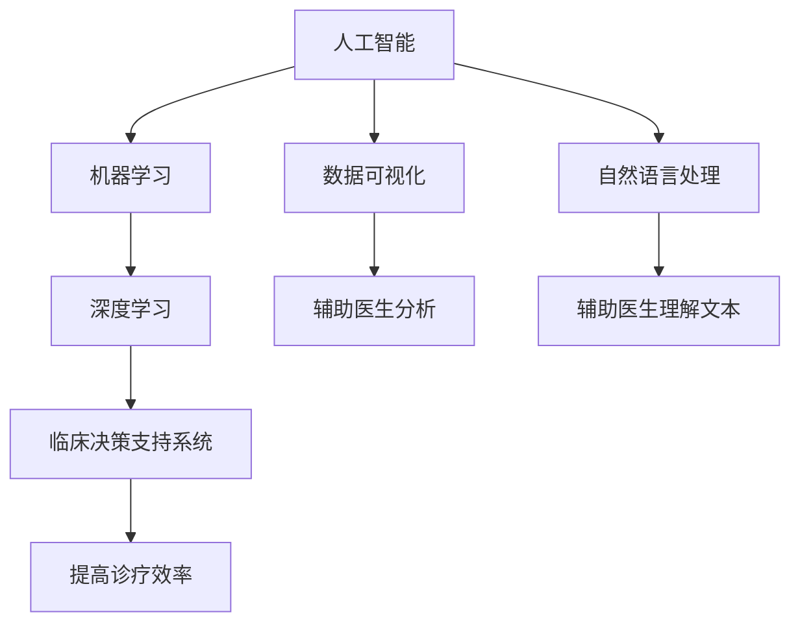

                 

# AI驱动的创新：人类计算在医疗行业的创新应用

> 关键词：人工智能, 医疗, 计算, 创新, 应用, 前沿技术, 数据分析, 机器学习, 深度学习, 临床决策支持

## 1. 背景介绍

### 1.1 问题由来
医疗行业作为人类生存和发展的重要基础，近年来面临着越来越多的挑战。随着人口老龄化趋势加剧，慢性病和重大疾病的发病率持续上升，医疗资源的短缺和医疗成本的不断攀升等问题日益突出。然而，通过技术创新，尤其是人工智能（AI）的广泛应用，可以大幅提升医疗行业的效率和质量，改善患者的健康水平，增强医疗服务的普惠性。

人类计算（Human-Computer Interaction, HCI），作为人类与计算机互动的桥梁，对于推动AI技术在医疗领域的应用具有重要意义。本文将从人类计算的角度出发，探讨AI技术在医疗行业中的创新应用，阐述其在提升诊断效率、优化治疗方案、个性化医疗等方面的潜力。

### 1.2 问题核心关键点
1. **数据处理与分析**：医疗数据种类繁多，包括电子病历、影像数据、基因信息等，处理和分析这些数据是实现AI医疗应用的前提。
2. **模型训练与部署**：构建准确高效的AI模型，将其部署在临床环境中，是AI医疗应用的核心。
3. **用户交互与体验**：设计人性化的用户界面和交互流程，增强AI医疗系统的易用性和用户体验。
4. **隐私与安全**：保障患者隐私和医疗数据安全，是AI医疗应用的关键。
5. **法规与伦理**：在法律和伦理框架下，确保AI医疗应用的合法性和公正性。

### 1.3 问题研究意义
AI驱动的医疗创新，不仅能大幅提升医疗服务的效率和质量，还能促进医疗资源的合理配置，推动医疗公平。通过人类计算技术，可以更好地将AI技术与医疗行业的实际需求结合起来，实现技术的有效落地和广泛应用。

人类计算在医疗行业的应用，不仅涉及技术层面，更关乎医疗服务的本质——以人为本。通过优化用户体验和改善患者体验，AI技术可以更好地服务于医疗行业的整体发展，促进健康事业的进步。

## 2. 核心概念与联系

### 2.1 核心概念概述

在医疗行业中，AI的应用涉及多个关键概念：

- **人工智能（AI）**：通过算法和模型对医疗数据进行自动分析和处理，辅助医生进行诊断和治疗。
- **机器学习（ML）**：AI的一个子领域，通过数据驱动的学习方式，使机器能够从经验中不断改进。
- **深度学习（DL）**：一种特殊的机器学习方法，通过多层次神经网络模型，自动学习数据的特征表示。
- **临床决策支持系统（CDSS）**：利用AI技术辅助医生进行临床决策，提高诊疗效率和质量。
- **数据可视化**：将医疗数据以图形化形式展现，帮助医生快速理解和分析数据。
- **自然语言处理（NLP）**：使计算机能够理解和处理自然语言，应用于电子病历、医学文献等文本数据的处理。

这些概念之间的联系和相互作用可以通过以下Mermaid流程图来展示：



这个流程图展示了AI在医疗行业中的核心流程：通过深度学习等技术处理医疗数据，构建临床决策支持系统，利用数据可视化和自然语言处理技术辅助医生理解数据，从而提高诊疗效率和质量。

## 3. 核心算法原理 & 具体操作步骤

### 3.1 算法原理概述

AI在医疗行业中的应用，主要基于以下核心算法和原理：

- **深度学习模型**：如卷积神经网络（CNN）、循环神经网络（RNN）、长短时记忆网络（LSTM）等，用于处理医学影像、生物信息等高维数据。
- **自然语言处理（NLP）**：使用BERT、GPT等模型，对电子病历、医学文献等文本数据进行分析和理解。
- **数据增强与合成**：通过数据扩充和合成技术，如回译、旋转、剪裁等，增加训练数据的多样性，提高模型的泛化能力。
- **迁移学习**：利用在医疗领域预训练的模型，通过微调或迁移学习的方式，快速适应新任务。
- **对抗训练**：引入对抗样本，提高模型的鲁棒性和泛化性能。
- **模型融合与集成**：通过集成多个模型，综合其优势，提高诊断和治疗的准确性。

### 3.2 算法步骤详解

#### 步骤1：数据准备与预处理
1. **数据收集**：收集各类医疗数据，如电子病历、医学影像、基因信息等，确保数据的多样性和代表性。
2. **数据清洗与标注**：对数据进行清洗和标注，去除噪声和错误信息，确保数据的质量。
3. **数据划分**：将数据划分为训练集、验证集和测试集，确保模型在不同数据集上的泛化性能。

#### 步骤2：模型构建与训练
1. **模型选择**：根据任务特点选择合适的深度学习模型，如卷积神经网络（CNN）、循环神经网络（RNN）、长短时记忆网络（LSTM）等。
2. **模型训练**：使用训练集数据，通过反向传播算法，最小化损失函数，优化模型参数。
3. **模型评估**：在验证集上评估模型性能，调整模型参数和超参数，确保模型泛化性能。

#### 步骤3：模型部署与应用
1. **模型优化**：通过参数调整、模型剪枝等技术，优化模型性能，减少计算资源消耗。
2. **模型集成**：将多个模型集成，综合其优势，提高诊断和治疗的准确性。
3. **用户交互设计**：设计人性化的用户界面和交互流程，增强AI医疗系统的易用性和用户体验。

### 3.3 算法优缺点

**优点**：
1. **高效诊断**：AI技术可以大幅提高诊断效率，减少医生的工作负担。
2. **准确性高**：通过深度学习和迁移学习，AI模型具有较高的诊断准确性。
3. **个性化医疗**：AI技术可以根据患者的个体差异，提供个性化的诊疗方案。
4. **数据驱动**：AI模型能够自动分析大量数据，发现潜在的疾病模式和规律。

**缺点**：
1. **数据依赖**：AI模型的效果很大程度上依赖于数据质量，数据不足可能导致模型性能下降。
2. **解释性不足**：AI模型通常缺乏可解释性，难以理解其内部工作机制。
3. **隐私风险**：医疗数据涉及患者隐私，不当使用可能导致隐私泄露和安全风险。
4. **技术门槛**：构建和部署AI医疗应用需要较高的技术门槛，对医疗专业知识和计算资源要求较高。

### 3.4 算法应用领域

AI在医疗行业的应用领域广泛，包括但不限于：

- **医学影像分析**：利用深度学习模型对医学影像进行自动分析和诊断，如CT、MRI、X光等。
- **电子病历处理**：使用NLP技术，对电子病历进行文本分析和理解，提取关键信息。
- **基因分析与治疗**：通过AI技术，对基因数据进行分析和解读，辅助制定个性化的治疗方案。
- **临床决策支持**：构建CDSS，辅助医生进行诊断和治疗决策，提高诊疗效率和质量。
- **疾病预测与预警**：利用机器学习模型，预测疾病的发生和发展趋势，实现疾病预警。

## 4. 数学模型和公式 & 详细讲解

### 4.1 数学模型构建

AI在医疗行业中的应用，涉及多个数学模型和算法，以下以医学影像分类为例，介绍相关的数学模型：

**输入**：医学影像 $I$，大小为 $m \times n$，每个像素值 $x_i$ 表示为 $0$ 到 $255$ 之间的整数。

**目标**：将医学影像分类为 $k$ 类，每类标签 $y_i \in \{1, 2, \ldots, k\}$。

**模型**：卷积神经网络（CNN），包含多个卷积层、池化层和全连接层。

### 4.2 公式推导过程

假设使用一个 $m \times n \times c$ 的医学影像 $I$ 作为输入，经过卷积层和池化层的特征提取后，得到一个 $n \times k$ 的特征向量 $H$。使用softmax函数对 $H$ 进行分类，得到每类概率 $p_i = \frac{e^{H_i}}{\sum_{j=1}^{k} e^{H_j}}$。最终分类决策为：

$$
\hat{y} = \arg\max_i p_i
$$

其中 $H_i$ 表示第 $i$ 类在特征向量 $H$ 中的对应值。

### 4.3 案例分析与讲解

以医学影像分类为例，展示模型的训练和推理过程：

**训练**：使用 $N$ 个带有标签的医学影像作为训练集，每个影像 $I_i$ 对应的标签为 $y_i$。通过反向传播算法，最小化损失函数 $L = -\sum_{i=1}^{N} \log p_{y_i}$，更新模型参数 $\theta$。

**推理**：对于新的医学影像 $I$，通过模型 $M_{\theta}$ 进行特征提取和分类，得到分类结果 $\hat{y}$。

## 5. 项目实践：代码实例和详细解释说明

### 5.1 开发环境搭建

在进行AI医疗应用开发前，需要准备相应的开发环境：

1. **Python环境**：安装Python 3.7以上版本，以及常用的科学计算库，如NumPy、Pandas、Scikit-learn等。
2. **深度学习框架**：安装TensorFlow或PyTorch等深度学习框架，配置GPU加速。
3. **医疗数据集**：准备用于模型训练和验证的医疗数据集，如MRI、CT影像、电子病历等。
4. **可视化工具**：安装Matplotlib、Seaborn等可视化工具，用于数据可视化和模型评估。

### 5.2 源代码详细实现

以下是一个简单的医学影像分类模型的PyTorch实现：

```python
import torch
import torch.nn as nn
import torch.optim as optim
from torchvision import datasets, transforms

class ConvNet(nn.Module):
    def __init__(self):
        super(ConvNet, self).__init__()
        self.conv1 = nn.Conv2d(1, 16, 3, 1)
        self.conv2 = nn.Conv2d(16, 32, 3, 1)
        self.fc1 = nn.Linear(32 * 16 * 16, 128)
        self.fc2 = nn.Linear(128, 10)

    def forward(self, x):
        x = self.conv1(x)
        x = nn.functional.relu(x)
        x = nn.functional.max_pool2d(x, 2)
        x = self.conv2(x)
        x = nn.functional.relu(x)
        x = nn.functional.max_pool2d(x, 2)
        x = x.view(-1, 32 * 16 * 16)
        x = self.fc1(x)
        x = nn.functional.relu(x)
        x = self.fc2(x)
        return nn.functional.log_softmax(x, dim=1)

model = ConvNet()

# 定义损失函数和优化器
criterion = nn.CrossEntropyLoss()
optimizer = optim.Adam(model.parameters(), lr=0.001)

# 加载数据集
train_dataset = datasets.CIFAR10(root='./data', train=True, download=True, transform=transforms.ToTensor())
test_dataset = datasets.CIFAR10(root='./data', train=False, download=True, transform=transforms.ToTensor())

# 定义数据加载器
train_loader = torch.utils.data.DataLoader(train_dataset, batch_size=64, shuffle=True)
test_loader = torch.utils.data.DataLoader(test_dataset, batch_size=64, shuffle=False)

# 训练模型
for epoch in range(10):
    running_loss = 0.0
    for i, data in enumerate(train_loader, 0):
        inputs, labels = data
        optimizer.zero_grad()
        outputs = model(inputs)
        loss = criterion(outputs, labels)
        loss.backward()
        optimizer.step()
        running_loss += loss.item()
        if i % 2000 == 1999:  # 每2000批次输出一次统计信息
            print('[%d, %5d] loss: %.3f' % (epoch + 1, i + 1, running_loss / 2000))
            running_loss = 0.0

# 测试模型
correct = 0
total = 0
with torch.no_grad():
    for data in test_loader:
        images, labels = data
        outputs = model(images)
        _, predicted = torch.max(outputs.data, 1)
        total += labels.size(0)
        correct += (predicted == labels).sum().item()

print('Accuracy of the network on the 10000 test images: %d %%' % (100 * correct / total))
```

### 5.3 代码解读与分析

上述代码展示了医学影像分类模型的实现过程：

- **模型定义**：定义了包含多个卷积层和全连接层的卷积神经网络。
- **数据加载**：使用PyTorch的DataLoader加载和处理医学影像数据集。
- **训练过程**：通过Adam优化器进行模型训练，最小化交叉熵损失函数。
- **测试过程**：在测试集上评估模型性能，计算分类准确率。

## 6. 实际应用场景

### 6.1 医学影像分析

在医学影像分析中，AI技术可以用于快速、准确地识别和分析医学影像，辅助医生进行诊断。例如，利用卷积神经网络对MRI影像进行病变检测，提高乳腺癌、脑肿瘤等疾病的早期发现率。

### 6.2 电子病历处理

通过NLP技术，AI系统可以自动处理电子病历，提取关键信息，如病史、检查结果、诊断等，辅助医生进行诊断和治疗。例如，利用BERT模型对电子病历进行文本分析和理解，提取患者的病情描述和主要症状。

### 6.3 基因分析与治疗

AI技术可以用于基因数据的分析和解读，辅助制定个性化的治疗方案。例如，利用机器学习模型对基因数据进行分析，预测患者的疾病风险和治疗效果，提供个性化的治疗建议。

### 6.4 未来应用展望

随着AI技术的发展，未来的AI医疗应用将更加智能化和个性化。例如：

- **个性化医疗**：利用AI技术，根据患者的遗传信息、生活习惯、历史诊疗记录等，提供个性化的诊疗方案和健康管理建议。
- **远程医疗**：通过AI技术，构建远程医疗系统，实现医生与患者的远程会诊和互动，提高医疗服务的可及性和便利性。
- **智能辅助诊断**：利用AI技术，构建智能辅助诊断系统，帮助医生进行复杂疾病的诊断和分析，减少误诊和漏诊。
- **医疗大数据分析**：利用AI技术，对大规模医疗数据进行分析和挖掘，发现潜在的疾病模式和规律，提升医疗研究的效率和质量。

## 7. 工具和资源推荐

### 7.1 学习资源推荐

为了帮助开发者系统掌握AI技术在医疗行业的应用，以下是一些推荐的学习资源：

1. **《深度学习》课程**：斯坦福大学的深度学习课程，涵盖深度学习的基本概念、算法和应用。
2. **《医疗数据科学》课程**：约翰霍普金斯大学的医疗数据科学课程，涵盖医疗数据的处理、分析和可视化。
3. **《AI医疗应用》书籍**：介绍AI技术在医疗行业中的各种应用，如医学影像分析、电子病历处理、基因分析等。
4. **《AI医疗实战》书籍**：通过实际案例，展示AI技术在医疗行业中的落地应用。
5. **《医疗AI论文集》**：收录医疗AI领域的经典论文，涵盖各种AI技术在医疗行业中的应用。

### 7.2 开发工具推荐

为了高效地开发AI医疗应用，以下是一些推荐的开发工具：

1. **TensorFlow**：由Google开发的深度学习框架，易于使用，支持大规模分布式训练。
2. **PyTorch**：由Facebook开发的深度学习框架，支持动态图和静态图计算，灵活性高。
3. **H5py**：用于读取和处理HDF5格式的数据文件，适用于处理大型数据集。
4. **Scikit-learn**：用于机器学习任务的库，提供多种经典的机器学习算法。
5. **Jupyter Notebook**：交互式的Python环境，支持代码和结果的可视化展示。

### 7.3 相关论文推荐

为了了解AI技术在医疗行业中的最新进展，以下是一些推荐的相关论文：

1. **《深度学习在医疗影像分析中的应用》**：介绍深度学习在医学影像分析中的各种应用，如CT影像分类、乳腺癌检测等。
2. **《自然语言处理在电子病历中的应用》**：介绍NLP技术在电子病历处理中的各种应用，如文本摘要、实体识别等。
3. **《基因数据驱动的个性化医疗》**：介绍AI技术在基因分析中的应用，如疾病预测、治疗方案推荐等。
4. **《基于AI的临床决策支持系统》**：介绍AI技术在临床决策支持中的应用，如诊断辅助、治疗建议等。
5. **《医疗大数据分析》**：介绍AI技术在医疗大数据分析中的应用，如疾病模式发现、医疗资源优化等。

## 8. 总结：未来发展趋势与挑战

### 8.1 研究成果总结

AI在医疗行业中的应用，已经取得了显著的进展，广泛应用于医学影像分析、电子病历处理、基因分析等领域。通过深度学习和自然语言处理技术，AI系统能够显著提高医疗服务的效率和质量，帮助医生进行精准诊断和治疗。

### 8.2 未来发展趋势

未来，AI在医疗行业的应用将更加智能化和个性化，涉及更多的领域和场景。例如：

1. **多模态融合**：利用AI技术，将医学影像、基因数据、电子病历等多种数据源进行融合，提供更加全面的诊断和治疗方案。
2. **实时医疗**：利用AI技术，构建实时医疗系统，实现医疗数据的实时分析和处理，提升医疗服务的响应速度和质量。
3. **可解释AI**：构建可解释的AI模型，增强其透明性和可信度，提高医生的接受度和信任度。
4. **全球医疗协作**：利用AI技术，构建全球医疗协作平台，实现跨国界、跨地域的医疗资源共享和协同。

### 8.3 面临的挑战

尽管AI在医疗行业中的应用前景广阔，但仍面临诸多挑战：

1. **数据隐私和安全**：医疗数据涉及患者隐私，不当使用可能导致隐私泄露和安全风险。
2. **技术标准化**：不同医院和机构使用不同的医疗数据格式和标准，缺乏统一的标准化。
3. **跨学科合作**：AI技术在医疗行业的应用需要跨学科的合作，涉及医学、计算机科学等多个领域。
4. **模型可解释性**：AI模型通常缺乏可解释性，难以理解其内部工作机制和决策逻辑。
5. **法规和伦理**：在法律和伦理框架下，确保AI医疗应用的合法性和公正性。

### 8.4 研究展望

未来，需要在以下几个方面进行更多的研究：

1. **隐私保护技术**：研究如何保护医疗数据的隐私和安全，确保数据使用的合法性。
2. **跨学科合作**：加强医学与计算机科学等领域的合作，推动AI技术在医疗行业中的广泛应用。
3. **可解释AI模型**：构建可解释的AI模型，增强其透明性和可信度，提高医生的接受度和信任度。
4. **法规与伦理**：制定AI医疗应用的法规和伦理框架，确保其合法性和公正性。
5. **AI教育的普及**：普及AI技术在医疗行业中的应用，提高医生的技术素养和应用水平。

## 9. 附录：常见问题与解答

### Q1: 什么是AI在医疗行业中的主要应用场景？

A: AI在医疗行业中的主要应用场景包括医学影像分析、电子病历处理、基因分析与治疗、临床决策支持、疾病预测与预警等。

### Q2: 如何处理医疗数据的隐私和安全问题？

A: 处理医疗数据的隐私和安全问题，需要采用多种技术手段，如数据脱敏、差分隐私、联邦学习等，确保数据使用的合法性和安全性。

### Q3: 如何提升AI医疗应用的泛化能力？

A: 提升AI医疗应用的泛化能力，需要采用数据增强、迁移学习、对抗训练等技术手段，确保模型在不同数据集上的泛化性能。

### Q4: 如何设计人性化的用户界面和交互流程？

A: 设计人性化的用户界面和交互流程，需要考虑用户的需求和使用习惯，采用简洁明了的界面设计，增强交互的易用性和友好性。

### Q5: 如何评估AI医疗应用的性能？

A: 评估AI医疗应用的性能，需要采用多种指标，如准确率、召回率、F1分数、AUC等，结合实际应用场景进行综合评估。

---

作者：禅与计算机程序设计艺术 / Zen and the Art of Computer Programming

