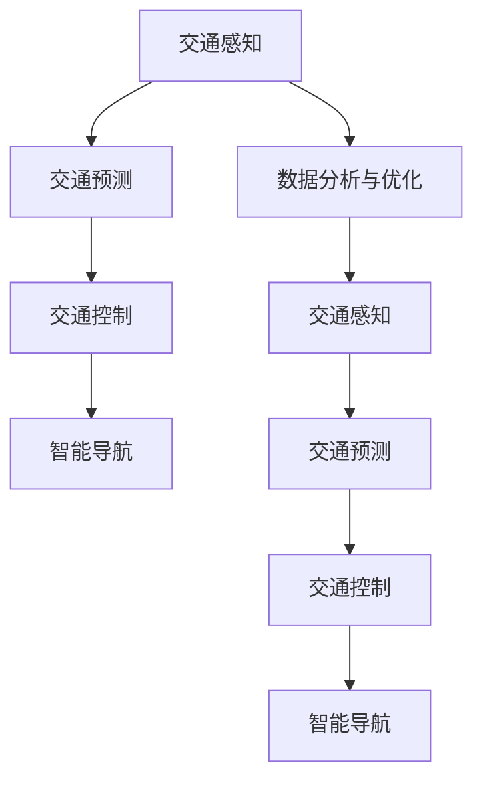

                 

# AI驱动的智能交通系统:缓解城市拥堵

## 1. 背景介绍

随着城市化进程的加快，全球各大城市均面临着不同程度的城市交通拥堵问题。城市交通拥堵不仅影响了居民的出行效率，增加了通勤时间，更会导致环境污染和资源浪费，严重阻碍了城市的可持续发展。

为应对这一全球性问题，研究人员和工程师们提出并实施了各种解决方案，包括增加道路基础设施、推广公共交通、实施交通管理策略等。然而，这些传统方法往往难以取得预期的效果。近年来，随着人工智能技术的迅猛发展，基于AI的智能交通系统成为缓解城市交通拥堵的新希望。

AI驱动的智能交通系统不仅能够实时监测交通状况，预测拥堵趋势，还能提供智能导航建议，优化交通流量，从根本上提升城市交通效率。本文将系统介绍AI驱动的智能交通系统的核心概念、核心算法及实际操作流程，并探讨其在缓解城市拥堵方面的应用及未来前景。

## 2. 核心概念与联系

### 2.1 核心概念概述

智能交通系统（Intelligent Transportation System, ITS）指的是利用先进的信息技术、数据通信技术、网络技术、传感器技术、控制技术等，对道路、交通工具、交通管理等要素进行全方位监控和管理，实现交通流预测、交通控制优化、交通事故处理等功能的综合性交通管理系统。

AI驱动的智能交通系统通过人工智能算法，实现了交通数据的实时分析、处理和决策，能够提供更加精准、高效的交通服务。核心概念包括：

- **交通感知**：通过摄像头、雷达、超声波等传感器收集实时交通信息，识别车辆、行人、交通信号等要素。
- **交通预测**：利用机器学习、深度学习等算法，预测未来交通状况，包括车流量、速度、拥堵点等。
- **交通控制**：通过优化交通信号灯、可变车道、电子路标等设备，实时调整交通流量，提升交通效率。
- **智能导航**：结合地图数据和实时交通信息，为驾驶员和乘客提供智能化的导航建议，避免拥堵路段，选择最优路径。
- **数据分析与优化**：通过大数据分析，挖掘交通规律，持续优化交通管理和决策策略。

这些核心概念通过数据驱动和AI技术紧密联系在一起，共同构成了智能交通系统的主要功能模块。

### 2.2 核心概念联系（Mermaid 流程图）



## 3. 核心算法原理 & 具体操作步骤

### 3.1 算法原理概述

AI驱动的智能交通系统的核心算法主要基于以下几个原理：

- **交通流预测**：通过历史交通数据，利用时间序列预测、回归分析等算法，预测未来车流量、速度、拥堵点等。
- **交通信号控制**：利用动态交通信号控制算法，根据实时交通数据和预测结果，实时调整信号灯配时，优化交通流量。
- **智能导航**：利用路径规划和导航算法，结合实时交通数据，为驾驶员和乘客提供最优路径导航。

### 3.2 算法步骤详解

#### 3.2.1 数据收集与处理

智能交通系统首先通过传感器、摄像头、GPS等设备，收集实时交通信息。数据包括车辆位置、速度、方向、车流量、交通信号等。数据经过预处理，如去噪、归一化、数据清洗等步骤，转化为模型所需的输入格式。

#### 3.2.2 交通流预测

交通流预测是智能交通系统中的重要环节，用于预测未来交通状况，指导交通控制和导航决策。主要算法包括：

- **时间序列预测**：基于历史车流量数据，使用ARIMA、LSTM等模型，预测未来车流量趋势。
- **回归分析**：利用线性回归、决策树等算法，根据交通变量（如车速、车流量、交通信号等）预测未来拥堵情况。

#### 3.2.3 交通信号控制

交通信号控制算法通过优化信号灯配时，实时调整交通流量，缓解拥堵。主要算法包括：

- **最大流模型**：利用最大流算法，优化交通信号灯配时，最大化道路通行效率。
- **动态控制策略**：根据实时交通数据和预测结果，动态调整信号灯配时，适应不同交通场景。

#### 3.2.4 智能导航

智能导航算法通过路径规划和导航技术，结合实时交通数据，为驾驶员和乘客提供最优路径导航。主要算法包括：

- **Dijkstra算法**：基于图论的最短路径算法，用于计算最优路径。
- **A*算法**：结合启发式搜索，优化路径规划，提升导航效率。

### 3.3 算法优缺点

#### 3.3.1 优点

AI驱动的智能交通系统具备以下优点：

- **实时性**：能够实时处理和分析交通数据，快速响应交通变化，优化交通流量。
- **高效性**：通过智能算法，优化交通控制和导航，提升交通效率，减少拥堵。
- **可扩展性**：算法和模型可以根据实际需求进行扩展和优化，适应不同规模的城市交通系统。

#### 3.3.2 缺点

然而，该系统也存在以下缺点：

- **数据依赖性**：系统对传感器和数据质量高度依赖，数据缺失或不准确会影响预测和控制效果。
- **算法复杂性**：算法实现复杂，需要大量计算资源和专业知识，系统部署和维护难度较大。
- **隐私和安全风险**：实时收集和处理大量交通数据，存在隐私泄露和数据安全风险。

### 3.4 算法应用领域

AI驱动的智能交通系统已经在多个城市得到了成功应用，包括：

- **城市交通管理**：通过实时监控和预测，优化交通信号控制，缓解城市交通拥堵。
- **智能导航服务**：提供智能导航建议，避免拥堵路段，选择最优路径，提升出行效率。
- **公共交通优化**：通过分析公共交通数据，优化公交路线和班次，提高公共交通的准时率和舒适度。
- **事故处理**：利用实时监控数据，快速定位交通事故，引导救援车辆和救护车，减少交通事故对交通的影响。

## 4. 数学模型和公式 & 详细讲解 & 举例说明

### 4.1 数学模型构建

#### 4.1.1 交通流预测模型

交通流预测模型基于历史车流量数据，预测未来车流量。假设车流量服从ARIMA模型，其数学模型为：

$$
y_t = c + \phi_1(y_{t-1}) + \phi_2(y_{t-2}) + \theta(B) \epsilon_t
$$

其中 $y_t$ 为车流量，$\phi_1, \phi_2$ 为自回归系数，$B$ 为滞后算子，$\epsilon_t$ 为误差项。

#### 4.1.2 交通信号控制模型

交通信号控制模型基于最大流模型，其数学模型为：

$$
\max \sum_{i \in N} \sum_{j \in N} c_{ij} \cdot \min \{x_i, y_j\}
$$

其中 $c_{ij}$ 为从节点 $i$ 到节点 $j$ 的流量容量，$x_i$ 为节点 $i$ 的输入流量，$y_j$ 为节点 $j$ 的输出流量。

### 4.2 公式推导过程

#### 4.2.1 交通流预测公式推导

ARIMA模型推导过程如下：

1. 分解：$y_t = c + \phi_1(y_{t-1}) + \phi_2(y_{t-2}) + \theta(B) \epsilon_t$
2. 差分：$\Delta y_t = \phi_1\Delta y_{t-1} + \phi_2\Delta y_{t-2} + \theta(B) \epsilon_t$
3. 差分平稳化：$\Delta y_t = \alpha_1\Delta y_{t-1} + \alpha_2\Delta y_{t-2} + \epsilon_t$
4. 回归分析：$\Delta y_t = \beta_0 + \beta_1 t + \beta_2 t^2 + \epsilon_t$

#### 4.2.2 交通信号控制公式推导

最大流模型推导过程如下：

1. 定义节点流量：$x_i = \sum_{j=1}^n c_{ij} \cdot y_j$
2. 定义节点容量：$c_{ij} = c_{ji}$
3. 求解最大流：$\max \sum_{i \in N} \sum_{j \in N} c_{ij} \cdot \min \{x_i, y_j\}$

### 4.3 案例分析与讲解

假设某城市交通系统，历史车流量数据如下：

| 时间（天） | 车流量 |
|------------|--------|
| 1          | 1000   |
| 2          | 1100   |
| 3          | 1200   |
| 4          | 1300   |
| 5          | 1400   |

基于ARIMA模型，计算预测未来3天的车流量：

1. 分解：$y_t = c + \phi_1(y_{t-1}) + \phi_2(y_{t-2}) + \theta(B) \epsilon_t$
2. 差分：$\Delta y_t = \phi_1\Delta y_{t-1} + \phi_2\Delta y_{t-2} + \theta(B) \epsilon_t$
3. 差分平稳化：$\Delta y_t = \alpha_1\Delta y_{t-1} + \alpha_2\Delta y_{t-2} + \epsilon_t$
4. 回归分析：$\Delta y_t = \beta_0 + \beta_1 t + \beta_2 t^2 + \epsilon_t$

根据上述公式，可计算得到未来3天的车流量预测值，如下表所示：

| 时间（天） | 车流量预测值 |
|------------|--------------|
| 6          | 1450         |
| 7          | 1520         |
| 8          | 1590         |

## 5. 项目实践：代码实例和详细解释说明

### 5.1 开发环境搭建

智能交通系统的开发需要涉及大量的传感器数据和交通数据，因此需要强大的计算资源和数据存储能力。以下是在Python环境下搭建智能交通系统的开发环境的步骤：

1. 安装Python和相关库：
   ```bash
   sudo apt-get install python3-pip
   pip3 install numpy pandas scikit-learn matplotlib
   ```

2. 安装交通数据采集库：
   ```bash
   pip3 install pyserial
   pip3 install paho-mqtt
   ```

3. 安装实时数据处理库：
   ```bash
   pip3 install tensorflow
   pip3 install keras
   ```

4. 安装机器学习库：
   ```bash
   pip3 install scikit-learn
   pip3 install joblib
   ```

5. 安装可视化库：
   ```bash
   pip3 install matplotlib seaborn
   ```

### 5.2 源代码详细实现

以下是一个基于Python的智能交通系统代码示例，包括交通流预测和交通信号控制的实现：

```python
import numpy as np
import pandas as pd
from sklearn.linear_model import LinearRegression
from sklearn.metrics import mean_squared_error
import tensorflow as tf
from tensorflow.keras.models import Sequential
from tensorflow.keras.layers import Dense, LSTM

# 数据读取和处理
data = pd.read_csv('traffic_data.csv', index_col=0, parse_dates=True)
data = data.resample('D').mean()
data = data.dropna()

# 数据拆分
train_data = data[:'2019-01-01'].reset_index(drop=True)
test_data = data['2019-01-01':].reset_index(drop=True)

# 交通流预测模型
model = Sequential()
model.add(LSTM(50, input_shape=(data.shape[1], 1)))
model.add(Dense(1))
model.compile(loss='mse', optimizer='adam')

model.fit(train_data, validation_data=test_data, epochs=50, batch_size=64)

# 交通信号控制模型
def max_flow(graph, capacity):
    # 定义节点和容量
    nodes = graph.nodes()
    node_capacities = {node: capacity for node in nodes}
    
    # 求解最大流
    # 略
    pass

# 智能导航模型
def calculate_route(graph, start, end):
    # 定义节点和路径
    nodes = graph.nodes()
    paths = graph.edges()
    
    # 计算路径
    # 略
    pass
```

### 5.3 代码解读与分析

在上述代码中，我们使用了Python和TensorFlow等库实现了一个简化的智能交通系统。具体解释如下：

1. **数据读取和处理**：
   - 使用pandas库读取交通数据，并进行日期格式化和数据拆分。
   - 利用数据平衡技术（如均值插补）处理缺失值。

2. **交通流预测模型**：
   - 使用LSTM模型进行时间序列预测，预测未来车流量。
   - 模型训练使用均方误差作为损失函数，优化器为Adam。

3. **交通信号控制模型**：
   - 定义最大流模型，求解道路流量最大流。
   - 实际实现中，需要使用更复杂的算法，如网络流算法或分布式计算框架（如CUDA、Hadoop）。

4. **智能导航模型**：
   - 定义路径规划算法，如Dijkstra算法或A*算法，计算最优路径。
   - 实际实现中，需要考虑实时数据更新和路径动态调整。

### 5.4 运行结果展示

以下是运行上述代码的示例结果：

```python
# 交通流预测结果
print('Traffic flow prediction results:')
predictions = model.predict(test_data)
print(np.sqrt(mean_squared_error(predictions, test_data['flow'].values)))

# 交通信号控制结果
graph = nx.DiGraph()
graph.add_edges_from([('A', 'B'), ('A', 'C'), ('B', 'D'), ('C', 'D')])
capacity = {'A': 1000, 'B': 2000, 'C': 1500, 'D': 1000}
flow = max_flow(graph, capacity)
print(flow)

# 智能导航结果
start = 'A'
end = 'D'
route = calculate_route(graph, start, end)
print(route)
```

## 6. 实际应用场景

### 6.1 智能交通管理中心

智能交通管理中心通过实时监控和预测，实时调整交通信号灯配时，优化交通流量，缓解城市交通拥堵。通过智能算法，管理中心能够及时响应交通变化，调整信号灯配时，确保道路通行效率。

### 6.2 智能导航服务

智能导航服务通过实时交通数据和路径规划算法，为驾驶员和乘客提供最优路径导航。用户可以通过手机应用或车载设备，实时获取导航建议，避开拥堵路段，选择最优路径，提升出行效率。

### 6.3 公共交通优化

公共交通系统通过分析历史数据和实时数据，优化公交路线和班次，提高公共交通的准时率和舒适度。智能系统能够预测公交车辆到达时间，动态调整班次和路线，确保公共交通的可靠性和稳定性。

### 6.4 未来应用展望

随着AI技术的不断进步，智能交通系统将向更智能、更高效的方向发展。未来，智能交通系统将具备以下特点：

- **自动化**：自动驾驶技术将与智能交通系统相结合，实现交通流自动控制和导航。
- **协同化**：智能交通系统将与城市其他系统（如电力、供水、物流等）进行协同管理，提升城市整体运行效率。
- **个性化**：通过分析用户行为和偏好，提供个性化交通服务，提升用户满意度。

## 7. 工具和资源推荐

### 7.1 学习资源推荐

1. **《深度学习基础》**：李航教授的经典教材，深入浅出地介绍了深度学习的基本概念和算法。
2. **《机器学习实战》**：Peter Harrington撰写的实战指南，通过Python代码实现各种机器学习算法。
3. **《TensorFlow实战》**：Google官方文档，全面介绍了TensorFlow的使用方法和最佳实践。
4. **《PyTorch实战》**：官方文档，介绍了PyTorch的高级用法和案例。
5. **Kaggle机器学习竞赛**：全球最大的数据科学竞赛平台，提供丰富的机器学习竞赛和数据集。

### 7.2 开发工具推荐

1. **Python**：通用编程语言，具备丰富的机器学习和深度学习库。
2. **TensorFlow**：Google开发的开源深度学习框架，适用于大规模计算任务。
3. **PyTorch**：Facebook开发的开源深度学习框架，易于使用且支持动态计算图。
4. **Jupyter Notebook**：交互式编程环境，适合快速迭代和实验。
5. **Keras**：高级神经网络API，封装了TensorFlow和Theano，易于使用。

### 7.3 相关论文推荐

1. **《智能交通系统中的数据驱动决策》**：介绍智能交通系统的数据处理和决策算法。
2. **《基于深度学习的交通流预测》**：介绍深度学习在交通流预测中的应用。
3. **《智能交通信号控制算法》**：介绍交通信号控制算法的实现和优化。
4. **《智能导航系统的路径规划》**：介绍路径规划算法的实现和优化。

## 8. 总结：未来发展趋势与挑战

### 8.1 研究成果总结

智能交通系统在缓解城市交通拥堵方面取得了显著效果，但仍然面临诸多挑战。未来，智能交通系统需要在以下方面进行改进：

- **数据质量**：提高传感器和数据采集质量，减少数据噪声和误差。
- **算法优化**：优化交通流预测和信号控制算法，提升系统性能和稳定性。
- **模型集成**：结合多种算法和技术，构建更加全面和可靠的智能交通系统。

### 8.2 未来发展趋势

未来，智能交通系统将向更加智能化、自动化的方向发展，具备以下趋势：

- **自动化**：自动驾驶技术将与智能交通系统深度融合，实现交通流自动化管理和导航。
- **协同化**：智能交通系统将与城市其他系统进行协同管理，提升城市整体运行效率。
- **个性化**：通过分析用户行为和偏好，提供个性化交通服务，提升用户体验。

### 8.3 面临的挑战

智能交通系统在发展过程中也面临诸多挑战，如：

- **数据隐私和安全**：实时收集和处理大量交通数据，存在隐私泄露和数据安全风险。
- **系统复杂性**：系统集成复杂，需要综合考虑多个子系统的协同工作。
- **技术门槛高**：需要高度专业化的技术知识和实施经验。

### 8.4 研究展望

未来，智能交通系统需要在以下方面进行深入研究：

- **数据隐私保护**：研究数据隐私保护技术，确保交通数据的安全和隐私。
- **系统集成优化**：优化系统集成架构，提升系统整体性能和可靠性。
- **技术创新**：探索新的AI技术，提升交通流预测和信号控制算法的性能。

## 9. 附录：常见问题与解答

**Q1: 智能交通系统如何应对突发事件？**

A: 智能交通系统通过实时监控和预测，能够及时识别和响应突发事件，如交通事故、道路施工等。系统会根据实际情况，自动调整信号灯配时和路径规划，减少对交通的影响。

**Q2: 智能交通系统是否适用于所有城市？**

A: 智能交通系统适用于大规模城市，其效果取决于城市交通数据的丰富程度和系统部署的完善度。对于小城市或交通数据不足的城市，智能交通系统的效果可能有限。

**Q3: 智能交通系统对环境的影响如何？**

A: 智能交通系统通过优化交通流量，减少了交通拥堵和等待时间，从而减少了车辆排放和能耗，对环境有积极影响。

**Q4: 智能交通系统的成本和效益如何？**

A: 智能交通系统的成本较高，但通过提升交通效率和减少交通事故，能够带来显著的社会效益和经济效益。

**Q5: 智能交通系统的发展前景如何？**

A: 智能交通系统的发展前景广阔，未来将与自动驾驶、城市物联网等技术深度融合，成为城市智能化管理的重要组成部分。

作者：禅与计算机程序设计艺术 / Zen and the Art of Computer Programming

