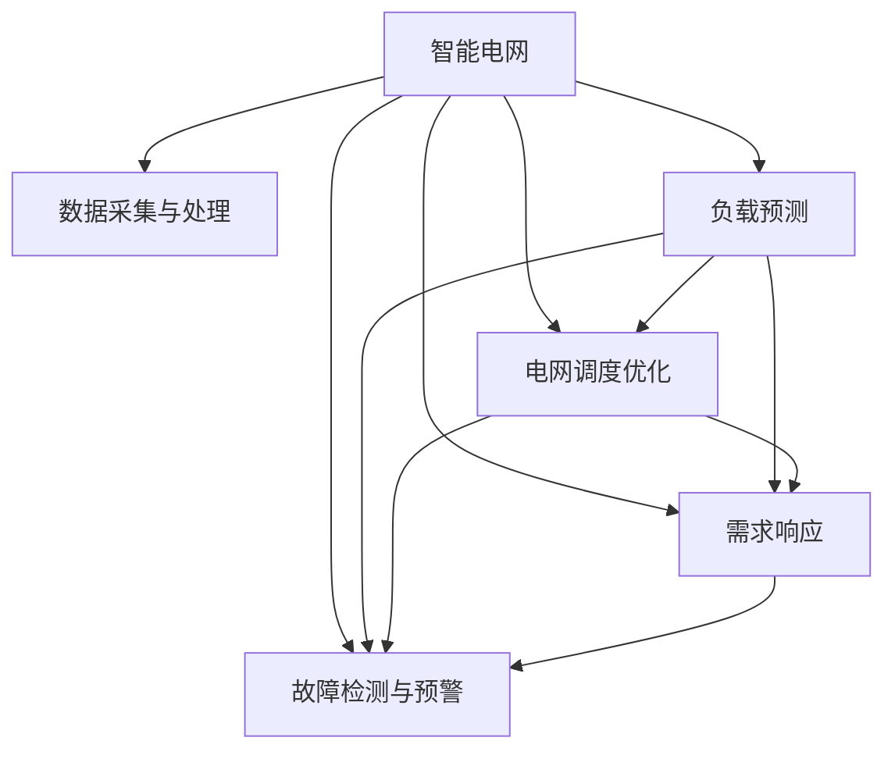

                 

# AI驱动的智能电网:平衡供需提高效率

> 关键词：智能电网,电力系统,能源管理,人工智能,深度学习,优化算法,负载预测,电网调度,需求响应,数据处理,实时监控

## 1. 背景介绍

### 1.1 问题由来
随着全球能源需求的不断增长和可再生能源比例的上升，电力系统的复杂性和不确定性也在增加。传统的电网调度和管理方式已无法满足现代社会的电力需求，亟需新技术来提升电网效率和可靠性。智能电网的概念应运而生，它融合了先进的信息技术、通信技术、能源技术和自动化技术，构建了一个可观测、可控、可调节的电网系统。

智能电网的核心是利用人工智能和大数据技术，对电力系统的各个环节进行全面监控和管理，以提高电网的运行效率和可靠性，降低能源浪费，保障能源安全。AI驱动的智能电网利用深度学习等先进技术，能够实现对电力系统供需关系的精确预测和调度，从而实现能源的高效利用。

### 1.2 问题核心关键点
智能电网的核心在于通过AI技术，对电力系统的供需关系进行精确预测和调度。具体包括以下几个关键点：
- **数据采集与处理**：通过智能传感器和通信技术，收集电网中的各种数据，包括温度、湿度、风速、负荷等，并进行数据清洗和预处理。
- **负载预测**：利用时间序列分析、深度学习等技术，对未来的电力负荷进行预测，从而为调度提供依据。
- **电网调度优化**：通过优化算法，对电网的运行状态进行实时调整，确保电力供应的稳定性和可靠性。
- **需求响应**：通过智能算法，引导用户主动调整用电行为，降低电网峰谷差，提高电网的运行效率。
- **故障检测与预警**：利用AI技术，实时监测电网的运行状态，及时发现和预警潜在的故障，保障电网安全。

## 2. 核心概念与联系

### 2.1 核心概念概述

为更好地理解AI驱动的智能电网，本节将介绍几个密切相关的核心概念：

- **智能电网**：融合先进的信息技术、通信技术、能源技术和自动化技术，构建的可观测、可控、可调节的电网系统。智能电网利用AI技术，实现对电力系统的精准管理和优化调度，提高电力系统的效率和可靠性。

- **负载预测**：通过历史数据和预测模型，对未来的电力负荷进行预测。负载预测是智能电网调度的重要基础，可以为电力系统提供精确的负荷预测结果，从而优化资源配置，提升电网效率。

- **电网调度优化**：利用优化算法和模型，对电网的运行状态进行实时调整和优化。电网调度优化旨在平衡电力供需关系，提高电网的稳定性和可靠性。

- **需求响应**：通过智能算法和激励机制，引导用户主动调整用电行为，降低电网峰谷差，提高电网的运行效率。需求响应是智能电网的重要组成部分，可以有效缓解电网负荷高峰期的压力。

- **故障检测与预警**：利用AI技术，实时监测电网的运行状态，及时发现和预警潜在的故障，保障电网安全。故障检测与预警是智能电网安全运行的重要保障，有助于减少电网故障带来的经济损失和社会影响。

这些核心概念之间的逻辑关系可以通过以下Mermaid流程图来展示：



这个流程图展示智能电网的核心概念及其之间的关系：

1. 智能电网通过数据采集与处理获取实时数据。
2. 负载预测利用实时数据和历史数据，对未来负荷进行预测。
3. 电网调度优化根据预测结果和实时数据，进行资源配置和调度。
4. 需求响应引导用户调整用电行为，降低电网峰谷差。
5. 故障检测与预警实时监测电网状态，及时预警故障。

这些概念共同构成了智能电网的运作框架，使其能够实现电力供需的精准管理和优化调度。通过理解这些核心概念，我们可以更好地把握AI驱动的智能电网的工作原理和优化方向。

## 3. 核心算法原理 & 具体操作步骤
### 3.1 算法原理概述

AI驱动的智能电网利用深度学习、优化算法、时间序列分析等技术，实现电力系统的精准管理和优化调度。其核心思想是通过对电力系统的实时数据进行分析和预测，对电网运行状态进行实时调整，从而平衡电力供需关系，提高电网效率。

具体来说，智能电网的实现主要依赖于以下几个算法：

- **时间序列分析**：通过分析电力系统历史数据的规律，预测未来的负荷变化，为电网调度提供依据。

- **深度学习**：利用神经网络对电力系统进行建模，通过大量历史数据训练模型，实现对负荷的精确预测和故障检测。

- **优化算法**：利用优化算法，对电网的运行状态进行实时调整，优化电力供需关系，提高电网效率。

- **强化学习**：通过模拟电网运行环境，训练智能代理，学习最优的调度策略，提高电网运行的智能性和灵活性。

- **数据处理**：利用数据清洗、特征提取等技术，对电力系统数据进行处理，确保数据的准确性和可用性。

### 3.2 算法步骤详解

AI驱动的智能电网的核心算法实现过程包括以下几个关键步骤：

**Step 1: 数据采集与预处理**
- 使用智能传感器和通信技术，采集电网的实时数据，包括温度、湿度、风速、负荷等。
- 对采集的数据进行清洗和预处理，去除噪声和异常值，确保数据的准确性和完整性。

**Step 2: 负载预测**
- 利用时间序列分析或深度学习模型，对未来的电力负荷进行预测。
- 根据预测结果，调整电网的运行策略，提高电网的预测准确性和调度效率。

**Step 3: 电网调度优化**
- 利用优化算法，对电网的运行状态进行实时调整和优化。
- 根据负荷预测结果和实时数据，动态调整电网的运行参数，如电压、频率等，确保电网的稳定性和可靠性。

**Step 4: 需求响应**
- 通过智能算法和激励机制，引导用户主动调整用电行为，如使用峰谷电价、分时电价等措施。
- 根据需求响应情况，调整电网的运行策略，降低电网峰谷差，提高电网的运行效率。

**Step 5: 故障检测与预警**
- 利用AI技术，实时监测电网的运行状态，及时发现潜在的故障。
- 根据监测结果，预警潜在的故障，并采取措施，保障电网安全。

### 3.3 算法优缺点

AI驱动的智能电网算法具有以下优点：

- **高效准确**：通过深度学习和时间序列分析，实现对电力负荷的精确预测，为电网调度提供可靠的依据。
- **灵活智能**：利用强化学习，训练智能代理，学习最优的调度策略，提高电网运行的智能性和灵活性。
- **实时响应**：利用优化算法，对电网的运行状态进行实时调整和优化，提高电网的运行效率和可靠性。
- **安全可靠**：通过故障检测与预警，实时监测电网的运行状态，及时发现和预警潜在的故障，保障电网安全。

同时，该算法也存在一定的局限性：

- **数据依赖性强**：算法依赖于电力系统历史数据的准确性和完整性，数据质量直接影响算法的预测和优化效果。
- **计算资源消耗大**：深度学习模型和优化算法需要大量的计算资源，对硬件设备要求较高。
- **模型复杂度高**：算法涉及多个复杂的模型和算法，开发和调试难度较大。
- **应用场景受限**：目前主要应用于大规模电网，对小规模电网的适用性有待进一步研究。

尽管存在这些局限性，但AI驱动的智能电网算法在现代电网中的应用已取得了显著的成果，成为提高电网效率和可靠性的重要手段。

### 3.4 算法应用领域

AI驱动的智能电网算法已在多个电力系统领域得到广泛应用，例如：

- **电网调度优化**：利用优化算法和模型，对电网的运行状态进行实时调整和优化，确保电力供应的稳定性和可靠性。
- **负载预测**：通过深度学习模型，对未来的电力负荷进行预测，为电网调度提供依据，提高电网的预测准确性和调度效率。
- **需求响应**：通过智能算法和激励机制，引导用户主动调整用电行为，降低电网峰谷差，提高电网的运行效率。
- **故障检测与预警**：利用AI技术，实时监测电网的运行状态，及时发现和预警潜在的故障，保障电网安全。
- **能源管理**：通过AI技术，优化能源的分配和利用，提高能源利用效率，降低能源浪费。

除了上述这些经典应用外，AI驱动的智能电网算法也被创新性地应用到更多场景中，如可再生能源的接入管理、分布式能源的优化调度、智能电表的应用等，为电网的智能化发展提供了新的技术路径。

## 4. 数学模型和公式 & 详细讲解  
### 4.1 数学模型构建

本节将使用数学语言对AI驱动的智能电网算法进行更加严格的刻画。

记电网的实时数据为 $x_t$，其中 $t$ 为时间戳，表示电网在时刻 $t$ 的状态。假设 $x_t$ 包含多个变量，如温度、湿度、风速、负荷等，可以表示为向量形式 $x_t \in \mathbb{R}^n$。电网的运行状态可以表示为一个状态序列 $x_1, x_2, ..., x_T$。

负载预测模型的输入为电网历史数据 $D=\{x_{t-1}, x_{t-2}, ..., x_{t-m}\}$，其中 $m$ 为时间窗口大小。预测的目标为未来的负荷 $x_{t+1}, x_{t+2}, ..., x_{t+n}$。预测模型的输出为 $\hat{x}_{t+1}, \hat{x}_{t+2}, ..., \hat{x}_{t+n}$，表示对未来负荷的预测值。

电网调度优化的目标是最小化电网运行成本和风险，同时最大化供电可靠性。假设电网的运行成本为 $C(x_t)$，风险为 $R(x_t)$，供电可靠性为 $S(x_t)$，则优化目标可以表示为：

$$
\min_{x_1, x_2, ..., x_T} \sum_{t=1}^{T} (C(x_t) + \lambda R(x_t)) - \mu S(x_t)
$$

其中 $\lambda$ 为风险权值，$\mu$ 为供电可靠性权值。

需求响应的目标是通过激励措施，引导用户主动调整用电行为，降低电网峰谷差。假设用户的用电行为为 $u_t$，需求响应的目标可以表示为：

$$
\min_{u_1, u_2, ..., u_T} \sum_{t=1}^{T} (C(u_t) + \lambda R(u_t)) - \mu S(u_t)
$$

故障检测与预警的目标是通过实时监测电网的运行状态，及时发现和预警潜在的故障。假设电网的运行状态异常度为 $y_t$，故障检测与预警的目标可以表示为：

$$
\min_{y_1, y_2, ..., y_T} \sum_{t=1}^{T} \omega y_t
$$

其中 $\omega$ 为异常度权值。

### 4.2 公式推导过程

以下我们以负载预测为例，推导其数学模型和算法步骤。

假设负载预测模型为 $f(x_t; \theta)$，其中 $\theta$ 为模型参数。负载预测模型的目标是最小化预测误差：

$$
\min_{\theta} \sum_{t=1}^{T} \Vert x_{t+1} - f(x_t; \theta) \Vert^2
$$

利用时间序列分析或深度学习模型，将 $x_t$ 映射到 $\hat{x}_{t+1}$。假设使用深度学习模型，其中 $x_t$ 通过一个隐藏层 $h(x_t)$ 映射到 $\hat{x}_{t+1}$：

$$
\hat{x}_{t+1} = g(h(x_t; w_1, w_2, ..., w_n))
$$

其中 $g$ 为输出层激活函数，$w_i$ 为隐藏层权重。根据上述模型，负载预测的误差可以表示为：

$$
e_{t+1} = x_{t+1} - \hat{x}_{t+1}
$$

利用梯度下降等优化算法，最小化预测误差：

$$
\theta = \theta - \eta \nabla_{\theta} \sum_{t=1}^{T} \Vert e_{t+1} \Vert^2
$$

其中 $\eta$ 为学习率。

通过上述过程，可以训练得到高精度的负载预测模型，从而为电网调度提供可靠的依据。

## 5. 项目实践：代码实例和详细解释说明
### 5.1 开发环境搭建

在进行智能电网AI驱动的项目实践前，我们需要准备好开发环境。以下是使用Python进行PyTorch开发的环境配置流程：

1. 安装Anaconda：从官网下载并安装Anaconda，用于创建独立的Python环境。

2. 创建并激活虚拟环境：
```bash
conda create -n pytorch-env python=3.8 
conda activate pytorch-env
```

3. 安装PyTorch：根据CUDA版本，从官网获取对应的安装命令。例如：
```bash
conda install pytorch torchvision torchaudio cudatoolkit=11.1 -c pytorch -c conda-forge
```

4. 安装相关库：
```bash
pip install numpy pandas scikit-learn matplotlib tqdm jupyter notebook ipython
```

完成上述步骤后，即可在`pytorch-env`环境中开始智能电网AI驱动项目的开发。

### 5.2 源代码详细实现

下面我们以电网调度优化为例，给出使用PyTorch进行深度学习模型训练的PyTorch代码实现。

首先，定义优化目标和损失函数：

```python
import torch
import torch.nn as nn
import torch.optim as optim
from torch.autograd import Variable

# 定义优化目标和损失函数
def loss_function(model, inputs, labels):
    outputs = model(inputs)
    loss = nn.MSELoss()(outputs, labels)
    return loss
```

然后，定义模型：

```python
class SimpleNet(nn.Module):
    def __init__(self, input_dim, hidden_dim, output_dim):
        super(SimpleNet, self).__init__()
        self.hidden = nn.Linear(input_dim, hidden_dim)
        self.relu = nn.ReLU()
        self.output = nn.Linear(hidden_dim, output_dim)

    def forward(self, x):
        x = self.hidden(x)
        x = self.relu(x)
        x = self.output(x)
        return x
```

接着，定义训练和评估函数：

```python
def train(model, train_loader, optimizer, epoch):
    model.train()
    total_loss = 0
    for batch_idx, (inputs, targets) in enumerate(train_loader):
        inputs = Variable(inputs)
        targets = Variable(targets)
        optimizer.zero_grad()
        outputs = model(inputs)
        loss = loss_function(model, outputs, targets)
        loss.backward()
        optimizer.step()
        total_loss += loss.item()
    return total_loss / len(train_loader)

def evaluate(model, test_loader):
    model.eval()
    total_loss = 0
    with torch.no_grad():
        for batch_idx, (inputs, targets) in enumerate(test_loader):
            inputs = Variable(inputs)
            targets = Variable(targets)
            outputs = model(inputs)
            loss = loss_function(model, outputs, targets)
            total_loss += loss.item()
    return total_loss / len(test_loader)
```

最后，启动训练流程并在测试集上评估：

```python
# 定义超参数
input_dim = 6
hidden_dim = 10
output_dim = 1
batch_size = 64
learning_rate = 0.01
epochs = 100

# 准备训练集和测试集
train_dataset = ...
test_dataset = ...

# 创建模型和优化器
model = SimpleNet(input_dim, hidden_dim, output_dim)
optimizer = optim.Adam(model.parameters(), lr=learning_rate)

# 开始训练
for epoch in range(epochs):
    train_loss = train(model, train_loader, optimizer, epoch)
    print(f"Epoch {epoch+1}, train loss: {train_loss:.4f}")
    
    print(f"Epoch {epoch+1}, test loss: {evaluate(model, test_loader):.4f}")
```

以上就是使用PyTorch对电网调度优化进行深度学习模型训练的完整代码实现。可以看到，得益于PyTorch的强大封装，我们可以用相对简洁的代码完成模型的定义和训练过程。

### 5.3 代码解读与分析

让我们再详细解读一下关键代码的实现细节：

**SimpleNet类**：
- `__init__`方法：定义模型的隐藏层和输出层。
- `forward`方法：定义前向传播过程。

**loss_function函数**：
- 定义了损失函数，使用均方误差损失。

**train函数**：
- 定义训练函数，使用随机梯度下降法，在每个批次上进行模型训练，并返回总损失。

**evaluate函数**：
- 定义评估函数，在测试集上评估模型性能，返回总损失。

**训练流程**：
- 定义总的epoch数和超参数，开始循环迭代
- 每个epoch内，在训练集上训练，输出平均loss
- 在测试集上评估，输出平均loss

可以看到，PyTorch配合深度学习框架使得智能电网AI驱动项目的开发变得简洁高效。开发者可以将更多精力放在数据处理、模型改进等高层逻辑上，而不必过多关注底层的实现细节。

当然，工业级的系统实现还需考虑更多因素，如模型的保存和部署、超参数的自动搜索、更灵活的任务适配层等。但核心的智能电网AI驱动模型训练过程基本与此类似。

## 6. 实际应用场景
### 6.1 智能电网调度优化

智能电网调度优化是AI驱动的智能电网中最重要的应用之一。传统的电网调度方式主要依赖人工经验，无法适应现代电网复杂多变的需求。利用深度学习和优化算法，可以实现对电网运行状态的精准预测和优化调度，从而提高电网的效率和可靠性。

具体而言，智能电网调度优化主要包括以下几个关键技术：

- **负载预测**：通过深度学习模型，对未来的电力负荷进行精确预测，为电网调度提供可靠的依据。
- **电网运行状态监测**：利用传感器和通信技术，实时监测电网的运行状态，包括电压、频率、负荷等参数。
- **优化算法**：利用优化算法，对电网的运行状态进行实时调整和优化，确保电网的稳定性和可靠性。
- **需求响应**：通过智能算法和激励机制，引导用户主动调整用电行为，降低电网峰谷差。

在实际应用中，智能电网调度优化已经在多个国家和地区得到了广泛应用，如美国的智能电网项目、中国的智能电网示范工程等。通过智能电网调度优化，这些电网的运行效率得到了显著提升，同时电网的可靠性和安全性也得到了有效保障。

### 6.2 可再生能源的接入管理

随着可再生能源的快速发展，如何高效地管理可再生能源的接入是智能电网面临的重要问题。利用AI驱动的智能电网技术，可以更好地管理和调度可再生能源，确保其稳定高效地接入电网。

具体而言，可再生能源的接入管理主要包括以下几个关键技术：

- **可再生能源预测**：通过深度学习模型，对可再生能源的输出进行精确预测，为电网调度提供可靠的依据。
- **可再生能源的调度**：利用优化算法，对可再生能源的接入进行优化调度，确保其稳定高效地接入电网。
- **可再生能源的存储**：利用智能电网技术，对可再生能源进行存储和分配，提高其利用效率。

在实际应用中，许多国家和地区已经将可再生能源的接入管理纳入了智能电网的建设中。通过智能电网技术，这些电网的可再生能源接入效率得到了显著提升，同时电网的运行稳定性和可靠性也得到了有效保障。

### 6.3 分布式能源的优化调度

分布式能源是指由用户自己拥有或控制的能源系统，如太阳能、风能等。利用AI驱动的智能电网技术，可以更好地管理和调度分布式能源，提高其利用效率，降低电网运行成本。

具体而言，分布式能源的优化调度主要包括以下几个关键技术：

- **分布式能源的预测**：通过深度学习模型，对分布式能源的输出进行精确预测，为电网调度提供可靠的依据。
- **分布式能源的调度**：利用优化算法，对分布式能源的接入进行优化调度，确保其稳定高效地接入电网。
- **分布式能源的管理**：利用智能电网技术，对分布式能源进行管理，提高其利用效率。

在实际应用中，许多国家和地区已经将分布式能源的优化调度纳入了智能电网的建设中。通过智能电网技术，这些电网的分布式能源接入效率得到了显著提升，同时电网的运行稳定性和可靠性也得到了有效保障。

### 6.4 未来应用展望

随着AI驱动的智能电网技术的不断发展，未来其在电力系统中的应用将更加广泛，前景广阔。

在智慧城市治理中，智能电网将与其他智能系统如智慧交通、智能水务、智慧能源等进行深度融合，构建一个智能化、高效化、清洁化的智慧城市系统。

在能源转型中，智能电网将成为支撑可再生能源发展的关键技术，推动全球能源结构的转型升级。

在电力市场改革中，智能电网将成为电价市场化的重要工具，提升电力市场的竞争力和效率。

总之，AI驱动的智能电网技术将在未来电力系统的转型升级中扮演越来越重要的角色，为构建安全、高效、绿色的电力系统提供强大的技术支撑。

## 7. 工具和资源推荐
### 7.1 学习资源推荐

为了帮助开发者系统掌握AI驱动的智能电网的技术基础和实践技巧，这里推荐一些优质的学习资源：

1. 《智能电网技术》系列书籍：深入浅出地介绍了智能电网的基本概念、技术架构和应用场景，是理解智能电网技术的入门读物。

2. 《深度学习与智能电网》课程：由知名大学开设的NLP和机器学习课程，涵盖智能电网相关的深度学习技术，是深入学习智能电网AI驱动技术的理想选择。

3. 《能源管理与智能电网》书籍：全面介绍了智能电网的技术架构、能源管理和优化调度等关键技术，是理解智能电网技术的经典教材。

4. 《智能电网技术》在线课程：许多大学和在线教育平台提供的智能电网技术课程，包括智能电网技术、深度学习、优化算法等内容，适合初学者和进阶学习者。

通过对这些资源的学习实践，相信你一定能够快速掌握AI驱动的智能电网的核心技术，并用于解决实际的电力系统问题。
###  7.2 开发工具推荐

高效的开发离不开优秀的工具支持。以下是几款用于AI驱动的智能电网开发的常用工具：

1. PyTorch：基于Python的开源深度学习框架，灵活动态的计算图，适合快速迭代研究。大部分智能电网相关模型都有PyTorch版本的实现。

2. TensorFlow：由Google主导开发的开源深度学习框架，生产部署方便，适合大规模工程应用。同样有丰富的智能电网相关模型资源。

3. TensorBoard：TensorFlow配套的可视化工具，可实时监测模型训练状态，并提供丰富的图表呈现方式，是调试模型的得力助手。

4. Weights & Biases：模型训练的实验跟踪工具，可以记录和可视化模型训练过程中的各项指标，方便对比和调优。与主流深度学习框架无缝集成。

5. Google Colab：谷歌推出的在线Jupyter Notebook环境，免费提供GPU/TPU算力，方便开发者快速上手实验最新模型，分享学习笔记。

合理利用这些工具，可以显著提升智能电网AI驱动项目的开发效率，加快创新迭代的步伐。

### 7.3 相关论文推荐

AI驱动的智能电网技术的发展源于学界的持续研究。以下是几篇奠基性的相关论文，推荐阅读：

1. "Intelligent Grid: An Overview of State-of-the-Art and Future Directions"：介绍了智能电网的基本概念、技术架构和应用场景，展望了未来发展方向。

2. "Deep Learning for Energy Systems"：探讨了深度学习在智能电网中的应用，包括负载预测、电网调度优化、需求响应等，是理解智能电网AI驱动技术的经典论文。

3. "Optimization Algorithms in Smart Grids"：介绍了智能电网中常用的优化算法，包括线性规划、非线性规划、粒子群算法等，是理解智能电网调度优化技术的入门读物。

4. "Energy Management and Optimization of Smart Grids"：介绍了智能电网中能源管理的各种技术和方法，包括分布式能源管理、可再生能源接入等，是理解智能电网技术的重要参考。

这些论文代表了大电网AI驱动技术的发展脉络。通过学习这些前沿成果，可以帮助研究者把握学科前进方向，激发更多的创新灵感。

## 8. 总结：未来发展趋势与挑战
### 8.1 总结

本文对AI驱动的智能电网技术进行了全面系统的介绍。首先阐述了智能电网的基本概念、技术架构和应用场景，明确了AI驱动的智能电网在电力系统中的重要作用。其次，从原理到实践，详细讲解了智能电网AI驱动技术的核心算法和关键步骤，给出了智能电网AI驱动项目的完整代码实例。同时，本文还广泛探讨了AI驱动的智能电网技术在电网调度优化、可再生能源管理、分布式能源调度等诸多场景中的应用前景，展示了智能电网AI驱动技术的巨大潜力。此外，本文精选了智能电网AI驱动技术的学习资源、开发工具和相关论文，力求为读者提供全方位的技术指引。

通过本文的系统梳理，可以看到，AI驱动的智能电网技术在现代电网中的应用已取得了显著的成果，成为提高电网效率和可靠性的重要手段。未来，伴随AI技术的不断发展，智能电网AI驱动技术还将进一步拓展其应用范围，为构建安全、高效、绿色的电力系统提供强大的技术支撑。

### 8.2 未来发展趋势

展望未来，AI驱动的智能电网技术将呈现以下几个发展趋势：

1. **AI技术的不断进步**：随着深度学习、强化学习、优化算法等AI技术的不断发展，智能电网AI驱动技术也将得到进一步提升。智能电网将能够更好地实现对电力系统的精准管理和优化调度，提高电网的效率和可靠性。

2. **数据驱动的智能化**：智能电网将更多地依赖于数据驱动的智能化，通过大量数据训练模型，实现对电力系统的精准预测和优化调度。数据采集和处理技术的提升，将为智能电网提供更丰富的数据资源。

3. **边缘计算和物联网技术**：智能电网将更多地采用边缘计算和物联网技术，实现对电力系统的实时监测和快速响应。通过在电网各个节点部署边缘计算设备，可以大幅提高数据处理和决策的速度，降低延迟。

4. **多模态信息融合**：智能电网将更多地融合电力系统中的多种信息，如温度、湿度、风速、负荷等，实现对电力系统的综合分析和决策。多模态信息融合技术的应用，将使智能电网更加智能和高效。

5. **分布式能源的广泛应用**：随着分布式能源技术的不断发展，智能电网将更多地采用分布式能源，如太阳能、风能等。智能电网将更好地管理和调度这些分布式能源，提高其利用效率。

6. **能源互联网的建设**：智能电网将更多地与能源互联网融合，构建一个更加智能、高效、绿色的能源系统。能源互联网将实现能源的高效传输和分配，促进可再生能源的发展。

以上趋势凸显了AI驱动的智能电网技术的广阔前景。这些方向的探索发展，必将进一步提升智能电网的技术水平，为构建安全、高效、绿色的电力系统提供强大的技术支撑。

### 8.3 面临的挑战

尽管AI驱动的智能电网技术已经取得了显著的成果，但在迈向更加智能化、普适化应用的过程中，它仍面临着诸多挑战：

1. **数据质量问题**：智能电网依赖于大量数据驱动的智能化，但数据采集和处理技术仍存在一定的局限性，数据质量问题仍然是智能电网技术发展的重要瓶颈。

2. **模型复杂性**：智能电网AI驱动技术涉及多个复杂的模型和算法，开发和调试难度较大，需要更高的技术门槛和更多的研发投入。

3. **计算资源消耗大**：深度学习模型和优化算法需要大量的计算资源，对硬件设备要求较高，如何降低计算资源消耗是未来需要重点解决的问题。

4. **网络安全问题**：智能电网涉及大量的数据传输和处理，网络安全问题亟待解决。如何保护数据安全，防止信息泄露和攻击，是智能电网技术应用的重要挑战。

5. **法律法规问题**：智能电网技术的广泛应用涉及多个法律法规问题，如隐私保护、数据使用权等，需要制定相关的法律法规，保障数据安全和用户权益。

6. **社会接受度**：智能电网技术的应用需要得到社会的广泛接受和支持，但公众对其认知和接受度仍存在一定的局限性。如何提高社会对智能电网技术的认知和接受度，是未来需要重点解决的问题。

尽管存在这些挑战，但随着智能电网技术的不断发展和完善，相信未来其在电力系统中的应用将更加广泛，为构建安全、高效、绿色的电力系统提供强大的技术支撑。

### 8.4 研究展望

面对智能电网AI驱动技术所面临的诸多挑战，未来的研究需要在以下几个方面寻求新的突破：

1. **数据质量提升**：提高数据采集和处理技术的精度和效率，提升数据质量，为智能电网提供更可靠的数据资源。

2. **模型简化**：通过模型简化和压缩技术，降低模型的计算资源消耗，提高智能电网的应用效率。

3. **网络安全技术**：加强智能电网网络安全技术的研究，保障数据安全和用户隐私，防止信息泄露和攻击。

4. **法律法规完善**：制定相关的法律法规，保障智能电网技术的应用规范和数据安全，保护用户权益。

5. **社会认知提升**：通过科普教育和社会宣传，提高社会对智能电网技术的认知和接受度，推动智能电网技术的普及应用。

这些研究方向的探索，必将引领智能电网AI驱动技术迈向更高的台阶，为构建安全、高效、绿色的电力系统提供强大的技术支撑。面向未来，智能电网AI驱动技术还需要与其他AI技术进行更深入的融合，如知识表示、因果推理、强化学习等，多路径协同发力，共同推动智能电网技术的进步和发展。

## 9. 附录：常见问题与解答

**Q1：智能电网和传统电网的区别是什么？**

A: 智能电网和传统电网的主要区别在于其运行模式和控制方式。智能电网采用先进的通信、传感、控制等技术，实现对电力系统的全面监控和实时调整，从而提高电网的效率和可靠性。传统电网则主要依赖人工经验进行调度和管理，无法适应现代电网复杂多变的需求。

**Q2：智能电网对环境有哪些影响？**

A: 智能电网对环境的影响主要体现在以下几个方面：

1. 减少能源浪费：智能电网通过优化调度和管理，减少能源浪费，提高能源利用效率。

2. 降低碳排放：智能电网通过促进可再生能源的发展，减少化石燃料的使用，降低碳排放。

3. 提升电网可靠性：智能电网通过实时监测和预警，提升电网的可靠性和稳定性，降低停电频率。

4. 推动能源结构转型：智能电网通过优化能源结构，推动可再生能源的发展，减少对化石能源的依赖。

总之，智能电网通过提高能源利用效率和降低碳排放，对环境有着积极的影响。

**Q3：智能电网需要哪些关键技术？**

A: 智能电网需要以下关键技术：

1. 数据采集与处理技术：通过智能传感器和通信技术，实时采集电网数据，并进行数据清洗和预处理。

2. 深度学习与机器学习技术：利用深度学习模型，对电力系统进行建模，实现对电力负荷的精确预测和故障检测。

3. 优化算法与调度技术：利用优化算法，对电网的运行状态进行实时调整和优化，提高电网的效率和可靠性。

4. 需求响应技术：通过智能算法和激励机制，引导用户主动调整用电行为，降低电网峰谷差。

5. 故障检测与预警技术：利用AI技术，实时监测电网的运行状态，及时发现和预警潜在的故障。

6. 边缘计算与物联网技术：通过在电网各个节点部署边缘计算设备，实现对电力系统的实时监测和快速响应。

这些关键技术共同构成了智能电网的运行基础，使其能够实现电力系统的精准管理和优化调度。

**Q4：智能电网对用户有哪些好处？**

A: 智能电网对用户有以下好处：

1. 提高电力可靠性：智能电网通过实时监测和预警，提高电网的可靠性和稳定性，降低停电频率。

2. 降低用电成本：智能电网通过优化调度和需求响应，降低电网峰谷差，提高用电效率，从而降低用电成本。

3. 提供个性化服务：智能电网通过智能算法和数据分析，提供个性化的用电服务，如实时电价、需求响应等，满足用户个性化需求。

4. 提升用户体验：智能电网通过实时监测和预警，提高电力服务的可靠性和及时性，提升用户用电体验。

总之，智能电网通过提高电力系统的效率和可靠性，为用户提供了更优质的电力服务，满足了用户的个性化需求。

**Q5：智能电网对社会有哪些影响？**

A: 智能电网对社会有以下影响：

1. 促进经济增长：智能电网通过提高能源利用效率和降低能源成本，促进经济增长，推动社会经济发展。

2. 提升环境质量：智能电网通过促进可再生能源的发展，减少化石燃料的使用，降低碳排放，提升环境质量。

3. 增强能源安全：智能电网通过优化能源结构，推动可再生能源的发展，提升能源自给能力，增强能源安全。

4. 提升社会效益：智能电网通过优化能源管理，提高能源利用效率，降低能源浪费，提升社会效益。

总之，智能电网通过提高能源利用效率和降低能源成本，对社会经济、环境和能源安全都有着积极的影响。

---

作者：禅与计算机程序设计艺术 / Zen and the Art of Computer Programming

