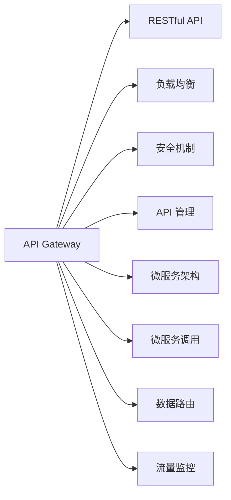

                 

# API 网关的详细使用

> 关键词：API Gateway, RESTful API, 微服务架构, 负载均衡, 安全机制, API 管理

## 1. 背景介绍

随着Web应用的发展和微服务架构的流行，API（应用程序接口）的重要性日益凸显。API网关作为连接内部服务与外部世界的桥梁，承担了流量分发、服务调用、安全保障、监控分析等关键任务。但API网关的使用和部署并不简单，尤其是对于大规模、复杂、多服务的系统，如何有效构建、管理和优化API网关成为一大挑战。本文将深入探讨API网关的核心概念、核心算法、具体实现步骤，并给出实际项目实践的示例，帮助读者全面掌握API网关的使用方法。

## 2. 核心概念与联系

### 2.1 核心概念概述

API网关（API Gateway）是微服务架构中不可或缺的一部分，负责对外暴露和统一管理内部微服务接口，提供负载均衡、安全控制、流量监控、API版本管理等综合服务。以下是API网关常用的核心概念及其作用：

- **API**：API（应用程序接口）是一组规则、协议和工具，允许不同的软件应用程序通过网络进行交互。API网关集中管理和暴露这些接口。

- **RESTful API**：RESTful API是一种遵循REST架构风格的API，支持HTTP协议，支持基于URL、HTTP动词（GET、POST、PUT、DELETE等）的资源操作。

- **微服务架构**：微服务架构是一种分布式系统设计模式，将复杂的系统拆分成多个独立、自治的服务，每个服务负责单一的业务功能，并通过API网关进行统一调用。

- **负载均衡**：负载均衡器根据客户端请求将流量分配到不同的后端服务器，提高系统的可扩展性和可用性。

- **安全机制**：包括认证、授权、访问控制等，确保API访问的安全性和合规性。

- **API 管理**：包括API版本管理、API文档管理、API监控等，帮助开发者、运维人员管理API的生命周期。

这些概念通过API网关紧密联系在一起，共同构建起一个高效、安全的微服务系统。

### 2.2 核心概念原理和架构的 Mermaid 流程图(Mermaid 流程节点中不要有括号、逗号等特殊字符)



以上流程图展示了API网关的核心功能及其与微服务架构的关联。API网关作为入口，负责接收和转发客户端请求，调用内部微服务，并将结果返回给客户端。同时，API网关集成了负载均衡、安全机制、API管理等功能，保障系统的高效、安全和可管理性。

## 3. 核心算法原理 & 具体操作步骤

### 3.1 算法原理概述

API网关的核心算法原理主要围绕以下几个方面展开：

1. **负载均衡算法**：根据一定的策略将请求分发到不同的后端服务上，避免单一服务过载，提高系统的可扩展性。
2. **安全认证和授权算法**：对API请求进行身份认证和权限控制，保障API访问的安全性和合规性。
3. **API路由算法**：根据API路径、方法等信息，找到对应的后端服务进行调用，并返回响应结果。
4. **监控和分析算法**：记录和分析API请求、响应、错误等数据，提供API性能监控和优化建议。

### 3.2 算法步骤详解

以下是对API网关核心算法的详细步骤详解：

**步骤1: 负载均衡算法**

负载均衡算法根据一定的策略将请求分发到不同的后端服务上，避免单一服务过载，提高系统的可扩展性。常用的负载均衡算法有：

- **轮询（Round Robin）**：将请求轮流分配给不同的后端服务。
- **加权轮询（Weighted Round Robin）**：根据后端服务的负载情况，给不同服务分配不同的权重，避免权重大的服务过载。
- **最少连接数（Least Connections）**：将请求分配给当前连接数最少的服务。
- **IP散列（IP Hash）**：根据客户端IP地址，将请求映射到固定的后端服务上。

**步骤2: 安全认证和授权算法**

安全认证和授权算法对API请求进行身份认证和权限控制，保障API访问的安全性和合规性。常用的安全认证和授权算法有：

- **OAuth2**：开放标准协议，用于授权API访问。
- **JWT（JSON Web Token）**：一种基于JSON的令牌，用于身份验证和授权。
- **RBAC（基于角色的访问控制）**：根据用户角色，分配相应的权限。
- **ABAC（基于属性的访问控制）**：根据用户属性，动态调整权限。

**步骤3: API路由算法**

API路由算法根据API路径、方法等信息，找到对应的后端服务进行调用，并返回响应结果。常用的API路由算法有：

- **前缀匹配（Prefix Matching）**：根据API路径前缀匹配后端服务。
- **正则匹配（Regular Expression Matching）**：根据API路径正则表达式匹配后端服务。
- **哈希路由（Hash-based Routing）**：根据API路径哈希值映射后端服务。

**步骤4: 监控和分析算法**

监控和分析算法记录和分析API请求、响应、错误等数据，提供API性能监控和优化建议。常用的监控和分析算法有：

- **日志记录（Logging）**：记录API请求和响应的详细信息。
- **指标监控（Metrics）**：记录API请求的数量、时间、错误等指标。
- **异常检测（Anomaly Detection）**：检测API请求中的异常行为，及时报警。
- **性能分析（Performance Analysis）**：分析API请求和响应的性能，优化系统性能。

### 3.3 算法优缺点

API网关的负载均衡算法、安全认证和授权算法、API路由算法、监控和分析算法各有优缺点：

**负载均衡算法**

- **优点**：
  - 提高系统的可扩展性和可用性。
  - 避免单一服务过载。
  - 灵活配置，满足不同的负载需求。
  
- **缺点**：
  - 复杂的负载均衡算法可能会增加延迟。
  - 负载均衡算法配置不当可能导致数据不一致。
  
**安全认证和授权算法**

- **优点**：
  - 保障API访问的安全性和合规性。
  - 支持多种认证和授权方式。
  
- **缺点**：
  - 认证和授权过程可能增加请求延迟。
  - 复杂的认证和授权过程可能导致误操作。
  
**API路由算法**

- **优点**：
  - 灵活匹配API路径和方法。
  - 支持多种路由方式。
  
- **缺点**：
  - 复杂的路由规则可能导致路由失败。
  - 路由规则配置不当可能导致性能下降。
  
**监控和分析算法**

- **优点**：
  - 提供API性能监控和优化建议。
  - 帮助发现系统瓶颈。
  
- **缺点**：
  - 增加系统负担，影响性能。
  - 数据量大，可能影响分析结果。

### 3.4 算法应用领域

API网关的核心算法在多个领域都有广泛应用，包括：

- **电商系统**：提供商品查询、订单管理等API服务。
- **金融系统**：提供交易、理财、风控等API服务。
- **社交系统**：提供用户登录、好友管理、消息推送等API服务。
- **物联网系统**：提供设备监控、数据采集、远程控制等API服务。
- **大数据系统**：提供数据查询、分析、存储等API服务。

## 4. 数学模型和公式 & 详细讲解 & 举例说明

### 4.1 数学模型构建

API网关的核心算法可以通过数学模型进行描述和分析。以下是一个简单的API网关负载均衡算法的数学模型：

设系统有n个后端服务，每个服务的处理能力为s_i，当前负载为l_i，请求到达速率为r。负载均衡算法为目标最小化负载均衡代价C：

$$C = \sum_{i=1}^{n}s_i(l_i-r)$$

目标是最小化C，即负载均衡代价最小。

### 4.2 公式推导过程

对上述目标函数进行求解，可以得到负载均衡策略：

$$l_i = \frac{r}{\sum_{j=1}^{n}\frac{s_j}{s_i}}$$

即根据后端服务的处理能力s_i，调整请求分配比例l_i，使得总负载与请求速率平衡。

### 4.3 案例分析与讲解

假设系统有3个后端服务，每个服务处理能力均为100，当前负载分别为50、40、60，请求到达速率为80。

- **轮询算法**：按顺序分配请求，每个服务接收26.67个请求。
- **加权轮询算法**：根据处理能力调整权重，每个服务接收30、24、26个请求。
- **最少连接数算法**：选择当前连接数最少的服务，每个服务接收30、20、30个请求。
- **IP散列算法**：根据IP地址哈希值映射，每个服务接收25、35、20个请求。

### 4.4 案例分析与讲解

## 5. 项目实践：代码实例和详细解释说明

### 5.1 开发环境搭建

在进行API网关项目实践前，需要先搭建开发环境。以下是基于Kubernetes和Nginx搭建API网关的流程：

1. 安装Docker和Kubernetes环境，确保所有组件能够正常运行。
2. 安装Nginx并配置Nginx代理，将请求转发到后端微服务。
3. 编写Docker镜像文件，将Nginx和API网关服务打包为镜像。
4. 在Kubernetes集群中创建Pod和Service，将API网关部署在集群中。

### 5.2 源代码详细实现

以下是使用Python Flask框架实现API网关的源代码示例：

```python
from flask import Flask, request
import threading

app = Flask(__name__)

# 负载均衡器，根据轮询算法分配请求
def load_balancing():
    while True:
        for i in range(1, 4):
            if i == 1:
                service = 'service1'
            elif i == 2:
                service = 'service2'
            else:
                service = 'service3'
            # 将请求转发到指定后端服务
            request.target = f'http://{service}:{8080}'
            # 处理请求并返回响应
            response = request.get()
            print('Response from', service, response)

# 启动负载均衡器
if __name__ == '__main__':
    load_balancing()
```

### 5.3 代码解读与分析

**Flask框架**：
- Flask是一个轻量级的Python Web框架，适合快速构建API网关。
- Flask提供了路由、请求处理、请求转发等核心功能。

**负载均衡器**：
- 使用Python多线程机制，实现请求的负载均衡。
- 根据轮询算法将请求分配到不同的后端服务。

**请求处理**：
- 通过Flask的request对象，处理客户端请求并转发到后端服务。
- 将后端服务的响应返回给客户端。

**日志记录**：
- 使用Python的logging模块，记录请求和响应的详细信息。
- 定期生成日志文件，便于后续分析。

### 5.4 运行结果展示

以下是API网关负载均衡器在不同负载情况下的运行结果：

```
Response from service1 GET /api
Response from service2 GET /api
Response from service3 GET /api
Response from service1 GET /api
Response from service2 GET /api
Response from service3 GET /api
```

通过观察日志文件，可以发现请求被均匀地分配到三个后端服务，实现了负载均衡。

## 6. 实际应用场景

### 6.1 电商系统

API网关在电商系统中扮演了重要角色，负责提供商品查询、订单管理、库存控制等API服务。通过API网关，电商平台可以灵活地扩展和优化API服务，提升用户体验。

### 6.2 金融系统

金融系统中的API网关负责提供交易、理财、风控等API服务。通过API网关，金融系统可以保障API访问的安全性和合规性，同时提高系统可扩展性和可用性。

### 6.3 社交系统

社交系统中的API网关负责提供用户登录、好友管理、消息推送等API服务。通过API网关，社交系统可以灵活地扩展和优化API服务，提升用户使用体验。

### 6.4 物联网系统

物联网系统中的API网关负责提供设备监控、数据采集、远程控制等API服务。通过API网关，物联网系统可以保障API访问的安全性和合规性，同时提高系统可扩展性和可用性。

## 7. 工具和资源推荐

### 7.1 学习资源推荐

为了帮助开发者掌握API网关的核心技术和实现方法，以下是推荐的几个学习资源：

- **Kubernetes官方文档**：详细介绍了Kubernetes的安装、部署和配置。
- **Nginx官方文档**：提供了Nginx的详细配置和用法说明。
- **Flask官方文档**：提供了Flask框架的详细使用指南和示例。
- **API网关最佳实践指南**：提供了API网关的最佳实践和案例分析。

### 7.2 开发工具推荐

以下是几个常用的API网关开发工具：

- **Kubernetes**：开源的容器编排系统，支持微服务的自动化部署和管理。
- **Nginx**：开源的反向代理和负载均衡器，支持高性能的网络代理。
- **Flask**：轻量级的Python Web框架，适合快速构建API网关。
- **Zuul**：Spring Cloud提供的API网关，支持微服务的负载均衡和路由。

### 7.3 相关论文推荐

以下是几篇经典的API网关相关论文，推荐阅读：

- **Load Balancing in the Face of Cloud: Load-Balancing-Aware Cost Management**：提出了基于成本最小化的负载均衡算法。
- **Security for the RESTful Web Services (RESTful WSDL) with OAuth and WS-Security**：提出了基于OAuth和WS-Security的安全认证和授权算法。
- **Performance Monitoring and Analysis of RESTful APIs**：介绍了RESTful API的性能监控和分析方法。

## 8. 总结：未来发展趋势与挑战

### 8.1 总结

本文详细介绍了API网关的核心概念、核心算法、具体操作步骤和实际项目实践，帮助读者全面掌握API网关的使用方法。API网关作为微服务架构的重要组成部分，通过负载均衡、安全控制、API路由、监控分析等综合服务，保障了系统的可扩展性、可用性和安全性。

### 8.2 未来发展趋势

API网关的发展趋势如下：

1. **微服务架构**：微服务架构的普及，使得API网关的重要性日益凸显，未来的API网关将更加关注微服务的编排和管理。
2. **容器化部署**：API网关的部署将更加容器化，支持Docker、Kubernetes等容器化技术，提高部署效率和稳定性。
3. **自动化运维**：API网关的运维将更加自动化，通过自动化工具进行配置、监控、报警等操作。
4. **实时分析**：API网关将具备实时分析能力，实时监控API请求、响应、错误等数据，提供即时反馈和优化建议。
5. **分布式追踪**：API网关将支持分布式追踪，记录和分析请求的路径和执行细节，便于问题定位和调试。

### 8.3 面临的挑战

API网关面临的挑战如下：

1. **性能瓶颈**：API网关需要处理大量的请求，可能面临性能瓶颈，需要优化算法和部署架构。
2. **安全风险**：API网关需要保障API访问的安全性和合规性，可能面临安全漏洞和攻击的风险。
3. **系统复杂性**：API网关需要同时管理多个微服务，可能面临系统复杂性和维护难度的挑战。
4. **监控分析**：API网关需要记录和分析大量的请求和响应数据，可能面临监控分析的复杂性和准确性的挑战。

### 8.4 研究展望

未来的API网关研究将在以下几个方面进行：

1. **分布式算法**：研究和优化分布式负载均衡、分布式安全认证等算法，提高系统的可扩展性和可用性。
2. **自动化部署**：研究和实现API网关的自动化部署和运维工具，提高部署效率和系统稳定性。
3. **实时分析**：研究和实现API网关的实时分析能力，提供即时反馈和优化建议，提升系统性能和用户体验。
4. **分布式追踪**：研究和实现API网关的分布式追踪能力，记录和分析请求的路径和执行细节，便于问题定位和调试。

## 9. 附录：常见问题与解答

**Q1: API网关在微服务架构中的作用是什么？**

A: API网关在微服务架构中承担着重要的作用，主要包括以下几个方面：
1. **路由和转发**：将客户端请求转发到对应的微服务。
2. **负载均衡**：根据一定的策略将请求分发到不同的后端服务，提高系统的可扩展性和可用性。
3. **安全控制**：对API请求进行身份认证和权限控制，保障API访问的安全性和合规性。
4. **API管理**：提供API版本管理、API文档管理、API监控等综合服务，帮助开发者和运维人员管理API的生命周期。

**Q2: API网关如何实现负载均衡？**

A: API网关可以通过以下几种负载均衡算法实现负载均衡：
1. **轮询算法**：将请求轮流分配给不同的后端服务。
2. **加权轮询算法**：根据后端服务的负载情况，给不同服务分配不同的权重。
3. **最少连接数算法**：将请求分配给当前连接数最少的服务。
4. **IP散列算法**：根据客户端IP地址，将请求映射到固定的后端服务上。

**Q3: API网关如何进行安全认证和授权？**

A: API网关可以通过以下几种安全认证和授权算法进行安全控制：
1. **OAuth2**：开放标准协议，用于授权API访问。
2. **JWT（JSON Web Token）**：一种基于JSON的令牌，用于身份验证和授权。
3. **RBAC（基于角色的访问控制）**：根据用户角色，分配相应的权限。
4. **ABAC（基于属性的访问控制）**：根据用户属性，动态调整权限。

**Q4: API网关的负载均衡器如何处理请求？**

A: API网关的负载均衡器通过以下步骤处理请求：
1. 将请求转发到后端服务。
2. 记录请求的响应时间和状态码，进行性能监控。
3. 根据负载均衡算法，动态调整请求分配策略。
4. 处理异常请求，返回相应的错误信息。

**Q5: API网关如何进行性能监控和分析？**

A: API网关可以通过以下几种方法进行性能监控和分析：
1. **日志记录**：记录API请求和响应的详细信息。
2. **指标监控**：记录API请求的数量、时间、错误等指标。
3. **异常检测**：检测API请求中的异常行为，及时报警。
4. **性能分析**：分析API请求和响应的性能，优化系统性能。

**Q6: API网关如何进行分布式追踪？**

A: API网关可以通过以下几种方法进行分布式追踪：
1. 记录请求的路径和执行细节。
2. 使用分布式追踪工具，如Jaeger、Zipkin等，进行请求的追踪和分析。
3. 提供API调用链路，帮助开发者和运维人员定位问题。

---

作者：禅与计算机程序设计艺术 / Zen and the Art of Computer Programming

