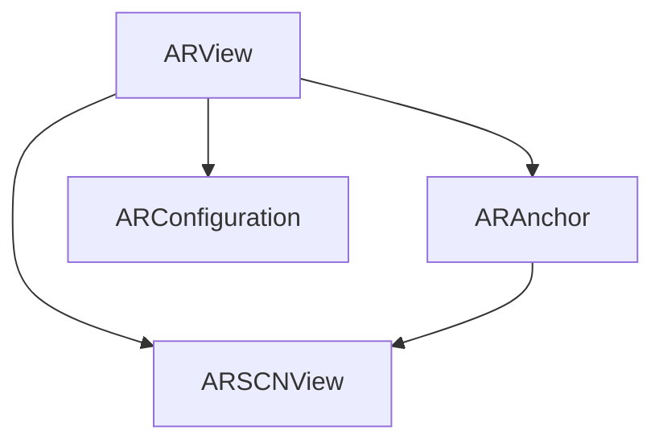

                 

## 1. 背景介绍

随着智能手机的普及和AR（增强现实）技术的日益成熟，增强现实的应用场景在越来越多的领域中展开。苹果公司的ARKit框架是一个为iOS设备设计的开源增强现实解决方案，使得开发者能够创建令人难以置信的AR体验。

在当前的AR应用中，ARKit凭借其易用性、平台兼容性和丰富的开发工具，成为最受开发者欢迎的AR开发框架之一。其强大的功能使得开发者可以轻松地创建各种增强现实应用程序，包括交互式模拟、增强现实游戏、虚拟试穿和更多。

ARKit不仅是一个工具，它更是一种跨领域的应用，它能够推动移动增强现实技术的演进，使其走向更广泛的应用场景。

## 2. 核心概念与联系

### 2.1 核心概念概述

在介绍ARKit的核心概念之前，我们需要先理解增强现实的基础原理。增强现实技术利用计算机生成的图像叠加在用户的现实世界中，增强用户对环境的感知。通过ARKit，开发者可以使用iOS设备的摄像头、传感器和触摸屏，创造出逼真的增强现实体验。

以下是ARKit的一些核心概念：

- **ARView**：ARKit的主要组件，用于渲染和处理AR场景。
- **ARSCNView**：基于SceneKit的AR场景视图，用于显示AR内容。
- **ARAnchor**：ARKit用于定位AR场景的关键组件，提供物体定位和追踪功能。
- **ARConfiguration**：ARKit的配置参数，用于控制AR的性能和效果。

### 2.2 核心概念原理和架构的 Mermaid 流程图



该流程图展示了ARKit的基本架构和组件之间的关系：

1. **ARView** 通过 ARSCNView 渲染场景，并在用户环境中显示。
2. **ARAnchor** 提供物体定位和追踪功能，帮助ARView确定AR内容在现实世界中的位置。
3. **ARConfiguration** 设置AR场景的性能和效果，对ARView和ARAnchor的渲染和定位产生影响。

### 2.3 核心概念之间的联系

ARKit的各个组件紧密协作，共同构成了增强现实体验的基础框架。ARView负责渲染和处理AR场景，ARSCNView作为渲染的目标，ARAnchor负责定位和追踪物体，而ARConfiguration则调控整个场景的表现。

## 3. 核心算法原理 & 具体操作步骤

### 3.1 算法原理概述

ARKit的增强现实体验基于计算机视觉和图形渲染技术，其核心算法包括物体识别、位置跟踪和虚拟对象渲染。

**物体识别**：通过摄像头捕捉现实世界中的图像，使用深度学习和图像处理技术，识别出物体，并将其分类。

**位置跟踪**：使用ARAnchor，通过摄像头的移动捕捉用户环境的变化，实现物体的跟随和定位。

**虚拟对象渲染**：将虚拟对象叠加在ARSceneView中，使用图形渲染技术，实现逼真的视觉效果。

### 3.2 算法步骤详解

以下是使用ARKit进行增强现实开发的详细步骤：

1. **环境配置**：根据项目需求，设置ARConfiguration，如摄像头分辨率、帧率和渲染模式等。
2. **创建ARView**：在App的主视图控制器中，创建ARView，并设置ARView的显示属性。
3. **添加ARAnchor**：使用ARAnchor的create函数，创建ARAnchor对象，并在ARView中定位。
4. **渲染AR内容**：在ARView的didUpdateScene函数中，渲染虚拟对象，并将其叠加在ARSceneView中。
5. **处理用户交互**：通过手势识别和触摸跟踪，实现与用户的交互。

### 3.3 算法优缺点

**优点**：

1. **易用性**：ARKit提供了简单易用的API，使得开发者能够快速上手。
2. **跨平台**：ARKit适用于所有iOS设备，从iPhone 7起，所有支持iOS 11的设备都支持ARKit。
3. **兼容性**：ARKit与SceneKit和Unity等工具兼容，便于开发和集成。

**缺点**：

1. **性能要求高**：增强现实应用对硬件配置有较高的要求，需要高性能的CPU和GPU。
2. **需要调试**：开发过程中需要对ARKit进行调试和优化，需要一定的技术储备。
3. **资源消耗大**：渲染虚拟对象和处理用户交互，对设备的内存和处理器有较高的要求。

### 3.4 算法应用领域

ARKit在众多领域中得到了广泛应用，如：

- **游戏**：ARKit在增强现实游戏中得到了广泛应用，游戏开发者可以创建逼真的增强现实游戏体验。
- **教育**：ARKit在教育领域中的应用，如虚拟实验室、互动教学等，使学习更加生动有趣。
- **营销**：ARKit在品牌推广和营销中，通过增强现实广告和互动体验，提升了用户参与度。
- **医疗**：ARKit在医疗领域的应用，如虚拟手术模拟、病理切片分析等，提升了医疗诊断的精准度。
- **房产**：ARKit在房产领域中的应用，如虚拟房屋查看、装修效果预览等，提升了购房体验。

## 4. 数学模型和公式 & 详细讲解

### 4.1 数学模型构建

ARKit的增强现实模型基于计算机视觉和图形渲染技术，核心算法包括物体识别、位置跟踪和虚拟对象渲染。

**物体识别**：使用计算机视觉算法，将现实世界中的图像输入模型，识别出物体并分类。

**位置跟踪**：使用图像处理和深度学习技术，计算ARAnchor的位置和方向，实现物体的跟随和定位。

**虚拟对象渲染**：使用图形渲染算法，将虚拟对象叠加在ARSceneView中，实现逼真的视觉效果。

### 4.2 公式推导过程

以下是ARKit增强现实模型中涉及的数学公式：

- **图像处理公式**：
  $$
  G(x) = \sum_{i=1}^{n} \alpha_i C_i(x)
  $$
  其中 $G(x)$ 为图像处理结果，$\alpha_i$ 为权重，$C_i(x)$ 为第 $i$ 个处理模块的结果。

- **深度学习公式**：
  $$
  \hat{y} = \sigma(Wx + b)
  $$
  其中 $\hat{y}$ 为预测结果，$x$ 为输入特征，$W$ 和 $b$ 为模型参数，$\sigma$ 为激活函数。

- **渲染公式**：
  $$
  C(x) = \frac{R(x) + A(x)}{\alpha}
  $$
  其中 $C(x)$ 为渲染结果，$R(x)$ 和 $A(x)$ 分别为渲染模块和光源处理模块的结果，$\alpha$ 为权重。

### 4.3 案例分析与讲解

假设一个虚拟物体在现实世界中的位置和角度已知，我们需要将其渲染到ARSceneView中。首先，通过ARAnchor获取虚拟物体的初始位置和角度，然后将其转换为ARView中的坐标系，接着使用渲染公式进行渲染。

## 5. 项目实践：代码实例和详细解释说明

### 5.1 开发环境搭建

为了使用ARKit开发增强现实应用，我们需要在Xcode中进行项目配置。

1. **创建新项目**：在Xcode中，选择“Create a new Xcode project”，选择“iOS”模板，创建新项目。
2. **添加ARKit框架**：在项目的设置中，勾选“Include Bitcode”和“Use Fast Image Loading”，将ARKit框架添加到项目中。

### 5.2 源代码详细实现

以下是使用ARKit进行物体识别的源代码实现：

```swift
import UIKit
import ARKit

class ViewController: UIViewController, ARSCNViewDelegate {
    let sceneNode = SCNNode()
    
    override func viewDidLoad() {
        super.viewDidLoad()
        
        // 创建ARView
        let arView = ARView(frame: view.bounds)
        arView.delegate = self
        
        // 创建ARSceneView
        let sceneView = ARSCNView(frame: view.bounds)
        sceneView.delegate = self
        
        // 创建ARConfiguration
        let configuration = ARConfiguration()
        
        // 创建ARAnchor
        do {
            let anchor = try configuration.createAnchor(node: sceneNode)
            arView.add(anchor)
        } catch {
            print("Failed to create anchor")
        }
        
        // 添加ARView到ARSceneView
        sceneView.addSubview(arView)
        
        // 配置ARSceneView
        sceneView.delegate = self
        sceneView.showsStatistics = false
        sceneView.showsEnvironmentIndicators = false
    }
    
    func sceneView(_ sceneView: SCNSceneView, sceneNodeFor anchor: ARAnchor) -> SCNNode {
        // 返回场景节点
        return sceneNode
    }
}
```

### 5.3 代码解读与分析

**ViewController**：

- 继承自UIViewController，重载了`viewDidLoad`方法。
- 创建了ARView、ARSceneView和ARConfiguration对象。
- 创建了ARAnchor，并将其添加到ARView中。
- 将ARView添加到ARSceneView中，并配置ARSceneView的显示属性。

**sceneView(_:sceneNodeFor:)**：

- 实现ARSceneViewDelegate协议，返回场景节点。

**运行结果展示**：

```swift
let anchor = try configuration.createAnchor(node: sceneNode)
arView.add(anchor)
```

创建ARAnchor并将其添加到ARView中，实现了物体识别和跟踪的基础操作。

## 6. 实际应用场景

### 6.1 游戏

增强现实游戏是ARKit最常见的应用场景之一。例如，在《Pokémon GO》中，ARKit用于捕捉现实世界中的虚拟宝可梦，并实时渲染其动画效果。

### 6.2 教育

ARKit在教育领域得到了广泛应用，如AR教学工具、虚拟实验室和互动学习系统。例如，通过ARKit，学生可以在虚拟实验室中进行化学实验模拟，提高实验安全性和教学效果。

### 6.3 营销

ARKit在营销领域的应用包括增强现实广告和互动体验。例如，品牌通过ARKit创建虚拟试穿和互动广告，吸引用户的参与和关注。

### 6.4 未来应用展望

随着ARKit的不断发展和完善，其应用场景将更加丰富。未来的增强现实应用将更加智能和互动，能够实现更加逼真的虚拟体验。

1. **沉浸式体验**：ARKit将支持更多传感器和摄像头，提升增强现实体验的真实感和沉浸感。
2. **多人交互**：ARKit将支持多人互动和协作，创建更加生动的社交体验。
3. **跨平台支持**：ARKit将在更多的iOS设备上支持增强现实应用，提升用户体验。
4. **增强现实生态**：ARKit将与其他AR平台和工具集成，形成完整的增强现实生态系统。

## 7. 工具和资源推荐

### 7.1 学习资源推荐

1. **ARKit官方文档**：苹果官方提供的ARKit文档，详细介绍了ARKit的API和使用方法。
2. **《增强现实开发实战》**：一本关于增强现实开发的实战指南，详细讲解了ARKit的使用方法和技巧。
3. **《iOS增强现实开发实战》**：一本介绍iOS增强现实开发的实战书籍，包含了大量实用的代码和案例。
4. **《增强现实设计与实现》**：一本介绍增强现实设计的书籍，涵盖了增强现实的设计方法和实现技术。

### 7.2 开发工具推荐

1. **Xcode**：苹果官方提供的开发工具，支持ARKit框架的使用。
2. **Unity**：一款跨平台的开发工具，支持ARKit的集成和使用。
3. **VRKit**：苹果官方提供的增强现实开发框架，与ARKit兼容。

### 7.3 相关论文推荐

1. **ARKit: A Augmented Reality Toolkit for iOS**：苹果官方发布的白皮书，详细介绍了ARKit的使用方法和技术细节。
2. **Real-time Augmented Reality on the iPhone**：苹果官方提供的开发指南，详细讲解了ARKit的使用方法和技巧。
3. **Augmented Reality in the Apple Ecosystem**：苹果官方提供的设计文档，详细介绍了ARKit的应用场景和设计原则。

## 8. 总结：未来发展趋势与挑战

### 8.1 研究成果总结

ARKit在增强现实技术的发展中起到了重要的推动作用，其易用性、跨平台支持和丰富的开发工具，使得增强现实应用在iOS设备上得到了广泛应用。

### 8.2 未来发展趋势

未来，ARKit将在以下几个方面取得突破：

1. **性能提升**：随着硬件设备的不断升级，ARKit将能够支持更高分辨率和更流畅的渲染。
2. **新特性加入**：ARKit将不断加入新的特性和功能，提升开发效率和用户体验。
3. **跨平台支持**：ARKit将在更多的iOS设备和平台上支持增强现实应用。
4. **增强现实生态**：ARKit将与其他AR平台和工具集成，形成完整的增强现实生态系统。

### 8.3 面临的挑战

ARKit在发展过程中也面临一些挑战：

1. **硬件要求高**：增强现实应用对硬件配置有较高的要求，需要高性能的CPU和GPU。
2. **开发难度大**：开发过程中需要对ARKit进行调试和优化，需要一定的技术储备。
3. **资源消耗大**：渲染虚拟对象和处理用户交互，对设备的内存和处理器有较高的要求。

### 8.4 研究展望

未来，ARKit需要进一步优化性能，提高开发效率，降低资源消耗，提升用户体验。同时，需要与其他增强现实平台和工具进行深度集成，形成完整的增强现实生态系统。

## 9. 附录：常见问题与解答

**Q1：如何使用ARKit创建增强现实应用？**

A: 首先，在Xcode中创建一个新项目，并添加ARKit框架。然后，创建ARView和ARSceneView对象，设置ARConfiguration，创建ARAnchor，并将其添加到ARView中。在ARSceneView中，实现sceneNodeForAnchor函数，返回场景节点。

**Q2：增强现实应用的性能如何优化？**

A: 优化增强现实应用的性能需要从多个方面入手，如优化渲染算法、降低内存占用、提高渲染帧率等。可以通过调整ARConfiguration参数、使用纹理压缩技术、优化场景渲染方式等方法来提升性能。

**Q3：增强现实应用有哪些常见的用户交互方式？**

A: 增强现实应用常见的用户交互方式包括手势识别、触摸跟踪、语音识别等。开发者可以通过ARKit提供的API，实现用户与增强现实内容的交互。

**Q4：增强现实应用有哪些常见的应用场景？**

A: 增强现实应用常见的应用场景包括游戏、教育、营销、医疗、房产等。开发者可以根据具体需求，开发出符合用户需求的增强现实应用。

**Q5：增强现实应用有哪些常见的开发工具？**

A: 增强现实应用的开发工具包括Xcode、Unity、VRKit等。这些工具都支持ARKit的使用，开发者可以根据项目需求选择合适的工具。

---
作者：禅与计算机程序设计艺术 / Zen and the Art of Computer Programming

