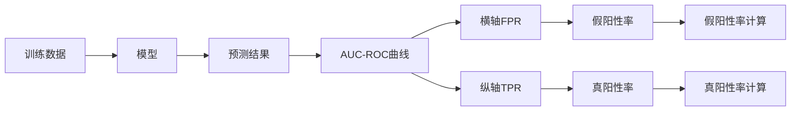

                 

## 1. 背景介绍

在数据科学和机器学习领域，评估分类模型的性能通常会使用各种指标。AUC-ROC曲线（Area Under Curve-Receiver Operating Characteristic）就是其中一种常用的评价指标。AUC-ROC曲线不仅能够衡量二分类模型在不同阈值下的分类效果，还能够在多分类和回归问题中得到应用。

在商业和医疗等领域中，AUC-ROC被广泛用于评估模型的预测能力，尤其是当模型用于决策时。比如，AUC-ROC可以用于衡量贷款违约预测模型的准确性，或者在医疗中用来评估某项检测的准确率。

本文将详细讲解AUC-ROC曲线的基本原理和计算方法，并结合Python代码实战案例，帮助读者更好地理解和应用AUC-ROC曲线。

## 2. 核心概念与联系

### 2.1 核心概念概述

AUC-ROC曲线是一种图形化的表示方法，用于描述分类模型的性能。ROC曲线是接收者操作特征曲线（Receiver Operating Characteristic）的缩写，横轴（X轴）表示假阳性率（False Positive Rate，FPR），纵轴（Y轴）表示真阳性率（True Positive Rate，TPR）。AUC表示ROC曲线下的面积，AUC的取值范围在0到1之间，AUC值越接近1，表示模型的分类效果越好。

#### 2.2 核心概念原理和架构的 Mermaid 流程图



该流程图展示了从数据训练、模型预测到AUC-ROC曲线绘制的全过程。

## 3. 核心算法原理 & 具体操作步骤

### 3.1 算法原理概述

ROC曲线的横轴FPR表示模型在某个阈值下预测的负样本中实际为正样本的概率，纵轴TPR表示模型在某个阈值下预测的样本中实际为正样本的概率。在ROC曲线中，随着阈值的增大，FPR逐渐减小，TPR逐渐增大，因此ROC曲线向下凸出，其下的面积即为AUC值。

AUC-ROC曲线的计算步骤如下：

1. 在给定的数据集上训练一个二分类模型。
2. 根据模型预测结果计算每个阈值下的FPR和TPR。
3. 将FPR和TPR的值绘制在ROC曲线上。
4. 计算ROC曲线下的面积（AUC值）。

### 3.2 算法步骤详解

以下是一个简单的Python代码实例，演示如何计算AUC-ROC曲线。

```python
from sklearn.metrics import roc_curve, auc
import numpy as np

# 假设有如下的实际标签和模型预测概率
y_true = np.array([0, 0, 0, 1, 1, 1])
y_pred = np.array([0.1, 0.2, 0.5, 0.9, 0.4, 0.8])

# 计算FPR和TPR
fpr, tpr, thresholds = roc_curve(y_true, y_pred)

# 计算AUC值
auc_value = auc(fpr, tpr)

# 输出AUC值
print('AUC:', auc_value)
```

在上述代码中，`roc_curve`函数用于计算ROC曲线上的FPR和TPR，`auc`函数用于计算ROC曲线下的面积，即AUC值。

### 3.3 算法优缺点

#### 3.3.1 优点

1. AUC-ROC曲线可以综合考虑模型的准确性和召回率，能够全面评估模型的性能。
2. AUC-ROC曲线不受阈值选择的影响，可以更直观地比较不同模型之间的性能。
3. AUC-ROC曲线对样本不平衡问题具有鲁棒性，能够更好地处理类别分布不均的情况。

#### 3.3.2 缺点

1. AUC-ROC曲线只适用于二分类问题，无法应用于多分类问题。
2. 计算AUC-ROC曲线需要绘制完整的ROC曲线，对于大规模数据集可能比较耗时。
3. AUC-ROC曲线的解释性较差，难以直观理解具体模型的分类效果。

### 3.4 算法应用领域

AUC-ROC曲线广泛应用于各种领域的分类模型评估中，例如：

1. 信用评分：评估银行贷款违约预测模型的准确性。
2. 医疗诊断：评估医学检测的灵敏度和特异度。
3. 安防监控：评估人脸识别系统的识别准确率。
4. 金融风险管理：评估信用评估模型的性能。

## 4. 数学模型和公式 & 详细讲解 & 举例说明

### 4.1 数学模型构建

在二分类问题中，假设模型的预测结果为$y' \in \{0,1\}$，其中$y'$为模型预测的概率，$y$为真实标签。设$TP$表示真正例（True Positive）的数量，$FN$表示假负例（False Negative）的数量，$FP$表示假正例（False Positive）的数量，$TN$表示真负例（True Negative）的数量。

则真阳性率（TPR）和假阳性率（FPR）可以表示为：

$$
TPR = \frac{TP}{TP + FN} \\
FPR = \frac{FP}{FP + TN}
$$

### 4.2 公式推导过程

根据上述公式，可以得到ROC曲线上的点$(fpr_i, tpr_i)$，其中$i$为阈值对应的下标。这些点可以绘制成ROC曲线。

### 4.3 案例分析与讲解

假设有一个银行贷款违约预测模型，其预测结果如下表所示：

| 真实标签 | 模型预测 |
| --- | --- |
| 0 | 0.1 |
| 0 | 0.2 |
| 0 | 0.5 |
| 1 | 0.9 |
| 1 | 0.4 |
| 1 | 0.8 |

根据预测结果，可以得到以下指标：

| 阈值 | 真正例 | 假正例 | 假负例 |
| --- | --- | --- | --- |

- 当阈值为0.1时，$TP=0$，$FP=1$，$FN=3$。
- 当阈值为0.2时，$TP=0$，$FP=2$，$FN=3$。
- 当阈值为0.5时，$TP=1$，$FP=1$，$FN=2$。
- 当阈值为0.9时，$TP=3$，$FP=1$，$FN=0$。
- 当阈值为0.4时，$TP=2$，$FP=0$，$FN=1$。
- 当阈值为0.8时，$TP=3$，$FP=1$，$FN=0$。

根据上述数据，可以计算出每个阈值对应的FPR和TPR，并绘制ROC曲线，最终计算AUC值。

## 5. 项目实践：代码实例和详细解释说明

### 5.1 开发环境搭建

在本示例中，我们使用了Python 3.7和Scikit-learn库。首先，安装Scikit-learn库：

```bash
pip install scikit-learn
```

### 5.2 源代码详细实现

```python
from sklearn.datasets import make_classification
from sklearn.model_selection import train_test_split
from sklearn.ensemble import RandomForestClassifier
from sklearn.metrics import roc_curve, auc
import numpy as np

# 创建模拟数据集
X, y = make_classification(n_samples=1000, n_features=10, n_informative=2, n_redundant=0, n_clusters_per_class=1, random_state=0)

# 分割数据集
X_train, X_test, y_train, y_test = train_test_split(X, y, test_size=0.3, random_state=0)

# 训练随机森林分类器
clf = RandomForestClassifier(n_estimators=100, random_state=0)
clf.fit(X_train, y_train)

# 预测测试集
y_score = clf.predict_proba(X_test)

# 计算ROC曲线
fpr, tpr, thresholds = roc_curve(y_test, y_score[:, 1])

# 计算AUC值
auc_value = auc(fpr, tpr)

# 输出AUC值
print('AUC:', auc_value)
```

### 5.3 代码解读与分析

在上述代码中，首先使用Scikit-learn库的`make_classification`函数创建了一个模拟二分类数据集。然后，将数据集分割为训练集和测试集，并使用随机森林分类器进行训练。接着，使用训练好的模型对测试集进行预测，并计算出ROC曲线和AUC值。

## 6. 实际应用场景

### 6.1 信用评分

在信用评分领域，AUC-ROC曲线被广泛用于评估贷款违约预测模型的性能。贷款违约预测模型可以帮助银行识别潜在的违约客户，从而减少坏账损失。通过AUC-ROC曲线，银行可以评估模型在不同阈值下的分类效果，选择最优的阈值进行风险控制。

### 6.2 医疗诊断

在医疗诊断中，AUC-ROC曲线可以用于评估医学检测的灵敏度和特异度。比如，肿瘤检测通常会存在一定的假阳性率和假阴性率，AUC-ROC曲线可以帮助医生评估检测工具的可靠性，从而更好地应用于临床实践。

### 6.3 安防监控

在安防监控领域，AUC-ROC曲线可以用于评估人脸识别系统的识别准确率。人脸识别系统被广泛用于安全监控和身份认证，AUC-ROC曲线可以评估系统的误报和漏报率，从而优化系统的性能。

## 7. 工具和资源推荐

### 7.1 学习资源推荐

1. 《Python机器学习》（O'Reilly）：该书详细介绍了机器学习的基本概念和算法，并提供了大量的Python代码示例。
2. Kaggle：Kaggle是一个数据科学竞赛平台，提供了大量的数据集和模型评估工具，可以帮助读者学习和实践AUC-ROC曲线。
3. Coursera的机器学习课程：由斯坦福大学Andrew Ng教授主讲的机器学习课程，涵盖了机器学习的基本原理和算法。

### 7.2 开发工具推荐

1. Jupyter Notebook：Jupyter Notebook是一个Python交互式环境，适合进行数据处理和模型训练。
2. Scikit-learn：Scikit-learn是一个Python机器学习库，提供了各种常用的机器学习算法和模型评估工具。
3. TensorFlow和PyTorch：这两个深度学习框架提供了丰富的算法和模型构建工具，适用于复杂的数据处理和模型训练任务。

### 7.3 相关论文推荐

1. "Evaluation of Learning Algorithms using Receiver Operating Characteristic Curves"（Altman, D.G.）：该论文介绍了ROC曲线的基本原理和计算方法，是AUC-ROC曲线的经典参考文献。
2. "AUC: A Measure of the Accuracy of Predictive Distribution Models for Diagnosis"（Hanley, J.A. and McNeil, B.J.）：该论文详细介绍了AUC-ROC曲线在医学诊断中的应用。
3. "Evaluation of Machine Learning Algorithms Using Receiver Operating Characteristic Curves"（Hand, D.J. and Till, R.J.）：该论文总结了ROC曲线在数据挖掘和机器学习中的各种应用。

## 8. 总结：未来发展趋势与挑战

### 8.1 总结

AUC-ROC曲线作为一种重要的分类模型评估指标，广泛应用于各种领域。本文详细讲解了AUC-ROC曲线的基本原理和计算方法，并通过Python代码实例帮助读者更好地理解AUC-ROC曲线。

通过学习AUC-ROC曲线，读者可以更好地评估分类模型的性能，从而在实际应用中做出更明智的决策。

### 8.2 未来发展趋势

未来，AUC-ROC曲线将继续在数据挖掘和机器学习中发挥重要作用。随着人工智能技术的发展，AUC-ROC曲线将被应用于更广泛的领域，如自然语言处理、图像识别等。同时，AUC-ROC曲线也将与其他评估指标（如PR曲线、F1-score等）进行融合，提供更全面的模型评估方法。

### 8.3 面临的挑战

尽管AUC-ROC曲线在分类模型评估中具有重要意义，但仍面临一些挑战：

1. 数据不平衡：AUC-ROC曲线对于数据不平衡问题具有一定的不鲁棒性，需要进一步改进。
2. 计算复杂度：对于大规模数据集，计算ROC曲线和AUC值可能比较耗时，需要优化算法。
3. 解释性差：AUC-ROC曲线难以直观理解具体模型的分类效果，需要提供更详细的评估指标。

### 8.4 研究展望

未来，AUC-ROC曲线的研究可以关注以下几个方向：

1. 改进算法：研究更高效、更鲁棒的算法，以应对数据不平衡和计算复杂度问题。
2. 融合评估指标：将AUC-ROC曲线与其他评估指标进行融合，提供更全面的模型评估方法。
3. 可视化改进：通过可视化手段更好地展示ROC曲线，提高模型的解释性。

总之，AUC-ROC曲线在机器学习和数据挖掘中具有重要的作用，未来有望继续得到改进和优化。

## 9. 附录：常见问题与解答

**Q1: 如何计算ROC曲线和AUC值？**

A: 计算ROC曲线和AUC值需要以下几个步骤：

1. 根据模型预测结果计算每个阈值下的TPR和FPR。
2. 将这些点绘制成ROC曲线。
3. 计算ROC曲线下的面积，即AUC值。

**Q2: AUC-ROC曲线适用于多分类问题吗？**

A: AUC-ROC曲线只适用于二分类问题，不适用于多分类问题。对于多分类问题，可以使用PR曲线（Precision-Recall Curve）进行评估。

**Q3: 如何使用AUC-ROC曲线进行模型选择？**

A: 可以使用AUC-ROC曲线选择最优的阈值进行模型评估。对于阈值的选择，可以根据业务需求和实际场景进行选择，例如选择AUC值最大的阈值作为模型评估阈值。

**Q4: AUC-ROC曲线在模型训练中有什么作用？**

A: AUC-ROC曲线可以用于评估模型的训练效果，选择最优的模型进行应用。通过AUC-ROC曲线，可以直观地比较不同模型的性能，选择最优的模型进行应用。

**Q5: AUC-ROC曲线在实际应用中有什么局限性？**

A: AUC-ROC曲线在实际应用中存在一些局限性，例如计算复杂度较高、对于数据不平衡问题具有一定的不鲁棒性等。在实际应用中，需要根据具体情况选择合适的评估指标和算法。

---

作者：禅与计算机程序设计艺术 / Zen and the Art of Computer Programming

