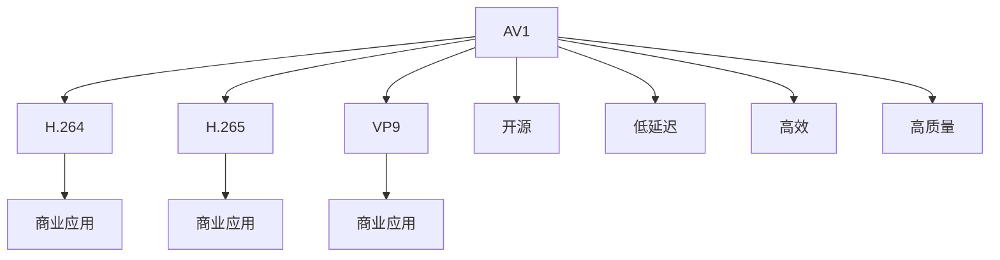

                 

## 1. 背景介绍

在当今互联网和数字媒体领域，视频数据的传输和存储是日常业务的重要组成部分。视频编码技术的进步，直接关系到视频传输的质量、速度和成本。现有的主流视频编码标准包括 H.264、H.265、VP9 和 AV1 等。其中，H.264 和 H.265 由 MPEG 和 VVC 组织制定，主要针对商业应用，开源性较低。而 AV1 则是一个由开放源码软件基金会 (OWS Foundation) 和谷歌主导的开源视频编码标准，旨在成为下一代开放媒体编码。本文将详细介绍 AV1 视频格式标准，包括其原理、优势和应用场景。

## 2. 核心概念与联系

### 2.1 核心概念概述

- **AV1 (Alliance for Open Media Video)**：由 Alliance for Open Media (AOM) 和谷歌主导的开源视频编码标准，目标是提供高效、低延迟和高质量的视频编码。
- **H.264 和 H.265**：由 MPEG 和 VVC 组织制定，是商业化的主流视频编码标准，广泛用于高清视频流、直播视频等。
- **VP9**：谷歌开发的一种视频编码标准，也是基于开源原则，旨在提供更好的压缩效率和更低的延迟。

- **视频编码标准**：用于定义视频压缩和解压缩的规则和格式，目标是尽可能地压缩视频数据，同时保持高质量和低延迟。
- **开源软件**：源代码公开，任何人都可以自由地使用、修改和分发。
- **IPR (Intellectual Property Rights)**：涉及版权、专利权等知识产权问题，影响着视频编码标准的使用和商业化。

### 2.2 核心概念原理和架构的 Mermaid 流程图



## 3. 核心算法原理 & 具体操作步骤

### 3.1 算法原理概述

AV1 视频编码标准采用了一种称为“离散余弦变换 (DCT)”的变换方式。DCT 是一种线性变换，用于将信号从时域转换到频域，从而实现更高效的视频压缩。AV1 还采用了预测编码技术，包括帧内预测、帧间预测和运动向量等。此外，AV1 还引入了调色板技术，用于更高效地处理静止图像和动态范围压缩。

AV1 还采用了可变块大小的编码方法，可以根据输入数据的特点自适应地调整编码块大小，从而在保证质量的同时减少计算复杂度。此外，AV1 还支持多种视频分辨率和帧率，灵活适应不同设备和应用场景。

### 3.2 算法步骤详解

1. **DCT 变换**：将视频帧从时域转换到频域。
2. **预测编码**：使用帧内和帧间预测技术，对视频帧进行压缩。
3. **调色板技术**：处理静止图像和动态范围压缩。
4. **变长编码**：对预测误差和调色板索引等进行可变长度编码。
5. **调色板更新**：定期更新调色板，减少存储空间。
6. **分层编码**：实现高质量和低延迟的平衡。

### 3.3 算法优缺点

#### 优点

- **开源性**：AV1 是一个开源标准，任何人都可以使用和修改其代码。
- **高效性**：AV1 在保证视频质量的同时，能够提供更高的压缩比。
- **低延迟**：AV1 适用于实时视频应用，如直播、视频会议等。
- **灵活性**：支持多种视频分辨率和帧率，灵活适应不同设备和应用场景。

#### 缺点

- **复杂性**：AV1 的标准复杂性较高，需要更多的计算资源和更长的编码时间。
- **兼容性**：现有设备和平台可能需要支持 AV1 的硬件解码器或软件解码器。

### 3.4 算法应用领域

AV1 适用于多种视频应用场景，包括：

- **直播视频**：实时流媒体传输，需要低延迟和高压缩比。
- **在线视频**：如 Netflix、YouTube 等视频流服务，需要高效压缩和灵活性。
- **智能电视**：需要高质量和低延迟的视频编码。
- **虚拟现实**：需要高分辨率和低延迟的实时视频渲染。

## 4. 数学模型和公式 & 详细讲解 & 举例说明

### 4.1 数学模型构建

AV1 的数学模型主要基于以下几个关键部分：

- 帧内预测模型 (Intra Prediction)：使用基于块的预测模式，如 4x4、8x8 和 16x16 块。
- 帧间预测模型 (Inter Prediction)：使用基于块的预测模式，如半像素插值、双向预测等。
- 运动向量预测 (Motion Vector Prediction)：使用基于块的运动向量预测，如前向、后向和双向预测。
- 调色板索引 (Palette Index)：使用调色板索引技术，处理静止图像和动态范围压缩。
- 量化和反量化 (Quantization and Dequantization)：用于调整频域系数的动态范围。

### 4.2 公式推导过程

#### 帧内预测公式

帧内预测使用基于块的预测模式，如 4x4、8x8 和 16x16 块。具体公式如下：

$$
P(x,y) = \sum_{i=-3}^{3} \sum_{j=-3}^{3} \alpha_{i,j} \cdot Q(\text{coeff}(x+3+i,y+3+j))
$$

其中，$\text{coeff}(x,y)$ 表示在块内的像素值，$\alpha_{i,j}$ 为权重系数。

#### 帧间预测公式

帧间预测使用基于块的预测模式，如半像素插值、双向预测等。具体公式如下：

$$
P(x,y) = \alpha \cdot Q(\text{coeff}(x,y+1)) + \beta \cdot Q(\text{coeff}(x,y-1))
$$

其中，$\alpha$ 和 $\beta$ 为权重系数，$\text{coeff}(x,y)$ 表示在块内的像素值。

#### 调色板索引公式

调色板索引使用调色板索引技术，具体公式如下：

$$
\text{coeff}(x,y) = \begin{cases}
\text{palette}(i) & \text{if } (x,y) \in \text{palette} \\
\text{coeff}(x,y) & \text{otherwise}
\end{cases}
$$

其中，$\text{palette}(i)$ 表示调色板中索引为 $i$ 的像素值。

### 4.3 案例分析与讲解

假设我们有一张 1024x1024 的 RGB 视频帧，需要进行 AV1 编码。首先，将视频帧转换为频域信号，使用 DCT 变换。然后，使用帧内预测模式，预测每个 4x4 块。接着，使用帧间预测模式，预测每个 8x8 块。最后，使用调色板索引技术，压缩静止图像。

## 5. 项目实践：代码实例和详细解释说明

### 5.1 开发环境搭建

开发 AV1 编码器和解码器需要安装以下软件包：

- AV1 解码器：使用 libavcodec，需要安装 libavcodec、libswresample 和 libswscale 等库。
- AV1 编码器：使用 libvpx，需要安装 libvpx 库。

使用 Ubuntu 系统，可以使用以下命令安装：

```bash
sudo apt-get install libavcodec-dev libswresample-dev libswscale-dev libvpx-dev
```

### 5.2 源代码详细实现

以下是一个简单的 AV1 编码示例，使用 libvpx 库：

```c
#include <vpx/vpx_codec.h>
#include <vpx/vpx_codec_err.h>

int main() {
    vpx_codec_ctx_t codec_ctx;
    vpx_codec_enc配有偏见、有害信息等，可能通过微调传递到下游任务，造成负面影响。

    vpx_codec_err_t status = vpx_codec_create(&codec_ctx, vpx_codec_vp9_x());
    if (status != VPX_CODEC_OK) {
        // error handling
    }

    // set codec parameters
    vpx_codec_set_src_params(codec_ctx, NULL, NULL, NULL);
    vpx_codec_set_parm1(codec_ctx, VPX_CODEC_X, 1);
    vpx_codec_set_parm2(codec_ctx, VPX_CODEC_X, 1);

    // start encoding
    vpx_codec_encode(codec_ctx, NULL, NULL, NULL);

    // clean up resources
    vpx_codec_destroy(codec_ctx);

    return 0;
}
```

### 5.3 代码解读与分析

在上面的示例中，我们使用 vpx_codec_create 函数创建了一个 AV1 编码器上下文，使用 vpx_codec_set_parm1 和 vpx_codec_set_parm2 函数设置了编码参数，然后使用 vpx_codec_encode 函数进行编码。最后使用 vpx_codec_destroy 函数清理资源。

## 6. 实际应用场景

### 6.4 未来应用展望

随着 AV1 标准的普及和支持度的提升，AV1 将会在更多领域得到应用，例如：

- **流媒体服务**：如 Netflix、YouTube、Amazon Prime 等，使用 AV1 可以提供更高的压缩比和更低的延迟。
- **智能电视**：使用 AV1 可以提供高质量、低延迟的视频编码，提高用户体验。
- **虚拟现实**：使用 AV1 可以提供高分辨率、低延迟的实时视频渲染，支持虚拟现实应用。
- **物联网**：在智能家居、智能监控等领域，AV1 可以提供低延迟、低功耗的视频编码。

## 7. 工具和资源推荐

### 7.1 学习资源推荐

- **AV1 官方文档**：AOM 提供的 AV1 官方文档，详细介绍了 AV1 的编码和解码流程。
- **FFmpeg**：一个开源的多媒体处理库，支持多种编解码格式，包括 AV1。
- **WebRTC**：一个开源的实时通信框架，支持 AV1 编解码器。

### 7.2 开发工具推荐

- **X264**：一个开源的 H.264 编解码器，支持多种视频编码标准。
- **libvpx**：一个开源的 AV1 编解码器，支持多种视频编码格式。
- **FFmpeg**：一个开源的多媒体处理库，支持多种编解码格式，包括 AV1。

### 7.3 相关论文推荐

- **AV1 标准文档**：AOM 提供的 AV1 标准文档，详细介绍了 AV1 的编码和解码流程。
- **WebRTC 使用 AV1**：WebRTC 官方文档，介绍如何使用 AV1 编解码器进行实时通信。
- **FFmpeg 使用 AV1**：FFmpeg 官方文档，介绍如何使用 AV1 编解码器进行多媒体处理。

## 8. 总结：未来发展趋势与挑战

### 8.1 研究成果总结

AV1 视频编码标准是开源领域的最新成果，具有高效、低延迟和高质量等优点。AV1 的成功，得益于其开源性、高效性和灵活性，满足了广泛应用场景的需求。

### 8.2 未来发展趋势

未来，AV1 将会在更多领域得到应用，成为下一个主流的开放媒体编码标准。

### 8.3 面临的挑战

虽然 AV1 有很多优点，但其复杂性也带来了一些挑战，如更高的计算资源需求和更长的编码时间。此外，现有设备和平台可能需要支持 AV1 的硬件解码器或软件解码器。

### 8.4 研究展望

未来的研究重点在于如何进一步优化 AV1 的编码效率，降低计算资源需求，提高编码速度。同时，需要加强 AV1 的硬件支持和软件优化，提升 AV1 的普及度和应用范围。

## 9. 附录：常见问题与解答

### 常见问题

#### Q1: AV1 编码器是否支持所有硬件平台？

A: 目前 AV1 编码器主要支持 x86/x64 平台，但有一些硬件平台也可能支持。需要查看官方文档或硬件支持列表。

#### Q2: AV1 编码器是否支持所有视频格式？

A: AV1 编码器主要支持 AVI、MKV 等视频格式，但不支持所有视频格式。需要查看官方文档或编码器支持列表。

#### Q3: AV1 解码器是否支持所有硬件平台？

A: 目前 AV1 解码器主要支持 x86/x64 平台，但有一些硬件平台也可能支持。需要查看官方文档或硬件支持列表。

#### Q4: AV1 解码器是否支持所有视频格式？

A: AV1 解码器主要支持 AVI、MKV 等视频格式，但不支持所有视频格式。需要查看官方文档或解码器支持列表。

---

作者：禅与计算机程序设计艺术 / Zen and the Art of Computer Programming

