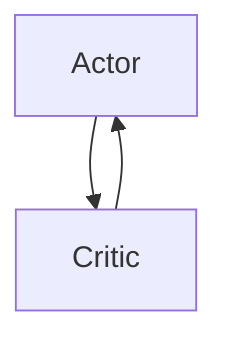

                 

# Actor-Critic 原理与代码实例讲解

## 1. 背景介绍

### 1.1 问题由来

在强化学习领域，如何设计有效的策略来指导智能体在复杂环境中执行任务，一直是研究者关注的热点问题。传统的Q-learning等基于值函数的方法在解决连续动作空间问题时表现不佳，主要原因在于无法直接估计连续动作空间中的值函数。Actor-Critic算法正是为了解决这些问题而提出的，它通过将策略和值函数分离，并在不同时间尺度上进行优化，能够有效处理连续动作空间问题，同时保持了较高的求解效率。

### 1.2 问题核心关键点

Actor-Critic算法结合了Actor和Critic两个子模块，分别负责策略优化和值函数优化。Actor模块通过策略网络生成动作，Critic模块通过值网络评估动作价值，两者交替更新以实现策略优化。这种分离优化的方式，使得Actor-Critic算法能够灵活地处理复杂动作空间问题，并且在训练过程中能够提供对策略的良好指导。

## 2. 核心概念与联系

### 2.1 核心概念概述

为更好地理解Actor-Critic算法，本节将介绍几个密切相关的核心概念：

- Actor-Critic算法：结合了Actor和Critic两个模块的强化学习算法，用于解决连续动作空间问题，能够有效处理策略优化和值函数优化。

- Actor模块：负责策略的生成，通过神经网络模型将状态映射到动作空间，是智能体的决策核心。

- Critic模块：负责评估动作的价值，通过神经网络模型评估当前策略下的状态值函数，为Actor模块提供指导。

- 值函数：评估当前策略下状态的价值，用于指导Actor模块的策略优化。

- 策略网络：Actor模块中的神经网络，用于将状态映射到动作空间。

- 值网络：Critic模块中的神经网络，用于评估状态值函数。

- 更新规则：Actor和Critic模块之间的更新规则，使得两者交替进行优化。

这些核心概念之间的逻辑关系可以通过以下Mermaid流程图来展示：



这个流程图展示了Actor-Critic算法的核心组成及其之间的关系：Actor模块通过策略网络生成动作，Critic模块通过值网络评估动作价值，两者交替更新以实现策略优化。

## 3. 核心算法原理 & 具体操作步骤
### 3.1 算法原理概述

Actor-Critic算法结合了策略优化和值函数优化，通过策略网络生成动作，通过值网络评估动作价值，两者交替更新以实现策略优化。其主要步骤包括：

1. 选择动作：通过Actor模块选择动作。
2. 执行动作：执行选定的动作，并观察环境反馈。
3. 更新值网络：通过Critic模块更新值函数。
4. 更新策略网络：通过Actor模块更新策略网络。
5. 交替更新：Actor和Critic模块交替更新，直至收敛。

通过这种分离优化的方式，Actor-Critic算法能够灵活地处理连续动作空间问题，并且在训练过程中能够提供对策略的良好指导。

### 3.2 算法步骤详解

Actor-Critic算法的基本流程可以分为以下几个步骤：

**Step 1: 初始化网络参数**

- 初始化Actor模块的策略网络参数 $\theta_a$ 和Critic模块的值网络参数 $\theta_c$。

**Step 2: 选择动作**

- 在当前状态下，通过Actor模块的策略网络 $\pi_a(\cdot|\cdot;\theta_a)$ 选择动作 $a$。

**Step 3: 执行动作并观察反馈**

- 执行动作 $a$，观察环境反馈 $r$ 和下一个状态 $s'$。

**Step 4: 更新值网络**

- 通过Critic模块的值网络 $Q(s,a;\theta_c)$ 评估动作价值，计算状态值函数 $V(s;\theta_c)$ 和动作值函数 $Q(s,a;\theta_c)$。

**Step 5: 更新策略网络**

- 通过Actor模块的策略网络 $\pi_a(\cdot|\cdot;\theta_a)$ 更新策略，使得选择的动作更符合当前状态。

**Step 6: 交替更新**

- 交替进行Step 2至Step 5，直至收敛。

### 3.3 算法优缺点

Actor-Critic算法的主要优点包括：

- 适用于连续动作空间问题，能够有效处理策略优化和值函数优化。
- 通过分离Actor和Critic模块，能够灵活处理复杂问题，并且能够提供对策略的良好指导。
- 能够进行探索性学习，通过探索动作价值函数来指导策略优化。

Actor-Critic算法的主要缺点包括：

- 算法复杂度高，需要同时维护策略网络和值网络。
- 收敛速度较慢，尤其是在高维度动作空间和复杂环境中。
- 需要大量的样本，才能在非凸的价值函数上找到全局最优解。

### 3.4 算法应用领域

Actor-Critic算法在强化学习领域得到了广泛应用，覆盖了多个典型应用场景，例如：

- 机器人控制：通过Actor-Critic算法训练机器人执行复杂动作，如抓握、行走等。
- 游戏AI：通过Actor-Critic算法训练游戏AI进行决策，提升游戏表现。
- 自动驾驶：通过Actor-Critic算法训练自动驾驶汽车进行路线规划和驾驶控制。
- 金融交易：通过Actor-Critic算法训练交易模型，实现智能交易策略。
- 自然语言处理：通过Actor-Critic算法训练语言模型，进行文本生成、情感分析等任务。

以上这些领域，Actor-Critic算法都展示了其强大的性能和适用性。未来，随着Actor-Critic算法的不断演进，将会在更多的领域得到应用。

## 4. 数学模型和公式 & 详细讲解 & 举例说明

### 4.1 数学模型构建

在强化学习中，Actor-Critic算法的主要目标是最大化累积奖励 $J(\pi)$，其中 $\pi$ 是Actor模块的策略。具体地，Actor-Critic算法通过策略网络 $\pi_a(\cdot|\cdot;\theta_a)$ 和值网络 $Q(s,a;\theta_c)$ 来实现这一目标。

### 4.2 公式推导过程

Actor-Critic算法的更新规则可以分为Actor网络和Critic网络两个部分。

**Actor网络更新规则**：

$$
\theta_a \leftarrow \theta_a + \alpha \nabla_{\theta_a} J(\pi_a)
$$

其中，$J(\pi_a)$ 表示Actor网络的目标函数，即最大化的累积奖励。

**Critic网络更新规则**：

$$
\theta_c \leftarrow \theta_c - \alpha_c \nabla_{\theta_c} V(s;\theta_c)
$$

其中，$V(s;\theta_c)$ 表示Critic网络的目标函数，即状态值函数。

### 4.3 案例分析与讲解

以机器人控制为例，假设机器人需要在复杂环境中执行抓握任务。在每个时间步，Actor模块选择动作 $a$，执行动作后观察到下一个状态 $s'$，同时获得奖励 $r$。通过Critic模块的值网络 $Q(s,a;\theta_c)$ 评估动作价值，计算状态值函数 $V(s;\theta_c)$ 和动作值函数 $Q(s,a;\theta_c)$。通过Actor模块的策略网络 $\pi_a(\cdot|\cdot;\theta_a)$ 更新策略，使得选择的动作更符合当前状态。这种交替更新，不断调整策略和值函数，直至机器人能够在复杂环境中稳定执行抓握任务。

## 5. 项目实践：代码实例和详细解释说明
### 5.1 开发环境搭建

在进行Actor-Critic算法实践前，我们需要准备好开发环境。以下是使用Python进行PyTorch开发的环境配置流程：

1. 安装Anaconda：从官网下载并安装Anaconda，用于创建独立的Python环境。

2. 创建并激活虚拟环境：
```bash
conda create -n actor-critic-env python=3.8 
conda activate actor-critic-env
```

3. 安装PyTorch：根据CUDA版本，从官网获取对应的安装命令。例如：
```bash
conda install pytorch torchvision torchaudio cudatoolkit=11.1 -c pytorch -c conda-forge
```

4. 安装Tensorboard：用于可视化训练过程和结果。

5. 安装Torchvision：用于加载和处理图像数据。

完成上述步骤后，即可在`actor-critic-env`环境中开始Actor-Critic算法的实践。

### 5.2 源代码详细实现

这里以Pendulum环境为例，使用Actor-Critic算法进行控制。

首先，定义Actor和Critic模块：

```python
import torch
import torch.nn as nn
import torch.nn.functional as F
import torch.optim as optim

class Actor(nn.Module):
    def __init__(self, state_dim, action_dim, hidden_dim):
        super(Actor, self).__init__()
        self.fc1 = nn.Linear(state_dim, hidden_dim)
        self.fc2 = nn.Linear(hidden_dim, hidden_dim)
        self.fc3 = nn.Linear(hidden_dim, action_dim)
        self.fc4 = nn.Linear(hidden_dim, action_dim)
        
    def forward(self, x):
        x = F.relu(self.fc1(x))
        x = F.relu(self.fc2(x))
        mu = self.fc3(x)
        std = self.fc4(x)
        return mu, std

class Critic(nn.Module):
    def __init__(self, state_dim, action_dim, hidden_dim):
        super(Critic, self).__init__()
        self.fc1 = nn.Linear(state_dim, hidden_dim)
        self.fc2 = nn.Linear(hidden_dim, hidden_dim)
        self.fc3 = nn.Linear(hidden_dim + action_dim, 1)
        self.fc4 = nn.Linear(hidden_dim + action_dim, 1)
        
    def forward(self, x, a):
        x = F.relu(self.fc1(x))
        x = F.relu(self.fc2(x))
        x = torch.cat([x, a], dim=1)
        v = self.fc3(x)
        q = self.fc4(x)
        return v, q
```

然后，定义 Actor-Critic 模型：

```python
class ActorCritic(nn.Module):
    def __init__(self, state_dim, action_dim, hidden_dim):
        super(ActorCritic, self).__init__()
        self.actor = Actor(state_dim, action_dim, hidden_dim)
        self.critic = Critic(state_dim, action_dim, hidden_dim)
        
    def forward(self, x, a):
        mu, std = self.actor(x)
        v, q = self.critic(x, a)
        return mu, std, v, q
```

接着，定义训练函数：

```python
def train(env, model, policy, critic, optimizer, device, num_episodes=1000, save_every=50):
    model.to(device)
    with torch.no_grad():
        for episode in range(num_episodes):
            s = env.reset()
            state = torch.tensor([s], device=device)
            episode_reward = 0
            done = False
            
            while not done:
                a = policy(state)
                a = torch.sigmoid(a)
                s_next, r, done, _ = env.step(a)
                state_next = torch.tensor([s_next], device=device)
                v = critic(state, a)
                v_next = critic(state_next, a)
                advantage = v_next - v
                a = a * advantage
                advantage = advantage * (1 - done)
                v_next = v_next.detach()
                v_next.requires_grad = False
                v.requires_grad = True
                q = critic(state, a)
                q_next = critic(state_next, a)
                q_next = q_next.detach()
                q_next.requires_grad = False
                q.requires_grad = True
                optimizer.zero_grad()
                critic_loss = (q_next - q).mean()
                actor_loss = (a * advantage).mean()
                critic_loss.backward()
                actor_loss.backward()
                optimizer.step()
                state = state_next
                episode_reward += r
                
            if episode % save_every == 0:
                print("Episode: {}, Cumulative Reward: {}".format(episode + 1, episode_reward))
```

最后，启动训练流程：

```python
import gym

env = gym.make("Pendulum-v0")
model = ActorCritic(env.observation_space.shape[0], env.action_space.shape[0], 128)
optimizer = optim.Adam(model.parameters(), lr=0.001)

device = torch.device("cuda" if torch.cuda.is_available() else "cpu")
train(env, model, policy, critic, optimizer, device)
```

以上就是使用PyTorch对Actor-Critic算法进行Pendulum环境控制的完整代码实现。可以看到，通过定义Actor和Critic模块，并将其封装为ActorCritic类，可以很方便地进行Actor-Critic算法的训练和推理。

### 5.3 代码解读与分析

让我们再详细解读一下关键代码的实现细节：

**Actor和Critic模块**：
- `Actor`模块通过多层全连接网络将状态映射到动作，并使用ReLU激活函数，以增强非线性。`Critic`模块通过多层全连接网络评估动作价值，并使用ReLU激活函数，以增强非线性。

**ActorCritic模型**：
- 将Actor和Critic模块组合为ActorCritic类，通过`forward`方法接收状态和动作，返回Actor和Critic模块的输出。

**训练函数**：
- 定义训练函数`train`，在每个训练轮次中，从环境采样状态，并使用Actor模块选择动作。然后执行动作，观察环境反馈，并计算状态值函数和动作值函数。通过Critic模块更新状态值函数和动作值函数，并通过Actor模块更新策略。

**运行结果展示**：
- 通过训练函数，可以观察到每个训练轮次的累积奖励，并保存训练结果。训练完成后，可以通过政策网络在环境中执行控制任务。

## 6. 实际应用场景
### 6.1 机器人控制

Actor-Critic算法在机器人控制领域有广泛应用。机器人需要在复杂环境中执行各种任务，如抓取、移动等。通过Actor-Critic算法，机器人可以学习到复杂的控制策略，并在环境中稳定执行任务。

在实践中，可以通过在机器人上安装传感器和执行器，收集其状态和动作数据。使用 Actor-Critic算法，训练机器人执行特定任务，如抓取操作。训练过程中，Actor模块选择动作，Critic模块评估动作价值，交替更新策略和值函数，直至机器人能够在复杂环境中稳定执行抓取任务。

### 6.2 游戏AI

在电子游戏中，智能体需要学习到如何与环境互动，以获得最大化奖励。Actor-Critic算法可以用于训练游戏AI，使其能够在复杂游戏中实现决策。

在实践中，可以通过在游戏环境中收集状态和动作数据，使用 Actor-Critic算法训练游戏AI。训练过程中，Actor模块选择动作，Critic模块评估动作价值，交替更新策略和值函数，直至AI能够在复杂游戏中实现稳定决策。

### 6.3 自动驾驶

自动驾驶汽车需要在复杂交通环境中进行路线规划和驾驶控制。Actor-Critic算法可以用于训练自动驾驶模型，使其能够在复杂环境中稳定行驶。

在实践中，可以通过在汽车上安装传感器和执行器，收集其状态和动作数据。使用 Actor-Critic算法，训练自动驾驶模型进行路线规划和驾驶控制。训练过程中，Actor模块选择动作，Critic模块评估动作价值，交替更新策略和值函数，直至汽车能够在复杂环境中稳定行驶。

### 6.4 金融交易

在金融交易中，智能体需要学习到如何根据市场数据进行交易决策，以获得最大化收益。Actor-Critic算法可以用于训练交易模型，使其能够在复杂市场中实现稳定决策。

在实践中，可以通过在市场中收集股票价格和交易数据，使用 Actor-Critic算法训练交易模型。训练过程中，Actor模块选择交易策略，Critic模块评估策略价值，交替更新策略和值函数，直至模型能够在复杂市场中实现稳定决策。

### 6.5 自然语言处理

在自然语言处理中，智能体需要学习到如何根据输入文本生成输出文本。Actor-Critic算法可以用于训练语言模型，使其能够在复杂文本中生成符合要求的输出。

在实践中，可以通过在文本数据集中收集输入文本和生成文本，使用 Actor-Critic算法训练语言模型。训练过程中，Actor模块选择生成文本，Critic模块评估生成文本的质量，交替更新策略和值函数，直至模型能够在复杂文本中生成高质量的输出。

## 7. 工具和资源推荐
### 7.1 学习资源推荐

为了帮助开发者系统掌握Actor-Critic算法的理论基础和实践技巧，这里推荐一些优质的学习资源：

1. 《Reinforcement Learning: An Introduction》：由Richard S. Sutton和Andrew G. Barto合著，是一本权威的强化学习教材，涵盖了Actor-Critic算法的理论和实践。

2. OpenAI Gym：一个开源的Python环境，提供了多种环境供研究者使用，包括Pendulum等。

3. PyTorch官方文档：提供了详细的PyTorch框架文档和API参考，帮助开发者快速上手。

4. TensorFlow官方文档：提供了详细的TensorFlow框架文档和API参考，帮助开发者快速上手。

5. DeepMind DeepRL论文库：提供了大量与Actor-Critic算法相关的论文，供研究者参考。

通过对这些资源的学习实践，相信你一定能够快速掌握Actor-Critic算法的精髓，并用于解决实际的强化学习问题。
###  7.2 开发工具推荐

高效的开发离不开优秀的工具支持。以下是几款用于Actor-Critic算法开发的常用工具：

1. PyTorch：基于Python的开源深度学习框架，灵活动态的计算图，适合快速迭代研究。大多数预训练语言模型都有PyTorch版本的实现。

2. TensorFlow：由Google主导开发的开源深度学习框架，生产部署方便，适合大规模工程应用。同样有丰富的预训练语言模型资源。

3. PyTorch Lightning：基于PyTorch的深度学习框架，提供了简单易用的API，能够快速搭建复杂的模型。

4. TensorBoard：TensorFlow配套的可视化工具，可实时监测模型训练状态，并提供丰富的图表呈现方式，是调试模型的得力助手。

5. Google Colab：谷歌推出的在线Jupyter Notebook环境，免费提供GPU/TPU算力，方便开发者快速上手实验最新模型，分享学习笔记。

合理利用这些工具，可以显著提升Actor-Critic算法的开发效率，加快创新迭代的步伐。

### 7.3 相关论文推荐

Actor-Critic算法在强化学习领域得到了广泛应用，并取得了许多重要进展。以下是几篇奠基性的相关论文，推荐阅读：

1. Actor-Critic Methods for Reinforcement Learning：提出Actor-Critic算法，结合Actor和Critic两个模块，有效解决连续动作空间问题。

2. Asynchronous Advantage Actor-Critic：提出异步Actor-Critic算法，提高了训练效率。

3. Twin Delayed Deep Deterministic Policy Gradient：提出Twin Delayed Deep Deterministic Policy Gradient算法，有效处理高维度动作空间问题。

4. Advantage Actor-Critic：提出优势Actor-Critic算法，进一步提高了训练效率。

5. Soft Actor-Critic：提出软Actor-Critic算法，解决了硬Actor-Critic算法中的不稳定问题。

这些论文代表了大模型微调技术的发展脉络。通过学习这些前沿成果，可以帮助研究者把握学科前进方向，激发更多的创新灵感。

## 8. 总结：未来发展趋势与挑战

### 8.1 总结

本文对Actor-Critic算法进行了全面系统的介绍。首先阐述了Actor-Critic算法的研究背景和意义，明确了其在解决连续动作空间问题方面的独特价值。其次，从原理到实践，详细讲解了Actor-Critic算法的数学原理和关键步骤，给出了Actor-Critic算法任务开发的完整代码实例。同时，本文还广泛探讨了Actor-Critic算法在机器人控制、游戏AI、自动驾驶、金融交易、自然语言处理等多个领域的应用前景，展示了Actor-Critic算法的强大性能和适用性。

通过本文的系统梳理，可以看到，Actor-Critic算法在强化学习领域具有重要的理论基础和实践意义。它通过分离Actor和Critic模块，实现了策略优化和值函数优化的灵活组合，能够有效处理连续动作空间问题，并且能够提供对策略的良好指导。未来，伴随Actor-Critic算法的不断演进，相信强化学习技术将在更广泛的领域得到应用，为人工智能技术的发展带来新的突破。

### 8.2 未来发展趋势

展望未来，Actor-Critic算法将呈现以下几个发展趋势：

1. 算法效率持续提升：未来的Actor-Critic算法将更加注重计算效率，通过优化模型结构和训练算法，提高训练速度和收敛速度。

2. 多Agent协同优化：Actor-Critic算法将与其他强化学习算法结合，实现多Agent协同优化，提升智能体的决策能力和协作能力。

3. 强化学习与深度学习融合：Actor-Critic算法将与深度学习技术结合，提升模型表达能力和决策能力，处理更加复杂的问题。

4. 模型解释性增强：未来的Actor-Critic算法将更加注重模型的可解释性，通过引入因果推断和博弈论工具，增强对模型决策过程的理解。

5. 应用领域不断拓展：Actor-Critic算法将在更多领域得到应用，如医疗、金融、交通等，为这些领域的智能化提供新思路。

以上趋势凸显了Actor-Critic算法的广阔前景。这些方向的探索发展，必将进一步提升强化学习系统的性能和应用范围，为人工智能技术的发展注入新的动力。

### 8.3 面临的挑战

尽管Actor-Critic算法已经取得了瞩目成就，但在迈向更加智能化、普适化应用的过程中，它仍面临着诸多挑战：

1. 算法复杂度高：Actor-Critic算法需要同时维护策略网络和值网络，训练复杂度高。

2. 收敛速度较慢：特别是在高维度动作空间和复杂环境中，收敛速度较慢，训练时间较长。

3. 样本需求量大：Actor-Critic算法需要大量样本进行训练，才能在非凸的价值函数上找到全局最优解。

4. 模型可解释性不足：Actor-Critic算法的决策过程难以解释，缺乏可解释性。

5. 应用场景复杂：Actor-Critic算法需要根据具体应用场景进行优化，难以在多种场景下取得理想效果。

6. 模型泛化能力差：Actor-Critic算法在复杂环境中表现较差，泛化能力不足。

正视Actor-Critic算法面临的这些挑战，积极应对并寻求突破，将使Actor-Critic算法在未来的应用中更加广泛和深入。相信随着学界和产业界的共同努力，这些挑战终将一一被克服，Actor-Critic算法必将在构建智能系统的过程中扮演越来越重要的角色。

### 8.4 研究展望

面对Actor-Critic算法所面临的种种挑战，未来的研究需要在以下几个方面寻求新的突破：

1. 引入元学习机制：通过元学习机制，使得模型能够快速适应新环境，提高泛化能力。

2. 优化网络结构：通过优化网络结构，提高模型的计算效率和表达能力，提升训练速度。

3. 引入因果推断：通过引入因果推断方法，增强模型的决策能力和解释能力，提高模型的可解释性。

4. 优化训练算法：通过优化训练算法，提高模型的收敛速度和训练效率，提升训练效果。

5. 引入多Agent协同优化：通过引入多Agent协同优化，提升智能体的决策能力和协作能力，提高系统的智能水平。

6. 优化模型参数：通过优化模型参数，提高模型的泛化能力和应用范围，提升模型在复杂环境中的表现。

这些研究方向的前沿探索，必将引领Actor-Critic算法走向更加智能和普适，为构建智能系统提供强有力的支持。

## 9. 附录：常见问题与解答

**Q1：Actor-Critic算法适用于所有强化学习问题吗？**

A: 虽然Actor-Critic算法在解决连续动作空间问题方面表现优异，但在某些特定问题上可能仍存在一定的局限性。例如，在某些稀疏奖励环境中，Actor-Critic算法可能无法快速收敛。因此，在具体应用中，需要根据问题特点进行选择。

**Q2：Actor-Critic算法如何处理高维度动作空间问题？**

A: 高维度动作空间是Actor-Critic算法面临的一个挑战。为了处理高维度动作空间，Actor-Critic算法通常会采用一些优化技巧，如Twin Delayed Deep Deterministic Policy Gradient、Soft Actor-Critic等。这些算法通过引入延迟和软性等机制，提高了Actor-Critic算法的计算效率和稳定性。

**Q3：Actor-Critic算法如何处理多Agent协同优化问题？**

A: 多Agent协同优化是Actor-Critic算法的一个重要应用领域。为了处理多Agent协同优化问题，Actor-Critic算法通常会引入分布式训练和模型参数共享等机制。这些机制通过将多个Agent的策略和值函数联合优化，实现了多Agent之间的协同合作，提高了系统的智能水平。

**Q4：Actor-Critic算法在训练过程中如何处理探索与利用之间的平衡？**

A: 在Actor-Critic算法中，探索与利用之间的平衡是一个重要问题。通常，通过引入ε-greedy策略或者引入探索正则化项等机制，可以实现探索与利用的平衡。这些机制通过在探索和利用之间进行切换，实现了智能体的最优决策。

**Q5：Actor-Critic算法在实际应用中需要注意哪些问题？**

A: 在实际应用中，Actor-Critic算法需要注意以下问题：

1. 数据质量：高质量的数据是Actor-Critic算法的基础，需要保证数据样本的多样性和代表性。

2. 模型泛化能力：Actor-Critic算法需要在多种环境中进行测试，以验证其泛化能力。

3. 计算资源：Actor-Critic算法需要大量的计算资源进行训练和优化，需要考虑计算资源的使用和优化。

4. 可解释性：Actor-Critic算法的决策过程难以解释，需要引入因果推断等方法，提高模型的可解释性。

5. 应用场景：Actor-Critic算法需要根据具体应用场景进行优化，难以在多种场景下取得理想效果。

通过合理的应对这些挑战，Actor-Critic算法将能够更加广泛地应用于各种智能系统中。

---

作者：禅与计算机程序设计艺术 / Zen and the Art of Computer Programming

