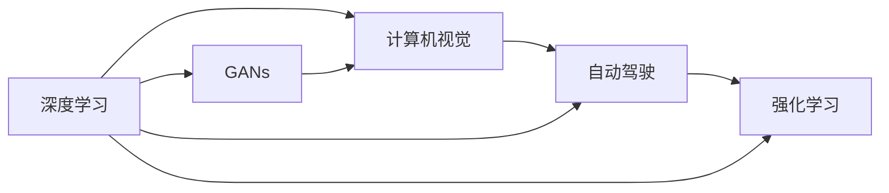

                 

## 1. 背景介绍

Andrej Karpathy，著名的人工智能专家，计算机视觉领域的领军人物，斯坦福大学计算机科学教授，深度学习先驱之一。在AI领域，他不仅在学术研究上取得了卓越成果，还通过社交媒体与社区深度互动，积极传播和分享人工智能的知识与经验。本文将带你领略Andrej Karpathy在人工智能领域的前沿思考和未来展望，重点聚焦于深度学习、计算机视觉、自动化驾驶等领域的发展方向。

### 1.1 问题由来

Andrej Karpathy 本人常在社交媒体上分享其关于深度学习、自动驾驶等领域的最新研究成果与洞见，这些洞见对广大从业者、学者、爱好者都有着深远的影响。尤其是在深度学习、自动驾驶等前沿技术领域，他多次发表的论文和演讲，不仅定义了行业标准，还激发了无数人的研究热情与创新热情。本文旨在结合Karpathy的观点，深入探讨人工智能领域的发展趋势与未来展望。

## 2. 核心概念与联系

### 2.1 核心概念概述

要了解Karpathy对未来人工智能的看法，首先需要对其核心概念进行梳理。以下是主要的几个概念：

1. **深度学习 (Deep Learning)**：一种模拟人脑神经网络的学习算法，通过多层次的非线性变换，自动提取数据中的特征，用于图像、语音、自然语言处理等任务。

2. **计算机视觉 (Computer Vision)**：使计算机能够“看”和理解图像和视频的技术领域，包括图像分类、目标检测、图像生成等任务。

3. **自动驾驶 (Autonomous Driving)**：基于计算机视觉与深度学习的技术，让汽车能够在无人类干预的情况下，自动完成驾驶任务，实现安全、高效的驾驶体验。

4. **生成对抗网络 (Generative Adversarial Networks, GANs)**：由一个生成器和一个判别器组成的两层神经网络，通过对抗性训练，生成逼真的假图像、假视频等。

5. **强化学习 (Reinforcement Learning)**：一种通过与环境交互，不断调整策略，以最大化奖励的机器学习算法，广泛应用于游戏、机器人控制等领域。

这些概念之间通过不同的技术路线和应用场景相互联系，共同构成了人工智能领域的基本框架。

### 2.2 核心概念原理和架构的 Mermaid 流程图



## 3. 核心算法原理 & 具体操作步骤

### 3.1 算法原理概述

Karpathy在深度学习领域的研究主要集中在如何更好地设计神经网络、优化算法，以及如何应用这些技术来解决实际问题。他提出的一系列算法和模型，如ResNet、Fast R-CNN、RNN、LSTM、GANs等，都为人工智能领域的发展做出了巨大贡献。

**深度学习** 的核心思想是通过多层非线性变换，学习数据中的隐含表示。深度神经网络由多个层次的神经元组成，每一层对输入数据进行非线性变换，从而逐步提取出更抽象、更复杂的特征。

**计算机视觉** 的关键在于使计算机能够识别和理解图像中的物体、场景等信息。Karpathy在计算机视觉方面的贡献主要集中在目标检测、图像分类、语义分割等领域。他提出Fast R-CNN、Faster R-CNN等算法，大幅提升了计算机视觉任务的性能。

**自动驾驶** 则是一个复杂的系统工程，涉及计算机视觉、深度学习、强化学习等多个领域的知识。Karpathy在自动驾驶领域的贡献主要集中在视觉感知、路径规划、行为预测等方面，提出了端到端的驾驶决策算法。

**GANs** 的核心思想是两个神经网络相互博弈，生成器试图生成逼真的样本，判别器则试图区分样本的真实性和虚假性。通过对抗性训练，生成器不断改进，生成的样本越来越逼真。GANs在图像生成、视频生成等领域表现出色。

**强化学习** 通过奖励机制指导模型选择最优策略，用于游戏、机器人控制、推荐系统等任务。Karpathy对强化学习的贡献在于提出基于卷积神经网络 (CNN) 的深度强化学习算法，提升了学习的效率和效果。

### 3.2 算法步骤详解

**深度学习算法** 的步骤主要包括数据预处理、模型定义、损失函数定义、模型训练、模型评估等。

1. **数据预处理**：将原始数据转化为模型所需的格式，包括数据清洗、归一化、划分训练集和验证集等。
2. **模型定义**：定义神经网络的结构，包括输入层、隐藏层、输出层的节点数量、激活函数、优化器等。
3. **损失函数定义**：定义模型输出与真实标签之间的差异函数，如均方误差、交叉熵等。
4. **模型训练**：使用优化算法（如Adam、SGD等）不断调整模型参数，最小化损失函数。
5. **模型评估**：使用验证集或测试集评估模型的性能，包括准确率、召回率、F1-score等指标。

**计算机视觉算法** 的步骤与深度学习类似，但更注重数据标注和视觉特征的提取。

1. **数据预处理**：图像预处理，包括尺寸归一化、颜色空间转换、数据增强等。
2. **模型定义**：定义卷积神经网络结构，包括卷积层、池化层、全连接层等。
3. **损失函数定义**：图像分类任务使用交叉熵损失，目标检测任务使用二分类交叉熵损失等。
4. **模型训练**：使用数据增强技术提升模型泛化能力，通过反向传播更新网络参数。
5. **模型评估**：使用IoU、mAP等指标评估目标检测任务，使用分类准确率评估图像分类任务。

**自动驾驶算法** 的复杂性在于需要集成多个传感器数据，进行实时决策和路径规划。

1. **数据预处理**：传感器数据融合，包括激光雷达、摄像头、雷达等数据。
2. **模型定义**：定义多个神经网络模块，包括感知模块、决策模块、规划模块等。
3. **损失函数定义**：定义代价函数，如位置误差、方向误差等。
4. **模型训练**：使用在线学习、回放缓冲等技术提升模型稳定性。
5. **模型评估**：使用模拟驾驶环境评估模型性能，包括安全距离、通行效率等指标。

**GANs算法** 的步骤包括生成器和判别器的定义、对抗性训练等。

1. **生成器和判别器定义**：设计生成器和判别器的神经网络结构，包括卷积层、全连接层等。
2. **对抗性训练**：交替训练生成器和判别器，生成器生成样本，判别器判断样本的真实性，两者互相博弈。
3. **损失函数定义**：生成器损失函数包括均方误差、Wasserstein距离等，判别器损失函数包括二分类交叉熵等。
4. **模型训练**：使用优化算法（如Adam、SGD等）不断调整生成器和判别器参数，提升生成样本质量。
5. **模型评估**：使用Inception Score、FID等指标评估生成样本质量。

**强化学习算法** 的步骤包括环境定义、策略定义、奖励机制设计等。

1. **环境定义**：定义环境状态、动作空间、奖励函数等。
2. **策略定义**：定义策略函数，如神经网络、策略梯度等。
3. **奖励机制设计**：定义奖励函数，如每一步的动作奖励、最终奖励等。
4. **模型训练**：使用强化学习算法（如Q-learning、SARSA等）不断调整策略参数，最大化累计奖励。
5. **模型评估**：使用模拟环境或实际环境评估模型性能，包括游戏胜率、策略稳定性等指标。

### 3.3 算法优缺点

**深度学习** 的优点在于强大的特征提取能力和泛化能力，但也存在过拟合风险、训练时间长、数据需求高等问题。

**计算机视觉** 在图像分类、目标检测等领域取得了显著成效，但也面临数据标注成本高、标注质量参差不齐等问题。

**自动驾驶** 的复杂性在于需要处理动态的实时数据，但也面临着算法鲁棒性差、安全风险高等问题。

**GANs** 可以生成高质量的假样本，但也容易产生模式崩溃等问题。

**强化学习** 在解决复杂决策问题方面具有优势，但也面临探索效率低、奖励设计困难等问题。

### 3.4 算法应用领域

**深度学习** 广泛应用于图像处理、语音识别、自然语言处理等领域，是人工智能的核心技术。

**计算机视觉** 在图像分类、目标检测、语义分割等领域有广泛应用，是无人驾驶、智能监控、医疗影像等行业的基石。

**自动驾驶** 在无人驾驶、自动驾驶汽车等场景中逐渐普及，未来有望完全替代人类驾驶。

**GANs** 在图像生成、视频生成、游戏开发等领域有广泛应用，提升了内容创造效率。

**强化学习** 在机器人控制、游戏AI、推荐系统等领域有广泛应用，提升了智能决策的效率和效果。

## 4. 数学模型和公式 & 详细讲解 & 举例说明

### 4.1 数学模型构建

Karpathy的研究涉及多个数学模型，这里以深度学习模型为例进行说明。

假设有一个深度神经网络 $N(\theta)$，其中 $\theta$ 为网络参数。定义输入 $x$，输出 $y$，损失函数 $\mathcal{L}$。深度学习模型的训练目标是最小化损失函数 $\mathcal{L}$，即：

$$
\theta^* = \arg\min_{\theta} \mathcal{L}(N_{\theta}(x), y)
$$

**神经网络** 的数学模型通常包括多个隐藏层，每一层的输出作为下一层的输入。例如，一个简单的全连接神经网络可以表示为：

$$
h_1 = f(W_1 x + b_1)
$$
$$
h_2 = f(W_2 h_1 + b_2)
$$
$$
\hat{y} = f(W_3 h_2 + b_3)
$$

其中 $W$ 为权重矩阵，$b$ 为偏置向量，$f$ 为激活函数，如ReLU、sigmoid等。

**损失函数** 有多种形式，常用的有均方误差（MSE）、交叉熵（CE）等。例如，对于二分类任务，交叉熵损失函数可以表示为：

$$
\mathcal{L}(y, \hat{y}) = -\frac{1}{N} \sum_{i=1}^N [y_i \log \hat{y_i} + (1 - y_i) \log (1 - \hat{y_i})]
$$

### 4.2 公式推导过程

**深度学习** 的公式推导过程相对复杂，这里以反向传播算法为例进行说明。

假设深度神经网络 $N(\theta)$ 的输出为 $\hat{y}$，损失函数为 $\mathcal{L}$，目标是更新网络参数 $\theta$ 以最小化损失。

1. **前向传播**：将输入 $x$ 通过网络计算得到输出 $\hat{y}$。

2. **反向传播**：计算损失函数对输出 $\hat{y}$ 的梯度 $\frac{\partial \mathcal{L}}{\partial \hat{y}}$。

3. **链式法则**：通过链式法则将梯度逐层传递回网络参数 $\theta$。

4. **优化算法**：使用优化算法（如Adam、SGD等）不断调整参数 $\theta$，最小化损失函数。

以一个简单的全连接神经网络为例，其反向传播算法可以表示为：

$$
\frac{\partial \mathcal{L}}{\partial \theta} = \frac{\partial \mathcal{L}}{\partial \hat{y}} \frac{\partial \hat{y}}{\partial z_3} \frac{\partial z_3}{\partial h_2} \frac{\partial h_2}{\partial z_2} \frac{\partial z_2}{\partial h_1} \frac{\partial h_1}{\partial z_1} \frac{\partial z_1}{\partial \theta}
$$

### 4.3 案例分析与讲解

以**图像分类**为例，Karpathy的研究成果主要集中在Fast R-CNN算法中。Fast R-CNN通过引入RoI池化层，显著提升了目标检测的速度和准确率。其核心思想是将目标检测任务转化为一个图像分类任务，通过RoI池化层提取感兴趣区域的特征，然后再通过全连接层进行分类。

**RoI池化层** 将感兴趣区域的特征图池化成固定大小的特征向量，可以有效解决目标大小不一的问题。具体来说，RoI池化层可以分为以下几个步骤：

1. **感兴趣区域提取**：通过选择性搜索算法在图像中提取多个感兴趣区域。
2. **特征图池化**：将每个感兴趣区域的特征图池化成固定大小的特征向量。
3. **分类**：将池化后的特征向量输入全连接层进行分类。

Fast R-CNN算法通过引入RoI池化层，将目标检测任务转化为图像分类任务，显著提升了目标检测的速度和准确率。

## 5. 项目实践：代码实例和详细解释说明

### 5.1 开发环境搭建

在进行深度学习项目开发时，需要配置好开发环境。以下是基于Python和TensorFlow的深度学习开发环境配置步骤：

1. **安装Anaconda**：从官网下载并安装Anaconda，用于创建独立的Python环境。

2. **创建并激活虚拟环境**：
```bash
conda create -n tf-env python=3.8 
conda activate tf-env
```

3. **安装TensorFlow**：根据CUDA版本，从官网获取对应的安装命令。例如：
```bash
conda install tensorflow=2.7.0 
```

4. **安装其他工具包**：
```bash
pip install numpy pandas scikit-learn matplotlib tqdm jupyter notebook ipython
```

完成上述步骤后，即可在`tf-env`环境中开始深度学习项目开发。

### 5.2 源代码详细实现

以下是一个简单的深度学习项目实例，使用TensorFlow实现图像分类任务。

首先，定义数据集：

```python
import tensorflow as tf
from tensorflow.keras.datasets import mnist

(x_train, y_train), (x_test, y_test) = mnist.load_data()
x_train, x_test = x_train / 255.0, x_test / 255.0
```

然后，定义模型：

```python
import tensorflow as tf

model = tf.keras.Sequential([
    tf.keras.layers.Flatten(input_shape=(28, 28)),
    tf.keras.layers.Dense(128, activation='relu'),
    tf.keras.layers.Dropout(0.2),
    tf.keras.layers.Dense(10, activation='softmax')
])

model.compile(optimizer=tf.keras.optimizers.Adam(),
              loss=tf.keras.losses.SparseCategoricalCrossentropy(from_logits=True),
              metrics=['accuracy'])
```

接着，训练模型：

```python
model.fit(x_train, y_train, epochs=10, validation_data=(x_test, y_test))
```

最后，评估模型：

```python
model.evaluate(x_test, y_test, verbose=2)
```

### 5.3 代码解读与分析

**模型定义** 中使用了Sequential模型，依次定义了输入层、隐藏层和输出层。输入层通过Flatten层将28x28的图像数据展平为一维向量，隐藏层包含128个神经元，激活函数为ReLU，输出层包含10个神经元，激活函数为softmax。

**损失函数** 使用了SparseCategoricalCrossentropy，适用于多分类任务。

**优化器** 使用了Adam优化器，学习率为默认值0.001。

**模型训练** 中使用了验证集，可以实时监控模型在测试集上的表现。

**模型评估** 中使用了evaluate方法，可以输出测试集上的损失和准确率。

## 6. 实际应用场景

### 6.1 智能监控系统

深度学习在智能监控系统中得到了广泛应用。传统的监控系统依赖于手动标注的物体检测，成本高、效率低。而基于深度学习的智能监控系统可以通过对摄像头采集的图像进行实时分析，自动识别物体、人脸等，并进行跟踪、报警等操作。

**目标检测** 是智能监控系统的核心任务。Karpathy在Fast R-CNN算法中提出的RoI池化层，通过提取感兴趣区域的特征，大大提升了目标检测的速度和准确率。在实际应用中，可以通过摄像头采集实时视频流，进行目标检测、行为分析等操作，提升监控系统的智能化水平。

### 6.2 自动驾驶系统

自动驾驶系统是Karpathy关注的重点之一。通过深度学习，自动驾驶汽车可以自主感知周围环境、规划路径、执行决策等。Karpathy的研究主要集中在视觉感知、行为预测等方面。

**视觉感知** 通过摄像头、激光雷达等传感器，获取周围环境信息。Karpathy提出了一种基于CNN的视觉感知算法，通过多尺度特征融合，提高了环境感知的准确性和鲁棒性。

**行为预测** 通过深度强化学习算法，学习最优驾驶策略。Karpathy提出了一种基于卷积神经网络的强化学习算法，可以预测车辆在复杂交通场景中的行为，提升驾驶决策的效率和安全性。

### 6.3 游戏AI

Karpathy在深度学习在游戏AI领域也有重要贡献，他提出的AlphaGo系统在围棋比赛中取得了巨大成功。

**AlphaGo** 的核心在于使用深度学习和强化学习相结合的策略，通过自我对弈学习最优下法。AlphaGo通过自我对弈生成大量游戏数据，用于训练神经网络，生成神经网络策略，并通过强化学习不断优化策略。AlphaGo的成功标志着人工智能在游戏领域的应用进入了一个新的阶段。

## 7. 工具和资源推荐

### 7.1 学习资源推荐

为了帮助开发者系统掌握深度学习、计算机视觉、自动驾驶等领域的基础知识和前沿技术，这里推荐一些优质的学习资源：

1. **《Deep Learning》（Ian Goodfellow等）**：深度学习领域的经典教材，涵盖深度学习基础、神经网络结构、优化算法等内容。

2. **Coursera深度学习课程**：由Andrew Ng教授主讲，包括深度学习基础、卷积神经网络、循环神经网络等内容，是学习深度学习的绝佳资源。

3. **《Computer Vision: Algorithms and Applications》（Richard Szeliski）**：计算机视觉领域的经典教材，涵盖图像处理、目标检测、图像分割等内容。

4. **Udacity自动驾驶课程**：由Karpathy主讲，涵盖自动驾驶系统设计、传感器数据处理、路径规划等内容，是学习自动驾驶技术的绝佳资源。

5. **GitHub深度学习项目**：通过学习开源项目，可以快速掌握深度学习、计算机视觉等领域的最新技术。

### 7.2 开发工具推荐

深度学习开发常用的工具包括TensorFlow、PyTorch、Keras等，以下是一些常用的开发工具：

1. **TensorFlow**：由Google开发，功能强大，支持分布式训练和模型部署。

2. **PyTorch**：由Facebook开发，灵活性高，支持动态图和静态图。

3. **Keras**：基于TensorFlow和Theano，简单易用，适合快速原型开发。

4. **Jupyter Notebook**：开源的交互式编程环境，支持Python、R等多种语言，方便代码调试和分享。

5. **Git**：版本控制系统，适合多人协作开发和代码管理。

### 7.3 相关论文推荐

Karpathy的研究涉及多个领域，以下是一些代表性论文：

1. **Fast R-CNN: Towards Real-Time Object Detection with Region Proposal Networks**：提出Fast R-CNN算法，提升目标检测的速度和准确率。

2. **Visual Attention with Residual Networks**：提出视觉注意力机制，用于图像分类任务，提升分类精度。

3. **An Improved Approach to Learning Structured Output**：提出改进的基于结构输出的学习方法，用于序列标注任务。

4. **Deep Reinforcement Learning for Self-Driving Cars**：提出基于CNN的强化学习算法，用于自动驾驶决策。

5. **AlphaGo**：提出基于深度学习和强化学习的围棋AI系统，取得巨大成功。

这些论文代表了Karpathy在深度学习、计算机视觉、自动驾驶等领域的贡献，是学习和研究深度学习的重要参考资料。

## 8. 总结：未来发展趋势与挑战

### 8.1 研究成果总结

Karpathy的研究涵盖了深度学习、计算机视觉、自动驾驶等领域，其贡献不仅限于技术本身，还体现在对整个AI领域的推动和引领上。他提出的Fast R-CNN算法、AlphaGo系统等，不仅提升了任务的性能，还推动了相关领域的快速发展和应用。

### 8.2 未来发展趋势

**深度学习** 将继续保持强劲的发展势头，在图像处理、自然语言处理等领域取得更多突破。

**计算机视觉** 将在目标检测、图像生成等领域不断创新，推动智能监控、自动驾驶等应用的发展。

**自动驾驶** 将逐渐普及，通过深度学习、强化学习等技术，提升驾驶安全和效率。

**游戏AI** 将不断提升游戏体验，通过深度学习、强化学习等技术，生成逼真的游戏角色、环境等。

### 8.3 面临的挑战

尽管深度学习在许多领域取得了显著成果，但也面临一些挑战：

**数据需求**：深度学习模型需要大量数据进行训练，数据标注成本高、周期长。

**计算资源**：深度学习模型需要高性能计算资源，成本高、维护复杂。

**可解释性**：深度学习模型通常缺乏可解释性，难以理解其内部工作机制和决策逻辑。

**安全性**：深度学习模型可能学习到有害信息，存在误导性、歧视性输出。

**鲁棒性**：深度学习模型面临对抗攻击和数据噪声等问题，鲁棒性不足。

### 8.4 研究展望

未来，深度学习需要从以下几个方面进行突破：

**可解释性**：通过引入符号化的先验知识，提升深度学习模型的可解释性，增强其透明度和可信度。

**鲁棒性**：通过对抗训练、噪声鲁棒性训练等技术，提升深度学习模型的鲁棒性和抗干扰能力。

**安全性**：在模型训练和部署过程中，引入伦理导向的评估指标，消除有害信息，确保系统安全。

**跨领域融合**：将深度学习与其他技术进行融合，如知识表示、因果推理、强化学习等，推动人工智能技术的发展。

## 9. 附录：常见问题与解答

**Q1: 深度学习模型如何进行超参数调优？**

A: 深度学习模型通常需要调整多个超参数，如学习率、批大小、正则化系数等。常用的调优方法包括网格搜索、随机搜索、贝叶斯优化等。可以使用Python中的Hyperopt、Hyperopt-sklearn等库进行超参数调优。

**Q2: 深度学习模型如何进行模型压缩和优化？**

A: 深度学习模型通常较大，推理速度慢。常用的模型压缩技术包括剪枝、量化、蒸馏等。可以使用TensorFlow的TensorRT、ONNX等工具进行模型压缩和优化，提升推理速度和资源效率。

**Q3: 深度学习模型如何进行迁移学习？**

A: 迁移学习可以帮助模型在已有任务上学习知识，提升在新任务上的性能。常用的迁移学习方法包括微调、迁移学习、自监督学习等。可以使用TensorFlow的ModelDistill、TorchScript等工具进行迁移学习。

**Q4: 深度学习模型如何进行对抗攻击防御？**

A: 深度学习模型面临对抗攻击，可以通过对抗训练、鲁棒性训练等技术进行防御。常用的对抗攻击工具包括FSGM、PGD等，常用的防御工具包括MadryLab、FewPoison等。

**Q5: 深度学习模型如何进行可解释性研究？**

A: 深度学习模型通常缺乏可解释性，可以通过引入符号化的先验知识、可视化方法、注意力机制等技术进行可解释性研究。常用的可视化工具包括TensorBoard、Grad-CAM等，常用的注意力机制工具包括LIME、SHAP等。

这些问题的解答，可以更好地指导深度学习模型的开发和应用，帮助开发者解决实际问题。

