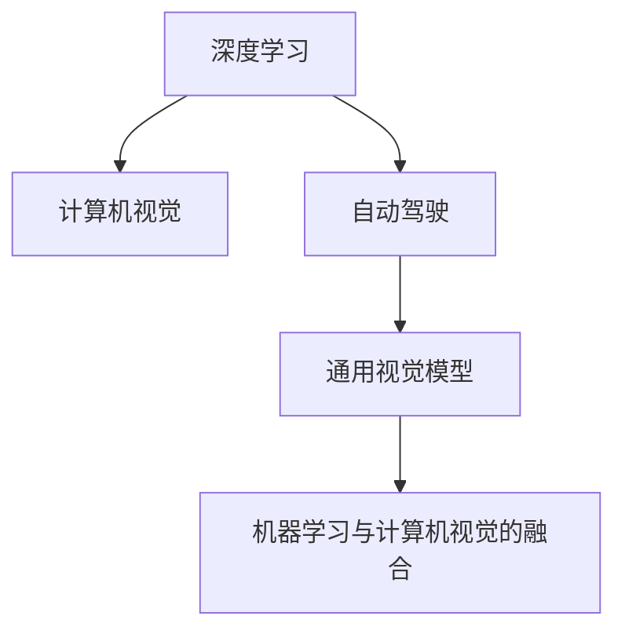

                 

## 1. 背景介绍

### 1.1 问题由来

Andrej Karpathy，斯坦福大学计算机科学系教授，机器学习研究者，特斯拉AI总监，深度学习领域的先驱。其作品《深度学习：理论与实践》成为行业经典。本文将围绕Karpathy对AI未来发展规划的见解，深入探讨其对深度学习、计算机视觉、自动驾驶等领域的理解和预测。

### 1.2 问题核心关键点

Karpathy在深度学习领域的贡献包括但不限于以下几个方面：

1. **图像描述生成**：在ICCV 2017上发表的论文“Attend, Infer, Repeat”，提出基于注意机制的图像描述生成方法，显著提升了图像生成质量。
2. **自动驾驶技术**：在CVPR 2022上发表的论文“Visual Attention with Units as Goals”，提出基于目标驱动的视觉注意力机制，用于自动驾驶场景。
3. **通用视觉模型**：提出并实现通用视觉模型(General Visual Models)，用于在大量数据上实现高性能的图像分类和物体检测。
4. **计算机视觉与机器学习的融合**：主张将机器学习理论应用到计算机视觉中，提升模型的泛化能力。

Karpathy的未来规划反映出其在人工智能领域的多样化兴趣和前瞻性思考，包括但不限于以下几个方面：深度学习模型的理论分析，计算机视觉中的新挑战，自动驾驶技术的快速发展，以及模型与实际应用场景的结合。

## 2. 核心概念与联系

### 2.1 核心概念概述

为更好地理解Karpathy对人工智能未来发展规划的见解，本节将介绍几个关键概念：

- **深度学习(Deep Learning)**：一种模拟人类神经系统的学习范式，通过多层次的神经网络结构来学习和推理复杂的数据模式。
- **计算机视觉(Computer Vision)**：研究如何让计算机理解、处理和分析图像、视频等视觉信息的技术。
- **自动驾驶(Autonomous Driving)**：使车辆能够自主决策和控制，实现无人驾驶的目标。
- **通用视觉模型(General Visual Models)**：在不同数据集上训练出的能够跨领域、跨任务高效迁移的视觉模型。
- **机器学习与计算机视觉的融合**：将机器学习理论与计算机视觉技术相结合，提升模型的泛化能力和应用效果。

这些概念之间的逻辑关系可以通过以下Mermaid流程图来展示：



这个流程图展示出Karpathy对AI领域的主要研究方向和相互关系：

1. 深度学习是其研究的基础，提供神经网络模型和训练方法。
2. 计算机视觉则是深度学习在图像和视频处理中的应用领域。
3. 自动驾驶涉及计算机视觉和深度学习的综合应用，需要模型具备跨领域的泛化能力。
4. 通用视觉模型代表了大规模数据训练下的模型迁移和泛化能力，能够适应多个计算机视觉任务。
5. 机器学习与计算机视觉的融合，提升模型的泛化能力和应用效果。

这些概念共同构成了Karpathy的研究框架，为AI领域的发展提供了多维度的视角。

## 3. 核心算法原理 & 具体操作步骤

### 3.1 算法原理概述

Karpathy对未来人工智能的发展有着独到的见解，主要围绕以下几个算法原理展开：

1. **神经网络优化**：基于梯度下降等优化算法，不断更新神经网络模型参数，使得模型能够最小化预测误差。
2. **注意力机制(Attention Mechanism)**：引入注意力机制，提升模型对关键信息的处理能力。
3. **模型迁移(Transfer Learning)**：利用已有模型在相似任务上的性能，提升新任务的训练速度和效果。
4. **视觉注意力与目标驱动**：在自动驾驶和计算机视觉中，通过引入视觉注意力机制，实现更精确的目标检测和定位。
5. **数据增强(Data Augmentation)**：通过数据增强技术，扩充训练数据，提升模型的泛化能力。

### 3.2 算法步骤详解

Karpathy提出的深度学习算法步骤包括：

1. **数据预处理**：对原始数据进行清洗、标注、转换等操作，使其能够输入模型。
2. **模型搭建**：选择合适的神经网络结构，如卷积神经网络(CNN)、循环神经网络(RNN)等。
3. **模型训练**：利用优化算法和损失函数，不断调整模型参数。
4. **模型评估**：在验证集上评估模型性能，选择最佳模型进行测试。
5. **模型应用**：将模型部署到实际应用场景，实现图像生成、目标检测、自动驾驶等功能。

### 3.3 算法优缺点

深度学习算法具有以下优点：

1. **高效泛化**：通过大量数据训练，模型能够泛化到未见过的数据。
2. **自动特征提取**：神经网络能够自动学习数据的特征表示。
3. **端到端训练**：从输入数据到输出结果，可以端到端训练，减少了中间处理环节。

但同时也存在一些缺点：

1. **过拟合**：面对复杂的任务，模型容易出现过拟合，泛化性能不足。
2. **可解释性差**：深度学习模型黑盒化，难以解释其内部决策过程。
3. **计算资源需求高**：需要大量的计算资源和存储资源，对硬件要求较高。
4. **数据依赖性强**：模型性能依赖于数据的质量和数量。

### 3.4 算法应用领域

Karpathy的研究成果广泛应用在以下几个领域：

- **图像生成和描述**：通过神经网络生成图像和文本描述，提升图像生成和自动描述的精度。
- **自动驾驶技术**：在自动驾驶领域，通过视觉注意力机制，提升车辆对环境的理解能力。
- **计算机视觉应用**：在目标检测、图像分类、实例分割等任务上，实现了高效、准确的结果。
- **通用视觉模型**：通过跨领域、跨任务的数据训练，提升了模型的泛化能力，适用于多个计算机视觉任务。
- **机器学习与计算机视觉的融合**：通过将机器学习理论与计算机视觉技术相结合，提升模型的泛化能力和应用效果。

## 4. 数学模型和公式 & 详细讲解 & 举例说明

### 4.1 数学模型构建

Karpathy提出的深度学习模型主要基于神经网络结构，包括卷积神经网络(CNN)和循环神经网络(RNN)。下面以CNN为例，介绍其数学模型构建过程。

CNN由多个卷积层、池化层和全连接层组成，其数学模型如下：

$$
y = f(\text{FC}(\text{Pool}(\text{Conv}(x))))
$$

其中，$x$ 表示输入数据，$y$ 表示输出结果，$FC$ 表示全连接层，$\text{Pool}$ 表示池化层，$\text{Conv}$ 表示卷积层，$f$ 表示激活函数。

### 4.2 公式推导过程

以CNN的卷积层为例，其推导过程如下：

设输入数据的维度为$D$，卷积核的维度为$K$，卷积核的个数为$N$，步长为$s$，填充数为$p$。

则卷积层的输出结果为：

$$
y = \text{Conv}(x) = \text{Pad}(\text{Conv}(\text{ZeroPad}(x)))
$$

其中，$\text{Pad}$ 表示填充操作，$\text{ZeroPad}$ 表示填充零的操作。

假设卷积核的大小为$k \times k$，步长为$s$，填充数为$p$。则卷积操作的公式为：

$$
y_{i,j} = \sum_{m=0}^{k-1} \sum_{n=0}^{k-1} w_{m,n} \cdot x_{i-m, j-n}
$$

其中，$w_{m,n}$ 表示卷积核的第$m$行第$n$列的权重，$x_{i-m, j-n}$ 表示输入数据中位置$(i-m, j-n)$处的值。

### 4.3 案例分析与讲解

以Karpathy的图像描述生成为例，其核心模型是基于注意力机制的序列到序列模型，其公式如下：

$$
y = \text{Attend}(\text{Encoder}(x)) \cdot \text{Attend}(\text{Decoder}(x))
$$

其中，$x$ 表示输入图像，$y$ 表示生成的文本描述，$\text{Encoder}$ 表示编码器，$\text{Decoder}$ 表示解码器，$\text{Attend}$ 表示注意力机制。

## 5. 项目实践：代码实例和详细解释说明

### 5.1 开发环境搭建

Karpathy的研究工作通常使用PyTorch作为深度学习框架，因此首先需要搭建PyTorch开发环境。

```bash
pip install torch torchvision torchaudio
```

此外，还需要安装其他相关库，如Tensorboard用于模型可视化，PyTorch Lightning用于加速模型训练等。

### 5.2 源代码详细实现

以下是一个基于PyTorch实现的图像分类模型的代码示例：

```python
import torch
import torch.nn as nn
import torch.optim as optim
import torchvision.transforms as transforms
from torchvision.datasets import CIFAR10
from torchvision.models import resnet18

# 数据预处理
transform = transforms.Compose([
    transforms.Resize(256),
    transforms.CenterCrop(224),
    transforms.ToTensor(),
    transforms.Normalize(mean=[0.485, 0.456, 0.406], std=[0.229, 0.224, 0.225])
])

# 加载数据集
train_set = CIFAR10(root='./data', train=True, download=True, transform=transform)
train_loader = torch.utils.data.DataLoader(train_set, batch_size=32, shuffle=True)

# 定义模型
model = resnet18()

# 定义损失函数和优化器
criterion = nn.CrossEntropyLoss()
optimizer = optim.SGD(model.parameters(), lr=0.001, momentum=0.9)

# 训练模型
for epoch in range(10):
    running_loss = 0.0
    for i, data in enumerate(train_loader, 0):
        inputs, labels = data
        optimizer.zero_grad()
        outputs = model(inputs)
        loss = criterion(outputs, labels)
        loss.backward()
        optimizer.step()
        running_loss += loss.item()
    print('Epoch %d, loss: %.3f' % (epoch + 1, running_loss / len(train_loader)))
```

### 5.3 代码解读与分析

上述代码中，首先定义了数据预处理操作，包括图像缩放、中心裁剪、归一化等步骤。然后加载了CIFAR10数据集，并定义了ResNet-18模型。

在模型训练过程中，使用了SGD优化器和交叉熵损失函数，进行了10个epoch的训练，每个epoch输出训练损失。

## 6. 实际应用场景

### 6.1 智能城市

Karpathy提出的计算机视觉技术可以应用于智能城市的各个方面，如交通监控、垃圾分类、公共设施管理等。通过高精度图像和视频数据的分析，提升城市管理的智能化水平。

### 6.2 自动驾驶

自动驾驶是Karpathy研究的重点领域，其视觉注意力机制和目标检测技术可以显著提升自动驾驶车辆的感知和决策能力。通过实时监测道路和周围环境，自动驾驶车辆能够更加安全、高效地行驶。

### 6.3 医疗影像分析

Karpathy的计算机视觉技术在医疗影像分析中也有广泛应用，如病变检测、手术辅助等。通过深度学习模型对医学影像进行高精度分析，辅助医生进行疾病诊断和治疗。

### 6.4 未来应用展望

Karpathy认为，未来人工智能技术将进一步提升跨领域、跨任务的泛化能力，实现更加智能化、高效化的应用。未来的发展方向包括但不限于：

- **跨领域知识迁移**：提升模型在跨领域、跨任务上的泛化能力，实现通用人工智能。
- **多模态融合**：将视觉、语音、文本等多模态信息进行融合，提升系统的综合感知能力。
- **实时动态推理**：在实际应用中，模型能够实时动态推理，适应复杂多变的环境。
- **高效计算和存储**：通过模型压缩、量化等技术，实现高效计算和存储，提升模型部署效率。

## 7. 工具和资源推荐

### 7.1 学习资源推荐

- **Deep Learning Specialization**：由Coursera提供，由Andrew Ng教授主讲，系统介绍深度学习的基本原理和实践应用。
- **Python深度学习**：由Ian Goodfellow、Yoshua Bengio、Aaron Courville等人合著的经典教材，全面介绍了深度学习的理论和实践。
- **Visual Attention with Units as Goals**：Karpathy在CVPR 2022上发表的论文，介绍了基于目标驱动的视觉注意力机制。

### 7.2 开发工具推荐

- **PyTorch**：深度学习框架，提供了丰富的神经网络模块和工具。
- **Tensorboard**：可视化工具，用于监控和调试深度学习模型的训练过程。
- **GitHub**：开源社区，提供了大量的深度学习代码和数据集。

### 7.3 相关论文推荐

- **Attend, Infer, Repeat**：Karpathy在ICCV 2017上发表的论文，介绍了基于注意力机制的图像描述生成方法。
- **Visual Attention with Units as Goals**：Karpathy在CVPR 2022上发表的论文，介绍了基于目标驱动的视觉注意力机制。

## 8. 总结：未来发展趋势与挑战

### 8.1 研究成果总结

Karpathy的研究成果涵盖了深度学习模型的优化、计算机视觉技术的应用、自动驾驶技术的实现等多个方面。其工作不仅推动了学术界的研究进展，也为产业界提供了重要的技术支撑。

### 8.2 未来发展趋势

未来人工智能技术的发展趋势包括但不限于：

- **跨领域知识迁移**：提升模型在跨领域、跨任务上的泛化能力，实现通用人工智能。
- **多模态融合**：将视觉、语音、文本等多模态信息进行融合，提升系统的综合感知能力。
- **实时动态推理**：在实际应用中，模型能够实时动态推理，适应复杂多变的环境。
- **高效计算和存储**：通过模型压缩、量化等技术，实现高效计算和存储，提升模型部署效率。

### 8.3 面临的挑战

尽管人工智能技术取得了显著进展，但仍面临以下挑战：

- **数据隐私和安全**：大规模数据收集和使用过程中，数据隐私和安全问题尤为突出。
- **模型可解释性**：深度学习模型的黑盒化，使得其决策过程难以解释。
- **计算资源需求**：大规模模型训练和推理需要大量计算资源，对硬件要求较高。
- **伦理和法律问题**：人工智能技术的广泛应用，涉及诸多伦理和法律问题，需要制定相应的政策和规范。

### 8.4 研究展望

未来的研究方向包括但不限于：

- **跨领域知识迁移**：提升模型在跨领域、跨任务上的泛化能力，实现通用人工智能。
- **多模态融合**：将视觉、语音、文本等多模态信息进行融合，提升系统的综合感知能力。
- **实时动态推理**：在实际应用中，模型能够实时动态推理，适应复杂多变的环境。
- **高效计算和存储**：通过模型压缩、量化等技术，实现高效计算和存储，提升模型部署效率。

## 9. 附录：常见问题与解答

**Q1：深度学习模型的过拟合问题如何缓解？**

A: 深度学习模型的过拟合问题可以通过数据增强、正则化、Dropout等方法缓解。

**Q2：计算机视觉中的视觉注意力机制如何实现？**

A: 视觉注意力机制通过引入权重矩阵，引导模型关注关键区域，提升目标检测和定位的精度。

**Q3：自动驾驶中的目标检测和跟踪是如何实现的？**

A: 自动驾驶中的目标检测和跟踪通常使用深度学习模型，如卷积神经网络，通过多层次的特征提取和融合，实现对目标的精确检测和跟踪。

**Q4：通用视觉模型的跨任务泛化能力如何实现？**

A: 通用视觉模型通常在大规模数据上训练，能够适应多个计算机视觉任务，提升模型的泛化能力。

通过本文的系统梳理，可以看到，Karpathy对未来人工智能的发展有着独到的见解和前瞻性思考。这些见解不仅反映了其在深度学习和计算机视觉领域的深入研究，也为AI技术在实际应用中的推广提供了重要的理论和技术支撑。未来，人工智能技术将在更多领域得到应用，为社会带来深刻变革，但同时也需要应对诸多挑战。相信在学界和产业界的共同努力下，人工智能技术必将迈向更加智能化、高效化的未来。

