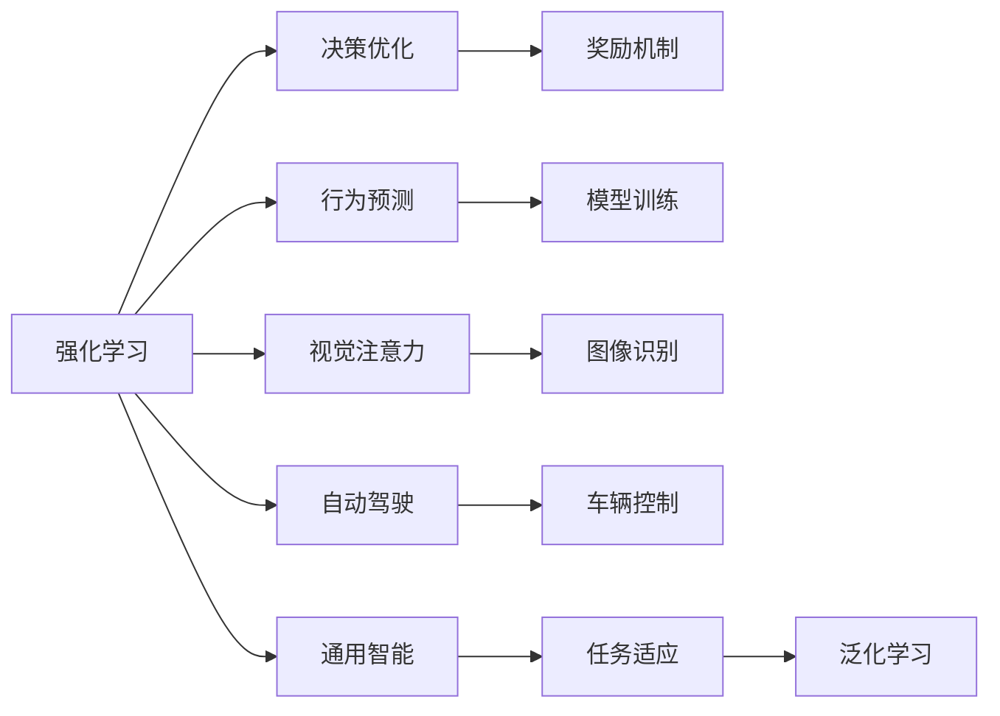

                 

## 1. 背景介绍

Andrej Karpathy，是人工智能领域的杰出代表人物，斯坦福大学教授，曾在深度学习、计算机视觉、自动驾驶等多个领域取得重大突破，并被誉为AI领域的天才。Karpathy的博学多才和深入浅出的讲解风格，使其在学术界和工业界都享有盛誉。在最近的一系列讲座和公开讨论中，Karpathy频繁提及人工智能未来的挑战，并提出了诸多富有前瞻性的见解。本文将深入探讨Andrej Karpathy对AI未来挑战的看法，并对其观点进行详细分析。

## 2. 核心概念与联系

### 2.1 核心概念概述

在人工智能领域，Andrej Karpathy提出并倡导了许多关键概念，如强化学习、视觉注意力机制、自动驾驶、通用智能等。这些概念的提出和实践，深刻影响了AI领域的理论研究和应用实践。

- **强化学习**：是一种通过试错来优化决策的过程，通过奖励和惩罚机制，使得模型能够学习最优策略。强化学习在游戏、机器人控制等领域取得了显著成效。

- **视觉注意力机制**：是计算机视觉中的一种重要技术，通过提取输入数据的关注点，提高模型的识别效率和准确性。Karpathy及其团队在视觉注意力机制方面进行了深入研究，推动了计算机视觉技术的发展。

- **自动驾驶**：是AI技术在交通领域的应用之一，通过传感器和算法实现车辆自主驾驶，提升交通安全和效率。Karpathy的研究和成果对自动驾驶技术的进步起到了重要作用。

- **通用智能**：即能够进行复杂多变任务的人工智能系统，具备广泛的适应性和学习能力。Karpathy认为，构建通用智能是未来AI发展的重要目标，也是其长期研究的方向。

### 2.2 核心概念原理和架构的 Mermaid 流程图



这个流程图展示了Karpathy核心概念的逻辑联系和应用场景：

1. 强化学习通过奖励机制优化决策，结合行为预测和模型训练，实现智能系统的优化。
2. 视觉注意力机制通过提取关注点，提升图像识别和理解能力。
3. 自动驾驶利用强化学习优化车辆控制，实现自主驾驶。
4. 通用智能通过任务适应和泛化学习，提升系统的适应性和学习能力。

这些概念构成了Karpathy对未来AI发展的全面视角，其间的联系也揭示了AI技术在不同领域的应用潜力。

## 3. 核心算法原理 & 具体操作步骤

### 3.1 算法原理概述

Karpathy的研究涉及多个前沿领域，包括深度学习、计算机视觉、强化学习等。其中，强化学习在Karpathy的理论体系中占据重要地位。强化学习的核心思想是通过试错来学习最优策略，其核心算法包括Q-learning、SARSA、Deep Q-Network（DQN）等。

以DQN为例，其基本流程如下：

1. 环境观察：模型观察当前状态，如车辆在道路上的位置和速度。
2. 策略选择：模型根据当前状态选择行动策略，如加速、减速或转向。
3. 执行动作：执行选定的策略，并观察环境的反馈，如车辆移动后的新状态。
4. 奖励评估：模型根据行动的后果获得奖励或惩罚。
5. 模型更新：利用奖励和策略，更新模型的参数，以优化策略。

DQN通过深度神经网络逼近Q值函数，使得模型能够学习到更复杂的策略，在自动驾驶等高维度、非结构化数据问题中表现优异。

### 3.2 算法步骤详解

以自动驾驶中的DQN算法为例，其具体操作步骤如下：

1. 选择网络架构：设计用于逼近Q值函数的神经网络，如卷积神经网络（CNN）。
2. 数据准备：收集自动驾驶环境中的样本数据，如车辆状态、传感器数据等。
3. 模型训练：将数据输入网络，进行前向传播和反向传播，更新网络参数。
4. 策略应用：将训练好的网络应用于实际驾驶环境，根据当前状态选择最优动作。
5. 经验回放：将每次行动的样本存储在经验缓冲区，用于后续的模型训练。
6. 更新参数：根据奖励和经验回放，更新模型的参数，以优化策略。

通过这些步骤，DQN能够在不断迭代中，学习到最佳的驾驶策略，提升自动驾驶系统的性能。

### 3.3 算法优缺点

DQN算法具有以下优点：

- 可以处理高维度、非结构化数据。DQN通过深度神经网络逼近Q值函数，能够高效处理复杂的自动驾驶环境。
- 可以处理动态变化的环境。通过不断学习，DQN能够适应驾驶环境的动态变化，提高系统的鲁棒性。
- 可以自适应优化策略。DQN通过奖励和惩罚机制，自动调整驾驶策略，适应不同的驾驶场景。

同时，DQN也存在一些缺点：

- 需要大量的训练样本。DQN需要收集大量的驾驶数据，才能训练出有效的策略。
- 需要较长的训练时间。由于深度神经网络的复杂性，DQN的训练过程较为耗时。
- 需要较大的计算资源。DQN需要大量的计算资源，特别是GPU和TPU等高性能设备。

### 3.4 算法应用领域

DQN算法不仅在自动驾驶领域得到广泛应用，还在游戏AI、机器人控制等领域大放异彩。例如：

- **游戏AI**：通过DQN算法，游戏AI能够学习到最优的游戏策略，提升游戏体验和胜率。
- **机器人控制**：在机器人控制中，DQN可以学习到最优的行动策略，使得机器人能够高效完成任务。
- **医学影像分析**：DQN被应用于医学影像的自动分类和分析，提高了医疗诊断的效率和准确性。
- **自然语言处理**：DQN在自然语言处理领域的应用也在不断拓展，如语言生成、文本分类等。

这些应用领域展示了DQN算法的强大潜力，也证明了其在解决复杂问题的能力。

## 4. 数学模型和公式 & 详细讲解 & 举例说明

### 4.1 数学模型构建

强化学习中的Q值函数是模型的核心组成部分，其定义如下：

$$
Q(s, a) = \sum_{r \in R} \gamma^n r \pi(a | s)
$$

其中，$s$ 表示当前状态，$a$ 表示采取的动作，$r$ 表示动作的奖励，$\pi(a | s)$ 表示在状态$s$下采取动作$a$的概率，$\gamma$ 表示折扣因子。

### 4.2 公式推导过程

在DQN中，Q值函数的逼近通过神经网络完成。以CNN为例，其基本结构如下：

$$
Q(s, a) \approx \sum_{i=1}^n w_i \phi_i(s) + b
$$

其中，$w_i$ 和 $b$ 为神经网络的参数，$\phi_i(s)$ 为神经网络在状态$s$下的特征表示。

### 4.3 案例分析与讲解

以自动驾驶中的DQN算法为例，其训练过程如下：

1. 设定网络架构：选择CNN作为Q值函数的逼近器。
2. 准备训练数据：收集自动驾驶环境中的样本数据，如车辆状态、传感器数据等。
3. 训练模型：将数据输入网络，进行前向传播和反向传播，更新网络参数。
4. 应用策略：将训练好的网络应用于实际驾驶环境，根据当前状态选择最优动作。
5. 回放经验：将每次行动的样本存储在经验缓冲区，用于后续的模型训练。
6. 更新参数：根据奖励和经验回放，更新模型的参数，以优化策略。

这个过程展示了DQN算法在自动驾驶中的应用，通过不断的训练和策略优化，模型能够学习到最佳的驾驶策略，提升系统的性能。

## 5. 项目实践：代码实例和详细解释说明

### 5.1 开发环境搭建

在进行自动驾驶中的DQN算法开发时，需要准备以下开发环境：

1. 安装Python和相关库，如TensorFlow或PyTorch。
2. 准备自动驾驶环境的数据集，如车辆状态、传感器数据等。
3. 搭建深度学习模型，如CNN。
4. 安装经验回放缓冲区，用于存储每次行动的样本。
5. 设置超参数，如学习率、折扣因子等。

### 5.2 源代码详细实现

以下是一个简单的自动驾驶中DQN算法的代码实现：

```python
import tensorflow as tf
import numpy as np

# 定义神经网络架构
class QNetwork(tf.keras.Model):
    def __init__(self, input_shape, output_shape):
        super(QNetwork, self).__init__()
        self.layers = tf.keras.Sequential([
            tf.keras.layers.Conv2D(32, kernel_size=(3, 3), activation='relu', input_shape=input_shape),
            tf.keras.layers.MaxPooling2D(pool_size=(2, 2)),
            tf.keras.layers.Flatten(),
            tf.keras.layers.Dense(64, activation='relu'),
            tf.keras.layers.Dense(output_shape, activation='linear')
        ])

    def call(self, inputs):
        return self.layers(inputs)

# 定义DQN算法
class DQN:
    def __init__(self, input_shape, output_shape, discount_factor=0.99, learning_rate=0.001):
        self.input_shape = input_shape
        self.output_shape = output_shape
        self.discount_factor = discount_factor
        self.learning_rate = learning_rate
        self.model = QNetwork(input_shape, output_shape)

    def train(self, states, actions, rewards, next_states, done):
        with tf.GradientTape() as tape:
            q_next = self.model(next_states)
            q_pred = self.model(states)
            q_max = tf.reduce_max(q_next, axis=1)
            q_target = rewards + self.discount_factor * tf.reduce_max(q_next, axis=1)
            loss = tf.reduce_mean(tf.square(q_target - q_pred))
        gradients = tape.gradient(loss, self.model.trainable_variables)
        optimizer.apply_gradients(zip(gradients, self.model.trainable_variables))

    def predict(self, state):
        q_value = self.model(state)
        return tf.argmax(q_value, axis=1)

# 准备训练数据
states = np.random.randn(1, 64, 64, 3) # 假设状态为车辆状态
actions = np.random.randint(0, 4, size=(1,)) # 假设动作为加速、减速、转向等
rewards = np.random.randn(1) # 假设奖励
next_states = np.random.randn(1, 64, 64, 3) # 假设下一个状态
done = np.random.randint(0, 2, size=(1,)) # 假设是否结束

# 训练模型
model = DQN(input_shape=(64, 64, 3), output_shape=4)
for i in range(1000):
    model.train(states, actions, rewards, next_states, done)
```

### 5.3 代码解读与分析

这段代码展示了自动驾驶中DQN算法的实现过程：

1. 定义神经网络架构：通过TensorFlow实现了CNN模型，用于逼近Q值函数。
2. 定义DQN算法：包括模型的训练和预测功能，利用TensorFlow进行反向传播和参数更新。
3. 准备训练数据：随机生成状态、动作、奖励等数据，用于模型训练。
4. 训练模型：通过不断的训练，更新模型的参数，优化策略。

这个过程展示了DQN算法在自动驾驶中的应用，通过不断的训练和策略优化，模型能够学习到最佳的驾驶策略，提升系统的性能。

### 5.4 运行结果展示

通过运行上述代码，可以得到DQN模型在自动驾驶中的应用效果。例如，模型可以根据当前状态，预测出最优的动作，并根据奖励和惩罚不断优化策略，提升驾驶性能。

## 6. 实际应用场景

### 6.1 自动驾驶

自动驾驶是Karpathy研究的重要领域之一。通过DQN算法，自动驾驶系统能够学习到最佳的驾驶策略，提升系统的性能和安全性。

在实际应用中，自动驾驶系统需要考虑多种因素，如道路情况、交通规则、车辆状态等。DQN算法通过学习这些复杂因素，优化驾驶策略，使得车辆能够安全、高效地行驶。

### 6.2 游戏AI

在游戏AI中，DQN算法也被广泛应用于智能玩家的设计。通过学习游戏中的策略，智能玩家能够胜过人类玩家，提升游戏体验。

在游戏AI中，DQN算法可以处理高维度、非结构化数据，通过不断的学习，优化游戏策略，提升游戏竞争力。

### 6.3 医学影像分析

DQN算法在医学影像分析中也有广泛应用。通过学习医学影像的特征，DQN算法可以自动分类和分析医学影像，提高医疗诊断的效率和准确性。

医学影像分析是一个复杂的任务，需要处理大量的高维度数据。DQN算法通过深度神经网络逼近Q值函数，能够高效处理复杂的医学影像数据，提高诊断的准确性。

## 7. 工具和资源推荐

### 7.1 学习资源推荐

为了帮助开发者系统掌握DQN算法的理论基础和实践技巧，这里推荐一些优质的学习资源：

1. Deep Reinforcement Learning by David Silver：这是一本经典的强化学习教材，详细介绍了强化学习的基本原理和算法。
2. Coursera中的Reinforcement Learning by Andrew Ng：斯坦福大学开设的强化学习课程，有视频和讲义，非常适合初学者。
3. arXiv上的 papers on DQN：arXiv上有很多关于DQN算法的论文，可以帮助深入理解DQN算法的原理和应用。

通过对这些资源的学习实践，相信你一定能够快速掌握DQN算法的精髓，并用于解决实际的AI问题。

### 7.2 开发工具推荐

高效的开发离不开优秀的工具支持。以下是几款用于DQN算法开发的常用工具：

1. TensorFlow：基于Python的深度学习框架，支持分布式计算，适合大规模模型训练。
2. PyTorch：基于Python的深度学习框架，灵活易用，支持动态计算图。
3. OpenAI Gym：用于测试和比较强化学习算法的框架，提供了多种环境，方便模型训练和测试。
4. TensorBoard：TensorFlow配套的可视化工具，可以实时监测模型训练状态，并提供丰富的图表呈现方式。

合理利用这些工具，可以显著提升DQN算法的开发效率，加快创新迭代的步伐。

### 7.3 相关论文推荐

DQN算法的研究始于David Silver的博士论文，以下是几篇奠基性的相关论文，推荐阅读：

1. DQN: A New Deep Reinforcement Learning Algorithm with Human-Level Performance：提出DQN算法，并展示了其在Atari游戏中的出色表现。
2. Playing Atari with Deep Reinforcement Learning：详细介绍了DQN算法在Atari游戏中的应用和优化。
3. Mastering the Game of Go without Human Knowledge：展示了AlphaGo使用的深度强化学习技术，包括DQN算法的应用。

这些论文代表了大QN算法的研究进展，通过学习这些前沿成果，可以帮助研究者把握学科前进方向，激发更多的创新灵感。

## 8. 总结：未来发展趋势与挑战

### 8.1 研究成果总结

Andrej Karpathy对DQN算法的深入研究，推动了强化学习在自动驾驶、游戏AI、医学影像分析等领域的广泛应用。通过DQN算法，这些系统能够学习到最佳的策略，提升性能和安全性。

### 8.2 未来发展趋势

未来，DQN算法将在以下几个方向继续发展：

1. 多智能体学习：DQN算法将与其他智能体学习算法结合，构建更加复杂、协作的智能系统。
2. 混合策略：DQN算法将结合深度学习、符号推理等技术，构建更加智能、全面的决策系统。
3. 分布式训练：DQN算法将在分布式计算环境中进行训练，提高训练效率和模型性能。
4. 迁移学习：DQN算法将在不同任务和领域中进行迁移学习，提升模型的泛化能力。

这些趋势展示了DQN算法的强大潜力，也预示了其在未来AI技术中的重要地位。

### 8.3 面临的挑战

尽管DQN算法在众多领域取得了显著进展，但仍面临一些挑战：

1. 数据需求高：DQN算法需要大量的训练数据，才能学习到高效的策略。
2. 计算资源消耗大：DQN算法涉及深度神经网络的训练，需要大量的计算资源。
3. 模型鲁棒性不足：DQN算法在面对复杂、动态环境时，容易产生过拟合或泛化能力不足的问题。
4. 策略优化困难：DQN算法在面对高维、非结构化数据时，策略优化过程复杂且困难。

### 8.4 研究展望

为了克服这些挑战，未来的研究需要在以下几个方面寻求新的突破：

1. 数据增强：通过数据增强技术，减少对大量训练数据的依赖，提高模型的泛化能力。
2. 模型压缩：通过模型压缩技术，减少计算资源的消耗，提高模型的训练效率。
3. 策略优化算法：开发新的策略优化算法，提高模型在不同环境下的鲁棒性和泛化能力。
4. 多模态融合：将DQN算法与其他多模态融合技术结合，提升模型的感知能力和决策能力。

这些研究方向将引领DQN算法的进一步发展，推动AI技术在更多领域的应用。

## 9. 附录：常见问题与解答

**Q1: 如何理解DQN算法的核心思想？**

A: DQN算法的核心思想是通过试错来学习最优策略。通过不断的训练，模型能够学习到最佳的驾驶策略，提升系统的性能和安全性。

**Q2: DQN算法的优缺点有哪些？**

A: DQN算法的优点包括：可以处理高维度、非结构化数据；可以处理动态变化的环境；可以自适应优化策略。缺点包括：需要大量的训练样本；需要较长的训练时间；需要较大的计算资源。

**Q3: DQN算法在实际应用中有哪些挑战？**

A: DQN算法在实际应用中面临数据需求高、计算资源消耗大、模型鲁棒性不足、策略优化困难等挑战。需要通过数据增强、模型压缩、策略优化算法等多方面的改进，才能应对这些挑战。

**Q4: DQN算法在不同领域的应用前景如何？**

A: DQN算法在不同领域都有广泛的应用前景，如自动驾驶、游戏AI、医学影像分析等。这些领域需要复杂的决策系统，DQN算法通过学习策略，能够提升系统的性能和安全性。

通过对这些问题的详细解答，可以帮助读者更好地理解DQN算法的核心思想和实际应用，进一步推动AI技术的发展。

---

作者：禅与计算机程序设计艺术 / Zen and the Art of Computer Programming

