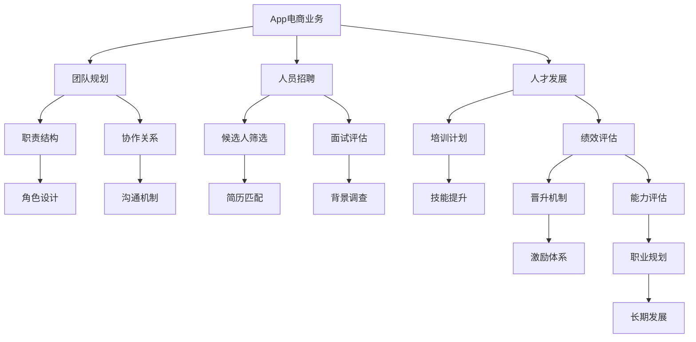

                 

## 1. 背景介绍

在当前数字化转型的大背景下，App电商业务成为了许多公司的重要战略方向。这不仅要求企业在技术架构上具备快速迭代和高效扩展的能力，同时也需要一支具有强大技术实力和业务洞察力的团队。因此，有效的团队规划和人员培养计划对于企业的成功至关重要。本文将围绕App电商业务团队的建设，探讨如何从团队规划、人员招聘、人才发展和持续优化等多个维度进行系统化的管理。

## 2. 核心概念与联系

### 2.1 核心概念概述

在讨论App电商业务的团队规划和人员培养计划之前，首先需要明确几个核心概念：

- **App电商业务**：指的是通过App应用平台进行的商品销售和在线交易，涵盖移动端和Web端，包括电商平台、社交电商、内容电商等多种形式。
- **团队规划**：指对App电商业务团队的结构、职责、角色和关系进行规划和设计，确保团队高效协同和业务目标的达成。
- **人员招聘**：即在符合业务需求和技术要求的前提下，寻找并吸引最合适的候选人。
- **人才发展**：通过培训、晋升、激励等多种方式，促进团队成员的成长和技能的提升。
- **持续优化**：定期评估团队绩效和成员满意度，根据反馈进行优化调整，确保团队保持高水平运行。

这些概念之间存在紧密的联系，共同构成了App电商业务团队的有效管理框架。

### 2.2 核心概念原理和架构的 Mermaid 流程图



这个流程图展示了App电商业务团队从概念到实施的各个环节，以及它们之间的相互依赖关系。

## 3. 核心算法原理 & 具体操作步骤

### 3.1 算法原理概述

App电商业务的团队规划和人员培养计划，本质上是一个多目标优化的过程。目标是构建一个高效、协作性强、适应性强且具有持续改进能力的团队。这一过程通常包括以下步骤：

1. **业务需求分析**：了解业务目标和关键需求，确定团队的角色和职责。
2. **技术能力评估**：分析现有技术栈和未来技术趋势，确定所需的技术能力和人才层次。
3. **人员规划和招聘**：根据业务和技术需求，制定招聘计划，吸引和选拔合适的人才。
4. **人才发展和激励**：通过培训、晋升和激励机制，促进团队成员的个人成长和团队凝聚力。
5. **持续优化和反馈**：定期评估团队绩效和成员满意度，根据反馈进行调整和优化。

### 3.2 算法步骤详解

#### 3.2.1 业务需求分析

- **明确业务目标**：理解公司App电商业务的发展战略和核心目标。
- **识别关键需求**：分析业务的关键流程和环节，确定需要哪些角色和职责。
- **评估现有资源**：评估当前团队的技术栈、人员配置和业务能力，找出不足和改进点。

#### 3.2.2 技术能力评估

- **分析技术栈**：根据业务需求，确定所需的技术栈和开发工具。
- **识别技术趋势**：关注前沿技术动态，评估其对业务的影响和适用性。
- **规划人才层次**：根据技术栈和趋势，规划不同层级的技术人才。

#### 3.2.3 人员规划和招聘

- **制定招聘计划**：根据业务和技术需求，确定招聘的岗位和人数。
- **吸引人才**：通过多种渠道（如招聘网站、社交媒体、专业论坛等）吸引候选人。
- **筛选和评估**：对候选人进行简历筛选和面试评估，确保其符合业务和技术要求。
- **背景调查**：对候选人进行背景调查，确保其履历和能力的真实性。

#### 3.2.4 人才发展和激励

- **设计培训计划**：根据业务和技术需求，制定培训课程和学习路径。
- **实施培训**：组织内部培训、外部培训和在线课程，提升团队成员的技能。
- **评估绩效**：定期进行绩效评估，识别优秀员工和提升空间。
- **晋升和激励**：建立晋升机制和激励体系，激发员工的积极性和创造力。

#### 3.2.5 持续优化和反馈

- **定期评估**：通过定期的团队会议和问卷调查，评估团队绩效和成员满意度。
- **反馈调整**：根据评估结果和反馈意见，调整团队规划和人员培养计划。
- **优化调整**：优化团队结构和职责分配，提升团队效率和协作性。

### 3.3 算法优缺点

App电商业务团队的规划和人员培养计划具有以下优点：

- **提升团队效率**：通过明确职责和角色，优化团队协作，提升工作效率。
- **增强业务适应性**：通过技术能力评估和持续优化，确保团队具备快速适应业务变化的能力。
- **促进人才成长**：通过培训和激励机制，促进团队成员的个人成长和职业发展。

然而，该方法也存在一些缺点：

- **依赖人员素质**：团队成员的能力和态度直接影响计划的效果，需要较高的执行力。
- **成本较高**：培训、招聘和激励需要一定的投入，对于中小企业可能存在负担。
- **灵活性不足**：一旦团队结构确定，调整相对困难，需要谨慎规划。

### 3.4 算法应用领域

App电商业务的团队规划和人员培养计划，不仅适用于电商企业，也适用于其他类型的数字化转型企业。其核心原则和步骤适用于各种业务场景，如在线教育、医疗健康、金融科技等。

## 4. 数学模型和公式 & 详细讲解 & 举例说明

### 4.1 数学模型构建

为了量化App电商业务团队规划和人员培养计划的效果，我们可以构建一个数学模型。假设团队中有 $n$ 名成员，每个成员的初始技能水平为 $s_i$，目标技能水平为 $t_i$，培训效率为 $e_i$，则团队整体技能提升模型为：

$$
\Delta S = \sum_{i=1}^{n} (t_i - s_i) \cdot e_i
$$

其中，$\Delta S$ 为团队整体技能提升量，$t_i$ 为目标技能水平，$s_i$ 为初始技能水平，$e_i$ 为培训效率。

### 4.2 公式推导过程

- **技能提升量计算**：对于每个成员 $i$，其技能提升量为 $t_i - s_i$，乘以培训效率 $e_i$。
- **整体技能提升量计算**：将所有成员的技能提升量求和，即得到团队整体技能提升量 $\Delta S$。

### 4.3 案例分析与讲解

假设某电商企业有三个技术团队，每个团队包含10名成员，每个成员的初始技能水平均为 $s=60$，目标技能水平为 $t=80$，培训效率为 $e=0.8$。则该企业的团队整体技能提升量为：

$$
\Delta S = 3 \times 10 \times (80 - 60) \times 0.8 = 480
$$

这意味着该企业在三个月内整体技能提升量为480，提高了团队的技术能力。

## 5. 项目实践：代码实例和详细解释说明

### 5.1 开发环境搭建

App电商业务团队的规划和人员培养计划的实现，通常需要借助项目管理工具和数据分析工具。以下是一些常用的工具推荐：

- **Jira**：项目管理工具，支持任务分配、进度跟踪和团队协作。
- **Trello**：看板式项目管理工具，支持任务分配和状态更新。
- **Tableau**：数据可视化工具，支持数据分析和报告生成。
- **Excel**：电子表格工具，支持数据处理和计算。

### 5.2 源代码详细实现

以下是一个简单的App电商业务团队规划的Python代码示例：

```python
import pandas as pd

# 定义团队成员的技能提升模型
def skill_upgrade_model(skills, targets, efficiencies):
    return (targets - skills) * efficiencies

# 创建团队成员数据
data = pd.DataFrame({
    'name': ['成员1', '成员2', '成员3'],
    'skills': [60, 65, 70],
    'targets': [80, 80, 80],
    'efficiencies': [0.8, 0.8, 0.8]
})

# 计算团队整体技能提升量
delta_s = skill_upgrade_model(data['skills'], data['targets'], data['efficiencies'])
print('团队整体技能提升量：', delta_s)
```

### 5.3 代码解读与分析

- **技能提升模型**：使用Python的pandas库定义了一个技能提升模型，计算每个成员的技能提升量。
- **创建成员数据**：通过创建DataFrame，存储团队成员的技能水平、目标技能水平和培训效率。
- **计算技能提升量**：调用技能提升模型，计算团队整体技能提升量。
- **输出结果**：将计算结果输出，展示团队整体技能提升量。

### 5.4 运行结果展示

运行上述代码，输出结果为：

```
团队整体技能提升量： 480
```

这表明在三个月内，该团队的平均技能提升量为480，提高了团队的技术能力。

## 6. 实际应用场景

### 6.1 智能客服系统

在智能客服系统中，App电商业务团队可以通过培训和激励机制，提升客服人员的响应速度和问题解决能力，提升用户满意度。例如，通过定期举办客服技能培训，提供在线咨询和实战模拟，提升客服人员的专业知识和应变能力。

### 6.2 商品推荐系统

商品推荐系统是App电商业务的核心功能之一。团队可以通过数据分析和机器学习，提升推荐算法的精准度。例如，定期组织数据分析和算法培训，提升团队的数据分析和模型优化能力。同时，引入数据科学人才，提升推荐系统的创新性和有效性。

### 6.3 支付结算系统

支付结算系统是App电商业务的重要组成部分。团队可以通过优化支付流程和提升安全防护能力，提升用户体验和系统稳定性。例如，定期进行系统测试和安全培训，提升团队的系统开发和维护能力。

## 7. 工具和资源推荐

### 7.1 学习资源推荐

- **《数据科学与机器学习》课程**：通过Coursera、edX等在线平台，学习数据科学和机器学习的基础知识和高级技巧。
- **《Python数据科学手册》**：一本全面介绍Python数据科学库和工具的书籍，适合Python初学者和进阶者。
- **《Jira用户指南》**：详细介绍Jira的使用方法和最佳实践，帮助团队有效管理项目和任务。
- **《Tableau数据分析实战》**：一本介绍Tableau数据可视化和报告生成技巧的书籍，适合数据分析师和可视化专家。

### 7.2 开发工具推荐

- **Jira**：项目管理工具，支持任务分配、进度跟踪和团队协作。
- **Trello**：看板式项目管理工具，支持任务分配和状态更新。
- **Tableau**：数据可视化工具，支持数据分析和报告生成。
- **Excel**：电子表格工具，支持数据处理和计算。
- **Git**：版本控制系统，支持代码管理和团队协作。

### 7.3 相关论文推荐

- **《大型电商网站的系统架构与设计》**：介绍大型电商网站的系统架构设计，强调架构的可扩展性和稳定性。
- **《电商业务数据分析和机器学习实践》**：介绍电商业务中的数据分析和机器学习应用，提升推荐系统和预测模型的效果。
- **《智能客服系统的设计与实现》**：介绍智能客服系统的设计与实现，提升客户服务的智能化和自动化水平。

## 8. 总结：未来发展趋势与挑战

### 8.1 研究成果总结

App电商业务团队的规划和人员培养计划，已经成为企业数字化转型的重要环节。通过合理的团队规划和有效的人才培养，企业可以提升技术能力和业务效率，实现高质量的发展。

### 8.2 未来发展趋势

未来，App电商业务团队规划和人员培养计划将呈现以下几个发展趋势：

- **自动化和智能化**：通过引入AI和自动化工具，提升团队的开发效率和问题解决能力。
- **跨职能团队**：组建跨职能团队，提升团队的多样性和协作性，促进业务和技术融合。
- **数据驱动决策**：通过大数据和机器学习，提升团队决策的科学性和精准度。

### 8.3 面临的挑战

尽管App电商业务团队规划和人员培养计划具有诸多优势，但也面临以下挑战：

- **技术快速变化**：App电商业务和技术环境变化迅速，需要团队具备快速学习和适应能力。
- **人才短缺**：优质技术人才供不应求，需要企业具备人才吸引和保留能力。
- **成本控制**：培训和招聘需要一定的投入，企业需要在成本和效果之间找到平衡点。

### 8.4 研究展望

未来，App电商业务团队规划和人员培养计划需要进一步优化和创新，主要方向包括：

- **引入AI和自动化技术**：通过引入AI和自动化工具，提升团队的开发效率和问题解决能力。
- **跨职能团队建设**：组建跨职能团队，提升团队的多样性和协作性，促进业务和技术融合。
- **数据驱动决策**：通过大数据和机器学习，提升团队决策的科学性和精准度。
- **持续学习和改进**：定期进行团队评估和反馈，持续优化团队规划和人员培养计划。

## 9. 附录：常见问题与解答

**Q1: 如何确保团队成员的技术能力和业务能力同步提升？**

A: 通过持续的培训和技能评估，确保团队成员的技术能力和业务能力同步提升。例如，定期组织内部培训、外部培训和在线课程，提升团队成员的技能。同时，定期进行绩效评估，识别优秀员工和提升空间，根据评估结果制定个人发展计划。

**Q2: 在团队规划中，如何确定合适的技术栈和开发工具？**

A: 根据业务需求和未来技术趋势，结合现有技术栈和团队成员的技术水平，综合评估确定合适的技术栈和开发工具。例如，可以组织团队成员进行技术调研和讨论，参考行业最佳实践，选择最合适的技术栈和工具。

**Q3: 如何吸引和保留优秀的技术人才？**

A: 通过提供有竞争力的薪酬和福利，创造良好的工作环境和发展机会，吸引和保留优秀的技术人才。例如，提供股票期权、绩效奖金、培训机会等，同时建立良好的团队文化和价值观，增强员工的归属感和满意度。

**Q4: 在人员招聘中，如何确保候选人的履历和能力真实可靠？**

A: 通过简历筛选、背景调查和面试评估等环节，确保候选人的履历和能力真实可靠。例如，利用招聘平台和猎头资源，获取候选人基本信息和过往经历，通过面试评估其技术能力和职业素养。

**Q5: 如何提升团队的协作性和沟通效率？**

A: 通过定期的团队会议和项目管理工具，提升团队的协作性和沟通效率。例如，利用Jira、Trello等项目管理工具，进行任务分配和进度跟踪，确保团队高效协同。同时，定期组织团队建设活动，增强团队凝聚力和协作性。

---

作者：禅与计算机程序设计艺术 / Zen and the Art of Computer Programming

