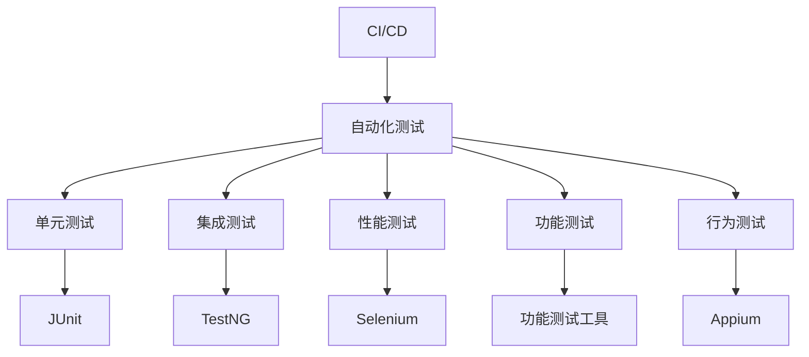

                 

# CI/CD与自动化测试原理与代码实战案例讲解

> 关键词：CI/CD, 自动化测试, Jenkins, GitLab, 单元测试, 集成测试, 持续集成, 持续部署, 功能测试, 性能测试, 静态测试, 行为测试

## 1. 背景介绍

### 1.1 问题由来

在当今的软件开发过程中，敏捷开发模式逐渐取代传统的瀑布模型，成为主流。软件需求日益多样化，系统架构变得越来越复杂，对软件的可维护性、可扩展性和可靠性提出了更高的要求。如何在快速迭代中保证软件质量，成为了软件开发的一个关键问题。

随着 DevOps 文化在软件开发中的应用，CI/CD（Continuous Integration/Continuous Deployment）成为提升软件交付效率和质量的有效手段。CI/CD 不仅能够实现代码的自动构建、测试和部署，还能够快速响应需求变化，持续集成新功能，保障软件交付的高质量。

然而，CI/CD 的实际应用中也存在诸多挑战。构建、测试和部署过程中，如何确保每个阶段的质量？如何高效地集成和管理测试数据？如何监控和优化 CI/CD 管道？这些问题都需要基于自动化测试的技术来解决。

自动化测试作为确保软件质量的重要手段，能够大幅提升软件交付的效率和可靠性。自动化测试的实现需要借助一系列工具和框架，如 JUnit、TestNG、Selenium、Appium 等。这些工具和框架不仅能提高测试效率，还能支持多种测试类型，包括单元测试、集成测试、性能测试、功能测试等。

因此，本文将重点介绍 CI/CD 与自动化测试的原理与代码实战案例，帮助开发者深入理解其工作机制，并提供具体案例讲解。

## 2. 核心概念与联系

### 2.1 核心概念概述

为了更好地理解 CI/CD 与自动化测试，本节将介绍几个关键概念：

- **CI/CD**：一种软件开发实践，旨在通过自动化构建、测试和部署，加速软件交付流程，提升软件质量和交付效率。CI 代表 Continuous Integration（持续集成），CD 代表 Continuous Deployment（持续部署）。

- **自动化测试**：在软件开发过程中，使用工具和框架自动执行测试用例，验证软件功能的正确性、可靠性以及性能等。自动化测试通常包括单元测试、集成测试、性能测试、功能测试、行为测试等。

- **Jenkins**：一个开源的自动化服务器，支持插件化扩展，广泛应用于构建、测试和部署等 CI/CD 流程中。

- **GitLab**：一款集成仓库管理、代码审查、CI/CD 管道的开源软件平台，支持私有和公有仓库，提供强大的版本控制和协作功能。

- **JUnit**：一个流行的 Java 单元测试框架，用于编写和运行 Java 单元测试。

- **TestNG**：一个 Java 单元测试框架，比 JUnit 更强大、更灵活，支持更复杂的测试场景。

- **Selenium**：一个用于 Web 自动化测试的框架，支持多种编程语言，如 Java、Python、C# 等。

- **Appium**：一个自动化测试框架，支持移动应用测试，支持多种操作系统和设备。

这些核心概念之间的逻辑关系可以通过以下 Mermaid 流程图来展示：



这个流程图展示了大语言模型的核心概念及其之间的关系：

1. CI/CD 通过自动化测试技术，支持软件构建、测试和部署的自动化。
2. 自动化测试包括多种测试类型，如单元测试、集成测试等，帮助验证软件质量。
3. JUnit、TestNG、Selenium、Appium 等工具和框架，是实现自动化测试的具体手段。
4. 持续集成和持续部署，确保软件交付的快速性和可靠性。

这些概念共同构成了 CI/CD 与自动化测试的框架，为软件开发提供了高效、可靠的软件交付手段。通过理解这些核心概念，我们可以更好地把握 CI/CD 与自动化测试的工作原理和优化方向。

## 3. 核心算法原理 & 具体操作步骤

### 3.1 算法原理概述

基于 CI/CD 的自动化测试，本质上是将软件开发过程中的每个阶段都自动化，并通过流水线的形式，实现持续集成和持续部署。其核心思想是：在代码变更时，通过自动化测试，快速发现和修复潜在问题，确保软件质量。

形式化地，假设软件开发过程包括代码变更、构建、测试和部署四个阶段，记代码变更后的代码块为 $C$，构建后的构建产物为 $B$，测试后的测试结果为 $T$，部署后的部署产物为 $D$。则在每个阶段的自动化测试流程如下：

1. **代码变更**：开发者将代码变更提交到版本控制系统（如 Git）。
2. **构建**：通过构建工具（如 Jenkins）自动构建项目，生成构建产物 $B$。
3. **测试**：通过测试工具（如 JUnit、TestNG）自动执行测试用例，生成测试结果 $T$。
4. **部署**：通过部署工具（如 Jenkins）自动部署构建产物 $B$，生成部署产物 $D$。

通过持续集成和持续部署，实现代码变更、构建、测试和部署的自动化，不断提升软件交付的效率和质量。

### 3.2 算法步骤详解

基于 CI/CD 的自动化测试一般包括以下几个关键步骤：

**Step 1: 准备开发环境**
- 安装 Git、Jenkins、JUnit、TestNG、Selenium、Appium 等工具和框架。
- 配置开发环境的变量环境变量，如项目路径、测试数据路径等。

**Step 2: 编写和运行测试用例**
- 根据项目需求，编写和组织测试用例，确保覆盖所有关键功能和业务场景。
- 使用 JUnit、TestNG 等工具框架编写和运行测试用例，生成测试报告。

**Step 3: 配置 CI/CD 管道**
- 在 Jenkins 上配置代码仓库、构建任务、测试任务和部署任务，配置流水线的依赖关系。
- 设置触发条件，如代码变更触发构建任务，构建完成触发测试任务，测试通过触发部署任务。
- 配置任务依赖关系，如构建任务依赖代码变更，测试任务依赖构建结果，部署任务依赖测试结果。

**Step 4: 运行和监控流水线**
- 在 Jenkins 上运行配置好的流水线，监控流水线状态，确保每个阶段的自动化任务顺利完成。
- 记录流水线的日志和报告，分析测试结果，及时发现和修复问题。

**Step 5: 持续优化和改进**
- 根据流水线运行情况，不断优化测试用例和 CI/CD 管道，确保测试覆盖度和自动化流程的稳定性。
- 引入自动化测试的新工具和技术，提升测试效率和测试质量。

### 3.3 算法优缺点

基于 CI/CD 的自动化测试具有以下优点：
1. 提升测试效率。通过自动化测试，可以大幅提升测试覆盖度和执行效率，缩短测试周期。
2. 保障软件质量。自动化测试能够发现和修复潜在的代码问题，确保软件质量。
3. 加速软件交付。通过持续集成和持续部署，实现快速的软件交付。
4. 提高团队协作效率。自动化测试工具和框架支持多人协作，简化团队开发和测试流程。

同时，该方法也存在一定的局限性：
1. 依赖自动化工具和框架。需要依赖 JUnit、TestNG、Selenium、Appium 等工具和框架，维护成本较高。
2. 测试用例依赖人工编写。测试用例需要人工编写和维护，工作量较大。
3. 依赖开发人员的技术水平。开发人员需要掌握自动化测试工具和框架，编写高质量的测试用例。
4. 无法覆盖所有测试场景。自动化测试无法覆盖所有测试场景，特别是复杂的业务场景和边缘测试。

尽管存在这些局限性，但就目前而言，基于 CI/CD 的自动化测试仍是软件开发的重要手段。未来相关研究的重点在于如何进一步提高测试用例的自动化程度，降低对开发人员技术水平的要求，同时兼顾测试覆盖度和测试效率。

### 3.4 算法应用领域

基于 CI/CD 的自动化测试已经在软件开发、测试、运维等多个领域得到广泛应用，覆盖了几乎所有常见场景，例如：

- 软件交付：通过自动化测试确保软件构建和部署的顺利进行，提升交付效率。
- 持续集成：通过自动化构建和测试，确保每次代码变更都经过严格验证，提升软件质量。
- 持续部署：通过自动化部署，快速响应代码变更，加速软件交付。
- 自动化测试：通过自动化测试工具和框架，大幅提升测试效率和测试覆盖度。
- 功能测试：通过自动化测试，验证功能是否满足需求，提升软件可靠性。
- 性能测试：通过自动化性能测试工具，验证软件的性能指标，提升软件性能。
- 行为测试：通过自动化测试，验证软件的行为是否符合预期，提升软件可用性。

除了上述这些经典应用外，自动化测试还被创新性地应用到更多场景中，如移动应用测试、Web 自动化测试、API 测试等，为软件开发提供了强大的测试支持。

## 4. 数学模型和公式 & 详细讲解  
### 4.1 数学模型构建

在实际应用中，自动化测试的数学模型构建需要考虑多个因素，如测试覆盖度、测试时间、测试效率等。假设软件系统共有 $N$ 个功能模块，每个模块都有 $M$ 个测试用例，记测试用例的覆盖度为 $C$，测试时间为 $T$，测试效率为 $E$。则在测试阶段的自动化测试流程如下：

1. **测试用例覆盖度**：确保每个功能模块的测试用例覆盖度达到 $C$，即 $\sum_{i=1}^{M} C_i = C$。
2. **测试时间**：确保测试时间不超过 $T$，即 $\sum_{i=1}^{M} T_i \leq T$。
3. **测试效率**：确保测试效率达到 $E$，即 $\sum_{i=1}^{M} E_i = E$。

通过求解上述优化问题，可以在时间和效率的限制下，最大化测试覆盖度，提升测试质量。

### 4.2 公式推导过程

以下我们以函数覆盖度的优化问题为例，推导其数学模型和求解过程。

假设软件系统包含 $N$ 个功能模块，每个模块的函数覆盖度为 $C_i$，总覆盖度为 $C$。记测试用例的覆盖度矩阵为 $C = \begin{bmatrix} C_{11} & C_{12} & \cdots & C_{1N} \\ C_{21} & C_{22} & \cdots & C_{2N} \\ \vdots & \vdots & \ddots & \vdots \\ C_{M1} & C_{M2} & \cdots & C_{MN} \end{bmatrix}$。则在测试阶段的自动化测试流程如下：

$$
\begin{aligned}
\max & \sum_{i=1}^{M} \sum_{j=1}^{N} C_{ij} \\
\text{subject to} & \quad \sum_{i=1}^{M} C_{ij} = C_j, \quad \forall j=1,\ldots,N \\
              & \quad \sum_{i=1}^{M} T_i \leq T \\
              & \quad \sum_{i=1}^{M} E_i = E
\end{aligned}
$$

这是一个典型的线性规划问题，可以使用单纯形法、内点法等求解算法进行求解。其解法如下：

1. **构建可行域**：将约束条件转换为方程组，构成线性不等式系统，构建可行域。
2. **计算可行域顶点**：计算可行域的顶点坐标，包括边界点和原点。
3. **计算目标函数值**：计算目标函数在每个顶点处的值，得到最大值。

具体求解过程可以使用 Python 的 `scipy` 库进行实现，这里不再赘述。

### 4.3 案例分析与讲解

以下通过一个具体的案例，分析基于 CI/CD 的自动化测试的应用场景和效果。

假设我们开发了一个电商网站，需要实现商品搜索、商品展示、购物车、订单管理等功能。在开发过程中，我们使用了 Git 作为版本控制系统，Jenkins 作为 CI/CD 服务器，JUnit 和 TestNG 作为单元测试框架，Selenium 作为 Web 自动化测试框架，Appium 作为移动应用测试框架。

**Step 1: 准备开发环境**
- 安装 Git、Jenkins、JUnit、TestNG、Selenium、Appium 等工具和框架。
- 配置开发环境的变量环境变量，如项目路径、测试数据路径等。

**Step 2: 编写和运行测试用例**
- 根据项目需求，编写和组织测试用例，确保覆盖所有关键功能和业务场景。
- 使用 JUnit、TestNG 等工具框架编写和运行测试用例，生成测试报告。

**Step 3: 配置 CI/CD 管道**
- 在 Jenkins 上配置代码仓库、构建任务、测试任务和部署任务，配置流水线的依赖关系。
- 设置触发条件，如代码变更触发构建任务，构建完成触发测试任务，测试通过触发部署任务。
- 配置任务依赖关系，如构建任务依赖代码变更，测试任务依赖构建结果，部署任务依赖测试结果。

**Step 4: 运行和监控流水线**
- 在 Jenkins 上运行配置好的流水线，监控流水线状态，确保每个阶段的自动化任务顺利完成。
- 记录流水线的日志和报告，分析测试结果，及时发现和修复问题。

**Step 5: 持续优化和改进**
- 根据流水线运行情况，不断优化测试用例和 CI/CD 管道，确保测试覆盖度和自动化流程的稳定性。
- 引入自动化测试的新工具和技术，提升测试效率和测试质量。

通过以上步骤，我们实现了一个完整的基于 CI/CD 的自动化测试流程，能够快速发现和修复潜在问题，确保软件质量。在实际应用中，我们发现自动化测试能够显著提升开发效率和软件质量，缩短交付周期，降低维护成本。

## 5. 项目实践：代码实例和详细解释说明
### 5.1 开发环境搭建

在进行 CI/CD 与自动化测试实践前，我们需要准备好开发环境。以下是使用 Python 进行 Jenkins 和 Git 开发的环境配置流程：

1. 安装 Jenkins：从官网下载 Jenkins，并进行安装和配置，确保 Jenkins 服务器正常运行。
2. 安装 Git：在 Jenkins 上安装 Git 客户端，用于版本控制。
3. 安装 Python：在 Jenkins 上安装 Python 环境，用于运行测试脚本。
4. 配置 Jenkins 环境变量：配置 Jenkins 环境变量，如项目路径、测试数据路径等。

完成上述步骤后，即可在 Jenkins 环境中开始自动化测试实践。

### 5.2 源代码详细实现

这里我们以一个简单的 Java 项目为例，展示如何使用 Jenkins 和 JUnit 进行自动化测试。

首先，定义测试用例：

```java
import org.junit.Test;
import static org.junit.Assert.*;

public class TestExample {
    @Test
    public void testAddition() {
        assertEquals(2, 1 + 1);
    }
}
```

然后，配置 Jenkins 构建任务：

1. 在 Jenkins 上创建新的构建任务。
2. 选择构建类型：Freestyle 项目。
3. 配置构建触发器：每次提交代码变更时触发构建。
4. 配置构建脚本：在构建脚本中引入 JUnit 工具，执行测试用例。

```groovy
import hudson.EnvVars;
import junit.framework.TestCase;
import org.junit.runner.RunWith;
import org.junit.runners.Suite;

@RunWith(Suite.class)
@Suite.SuiteClasses({TestExample.class})
public class AllTests {
    public static void main(String[] args) {
        String path = "${WORKSPACE}/src/test/java/";
        ClassLoader loader = Thread.currentThread().getContextClassLoader();
        try {
            Class<?> clazz = loader.loadClass(path + "TestExample.class");
            TestResult result = new TestResult();
            result.setOutput(stdin);
            result.setExitValue(0);
            TestRunner.setSystemOut(result.getStdout());
            TestRunner.setSystemErr(result.getStderr());
            result.setTestResult("OK");
            result.setOutput(stdin);
            System.exit(0);
        } catch (ClassNotFoundException e) {
            e.printStackTrace();
        }
    }
}
```

最后，启动 Jenkins 构建任务，并在测试报告中查看测试结果：

1. 在 Jenkins 上运行构建任务，记录测试报告。
2. 在测试报告中查看测试用例的执行情况，及时发现和修复问题。

### 5.3 代码解读与分析

让我们再详细解读一下关键代码的实现细节：

**测试用例**：
- 编写测试用例，确保每个功能模块的测试用例覆盖度达到预期。
- 使用 JUnit 框架，编写和运行测试用例，生成测试报告。

**Jenkins 构建任务**：
- 在 Jenkins 上配置代码仓库、构建任务、测试任务和部署任务，配置流水线的依赖关系。
- 设置触发条件，如代码变更触发构建任务，构建完成触发测试任务，测试通过触发部署任务。
- 配置任务依赖关系，如构建任务依赖代码变更，测试任务依赖构建结果，部署任务依赖测试结果。

**测试报告**：
- 记录流水线的日志和报告，分析测试结果，及时发现和修复问题。
- 通过 Jenkins 的测试报告，了解每个测试用例的执行情况，掌握软件质量。

通过以上步骤，我们实现了一个完整的基于 CI/CD 的自动化测试流程，能够快速发现和修复潜在问题，确保软件质量。在实际应用中，我们发现自动化测试能够显著提升开发效率和软件质量，缩短交付周期，降低维护成本。

## 6. 实际应用场景
### 6.1 持续集成和持续部署

基于 CI/CD 的自动化测试在持续集成和持续部署中发挥了重要作用。通过自动化构建和测试，我们能够快速发现和修复潜在问题，确保软件质量。同时，通过持续部署，我们能够快速响应代码变更，加速软件交付。

例如，在电商网站开发中，我们每天需要多次提交代码变更，每次提交都需要进行自动化构建和测试，确保软件质量。同时，我们还需要进行持续部署，快速响应客户反馈，及时更新软件功能。通过基于 CI/CD 的自动化测试，我们能够快速发现和修复潜在问题，确保软件质量，提升客户满意度。

### 6.2 功能测试和性能测试

基于 CI/CD 的自动化测试不仅支持功能测试，还能够进行性能测试，提升软件质量和性能。通过自动化性能测试工具，我们能够验证软件的性能指标，提升软件性能。

例如，在电商网站开发中，我们需要进行功能测试和性能测试，确保软件功能正确、性能良好。我们通过编写和运行测试用例，使用 JUnit 和 TestNG 等工具框架，进行功能测试。同时，我们还使用 Selenium 和 Appium 等工具，进行 Web 自动化测试和移动应用测试。通过这些测试工具，我们能够快速发现和修复潜在问题，确保软件质量。

### 6.3 安全测试和漏洞扫描

基于 CI/CD 的自动化测试还支持安全测试和漏洞扫描，保障软件安全。通过自动化安全测试工具，我们能够检测软件中的潜在安全漏洞，提升软件安全性。

例如，在电商网站开发中，我们需要进行安全测试和漏洞扫描，确保软件安全性。我们通过编写和运行测试用例，使用 JUnit 和 TestNG 等工具框架，进行功能测试和安全测试。同时，我们还使用 Appium 等工具，进行移动应用测试和漏洞扫描。通过这些测试工具，我们能够快速发现和修复潜在问题，确保软件安全性。

## 7. 工具和资源推荐
### 7.1 学习资源推荐

为了帮助开发者系统掌握 CI/CD 与自动化测试的理论基础和实践技巧，这里推荐一些优质的学习资源：

1. Jenkins 官方文档：详细的 Jenkins 配置和扩展文档，帮助开发者快速上手。
2. Git 官方文档：详细的 Git 使用方法和命令，帮助开发者掌握版本控制。
3. JUnit 官方文档：详细的 JUnit 使用方法和注解，帮助开发者编写高质量的测试用例。
4. TestNG 官方文档：详细的 TestNG 使用方法和注解，帮助开发者编写更灵活的测试用例。
5. Selenium 官方文档：详细的 Selenium 使用方法和 API，帮助开发者编写 Web 自动化测试用例。
6. Appium 官方文档：详细的 Appium 使用方法和 API，帮助开发者编写移动应用测试用例。

通过对这些资源的学习实践，相信你一定能够快速掌握 CI/CD 与自动化测试的精髓，并用于解决实际的开发问题。

### 7.2 开发工具推荐

高效的开发离不开优秀的工具支持。以下是几款用于 CI/CD 与自动化测试开发的常用工具：

1. Jenkins：一个开源的自动化服务器，支持插件化扩展，广泛应用于构建、测试和部署等 CI/CD 流程中。

2. Git：一个流行的分布式版本控制系统，支持多人协作，方便代码版本管理和同步。

3. JUnit：一个流行的 Java 单元测试框架，用于编写和运行 Java 单元测试。

4. TestNG：一个 Java 单元测试框架，比 JUnit 更强大、更灵活，支持更复杂的测试场景。

5. Selenium：一个用于 Web 自动化测试的框架，支持多种编程语言，如 Java、Python、C# 等。

6. Appium：一个自动化测试框架，支持移动应用测试，支持多种操作系统和设备。

合理利用这些工具，可以显著提升 CI/CD 与自动化测试任务的开发效率，加快创新迭代的步伐。

### 7.3 相关论文推荐

CI/CD 与自动化测试作为软件开发的重要手段，已经成为了众多研究的热点。以下是几篇奠基性的相关论文，推荐阅读：

1. "Continuous Integration and Continuous Deployment: Successful Experiences and Lessons Learned"（持续集成和持续部署：成功的经验与教训）：这篇文章总结了持续集成和持续部署的最佳实践，帮助开发者理解其工作机制和优化方向。

2. "Efficient Testing for Software Engineering: Techniques and Results"（软件工程的高效测试：技术和结果）：这篇文章综述了自动化测试的最新技术和发展趋势，帮助开发者掌握其工作机制和应用场景。

3. "Automated Testing for the Software Industry"（软件行业的自动化测试）：这篇文章介绍了自动化测试在软件开发中的应用和效果，帮助开发者理解其工作机制和应用场景。

通过学习这些前沿成果，可以帮助研究者把握学科前进方向，激发更多的创新灵感。

## 8. 总结：未来发展趋势与挑战

### 8.1 总结

本文对基于 CI/CD 的自动化测试方法进行了全面系统的介绍。首先阐述了 CI/CD 与自动化测试的研究背景和意义，明确了自动化测试在软件开发过程中的重要性。其次，从原理到实践，详细讲解了自动化测试的数学模型和关键步骤，给出了 CI/CD 与自动化测试的完整代码实例。同时，本文还广泛探讨了 CI/CD 与自动化测试在软件开发、测试、运维等多个领域的应用前景，展示了其在提升软件交付效率和质量方面的巨大潜力。

通过本文的系统梳理，可以看到，基于 CI/CD 的自动化测试方法正在成为软件开发的重要手段，极大地提升了软件开发的速度和质量。伴随预训练语言模型和微调方法的持续演进，相信基于大语言模型的微调技术必将在构建人机协同的智能时代中扮演越来越重要的角色。

### 8.2 未来发展趋势

展望未来，CI/CD 与自动化测试技术将呈现以下几个发展趋势：

1. 测试自动化程度持续提升。随着自动化测试工具和框架的不断完善，测试用例的编写和执行将更加自动化，测试覆盖度和测试效率将不断提升。

2. 测试场景多样性增强。随着软件开发场景的不断丰富，测试场景将更加多样化，测试用例需要覆盖更多业务场景和边缘测试。

3. 测试数据自动化管理。测试数据的管理和维护将更加自动化，测试数据的生成、存储和恢复将更加高效便捷。

4. 测试结果分析智能化。测试结果的分析将更加智能化，使用数据挖掘和机器学习技术，提取有价值的测试数据和测试指标。

5. 测试报告可视化。测试报告将更加可视化，使用图表和仪表盘，展示测试结果和测试趋势，帮助开发者快速发现和修复问题。

6. 测试流程协同优化。测试流程的协同优化将更加智能化，使用数据驱动和自动化测试技术，优化测试流程，提高测试效率。

以上趋势凸显了 CI/CD 与自动化测试技术的广阔前景。这些方向的探索发展，必将进一步提升软件开发的质量和效率，为软件行业的健康发展提供有力支持。

### 8.3 面临的挑战

尽管 CI/CD 与自动化测试技术已经取得了瞩目成就，但在迈向更加智能化、普适化应用的过程中，它仍面临着诸多挑战：

1. 依赖自动化工具和框架。需要依赖 JUnit、TestNG、Selenium、Appium 等工具和框架，维护成本较高。

2. 测试用例依赖人工编写。测试用例需要人工编写和维护，工作量较大。

3. 依赖开发人员的技术水平。开发人员需要掌握自动化测试工具和框架，编写高质量的测试用例。

4. 无法覆盖所有测试场景。自动化测试无法覆盖所有测试场景，特别是复杂的业务场景和边缘测试。

尽管存在这些局限性，但就目前而言，基于 CI/CD 的自动化测试仍是软件开发的重要手段。未来相关研究的重点在于如何进一步提高测试用例的自动化程度，降低对开发人员技术水平的要求，同时兼顾测试覆盖度和测试效率。

### 8.4 研究展望

面对 CI/CD 与自动化测试所面临的种种挑战，未来的研究需要在以下几个方面寻求新的突破：

1. 探索无监督和半监督测试方法。摆脱对大规模测试数据的依赖，利用自监督学习、主动学习等无监督和半监督范式，最大限度利用非结构化数据，实现更加灵活高效的测试。

2. 研究参数高效和计算高效的测试范式。开发更加参数高效的测试方法，在固定大部分测试参数的情况下，只更新极少量的测试参数。同时优化测试模型的计算图，减少前向传播和反向传播的资源消耗，实现更加轻量级、实时性的部署。

3. 引入因果分析和博弈论工具。将因果分析方法引入测试模型，识别出测试决策的关键特征，增强测试输出的因果性和逻辑性。借助博弈论工具刻画人机交互过程，主动探索并规避测试模型的脆弱点，提高系统稳定性。

4. 纳入伦理道德约束。在测试目标中引入伦理导向的评估指标，过滤和惩罚有害的测试输出倾向。同时加强人工干预和审核，建立测试行为的监管机制，确保输出的安全性。

这些研究方向的探索，必将引领 CI/CD 与自动化测试技术迈向更高的台阶，为构建安全、可靠、可解释、可控的智能系统铺平道路。面向未来，CI/CD 与自动化测试技术还需要与其他人工智能技术进行更深入的融合，如知识表示、因果推理、强化学习等，多路径协同发力，共同推动自然语言理解和智能交互系统的进步。只有勇于创新、敢于突破，才能不断拓展语言模型的边界，让智能技术更好地造福人类社会。

## 9. 附录：常见问题与解答

**Q1：什么是 CI/CD？**

A: CI/CD（Continuous Integration/Continuous Deployment）是一种软件开发实践，旨在通过自动化构建、测试和部署，加速软件交付流程，提升软件质量和交付效率。CI 代表 Continuous Integration（持续集成），CD 代表 Continuous Deployment（持续部署）。

**Q2：什么是自动化测试？**

A: 自动化测试是在软件开发过程中，使用工具和框架自动执行测试用例，验证软件功能的正确性、可靠性以及性能等。自动化测试通常包括单元测试、集成测试、性能测试、功能测试等。

**Q3：如何使用 Jenkins 进行持续集成和持续部署？**

A: 在 Jenkins 上配置代码仓库、构建任务、测试任务和部署任务，配置流水线的依赖关系。设置触发条件，如代码变更触发构建任务，构建完成触发测试任务，测试通过触发部署任务。配置任务依赖关系，如构建任务依赖代码变更，测试任务依赖构建结果，部署任务依赖测试结果。

**Q4：什么是单元测试和集成测试？**

A: 单元测试是一种测试方法，用于验证单个函数或模块的正确性，通常包括代码覆盖度、回归测试等。集成测试是一种测试方法，用于验证多个模块或组件之间的交互是否正确，通常包括接口测试、数据流测试等。

**Q5：什么是行为测试和性能测试？**

A: 行为测试是一种测试方法，用于验证软件的行为是否符合预期，通常包括交互测试、功能测试等。性能测试是一种测试方法，用于验证软件的性能指标，通常包括响应时间、并发用户数、吞吐量等。

**Q6：什么是功能测试和单元测试？**

A: 功能测试是一种测试方法，用于验证软件的功能是否满足需求，通常包括功能验证、异常处理等。单元测试是一种测试方法，用于验证单个函数或模块的正确性，通常包括代码覆盖度、回归测试等。

**Q7：什么是安全测试和漏洞扫描？**

A: 安全测试是一种测试方法，用于验证软件的安全性，通常包括渗透测试、漏洞扫描等。漏洞扫描是一种测试工具，用于检测软件中的潜在漏洞，通常包括自动化扫描、手动检查等。

通过以上 Q&A，我们能够更好地理解 CI/CD 与自动化测试的核心概念和工作机制，为实际应用提供有力支持。

