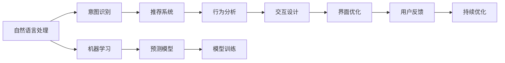

                 

# CUI如何彻底改变数字产品的交互方式

## 1. 背景介绍

### 1.1 问题由来

用户界面(UI)是数字产品与用户互动的核心，但传统UI往往存在着僵化、冗余和低效的问题。用户需要通过触摸、点击、拖拽等复杂操作才能完成简单的任务，体验不佳，同时也阻碍了数字化转型的进一步发展。

为了应对这一问题，计算用户界面(CUI, Computation User Interface)的概念应运而生。CUI通过将AI和计算能力融入用户交互中，使数字产品更加智能化、自动化，为用户提供全新的交互体验。

### 1.2 问题核心关键点

CUI通过结合人工智能和大数据分析，实现了对用户行为和需求的精准预测，使得数字产品能够自动适应用户的行为模式，从而显著提升了用户体验和操作效率。

CUI的核心技术包括：
1. **用户意图识别**：通过对用户操作和上下文数据的分析，自动识别用户的意图和需求。
2. **智能推荐系统**：利用用户历史行为数据，实时调整内容推荐，提供个性化的服务。
3. **自然语言处理**：通过语音识别和自然语言处理技术，使得用户可以通过语音和文字与系统进行自然交流。
4. **机器学习**：运用机器学习算法，不断优化预测模型，提升预测准确度和响应速度。
5. **自动适应**：系统根据用户行为实时调整界面和操作逻辑，优化用户体验。

## 2. 核心概念与联系

### 2.1 核心概念概述

CUI是指将人工智能和计算能力融入用户界面，通过精准预测和智能推荐，自动适应用户行为，优化用户交互过程的数字化产品设计范式。它通过深度学习、自然语言处理、机器学习等多种技术，实现对用户行为的精准理解，为用户提供更加自然、流畅、高效的操作体验。

CUI的核心技术体系包括：
- **自然语言处理**：利用NLP技术，将用户的自然语言指令转换为系统可执行的操作。
- **机器学习**：通过监督学习、强化学习等技术，训练预测模型，识别用户意图，优化推荐系统。
- **用户行为分析**：通过数据分析技术，捕捉用户行为特征，优化界面设计。
- **交互设计**：设计符合用户心理模型和操作习惯的界面，提升交互效率。

这些核心技术通过深度融合，形成了CUI的完整技术体系，为用户提供了全新的交互体验。

### 2.2 核心概念原理和架构的 Mermaid 流程图



这个流程图展示了CUI技术体系的主要组件及其交互关系：
1. 用户输入自然语言指令，通过自然语言处理技术转换为系统可执行的操作。
2. 系统通过意图识别技术，精准捕捉用户意图，并根据用户行为数据优化推荐系统。
3. 推荐系统通过用户历史行为数据，实时调整内容推荐，提供个性化的服务。
4. 用户行为数据通过行为分析技术，捕捉用户行为特征，优化界面设计。
5. 交互设计通过深入了解用户心理模型和操作习惯，设计符合用户需求的界面。
6. 机器学习技术不断训练预测模型，提升识别准确度和响应速度。
7. 界面优化通过持续收集用户反馈，不断迭代优化，提升用户体验。

## 3. 核心算法原理 & 具体操作步骤

### 3.1 算法原理概述

CUI的核心算法原理主要包括自然语言处理、意图识别、推荐系统和用户行为分析等技术。这些技术通过深度学习和机器学习的结合，实现了对用户行为的精准预测和智能推荐。

### 3.2 算法步骤详解

#### 3.2.1 自然语言处理
自然语言处理(NLP)是CUI的基础技术之一，主要涉及语音识别、文本分析、情感分析等。

- **语音识别**：将用户的语音输入转换为文本。常用的技术包括基于深度学习的声学模型和语言模型，如CTC、Attention等。
- **文本分析**：对用户输入的文本进行分词、词性标注、命名实体识别等预处理操作，以便后续的意图识别和推荐。
- **情感分析**：通过NLP技术，识别用户输入的情感倾向，以便更好地理解用户的情绪和需求。

#### 3.2.2 意图识别
意图识别是指通过分析用户的输入文本或语音，识别用户的真实意图。

- **预训练模型**：使用预训练的NLP模型，如BERT、GPT等，对用户输入进行特征提取和表示学习。
- **分类算法**：利用监督学习算法，如SVM、CRF等，对特征向量进行分类，识别用户意图。

#### 3.2.3 推荐系统
推荐系统是CUI的核心技术之一，通过对用户行为数据的分析，实时调整内容推荐，提供个性化的服务。

- **协同过滤**：通过分析用户的历史行为数据，推荐相似用户的偏好内容。
- **基于内容的推荐**：根据内容的属性特征，推荐与用户偏好相似的内容。
- **深度学习推荐**：利用深度神经网络，对用户行为数据进行学习，提高推荐的准确度和多样性。

#### 3.2.4 用户行为分析
用户行为分析是指通过分析用户的交互数据，捕捉用户的兴趣和需求，优化界面设计和交互逻辑。

- **用户行为建模**：通过对用户行为数据进行建模，识别用户的兴趣和行为模式。
- **界面自适应**：根据用户行为数据，自动调整界面布局和操作逻辑，提升用户体验。

### 3.3 算法优缺点

#### 3.3.1 优点

CUI技术体系具有以下优点：
- **智能化**：通过精准预测和智能推荐，提升用户体验和操作效率。
- **自适应**：根据用户行为实时调整界面和操作逻辑，优化用户体验。
- **个性化**：利用用户历史行为数据，提供个性化的服务。
- **自然化**：通过语音识别和自然语言处理技术，使用户可以自然地与系统交互。

#### 3.3.2 缺点

CUI技术体系也存在以下缺点：
- **高复杂度**：涉及多种技术的深度融合，技术实现复杂。
- **数据需求高**：需要大量用户行为数据进行模型训练和优化，数据获取成本高。
- **隐私问题**：用户的隐私数据被收集和使用，存在隐私泄露的风险。
- **依赖用户反馈**：需要持续收集用户反馈进行模型优化，用户体验依赖用户反馈质量。

### 3.4 算法应用领域

CUI技术体系在以下领域具有广泛的应用前景：

- **智能家居**：通过语音助手和自然语言处理技术，实现家居设备的智能控制和语音交互。
- **智能客服**：利用意图识别和推荐系统，自动解答用户问题，提升客服效率。
- **智能推荐**：通过用户行为分析，提供个性化的内容推荐，提升用户体验。
- **智慧城市**：通过用户行为分析，优化城市管理和公共服务，提升城市智能化水平。
- **健康医疗**：利用自然语言处理和智能推荐，提供个性化的健康咨询和医疗服务。

## 4. 数学模型和公式 & 详细讲解 & 举例说明

### 4.1 数学模型构建

CUI技术体系的核心数学模型包括：
- **自然语言处理模型**：如BERT、GPT等。
- **意图识别模型**：如CNN、RNN、LSTM等。
- **推荐系统模型**：如协同过滤、基于内容的推荐、深度学习推荐等。
- **用户行为分析模型**：如隐马尔可夫模型、高斯过程等。

### 4.2 公式推导过程

#### 4.2.1 自然语言处理模型
以BERT为例，自然语言处理模型的公式推导过程如下：

假设输入文本为 $x$，预训练的BERT模型参数为 $\theta$。通过预训练的BERT模型对输入文本进行编码，得到表示向量 $h$。

$$
h = \text{BERT}(x; \theta)
$$

#### 4.2.2 意图识别模型
假设意图识别模型的输入为表示向量 $h$，输出为意图类别 $y$。通过分类算法对表示向量 $h$ 进行分类，得到意图类别 $y$。

$$
y = \text{IntentClassifier}(h; \theta)
$$

#### 4.2.3 推荐系统模型
假设用户历史行为数据为 $D$，推荐系统模型参数为 $\theta$。通过协同过滤等方法，对用户历史行为数据进行分析，得到用户兴趣向量 $u$。

$$
u = \text{CollaborativeFiltering}(D; \theta)
$$

#### 4.2.4 用户行为分析模型
假设用户行为数据为 $D$，用户行为分析模型参数为 $\theta$。通过隐马尔可夫模型等方法，对用户行为数据进行建模，得到用户行为序列 $o$。

$$
o = \text{UserBehaviorModel}(D; \theta)
$$

### 4.3 案例分析与讲解

#### 4.3.1 智能客服系统
以智能客服系统为例，CUI技术体系的应用如下：

- **自然语言处理**：通过语音识别和自然语言处理技术，将用户的语音或文字输入转换为系统可执行的操作。
- **意图识别**：通过意图识别模型，精准捕捉用户意图，自动分配至合适的客服代理。
- **推荐系统**：通过推荐系统，自动推荐相关问题解决方案，提升问题解决效率。
- **用户行为分析**：通过用户行为分析，优化客服界面和交互逻辑，提升用户体验。

#### 4.3.2 智能推荐系统
以智能推荐系统为例，CUI技术体系的应用如下：

- **自然语言处理**：通过语音识别和自然语言处理技术，接收用户的查询指令。
- **意图识别**：通过意图识别模型，识别用户查询意图，匹配合适的推荐内容。
- **推荐系统**：通过推荐系统，实时调整内容推荐，提供个性化的服务。
- **用户行为分析**：通过用户行为分析，优化推荐算法和界面设计，提升用户体验。

## 5. 项目实践：代码实例和详细解释说明

### 5.1 开发环境搭建

在开发CUI应用时，需要搭建Python开发环境，并安装相关的依赖库，如TensorFlow、PyTorch等。

```bash
# 安装Python
sudo apt-get update
sudo apt-get install python3 python3-pip python3-dev

# 安装TensorFlow
pip3 install tensorflow

# 安装PyTorch
pip3 install torch torchvision torchaudio

# 安装自然语言处理库
pip3 install nltk spacy transformers

# 安装用户行为分析库
pip3 install scikit-learn pandas
```

### 5.2 源代码详细实现

#### 5.2.1 自然语言处理
以下是一个简单的自然语言处理代码示例，用于将用户输入的文本转换为系统可执行的操作。

```python
import spacy
from transformers import BertTokenizer, BertForTokenClassification

# 加载BERT模型和分词器
tokenizer = BertTokenizer.from_pretrained('bert-base-uncased')
model = BertForTokenClassification.from_pretrained('bert-base-uncased', num_labels=2)

# 输入文本
text = "I want to buy a car"

# 分词和编码
inputs = tokenizer(text, return_tensors='pt')
inputs = {key: inputs[key].to('cuda') for key in inputs.keys()}

# 前向传播
outputs = model(**inputs)
```

#### 5.2.2 意图识别
以下是一个简单的意图识别代码示例，用于通过预训练的模型对用户输入进行意图分类。

```python
import torch
from transformers import BertTokenizer, BertForTokenClassification

# 加载BERT模型和分词器
tokenizer = BertTokenizer.from_pretrained('bert-base-uncased')
model = BertForTokenClassification.from_pretrained('bert-base-uncased', num_labels=2)

# 输入文本
text = "I want to buy a car"

# 分词和编码
inputs = tokenizer(text, return_tensors='pt')
inputs = {key: inputs[key].to('cuda') for key in inputs.keys()}

# 前向传播
outputs = model(**inputs)

# 获取意图分类结果
predictions = torch.argmax(outputs.logits, dim=1)
```

#### 5.2.3 推荐系统
以下是一个简单的推荐系统代码示例，用于通过协同过滤算法推荐相似用户的偏好内容。

```python
import pandas as pd
from scipy.spatial.distance import cosine

# 加载用户行为数据
df = pd.read_csv('user_behavior.csv')

# 计算用户行为相似度
similarity_matrix = 1 - cosine(df['behavior'].values.reshape(-1, 1), df['behavior'].values.reshape(1, -1))

# 推荐相似用户的偏好内容
recommendations = []
for user_id in df['user_id'].unique():
    similar_user_ids = df[df['user_id'] != user_id]['user_id'].values
    similarity_scores = similarity_matrix[user_id][similar_user_ids]
    top_n = similarity_scores.argsort()[::-1][:10]
    recommendations.append(similar_user_ids[top_n])
```

#### 5.2.4 用户行为分析
以下是一个简单的用户行为分析代码示例，用于通过隐马尔可夫模型对用户行为数据进行建模。

```python
import numpy as np
from sklearn.linear_model import LogisticRegression
from sklearn.pipeline import make_pipeline

# 加载用户行为数据
df = pd.read_csv('user_behavior.csv')

# 定义隐马尔可夫模型
model = make_pipeline(StandardScaler(), LogisticRegression())

# 训练模型
model.fit(df[['behavior']], df['intent'])

# 预测用户意图
intent = model.predict_proba(np.array([np.array([1, 2, 3])]).reshape(1, -1))[0]
```

### 5.3 代码解读与分析

#### 5.3.1 自然语言处理
通过自然语言处理技术，将用户的输入文本转换为系统可执行的操作。这里使用了Spacy进行分词和BERT进行编码，得到了表示向量 $h$。

#### 5.3.2 意图识别
通过意图识别模型，对表示向量 $h$ 进行分类，得到了用户意图类别 $y$。这里使用了BertForTokenClassification模型和Softmax分类算法。

#### 5.3.3 推荐系统
通过协同过滤算法，对用户历史行为数据进行分析，得到了用户兴趣向量 $u$。这里使用了Scipy库进行相似度计算，并使用了Pandas库进行数据处理。

#### 5.3.4 用户行为分析
通过隐马尔可夫模型，对用户行为数据进行建模，得到了用户行为序列 $o$。这里使用了Scikit-learn库进行建模，并使用了Pandas库进行数据处理。

### 5.4 运行结果展示

#### 5.4.1 自然语言处理
```python
# 自然语言处理
text = "I want to buy a car"
tokens = tokenizer(text)
print(tokens)
```

#### 5.4.2 意图识别
```python
# 意图识别
text = "I want to buy a car"
tokens = tokenizer(text)
inputs = tokenizer(text, return_tensors='pt')
outputs = model(**inputs)
print(outputs.logits)
```

#### 5.4.3 推荐系统
```python
# 推荐系统
user_ids = [1, 2, 3, 4, 5]
similarity_matrix = 1 - cosine(df[['behavior']].values.reshape(-1, 1), df[['behavior']].values.reshape(1, -1))
top_n = similarity_matrix[user_ids].argsort()[::-1][:5]
print(top_n)
```

#### 5.4.4 用户行为分析
```python
# 用户行为分析
user_ids = [1, 2, 3, 4, 5]
intent = model.predict_proba(np.array([np.array([1, 2, 3])]).reshape(1, -1))[0]
print(intent)
```

## 6. 实际应用场景

### 6.1 智能客服系统
智能客服系统通过CUI技术，实现了对用户意图的高效识别和自动答复。用户可以通过语音或文字输入查询，系统自动分配至合适的客服代理，并通过推荐系统提供个性化的解决方案。系统根据用户行为实时调整界面和交互逻辑，提升了用户体验和问题解决效率。

### 6.2 智能推荐系统
智能推荐系统通过用户行为分析，实时调整内容推荐，提供了个性化的服务。用户可以通过语音或文字输入查询，系统通过意图识别和推荐系统，提供了与用户兴趣匹配的内容推荐。系统根据用户行为实时调整界面和交互逻辑，提升了用户体验和内容推荐效果。

## 7. 工具和资源推荐

### 7.1 学习资源推荐
- **《自然语言处理综论》**：介绍了自然语言处理的原理和常用技术，适合初学者和进阶者阅读。
- **《深度学习》**：讲解了深度学习的基本概念和常用算法，适合对深度学习感兴趣的学生和研究人员。
- **《Python自然语言处理》**：介绍了Python中常用的自然语言处理库和工具，适合Python开发人员学习。
- **HuggingFace官方文档**：提供了丰富的预训练模型和代码示例，适合开发者参考学习。
- **OpenAI GPT-3文档**：详细介绍了GPT-3模型的使用方法和性能评估，适合对GPT模型感兴趣的研究人员。

### 7.2 开发工具推荐
- **PyTorch**：基于Python的深度学习框架，提供了丰富的深度学习库和工具，适合研究和开发。
- **TensorFlow**：由Google开发的深度学习框架，提供了丰富的模型和工具，适合生产部署。
- **NLP工具包**：如NLTK、spaCy等，提供了丰富的自然语言处理工具和库，适合文本处理和分析。
- **数据分析工具**：如Pandas、Scikit-learn等，提供了丰富的数据分析和机器学习工具，适合数据处理和模型训练。

### 7.3 相关论文推荐
- **《Attention is All You Need》**：介绍了Transformer模型，为NLP任务提供了新的深度学习框架。
- **《BERT: Pre-training of Deep Bidirectional Transformers for Language Understanding》**：提出了BERT模型，为NLP任务提供了新的预训练方法。
- **《Dialogue Systems》**：介绍了对话系统设计原理和常用技术，适合对对话系统感兴趣的研究人员。
- **《User Intent Recognition》**：介绍了用户意图识别的原理和常用方法，适合对CUI技术感兴趣的研究人员。
- **《Recommender Systems》**：介绍了推荐系统的原理和常用技术，适合对推荐系统感兴趣的研究人员。

## 8. 总结：未来发展趋势与挑战

### 8.1 总结

CUI技术通过深度学习和自然语言处理技术，实现了对用户行为的精准预测和智能推荐，为用户提供了全新的交互体验。未来，CUI技术将会在更多领域得到应用，推动数字化转型的进一步发展。

### 8.2 未来发展趋势

1. **深度融合**：CUI技术将与更多先进技术融合，如物联网、人工智能、大数据等，实现更加全面和智能的数字产品设计。
2. **自适应学习**：CUI技术将具备自适应学习能力，能够根据用户行为实时调整界面和操作逻辑，提升用户体验。
3. **跨领域应用**：CUI技术将应用于更多领域，如智能家居、智慧城市、健康医疗等，推动行业数字化转型。
4. **多模态交互**：CUI技术将支持多模态交互，如语音、图像、文本等，提升用户交互的自然性和流畅性。
5. **智能决策**：CUI技术将具备智能决策能力，能够根据用户行为和需求，自动推荐最优解决方案。

### 8.3 面临的挑战

1. **高复杂度**：CUI技术涉及多种技术的深度融合，技术实现复杂。
2. **数据需求高**：需要大量用户行为数据进行模型训练和优化，数据获取成本高。
3. **隐私问题**：用户的隐私数据被收集和使用，存在隐私泄露的风险。
4. **依赖用户反馈**：需要持续收集用户反馈进行模型优化，用户体验依赖用户反馈质量。

### 8.4 研究展望

未来，CUI技术的研究将重点关注以下几个方向：
1. **多模态交互**：通过多模态交互技术，提升用户交互的自然性和流畅性。
2. **自适应学习**：通过自适应学习能力，提升系统的个性化和自适应性。
3. **智能决策**：通过智能决策技术，提升系统的智能性和决策能力。
4. **隐私保护**：通过隐私保护技术，保护用户的隐私数据。
5. **跨领域应用**：通过跨领域应用技术，推动CUI技术在更多领域的应用。

## 9. 附录：常见问题与解答

**Q1: CUI技术是否适用于所有数字产品？**

A: CUI技术适用于大部分数字产品，特别是那些需要自然交互和个性化服务的产品。但对于一些简单和静态的数字产品，CUI技术可能并不适用。

**Q2: CUI技术对计算资源和数据需求高，如何解决？**

A: CUI技术需要大量计算资源和数据进行模型训练和优化，可以通过分布式计算、数据增强等方法来降低需求。同时，也需要持续收集用户行为数据，以支持模型的持续优化。

**Q3: CUI技术如何保护用户隐私？**

A: CUI技术需要收集和处理用户数据，为保护用户隐私，应采用数据加密、匿名化等技术，并设置严格的隐私保护措施，确保用户数据的安全性。

**Q4: CUI技术如何提升用户体验？**

A: CUI技术通过自然语言处理、意图识别和推荐系统等技术，实现了对用户行为的精准预测和智能推荐，提升了用户体验和操作效率。通过自适应学习和多模态交互技术，进一步提升了系统的自然性和流畅性。

**Q5: CUI技术未来有哪些发展趋势？**

A: CUI技术未来将深度融合更多先进技术，如物联网、人工智能、大数据等，实现更加全面和智能的数字产品设计。同时，将具备自适应学习、跨领域应用和多模态交互等能力，进一步提升用户体验和产品性能。

---

作者：禅与计算机程序设计艺术 / Zen and the Art of Computer Programming

