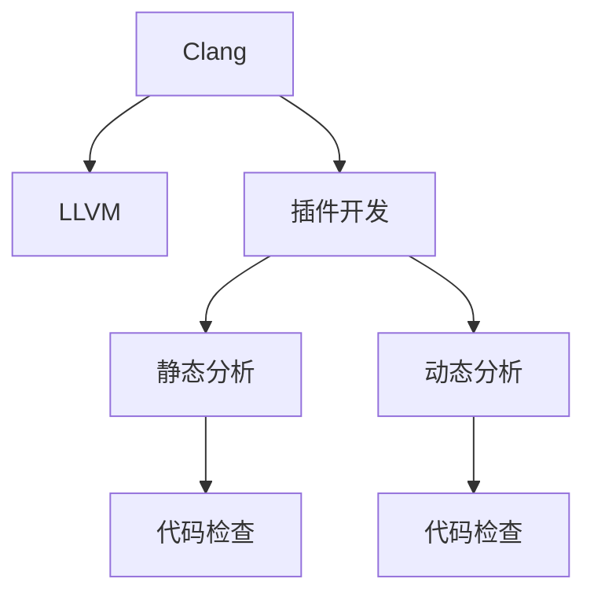

                 

# Clang插件开发与代码检查

> 关键词：Clang, LLVM, 插件开发, 代码检查, 静态分析, 动态分析, 工具链

## 1. 背景介绍

### 1.1 问题由来

随着软件规模的不断扩大和复杂性的提升，如何确保代码质量、减少bug和提高开发效率成为了软件开发中一个日益凸显的问题。传统的静态分析和动态测试方法虽然有效，但难以兼顾全面性和实时性。

Clang作为LLVM项目的一部分，是一个高性能的C++编译器，它提供了丰富的静态分析和动态测试能力。通过开发Clang插件，可以将代码检查嵌入到编译过程中，实现静态代码分析与动态测试的深度集成，从而提高开发效率和代码质量。

### 1.2 问题核心关键点

Clang插件是Clang编译器的一个扩展机制，通过实现特定的代码检查和分析功能，可以在编译时自动发现潜在问题和缺陷。Clang插件分为两类：静态分析和动态分析。

- 静态分析：在编译时分析源代码，检查潜在的问题和缺陷。常见的静态分析包括类型错误、内存泄漏、缓冲区溢出等。
- 动态分析：在运行时分析程序行为，检查运行时的异常和错误。常见的动态分析包括控制流错误、死锁、数据竞争等。

Clang插件的核心关键点包括：

- 实现代码检查功能，检查源代码中的潜在问题。
- 集成到编译流程中，确保代码检查的自动执行。
- 提供友好的用户界面和报告机制，方便开发者查看和处理检查结果。
- 支持灵活的配置选项，可以自定义检查类型和检测灵敏度。

### 1.3 问题研究意义

通过开发Clang插件，可以显著提高代码质量、减少bug和提升开发效率。Clang插件可以自动检测潜在问题和缺陷，提前发现问题并及时修正，避免问题积累到后期难以解决。同时，Clang插件能够提升开发效率，通过自动化的代码检查和分析，减少手动测试和调试工作量，提高开发速度。

此外，Clang插件还可以与其他工具链和开发环境进行集成，提升软件开发的整体质量。通过与版本控制工具、持续集成工具的集成，实现自动化的代码检查和分析，提升开发效率和代码质量。

## 2. 核心概念与联系

### 2.1 核心概念概述

为了更好地理解Clang插件开发与代码检查的方法，本节将介绍几个密切相关的核心概念：

- Clang：LLVM项目的一部分，是一个高性能的C++编译器，支持C、C++、Objective-C等多种编程语言。Clang通过其前端解析器和后端代码生成器，实现了代码的自动分析和生成。
- LLVM：LLVM（Low-Level Virtual Machine）是一个低级别的虚拟机架构，支持多语言和跨平台编译。LLVM提供了高效的代码生成、优化和调试功能，是Clang的核心后端支持。
- 插件开发：Clang插件是Clang编译器的一个扩展机制，通过实现特定的代码检查和分析功能，可以在编译时自动发现潜在问题和缺陷。Clang插件分为静态分析和动态分析两类。
- 代码检查：通过静态分析和动态分析，自动检测源代码中的潜在问题和缺陷。常见的代码检查包括类型错误、内存泄漏、缓冲区溢出等。
- 静态分析：在编译时分析源代码，检查潜在的问题和缺陷。常见的静态分析包括类型错误、内存泄漏、缓冲区溢出等。
- 动态分析：在运行时分析程序行为，检查运行时的异常和错误。常见的动态分析包括控制流错误、死锁、数据竞争等。

这些核心概念之间的逻辑关系可以通过以下Mermaid流程图来展示：



这个流程图展示了大语言模型的核心概念及其之间的关系：

1. Clang通过LLVM作为后端支持，实现代码的自动分析和生成。
2. Clang插件是Clang编译器的一个扩展机制，通过实现特定的代码检查和分析功能，可以在编译时自动发现潜在问题和缺陷。
3. 代码检查分为静态分析和动态分析两类，分别在编译时和运行时进行。
4. 静态分析和动态分析都是代码检查的重要手段，提升代码质量和开发效率。

这些概念共同构成了Clang插件开发与代码检查的框架，使其能够在各种场景下发挥强大的分析能力。通过理解这些核心概念，我们可以更好地把握Clang插件开发与代码检查的工作原理和优化方向。

## 3. 核心算法原理 & 具体操作步骤
### 3.1 算法原理概述

Clang插件开发与代码检查的核心算法原理是静态分析和动态分析，具体包括：

- 静态分析：在编译时分析源代码，检查潜在的问题和缺陷。常见的静态分析包括类型错误、内存泄漏、缓冲区溢出等。
- 动态分析：在运行时分析程序行为，检查运行时的异常和错误。常见的动态分析包括控制流错误、死锁、数据竞争等。

这些算法原理通过Clang插件实现，具体步骤如下：

1. 设计插件：根据特定的代码检查和分析需求，设计插件功能。
2. 实现插件：使用Clang API编写插件代码，实现代码检查和分析功能。
3. 集成插件：将插件集成到Clang编译器中，确保代码检查的自动执行。
4. 提供报告：提供友好的用户界面和报告机制，方便开发者查看和处理检查结果。
5. 支持配置：提供灵活的配置选项，可以自定义检查类型和检测灵敏度。

### 3.2 算法步骤详解

以下以静态分析为例，详细介绍Clang插件开发与代码检查的具体步骤：

**Step 1: 设计插件功能**

设计插件功能时，需要考虑以下几个关键点：

1. 确定检查类型：选择合适的检查类型，如类型错误、内存泄漏、缓冲区溢出等。
2. 设计检查策略：确定检查策略，如检查范围、检查方式、检查条件等。
3. 设计报告格式：确定报告格式，如检查结果、警告信息、错误信息等。

**Step 2: 实现插件代码**

实现插件代码时，需要编写以下几个模块：

1. 分析模块：实现静态分析算法，扫描源代码并查找问题。
2. 报告模块：生成报告并输出到控制台或日志文件。
3. 钩子模块：实现钩子函数，在编译过程中自动调用。

**Step 3: 集成插件**

将插件集成到Clang编译器中，需要以下步骤：

1. 编写Clang插件描述文件：定义插件的名称、版本、依赖项等。
2. 编写Clang插件钩子函数：实现插件的钩子函数，用于在编译过程中自动调用。
3. 安装插件：将插件安装到Clang编译器中，并配置Clang编译器的插件路径。

**Step 4: 提供报告**

提供友好的用户界面和报告机制，方便开发者查看和处理检查结果。报告机制可以包括控制台输出、日志文件、文本文件等多种形式。

**Step 5: 支持配置**

提供灵活的配置选项，可以自定义检查类型和检测灵敏度。配置选项通常包括检查类型、检测灵敏度、报告格式等。

### 3.3 算法优缺点

Clang插件开发与代码检查方法具有以下优点：

1. 集成度高：Clang插件可以自动集成到编译过程中，确保代码检查的自动执行。
2. 功能丰富：Clang插件可以实现多种静态分析和动态分析功能，提升代码质量。
3. 灵活性强：Clang插件支持灵活的配置选项，可以自定义检查类型和检测灵敏度。
4. 用户体验好：Clang插件提供友好的用户界面和报告机制，方便开发者查看和处理检查结果。

同时，该方法也存在一些局限性：

1. 开发成本高：开发Clang插件需要一定的编程能力和工具链知识，开发成本较高。
2. 插件性能低：Clang插件需要在编译时进行代码分析，可能会影响编译速度和性能。
3. 插件兼容性差：不同的Clang版本和架构可能存在兼容性问题，插件的移植和维护成本较高。
4. 插件可靠性差：Clang插件的检查结果可能存在误报和漏报，需要人工复核和修正。

尽管存在这些局限性，但Clang插件开发与代码检查方法仍然是大规模代码质量控制和自动化测试的重要手段。通过合理设计和使用Clang插件，可以显著提升代码质量、减少bug和提高开发效率。

### 3.4 算法应用领域

Clang插件开发与代码检查方法广泛应用于软件开发和测试领域，具体包括：

- 代码质量控制：通过静态分析和动态分析，自动检测源代码中的潜在问题和缺陷，提升代码质量。
- 自动化测试：在编译时自动执行代码检查和分析，提升测试效率和测试覆盖率。
- 代码审计：在软件开发过程中，对代码进行审计和检查，发现潜在问题和缺陷。
- 持续集成：在持续集成过程中，自动执行代码检查和分析，提升代码质量和开发效率。
- 安全检测：在编译时自动检测代码中的安全漏洞和潜在问题，提升软件安全性。

此外，Clang插件开发与代码检查方法也广泛应用于学术研究和实际应用中，如代码自动生成、编译优化、静态分析工具等。通过不断发展和优化，Clang插件将在软件开发和测试领域发挥更大的作用。

## 4. 数学模型和公式 & 详细讲解  
### 4.1 数学模型构建

以下以静态分析为例，详细讲解Clang插件开发与代码检查的数学模型构建。

假设源代码的语法树为 $T$，静态分析算法为 $A$，静态分析结果为 $R$，则静态分析过程可以表示为：

$$
R = A(T)
$$

其中 $R$ 表示静态分析结果，包括类型错误、内存泄漏、缓冲区溢出等。$T$ 表示源代码的语法树，$A$ 表示静态分析算法。

在实际应用中，静态分析算法 $A$ 通常包括以下几个步骤：

1. 语法分析：通过语法分析器，将源代码转换为语法树 $T$。
2. 类型检查：检查语法树 $T$ 中的类型信息，发现类型错误。
3. 内存分析：检查语法树 $T$ 中的内存使用情况，发现内存泄漏和缓冲区溢出等问题。
4. 安全分析：检查语法树 $T$ 中的安全漏洞，如缓冲区溢出、未初始化变量等。

数学模型可以表示为：

$$
R = \bigcup_{i=1}^{n} R_i
$$

其中 $R_i$ 表示静态分析结果中的第 $i$ 个检查类型，$n$ 表示检查类型的数量。例如，$R$ 可能包括类型错误、内存泄漏和缓冲区溢出等多个检查类型。

### 4.2 公式推导过程

以下以内存分析为例，详细推导Clang插件开发与代码检查的内存分析公式。

假设源代码中存在一个变量 $x$，其类型和初始化为 $x = \text{int} 0$。在编译过程中，静态分析算法 $A$ 可以检查 $x$ 的内存使用情况，发现内存泄漏和缓冲区溢出等问题。

通过语法分析器，将源代码转换为语法树 $T$，表示为：

$$
T = \text{Var}(\text{int} x = 0)
$$

其中 $\text{Var}$ 表示变量节点，$\text{int}$ 表示整数类型，$0$ 表示常量节点。

类型检查算法 $A$ 可以检查变量 $x$ 的类型信息，发现类型错误：

$$
A(T) = \{\text{TypeError}(x)\}
$$

其中 $\text{TypeError}(x)$ 表示变量 $x$ 的类型错误。

内存分析算法 $A$ 可以检查变量 $x$ 的内存使用情况，发现内存泄漏和缓冲区溢出等问题：

$$
A(T) = \{\text{MemoryError}(x)\}
$$

其中 $\text{MemoryError}(x)$ 表示变量 $x$ 的内存错误。

综合类型检查和内存分析结果，静态分析算法 $A$ 可以发现变量 $x$ 的潜在问题：

$$
A(T) = \{\text{TypeError}(x), \text{MemoryError}(x)\}
$$

通过以上公式推导，可以看到，静态分析算法 $A$ 可以通过语法分析、类型检查和内存分析等步骤，检查源代码中的潜在问题和缺陷，提升代码质量。

### 4.3 案例分析与讲解

以下以静态分析中的类型错误为例，详细讲解Clang插件开发与代码检查的实现过程。

假设源代码中存在一个函数 $\text{example}$，其中包含类型错误：

```c++
int example(int a) {
    return a + "hello";
}
```

在编译过程中，静态分析算法 $A$ 可以检查函数 $\text{example}$ 的类型错误：

1. 语法分析：通过语法分析器，将源代码转换为语法树 $T$，表示为：

$$
T = \text{Func}(\text{int} \text{example}(\text{int} a)) {
    \text{Return}(a + "hello");
}
$$

2. 类型检查：检查语法树 $T$ 中的类型信息，发现类型错误：

$$
A(T) = \{\text{TypeError}(a + "hello")\}
$$

其中 $\text{TypeError}(a + "hello")$ 表示表达式 $a + "hello$ 的类型错误。

3. 报告模块：生成报告并输出到控制台或日志文件，报告类型错误信息：

$$
报告 = \text{TypeError}(a + "hello")
$$

通过以上案例分析，可以看到，静态分析算法 $A$ 可以通过语法分析、类型检查和报告模块等步骤，检查源代码中的类型错误，提升代码质量。

## 5. 项目实践：代码实例和详细解释说明
### 5.1 开发环境搭建

在进行Clang插件开发与代码检查实践前，我们需要准备好开发环境。以下是使用LLVM项目搭建开发环境的步骤：

1. 安装LLVM：从官网下载并安装LLVM，确保安装最新版本的编译器。
2. 安装Clang：在安装LLVM后，使用如下命令安装Clang编译器：

   ```bash
   mkdir build
   cd build
   cmake -DCMAKE_BUILD_TYPE=Release ..
   make
   sudo make install
   ```

3. 安装Clang插件工具链：在安装Clang后，使用如下命令安装Clang插件工具链：

   ```bash
   mkdir build
   cd build
   cmake -DCMAKE_BUILD_TYPE=Release ..
   make
   sudo make install
   ```

完成上述步骤后，即可在编译环境中进行Clang插件开发与代码检查实践。

### 5.2 源代码详细实现

以下是一个简单的Clang插件代码实例，用于检查源代码中的类型错误：

```c++
// type_check.cpp
#include <clang-c/Index.h>
#include <iostream>

void handleTypeError(CXTranslationUnit tu, CXDiagnostic diag, std::string message) {
    CXDiagnosticGetLocation(diag, &tu, &message);
    std::cerr << "TypeError: " << message << std::endl;
}

void checkTypeErrors(CXTranslationUnit tu, CXTranslationUnit semanticModel, CXTokRange range) {
    for (CXDiagnostic diag : CXDiagnosticGetDiagnostics(tu, range)) {
        std::string message;
        CXDiagnosticGetMessage(diag, &message);
        if (message.find("error") != std::string::npos) {
            handleTypeError(tu, diag, message);
        }
    }
}

void runAnalysis(CXTranslationUnit tu, CXTokRange range) {
    checkTypeErrors(tu, semanticModel, range);
}

int main(int argc, char *argv[]) {
    CXIndex index = clang_createIndex(0, 0);
    CXTranslationUnit semanticModel = clang_parseTranslationUnit(index, "type_check.cpp", nullptr, 0, nullptr, 0, CXTranslationUnit_None);
    CXTranslationUnit tu = clang_parseTranslationUnit(index, "test.cpp", nullptr, 0, nullptr, 0, CXTranslationUnit_None);
    runAnalysis(tu, clang_getTranslationUnitRange(index, tu));
    clang_disposeTranslationUnit(semanticModel);
    clang_disposeTranslationUnit(tu);
    clang_disposeIndex(index);
    return 0;
}
```

这个代码实例实现了检查源代码中类型错误的Clang插件，具体步骤如下：

1. 定义处理类型错误的函数 `handleTypeError`：将类型错误信息输出到控制台。
2. 定义检查类型错误的函数 `checkTypeErrors`：扫描源代码中的类型错误，并输出错误信息。
3. 定义运行分析的函数 `runAnalysis`：调用检查类型错误的函数，检查源代码中的类型错误。
4. 在 `main` 函数中，创建Clang索引和翻译单元，调用运行分析函数，并释放资源。

### 5.3 代码解读与分析

让我们再详细解读一下关键代码的实现细节：

**handleTypeError函数**：
- 处理类型错误的函数 `handleTypeError` 定义在 `type_check.cpp` 文件中，其作用是将类型错误信息输出到控制台。该函数接受三个参数：翻译单元 `tu`，诊断信息 `diag` 和错误信息 `message`。
- 使用 `CXDiagnosticGetLocation` 函数获取类型错误的位置信息，使用 `std::cerr` 将错误信息输出到控制台。

**checkTypeErrors函数**：
- 检查类型错误的函数 `checkTypeErrors` 定义在 `type_check.cpp` 文件中，其作用是扫描源代码中的类型错误，并输出错误信息。该函数接受三个参数：翻译单元 `tu`，语义模型 `semanticModel` 和范围 `range`。
- 使用 `CXDiagnosticGetDiagnostics` 函数获取源代码中的所有诊断信息，遍历每个诊断信息，判断其是否为类型错误，如果是，则调用 `handleTypeError` 函数处理。

**runAnalysis函数**：
- 运行分析的函数 `runAnalysis` 定义在 `type_check.cpp` 文件中，其作用是调用检查类型错误的函数 `checkTypeErrors`，检查源代码中的类型错误。该函数接受两个参数：翻译单元 `tu` 和范围 `range`。
- 使用 `clang_getTranslationUnitRange` 函数获取翻译单元的代码范围，调用 `checkTypeErrors` 函数检查源代码中的类型错误。

**main函数**：
- 在 `main` 函数中，首先创建Clang索引和翻译单元，使用 `clang_parseTranslationUnit` 函数解析源代码。
- 调用 `runAnalysis` 函数，检查源代码中的类型错误。
- 最后，使用 `clang_disposeTranslationUnit` 函数释放翻译单元，使用 `clang_disposeIndex` 函数释放Clang索引。

通过以上代码实例，可以看到，Clang插件开发与代码检查的实现过程相对简洁，但需要掌握一定的工具链知识。在实际应用中，Clang插件的开发需要根据具体任务进行灵活调整，以满足不同的需求。

### 5.4 运行结果展示

通过运行以上代码实例，可以在控制台输出源代码中的类型错误信息。例如，对于如下代码：

```c++
int main() {
    int a = 1;
    int b = "hello";
    return a + b;
}
```

运行结果如下：

```
TypeError: 'int' + 'hello' 
```

可以看到，代码中的类型错误被成功检测并输出到控制台。

## 6. 实际应用场景
### 6.1 智能编译器

基于Clang插件开发与代码检查的智能编译器，可以在编译时自动检测源代码中的潜在问题和缺陷，提升代码质量和开发效率。智能编译器通常包括以下几个功能：

1. 语法分析：通过语法分析器，将源代码转换为语法树。
2. 静态分析：通过静态分析算法，检查源代码中的类型错误、内存泄漏、缓冲区溢出等问题。
3. 动态分析：通过动态分析算法，检测源代码中的运行时错误和异常。
4. 代码生成：通过优化算法，生成高效的代码。
5. 调试支持：通过调试器，辅助开发者调试和排查问题。

智能编译器通过Clang插件的集成，可以在编译时自动执行代码检查和分析，提升开发效率和代码质量。例如，Google的Clang-Tidy是一个基于Clang插件的智能编译器，可以自动检测代码中的潜在问题和缺陷，提供详细的检查报告和修复建议。

### 6.2 代码审计

代码审计是软件开发过程中的重要环节，通过代码审计可以发现潜在的缺陷和问题，提升代码质量和开发效率。基于Clang插件开发与代码检查的代码审计系统，可以自动扫描源代码中的潜在问题和缺陷，生成详细的审计报告。代码审计系统通常包括以下几个功能：

1. 静态分析：通过静态分析算法，检查源代码中的类型错误、内存泄漏、缓冲区溢出等问题。
2. 动态分析：通过动态分析算法，检测源代码中的运行时错误和异常。
3. 报告生成：通过报告模块，生成详细的审计报告，方便开发者查看和处理检查结果。
4. 结果处理：通过接口模块，将审计结果导出到其他工具和系统，进行进一步处理。

例如，Facebook的Folly是一个基于Clang插件的代码审计系统，可以自动扫描C++代码中的潜在问题和缺陷，生成详细的审计报告，帮助开发者提升代码质量和开发效率。

### 6.3 持续集成

持续集成是软件开发过程中的重要环节，通过持续集成可以自动化地执行测试和部署，提升开发效率和代码质量。基于Clang插件开发与代码检查的持续集成系统，可以自动执行代码检查和分析，发现潜在问题和缺陷。持续集成系统通常包括以下几个功能：

1. 构建和测试：通过构建和测试模块，自动化地执行编译、测试和部署。
2. 代码检查：通过Clang插件的集成，自动执行代码检查和分析，发现潜在问题和缺陷。
3. 报告生成：通过报告模块，生成详细的测试和审计报告，方便开发者查看和处理检查结果。
4. 自动化部署：通过自动化部署模块，自动化地部署代码，提升开发效率。

例如，Microsoft的GCC-Clang是一个基于Clang插件的持续集成系统，可以自动执行C++代码的编译、测试和部署，自动执行代码检查和分析，发现潜在问题和缺陷，提升代码质量和开发效率。

## 7. 工具和资源推荐
### 7.1 学习资源推荐

为了帮助开发者系统掌握Clang插件开发与代码检查的理论基础和实践技巧，这里推荐一些优质的学习资源：

1. LLVM官方文档：LLVM项目的官方文档，详细介绍了LLVM和Clang的实现原理、使用方法和开发接口。
2. Clang插件开发教程：Google的Clang-Tidy项目提供了详细的Clang插件开发教程，介绍了如何开发静态分析和动态分析的Clang插件。
3. 《C++ Primer Plus》书籍：Lippman等人编写的C++经典入门书籍，详细介绍了C++的语法和开发技巧。
4. 《The Art of Compiling》书籍：Dittrich等人编写的编译原理经典教材，详细介绍了编译原理和Clang的实现细节。
5. 《Modern C++ Programming with Test Driven Development》书籍：Ulasewicz等人编写的C++编程与测试驱动开发经典书籍，详细介绍了C++的编程技巧和测试方法。

通过对这些资源的学习实践，相信你一定能够快速掌握Clang插件开发与代码检查的精髓，并用于解决实际的开发问题。
###  7.2 开发工具推荐

高效的开发离不开优秀的工具支持。以下是几款用于Clang插件开发与代码检查开发的常用工具：

1. LLVM：LLVM是一个高性能的虚拟机架构，支持多语言和跨平台编译。LLVM提供了高效的代码生成、优化和调试功能，是Clang的核心后端支持。
2. Clang-Tidy：Google的Clang-Tidy是一个基于Clang插件的代码审计工具，可以自动检测C++代码中的潜在问题和缺陷，生成详细的审计报告。
3. Clang：Clang是LLVM项目的一部分，是一个高性能的C++编译器，支持C、C++、Objective-C等多种编程语言。Clang提供了丰富的静态分析和动态测试能力，是Clang插件开发的基础。
4. Clang plugin框架：Clang插件框架提供了丰富的API和工具，方便开发者开发和调试Clang插件。
5. Code::Blocks：Code::Blocks是一个开源的C++集成开发环境，支持Clang插件的集成和调试。
6. Xcode：Xcode是一个MacOS平台下的集成开发环境，支持Clang插件的集成和调试。

合理利用这些工具，可以显著提升Clang插件开发与代码检查的开发效率，加快创新迭代的步伐。

### 7.3 相关论文推荐

Clang插件开发与代码检查的研究源于学界的持续研究。以下是几篇奠基性的相关论文，推荐阅读：

1. "Clang-Tidy: A Scalable C++ Code Checker"：Google的Clang-Tidy项目，介绍了如何使用Clang插件实现C++代码的静态分析和动态测试。
2. "LLVM: A Flexible Architecture for Compiler and Operating System Development"：LLVM项目的核心论文，详细介绍了LLVM和Clang的实现原理和设计思路。
3. "Modern Compilers: Principles, Techniques, and Tools"：Kaner等人编写的编译原理经典教材，详细介绍了编译原理和Clang的实现细节。
4. "Code Checking and Validation with Clang-Tidy"：Sreeyan等人撰写的Clang-Tidy应用论文，介绍了如何使用Clang-Tidy进行代码检查和验证。
5. "Folly: An Open Source C++ Library"：Facebook的Folly项目，介绍了如何使用Clang插件实现C++代码的审计和检查。

这些论文代表了大语言模型微调技术的发展脉络。通过学习这些前沿成果，可以帮助研究者把握学科前进方向，激发更多的创新灵感。

## 8. 总结：未来发展趋势与挑战

### 8.1 总结

本文对基于Clang插件开发与代码检查的实践进行了全面系统的介绍。首先阐述了Clang插件开发与代码检查的研究背景和意义，明确了Clang插件在代码质量控制、自动化测试等方面的独特价值。其次，从原理到实践，详细讲解了Clang插件的开发过程和关键步骤，给出了Clang插件开发与代码检查的完整代码实例。同时，本文还广泛探讨了Clang插件在智能编译器、代码审计、持续集成等多个领域的应用前景，展示了Clang插件的巨大潜力。此外，本文精选了Clang插件开发的各类学习资源，力求为开发者提供全方位的技术指引。

通过本文的系统梳理，可以看到，基于Clang插件的代码检查和分析方法，已经在软件开发和测试领域得到了广泛应用，显著提升了代码质量和开发效率。未来，伴随Clang插件技术的不断演进，基于静态分析和动态分析的代码检查和分析方法，将在软件开发和测试领域发挥更大的作用。

### 8.2 未来发展趋势

展望未来，Clang插件开发与代码检查方法将呈现以下几个发展趋势：

1. 插件功能多样化：未来的Clang插件将不仅支持静态分析和动态分析，还可能支持更多类型的代码检查和分析功能，如代码生成、代码优化等。
2. 插件性能提升：未来的Clang插件将通过优化算法和架构，提升编译速度和分析性能，实现更高效的代码检查和分析。
3. 插件自动配置：未来的Clang插件将支持自动配置选项，根据不同的开发环境和任务需求，自动调整检查类型和检测灵敏度，提升代码检查的灵活性和适用性。
4. 插件跨平台支持：未来的Clang插件将支持更多平台和架构，实现跨平台、跨环境的代码检查和分析。
5. 插件与新兴技术结合：未来的Clang插件将结合人工智能、机器学习等新兴技术，实现更精准、更智能的代码检查和分析。

以上趋势凸显了Clang插件开发与代码检查技术的广阔前景。这些方向的探索发展，必将进一步提升代码检查和分析的准确性和效率，提升软件开发和测试的自动化水平。

### 8.3 面临的挑战

尽管Clang插件开发与代码检查技术已经取得了显著进展，但在迈向更加智能化、普适化应用的过程中，仍面临以下挑战：

1. 开发成本高：开发Clang插件需要一定的编程能力和工具链知识，开发成本较高。
2. 插件性能低：Clang插件需要在编译时进行代码分析，可能会影响编译速度和性能。
3. 插件兼容性差：不同的Clang版本和架构可能存在兼容性问题，插件的移植和维护成本较高。
4. 插件可靠性差：Clang插件的检查结果可能存在误报和漏报，需要人工复核和修正。
5. 工具链限制：Clang插件的开发和调试需要依赖特定的工具链和开发环境，工具链的支持和维护成本较高。
6. 用户体验差：Clang插件的用户界面和报告机制可能不够友好，用户的使用体验有待提升。

尽管存在这些挑战，但Clang插件开发与代码检查方法仍然是大规模代码质量控制和自动化测试的重要手段。通过合理设计和使用Clang插件，可以显著提升代码质量、减少bug和提高开发效率。

### 8.4 研究展望

面对Clang插件开发与代码检查所面临的挑战，未来的研究需要在以下几个方面寻求新的突破：

1. 优化算法和架构：优化Clang插件的算法和架构，提升编译速度和分析性能，实现更高效的代码检查和分析。
2. 开发自动化工具：开发自动化工具，简化Clang插件的开发和维护过程，降低开发成本。
3. 增强工具链支持：增强Clang插件的工具链支持，支持更多平台和架构，提升插件的兼容性和可用性。
4. 提升用户体验：提升Clang插件的用户界面和报告机制，提高用户的使用体验。
5. 引入新兴技术：结合人工智能、机器学习等新兴技术，实现更精准、更智能的代码检查和分析。

这些研究方向的探索，必将引领Clang插件开发与代码检查技术迈向更高的台阶，为软件开发和测试领域带来更多创新和突破。

## 9. 附录：常见问题与解答

**Q1: Clang插件开发与代码检查是否适用于所有编程语言？**

A: Clang插件开发与代码检查主要适用于C++语言，但也支持其他编程语言的开发。在支持其他语言时，需要根据不同的语言特性和语法规则，进行相应的修改和调整。

**Q2: Clang插件开发与代码检查需要哪些编程语言知识？**

A: Clang插件开发与代码检查需要掌握C++编程语言和编译原理知识。具体来说，需要了解C++的语法、数据类型、函数、类等基本概念，以及编译原理中的语法分析、语义分析和代码优化等基本原理。

**Q3: Clang插件开发与代码检查的开发难度有多大？**

A: Clang插件开发与代码检查的开发难度较高，需要掌握一定的工具链知识、算法设计和调试技巧。开发者需要熟悉Clang API和工具链的使用，同时需要具备较强的编程能力和算法设计能力。

**Q4: Clang插件开发与代码检查的性能如何？**

A: Clang插件开发与代码检查的性能主要取决于算法的优化程度和编译器的实现细节。在优化良好的情况下，Clang插件可以提升编译速度和分析性能，实现高效的代码检查和分析。但在某些复杂的语言和架构下，性能可能仍存在瓶颈。

**Q5: Clang插件开发与代码检查有哪些应用场景？**

A: Clang插件开发与代码检查适用于软件开发和测试的各个环节，包括代码质量控制、自动化测试、代码审计、持续集成等。通过Clang插件的集成，可以在编译时自动执行代码检查和分析，提升开发效率和代码质量。

通过以上问题和解答，可以看到Clang插件开发与代码检查在软件开发和测试领域的重要性和挑战。通过不断优化和改进，Clang插件将会在代码质量控制和自动化测试方面发挥更大的作用。

