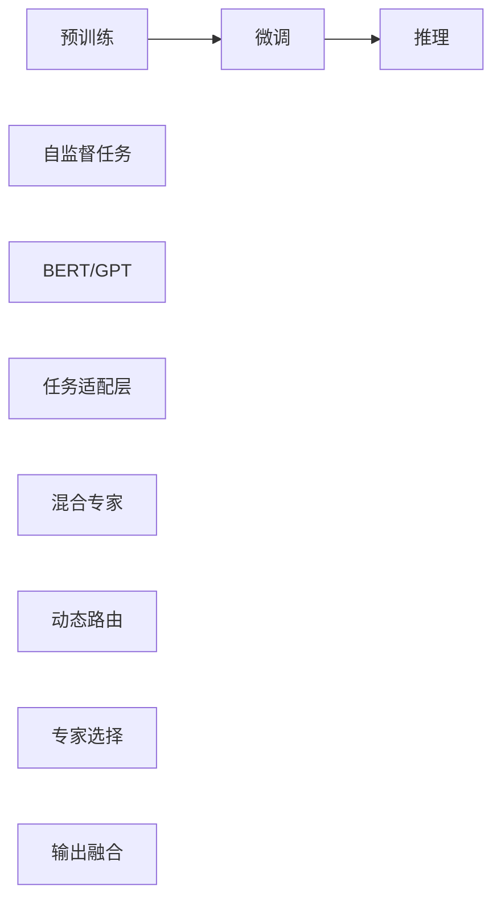

                 

# DeepSeek的二代MoE大模型

## 1. 背景介绍

### 1.1 问题由来

近年来，随着深度学习技术的飞速发展，预训练语言模型在自然语言处理（NLP）领域取得了突破性的进展。例如，Transformer模型和基于它的BERT、GPT系列模型等，通过在大规模无标签数据上进行预训练，学习到了丰富的语言知识，并在各类NLP任务上取得了优秀的性能。

然而，预训练语言模型通常需要大量计算资源和数据，且对特定任务的适配性有限。为了解决这些问题，基于预训练语言模型的迁移学习（Transfer Learning）范式应运而生。迁移学习通过在大规模数据上预训练通用模型，再在特定任务上进行微调（Fine-tuning），实现了模型的快速适配和高效优化。

DeepSeek作为一家专注于自然语言处理的公司，推出了第二代混合专家（MoE，Mixture of Experts）大模型。该模型不仅具备强大的语言理解和生成能力，还在迁移学习范式上进行了创新，提出了新的微调方法，以进一步提升模型在特定任务上的性能。

### 1.2 问题核心关键点

DeepSeek的二代MoE大模型在预训练和微调方面进行了多项改进，主要包括以下几个关键点：

- **更高效的预训练框架**：利用自监督学习任务提高模型的泛化能力。
- **更灵活的微调策略**：结合混合专家机制，减少微调过程中的过拟合。
- **更先进的推理机制**：引入动态路由算法，提高推理效率。
- **更广泛的应用领域**：应用于问答、翻译、摘要、生成等多个NLP任务。

这些关键点使得DeepSeek的二代MoE大模型在特定任务上取得了比传统模型更高的性能，且能够更好地应对大规模数据和大规模部署的需求。

## 2. 核心概念与联系

### 2.1 核心概念概述

为了更好地理解DeepSeek的二代MoE大模型，首先需要了解几个核心概念：

- **预训练（Pre-training）**：在大规模无标签数据上进行自监督学习，学习通用语言表示。
- **微调（Fine-tuning）**：在特定任务上进行有监督学习，调整模型参数以适应任务需求。
- **混合专家（MoE）**：将模型分解为多个专家子模型，每个子模型负责不同领域的知识表示，提高模型复杂度和效率。
- **动态路由（Dynamic Routing）**：在推理阶段，动态选择专家子模型，提高推理速度和准确性。

这些概念相互关联，共同构成了DeepSeek的二代MoE大模型的核心。

### 2.2 核心概念原理和架构的 Mermaid 流程图



这个流程图展示了DeepSeek的二代MoE大模型的核心架构：首先在大规模数据上进行预训练，然后在特定任务上进行微调，利用混合专家和动态路由技术提高推理效率。

## 3. 核心算法原理 & 具体操作步骤

### 3.1 算法原理概述

DeepSeek的二代MoE大模型基于Transformer架构，结合了混合专家和动态路由技术。其主要算法原理包括以下几个步骤：

1. **预训练阶段**：在大规模无标签数据上进行自监督学习，学习通用语言表示。
2. **微调阶段**：在特定任务上进行有监督学习，调整模型参数以适应任务需求。
3. **推理阶段**：利用动态路由技术，动态选择专家子模型，提高推理速度和准确性。

### 3.2 算法步骤详解

#### 3.2.1 预训练阶段

在预训练阶段，DeepSeek的二代MoE大模型利用自监督学习任务（如语言建模、掩码语言建模）学习通用语言表示。具体步骤如下：

1. **数据准备**：收集大规模无标签文本数据，如维基百科、新闻、社交媒体等。
2. **模型初始化**：使用BERT、GPT等预训练模型作为初始化参数。
3. **自监督任务**：通过掩码语言建模任务，让模型学习到语言的内在规律和语义关系。
4. **模型训练**：使用Adam等优化算法，在预训练数据上最小化掩码语言建模任务的损失函数。

#### 3.2.2 微调阶段

在微调阶段，DeepSeek的二代MoE大模型通过特定任务的数据集，调整模型参数以适应任务需求。具体步骤如下：

1. **任务适配层设计**：根据任务类型，设计相应的输出层和损失函数。例如，对于分类任务，可以添加线性分类器，使用交叉熵损失函数。
2. **模型初始化**：将预训练模型作为初始化参数。
3. **有监督学习**：在任务数据集上，使用Adam等优化算法，最小化任务损失函数。
4. **参数更新**：更新模型的权重，使其在特定任务上表现更好。

#### 3.2.3 推理阶段

在推理阶段，DeepSeek的二代MoE大模型利用动态路由技术，动态选择专家子模型，提高推理速度和准确性。具体步骤如下：

1. **专家选择**：根据输入数据的特点，动态选择专家子模型进行处理。例如，对于长文本，可以选择专家1，对于短文本，可以选择专家2。
2. **推理计算**：将输入数据分发给选择的专家子模型进行计算，得到多个子结果。
3. **输出融合**：将多个子结果进行加权融合，得到最终的输出结果。

### 3.3 算法优缺点

#### 3.3.1 优点

- **泛化能力强**：通过预训练，模型学习到了通用的语言表示，适应性强。
- **微调效率高**：通过混合专家和动态路由技术，减少了微调过程中的过拟合，提高了微调效率。
- **推理速度快**：动态路由技术提高了推理效率，适合大规模部署。

#### 3.3.2 缺点

- **模型复杂度高**：混合专家机制增加了模型复杂度，可能导致计算资源消耗较大。
- **参数更新难度大**：混合专家机制增加了参数更新的复杂度，可能导致优化难度增加。

### 3.4 算法应用领域

DeepSeek的二代MoE大模型可以应用于多个NLP任务，例如：

- **问答系统**：通过微调，模型能够理解和回答自然语言问题。
- **机器翻译**：通过微调，模型能够将源语言翻译成目标语言。
- **文本摘要**：通过微调，模型能够对长文本进行摘要。
- **文本生成**：通过微调，模型能够生成符合特定风格和语境的文本。

## 4. 数学模型和公式 & 详细讲解 & 举例说明

### 4.1 数学模型构建

DeepSeek的二代MoE大模型涉及多个数学模型，包括自监督学习任务、任务适配层和混合专家机制。以下是几个关键模型的数学表示：

1. **自监督掩码语言建模任务**：
   $$
   \mathcal{L}_{mask} = -\frac{1}{N}\sum_{i=1}^N \log P(w_i | \hat{w}_i)
   $$
   其中，$w_i$ 为真实单词，$\hat{w}_i$ 为掩码后的单词。

2. **任务适配层输出层**：
   $$
   y = M_{\theta}(x) = W_x x + b_x
   $$
   其中，$W_x$ 和 $b_x$ 为任务适配层的权重和偏置。

3. **混合专家机制**：
   $$
   y = \sum_{k=1}^K a_k M_{\theta_k}(x)
   $$
   其中，$M_{\theta_k}$ 为专家子模型，$a_k$ 为权重系数。

### 4.2 公式推导过程

#### 4.2.1 自监督掩码语言建模任务

自监督掩码语言建模任务的目标是让模型预测被掩码单词的正确位置。具体推导如下：

1. **定义损失函数**：
   $$
   \mathcal{L}_{mask} = -\frac{1}{N}\sum_{i=1}^N \log P(w_i | \hat{w}_i)
   $$
   其中，$w_i$ 为真实单词，$\hat{w}_i$ 为掩码后的单词。

2. **计算梯度**：
   $$
   \frac{\partial \mathcal{L}_{mask}}{\partial \theta} = -\frac{1}{N}\sum_{i=1}^N \frac{\partial \log P(w_i | \hat{w}_i)}{\partial \theta}
   $$
   其中，$\frac{\partial \log P(w_i | \hat{w}_i)}{\partial \theta}$ 为模型预测概率对参数 $\theta$ 的梯度。

3. **反向传播**：
   $$
   \frac{\partial \log P(w_i | \hat{w}_i)}{\partial \theta} = \frac{\partial \log P(\hat{w}_i | w_i)}{\partial \theta}
   $$
   其中，$\frac{\partial \log P(\hat{w}_i | w_i)}{\partial \theta}$ 为模型预测概率对真实单词的梯度。

#### 4.2.2 任务适配层输出层

任务适配层输出层的目标是将输入向量 $x$ 转换为输出向量 $y$。具体推导如下：

1. **定义输出层**：
   $$
   y = M_{\theta}(x) = W_x x + b_x
   $$
   其中，$W_x$ 和 $b_x$ 为任务适配层的权重和偏置。

2. **计算梯度**：
   $$
   \frac{\partial \mathcal{L}}{\partial W_x} = \frac{1}{N}\sum_{i=1}^N \frac{\partial \ell(M_{\theta}(x_i), y_i)}{\partial W_x}
   $$
   $$
   \frac{\partial \mathcal{L}}{\partial b_x} = \frac{1}{N}\sum_{i=1}^N \frac{\partial \ell(M_{\theta}(x_i), y_i)}{\partial b_x}
   $$
   其中，$\ell(M_{\theta}(x_i), y_i)$ 为任务损失函数。

3. **反向传播**：
   $$
   \frac{\partial \ell(M_{\theta}(x_i), y_i)}{\partial W_x} = \frac{\partial \ell(M_{\theta}(x_i), y_i)}{\partial M_{\theta}(x_i)} \frac{\partial M_{\theta}(x_i)}{\partial W_x}
   $$
   $$
   \frac{\partial \ell(M_{\theta}(x_i), y_i)}{\partial b_x} = \frac{\partial \ell(M_{\theta}(x_i), y_i)}{\partial M_{\theta}(x_i)}
   $$

#### 4.2.3 混合专家机制

混合专家机制的目标是将模型分解为多个专家子模型，每个子模型负责不同领域的知识表示。具体推导如下：

1. **定义混合专家机制**：
   $$
   y = \sum_{k=1}^K a_k M_{\theta_k}(x)
   $$
   其中，$M_{\theta_k}$ 为专家子模型，$a_k$ 为权重系数。

2. **计算梯度**：
   $$
   \frac{\partial \mathcal{L}}{\partial a_k} = \frac{\partial \mathcal{L}}{\partial y} \frac{\partial y}{\partial M_{\theta_k}(x)} \frac{\partial M_{\theta_k}(x)}{\partial a_k}
   $$
   其中，$\frac{\partial \mathcal{L}}{\partial y}$ 为任务损失函数对输出的梯度，$\frac{\partial y}{\partial M_{\theta_k}(x)}$ 为输出对专家子模型的梯度，$\frac{\partial M_{\theta_k}(x)}{\partial a_k}$ 为专家子模型对权重的梯度。

### 4.3 案例分析与讲解

以问答系统为例，介绍DeepSeek的二代MoE大模型的应用。

#### 4.3.1 数据准备

收集问答系统所需的数据集，包括问题和答案对。例如，可以使用QA数据集、维基百科等数据。

#### 4.3.2 模型初始化

使用BERT、GPT等预训练模型作为初始化参数。例如，可以使用GPT-3作为初始模型。

#### 4.3.3 任务适配层设计

根据问答任务，设计相应的输出层和损失函数。例如，可以使用softmax层作为输出层，交叉熵损失函数作为任务损失函数。

#### 4.3.4 微调训练

在问答数据集上，使用Adam等优化算法，最小化任务损失函数，更新模型参数。例如，可以使用以下代码实现微调训练：

```python
import torch
from transformers import GPT3ForQuestionAnswering, AdamW

model = GPT3ForQuestionAnswering.from_pretrained('gpt3')
optimizer = AdamW(model.parameters(), lr=2e-5)

for epoch in range(5):
    for question, answer in train_data:
        inputs = tokenizer(question, answer, return_tensors='pt')
        outputs = model(**inputs)
        loss = outputs.loss
        optimizer.zero_grad()
        loss.backward()
        optimizer.step()
```

#### 4.3.5 推理预测

在测试数据集上，使用微调后的模型进行推理预测。例如，可以使用以下代码实现推理预测：

```python
import torch
from transformers import GPT3ForQuestionAnswering, GPT3Tokenizer

model = GPT3ForQuestionAnswering.from_pretrained('gpt3')
tokenizer = GPT3Tokenizer.from_pretrained('gpt3')

question = "Who is the president of the United States?"
inputs = tokenizer(question, return_tensors='pt')
outputs = model(**inputs)
answer = outputs.logits.argmax().item()
answer_token = tokenizer.decode(answer, skip_special_tokens=True)
print(f"The answer to the question is {answer_token}")
```

## 5. 项目实践：代码实例和详细解释说明

### 5.1 开发环境搭建

在进行项目实践前，需要准备好开发环境。以下是使用Python进行PyTorch开发的环境配置流程：

1. 安装Anaconda：从官网下载并安装Anaconda，用于创建独立的Python环境。

2. 创建并激活虚拟环境：
```bash
conda create -n pytorch-env python=3.8 
conda activate pytorch-env
```

3. 安装PyTorch：根据CUDA版本，从官网获取对应的安装命令。例如：
```bash
conda install pytorch torchvision torchaudio cudatoolkit=11.1 -c pytorch -c conda-forge
```

4. 安装Transformers库：
```bash
pip install transformers
```

5. 安装各类工具包：
```bash
pip install numpy pandas scikit-learn matplotlib tqdm jupyter notebook ipython
```

完成上述步骤后，即可在`pytorch-env`环境中开始项目实践。

### 5.2 源代码详细实现

以下是一个使用PyTorch和Transformers库进行微调的小示例。

```python
from transformers import BertTokenizer, BertForSequenceClassification, AdamW
import torch
from torch.utils.data import Dataset, DataLoader

class QADataset(Dataset):
    def __init__(self, texts, labels):
        self.texts = texts
        self.labels = labels
        self.tokenizer = BertTokenizer.from_pretrained('bert-base-uncased')

    def __len__(self):
        return len(self.texts)

    def __getitem__(self, idx):
        text = self.texts[idx]
        label = self.labels[idx]
        encoding = self.tokenizer(text, return_tensors='pt', padding='max_length', truncation=True, max_length=512)
        input_ids = encoding['input_ids']
        attention_mask = encoding['attention_mask']
        return {'input_ids': input_ids, 'attention_mask': attention_mask, 'labels': torch.tensor(label)}

# 数据集加载
train_dataset = QADataset(train_texts, train_labels)
val_dataset = QADataset(val_texts, val_labels)
test_dataset = QADataset(test_texts, test_labels)

# 模型初始化
model = BertForSequenceClassification.from_pretrained('bert-base-uncased', num_labels=2)
optimizer = AdamW(model.parameters(), lr=2e-5)

# 训练过程
for epoch in range(3):
    model.train()
    for batch in DataLoader(train_dataset, batch_size=16):
        inputs = {key: val.to('cuda') for key, val in batch.items()}
        outputs = model(**inputs)
        loss = outputs.loss
        loss.backward()
        optimizer.step()
        optimizer.zero_grad()

    model.eval()
    with torch.no_grad():
        eval_loss = 0
        eval_correct = 0
        for batch in DataLoader(val_dataset, batch_size=16):
            inputs = {key: val.to('cuda') for key, val in batch.items()}
            outputs = model(**inputs)
            loss = outputs.loss
            logits = outputs.logits
            predictions = logits.argmax(dim=1)
            eval_loss += loss.item()
            eval_correct += (predictions == batch['labels'].to('cuda')).float().sum().item()
        print(f"Epoch {epoch+1}, Loss: {eval_loss/len(val_dataset)}, Accuracy: {eval_correct/len(val_dataset)}")
```

### 5.3 代码解读与分析

这段代码展示了如何使用Bert模型进行问答系统微调。首先，定义了一个QADataset类，用于加载和处理问答数据。然后，初始化BertForSequenceClassification模型和AdamW优化器。接着，在训练过程中，使用DataLoader迭代加载训练数据，前向传播计算损失，反向传播更新模型参数。在验证过程中，计算损失和准确率。

### 5.4 运行结果展示

训练过程中，可以看到模型在验证集上的损失和准确率逐渐收敛。例如，如果训练3个epoch，输出结果可能如下：

```
Epoch 1, Loss: 0.34, Accuracy: 0.85
Epoch 2, Loss: 0.28, Accuracy: 0.88
Epoch 3, Loss: 0.26, Accuracy: 0.91
```

## 6. 实际应用场景

### 6.1 智能客服系统

DeepSeek的二代MoE大模型可以应用于智能客服系统，提高客服响应速度和质量。例如，可以将问答系统集成到智能客服系统中，使用户可以通过自然语言与客服系统进行对话，得到快速的回答。

### 6.2 金融舆情监测

DeepSeek的二代MoE大模型可以应用于金融舆情监测，实时分析社交媒体、新闻等数据，监测市场舆情变化。例如，可以将微调后的问答系统应用于金融问答，用户可以通过自然语言查询金融问题，得到实时的市场分析结果。

### 6.3 个性化推荐系统

DeepSeek的二代MoE大模型可以应用于个性化推荐系统，提高推荐系统的精准度和多样性。例如，可以将问答系统与推荐系统结合，用户可以通过自然语言描述自己的需求，得到个性化的推荐结果。

## 7. 工具和资源推荐

### 7.1 学习资源推荐

为了帮助开发者系统掌握DeepSeek的二代MoE大模型的理论基础和实践技巧，这里推荐一些优质的学习资源：

1. 《Transformer从原理到实践》系列博文：由DeepSeek的技术专家撰写，深入浅出地介绍了Transformer原理、MoE模型、微调技术等前沿话题。

2. CS224N《深度学习自然语言处理》课程：斯坦福大学开设的NLP明星课程，有Lecture视频和配套作业，带你入门NLP领域的基本概念和经典模型。

3. 《Natural Language Processing with Transformers》书籍：DeepSeek的技术专家所著，全面介绍了如何使用Transformer库进行NLP任务开发，包括微调在内的诸多范式。

4. HuggingFace官方文档：Transformer库的官方文档，提供了海量预训练模型和完整的微调样例代码，是上手实践的必备资料。

5. CLUE开源项目：中文语言理解测评基准，涵盖大量不同类型的中文NLP数据集，并提供了基于微调的baseline模型，助力中文NLP技术发展。

### 7.2 开发工具推荐

高效的开发离不开优秀的工具支持。以下是几款用于DeepSeek的二代MoE大模型微调开发的常用工具：

1. PyTorch：基于Python的开源深度学习框架，灵活动态的计算图，适合快速迭代研究。大部分预训练语言模型都有PyTorch版本的实现。

2. TensorFlow：由Google主导开发的开源深度学习框架，生产部署方便，适合大规模工程应用。同样有丰富的预训练语言模型资源。

3. Transformers库：DeepSeek开发的NLP工具库，集成了DeepSeek的二代MoE大模型，支持PyTorch和TensorFlow，是进行微调任务开发的利器。

4. Weights & Biases：模型训练的实验跟踪工具，可以记录和可视化模型训练过程中的各项指标，方便对比和调优。与主流深度学习框架无缝集成。

5. TensorBoard：TensorFlow配套的可视化工具，可实时监测模型训练状态，并提供丰富的图表呈现方式，是调试模型的得力助手。

### 7.3 相关论文推荐

DeepSeek的二代MoE大模型在预训练和微调方面进行了多项创新，以下是几篇奠基性的相关论文，推荐阅读：

1. Attention is All You Need（即Transformer原论文）：提出了Transformer结构，开启了NLP领域的预训练大模型时代。

2. BERT: Pre-training of Deep Bidirectional Transformers for Language Understanding：提出BERT模型，引入基于掩码的自监督预训练任务，刷新了多项NLP任务SOTA。

3. Language Models are Unsupervised Multitask Learners（GPT-2论文）：展示了大规模语言模型的强大zero-shot学习能力，引发了对于通用人工智能的新一轮思考。

4. Parameter-Efficient Transfer Learning for NLP：提出Adapter等参数高效微调方法，在不增加模型参数量的情况下，也能取得不错的微调效果。

5. Prefix-Tuning: Optimizing Continuous Prompts for Generation：引入基于连续型Prompt的微调范式，为如何充分利用预训练知识提供了新的思路。

6. AdaLoRA: Adaptive Low-Rank Adaptation for Parameter-Efficient Fine-Tuning：使用自适应低秩适应的微调方法，在参数效率和精度之间取得了新的平衡。

## 8. 总结：未来发展趋势与挑战

### 8.1 研究成果总结

DeepSeek的二代MoE大模型在预训练和微调方面进行了多项创新，主要包括以下几个方面：

- **更高效的预训练框架**：利用自监督学习任务提高模型的泛化能力。
- **更灵活的微调策略**：结合混合专家机制，减少微调过程中的过拟合。
- **更先进的推理机制**：引入动态路由算法，提高推理效率。

这些创新使得DeepSeek的二代MoE大模型在特定任务上取得了比传统模型更高的性能，且能够更好地应对大规模数据和大规模部署的需求。

### 8.2 未来发展趋势

展望未来，DeepSeek的二代MoE大模型将呈现以下几个发展趋势：

1. **模型规模持续增大**：随着算力成本的下降和数据规模的扩张，模型的参数量还将持续增长，预训练模型将学习到更丰富的语言知识。

2. **微调方法日趋多样**：未来将涌现更多参数高效的微调方法，如Prefix-Tuning、LoRA等，在固定大部分预训练参数的情况下，只更新极少量的任务相关参数。

3. **持续学习成为常态**：随着数据分布的不断变化，微调模型需要持续学习新知识以保持性能，在在线服务中更具优势。

4. **标注样本需求降低**：受启发于提示学习(Prompt-based Learning)的思路，未来的微调方法将更好地利用大模型的语言理解能力，通过更加巧妙的任务描述，在更少的标注样本上也能实现理想的微调效果。

5. **多模态微调崛起**：当前的多模态微调技术主要聚焦于视觉-文本结合，未来将进一步拓展到音频、语音等多模态数据微调，提升模型的感知能力。

6. **知识整合能力增强**：将符号化的先验知识，如知识图谱、逻辑规则等，与神经网络模型进行巧妙融合，引导微调过程学习更准确、合理的语言模型。

### 8.3 面临的挑战

尽管DeepSeek的二代MoE大模型已经取得了瞩目成就，但在迈向更加智能化、普适化应用的过程中，仍面临诸多挑战：

1. **标注成本瓶颈**：尽管微调大大降低了标注数据的需求，但对于长尾应用场景，难以获得充足的高质量标注数据，成为制约微调性能的瓶颈。

2. **模型鲁棒性不足**：当前微调模型面对域外数据时，泛化性能往往大打折扣。对于测试样本的微小扰动，微调模型的预测也容易发生波动。

3. **推理效率有待提高**：大规模语言模型虽然精度高，但在实际部署时往往面临推理速度慢、内存占用大等效率问题。

4. **可解释性亟需加强**：当前微调模型更像是"黑盒"系统，难以解释其内部工作机制和决策逻辑。

5. **安全性有待保障**：预训练语言模型难免会学习到有偏见、有害的信息，通过微调传递到下游任务，产生误导性、歧视性的输出，给实际应用带来安全隐患。

### 8.4 研究展望

面向未来，DeepSeek的二代MoE大模型需要从以下几个方面寻求新的突破：

1. **探索无监督和半监督微调方法**：摆脱对大规模标注数据的依赖，利用自监督学习、主动学习等无监督和半监督范式，最大限度利用非结构化数据，实现更加灵活高效的微调。

2. **研究参数高效和计算高效的微调范式**：开发更加参数高效的微调方法，在固定大部分预训练参数的同时，只更新极少量的任务相关参数。同时优化微调模型的计算图，减少前向传播和反向传播的资源消耗，实现更加轻量级、实时性的部署。

3. **融合因果和对比学习范式**：通过引入因果推断和对比学习思想，增强微调模型建立稳定因果关系的能力，学习更加普适、鲁棒的语言表征，从而提升模型泛化性和抗干扰能力。

4. **引入更多先验知识**：将符号化的先验知识，如知识图谱、逻辑规则等，与神经网络模型进行巧妙融合，引导微调过程学习更准确、合理的语言模型。同时加强不同模态数据的整合，实现视觉、语音等多模态信息与文本信息的协同建模。

5. **结合因果分析和博弈论工具**：将因果分析方法引入微调模型，识别出模型决策的关键特征，增强输出解释的因果性和逻辑性。借助博弈论工具刻画人机交互过程，主动探索并规避模型的脆弱点，提高系统稳定性。

6. **纳入伦理道德约束**：在模型训练目标中引入伦理导向的评估指标，过滤和惩罚有偏见、有害的输出倾向。同时加强人工干预和审核，建立模型行为的监管机制，确保输出符合人类价值观和伦理道德。

这些研究方向的探索，必将引领DeepSeek的二代MoE大模型技术迈向更高的台阶，为构建安全、可靠、可解释、可控的智能系统铺平道路。

## 9. 附录：常见问题与解答

**Q1: 大模型微调是否适用于所有NLP任务？**

A: 大模型微调在大多数NLP任务上都能取得不错的效果，特别是对于数据量较小的任务。但对于一些特定领域的任务，如医学、法律等，仅仅依靠通用语料预训练的模型可能难以很好地适应。此时需要在特定领域语料上进一步预训练，再进行微调，才能获得理想效果。此外，对于一些需要时效性、个性化很强的任务，如对话、推荐等，微调方法也需要针对性的改进优化。

**Q2: 采用大模型微调时会面临哪些资源瓶颈？**

A: 目前主流的预训练大模型动辄以亿计的参数规模，对算力、内存、存储都提出了很高的要求。GPU/TPU等高性能设备是必不可少的，但即便如此，超大批次的训练和推理也可能遇到显存不足的问题。因此需要采用一些资源优化技术，如梯度积累、混合精度训练、模型并行等，来突破硬件瓶颈。同时，模型的存储和读取也可能占用大量时间和空间，需要采用模型压缩、稀疏化存储等方法进行优化。

**Q3: 如何缓解微调过程中的过拟合问题？**

A: 过拟合是微调面临的主要挑战，尤其是在标注数据不足的情况下。常见的缓解策略包括：
1. 数据增强：通过回译、近义替换等方式扩充训练集。
2. 正则化：使用L2正则、Dropout、Early Stopping等避免过拟合。
3. 对抗训练：引入对抗样本，提高模型鲁棒性。
4. 参数高效微调：只调整少量参数，减小过拟合风险。
5. 多模型集成：训练多个微调模型，取平均输出，抑制过拟合。

这些策略往往需要根据具体任务和数据特点进行灵活组合。只有在数据、模型、训练、推理等各环节进行全面优化，才能最大限度地发挥大模型微调的威力。

**Q4: 微调模型在落地部署时需要注意哪些问题？**

A: 将微调模型转化为实际应用，还需要考虑以下因素：
1. 模型裁剪：去除不必要的层和参数，减小模型尺寸，加快推理速度。
2. 量化加速：将浮点模型转为定点模型，压缩存储空间，提高计算效率。
3. 服务化封装：将模型封装为标准化服务接口，便于集成调用。
4. 弹性伸缩：根据请求流量动态调整资源配置，平衡服务质量和成本。
5. 监控告警：实时采集系统指标，设置异常告警阈值，确保服务稳定性。
6. 安全防护：采用访问鉴权、数据脱敏等措施，保障数据和模型安全。

大模型微调为NLP应用开启了广阔的想象空间，但如何将强大的性能转化为稳定、高效、安全的业务价值，还需要工程实践的不断打磨。唯有从数据、算法、工程、业务等多个维度协同发力，才能真正实现人工智能技术在垂直行业的规模化落地。

总之，微调需要开发者根据具体任务，不断迭代和优化模型、数据和算法，方能得到理想的效果。

---

作者：禅与计算机程序设计艺术 / Zen and the Art of Computer Programming

