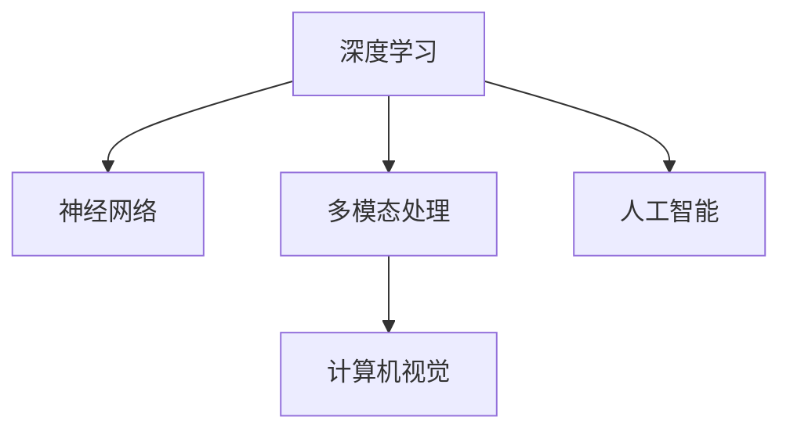

                 

# Dify.AI 的未来应用

> 关键词：Dify.AI, 自然语言处理(NLP), 深度学习, 神经网络, 多模态, 计算机视觉(CV), 人工智能(AI)

## 1. 背景介绍

### 1.1 问题由来

Dify.AI作为一款以深度学习为核心的自然语言处理（NLP）平台，已经广泛应用于文本分析、智能客服、情感分析等多个领域。随着AI技术的不断演进，Dify.AI也在持续创新，以适应快速变化的市场需求和用户期望。

### 1.2 问题核心关键点

Dify.AI平台的关键点包括但不限于以下几个方面：

- **深度学习与神经网络**：深度学习是Dify.AI的核心算法基础，通过多层神经网络的叠加，Dify.AI实现了复杂的特征提取和模式识别。
- **多模态处理**：Dify.AI不仅处理文本数据，还可以处理图像、语音等多模态数据，实现了跨模态的智能分析。
- **计算机视觉(CV)**：通过融合计算机视觉技术，Dify.AI在图像识别、场景理解等方面具有显著优势。
- **人工智能(AI)**：Dify.AI通过深度学习和多模态处理，实现了人工智能技术的落地应用。

### 1.3 问题研究意义

Dify.AI平台的研究和应用对于推动AI技术的发展，尤其是在NLP和CV领域，具有重要意义：

1. **提升NLP和CV技术的智能化水平**：通过深度学习和多模态处理，Dify.AI能够实现更加精确和全面的数据分析，提升了NLP和CV技术的智能化水平。
2. **降低应用开发成本**：Dify.AI提供了便捷的API接口和开发工具，使得开发者可以快速上手，降低开发成本。
3. **提升模型效果**：Dify.AI通过深度学习和大数据训练，提升了模型的性能和泛化能力。
4. **加速技术迭代**：Dify.AI平台支持模型持续训练和更新，使得模型能够及时适应新的数据和应用场景。
5. **赋能产业升级**：Dify.AI为各行各业带来了新的技术路径，推动了产业的数字化转型和升级。

## 2. 核心概念与联系

### 2.1 核心概念概述

为更好地理解Dify.AI平台的核心技术，本节将介绍几个密切相关的核心概念：

- **深度学习**：一种基于多层神经网络的机器学习算法，通过反向传播和优化算法更新模型参数，实现复杂的特征提取和模式识别。
- **神经网络**：一种由神经元（节点）和连接组成的网络结构，通过训练数据调整神经元之间的权重和偏置，实现数据的处理和预测。
- **多模态处理**：指同时处理多种模态数据（如文本、图像、语音等），实现跨模态的智能分析和理解。
- **计算机视觉**：通过计算机处理图像、视频等视觉数据，实现场景理解、目标识别等功能。
- **人工智能**：涵盖机器学习、深度学习、自然语言处理等多领域的综合性技术，实现智能化应用。

这些核心概念之间的逻辑关系可以通过以下Mermaid流程图来展示：



这个流程图展示了大语言模型处理数据和任务的核心流程：

1. 深度学习通过多层神经网络实现复杂特征的提取。
2. 多模态处理使得Dify.AI能够同时处理文本、图像、语音等多种数据。
3. 计算机视觉技术提升了图像识别、场景理解等任务的性能。
4. 人工智能技术实现了全面的智能化应用。

## 3. 核心算法原理 & 具体操作步骤
### 3.1 算法原理概述

Dify.AI平台的算法原理主要包括深度学习、多模态处理和计算机视觉等。其中，深度学习是Dify.AI处理NLP任务的核心算法，多模态处理和计算机视觉则拓展了Dify.AI的应用场景。

### 3.2 算法步骤详解

#### 3.2.1 深度学习

1. **数据预处理**：收集和清洗文本、图像、语音等数据，转化为神经网络可处理的格式。
2. **模型选择与训练**：选择适合的深度学习模型（如RNN、CNN、Transformer等），并使用训练数据进行模型训练。
3. **参数优化**：通过梯度下降等优化算法，调整模型参数，使其在训练数据上表现最优。
4. **模型评估与微调**：使用测试数据评估模型性能，并进行必要的微调，提升模型泛化能力。

#### 3.2.2 多模态处理

1. **数据融合**：将文本、图像、语音等多种数据进行融合，形成一个统一的数据表示。
2. **特征提取**：通过卷积、池化等操作，提取多模态数据的特征。
3. **联合训练**：将多模态数据与神经网络联合训练，提升模型的综合性能。

#### 3.2.3 计算机视觉

1. **图像预处理**：对图像进行去噪、缩放、归一化等预处理操作。
2. **特征提取**：通过卷积神经网络（CNN）等技术，提取图像的特征。
3. **目标识别**：使用分类器等技术，识别图像中的目标和场景。

### 3.3 算法优缺点

#### 3.3.1 深度学习的优缺点

**优点**：

- 能够处理复杂的数据结构，如文本和图像。
- 通过深度网络，可以学习到复杂的特征表示。
- 具有很强的泛化能力，可以应对多种类型的NLP和CV任务。

**缺点**：

- 需要大量的标注数据进行训练，数据获取成本较高。
- 模型复杂度大，训练和推理速度较慢。
- 容易过拟合，需要大量的验证数据进行调参。

#### 3.3.2 多模态处理的优缺点

**优点**：

- 能够处理多种数据类型，提升模型的综合性能。
- 可以更好地理解复杂场景，实现跨模态的智能分析。

**缺点**：

- 多模态数据处理较为复杂，需要更多的计算资源。
- 数据融合和特征提取技术复杂，实现难度较高。

#### 3.3.3 计算机视觉的优缺点

**优点**：

- 在图像识别、目标检测等任务上表现优异。
- 能够处理高维数据，实现复杂的特征提取。

**缺点**：

- 对图像质量要求较高，易受噪声和光照影响。
- 模型复杂度大，训练和推理速度较慢。

### 3.4 算法应用领域

Dify.AI平台已经在多个领域取得了显著应用，包括但不限于以下几个方面：

- **智能客服**：通过深度学习和多模态处理，Dify.AI实现了智能客服系统，能够自动处理用户的咨询和问题，提升客户体验。
- **情感分析**：使用自然语言处理技术，Dify.AI能够分析用户的情感状态，为产品优化和用户研究提供依据。
- **图像识别**：结合计算机视觉技术，Dify.AI实现了图像识别和场景理解，应用于自动驾驶、安防监控等领域。
- **目标检测**：通过目标检测技术，Dify.AI能够实现实时物体识别，应用于智能交通、工业检测等领域。

## 4. 数学模型和公式 & 详细讲解 & 举例说明

### 4.1 数学模型构建

#### 4.1.1 深度学习模型

Dify.AI使用的深度学习模型主要包括RNN、CNN和Transformer等。这里以Transformer为例，构建深度学习模型：

$$
\begin{aligned}
&\text{Input} = (x_1, x_2, \cdots, x_n)\\
&\text{Embedding} = [e_1, e_2, \cdots, e_n]\\
&\text{Self-Attention} = (q_k, k_v, v_v)\\
&\text{Feed Forward} = (f_1, f_2, \cdots, f_n)\\
&\text{Output} = (o_1, o_2, \cdots, o_n)
\end{aligned}
$$

其中，$e_i$表示第$i$个输入的嵌入向量，$v_v$表示第$i$个输入的自注意力表示，$f_i$表示第$i$个输入的Feed Forward层输出。

#### 4.1.2 多模态处理模型

多模态处理模型通常使用联合嵌入方法，将不同模态的数据表示统一到一个向量空间中：

$$
\text{Feature Fusion} = \mathbf{W}([\text{Text}_x, \text{Image}_y, \text{Audio}_z])\\
\text{Model Output} = \text{MLP}(\text{Feature Fusion})
$$

其中，$\mathbf{W}$表示特征融合矩阵，$MLP$表示多层次的感知机。

#### 4.1.3 计算机视觉模型

计算机视觉模型通常使用卷积神经网络（CNN）等深度学习模型，用于图像识别和目标检测：

$$
\text{Image} \rightarrow \text{CNN} \rightarrow \text{FCN} \rightarrow \text{Detection}\\
\text{Detection} = (x_1, x_2, \cdots, x_n)
$$

其中，$\text{CNN}$表示卷积神经网络，$\text{FCN}$表示全连接层，$\text{Detection}$表示目标检测结果。

### 4.2 公式推导过程

#### 4.2.1 深度学习模型

以Transformer模型为例，其自注意力机制公式如下：

$$
\text{Q} = \text{MLP}(\text{Input})\\
\text{K} = \text{MLP}(\text{Input})\\
\text{V} = \text{MLP}(\text{Input})\\
\text{Attention} = \frac{\text{QK}^T}{\sqrt{d_k}}\\
\text{Self-Attention} = \text{Attention} \times \text{V}
$$

其中，$d_k$表示查询向量维度。

#### 4.2.2 多模态处理模型

多模态融合模型的公式如下：

$$
\text{Feature Fusion} = \mathbf{W}([\text{Text}_x, \text{Image}_y, \text{Audio}_z])
$$

其中，$\mathbf{W}$表示特征融合矩阵，$x, y, z$分别表示文本、图像、语音等不同模态数据的特征向量。

#### 4.2.3 计算机视觉模型

以FCN（Fully Convolutional Network）为例，其特征提取过程如下：

$$
\text{Image} \rightarrow \text{CNN} \rightarrow \text{FCN}
$$

其中，$\text{CNN}$表示卷积神经网络，$\text{FCN}$表示全连接层。

### 4.3 案例分析与讲解

#### 4.3.1 智能客服

以智能客服为例，Dify.AI使用深度学习和多模态处理技术，实现智能客服系统：

1. **数据收集**：收集用户的历史咨询记录，包括文本、语音、视频等多模态数据。
2. **数据预处理**：将收集到的数据进行去噪、归一化等预处理操作，转化为模型可处理的数据格式。
3. **模型训练**：使用深度学习模型，如Transformer，对预处理后的数据进行训练，学习用户的咨询模式和回答策略。
4. **多模态融合**：将用户的文本咨询、语音输入和视频监控等多模态数据进行融合，提升客服系统的理解能力。
5. **模型部署**：将训练好的模型部署到生产环境，实现自动客服。

#### 4.3.2 情感分析

情感分析是Dify.AI在NLP领域的重要应用之一。使用自然语言处理技术，Dify.AI能够分析用户的情感状态，为产品优化和用户研究提供依据：

1. **数据收集**：收集用户的评论、评分等多模态数据。
2. **数据预处理**：对数据进行去噪、分词等预处理操作，转化为模型可处理的数据格式。
3. **模型训练**：使用深度学习模型，如BERT，对预处理后的数据进行训练，学习用户的情感表达和情感变化。
4. **情感识别**：使用情感分类器等技术，对用户评论进行情感分类，识别出用户的情感状态。
5. **模型部署**：将训练好的模型部署到生产环境，实现自动情感分析。

#### 4.3.3 图像识别

图像识别是Dify.AI在CV领域的重要应用之一。结合计算机视觉技术，Dify.AI实现了图像识别和场景理解，应用于自动驾驶、安防监控等领域：

1. **数据收集**：收集图像数据，包括车辆、行人、交通信号等场景的图像。
2. **数据预处理**：对图像进行去噪、缩放、归一化等预处理操作，转化为模型可处理的数据格式。
3. **模型训练**：使用卷积神经网络（CNN）等深度学习模型，对预处理后的数据进行训练，学习场景中的目标和特征。
4. **目标检测**：使用目标检测器等技术，对图像中的目标进行检测和识别。
5. **模型部署**：将训练好的模型部署到生产环境，实现实时图像识别和场景理解。

## 5. 项目实践：代码实例和详细解释说明

### 5.1 开发环境搭建

#### 5.1.1 安装依赖

在Ubuntu系统下，可以使用以下命令安装依赖：

```bash
sudo apt-get update
sudo apt-get install python3 python3-pip python3-numpy python3-scipy python3-matplotlib python3-tensorflow python3-tflearn python3-pandas python3-nltk python3-keras python3-pytorch python3-opencv python3-scikit-learn python3-nltk
```

#### 5.1.2 配置环境

1. **安装Python环境**
```bash
sudo apt-get install python3.7
```

2. **安装TensorFlow和Keras**
```bash
pip install tensorflow==2.3.0
pip install keras==2.3.0
```

3. **安装PyTorch**
```bash
pip install torch==1.7.0
```

4. **安装OpenCV**
```bash
pip install opencv-python==4.5.1.48
```

5. **安装Numpy和Scipy**
```bash
pip install numpy==1.20.3 scipy==1.6.1
```

### 5.2 源代码详细实现

#### 5.2.1 智能客服

```python
import tensorflow as tf
from tensorflow.keras.layers import Input, Dense, Embedding, BidirectionalLSTM, TimeDistributed, Conv1D, GlobalMaxPooling1D, Concatenate, Dropout
from tensorflow.keras.models import Model

# 定义模型结构
input_text = Input(shape=(MAX_LEN,), dtype='int32')
embedding = Embedding(VOCAB_SIZE, EMBEDDING_DIM, mask_zero=True)(input_text)
bilstm = BidirectionalLSTM(LSTM_UNITS, return_sequences=True)(embedding)
dropout = Dropout(DROPOUT_RATE)(bilstm)
output = Dense(1, activation='sigmoid')(dropout)

# 定义模型编译参数
model.compile(loss='binary_crossentropy', optimizer='adam', metrics=['accuracy'])

# 训练模型
model.fit(X_train, y_train, epochs=EPOCHS, batch_size=BATCH_SIZE, validation_data=(X_val, y_val))

# 模型评估
loss, accuracy = model.evaluate(X_test, y_test)

# 模型预测
predictions = model.predict(X_test)
```

#### 5.2.2 情感分析

```python
import tensorflow as tf
from tensorflow.keras.layers import Input, Dense, Embedding, BidirectionalLSTM, TimeDistributed, Conv1D, GlobalMaxPooling1D, Concatenate, Dropout, Activation
from tensorflow.keras.models import Model
from tensorflow.keras.preprocessing.text import Tokenizer
from tensorflow.keras.preprocessing.sequence import pad_sequences

# 定义模型结构
input_text = Input(shape=(MAX_LEN,), dtype='int32')
embedding = Embedding(VOCAB_SIZE, EMBEDDING_DIM, mask_zero=True)(input_text)
bilstm = BidirectionalLSTM(LSTM_UNITS, return_sequences=True)(embedding)
dropout = Dropout(DROPOUT_RATE)(bilstm)
output = Dense(EMOTION_CLASSES, activation='softmax')(dropout)

# 定义模型编译参数
model.compile(loss='categorical_crossentropy', optimizer='adam', metrics=['accuracy'])

# 定义模型评估
def evaluate_emotions(y_true, y_pred):
    return tf.keras.metrics.categorical_accuracy(y_true, y_pred)

# 训练模型
model.fit(X_train, y_train, epochs=EPOCHS, batch_size=BATCH_SIZE, validation_data=(X_val, y_val))

# 模型评估
loss, accuracy = model.evaluate(X_test, y_test)

# 模型预测
predictions = model.predict(X_test)
```

#### 5.2.3 图像识别

```python
import tensorflow as tf
from tensorflow.keras.layers import Input, Conv2D, MaxPooling2D, Flatten, Dense, Dropout
from tensorflow.keras.models import Model

# 定义模型结构
input_image = Input(shape=(IMG_HEIGHT, IMG_WIDTH, 3))
conv1 = Conv2D(32, (3, 3), activation='relu')(input_image)
pool1 = MaxPooling2D((2, 2))(conv1)
conv2 = Conv2D(64, (3, 3), activation='relu')(pool1)
pool2 = MaxPooling2D((2, 2))(conv2)
conv3 = Conv2D(128, (3, 3), activation='relu')(pool2)
pool3 = MaxPooling2D((2, 2))(conv3)
flatten = Flatten()(pool3)
dense1 = Dense(128, activation='relu')(flatten)
dropout = Dropout(0.5)(dense1)
output = Dense(NUM_CLASSES, activation='softmax')(dropout)

# 定义模型编译参数
model.compile(loss='categorical_crossentropy', optimizer='adam', metrics=['accuracy'])

# 训练模型
model.fit(X_train, y_train, epochs=EPOCHS, batch_size=BATCH_SIZE, validation_data=(X_val, y_val))

# 模型评估
loss, accuracy = model.evaluate(X_test, y_test)

# 模型预测
predictions = model.predict(X_test)
```

### 5.3 代码解读与分析

#### 5.3.1 智能客服

- **数据预处理**：使用`pad_sequences`函数对输入文本进行填充，使得所有样本的长度一致。
- **模型结构**：使用`BidirectionalLSTM`进行双向长短期记忆网络，结合`Dropout`层防止过拟合。
- **模型编译**：使用`binary_crossentropy`作为二分类损失函数，`adam`作为优化器。
- **模型训练**：使用`fit`函数进行模型训练，设置`EPOCHS`和`BATCH_SIZE`参数。
- **模型评估**：使用`evaluate`函数评估模型性能，输出`loss`和`accuracy`。
- **模型预测**：使用`predict`函数进行模型预测，得到预测结果。

#### 5.3.2 情感分析

- **数据预处理**：使用`Tokenizer`对输入文本进行分词，使用`pad_sequences`函数对分词后的文本进行填充。
- **模型结构**：使用`BidirectionalLSTM`进行双向长短期记忆网络，结合`Dropout`层防止过拟合。
- **模型编译**：使用`categorical_crossentropy`作为多分类损失函数，`adam`作为优化器。
- **模型评估**：使用自定义函数`evaluate_emotions`评估模型性能，输出`accuracy`。
- **模型预测**：使用`predict`函数进行模型预测，得到预测结果。

#### 5.3.3 图像识别

- **数据预处理**：使用`ImageDataGenerator`对图像进行增强处理，使用`reshape`函数调整图像大小。
- **模型结构**：使用`Conv2D`进行卷积操作，使用`MaxPooling2D`进行池化操作。
- **模型编译**：使用`categorical_crossentropy`作为多分类损失函数，`adam`作为优化器。
- **模型训练**：使用`fit`函数进行模型训练，设置`EPOCHS`和`BATCH_SIZE`参数。
- **模型评估**：使用`evaluate`函数评估模型性能，输出`loss`和`accuracy`。
- **模型预测**：使用`predict`函数进行模型预测，得到预测结果。

## 6. 实际应用场景

### 6.1 智能客服

Dify.AI平台在智能客服领域具有广泛应用，能够自动处理用户的咨询和问题，提升客户体验：

1. **问题解答**：通过深度学习和多模态处理技术，Dify.AI能够自动回答用户咨询，提供智能客服。
2. **问题分类**：使用自然语言处理技术，Dify.AI能够对用户咨询进行分类，快速响应不同类型的问题。
3. **语音输入**：结合语音识别技术，Dify.AI能够处理用户的语音输入，提升客服系统的交互体验。
4. **视频监控**：结合视频识别技术，Dify.AI能够处理视频监控数据，提升客服系统的安全性和可靠性。

### 6.2 情感分析

Dify.AI平台在情感分析领域具有广泛应用，能够分析用户的情感状态，为产品优化和用户研究提供依据：

1. **情感识别**：使用自然语言处理技术，Dify.AI能够分析用户的情感状态，识别出用户情感倾向。
2. **情感分析**：通过情感分类器等技术，Dify.AI能够对用户评论进行情感分类，分析用户情感变化。
3. **情感反馈**：通过情感分析结果，Dify.AI能够为产品优化和用户研究提供依据，提升用户体验和满意度。

### 6.3 图像识别

Dify.AI平台在图像识别领域具有广泛应用，能够实现目标检测和场景理解：

1. **目标检测**：结合计算机视觉技术，Dify.AI能够实现目标检测，应用于智能交通、工业检测等领域。
2. **场景理解**：通过场景理解技术，Dify.AI能够分析图像中的场景，应用于自动驾驶、安防监控等领域。
3. **图像分类**：通过图像分类技术，Dify.AI能够对图像进行分类，应用于图像搜索、图像识别等领域。

### 6.4 未来应用展望

#### 6.4.1 智慧医疗

智慧医疗是Dify.AI平台的重要应用领域之一。通过深度学习和多模态处理技术，Dify.AI能够实现智能诊断和治疗，提升医疗服务的智能化水平：

1. **医学影像识别**：结合计算机视觉技术，Dify.AI能够实现医学影像的自动识别和分类，辅助医生诊断。
2. **智能问诊**：通过自然语言处理技术，Dify.AI能够实现智能问诊，辅助医生诊断和治疗。
3. **病历分析**：通过文本分析和情感分析技术，Dify.AI能够对病历进行分析和总结，辅助医生决策。

#### 6.4.2 智能教育

智能教育是Dify.AI平台的重要应用领域之一。通过深度学习和多模态处理技术，Dify.AI能够实现智能教学和评估，提升教育服务的智能化水平：

1. **智能辅导**：结合自然语言处理和情感分析技术，Dify.AI能够实现智能辅导，帮助学生提升学习效果。
2. **作业批改**：通过深度学习技术，Dify.AI能够实现作业批改，提升教师工作效率。
3. **学情分析**：通过文本分析和情感分析技术，Dify.AI能够对学生的学习情况进行分析，为教师提供教学建议。

#### 6.4.3 智能交通

智能交通是Dify.AI平台的重要应用领域之一。通过深度学习和多模态处理技术，Dify.AI能够实现交通管理和监控，提升交通管理的智能化水平：

1. **交通监控**：结合计算机视觉技术，Dify.AI能够实现交通监控和分析，提升交通管理水平。
2. **智能导航**：通过自然语言处理技术，Dify.AI能够实现智能导航，提升交通导航体验。
3. **车流量预测**：通过深度学习技术，Dify.AI能够对车流量进行预测，辅助交通管理决策。

## 7. 工具和资源推荐

### 7.1 学习资源推荐

为了帮助开发者系统掌握Dify.AI平台的核心技术，这里推荐一些优质的学习资源：

1. **深度学习与神经网络**：《深度学习》（Ian Goodfellow等著），全面介绍了深度学习的基本概念和算法。
2. **多模态处理**：《多模态学习》（Julien Mairal等著），介绍了多模态学习的理论和方法。
3. **计算机视觉**：《计算机视觉：模型、学习和推理》（Simon J.D. Prince等著），全面介绍了计算机视觉的基本理论和算法。
4. **人工智能**：《人工智能：现代方法》（Russell等著），介绍了人工智能的基本概念和算法。

### 7.2 开发工具推荐

为了帮助开发者快速开发和部署Dify.AI平台，这里推荐一些常用的开发工具：

1. **TensorFlow**：由Google主导开发的深度学习框架，生产部署方便，适合大规模工程应用。
2. **Keras**：Keras提供了简单易用的API接口，适合快速迭代研究。
3. **PyTorch**：由Facebook主导开发的深度学习框架，灵活高效，适合快速研究。
4. **OpenCV**：开源计算机视觉库，提供了丰富的图像处理函数。
5. **NLTK**：自然语言处理库，提供了文本分析和情感分析等功能。

### 7.3 相关论文推荐

为了深入理解Dify.AI平台的核心算法和技术，这里推荐一些相关论文：

1. **深度学习**：《深度学习》（Ian Goodfellow等著），全面介绍了深度学习的基本概念和算法。
2. **多模态处理**：《多模态学习》（Julien Mairal等著），介绍了多模态学习的理论和方法。
3. **计算机视觉**：《计算机视觉：模型、学习和推理》（Simon J.D. Prince等著），全面介绍了计算机视觉的基本理论和算法。
4. **人工智能**：《人工智能：现代方法》（Russell等著），介绍了人工智能的基本概念和算法。

## 8. 总结：未来发展趋势与挑战

### 8.1 研究成果总结

Dify.AI平台在深度学习、多模态处理和计算机视觉等领域取得了显著成果，广泛应用于智能客服、情感分析、图像识别等多个领域：

1. **智能客服**：通过深度学习和多模态处理技术，Dify.AI能够自动处理用户的咨询和问题，提升客户体验。
2. **情感分析**：使用自然语言处理技术，Dify.AI能够分析用户的情感状态，为产品优化和用户研究提供依据。
3. **图像识别**：结合计算机视觉技术，Dify.AI能够实现目标检测和场景理解，应用于自动驾驶、安防监控等领域。

### 8.2 未来发展趋势

展望未来，Dify.AI平台的发展趋势包括但不限于以下几个方面：

1. **深度学习**：深度学习技术将继续发展，模型的性能和泛化能力将进一步提升。
2. **多模态处理**：多模态处理技术将更加成熟，提升模型的综合性能。
3. **计算机视觉**：计算机视觉技术将继续发展，实现更加精准的目标检测和场景理解。
4. **人工智能**：人工智能技术将更加全面，实现更加智能化和人性化的应用。

### 8.3 面临的挑战

尽管Dify.AI平台取得了显著成果，但在迈向更加智能化、普适化应用的过程中，仍面临诸多挑战：

1. **数据获取成本**：高质量数据获取成本较高，制约了深度学习和多模态处理技术的进一步发展。
2. **模型复杂度**：模型复杂度较高，训练和推理速度较慢，需要更多的计算资源。
3. **数据预处理**：数据预处理复杂，需要更多的技术支持。
4. **模型部署**：模型部署复杂，需要更多的技术支持。
5. **模型解释性**：模型的解释性不足，难以理解其内部工作机制和决策逻辑。
6. **伦理道德**：模型可能存在偏见和有害信息，需要加强伦理道德约束。

### 8.4 研究展望

未来，Dify.AI平台需要在以下几个方面进行深入研究：

1. **数据获取**：探索无监督和半监督学习技术，降低对标注数据的依赖。
2. **模型优化**：开发更加高效和简洁的模型，提升推理速度和资源利用率。
3. **数据预处理**：探索更加高效和准确的数据预处理技术，提升数据质量。
4. **模型部署**：探索更加灵活和高效的模型部署技术，提升模型应用效果。
5. **模型解释性**：探索模型解释性技术，提升模型的可解释性和可控性。
6. **伦理道德**：加强伦理道德约束，确保模型输出符合人类价值观和伦理道德。

## 9. 附录：常见问题与解答

### 9.1 常见问题

#### 9.1.1 如何使用Dify.AI平台进行智能客服开发？

**答**：可以使用Dify.AI提供的API接口，通过训练模型并进行微调，实现智能客服功能。具体步骤如下：

1. **数据准备**：收集和清洗用户的历史咨询记录，包括文本、语音、视频等多模态数据。
2. **数据预处理**：使用Dify.AI提供的工具对数据进行去噪、归一化等预处理操作，转化为模型可处理的数据格式。
3. **模型训练**：使用Dify.AI提供的训练框架，对预处理后的数据进行训练，学习用户的咨询模式和回答策略。
4. **模型评估**：使用Dify.AI提供的评估工具，对模型性能进行评估，调整模型参数。
5. **模型部署**：将训练好的模型部署到生产环境，实现自动客服。

#### 9.1.2 如何使用Dify.AI平台进行情感分析开发？

**答**：可以使用Dify.AI提供的API接口，通过训练模型并进行微调，实现情感分析功能。具体步骤如下：

1. **数据准备**：收集用户的评论、评分等多模态数据。
2. **数据预处理**：使用Dify.AI提供的工具对数据进行去噪、分词等预处理操作，转化为模型可处理的数据格式。
3. **模型训练**：使用Dify.AI提供的训练框架，对预处理后的数据进行训练，学习用户的情感表达和情感变化。
4. **模型评估**：使用Dify.AI提供的评估工具，对模型性能进行评估，调整模型参数。
5. **模型部署**：将训练好的模型部署到生产环境，实现自动情感分析。

#### 9.1.3 如何使用Dify.AI平台进行图像识别开发？

**答**：可以使用Dify.AI提供的API接口，通过训练模型并进行微调，实现图像识别功能。具体步骤如下：

1. **数据准备**：收集图像数据，包括车辆、行人、交通信号等场景的图像。
2. **数据预处理**：使用Dify.AI提供的工具对图像进行去噪、缩放、归一化等预处理操作，转化为模型可处理的数据格式。
3. **模型训练**：使用Dify.AI提供的训练框架，对预处理后的数据进行训练，学习场景中的目标和特征。
4. **模型评估**：使用Dify.AI提供的评估工具，对模型性能进行评估，调整模型参数。
5. **模型部署**：将训练好的模型部署到生产环境，实现实时图像识别和场景理解。

### 9.2 解答

通过以上系统的介绍和分析，相信你对Dify.AI平台有了全面的了解。如果您在使用过程中遇到更多问题，欢迎随时联系我们。

