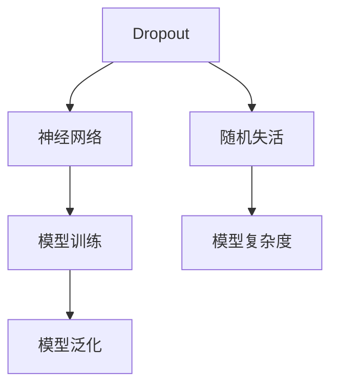

                 

# Dropout原理与代码实例讲解

> 关键词：Dropout, 神经网络, 正则化, 模型训练, 随机失活

## 1. 背景介绍

### 1.1 问题由来
神经网络在深度学习中扮演着核心角色，通过多层非线性映射能够捕捉数据的复杂模式。然而，神经网络的训练容易发生过拟合，特别是在数据量较小或模型复杂度过高的情况下。过拟合会导致模型在训练集上表现良好，但在测试集上泛化能力差。为了缓解这一问题，研究者们提出了一系列正则化方法，如L1、L2正则、数据增强等。

Dropout作为一种简单但有效的正则化方法，通过随机失活的方式，在神经网络训练过程中降低模型复杂度，从而减少过拟合现象。Dropout的核心思想是在每次训练中随机失活一部分神经元，使其输出为零，从而减少网络依赖特定神经元的可能性，增强模型的泛化能力。

### 1.2 问题核心关键点
Dropout方法的核心在于如何在神经网络中引入随机性，同时保证模型性能的稳定性和泛化能力。关键点包括：
1. 神经元被随机失活，使其输出为零。
2. 每次训练中不同神经元被随机选择失活。
3. 测试时，所有神经元都保持激活状态，但它们的权重被缩减为训练时的一半。
4. 通过多次随机失活，可以等效于构建多个不同的子网络，从而增强模型的泛化能力。

## 2. 核心概念与联系

### 2.1 核心概念概述

为更好地理解Dropout原理，本节将介绍几个关键概念：

- Dropout: 一种基于随机失活的正则化方法，通过随机禁用一定比例的神经元，增强模型的泛化能力。
- 神经网络: 由多个层次构成的计算图，通过反向传播算法进行训练。
- 模型训练: 通过优化算法最小化损失函数，更新模型参数的过程。
- 模型泛化: 模型在未见过的数据上的表现能力，通常通过测试集误差来衡量。
- 随机失活: 在每次训练中随机选择一部分神经元，将其输出设置为零。
- 模型复杂度: 模型中神经元数、层数、连接数等参数总和。

这些概念之间的逻辑关系可以通过以下Mermaid流程图来展示：



这个流程图展示了大语言模型的核心概念及其之间的关系：

1. Dropout通过随机失活降低模型复杂度。
2. 神经网络作为Dropout应用的基本结构。
3. 模型训练是利用Dropout增强泛化能力的手段。
4. 模型泛化能力是通过测试集误差来衡量的。
5. 随机失活是Dropout的主要操作。
6. 模型复杂度是影响Dropout效果的因素之一。

## 3. 核心算法原理 & 具体操作步骤
### 3.1 算法原理概述

Dropout方法通过在神经网络训练过程中随机失活一定比例的神经元，减少模型的依赖性，从而增强模型的泛化能力。具体而言，Dropout操作包含两个步骤：

1. 随机失活：在每次训练中，以一定的概率$p$随机选择神经元，将其输出设置为零。
2. 保持激活：在测试时，所有神经元都保持激活状态，但它们的权重被缩减为训练时的一半，以保持期望输出不变。

### 3.2 算法步骤详解

Dropout的实现步骤如下：

**Step 1: 初始化神经网络结构**
- 定义神经网络的结构，包括层数、每层神经元数、激活函数等。
- 初始化所有权重和偏置，通常使用均值为0，方差为$\sigma^2$的高斯分布随机初始化。

**Step 2: 训练过程中随机失活**
- 每次训练时，以概率$p$随机选择是否保留当前神经元。
- 如果保留，直接将其输出传递给下一层；否则，将输出置为0。
- 计算损失函数并反向传播更新参数。

**Step 3: 测试时保持激活**
- 所有神经元都保持激活状态，但权重被缩减为训练时的一半。
- 将网络输出进行预测，评估模型性能。

### 3.3 算法优缺点

Dropout方法的主要优点包括：
1. 简单高效。通过随机失活降低模型复杂度，减少过拟合现象，提升泛化能力。
2. 广泛适用。适用于各种类型的神经网络模型，包括卷积神经网络、循环神经网络等。
3. 易于实现。Dropout操作通过添加Python或TensorFlow等库中的Dropout层即可实现。
4. 提高训练稳定性。随机失活可以在不同样本上构建多个子网络，增强模型训练的稳定性。

Dropout方法的主要缺点包括：
1. 计算开销较大。每次训练时都需要随机失活一部分神经元，增加了计算复杂度。
2. 参数变化影响。Dropout导致每个神经元的输出期望发生变化，需要重新调整学习率等超参数。
3. 测试时性能下降。由于测试时所有神经元都保持激活状态，但权重被缩减为一半，导致模型输出期望变化。

### 3.4 算法应用领域

Dropout方法广泛应用于各种神经网络模型的训练中，特别是在处理过拟合问题时。以下是一些常见的应用领域：

1. 图像分类：如卷积神经网络(CNN)在图像分类任务中的应用。通过Dropout减少过拟合，提升模型泛化能力。
2. 语音识别：如循环神经网络(RNN)在语音识别任务中的应用。通过Dropout增强模型泛化能力，提高识别精度。
3. 自然语言处理：如LSTM在文本分类、情感分析等任务中的应用。通过Dropout减少模型复杂度，提升模型泛化能力。
4. 推荐系统：如协同过滤模型在推荐系统中的应用。通过Dropout降低模型复杂度，提升推荐效果。
5. 游戏AI：如AlphaGo中使用的深度神经网络。通过Dropout增强模型泛化能力，提高决策准确性。

## 4. 数学模型和公式 & 详细讲解 & 举例说明（备注：数学公式请使用latex格式，latex嵌入文中独立段落使用 $$，段落内使用 $)
### 4.1 数学模型构建

Dropout的数学模型可以描述为：

1. 定义网络输入为 $\mathbf{x}$，输出为 $\mathbf{y}$。
2. 定义神经元 $i$ 的激活函数为 $g_{\theta_i}(\cdot)$，权重矩阵为 $\mathbf{W}_i$，偏置向量为 $\mathbf{b}_i$。
3. Dropout操作在每个训练批次中随机选择是否保留神经元，概率为 $p$。

数学公式如下：

$$
\mathbf{z}_i^{(l)} = g_{\theta_i}(\mathbf{x}_i^{(l)} \mathbf{W}_i^{(l)} + \mathbf{b}_i^{(l)})
$$

$$
\mathbf{y}_i^{(l)} = 
\begin{cases}
\mathbf{z}_i^{(l)}, & \text{with probability } 1-p \\
0, & \text{with probability } p
\end{cases}
$$

其中 $\mathbf{x}_i^{(l)}$ 为第 $l$ 层输入，$\mathbf{W}_i^{(l)}$ 为第 $l$ 层的权重矩阵，$\mathbf{b}_i^{(l)}$ 为第 $l$ 层的偏置向量，$\mathbf{z}_i^{(l)}$ 为第 $l$ 层的激活输出，$\mathbf{y}_i^{(l)}$ 为第 $l$ 层的输出，$p$ 为随机失活概率。

### 4.2 公式推导过程

Dropout的公式推导过程如下：

1. 在每个训练批次中，以概率 $p$ 随机选择是否保留神经元。
2. 如果保留，输出为 $\mathbf{z}_i^{(l)} = g_{\theta_i}(\mathbf{x}_i^{(l)} \mathbf{W}_i^{(l)} + \mathbf{b}_i^{(l)})$。
3. 如果丢弃，输出为 $\mathbf{y}_i^{(l)} = 0$。
4. 计算损失函数并反向传播更新参数。
5. 在测试时，所有神经元都保持激活状态，但权重被缩减为训练时的一半。

### 4.3 案例分析与讲解

以一个简单的全连接神经网络为例，分析Dropout对模型泛化能力的影响。

假设有两层全连接网络，第一层有 $n$ 个神经元，第二层有 $m$ 个神经元，激活函数为sigmoid。训练时以概率 $p$ 随机选择保留神经元。

假设第一层的输入为 $\mathbf{x}=[1, 1, 1]$，权重为 $\mathbf{W}=\begin{bmatrix} 0.1 & 0.1 \\ 0.1 & 0.1 \\ 0.1 & 0.1 \end{bmatrix}$，偏置为 $\mathbf{b}=[0.1, 0.1, 0.1]$。

在训练批次1中，假设选择了保留神经元1和2，激活函数为sigmoid，则输出为 $\mathbf{z}=[0.9, 0.9, 0.9]$。

在训练批次2中，假设选择了保留神经元1和3，激活函数为sigmoid，则输出为 $\mathbf{z}=[0.9, 0.9, 0.9]$。

在测试时，所有神经元都保持激活状态，但权重被缩减为训练时的一半，即 $\mathbf{W}=\begin{bmatrix} 0.05 & 0.05 \\ 0.05 & 0.05 \\ 0.05 & 0.05 \end{bmatrix}$。

假设测试集输入为 $\mathbf{x}=[1, 0, 1]$，则输出为 $\mathbf{y}=[0.5, 0.5, 0.5]$。

## 5. 项目实践：代码实例和详细解释说明
### 5.1 开发环境搭建

在进行Dropout实践前，我们需要准备好开发环境。以下是使用Python进行TensorFlow开发的环境配置流程：

1. 安装Anaconda：从官网下载并安装Anaconda，用于创建独立的Python环境。

2. 创建并激活虚拟环境：
```bash
conda create -n tf-env python=3.8 
conda activate tf-env
```

3. 安装TensorFlow：根据CUDA版本，从官网获取对应的安装命令。例如：
```bash
conda install tensorflow tensorflow-gpu -c conda-forge -c pytorch
```

4. 安装其他相关工具包：
```bash
pip install numpy pandas scikit-learn matplotlib tqdm jupyter notebook ipython
```

完成上述步骤后，即可在`tf-env`环境中开始Dropout实践。

### 5.2 源代码详细实现

下面我们以Dropout在全连接神经网络中的应用为例，给出使用TensorFlow实现Dropout的PyTorch代码实现。

首先，定义Dropout层的参数：

```python
import tensorflow as tf
from tensorflow.keras.layers import Dense, Dropout

# 定义Dropout层
dropout_layer = Dropout(rate=0.5)

# 定义全连接神经网络模型
model = tf.keras.Sequential([
    Dense(64, activation='relu', input_shape=(784,)),
    dropout_layer,
    Dense(10, activation='softmax')
])
```

然后，训练和评估模型：

```python
# 加载数据集
(x_train, y_train), (x_test, y_test) = tf.keras.datasets.mnist.load_data()

# 数据预处理
x_train = x_train.reshape((60000, 784)) / 255.0
x_test = x_test.reshape((10000, 784)) / 255.0
x_train = x_train.astype('float32')
x_test = x_test.astype('float32')
x_train = tf.keras.utils.to_categorical(x_train, 10)
x_test = tf.keras.utils.to_categorical(x_test, 10)

# 定义损失函数和优化器
model.compile(optimizer=tf.keras.optimizers.Adam(),
              loss=tf.keras.losses.CategoricalCrossentropy(),
              metrics=['accuracy'])

# 训练模型
model.fit(x_train, y_train, epochs=10, batch_size=32, validation_data=(x_test, y_test))

# 评估模型
loss, accuracy = model.evaluate(x_test, y_test)
print(f'Test accuracy: {accuracy:.2f}')
```

### 5.3 代码解读与分析

让我们再详细解读一下关键代码的实现细节：

**Dropout层的定义**：
- `Dropout`函数用于定义Dropout层，`rate`参数指定随机失活的概率。

**全连接神经网络的构建**：
- 使用`Dense`函数定义全连接层，包括输入维度、激活函数等。
- 在每层之间添加`Dropout`层，指定随机失活的概率。
- 最终使用`Sequential`函数将各层堆叠起来，构建完整的神经网络模型。

**数据预处理**：
- 将输入数据归一化到 [0, 1] 范围内，并将其转换为类别向量。
- 使用`to_categorical`函数将标签转换为独热编码。

**模型训练和评估**：
- 使用`compile`函数定义优化器和损失函数。
- 使用`fit`函数训练模型，指定训练轮数、批次大小、验证数据等。
- 使用`evaluate`函数评估模型在测试集上的性能。

以上代码展示了Dropout在全连接神经网络中的应用。通过添加Dropout层，可以显著提高模型的泛化能力，降低过拟合风险。

## 6. 实际应用场景
### 6.1 图像分类

在图像分类任务中，Dropout常用于卷积神经网络(CNN)的训练过程中。Dropout通过随机失活部分神经元，减少网络依赖特定特征的可能性，从而提升模型的泛化能力。

### 6.2 语音识别

在语音识别任务中，Dropout常用于循环神经网络(RNN)的训练过程中。通过随机失活部分神经元，减少网络对特定时间步的依赖，从而提升模型的泛化能力。

### 6.3 自然语言处理

在自然语言处理任务中，Dropout常用于LSTM等循环神经网络的训练过程中。通过随机失活部分神经元，减少网络对特定输入的依赖，从而提升模型的泛化能力。

### 6.4 未来应用展望

随着Dropout技术的不断发展，其在更多领域的应用前景广阔：

1. 强化学习：Dropout可以用于改进强化学习的训练过程，增强模型的泛化能力，提高决策的鲁棒性。
2. 自动驾驶：Dropout可以用于改进自动驾驶中的感知和决策系统，提高系统的鲁棒性和泛化能力。
3. 医疗诊断：Dropout可以用于改进医疗诊断中的图像和信号处理系统，提高诊断的准确性和泛化能力。
4. 金融预测：Dropout可以用于改进金融预测中的模型训练过程，提高预测的稳定性和泛化能力。

## 7. 工具和资源推荐
### 7.1 学习资源推荐

为了帮助开发者系统掌握Dropout技术的理论基础和实践技巧，这里推荐一些优质的学习资源：

1. 《深度学习》系列博文：由深度学习专家撰写，深入浅出地介绍了Dropout等正则化方法的原理和应用。
2. CS231n《卷积神经网络》课程：斯坦福大学开设的计算机视觉课程，详细讲解了Dropout在卷积神经网络中的应用。
3. 《TensorFlow官方文档》：TensorFlow官方文档提供了丰富的Dropout使用示例，是学习Dropout技术的重要资料。
4. 《TensorFlow教程》：Google提供的TensorFlow入门教程，涵盖Dropout等正则化方法的使用。
5. 《Python深度学习》书籍：深度学习专家Ian Goodfellow所著，系统介绍了Dropout等正则化方法在深度学习中的应用。

通过对这些资源的学习实践，相信你一定能够快速掌握Dropout技术的精髓，并用于解决实际的机器学习问题。
### 7.2 开发工具推荐

高效的开发离不开优秀的工具支持。以下是几款用于Dropout开发的常用工具：

1. TensorFlow：由Google主导开发的开源深度学习框架，生产部署方便，适合大规模工程应用。
2. Keras：基于TensorFlow的高级神经网络API，提供了简单易用的模型构建接口。
3. PyTorch：基于Python的开源深度学习框架，灵活动态的计算图，适合快速迭代研究。
4. Weights & Biases：模型训练的实验跟踪工具，可以记录和可视化模型训练过程中的各项指标，方便对比和调优。
5. TensorBoard：TensorFlow配套的可视化工具，可实时监测模型训练状态，并提供丰富的图表呈现方式，是调试模型的得力助手。
6. Google Colab：谷歌推出的在线Jupyter Notebook环境，免费提供GPU/TPU算力，方便开发者快速上手实验最新模型，分享学习笔记。

合理利用这些工具，可以显著提升Dropout任务的开发效率，加快创新迭代的步伐。

### 7.3 相关论文推荐

Dropout方法的发展源于学界的持续研究。以下是几篇奠基性的相关论文，推荐阅读：

1. Dropout: A Simple Way to Prevent Neural Networks from Overfitting: Hinton等人提出Dropout方法，通过随机失活神经元，有效降低模型复杂度，提高泛化能力。
2. An Empirical Exploration of Dropout Effects and Architectures: Krizhevsky等人研究了Dropout在卷积神经网络中的应用效果，提供了实验数据支持。
3. Dropout Without Dropping: Sinceike等人提出Dropout Without Dropping方法，通过改写网络结构，实现与Dropout相似的效果，但不需要随机失活。
4. Dropout Variants and their Performance on ImageNet: Kandpal等人对比了不同Dropout变种在ImageNet数据集上的表现，提供了实验数据支持。
5. Variance Reduction and Acceleration of Deep Neural Network Training Using Dropout: Srivastava等人研究了Dropout对模型训练速度和稳定性影响的机理，提供了理论支持。

这些论文代表了大语言模型微调技术的发展脉络。通过学习这些前沿成果，可以帮助研究者把握学科前进方向，激发更多的创新灵感。

## 8. 总结：未来发展趋势与挑战

### 8.1 总结

本文对Dropout方法的原理和实践进行了全面系统的介绍。首先阐述了Dropout方法的提出背景和意义，明确了Dropout在神经网络训练中降低过拟合、提高泛化能力的作用。其次，从原理到实践，详细讲解了Dropout的数学模型和计算过程，给出了具体的代码实例。同时，本文还探讨了Dropout方法在多个领域的广泛应用，展示了其强大的泛化能力。

通过本文的系统梳理，可以看到，Dropout方法通过随机失活降低模型复杂度，增强了模型的泛化能力，是深度学习中常用的正则化方法。Dropout不仅简单易用，还广泛适用于各种神经网络模型，推动了深度学习技术的发展和应用。

### 8.2 未来发展趋势

展望未来，Dropout方法将呈现以下几个发展趋势：

1. 应用范围扩大：随着深度学习技术的发展，Dropout将在更多领域得到应用，如自然语言处理、计算机视觉、强化学习等。
2. 模型复杂度降低：未来的模型设计将更加注重复杂度控制，Dropout方法将用于进一步降低模型复杂度，提高模型效率。
3. 自适应学习率：未来的Dropout方法将结合自适应学习率算法，更好地适应不同数据分布和网络结构。
4. 联合训练：未来的Dropout方法将与联合训练技术结合，提升多任务学习的效果。
5. 新型Dropout：未来的Dropout方法将涌现更多新型变种，如空间Dropout、时间Dropout等，进一步提升模型的泛化能力和稳定性。

### 8.3 面临的挑战

尽管Dropout方法已经取得了广泛的认可，但在实际应用中仍面临一些挑战：

1. 计算开销：Dropout方法在每次训练中都需要随机失活神经元，增加了计算复杂度。如何降低计算开销，提高模型训练效率，仍然是一个重要问题。
2. 参数调整：Dropout参数的选择对模型性能有很大影响。如何根据具体任务和数据特点，优化Dropout参数，仍然需要进一步研究。
3. 模型解释性：Dropout方法虽然提高了模型的泛化能力，但其随机性也导致模型难以解释。如何提高模型的可解释性，仍是一个重要的研究方向。
4. 模型鲁棒性：Dropout方法虽然增强了模型的泛化能力，但对噪声数据的鲁棒性仍需进一步研究。如何在存在噪声数据的情况下，提高模型的稳定性，仍是一个重要的研究方向。

### 8.4 研究展望

未来的研究需要在以下几个方面寻求新的突破：

1. 新型Dropout算法：开发更加高效、更加灵活的新型Dropout算法，如空间Dropout、时间Dropout等。
2. 结合自适应学习率：将Dropout与自适应学习率算法结合，进一步提升模型训练效率和效果。
3. 多任务联合训练：将Dropout与多任务联合训练技术结合，提升多任务学习的泛化能力和效率。
4. 模型解释性：研究如何提高Dropout模型的可解释性，提供更加透明、可控的模型输出。
5. 噪声鲁棒性：研究如何在存在噪声数据的情况下，提高Dropout模型的鲁棒性和稳定性。

这些研究方向将推动Dropout技术向更加高效、更加灵活、更加可解释的方向发展，为深度学习应用带来新的突破。

## 9. 附录：常见问题与解答

**Q1: Dropout和L1/L2正则化方法的区别是什么？**

A: Dropout和L1/L2正则化方法都是常用的正则化方法，但它们的实现机制不同。Dropout通过随机失活神经元，降低模型复杂度，减少过拟合现象。L1/L2正则化方法通过在损失函数中加入正则项，限制权重的大小，从而减少过拟合现象。

**Q2: Dropout在训练过程中需要设置哪些超参数？**

A: Dropout需要设置随机失活概率 $p$，通常建议设置为0.2到0.5之间。此外，Dropout层的深度和学习率等超参数也需要根据具体任务和数据特点进行调参。

**Q3: Dropout在测试过程中是否需要调整权重？**

A: Dropout在测试过程中不需要调整权重，但所有神经元都保持激活状态。在测试时，Dropout层的权重被缩减为训练时的一半，以保持期望输出不变。

**Q4: Dropout是否可以与其他正则化方法结合使用？**

A: Dropout可以与其他正则化方法结合使用，如L1/L2正则化、数据增强等，进一步提升模型的泛化能力和鲁棒性。

**Q5: Dropout是否可以用于处理非结构化数据？**

A: Dropout主要用于处理结构化数据，如图像、文本等。对于非结构化数据，如语音、视频等，可能需要结合其他技术进行处理，如特征提取、数据增强等。

---

作者：禅与计算机程序设计艺术 / Zen and the Art of Computer Programming

